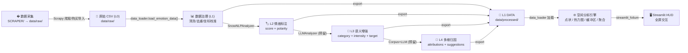
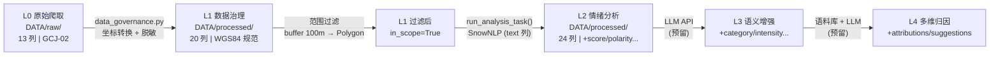
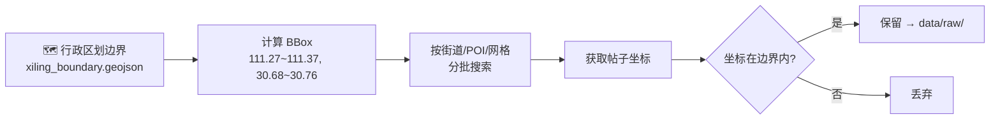

# 系统架构设计 (Architecture)

> 情绪地图 (Emotion Map) — 基于 NLP 情绪分析的城市感知与可视化平台  
> 将社交媒体/点评数据的情感分析结果映射到地理空间，辅助城市规划决策。

---

## 一、项目愿景

让城市规划者能"看见"市民情绪的空间分布——用数据替代直觉，用地图承载叙事。

**核心能力**：文本 → 情绪分数 → 地理映射 → 交互式可视化 → 决策支持

---

## 二、系统架构总览

> 架构按**从下至上**的顺序组织：数据从底层流入，逐层加工，最终在应用层呈现。

```
┌─────────────────────────────────────────────────────────────────┐
│                       🖥 应用层 (apps/)                           │
│  ┌──────────────────────────────────────────────────────────┐   │
│  │  app_main.py          Streamlit 全屏地图 HUD 应用          │   │
│  │  · 文件选择弹窗  · 数据概览/表格  · 坐标重复度分析          │   │
│  │  · 点状标记图  · 图例控制  · 注记切换  · 设置/调试          │   │
│  │  · 热点分析    · 空间聚合     · 分析控制台 (?page=console)  │   │
│  │  所有子页面通过 ?page= 路由，所有分析通过 run_analysis_task()│   │
│  └──────────────────────────────────────────────────────────┘   │
├─────────────────────────────────────────────────────────────────┤
│                       🧩 UI 组件层 (core/)                        │
│  ┌──────────────────────────────────────────────────────────┐   │
│  │  ui_components.py     可复用 Streamlit UI 组件库            │   │
│  │  · inject_fullscreen_css()  · hud_button_style_css()      │   │
│  │  · render_hud_button()      · render_legend_overlay()     │   │
│  │  · render_title_bar()                                      │   │
│  └──────────────────────────────────────────────────────────┘   │
├─────────────────────────────────────────────────────────────────┤
│                    🌐 空间分析引擎层 (core/)                       │
│  ┌──────────────────────────────────────────────────────────┐   │
│  │  map_engine.py         空间可视化与空间分析引擎             │   │
│  │                                                           │   │
│  │  【底图与渲染】                                            │   │
│  │  · create_base_map()        天地图 WMTS 底图 + 中文注记    │   │
│  │  · render_html()            CDN 国内镜像替换               │   │
│  │                                                           │   │
│  │  【空间可视化（已实现）】                                    │   │
│  │  · add_point_layer()        点状情绪标记（五级极性配色）     │   │
│  │  · add_heatmap_layer()      热点图（冷热分布 + 极性分布）   │   │
│  │                                                           │   │
│  │  【空间分析（MVP 新增）】                                   │   │
│  │  · add_buffer_analysis()    缓冲区分析（POI/设施辐射范围）  │   │
│  │  · add_admin_aggregation()  行政单元聚合（街道/社区汇总）   │   │
│  │                                                           │   │
│  │  工具选型：geopandas + shapely（自研，与现有栈统一）        │   │
│  │  未来扩展：turf.js（浏览器端运算）/ keplergl（高级可视化）   │   │
│  └──────────────────────────────────────────────────────────┘   │
├─────────────────────────────────────────────────────────────────┤
│                    🔬 数据分析引擎层 (SCRIPT/)                     │
│  ┌──────────────────────────────────────────────────────────┐   │
│  │  emotion_analysis_v1.py  可插拔情绪分析引擎 v1.0           │   │
│  │                                                           │   │
│  │  【L1 · 数据治理】                                         │   │
│  │  · 文本清洗 / 去重 / 坐标校准 → "城市情绪DATA"              │   │
│  │                                                           │   │
│  │  【L2 · 基础情绪分析 — SnowNLP（已实现）】                  │   │
│  │  · 综合情绪得分 + 五级极性 + 情绪关键词 + 置信度            │   │
│  │                                                           │   │
│  │  【L3 · LLM 语义增强 — 溯佰科平台（接口预留）】             │   │
│  │  · 情绪类别 + 强度 + 对象(设施/环境/服务/文化/事件)         │   │
│  │  · 溯佰科 = 城市规划时空大模型平台（数据底座+GIS+NL工作台） │   │
│  │  · 情绪地图未来以 Agent 方式嵌入溯佰科平台                 │   │
│  │                                                           │   │
│  │  【L4 · 多维归因分析 — 自研语料库+LLM（框架预留）】        │   │
│  │  · 情绪因果归因 + 改善建议 + 证据溯源                      │   │
│  │                                                           │   │
│  │  核心类：AnalyzerBase / SnowNLPAnalyzer / LLMAnalyzer     │   │
│  │  工厂函数：create_analyzer()    编排器：run_pipeline()     │   │
│  │  统一入口：run_analysis_task()（CLI/Tkinter/Streamlit 共用）│   │
│  └──────────────────────────────────────────────────────────┘   │
│  ┌──────────────────────────────────────────────────────────┐   │
│  │  run_analysis.py          命令行 + Tkinter 桌面入口         │   │
│  │  test_scripts.py           测试：逐条分析（小规模）          │   │
│  │  test_scripts_2.py         测试：向量化分析（大规模）         │   │
│  │  test_scripts_heatmap.py   测试：热点图独立调试              │   │
│  └──────────────────────────────────────────────────────────┘   │
├─────────────────────────────────────────────────────────────────┤
│                     📦 基础设施层 (core/)                        │
│  ┌──────────────────┐ ┌───────────────┐ ┌──────────────────┐   │
│  │  config.py        │ │ data_loader.py│ │  export.py        │   │
│  │  · 天地图 Key     │ │ · 统一入口    │ │  · CSV 导出       │   │
│  │  · 瓦片 URL       │ │ · CSV→结构体  │ │  · GeoJSON 导出   │   │
│  │  · 情绪颜色映射   │ │ · GeoJSON加载 │ │  · 自动建目录     │   │
│  │  · 情绪阈值       │ │ · 坐标检测    │ │  · 导出命名规范   │   │
│  │  · 热点图默认参数 │ │ · 列名兼容    │ │  {name}_{L级别}_  │   │
│  │  · 渐变色带       │ │              │ │  result_csv.csv   │   │
│  │  · CDN 替换       │ │              │ │                  │   │
│  └──────────────────┘ └───────────────┘ └──────────────────┘   │
├─────────────────────────────────────────────────────────────────┤
│                     🕷 数据采集层 (SCRAPER/)                      │
│  ┌──────────────────────────────────────────────────────────┐   │
│  │  data_scraper.py        多源数据爬取引擎                    │   │
│  │                                                           │   │
│  │  【采集策略：空间范围优先】                                  │   │
│  │  不直接搜索关键词（如"西陵区"），而是：                       │   │
│  │  1. 加载行政区划边界 Polygon（data/xiling_boundary.geojson） │   │
│  │  2. 按边界 BBox 或内部街道/POI 名称进行空间范围搜索          │   │
│  │  3. 过滤：仅保留坐标落在边界内的数据                         │   │
│  │                                                           │   │
│  │  【数据源】                                                │   │
│  │  · 大众点评 / 美团 / 小红书 / 微博 / 12345                  │   │
│  │  · 基于 Scrapy 框架（开源、成熟、插件丰富）                  │   │
│  │  · 备用方案：购买数据（稳定批量获取）                        │   │
│  │  · 输出到 → data/raw/                                     │   │
│  └──────────────────────────────────────────────────────────┘   │
├─────────────────────────────────────────────────────────────────┤
│                       💾 数据层 (data/)                          │
│  ┌──────────────────────────────────────────────────────────┐   │
│  │  data/raw/              L0 · 原始爬取数据                  │   │
│  │  · *_raw.csv            未经处理的原始文本 + 坐标           │   │
│  │                                                           │   │
│  │  data/processed/        L1~L4 · 分析结果                   │   │
│  │  · *_L1_result_csv.csv        治理后城市情绪DATA           │   │
│  │  · *_L2_result_csv.csv        SnowNLP 情绪地图DATA        │   │
│  │  · *_L3_result_csv.csv        LLM 增强情绪地图DATA        │   │
│  │  · *_L4_result_csv.csv        多维归因情绪地图DATA         │   │
│  │  · *_result_geojson.geojson   对应 GeoJSON 矢量文件        │   │
│  └──────────────────────────────────────────────────────────┘   │
└─────────────────────────────────────────────────────────────────┘
```

---

## 三、数据流与管道



**管道流程**：数据采集 → 原始数据(L0) → 数据治理(L1) → 情绪分析(L2→L3→L4) → 逐级导出(CSV/GeoJSON) → 空间可视化与分析 → 交互浏览

**关键设计**：
- 每一级分析结果独立导出，可溯源、可对比
- L2/L3/L4 是逐级叠加关系，L3 不破坏 L2 的字段，L4 不破坏 L3 的字段
- 空间分析引擎可加载任意级别的 DATA 进行可视化

---

## 四、数据层字段规范 (L0~L4)

> L0→L4 逐级叠加，每级不破坏前级字段。L0/L1/L2 已明确，L3/L4 接口预留。

### 4.1 存储位置与命名

| 层级 | 目录 | 命名模板 | 格式 |
|------|------|----------|------|
| L0 | `DATA/raw/` | `{source}_{YYYYMMDD}_{scope}_raw.csv` | CSV |
| L1 | `DATA/processed/` | `{name}_L1_result_csv.csv` | CSV |
| L2 | `DATA/processed/` | `{name}_L2_result_csv.csv` / `.geojson` | CSV + GeoJSON |
| L3 | `DATA/processed/` | `{name}_L3_result_csv.csv` | CSV |
| L4 | `DATA/processed/` | `{name}_L4_result_csv.csv` | CSV |

### 4.2 字段逐级对照

| # | 字段 | L0 | L1 | L2 | L3 | L4 | 类型 | 说明 |
|----|------|:--:|:--:|:--:|:--:|:--:|------|------|
| 1 | `source` | ✅ | ✅ | ✅ | ✅ | ✅ | str | 数据来源平台（xiaohongshu/dianping/…） |
| 2 | `url` | ✅ | ✅ | ✅ | ✅ | ✅ | str | 原文链接 |
| 3 | `crawl_time` | ✅ | ✅ | ✅ | ✅ | ✅ | datetime | 爬取时间（ISO 8601） |
| 4 | `title` | ✅ | ✅ | ✅ | ✅ | ✅ | str | 标题 |
| 5 | `text` | ✅ | ✅ | ✅ | ✅ | ✅ | str | 正文（情绪分析主文本源） |
| 6 | `comments` | ✅ | ✅ | ✅ | ✅ | ✅ | str | 评论（L1 脱敏清空；L2 以 text 为优先分析源） |
| 7 | `area` | ✅ | ✅ | ✅ | ✅ | ✅ | str | 爬取时的区域标签 |
| 8 | `tags` | ✅ | ✅ | ✅ | ✅ | ✅ | str | 原始标签 |
| 9 | `like_count` | ✅ | ✅ | ✅ | ✅ | ✅ | int | 点赞数 |
| 10 | `comment_count` | ✅ | ✅ | ✅ | ✅ | ✅ | int | 评论数 |
| 11 | `publish_time` | ✅ | ✅ | ✅ | ✅ | ✅ | str | 发布时间 |
| 12 | `lon_gcj02` | ✅ | ✅ | ✅ | ✅ | ✅ | float | 原始 GCJ-02 经度 |
| 13 | `lat_gcj02` | ✅ | ✅ | ✅ | ✅ | ✅ | float | 原始 GCJ-02 纬度 |
| 14 | `lon` | — | ✅ | ✅ | ✅ | ✅ | float | **规范经度 WGS84**（GeoJSON 导出用） |
| 15 | `lat` | — | ✅ | ✅ | ✅ | ✅ | float | **规范纬度 WGS84**（GeoJSON 导出用） |
| 16 | `x_cgcs2000` | — | ✅ | ✅ | ✅ | ✅ | float | EPSG:4546 投影 X（米） |
| 17 | `y_cgcs2000` | — | ✅ | ✅ | ✅ | ✅ | float | EPSG:4546 投影 Y（米） |
| 18 | `id_e` | — | ✅ | ✅ | ✅ | ✅ | str | 稳定行标识符（e0001~eNNNN，L1 生成，贯穿全管道） |
| 19 | `scope` | — | ✅ | ✅ | ✅ | ✅ | str | 空间过滤使用的边界名称 |
| 20 | `in_scope` | — | ✅ | ✅ | ✅ | ✅ | bool | 是否通过范围过滤（True=在边界内） |
| 21 | `score` | — | — | ✅ | ✅ | ✅ | float | L2 SnowNLP 综合情绪得分 0~1 |
| 22 | `polarity` | — | — | ✅ | ✅ | ✅ | str | 五级极性：Very Negative / Negative / Neutral / Positive / Very Positive |
| 23 | `keywords` | — | — | ✅ | ✅ | ✅ | str | jieba 情绪关键词（逗号分隔） |
| 24 | `confidence` | — | — | ✅ | ✅ | ✅ | float | 置信度 0~1（L2 默认 1.0） |
| 25 | `category` | — | — | — | ✅ | ✅ | str | L3 情绪类别（喜悦/愤怒/悲伤/惊讶/厌恶/恐惧/中性） |
| 26 | `intensity` | — | — | — | ✅ | ✅ | float | L3 情绪强度 0~1 |
| 27 | `target_type` | — | — | — | ✅ | ✅ | str | L3 情绪对象类型（设施/环境/服务/文化/事件） |
| 28 | `target_detail` | — | — | — | ✅ | ✅ | str | L3 情绪对象具体描述 |
| 29 | `attributions` | — | — | — | — | ✅ | json | L4 归因列表 [{"cause":…, "weight":…, …}] |
| 30 | `suggestions` | — | — | — | — | ✅ | json | L4 改善建议 ["建议1", "建议2", …] |

> **列数**：L0=13 → L1=20（+7） → L2=24（+4） → L3=28（+4） → L4=30（+2）

### 4.3 坐标规范

| 列名 | 坐标系 | 用途 | 生成阶段 |
|------|--------|------|----------|
| `lon_gcj02` / `lat_gcj02` | GCJ-02（火星坐标） | 原始记录留存，不可溯源时置 None | L0→L1 保留 |
| `lon` / `lat` | **WGS84 (EPSG:4326)** | 规范坐标，所有地图渲染/GeoJSON 导出/空间分析均以此为准 | L1 由 GCJ-02 数学转换 |
| `x_cgcs2000` / `y_cgcs2000` | CGCS2000 EPSG:4546 | 宜昌城市规划标准投影（米制），buffer/面积等运算用 | L1 由 WGS84 投影转换 |

> 转换链路：**GCJ-02 → WGS84（数学，~100-700m 偏移）→ CGCS2000 EPSG:4546（投影，<1m 偏差）**

### 4.4 处理关系



### 4.5 关键设计决策

| 决策 | 说明 |
|------|------|
| `lon`/`lat` = WGS84 | 规范坐标列，`export_to_geojson()` 默认使用，GeoJSON EPSG:4326 语义正确 |
| `id_e` 在 L1 生成 | 稳定行标识，贯穿 L2/L3/L4 不变，比在 L2 生成更早更可靠 |
| `comments` 置空不删除 | 保留列结构一致性；`run_pipeline` 文本优先级 `text` > `comments` |
| 不存储 `polarity_ternary` | 三级极性可从五级动态推导，避免冗余 |
| `scope` + `in_scope` | 明确记录边界名称和过滤结果，L1 全量保存包含被过滤的行 |

---

## 五、核心模块设计

### 5.1 数据分析引擎 — 可插拔 + 逐级叠加

详见 `emotion_analysis_v1.py`

| 级别 | 引擎 | 输入 | 输出 | 状态 |
|------|------|------|------|------|
| **L1** | 数据治理管道 | L0 原始CSV | 城市情绪DATA（清洗/去重/校准） | ⬜ 待建 |
| **L2** | `SnowNLPAnalyzer` | L1 DATA | 情绪地图DATA（score + polarity + keywords） | ✅ 已实现 |
| **L3** | `LLMAnalyzer` | L2 DATA | 增强DATA（+ category + intensity + target） | ⚠️ 接口预留 |
| **L4** | 归因引擎 | L3 DATA | 归因DATA（+ attributions + suggestions） | 🔮 框架预留 |

**关于溯佰科**：溯佰科不是一个大语言模型，而是我公司正在开发中的**城市规划时空大模型平台**——集成城市数据底座、各种 GIS 工具的自然语言工作平台。情绪地图未来将以 **Agent** 的方式嵌入溯佰科平台，依托其数据底座、自然语言对话模组以及本地部署的算力来搭建成熟化产品。MVP 阶段先用开源方案跑通全流程。

| 组件 | 角色 | 说明 |
|------|------|------|
| `AnalyzerBase` (ABC) | 抽象接口 | 定义 `analyze_single()` / `analyze_batch()` / `get_capabilities()` |
| `SnowNLPAnalyzer` | 当前引擎 | 轻量、离线、中文友好；仅输出 score + polarity |
| `LLMAnalyzer` | 模板/预留 | L3 语义增强引擎（溯佰科平台接入预留）；支持 category / intensity / target |
| `create_analyzer()` | 工厂 | 一行切换引擎：`create_analyzer('snownlp')` → `create_analyzer('llm')` |
| `run_pipeline()` | 编排器 | 加载 → 分析 → 标注 → 导出，一键执行 |
| `run_analysis_task()` | 统一入口 | CLI / Tkinter / Streamlit 三个入口共用同一个分析入口 |

**设计理念**：Pipe and Filter — 每个阶段独立、可替换、可测试。L1→L2→L3→L4 逐级叠加，每级输出可独立消费。

### 5.2 数据加载 — 统一入口

`data_loader.load_emotion_data()` 自动识别文件类型和列名：
- CSV/TSV：检测 `lon/lat` 列或 `coordinate` 元组列
- GeoJSON：解析 FeatureCollection → 结构化数据
- 返回统一字典格式：`{lats, lons, scores, df, n_points}`

### 5.3 空间分析引擎 — 双模式可视化 + 空间分析

**底图方案**：天地图 WMTS（影像 + 注记），CDN 自动替换为国内镜像。

#### 5.3.1 空间可视化（已实现）

| 模式 | 用途 | 实现 |
|------|------|------|
| 点状标记 (`CircleMarker`) | 精确点位，单点查看详情 | `add_point_layer()` |
| 热力图 (`HeatMap`) | 密度分布，宏观趋势 | `add_heatmap_layer()` |
| └ 冷热分布 (Hot/Cold) | 等权重密度，看"哪里讨论多" | gradient 白→黄→橙→红 |
| └ 极性分布 (Polarity) | 情绪分数加权，看"正面/负面聚集" | 绿渐变(正面) / 灰渐变(负面) |

#### 5.3.2 空间分析（MVP 规划）

| # | 功能 | 说明 | 实现路径 | 优先级 |
|---|------|------|----------|--------|
| 1 | **热点分析** | 情绪密度空间分布、冷热/极性两种模式 | 已有基础（HeatMap），需增强参数调节 | ⭐⭐⭐ |
| 2 | **缓冲区分析** | 围绕 POI/设施（如地铁站、公园、学校）的辐射范围情绪聚合 | geopandas + shapely 自研 | ⭐⭐⭐ |
| 3 | **行政单元聚合** | 按行政区划/街道/社区汇总情绪均值、标准差、正负比 | geopandas spatial join | ⭐⭐ |

#### 5.3.3 空间分析工具选型建议

| 方案 | 优点 | 缺点 | 建议 |
|------|------|------|------|
| **geopandas + shapely**（自研） | 与现有 Python 栈一致、零额外依赖、可控性强 | 复杂空间运算需手写 | ✅ MVP 首选 |
| **turf.js**（浏览器端） | 前端实时计算、用户体验好 | 需 JS 桥接、大数据量性能受限 | 🔜 中期引入 |
| **keplergl**（高级可视化） | 视觉效果极佳、支持 GPU 渲染 | 依赖重、定制化难 | 🔮 长期可选 |
| **QGIS Server / GeoServer** | 企业级功能、标准 OGC 服务 | 部署运维成本高、过度设计 | ❌ MVP 不推荐 |

**决策**：MVP 阶段使用 **geopandas + shapely 自研**，理由：
1. 与现有 Python 技术栈完全一致，学习成本为零
2. 空间连接（spatial join）、缓冲区（buffer）、聚合（dissolve）等核心功能均有成熟 API
3. 结果可直接导出为 GeoJSON，无缝对接到 Folium 地图
4. 未来如需更复杂的空间统计（Moran's I、Getis-Ord Gi*），pysal 库可平滑集成

#### 5.3.4 成果展示形式

| 成果类型 | 格式 | 用途 |
|----------|------|------|
| 交互式地图 | Folium HTML (嵌入 Streamlit) | 在线浏览、探索式分析 |
| 矢量图层 | GeoJSON | 导入 QGIS/ArcGIS 进一步分析 |
| 统计图表 | Altair (嵌入 Streamlit) | 情绪分布直方图、时序折线图 |
| 聚合报表 | CSV / DataFrame | 按行政单元的汇总指标表 |

### 5.4 数据采集层 — 空间范围优先策略

> 状态：Scrapy 框架已搭建，空间边界已获取（`data/xiling_boundary.geojson`）

#### 核心原则：空间范围优先，关键词仅为辅助

```
第一优先级：行政区划边界 Polygon 内的地理位置搜索
辅助手段：  关键词搜索（用于发现边界内的 POI/地名）
```

**原因**：市民发帖时说"解放路""CBD""滨江公园"，而不是"西陵区解放路"。
关键词搜索只能作为发现内部地名的辅助工具，不能作为主要采集手段。

**适用范围**：此策略适用于所有平台和数据类型——
大众点评、美团、小红书、微博、12345 等均以空间范围为第一过滤条件。

#### 采集流程



#### 数据源

| 数据源 | 内容类型 | 空间搜索方式 | 优先级 |
|--------|----------|-------------|--------|
| 大众点评 | POI 评价 + 坐标 | 按行政区/商区筛选 | ⭐⭐⭐ |
| 美团 | 商户评论 | 按地理范围筛选 | ⭐⭐ |
| 小红书 | 笔记/攻略 | 按地点标签/附近搜索 | ⭐⭐⭐ |
| 微博 | 签到/话题 | 按地理围栏搜索 | ⭐ |
| 12345 热线 | 投诉工单 | 按街道/社区筛选 | ⭐⭐⭐ |

#### 边界数据来源

西陵区行政区划边界来自 **DataV.GeoAtlas**（阿里云，免费），adcode=420502。

```
Bounding Box: 111.2664°E ~ 111.3722°E, 30.6783°N ~ 30.7579°N
中心点: 111.2955°E, 30.7025°N
边界点数: 73 个
```

---

## 六、技术选型

| 层级 | 技术 | 选型理由 |
|------|------|----------|
| 前端框架 | **Streamlit** | Python 原生，零前端代码，适合数据科学原型 |
| 地图可视化 | **Folium** | Leaflet.js 的 Python 封装，轻量成熟 |
| 底图服务 | **天地图 WMTS** | 国内访问稳定，无需翻墙，影像清晰 |
| 空间分析 | **geopandas + shapely**（MVP） | 与现有栈统一，核心空间运算成熟；未来可接 pysal（空间统计） |
| 情绪分析 | **SnowNLP**（L2） | 轻量（~10MB）、离线、中文优化 |
| LLM 增强 | **溯佰科平台**（L3 预留） | 城市规划时空大模型平台（数据底座+GIS+NL工作台），情绪地图以 Agent 嵌入 |
| 数据处理 | **Pandas + GeoPandas** | 表格/地理数据的事实标准 |
| 图表 | **Altair** | 声明式语法，与 Streamlit 深度集成 |
| 数据采集 | **Scrapy**（拟定） | 开源成熟爬虫框架，插件丰富；备用方案为购买数据 |
| 分词/关键词 | **jieba** | 中文分词事实标准，轻量高效 |

### 技术选型原则

1. **Python 优先**：全栈 Python 降低维护成本和学习曲线
2. **渐进式增强**：SnowNLP → LLM → 溯佰科，每一步可独立验证
3. **国内可用性**：天地图底图、CDN 镜像，确保国内访问体验
4. **MVP 最小化**：先跑通 2-3 个核心功能，验证价值后再扩展

### 为什么 SnowNLP 先行？

1. **零门槛**：`pip install snownlp` 即可，无需 GPU/API Key
2. **快速验证**：分钟级处理千条数据，适合 MVP 迭代
3. **本地化潜力**：不准确 → 可针对性构建本地语料库 → 成为研究亮点
4. **可替换**：通过 `AnalyzerBase` 接口，切换 LLM 只需一行代码

---

## 七、落地场景（7 大应用场景）

| # | 场景 | 核心能力 | 典型问题 |
|---|------|----------|----------|
| ① | **更新排序** | 情绪热力图 + 空间密度 | "哪个片区最需要优先更新？" |
| ② | **微更新定位** | 点状标记 + 负面聚合 | "具体哪个 POI 被吐槽最多？" |
| ③ | **城市体检** | 时序对比 + 指标聚合 | "本季度居民满意度如何变化？" |
| ④ | **营商环境** | 商户口碑分析 + 竞品对比 | "哪条街的商户满意度最高？" |
| ⑤ | **活动评估** | 活动前后情绪变化 | "啤酒节对周边居民情绪影响？" |
| ⑥ | **12345 预警** | 高频负面 + 空间聚类 | "哪里投诉在快速聚集？" |
| ⑦ | **生活圈品质** | 15 分钟生活圈情绪画像 | "这个社区的幸福感怎么样？" |

---

## 八、演进路线

```
Phase 1 ✅  已完成 (2026-05-28 ~ 06-11)
├── SnowNLP 情绪分析管道 (L2)
├── 点状标记 + 热力图可视化
├── Streamlit HUD 全屏应用
├── CSV/GeoJSON 导入导出
├── 模块化重构（core/ + SCRIPT/ + apps/）
├── 文档体系建立（docs/ 五文件）
├── Agent 协作体系搭建（6 Agent + AGENTS.md）
└── 入口统一（CLI/Tkinter/Streamlit 共用 run_analysis_task）

Phase 2 ⬜  进行中 (2026-06-12 ~ )
├── 系统架构优化（数据采集层 + 空间分析引擎层 + L1数据治理）
├── 数据爬取方案确定 + 西陵区真实数据采集
├── 空间分析 MVP（缓冲区分析 + 行政单元聚合）
├── LLM 引擎接入（溯佰科平台）
├── 时序分析（不同时间切片对比）
├── 多文件对比模式
├── 统计面板增强（置信区间、趋势线）
└── 自动化测试

Phase 3 ⬜  规划中
├── 溯佰科 Agent 嵌入开发
├── 自定义语料库训练
├── 空间自相关分析（Moran's I）
├── 对策映射引擎（情绪 → 规划建议）
├── Web 部署（Docker + 云服务器）
└── 移动端适配
```
