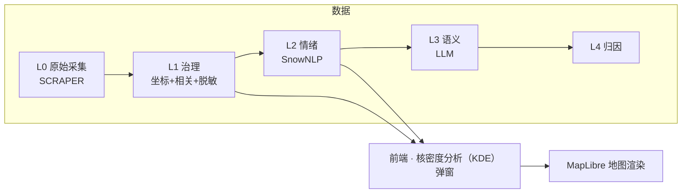
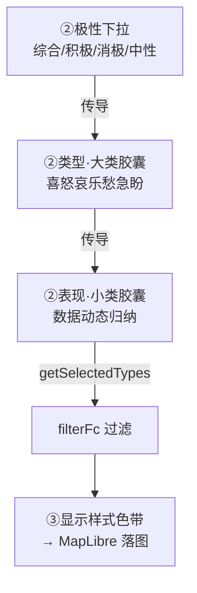

# 修订日志 (Revision Log)

> **定位**：用户需求 → 设计决策 → 落地。从"为什么这么改"的视角记录每一次修订。
> **视角**：用户意图（非程序员表述 → 专业精炼）为主，技术落地为辅。
> **维护**：每次合并需求后，AI 按板块自动追加一条；跨板块的设计主线变更同步更新第 4 节。
> **起算**：2026-06-18（前端迁移期）。更早的技术心得见 `dev-notes.md`，每日任务见 `todo.md`。

---

## ★ 任务路线图（模块化任务树）

> 开发时主看本文件即可（历史修订见第 5 节）。树按 **主干（系统架构）→ 分支（功能模块）→ 临时分支（搁置 / 待决策）** 组织，聚焦架构搭建与模块开发；不记 todo 执行细节（见 `todo.md`）、不带日期戳。
> 状态：✅ 完成 / 🔄 进行中 / ⬜ 待启动（下一步或未来） / ⏸ 搁置 / ❌ 否决。◆ = 架构转折点（解锁下游）。新分支产生即追加（AI 全程维护）。

**树状结构**：

```text
emotion_map（根）
│
├─ 主干 · 系统架构（奠基层）
│  ├─ 七层骨架 ✅  frontend · apps · core · SCRIPT · SCRAPER · DATA · design
│  ├─ Import 管道 ✅  geojson.io 1:1 外壳 + 多格式 + CRS 自动投影
│  ├─ 外壳/控件/视觉 ✅  MapLibre GL + 天地图 + Design Token 双主题
│  ├─ 数据采集 Scrapy ✅  框架就绪
│  ├─ 数据管道 L0→L4 🔄  L0→L1→L2 通（L1 待 API Key 验证）｜L3 语义 ⬜｜L4 归因 ⬜
│  └─ Harness · MCP/Agent ✅  v2.1：8 Agent 编排 + 7 MCP（智谱优先）
│
├─ 分支 · 功能模块
│  ├─ 核密度分析（KDE）弹窗 🔄
│  │  ├─ 批1 快赢 🔄  1a 预览图 ⏸｜1b 小类配色 ✅
│  │  ├─ 批2 全局时间轴 ⬜  ◆ 架构转折点（解锁批3/4）
│  │  ├─ 批3 3D 渲染 ⬜  地形凸凹 / 网格柱体（依赖批2）
│  │  ├─ 批4 时间对比 ⬜  A/B 双窗（依赖批2）
│  │  └─ 批5 图层分组 🔄  5A 自动归类 ✅｜5B 自由编组 ⬜
│  ├─ 图层/设置/Overview 🔄  联动 ✅｜Layers 分组重做 ✅
│  ├─ Toolbox 工具箱 🔄  多维归因分析 ⬜（自 KDE ① 剥离）
│  ├─ Range 范围分析 ⬜  缓冲区 / 叠加 / 行政单元聚合
│  ├─ Analysis 情绪分析接入 ⬜  L2 管道接前端 / 空间分析 MVP
│  └─ Table 数据表格 ⬜  列表 / 筛选 / 导出
│
└─ 临时分支（搁置 / 待决策）
   ├─ KDE 批1 1a 预览图 ⏸  等 terrain/factor kepler 截图补齐
   ├─ 高级参数 bug（C5）⏸  暂不修
   └─ 待决策  KDE 批2 粒度｜批3 地形 vs 柱体
```

---

## 1. 三份记录的分工

| 文档 | 视角 | 回答什么 | 读者 |
|------|------|----------|------|
| **revision-log.md（本文件）** | 用户意图 + 设计决策 | "我提过什么要求、为什么、怎么落地" | 你（回顾）+ AI（熟悉开发意图） |
| `dev-notes.md` | 开发者技术心得 | "怎么实现的、踩了什么坑、学到什么" | 开发者 |
| `todo.md` | 每日任务 + 执行日志 | "今天干了什么、明天干什么" | 当日推进 |

> 三者互补不重复：本文件记**意图与决策**，技术细节回链 dev-notes/todo 的对应日期。

---

## 2. 术语表（全站统一，杜绝混用）

| 术语 | 含义 | 易混点 |
|------|------|--------|
| **类型（大类）** | 情绪 7 大类：**喜怒哀乐愁急盼**，固定、高度抽象 | 不要和"小类"混用 |
| **表现（小类）** | 数据中 `emotion_type` 动态归纳（不满抱怨/焦虑担忧…），数量不固定 | 是大类的"具体表现" |
| **极性** | 综合 / 积极 / 消极 / 中性（L2 字段） | 积极=喜+乐，消极=怒+哀+愁，中性=急+盼 |
| **栏** | 占满整行的单条内容（如 Layers 图层行、③显示样式行） | 选中态=浅蓝填充 |
| **选项** | 一行多条、需单选/多选（如分析类型卡、类型/表现胶囊） | 选中态=粗蓝框+浅灰填充 |
| **L0–L4** | 数据分级：L0 原始 → L1 治理(置信度) → L2 情绪(SnowNLP) → L3 LLM → L4 归因 | L1 无情绪字段，仅 L2 有类型/表现 |
| **色带分段条** | kepler 风格离散色块拼接（非无极渐变） | 全站色带统一用此形式 |
| **核密度分析（KDE）** | Kernel Density Estimation，热力图底层算法（点→连续密度面） | **禁用"热核"简称**；英文标识符 `heatmap` 保留 |

---

## 3. 板块总览

| 板块 | 状态 | 主文件 | 最近活跃 |
|------|------|--------|----------|
| 前端 · 核密度分析（KDE）弹窗 | 🔄 活跃 | `frontend/js/heatmap-tool.js` `css/dialog.css` | 2026-06-20 |
| 前端 · Import 管道 | ✅ 稳定 | `frontend/js/import.js` | 2026-06-18 |
| 前端 · 图层/设置/Overview | 🔄 活跃 | `sidebar.js` `settings.js` `panel.js` | 2026-06-20 |
| 前端 · 外壳/控件/视觉 | ✅ 稳定 | `map-controls.js` `popup.css` `tokens` | 2026-06-17 |
| 数据管道 · L0→L4 | 🔄 待验证 | `SCRIPT/data_governance.py` `emotion_analysis_v1.py` | 2026-06-19 |
| 数据采集 · Scrapy | ✅ 框架就绪 | `SCRAPER/` | 2026-06-12 |
| Harness · MCP/Agent/闭环 | ✅ v2.1 | `.claude/` `docs/mcp-strategy.md` | 2026-06-17 |



---

## 4. 设计意图脉络（关键决策演进）

把散落在各次需求里的"为什么"提炼成几条主线。**任何接手的 AI 都应先读这一节**，理解项目的设计哲学。

### 4.1 配色统一 kepler 化
- 所有色带改为 **kepler 离散分段条**（色块拼接），不用无极 linear-gradient——视觉更专业、与 kepler 一致。
- 色板取值采样自 kepler 源码内置方案：网格暖色谱 ≈ Global Warming；7 色分类 ≈ UberPool 6 色 + 补 1 色；L1 默认单色改橙红（ColorBrewer Reds）。
- **全站色带位置一致**：核密度分析（KDE）弹窗 ③、Overview、要素设置弹窗都用 `.segmented` 分段条。

### 4.2 术语二分：类型 ↔ 表现
- 早期"情绪类型"一词既指大类又指小类，混乱。
- **统一**：类型 = 大类（喜怒哀乐愁急盼，固定 7）；表现 = 小类（动态归纳）。所有 UI 文案、Overview、代码命名按此二分。
- 极性 → 大类是固定传导：积极=喜+乐，消极=怒+哀+愁，中性=急+盼。

### 4.3 选中态二分：栏 ↔ 选项
- 全站选中态原本各处不一（有的浅蓝填充、有的蓝边）。
- **统一两种语义**：栏（占满整行）= 浅蓝填充无边框；选项（一行多个）= 粗蓝框 + 浅灰填充。
- 悬停态也统一：栏和选项 hover 都是浅灰、不加框（与 Layers 行一致）。

### 4.4 弹窗三阶引导
- 原弹窗三阶是"分析什么/怎么显示/调参数"，参数项喧宾夺主。
- **重排**：①选择分析类型 → ②选择数据源（数据/极性/类型/表现，自上而下联动传导）→ ③显示样式（随①②联动）。
- 参数（半径/透明度/权重…）降级进"高级"折叠区，不再占引导编号。

### 4.5 数据流联动：极性 → 大类 → 小类 → 落图
- 早期"选大类/小类对落图无影响"——因为"全选=不过滤"规则把效果吞了。
- **修正**：每次点击都必须在落图上见效；大类全空 = 全不要（非"全选"）；空数组明确拦截。
- L1 无情绪字段时，类型/表现胶囊不渲染（显示禁用提示），不再用兜底值"期待建议"误导。



### 4.6 "继续编辑"语义：H 按钮继承参数
- 点图层上的 H 要素按钮，应**以该图层当初生成时的参数**继续编辑，而非弹空白默认窗。
- 落地：`generateHeatmap` 把 UI 选择持久化进 `paint._ui`；`openHeatmapDialog(layerId)` 反推填回所有控件。**这是全站交互范式**——"再次打开 = 当初参数"。

### 4.7 取消按钮弱化
- 取消/次要按钮统一：白底 + 深灰字 + 细线框 + 悬停变灰，**不填充**，弱化重要性。主操作按钮保持蓝底白字。

### 4.8 主线收敛与反复（复盘）

定期回看哪些主线已稳定、哪些还在反复——暴露设计上的犹豫点。

| 主线 | 状态 | 反复点 / 张力 | 收敛方向 |
|------|------|--------------|----------|
| 配色 kepler 化 | ✅ 已收敛 | 初期按 YlOrRd / Tol Bright 推测取色，后改为采样用户提供的两张参考图 | 以采样图为准，色板不再频繁更换 |
| 术语二分（类型/表现） | ✅ 已收敛 | "情绪类型"一词早期既指大类又指小类；Overview 曾用小类却标"类型" | 全站统一，新 UI 按此二分 |
| 选中态二分（栏/选项） | ✅ 已收敛 | 各处原本不一（1px 蓝边 / 浅蓝填充 / 灰底混用） | 两语义类 `.is-bar-sel` / `.is-opt-sel` |
| 三阶引导 | ✅ 已收敛 | 参数项曾占引导编号，喧宾夺主 | 参数降级进"高级"折叠 |
| H 继承参数 | ✅ 已收敛（范式） | 初版 H 弹空白默认窗 | `paint._ui` 持久化 + 反推；作全站范式 |
| 取消按钮弱化 | ✅ 已收敛 | — | 全站次要按钮统一 |
| 数据流联动 | 🔄 反复中 | "全选=不过滤"曾吞掉效果；L1 兜底值误导；"大类全空"语义（全选 vs 全不要）反复 | 已修正为"每次点击见效"，但传导链路复杂 |
| 3D 渲染 | ⚠️ 占位 | 地形凸凹 / 网格柱体均为 dev 占位 | 待 deck.gl 接入后重审样式与数据源耦合 |

**需持续警惕的张力点**：
- **数据流联动**是当前最复杂链路（极性→大类→小类三层传导 + L1/L2 字段差异）。新增分析类型或数据层级时最易引入回归，须连带测试传导。
- **3D 占位**：③里多个 dev 样式，接入真实渲染后需重新审视"样式↔数据源↔维度"的耦合关系。

### 4.9 否决的方案（Why Not）

记录被明确否决的设计选择及原因，**避免后续重复提出**。

| 方案 | 否决原因 | 落地替代 |
|------|----------|----------|
| 保留"纯密度（density）"分析类型 | 与"情绪地图"定位冲突——纯密度不暗示情绪，弱化产品叙事 | 删除；舆情热度由 L1 综合彩虹承载 |
| 积极配消极红、消极配积极绿（反转配色） | 与全站"红=消极 / 绿=积极"约定相反，误导 | 纠正为正向：积极→绿，消极→红 |
| 积极/消极分析可选 L1 数据 | 积极/消极是 L2 专属字段，L1 无此字段 | 选积极/消极时数据下拉锁定 L2 |
| 独立 2D/3D 切换开关 | 2D/3D 已并入③每个样式命名（热力网格 / 网格柱体），独立开关冗余 | 删除 `#hm-dim`，③样式自带维度 |
| "全选小类 = 不过滤"规则 | 吞掉选中态视觉反馈，用户感觉"改了没用" | 打破：每次点击都过滤；全空 = 全不要 |
| L1 用 polarity 兜底派生"期待建议"小类 | L1 无情绪字段，兜底值制造假数据感 | L1 不渲染类型/表现胶囊，显禁用提示 |
| 7 大类用 Tol Bright 标准色板 | 用户提供了具体参考图（图2），标准色板与之不符 | 采样图2（UberPool 6 色）+ 补第 7 色 |
| 色带用无极 linear-gradient | 与 kepler 分段条设计语言不一致 | 全站改离散分段条 |

### 4.10 设计公约速查（后续必须遵守）

新增 UI / 改动时，逐条核对是否合规：

1. **色带**一律离散分段条（`.segmented`），禁无极渐变。
2. **文案**：类型 = 大类（喜怒哀乐愁急盼）/ 表现 = 小类（动态归纳），不混用。
3. **选中态**：栏 = `.is-bar-sel`（浅蓝填充无边框）/ 选项 = `.is-opt-sel`（粗蓝框 + 浅灰填充）。
4. **悬停**：栏与选项都浅灰、不加框（与 Layers 行一致）。
5. **再次打开图层配置** = 继承当初参数（`paint._ui` 反推），非空白默认。
6. **次要/取消按钮** = 白底 + 深灰字 + 细线框 + 悬停变灰，不填充；主操作按钮蓝底白字。
7. **新弹窗**按三阶引导（①分析类型 → ②数据源 → ③显示样式），参数进"高级"折叠。
8. **术语**：核密度分析（KDE），**禁用"热核"简称**；英文标识符 `heatmap` 保留。

---

## 5. 修订记录（按板块分组，组内倒序）

> 每条格式：`日期 · commit · 用户意图（精炼） → 落地 · 文件`

### 5.1 前端 · 核密度分析（KDE）弹窗（核心）

| 日期 | commit | 用户意图 → 落地 | 文件 |
|------|--------|----------------|------|
| 06-22 | 本次 | H 按钮重生成（原样再点生成）→ 热力图消失、眼睛救不回。**根因（Playwright + paint 查证）**：`openHeatmapDialog` 反推 opacity 时百分比/比例混用——`sp.opacity` 是 0~1（paint 存储）却直接赋给百分比控件（0~100），被 type=range clamp 到 1，`generateHeatmap` 读 `1/100=0.01` 几乎透明 = "消失"；眼睛 toggle 用同一 paint 仍 0.01 = 救不回。**修复**：反推时 `Math.round(sp.opacity*100)` 统一为百分比（首次用 DEFAULTS.opacity=70）。**附带**：`buildWeightExpression` 加 `to-number` 强转（修 MapLibre worker string 类型告警，健壮性）。**配套**：① 编辑分支原地更新（激活 `editLayerId`，4.6「继续编辑」语义，layer id 稳定）；② `serve.py` 拦截 .js 注入 `import ?v=<mtime>`，破 Chrome module graph 缓存（旧 serve 只 main.js 带 ?v，子 module 缓存旧版致 F5 失效） | `heatmap-tool.js` `map.js` `serve.py` |
| 06-22 | 本次 | **订正上轮**（上轮"放弃高密度=最强情绪"破坏 density 语义，错）：类型细分色带方向与胶囊反向 → stops **恢复** density 弱→强（高值=热核=喜/怒/急，不可变约束），显示层新 helper `rampDisplaySegs()` 对类型细分反转（高→低对齐胶囊序）。数据轴与显示轴分离——地图 paint 用 stops 原序（热核=强情绪），弹窗③/图例/Overview 显示反转；图例标注类型细分随之反转（左密集/右稀疏） | `state.js` `heatmap-tool.js` `heatmap-legend.js` `panel.js` |
| 06-22 | 本次 | 小类胶囊色与大类色板冲突（"不满抱怨"=橙却属大类"愁"=紫）→ 小类色**按大类派生**：单小类=大类色，愁类 2 小类用紫色系明度梯度（焦虑担忧中紫 `#A569BD` / 不满抱怨深紫 `#7D3C98`）。调用点不动（`EMOTION_TYPE_COLORS[t]` 值变即生效） | `state.js` |
| 06-21 | `e5bc20` | 剔除 KDE 弹窗归因卡片组（factor/attribution），改作 Toolbox 独立工具；①回归 2 排，窗口高度收紧（120→80）。加多维归因入口 + 工具栏 i 介绍（独立 .tool-tooltip 隔离 KDE） | `heatmap-tool.js` `dialog.css` `index.html` `sidebar.css` `sidebar.js` |
| 06-20 | `4454225` | Overview 的"情绪类型"显示的是小类却叫"类型"，术语冲突 → 拆"情绪类型（大类）"+"情绪表现（小类）"两行；持久化 `_ui.macroFilter`，旧图层用 `EMOTION_MACRO_MAP` 反推 | `panel.js` `heatmap-tool.js` |
| 06-20 | `cec784a` | ① 选 L1 却出现"期待建议"胶囊（L1 无情绪字段）→ L1/L3/L4 不渲染胶囊、显禁用提示；② H 按钮应继承图层参数继续编辑 → `openHeatmapDialog(layerId)` 反推；③ Overview 渐变色带改离散分段（设计语言统一） | `heatmap-tool.js` `settings.js` `dialog.css` |
| 06-20 | `7332a0d` | ① 色带改 kepler 离散分段条（不要无极渐变、去文字）；② 弹窗加长免滚动；③ L2+中性色板应为蓝系（与急/盼胶囊呼应）；④ 类型/表现默认展开、类型去线框、7 类按喜怒哀乐愁急盼配色（黄绿→深蓝）；⑤ 网格 2D/3D 合并一条；⑥ 选项选中=粗蓝框+浅灰、栏=浅蓝、悬停浅灰；⑦ 取消按钮弱化 | `dialog.css` `heatmap-tool.js` 6×SVG |
| 06-20 | `6ba8b2c` | 预览图换 kepler 官方层截图（更真实） | 4×PNG |
| 06-19 | `c9c4808` | 地形/网格 infopanel 预览换 kepler 风 SVG | 2×SVG |
| 06-19 | `0c94c54` | 情绪归类应默认综合极性、数据下拉默认 L1 | `heatmap-tool.js` |
| 06-19 | `e596bad` | 切分析类型/数据层级时极性→大类→小类要联动传导（所有类型） | `heatmap-tool.js` |
| 06-19 | `8af860f` | H 按钮带参数打开；Overview 色带离散化（初版） | `panel.js` `sidebar.js` |
| 06-19 | `1563612` | 弹窗三阶引导 ①②③ 重构落地（联动骨架） | `heatmap-tool.js` |
| 06-19 | `e9bd0d0` | 选大类/小类对落图无影响 → 打破"全选=不过滤"；大类全空=全不要；生成时打 filter 日志 | `heatmap-tool.js` |
| 06-19 | `6863515` | 取消按钮弱化 + 选中态二分（栏/选项）初版 | `dialog.css` `heatmap-tool.js` |
| 06-19 | `354296e` | 借鉴 kepler 重做色板/样式：三阶引导、6 张预览图、离散色板、7 大类喜怒哀乐愁急盼、栏/选项选中态（重构主体） | `heatmap-tool.js` `state.js` `dialog.css` `index.html` 6×SVG |
| 06-19 | `0390e3d` | 新增核密度分析（KDE）工具（首版 500 行）+ 情绪词典 7 类微观标签 + L2 极性着色 | `heatmap-tool.js` `emotion_lexicon.py` `state.js` |

### 5.2 前端 · Import 管道（06-18，提炼自 todo.md）

| 日期 | commit | 用户意图 → 落地 |
|------|--------|----------------|
| 06-18 | `0390e3d` 等 | geojson.io 1:1 导入体验：拖放/选择 → 确认弹窗 → 多格式(GeoJSON/CSV/KML/Shapefile) + CRS 自动重投影到 WGS84 + 几何分流 + 极性探测 + 图层管理器（眼睛/删除） |
| 06-18 | — | 点大小密度自适应（取代固定倍率）；L1 橙色置信度着色；图例按层显隐；polygon 海军轮廓默认不填充 |
| 06-18 | — | 要素按钮 + Kepler 设置弹窗（预设色板/透明度/线宽/填充）|

### 5.3 前端 · 图层/设置/Overview/外壳（06-17~06-20）

| 日期 | 用户意图 → 落地 | 来源 |
|------|----------------|------|
| 06-17 | 地图控件统一簇（复位/2D-3D/比例尺）；3 级字体浓度；popup 折叠胶囊；geojson.io 光标三态；点悬停轮廓环 | dev-notes 06-17 |
| 06-18 | Layers 图层行选中=浅蓝填充（确立"栏"选中态范式，后被 4.3 推广全站） | todo 06-18 |
| 06-21 | **Layers 分组重做（类 Photoshop）— 核心四件**：①组折叠/展开 ②组内拖拽（L2 极性子层可拖了）③组卡拖拽（组间排序）④自动分类 5 组（热力图 / L2情绪 / L1热度 / L0原始 / 范围边界）。方案=**渲染层聚合**：`categoryOf(layer)` 按 kind/colorMode/needsAnalysis 推导，`_groupOrder`/`_groupCollapse` 为新 UI 状态（不进 `_layers`）；不动 `_layers` 结构 / `addLayer`·`addGroup` 签名 / main.js 导入 / `reorderAllZ`。`applyGroupOrder()` 规整 `_layers` 到 `_groupOrder` 以保 list-top=map-top 不变式（热力图生成时独占显示，置顶不遮点）。承重点：`renderLayerList` 事件绑定迁移 + 双 flavor 拖拽（组卡=组间 / 图层行=同组内，跨组移动留后续） | 本次 |
| 06-21 | **Layers 体验优化**：组卡阴影+间距（对齐工具按钮设计语言）；折叠三角放大并移至栏最右 + **双击组卡折叠**（去掉组卡单击=开 Overview，单击/双击分离）+ 折叠态浅灰填充；**中文语义命名**（L1=`热度分布·文件名`、L2 子层=`积极/中性/消极·文件名`、组卡标题=`L1·城市情绪 DATA`/`L2·情绪地图 DATA`、热力图=`分析类型·下一层级·[半径]`，`·` 为分隔符）；Layers 标题栏加 eye 一键开关全部图层；**Overview 标题=加粗目的 + 另起一行弱化"文件名：xxx"**（全局规则：Overview 必带数据源文件名；新增 `layer.srcName`，L2 组/热力图 srcName 一并带出，热力图从 sourceKey 解析源层）；组/分类/头部 eye 改 **any-visible=on** 语义（任一开则开、全关才关）；toast 停留 3200→2000ms（淡出已存在） | 本次 |

### 5.4 数据管道 · L0→L4（06-09~，提炼自 dev-notes）

| 日期 | 用户意图 → 落地 |
|------|----------------|
| 06-09 | 情绪分析引擎模块化：`AnalyzerBase` 抽象基类 + `SnowNLPAnalyzer` + `LLMAnalyzer` 预留 + 工厂 `create_analyzer()` + `run_pipeline()` |
| 06-19 | 情绪词典 7 类微观标签（喜怒哀…→治理动作映射），供前端小类归纳 |
| 06-12 | 数据分级 L0~L4 概念确立；L1→L2 管道实现（L1 LLM 分类需 API Key，待验证） |

### 5.5 数据采集 · Scrapy（06-12）

- 技术选型 Scrapy；搭建标准项目；小红书 Spider；Pipeline（去重/清洗/导出 CSV）；礼貌爬取（延迟 2s/并发 1）。

### 5.6 Harness · MCP/Agent/闭环（06-17）

- MCP 实测 7 通，确立"智谱优先 + 回退阶梯"路由（`docs/mcp-strategy.md`）。
- Agent 协作 v2.1（8 agent + MCP 能力段）；闭环补强（trace 落盘/pre-commit/emoji hook/PII guard/Auto Memory 索引/CI）。

---

## 6. 持续追加规则（给 AI）

1. **每次 commit 后**，按本文件第 5 节对应板块追加一行：`日期 | commit | 用户意图(精炼) | 文件`。
2. **用户意图须专业化**：把非专业表述转译（例："那个颜色不对" → "L2 中性色板应与急/盼胶囊蓝色系呼应"）。不照抄原文。
3. **跨板块的设计主线变更**（如新的全局交互范式、术语调整），同步更新第 4 节"设计意图脉络"和第 2 节术语表。
4. **被否决的方案**（用户明确拒绝或经讨论放弃的设计选择）记入第 4.9 节"否决的方案"，写清否决原因与落地替代，避免后续重复提出。
5. **新增板块**时，在第 3 节总览表加行、第 5 节加分组。
6. 记录粒度：一个完整需求（可能跨多 commit）合并为一条；纯 bug 修复可并入相邻条目。
7. **任务树全程维护**：顶部"★ 任务路线图"是树状任务跟踪（主线+子分支+临时分支）。产生新分支（修 bug 发现新任务 / 某批分前置 / 新需求）→ 立即追加到对应节点 + 更新状态。不靠会话记忆。
