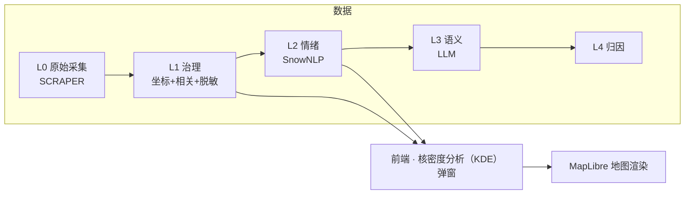
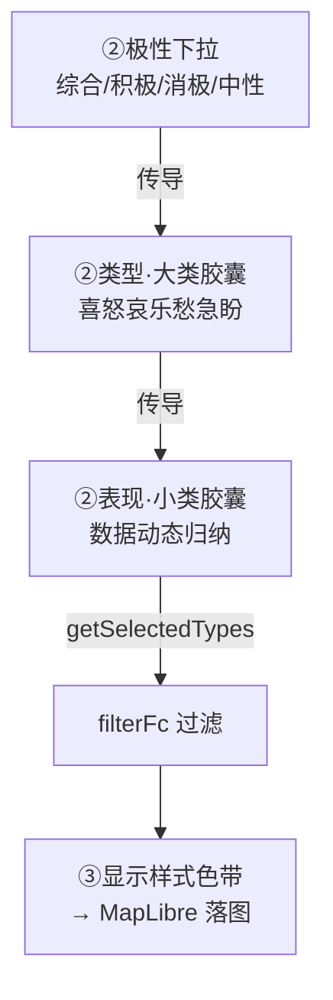

# 修订日志 (Revision Log)

> **定位**：用户需求 → 设计决策 → 落地。从"为什么这么改"的视角记录每一次修订。
> **视角**：用户意图（非程序员表述 → 专业精炼）为主，技术落地为辅。
> **维护**：每次合并需求后，AI 按板块自动追加一条；跨板块的设计主线变更同步更新第 4 节。
> **起算**：2026-06-18（前端迁移期）。更早的技术心得见 `dev-notes.md`，每日任务见 `todo.md`。

---

## ★ 任务路线图（模块化任务树）

> 开发时主看本文件即可（历史修订见第 5 节）。树按 **主干（系统架构）→ 分支（功能模块）→ 临时分支（搁置 / 待决策）** 组织，聚焦架构搭建与模块开发；不记 todo 执行细节（见 `todo.md`）、不带日期戳。
> 状态：✅ 完成 / 🔄 进行中 / ⬜ 待启动（下一步或未来） / ⏸ 搁置 / ❌ 否决。◆ = 架构转折点（解锁下游）。新分支产生即追加（AI 全程维护）。
> 🎯 **全局纲领（最高优先级）**：演示逻辑链 `张力图面 → 引导点击 → 交互分析 → 识别具体城建/更新问题`（数据为表现力、演示为有用性），已写入 CLAUDE.md。所有任务对此负责。

**树状结构**：

```text
emotion_map（根）
│
├─ 主干 · 系统架构（奠基层）
│  ├─ 七层骨架 ✅  frontend · core · SCRIPT · SCRAPER · DATA · design · api · ai_qa（apps/ Streamlit 2026-07-18 退役）
│  ├─ Import/Export 管道 ✅  Import（geojson.io 1:1 解析配置弹窗 + 多格式[geojson/topojson/csv/kml/gpx/shp] + 源 CRS 手选[自动/WGS84/GCJ-02/CGCS2000·西安80·北京54/Mercator/自定义]）｜Export ✅（geojson/csv/shp.zip + CRS + 脱敏，后端 geopandas `/export`）｜⬜ GDB/CAD(dxf/dwg) 服务端轮
│  ├─ 外壳/控件/视觉 ✅  MapLibre GL + 天地图（5.130 raster style 内联）+ Design Token 双主题
│  ├─ 数据采集 Scrapy ✅  框架就绪
│  ├─ 数据管道 L0→L4 🔄  L0→L1→L2 sim 跑通（**L0 未来走购买途径**·sim 当下充分；L1 待 DeepSeek key 常规验证）｜L3/L4 backend ⬜（EMC 分析时归因 deep_attribution + Sim L3/L4 生成器功能覆盖，非 pipeline 级）
│  ├─ Harness · MCP/Agent ✅  v2.1：9 Agent 编排（含 sim，概念框架·调用次数优先·默认主线程）+ 7 MCP（智谱优先）
│  └─ Catch-Ball 闭环 ✅  RULES（CB 规范）+ /cb 命令（反评价编排）+ hook 检测（新 SCAN 提示）+ KNOWLEDGE（跨轮记忆库）+ cb-journal/retired + SCAN_{NN}（第三方·只读）｜CB-03 后转低频维护（每 5-10 commit 一次 SCAN）
│
├─ 分支 · 功能模块
│  ├─ 导航架构重塑（Martin）🔄  B0 色彩(#4285F4/#384555) ✅｜B1 单层顶栏 ✅｜B2 3 按钮集 ✅｜B3 左端栏三区 ✅（B6 随动复核通过）｜B4 左端弹出栏 ⬜｜B5 色板圆角 ⬜ ◆
│  ├─ 核密度分析（KDE）弹窗 🔄
│  │  ├─ 批1 快赢 🔄  1a 预览图 ⏸｜1b 色带系统（随胶囊+HSL+色相细分）✅
│  │  ├─ 批2 全局时间轴 🔄  ◆ 架构转折点（解锁批3/4）— 极性深读·时间轴推倒重做（全局时间维度）
│  │  │  ├─ A0-A2 manifest+TimeSource+applyTime+时间按钮 UI ✅（5.140；manifest 单一权威源 + 点层换源 + Martin 风卡片）
│  │  │  ├─ A3 grid 演进+play+retire 旧 widget ✅（5.142；timeline.js headless 引擎 + time-bar play 编排）
│  │  │  ├─ A4 Overview silent 追随 ✅（5.142；applyTime silent=gridBound 避抢刷 _renderFrame）
│  │  │  └─ Track B 矢量瓦片 tippecanoe+Martin 文件模式 ⬜（A 落地后；TimeSource MVT 实现可插拔）
│  │  ├─ 批3 3D 渲染 ⬜  地形凸凹 / 网格柱体（依赖批2）
│  │  ├─ 批4 时间对比 ⬜↑宏  A/B 双窗（依赖批2 ✅）情绪气象图核心·治前vs治后
│  │  └─ 批5 图层分组 🔄  5A 自动归类 ✅｜5B 自由编组 ⬜
│  ├─ 图层/设置/Overview 🔄  联动 ✅｜Layers 分组重做 ✅
│  ├─ Toolbox 工具箱 🔄  多维归因分析 ⬜（自 KDE ① 剥离）｜缓冲分析 ✅（后端 geopandas EPSG:4546 + 3 段弹窗 + 独立组卡 + B 编辑 + 复用 Range popup）｜网格聚合 ✅（P2：方格 2D/3D + fill-extrusion + 横向色带图例 + G 编辑，接 /spatial/grid(square)；5.25 去 Toolbox 极性直生成 + Layers 拆标准网格/指定单元子卡 + 单元深读→极性深读 paint 就地切换 + 动态矩阵块关键词副本）｜数据语义化 P3 ✅（POI-anchored 4×5/极性三层/置信度密度自相关 + _norm 对称拉伸张力 + 聚合层 4×5 归因 issue_label/attribution，L3/L4 接管后删表；grid/terrain 同步）
│  ├─ Range 范围 🔄  上载模块 ✅（绘制工具迁入 + 两组卡 + 自动 popup）｜绘制模块 ✅（多边形/矩形 移植 geojson.io，绘制卡常驻；点/线/圆 ⬜）｜范围分析 ⬜（缓冲/叠加/聚合）
│  ├─ Analysis 情绪分析接入 ⬜  L2 管道接前端 / 空间分析 MVP
│  ├─ Table 数据表格 ⬜  列表 / 筛选 / 导出（联动管线已预留）
│  ├─ AI 问答 🔄  Harness 四层 ✅（知识层 MANIFESTO + 思考层 think{framing,mapping,steps[]} + 执行层 tool 协议化 + 审查层 Review 6条+Revise）｜独立子架构 ✅（后端 ai_qa/ + 前端 js/ai_qa/，从 core/chat_context+llm_client + chat-panel/chat-orchestrator 散落迁入）｜独立窗口化 ✅（chat.html 真独立窗 + 浮窗降级 + BroadcastChannel 协议；panel.js 不调 map/state）｜设计圣经 docs/ai-qa-design.md；provider-agnostic（DeepSeek→溯佰科改 ai_qa/llm.py 一处）｜EMC UI 重设计 ✅（左端栏融合[上下分区 #lp-upper+.gutter-emc+#emc-panel + 纵向拖拽] + 智能高度三档[compact/comfort/expand + 手动基线回退] + 历史 1:1 Claude Code[就地视图+搜索+列表] + Claude Code 交互语言[Thinking 头/工具卡/复制/Esc/code-block]，5.48）｜**7 月做厚**：行业知识库 v1→做厚 ✅（四领域权威源，5.102-5.108）｜deep_attribution L4 归因 ✅（规则底+lazy LLM·政策→情绪→项目闭环，5.119）｜compare 区域对比 ✅（5.114/5.129）｜wisdom 策展+多轮记忆 ✅（5.118）｜browser e2e 框架 ✅（5.129）
│  └─ 项目架构动态拓扑图（dev 可视化）✅  3d-force-graph + topo_scanner 实时依赖图（5.122-5.127；21 模块+数据流叙事边+成熟度形状）；dev-starmap skill
│
└─ 临时分支（搁置 / 待决策）
   ├─ KDE 批1 1a 预览图 ⏸  等 terrain/factor kepler 截图补齐
   ├─ 高级参数 bug（C5）⏸  暂不修
   ├─ 待决策  KDE 批2 粒度｜批3 地形 vs 柱体
   └─ 宏观 reframe lean（5.148）：↑批4 时间对比（情绪气象图核心）｜↑主观+客观 pairing（官方指标 context layer=护城河）｜↑空间分析 MVP 重定位（区域对比/宏观概况）｜↓多维归因/deep_attribution 深化（微观陷阱，方向性政策锚够用）
```

---

## 1. 三份记录的分工

| 文档 | 视角 | 回答什么 | 读者 |
|------|------|----------|------|
| **revision-log.md（本文件）** | 用户意图 + 设计决策 | "我提过什么要求、为什么、怎么落地" | 你（回顾）+ AI（熟悉开发意图） |
| `dev-notes.md` | 开发者技术心得 | "怎么实现的、踩了什么坑、学到什么" | 开发者 |
| `todo.md` | 每日任务 + 执行日志 | "今天干了什么、明天干什么" | 当日推进 |

> 三者互补不重复：本文件记**意图与决策**，技术细节回链 dev-notes/todo 的对应日期。

---

## 2. 术语表（全站统一，杜绝混用）

| 术语 | 含义 | 易混点 |
|------|------|--------|
| **类型（大类）** | 情绪 7 大类：**喜怒哀乐愁急盼**，固定、高度抽象 | 不要和"小类"混用 |
| **表现（小类）** | 数据中 `emotion_type` 动态归纳（不满抱怨/焦虑担忧…），数量不固定 | 是大类的"具体表现" |
| **极性** | 综合 / 积极 / 消极 / 中性（L2 字段） | 积极=喜+乐，消极=怒+哀+愁，中性=急+盼 |
| **栏** | 占满整行的单条内容（如 Layers 图层行、③显示样式行） | 选中态=浅蓝填充 |
| **选项** | 一行多条、需单选/多选（如分析类型卡、类型/表现胶囊） | 选中态=粗蓝框+浅灰填充 |
| **L0–L4** | 数据分级：L0 原始 → L1 治理(置信度) → L2 情绪(SnowNLP) → L3 LLM → L4 归因 | L1 无情绪字段，仅 L2 有类型/表现 |
| **色带分段条** | kepler 风格离散色块拼接（非无极渐变） | 全站色带统一用此形式 |
| **核密度分析（KDE）** | Kernel Density Estimation，热力图底层算法（点→连续密度面） | **禁用"热核"简称**；英文标识符 `heatmap` 保留 |

---

## 3. 板块总览

| 板块 | 状态 | 主文件 | 最近活跃 |
|------|------|--------|----------|
| 前端 · 核密度分析（KDE）弹窗 | 🔄 活跃 | `frontend/js/heatmap-tool.js` `css/dialog.css` | 2026-06-20 |
| 前端 · Import 管道 | ✅ 稳定 | `frontend/js/import.js` | 2026-06-18 |
| 前端 · 图层/设置/Overview | 🔄 活跃 | `sidebar.js` `settings.js` `panel.js` | 2026-06-20 |
| 前端 · 外壳/控件/视觉 | ✅ 稳定 | `map-controls.js` `popup.css` `tokens` | 2026-06-17 |
| 数据管道 · L0→L4 | 🔄 待验证 | `SCRIPT/data_governance.py` `emotion_analysis_v1.py` | 2026-06-19 |
| 数据采集 · Scrapy | ✅ 框架就绪 | `SCRAPER/` | 2026-06-12 |
| Harness · MCP/Agent/闭环 | ✅ v2.1 | `.claude/` `docs/mcp-strategy.md` | 2026-06-17 |
| 空间分析引擎 · 后端（Spatial Analysis） | 🔄 活跃 | `core/spatial_analysis.py` `api/routes.py` | 2026-06-28 |



---

## 4. 设计意图脉络（关键决策演进）

把散落在各次需求里的"为什么"提炼成几条主线。**任何接手的 AI 都应先读这一节**，理解项目的设计哲学。

### 4.1 配色统一 kepler 化
- 所有色带改为 **kepler 离散分段条**（色块拼接），不用无极 linear-gradient——视觉更专业、与 kepler 一致。
- 色板取值采样自 kepler 源码内置方案：网格暖色谱 ≈ Global Warming；7 色分类 ≈ UberPool 6 色 + 补 1 色；L1 默认单色改橙红（ColorBrewer Reds）。
- **全站色带位置一致**：核密度分析（KDE）弹窗 ③、Overview、要素设置弹窗都用 `.segmented` 分段条。

### 4.2 术语二分：类型 ↔ 表现
- 早期"情绪类型"一词既指大类又指小类，混乱。
- **统一**：类型 = 大类（喜怒哀乐愁急盼，固定 7）；表现 = 小类（动态归纳）。所有 UI 文案、Overview、代码命名按此二分。
- 极性 → 大类是固定传导：积极=喜+乐，消极=怒+哀+愁，中性=急+盼。

### 4.3 选中态二分：栏 ↔ 选项
- 全站选中态原本各处不一（有的浅蓝填充、有的蓝边）。
- **统一两种语义**：栏（占满整行）= 浅蓝填充无边框；选项（一行多个）= 粗蓝框 + 浅灰填充。
- 悬停态也统一：栏和选项 hover 都是浅灰、不加框（与 Layers 行一致）。

### 4.4 弹窗三阶引导
- 原弹窗三阶是"分析什么/怎么显示/调参数"，参数项喧宾夺主。
- **重排**：①选择分析类型 → ②选择数据源（数据/极性/类型/表现，自上而下联动传导）→ ③显示样式（随①②联动）。
- 参数（半径/透明度/权重…）降级进"高级"折叠区，不再占引导编号。

### 4.5 数据流联动：极性 → 大类 → 小类 → 落图
- 早期"选大类/小类对落图无影响"——因为"全选=不过滤"规则把效果吞了。
- **修正**：每次点击都必须在落图上见效；大类全空 = 全不要（非"全选"）；空数组明确拦截。
- L1 无情绪字段时，类型/表现胶囊不渲染（显示禁用提示），不再用兜底值"期待建议"误导。



### 4.6 "继续编辑"语义：H 按钮继承参数
- 点图层上的 H 要素按钮，应**以该图层当初生成时的参数**继续编辑，而非弹空白默认窗。
- 落地：`generateHeatmap` 把 UI 选择持久化进 `paint._ui`；`openHeatmapDialog(layerId)` 反推填回所有控件。**这是全站交互范式**——"再次打开 = 当初参数"。

### 4.7 取消按钮弱化
- 取消/次要按钮统一：白底 + 深灰字 + 细线框 + 悬停变灰，**不填充**，弱化重要性。主操作按钮保持蓝底白字。

### 4.8 主线收敛与反复（复盘）

定期回看哪些主线已稳定、哪些还在反复——暴露设计上的犹豫点。

| 主线 | 状态 | 反复点 / 张力 | 收敛方向 |
|------|------|--------------|----------|
| 配色 kepler 化 | ✅ 已收敛 | 初期按 YlOrRd / Tol Bright 推测取色，后改为采样用户提供的两张参考图 | 以采样图为准，色板不再频繁更换 |
| 术语二分（类型/表现） | ✅ 已收敛 | "情绪类型"一词早期既指大类又指小类；Overview 曾用小类却标"类型" | 全站统一，新 UI 按此二分 |
| 选中态二分（栏/选项） | ✅ 已收敛 | 各处原本不一（1px 蓝边 / 浅蓝填充 / 灰底混用） | 两语义类 `.is-bar-sel` / `.is-opt-sel` |
| 三阶引导 | ✅ 已收敛 | 参数项曾占引导编号，喧宾夺主 | 参数降级进"高级"折叠 |
| H 继承参数 | ✅ 已收敛（范式） | 初版 H 弹空白默认窗 | `paint._ui` 持久化 + 反推；作全站范式 |
| 取消按钮弱化 | ✅ 已收敛 | — | 全站次要按钮统一 |
| 数据流联动 | 🔄 反复中 | "全选=不过滤"曾吞掉效果；L1 兜底值误导；"大类全空"语义（全选 vs 全不要）反复 | 已修正为"每次点击见效"，但传导链路复杂 |
| 3D 渲染 | ⚠️ 占位 | 地形凸凹 / 网格柱体均为 dev 占位 | 待 deck.gl 接入后重审样式与数据源耦合 |

**需持续警惕的张力点**：
- **数据流联动**是当前最复杂链路（极性→大类→小类三层传导 + L1/L2 字段差异）。新增分析类型或数据层级时最易引入回归，须连带测试传导。
- **3D 占位**：③里多个 dev 样式，接入真实渲染后需重新审视"样式↔数据源↔维度"的耦合关系。

### 4.9 否决的方案（Why Not）

记录被明确否决的设计选择及原因，**避免后续重复提出**。

| 方案 | 否决原因 | 落地替代 |
|------|----------|----------|
| 保留"纯密度（density）"分析类型 | 与"情绪地图"定位冲突——纯密度不暗示情绪，弱化产品叙事 | 删除；舆情热度由 L1 综合彩虹承载 |
| 积极配消极红、消极配积极绿（反转配色） | 与全站"红=消极 / 绿=积极"约定相反，误导 | 纠正为正向：积极→绿，消极→红 |
| 积极/消极分析可选 L1 数据 | 积极/消极是 L2 专属字段，L1 无此字段 | 选积极/消极时数据下拉锁定 L2 |
| 独立 2D/3D 切换开关 | 2D/3D 已并入③每个样式命名（热力网格 / 网格柱体），独立开关冗余 | 删除 `#hm-dim`，③样式自带维度 |
| "全选小类 = 不过滤"规则 | 吞掉选中态视觉反馈，用户感觉"改了没用" | 打破：每次点击都过滤；全空 = 全不要 |
| L1 用 polarity 兜底派生"期待建议"小类 | L1 无情绪字段，兜底值制造假数据感 | L1 不渲染类型/表现胶囊，显禁用提示 |
| 7 大类用 Tol Bright 标准色板 | 用户提供了具体参考图（图2），标准色板与之不符 | 采样图2（UberPool 6 色）+ 补第 7 色 |
| 色带用无极 linear-gradient | 与 kepler 分段条设计语言不一致 | 全站改离散分段条 |

### 4.10 设计公约速查（后续必须遵守）

新增 UI / 改动时，逐条核对是否合规：

1. **色带**一律离散分段条（`.segmented`），禁无极渐变。
2. **文案**：类型 = 大类（喜怒哀乐愁急盼）/ 表现 = 小类（动态归纳），不混用。
3. **选中态**：栏 = `.is-bar-sel`（浅蓝填充无边框）/ 选项 = `.is-opt-sel`（粗蓝框 + 浅灰填充）。
4. **悬停**：栏与选项都浅灰、不加框（与 Layers 行一致）。
5. **再次打开图层配置** = 继承当初参数（`paint._ui` 反推），非空白默认。
6. **次要/取消按钮** = 白底 + 深灰字 + 细线框 + 悬停变灰，不填充；主操作按钮蓝底白字。
7. **新弹窗**按三阶引导（①分析类型 → ②数据源 → ③显示样式），参数进"高级"折叠。
8. **术语**：核密度分析（KDE），**禁用"热核"简称**；英文标识符 `heatmap` 保留。
9. **工具生成的图层** = 独立组卡片（`categoryOf` 加该工具 category）+ 要素按钮（H/B/…）开**本工具弹窗**（编辑态 `paint._ui` 回填 + 原地更新，layer id 稳定，不删旧新建）。新增工具同时落 6 点（3 组卡 + 3 弹窗，见 memory: tool-layer-convention）。

### 4.11 类型细分色带：固定极性 → 随选中大类动态生成
- 早期类型细分用固定 `positive/negative/neutral` ramp（覆盖极性全部大类），选不选大类色带都一样。
- **改为**：选具体大类（只「喜」/「怒+哀」/…）→ ③色带 / 地图 heatmap / 图例 / Overview 只含选中类色；全选 = 等同固定 ramp（无缝）。
- 落地：`buildMacroRamp` 按 density 弱→强生成 inline stops（rampKey 保持 polarity 维持 reverse 标识 + density 语义）；消费方优先 inline、fallback rampKey。色带与胶囊同向（rampDisplaySegs 据 polarity reverse）+ 地图热核=最强情绪（density 语义不变）。
- **每大类内置 3 段**（明度变体浅/中/深，`macroShades` = lerpHex 混白/原色/混黑）：段数 = 类数×3（积极 6/消极 9/中性 6/单类 3）。3 段是 density 视觉分段（density 低=浅/高=深），因 `heatmap-weight=intensity`，density 高=高 intensity 密集区 → 间接对应 intensity 低/中/高，**不需额外数据字段**（当前数据支持，未来细 intensity 自动生效）。
- **多类组合平滑过渡**：`gradientStops(colors, colors.length*3)` 插值 ×3（关键色间补过渡色，类间不割裂）；`macroShades` 明度收窄（混白 0.25 / 混黑 0.3）保色相（浅色跨类不趋白趋同）。段数 = 类数×9（积极 18/消极 27/中性 18/单类 9）。类内明度渐变 + 类间色相过渡，整体连续。
- **HSL 色相插值**（替 RGB）：RGB 插值绿↔黄中间土黄（经过 RGB 暗区 `rgb(152,148,65)`），HSL 色相旋转（hue 最短路径）中间黄绿明亮（`rgb(123,218,87)`）。`gradientStopsHsl` + `macroShades` HSL lightness。极性区间 积极 绿↔黄（乐改黄 `#F5C842`）/ 消极 红↔紫 / 中性 深蓝↔天蓝。
- **色相细分**（每类 3 段，最终方案）：取消 `macroShades` 明度变体（跨类明度跳变是割裂根源），类色直接 HSL 插值 —— `gradientStopsHsl(类色, 类数×3)`，每类占色带 3 段（色相细分），整体连续不割裂。段数 积极 6/消极 9/中性 6/单类 3（单类同色）。乐回橙 `#F5A623`。

---

### 4.12 三页架构 + Martin 导航重塑（2026-06-27）

**三页架构**（ADR-015）：产品从单页升级为三页——数据库（emotion-database，运维）→ 控制台（emotion-console，研究，**当前 α v0.1**）→ 实时地图（emotion-map，商用），自下而上。职责按角色分层，研究工具不被商用/运维功能污染。L0-L4 双视角：过程=分析管道，产物=数据库数据类型分层。

**Martin 导航重塑**：控制台 UI 提升"高级感"，参考 ref3 截图布局（左图层栏 + 紧贴右侧参数面板 + 单层顶栏）+ Martin 源码设计语言（细边框 / 8px 圆角 / Lucide 图标 / hover 过渡 / 留白）。先统一全局色彩（品牌蓝 `#4285F4` + 卡片深灰 `#384555`），再单层顶栏 + 左端栏三区（选择 / 工具 / 操作）+ 左端弹出栏（替代弹窗，挂载点迁移）。

## 5. 修订记录（按板块分组，组内倒序）

> 每条格式：`日期 · commit · 用户意图（精炼） → 落地 · 文件`

> 📍 **最新动态（07月21日）** · 本节按板块分组、组内倒序；最新工作 = **5.161 CPD Phase 2b · 撤常驻左栏改 chip 抽屉 + 折叠欢迎胶囊重设计**（本次，分支 `cpd`）。上一轮 5.160。最近：
>
> - **5.161 CPD Phase 2b · 撤常驻左栏改 chip 唤出抽屉 + 折叠欢迎胶囊重设计**：**A 折叠欢迎胶囊** [ai_qa.css](frontend/css/ai_qa.css)：从"生硬输入框"改"AI 助手问候泡"——**修线框不均**（textarea 默认 content-box 致 border+padding 溢出 100% 宽→边缘错位，加 `box-sizing:border-box`）+ **4px 橙线框** + **全圆胶囊**（radius 28=56/2）+ 左 **sparkle 图标**（橙色，AI 身份）+ 右 **→ CTA 箭头**（点我进入）+ **2.6s 呼吸光环**（吸引首次注意，hover 暂停）+ hover 浮起。**B Phase 2b**：[layout.css](frontend/css/layout.css) `#left-panel` 从常驻 flex 左栏改为 **chip 唤出的浮动抽屉**（`position:absolute; display:none` 默认、`.is-drawer-open` 显示、EMC 右侧 left:320/top:30/340 宽、z-index 55、圆角阴影）；`#map` 随之全宽；`.gutter-left/.collapse-left` 退役隐藏。panes（Range/Layers/Toolbox）**留原处免重宿主**（图层管理器 renderLayerList 等零改）。[sidebar.js](frontend/js/sidebar.js)：`cpd:focus-tab` 改抽屉 toggle（同 tab 再点关）+ 外部点/Esc 关 + `showLayerManager` 导入后自动展开抽屉。[tools.js](frontend/js/ai_qa/tools.js) `buildContext` 增 curState 语境 hint（**不参与路由、不动 diagnose**）。承重未破。ESM 绿（tools/sidebar）。**CPD 软折叠闭环**：EMC chip → 抽屉按需出现 → 用完即隐。push 待用户。
>
> - **5.160 CPD Phase 2a · 软折叠壳（CPD 状态机落地的第一步）**：新增 [cpd-state.js](frontend/js/ai_qa/cpd-state.js)——**客户端推导 curState**（S0 空/S2 有可见层/S3 对话中/S4 有结论卡；S1 range-only、S5 导出为瞬态不自动判），信号=visible layers + `#chat-messages .chat-msg-user`/`.aiq-conclusion`；pub/sub + 监听 `layers:changed`/`layer:selected`/chat-messages MutationObserver。**承重：不动 diagnose prompt（保 eval）**——curState 纯客户端派生，不进 LLM context 必需项。[panel.js](frontend/js/ai_qa/panel.js) `_setupCpdBar`：EMC 顶部（chat-head 下）注入 **5 步进度条**（当前蓝光晕/已完成绿/未达灰 + 步骤标签）+ **Layers/范围/工具 摘要 chip 行**（软折叠·始终可达，图层 chip 带计数）；chip 点击派发 `cpd:focus-tab`。[sidebar.js](frontend/js/sidebar.js) 监听 `cpd:focus-tab` → 切左栏 tab + 折叠则展开（2a 桥接，左栏暂不移除）。[ai_qa.css](frontend/css/ai_qa.css) 进度点 + chip 胶囊（无线框+悬停灰+计数蓝，胶囊设计语言；折叠态隐藏）。**2a 为 CPD 壳：左栏与 chip 暂时并存（冗余），2b 将 chip 改开 EMC 内抽屉并撤 `#left-panel` + `buildContext` curState hint。** ESM 三绿（cpd-state/panel/sidebar）。push 待用户。
>
> - **5.159 CPD Phase 1 视觉精修三轮（按用户 F5 反馈 4 条 + 纠设计直觉跑偏）**：① 折叠胶囊 [ai_qa.css](frontend/css/ai_qa.css) 纯白→**浅灰底 `#ececec`**（白太突兀，记用户偏好柔和浅底）+ 橙色 2px 线框恢复。② 浮窗 [layout.css](frontend/css/layout.css) `top:40→30px`（再上移 10）。③ 输入钮 18→**32px**（18 触达差，回调合理可点尺寸；ctx-cap/+ /Pro·Flash/发送 等高 32，send 箭头 16）。④ 工具钮 [map-controls.css](frontend/css/map-controls.css) 加 `aspect-ratio:1 + flex:0 0 auto` 锁死**正方形**（防内容撑变形）+ [map-controls.js](frontend/js/map-controls.js) btnReset 加 `.emotion-ctrl-break` → 中间 `margin-left:8px` 维持 **3+5 断开格局**（组内 1px 紧凑）。**自省**：近轮过度字面分析、把能据设计常识+用户习惯自判的决策甩回用户（上移方向、18px 偏小、纯白突兀）——新增 feedback memory 固化「先调设计常识与习惯，勿回弹能自决问题」。push 待用户。
>
> - **5.158 CPD Phase 1 视觉精修二轮（按用户 F5 反馈 4 条）**：① 折叠态输入胶囊 [ai_qa.css](frontend/css/ai_qa.css) 改 **白底 `#fff` + 炭黑字 `#1a1a1a` + 2px 黑轮廓**（点击展开恢复 Dark）；折叠 placeholder 改 [panel.js](frontend/js/ai_qa/panel.js) `_INPUT_PH_COLLAPSED` = 「向 EmotionMap Copilot 提问：了解"情绪地图"，观察、分析、总结城市情绪数据。」。② 浮窗位置 [layout.css](frontend/css/layout.css) `top:180→40px`（距标题栏下端约 40px，贴顶栏）+ `max-height:calc(100vh-138px)`（下拉底留 ≥50px）+ grip JS maxH 同步 `innerHeight-138`。③ 一体化输入盒收窄：textarea `min-height 56→34`、padding/margin 减、**四按钮等高 28→18px**（ctx-cap/+ /Pro·Flash/发送 方形比例不破，send 箭头缩 11px）。④ 工具簇 [map-controls.css](frontend/css/map-controls.css) 按钮 `32→20px`、SVG 图标缩至 14px、文本 12px。push 待用户。
>
> - **5.157 CPD Phase 1 视觉精修（按用户 F5 反馈 4 条）**：① EMC 浮窗 [layout.css](frontend/css/layout.css)：`top:180px`（距标题栏底约 180px）、默认 `width:300px`（=最小宽）、`border-radius:16px`（更圆润）、`max-height:calc(100vh-380px)`（底留 ≥100px 不压比例尺）；折叠态 [ai_qa.css](frontend/css/ai_qa.css) 改 **浮动输入胶囊**（去外部深色填充、面板透明、textarea 自成 14px 圆角胶囊、2 行 56px 高、300px 宽 `!important` 覆盖拖大）；展开态输入区 **一体化盒子**（textarea+底部按钮同框 12px 圆角，容量圈/+ /Pro·Flash/发送 **等高 28px** 视觉统一）。② 工具簇 [map-controls.js](frontend/js/map-controls.js)+[map-controls.css](frontend/css/map-controls.css)：弃 `maplibregl-ctrl-group`（默认 column 渲染错），改单一 `.emotion-ctrl-row` flex 行——**3+5=8 按钮一字横排**（cursor/measure/layers + reset/2D/zoom±/north），比例尺最左。③ EMC 缩放：去原生 `resize:both`（角太小难发现），改 [panel.js](frontend/js/ai_qa/panel.js) `_setupEmcFloat` 自持 `.emc-resize-grip`（SE 角 22px 斜线符号、pointer 事件、min 300×200/max 不压比例尺、hover 强调色）+ ResizeObserver 持久化 localStorage。验证：ESM 双绿（panel/map-controls .mjs --check）。**待用户 F5 终验**（注：top:180 按字面「距标题栏底 180px」落地，若用户本意更靠上请告）。push 待用户。
>
> - **5.156 CPD Phase 1 · 页面 UI 改造（工具簇横排 + EMC 浮窗化）**：**1a 工具簇横排**（[map-controls.js](frontend/js/map-controls.js) DOM 序 `scale→nav→tools` + [map-controls.css](frontend/css/map-controls.css) `.emotion-controls-root` column→row、底对齐、gap 10；ctrl-group 内按钮 border-top→border-left）——比例尺在最左、reset/2D-3D/zoom±/north + cursor/measure/layers 横向排其右侧。**1b EMC 浮窗化**：[index.html](frontend/index.html) 删 `gutter-emc`；[layout.css](frontend/css/layout.css) `#emc-panel` 由 `#left-panel` flex 子（`height:var(--emc-h)`）改为 **`position:absolute` 浮于 `#map` 左上**（top:56/left:10、默认 380×360、min 300×200/max 92vw×vh-116、z-index 50、阴影圆角）+ **原生 `resize:both`**（高帧率自由缩放宽高，答用户「能实现吗」= 能，浏览器原生零 JS 拖拽）；[panel.js](frontend/js/ai_qa/panel.js) 新增 `_setupEmcFloat()`：initChatPanel 运行期 reparent `#emc-panel` 到 `#map` + ResizeObserver 持久化宽高到 localStorage（折叠态不存）；[ai_qa.css](frontend/css/ai_qa.css) `.is-collapsed` 用 `height!important + resize:none` 覆盖浮窗固定高（原 `--emc-h` 三档自动调高机制退役为无害 no-op，CPD 摈弃工程化自动调高 → 用户自持尺寸）。承重：不碰 diagnose/四态出口/tracker；search-bar top-center/popup top-right/legend bottom-right/工具簇 bottom-left → EMC 左上不冲突。**左栏 `#left-panel`（Range/Layers/Toolbox）暂留**（EMC 迁出后 `#lp-upper` flex:1 填满），Phase 2 加 CPD chip 行后再撤。**待用户 F5 肉眼验：工具簇横排比例尺右 + EMC 浮左上可双向缩放 + 初始折叠条。push 待用户。**
>
> - **5.155 CPD Phase 0 · 宜昌中心城区 3220 真实 POI 入库（分支 cpd 起步）**：用户在 `DATA/POI/` 放入新爬取的 3 文件，要求先入库再做 **CPD 系统级重构**（EMC 升为底层主控、摈弃工程化操作体验、情境式渐进披露）。**库定位**：项目**无 SQL 数据库**（db.py 已退役），「库」= [core/place_layer.py](core/place_layer.py) 单 owner 内存 POI 库（4 JSON 装载，`all_pois` 喂 `/api/v1/place/search` + `reverse`）。新增 [ingest_centralcity_poi.py](SCRIPT/poi_data/ingest_centralcity_poi.py)：读 `yichang_pois_wgs84.geojson`（3220 真实 POI·WGS84）→ 字段映射（`category→baidu_level1` 保真、`keyword→baidu_level2`、`district→area`）+ 10 短大类→4×5 专属映射 `_CAT_TO_4X5`（平衡 operation 1883/governance 821/renewal 516）→ 覆写 `amap_poi_centralcity_wgs84.json`（替代 `sim_cc` fallback、`source='amap_cc'`），**place_layer 零代码改动**自动装载（`_AMAP_POI_CC_PATH` 直指该文件）。合并后 all_pois **4497**（1270 核心 + 3220 CC + landmark；核心密度本就高，双计可接受）。重生成 [pois_wgs84_v2.geojson](DATA/place/pois_wgs84_v2.geojson) 搜索核查语料。修 [test_geocode.py](tests/test_geocode.py) 2 例：语料扩容后 '东站' default 命中已 ≥30 触顶、relaxed==default，`limit 30→200` 取全量比较恢复 relaxed 阈值断言（default 46 < relaxed 56、band 10 条 <55）。**1623 行政边界**：新 `中心城区行政区划_1623_wgs84.geojson` 与已有 `行政区.geojson` preset **同 9 区完全相同**（西陵/伍家岗/点军/猇亭/小溪塔/龙泉/白洋/生物产业园/龙泉绿心），`admin_district` preset 早已注册 → 无需重复。验证：`py core/place_layer.py` 自测 + `forward("万达"/"二马路")` 返真实 POI + `reverse(111.29,30.70)` 近邻 138 处 + `pytest tests/test_geocode.py tests/test_geo_routes.py -q` 全过。**CPD Phase 1-3（布局重构/软折叠状态机/主题）进行中；main 遗留（批4 grid 镜像 bug + diag 日志）延后到 cpd 合并后。push 待用户。**
>
> - **5.154 design-system.md 设计系统规范 v1.0 + 会话收尾交接**：用户加入 [docs/design-system.md](docs/design-system.md)——前端设计 single source of truth：**情绪五级色带「正冷/负暖」**（正=青绿 `#5DCAA5`/`#0F6E56`，负=珊瑚 `#F0997B`/`#D85A30`，中=`#C0C0C0`；与中国股市涨红跌绿同向、CVD 友好）+ EMC 三级权重系统 + 情境式渐进披露交互逻辑 + 设计 Token 制作与生成管线。**待办（下会话）**：当前 `design/tokens.json`+`state.js emotionColors` 仍是旧棕红负色（Negative `#C4956A`），与规范「负=珊瑚」不一致，待对齐。会话交接卡覆写（批4 完成 + grid 镜像 bug 待诊断 + design-system.md 加入；第三方配色 mishap 已退回 8 未提交、保留 2 commit）。承重：design-system.md 是规范文档，不改代码；配色对齐留后续。**push 本次（用户指定）。**
>
> - **5.153 批4 Swipe Step 5 收尾（批4 完成 + memory + 进度）**：批4 时间对比 Swipe 卷帘 Step 1-4 完成（scaffold / 镜像 / grid A/B / A/B UI），Step 5 = 收尾。批4 全链路：`'c'` 或卡片「对比」→ 进 compare → 双 map 卷帘（左 mapA 片A / 右 mapB 片B）+ 同步 pan/zoom + 拖分割线 + slider/停点调 mapB 片B + A/B 角标（A 蓝/B 橙）。新 memory `batch4-swipe-compare`（双 map + manual sync + clip divider + grid-only mirror + A/B + cycle 约束 time-bar 编排）+ MEMORY.md 索引。**待办**：mapB 底图/暗 overlay 在 3D compare 的视觉同步（polish，2D compare 不影响）；批4 全链路待用户 F5 终验。承重：批4 全程 **mapA 承重路径零改动**（mirror 非侵入 + renderSliceToMap 纯 setData）。详见 plan §批4。**push 待用户。**
>
> - **5.152 批4 Swipe Step 4 A/B 用户挑 + 对比入口 + A/B 标签**：Step 3 默认 A/B 后，Step 4 让用户挑 B + 正式入口 + 角标。[time-bar.js](frontend/js/time-bar.js)：`_activeSliceKey()`（compare 模式 UI 反映 B / 否则 A）+ `_sliceLabel/_sliceIndex/_renderBody 停点/_renderCalendar/_syncActive` 全改用 `_activeSliceKey`；`_pick` **compare-aware**（compare → 设 mapB 片B via `renderSliceToMap`；否则 mapA 片A `applyTime+renderSlice`）；卡片头加「对比」toggle 按钮（`setCompareMode`+重渲）；地图角加 **A/B 标签**（A 蓝/B 橙区分两半，compare 模式显）；`_updateCompareLabels`（A=mapA 片 / B=mapB 片）；`compare:mapBready/exit` 监听刷新卡片+标签。[compare.css](frontend/css/compare.css) `.tb-compare` 胶囊 + `.compare-label` 角标。承重：纯 UI/编排，mapA 路径零改动。注：mapB 底图/暗 overlay 同步留 Step 5（polish）。验证：ESM 绿；**`c` 或卡片「对比」→ 进 compare → slider/停点调 mapB 片B（A 固定）；角标显 A·T1 / B·T3**。**push 待用户。**
>
> - **5.151 批4 Swipe Step 3 grid A/B（mapA=片A / mapB=片B 核心）**：批4 核心——双 map 显不同时间片的 grid（治前 vs 治后）。[timeline.js](frontend/js/timeline.js) 加 `renderSliceToMap(targetMap, sliceKey)`（纯 setData 指定 map 的 grid source `lyr-{_layer.id}`，不 paint Overview/不 lerp；mapA 走既有 `renderSlice`，mapB 走本函数）+ `getBoundSliceKeys`。**cycle 约束**（timeline→map，故 map 不能 import timeline）→ **time-bar 编排**。[map.js](frontend/js/map.js) mirror 改 **grid-only**（`_focusedGridId` 找焦点 grid，只镜像 `lyr-{gridId}`+子层 -line/-hit/-extru；points/range 不上 mapB 避免片不一致）+ 镜像完 dispatch `compare:mapBready` + `_exitCompare` dispatch `compare:exit` + 导出 `getMapB`。[time-bar.js](frontend/js/time-bar.js) 听 `compare:mapBready` → mapB 设片B（`_compareB` 默认末片；Step 4 加用户挑）+ 听 `compare:exit` 清 `_compareB`。承重：**mapA 路径零改动**；mapB grid = mirror（结构）+ renderSliceToMap（片B 数据）。验证：ESM 绿（timeline+map+time-bar）；**进 compare（`c`）→ mapA grid 片A（当前）/ mapB grid 片B（末片如 T3）= 治前 vs 治后默认对比**（Step 4 加用户挑 A/B + 正式入口 + mapB 底图/暗/light 同步）。**push 待用户。**
>
> - **5.150 批4 Swipe Step 2 镜像层到 mapB（非侵入）**：Step 1 mechanics 验过后接 Step 2（mapB 显同款数据层）。[map.js](frontend/js/map.js) 加 `_mirrorLayersToMapB()`——读 mapA.getStyle() 把 `lyr-/emotion-` source+layer 复制到 mapB（mapA/mapB 独立实例，同 id 不冲突），**不动 renderLayer（承重 mapA 路径零改动）**。`_onMapBStyleLoad`（mapB basemap 就绪：敷 3D 光 + 镜像）。`_enterCompare` 接线（mapB `style.load`→`_onMapBStyleLoad`；已加载→直接镜像）。模块级 `layers:changed` 监听（compare 模式 mapA 层变→重镜像 mapB，Step 2 同片）。承重：**非侵入镜像，mapA 路径 + paint-inplace-swap-view 零改动**；mapB 是只读跟随（Step 3 起设 A/B 分片）。验证：ESM 绿；**F5 → 进 compare（`c`）→ mapB 右半显 mapA 同款 grid/points（同片数据）**。注：mapB 敷了 3D 光；底图暗色 overlay 同步留 Step 4。详见 plan §批4。**push 待用户。**
>
> - **5.149 批4 时间对比·Swipe 卷帘 Step 1 scaffold（mapB 第二实例 + sync + clip divider POC）**：宏观 thesis（5.148）首个落地功能 = 批4 时间对比（情绪气象图核心叙事·治前 vs 治后）。用户选 **Swipe 卷帘**方案（单地图架构下双 map 实例各 clip 一半——MapLibre 不支持层屏幕裁剪，双 map 是唯一路径；不引新库 manual sync + CSS clip-path）。**Step 1 = 低风险 POC**（仅 basemap，验证 mechanics）。[map.js](frontend/js/map.js) 加：mapB 第二 `maplibregl.Map` 实例（同位叠加 `#map`，lazy 建于 `_enterCompare`，同 basemap+同步视图）+ manual 双向 sync（mapA↔mapB `move`→`jumpTo`，`_syncing` 标志防反馈环）+ 可拖 clip divider（`_setDivider`→mapB `clip-path: inset(0 0 0 pct%)` = 左显 mapA/右显 mapB；clip-path 同时切视觉+事件，裁掉区不收事件→左半穿透到 mapA）+ `setCompareMode`/`isCompareMode` toggle。[compare.css](frontend/css/compare.css)（`.map-b-wrap` z1 + `.swipe-divider` z90 + 双拖手 + `#map.is-compare` 显隐）。[main.js](frontend/js/main.js) `'c'` 键 toggle（POC 入口，Step 4 改 time-bar 正式按钮）。承重：**additive 不动 renderLayer/applyTime**；compare 是 toggle 不改默认单 map 体验；不碰四态/diagnose。验证：ESM 绿（map+main）；**F5 → 按 `c` 进 compare → 双 map 同步 pan/zoom + 卷帘拖动 mechanics**（Step 2 起接分析层渲染 + Step 3 时间 A/B）。详见 plan §批4。**push 待用户。**
>
> - **5.148 产品定位 reframe：宏观主观诊断透镜（用户洞见 + 业界验证 → thesis 固化）**：用户重新思考项目本质——情绪地图分析基础=海量"评论"→产物"性格"注定**偏宏观**（统计聚合，非精确测量）。**业界验证**：官方城市体检双臂（社会满意度调查=主观采样问卷"中医望闻问切" + 第三方体检=客观遥感"西医化验"）→ 情绪地图=其「连续地理版」；国际 emotional mapping（EU eMOTIONAL Cities / MIT "Cities That Feel" / Missouri / Pánek）皆宏观聚合、不声称微观精度。**结论**：宏观是定位护城河不是局限；「越细归因=越精确」是陷阱（数据撑不起微观精度）。系统梳理见 plan `07-19-cb-lovely-quiche.md` §一-七（思路/架构/工具/UI + 业界对标）。**固化** [CLAUDE.md](CLAUDE.md)：新增「产品本质（宏观主观诊断透镜·定位护城河）」节（业界对标 + 双轨架构=主观轨情绪地图+客观轨官方指标 context layer pairing）+ 演示逻辑链末环「识别具体问题」→「定位关注区+主题倾向+排序优先级」+ 有用性环改"宏观定位+排序" + 设计哲学 item1「4×5=主题倾向分布矩阵（宏观）非精确归因」+ item2「政策→情绪→项目 方向性锚（宏观）非精确闭环」+ 业内同行画像"宏观假设生成"。**重排 §0**：批4 时间对比↑宏 + 临时分支 lean 注（↑批4/↑主观+客观 pairing/↑空间分析 MVP 重定位/↓多维归因+deep_attribution 深化=微观陷阱）。承重：纯文档/路线图校准不动代码；thesis 入 CLAUDE.md 顶层权威源（不另建 memory，只同步指针）。**push 待用户。**
>
> - **5.147 收尾杂项（timeline.css 退役 + stale 清理 + 拓扑图例订正）**：用户选"收尾杂项"方向。① **timeline.css 退役**：`git rm frontend/css/timeline.css`（孤儿——5.142 retire 旧侧栏 widget 后 index.html 已去 link，grep 零活引用），入 [retired.md](docs/catch-ball/retired.md) 2026-07-20 批（可恢复 git 历史）。② **stale 清理**：[map.js](frontend/js/map.js) 删 `_pre3dBasemap`（旧 AUTO_3D_BASEMAP 方案遗留声明，5.143 暗色遮罩方案后 unused；showTimeline/PT_URL/TL_T 等早已清零）。③ **拓扑图例订正**（查漏：图例文字与 5.144/5.145 新编码矛盾）：[topology.html](frontend/topology.html) maturity 图例标题"（形状）"→"（透明度）" + 文字（推进中"空心线框"→"半透实心" / 计划"虚线空心"→"线框"，对齐 opacity 编码）；family 图例拆"主程序+EMC"为两条目（主程序珊瑚 + EMC 高饱和橙 `--topo-c-emc`），"4 类"→"5 类"；[topo.css](frontend/css/topo.css) `.st-progressing` 从 `border` 改 `solid + opacity:0.55`（对齐 3D 节点半透实心）。验证：ESM 绿（map.js）。承重：timeline.css 删前 grep 零引用 + retired 留痕；图例纯文字/CSS 订正不动逻辑。**push 待用户。**
>
> - **5.146 拓扑图卡顿修复（rAF 批处理 DOM 更新）**：治 5.143 起用户反馈的"双击/拖拽偶尔卡顿"。根因：`onEngineTick` 每 force 模拟 tick 都直调 `updateLabels+updateBoxes+updateTipPos`（~40 标签节点 + ~12 组团框 × 各节点 `graph2ScreenCoords` + style 写），force sim **220 tick 冷却期**（加载后数秒活跃）叠加双击 `zoomToFit` 相机动画 → 每 tick DOM 抖动抢主线程 = 偶尔卡顿（尤加载后 sim 活跃时双击）。修：[topology.js](frontend/js/topology.js) 加 `_scheduleDomUpdate()`——`requestAnimationFrame` 合并 + `_domRafPending` 标志去抖；`onEngineTick`（line 73）+ `ctrl 'change'`（line 86）两处直调改调它。一帧内多次 tick/相机变化合并为一次 DOM 写（≤60/sec），消除抢帧；rAF 对齐显示刷新 → 标签/框视觉无延迟感。验证：ESM 绿；**F5 手感验证**（守 no-routine-playwright-verify：加载后 sim 活跃期立即双击/拖拽 → 卡顿应明显减轻）。承重：只动 DOM 更新调度，不改节点几何/数据/force 参数。若仍偶发（疑 GPU/节点数），再降 sphere 几何精度或 throttle tick 频率。**push 待用户。**
>
> - **5.145 拓扑图两小项（EMC 单独高饱和橙色 + 组团框字体双击 zoom）**：① **EMC 单独色**：ai_qa 从 primary 家族拆出独立 `emc` 家族——[topology.js](frontend/js/topology.js) GROUP_FAMILY `ai_qa:'primary'`→`'emc'`，[topo.css](frontend/css/topo.css) 加 `--topo-c-emc: #F97316`（高饱和橙，与主程序珊瑚 `#E68B5C` 区分）。② **新 feature：组团框字体双击 zoom**：双击虚线组团框的文字标签 → `zoomToGroup(group)`（zoomToFit filter=`nn.group===group`，800ms 动画，pad 40 紧凑居中+放大）；renderBoxes 给 `.cluster-box-label` 加 dblclick 监听 + title；CSS label 开 `pointer-events:auto` + `cursor:zoom-in` + hover 高亮（之前 #topo-boxes 整层 pointer-events:none，label 不可点）。验证：ESM 绿；**EMC 橙色 + 组团框双击 zoom 待 F5 验**。承重：只动 GROUP_FAMILY/renderBoxes/CSS，不碰 topo_scanner 数据。**push 待用户。**
>
> - **5.144 5.143 复测三修（3D 暗底图黑屏→真 dark-matter 图层 + 拓扑色改 Martin + 双击 zoomToFit）**：用户复测 5.143 报三问题。① **3D 暗底图黑屏根因**：5.143 的"暗色遮罩 fill 层"是**纯黑 polygon**（无纹理），用户要的是 dark-matter（CARTO 暗矢量，有路网纹理 = 地图切换里的"暗色无注记"）。修：[map.js](frontend/js/map.js) 改 **预载 dark-matter 真实矢量图层**——fetch dark-matter style JSON → addSource/addLayer（`dm-` 前缀避冲突，插在首个数据层前，visibility 初 none），transformStyle 携带 dm- 层（保序在底图与数据间）；`_onPitch`→`_applyDark3D`：pitch>1 时 setLayoutProperty 显 dm 层（dark-matter opaque background+路网纹理盖底图）+ #map 暗背景。**仍不 setStyle → 零卡顿**，且非纯黑（真纹理）。各 addLayer 包 try/catch 跳过依赖 sprite 的符号层。② **拓扑色弃光滑/磨砂**（用户"看不出区别"）：[topology.js](frontend/js/topology.js) buildNode 改——颜色=家族 **Martin 风 4 宝石色相**（珊瑚 `#E68B5C`/蓝 `#5B8DEF`/紫 `#9D7BE0`/青 `#4FB8A8`，[topo.css](frontend/css/topo.css) var；截图链接过期未采精确色，用户可微调），成熟度改 **opacity**（mature 1.0 / progressing 0.6 / planned 线框 0.4），弃 tint + flatShading gem。③ **双击节点视野不理想**：zoomToCluster 从固定偏移 `cameraPosition({cy-140,cz+240})` 改 **`zoomToFit(800, 80, inCluster)`**（filter=同 module/group/layer，自适应取景组团 bbox），治"视野常不理想"。**双击偶尔卡顿**（①）暂未专修（疑 force sim 的 onEngineTick DOM 抖动或 GPU，zoomToFit 已比 cameraPosition 顺；若持续再 throttle tick）。验证：ESM 绿（map+topology）；**三处待用户 F5 肉眼验**（3D 应见路网纹理暗底图非黑屏 / 拓扑 4 色相明显 / 双击组团自适应居中）。承重：dark-matter 走 addLayer+setLayoutProperty 不 setStyle（避卡顿）；拓扑 buildNode/zoomToCluster 不碰 topo_scanner。**push 待用户。**
>
> - **5.143 前端 viz 双任务（3D 视角自动暗底图 + 拓扑图四项优化）**：用户两任务。① **3D 视角切暗底图（避卡顿）**：旧 `AUTO_3D_BASEMAP`（setStyle 换 dark-matter）被关，因 setStyle 重载瓦片新旧交替=空白卡顿。新方案=**暗色遮罩 fill 层**（`dark-overlay`，世界面 polygon）插在底图与数据层之间（[map.js](frontend/js/map.js) transformStyle 携带 + style.load 兜底添加，位置在 lyr-/emotion- 之前），`map.on('pitch')` **全局监听**——pitch>1（任何 3D 触发：setView3D/map-controls 等）→ setLayoutProperty 显遮罩 + #map 深背景(#0c0e13)；pitch≈0→隐+还原。setView3D 简化（只 easeTo，删 setStyle 换底图块）。数据层在遮罩之上保持亮（grid 柱不暗）。setLayoutProperty 无瓦片重载=**零卡顿**（治用户提的"之前卡顿 bug"）。② **拓扑图四项优化**（[topology.js](frontend/js/topology.js) + [topo.css](frontend/css/topo.css)）：(a) **疏密** force 拉开：charge -42→-60 / link 52→66 / decay 0.35→0.4 / cooldown 150→220（中间组团舒展，体积感更强）；(b) **节点区分** progressing 从线框改 **facetted gem（IcosahedronGeometry + flatShading 哑光晶面）+ 浅色 tint(0.34)**，mature 保光滑球(深色 glossy)——**颜色(深→浅)+材质(glossy↔matte)+形状(球↔宝石↔线框) 三重编码成熟度**，治"同色光滑/磨砂难辨"；planned 线框 tint 0.55；(c) **标签** 去 text-shadow/描边，只用粗细(400/700)+大小(12/14px) 区分核心（用户要求）；(d) **悬停高光** onHover 改 _setGlow：scale 1.7 + 白色 halo（additive 球 r×1.55，边缘发光）+ emissive 自发光 0.55（lit 材质）。承重：dark-overlay 走 setLayoutProperty 不 setStyle（避卡顿）；拓扑图改 buildNode/force/onHover 不碰 topo_scanner 数据。验证：ESM 绿（map+topology）；**3D 暗底图 + 拓扑四项待用户 F5 肉眼验**（守 no-routine-playwright-verify）。**push 待用户。**
>
> - **5.142 时间轴 A3 grid 演进 + play + retire 旧 widget + A4 Overview silent 机制**：A0-A2 后推进 A3（grid 演进 + 播放 + retire 旧侧栏 widget）+ A4。**Step 1 timeline.js → headless 引擎**（[timeline.js](frontend/js/timeline.js) 重写，保算法）：删自带 UI（`_buildDom`/widget 显隐/`_updateThumb`/`_setLabel` 等）；`showTimeline/hideTimeline`→`bindGrid/unbindGrid`；`_prepare` 改 manifest 驱动（`slicesOf(layer.datasetId)`+`loadSlice`，删 `TL_T`/`PT_URL` 硬编码，`_snaps.byKey` 按 sliceKey）；`_progress` 泛化 0..(n-1)；新导出 `renderSlice(sliceKey)`/`play(from,to,onSlice,onDone)`/`stop()`/`isBound()`。**算法逐字保留**（`_buildCellIndex`/`_aggregate`/`_tally`/`_buildVirtualFc`/`_renderFrame`/`_tick`）。grid datasetId：bindGrid 补调 `tagLayer`（grid-tool 生成时设 srcName=源 srcName → matchDataset 拿 datasetId）。**Step 2 time-bar 加 play + 驱动 grid**（[time-bar.js](frontend/js/time-bar.js)）：卡片 foot 加 play 按钮（▶/⏸）+ `_pick` 加 `renderSlice`（grid 跟随）+ `_togglePlay/_startPlay/_stopPlay/_onPlaySlice/_onPlayDone/_setIcon` 编排（play→playGrid + 片边界 onSlice→applyTime 换点层 + _syncActive 跟滑块）。**Step 3 retire 旧侧栏 widget**：[index.html](frontend/index.html) 删 `#timeline-wrap` div + `timeline.css` link；[main.js](frontend/js/main.js) `showTimeline/hideTimeline`→`bindGrid/unbindGrid`；`timeline.css` 文件保留未删（红线：删文件先问），成孤儿待 /weed；grep 零活引用。**A4 Overview silent 机制**（[time-source.js](frontend/js/time-source.js)）：applyTime 加 `silent` 参——`applyTime(period,key,silent=gridBound())`；grid 绑定时 silent（不 dispatch layers:changed，避用旧 grid.fc 抢刷 _renderFrame 的正确 Overview），点焦点时 dispatch（refreshOverview 读新 fc）。**播放语义**：grid 平滑 lerp（张力来源），点层片边界离散换源。承重：paint-inplace-swap-view（grid 演进走 setData 不重建层）/ 算法保留只改组织 / 四态·diagnose 不碰 / retire 前 grep 零引用。验证：ESM 4 文件绿 + 无 ESM 环；**grid 演进+play 待用户 F5 复测**（导入 L2 + 生成标准网格 → 时间按钮 → play → grid 平滑演进 + 点层边界换源 + Overview 追随）。新 memory `global-time-axis`（三分架构 + silent gotcha）+ MEMORY.md 索引。**push 待用户。**
>
> - **5.141 时间轴 A2 用户复测修复（matchDataset 扩展名根因 + 蓝 + 滑动轴）**：5.140 A0-A2 提交（`486488d`）后用户开页复测报三问题。① **切换无反应根因**：[main.js](frontend/js/main.js) `layerName()` 对普通文件上传**不去扩展名**（仅 bundle shapefile 去）→ `srcName` 带 `.geojson`；而 [time-source.js](frontend/js/time-source.js) `matchDataset` 的正则按"去扩展名"的模板 basename 生成 → `^..._result_geojson$` 匹配不上 `..._result_geojson.geojson` → **层未打时间标 → applyTime 跳过所有层 → 无反应**。修：matchDataset 先剥 `.geojson/.json/.csv/.kml/.gpx/.topojson/.shp` 再匹配（只加 normalize，不正则改动）。② **蓝色** `#4285F4` → **`#1A73E8`**（Martin 风高饱和蓝；图片链接过期 HTTP 400 未采到精确 hex，用户可替换）—— 按钮选中态/粒度胶囊/停点/日历选中/滑块 thumb 全替换 + rgba 派生色同步。③ **滑动轴**：[time-bar.js](frontend/js/time-bar.js) 卡片底部加通用 range 滑块（拖动=离散 applyTime，与停点同步；新增 `_sliceIndex` + `_syncActive` 跟随滑块位）+ [time-bar.css](frontend/css/time-bar.css) 滑块样式（thumb 蓝 + 进度槽）。**澄清（非 bug）**：月历控件只在**日/周/月粒度数据**存在时显（当前 manifest 仅 phase → 显停点条 T1-T3）；日历钟图标在底部圆按钮上（非卡片内）；play + 平滑演进动画 = **A3**（未做）。承重：matchDataset 只加剥 ext 不改正则；paint-inplace-swap-view 不变；不碰四态/diagnose。验证：ESM 语法绿（time-bar.js + time-source.js node --check --input-type=module）；**点层换源待用户复测确认**（用户收工前未复测；applyTime 仅换点/面层，grid/terrain 跳过留 A3——若用户看的是网格层则无变化属预期）。**push 本次（用户指定）。**
>
> - **5.140 极性深读·时间轴推倒重做 阶段一（全局时间维度 · A0-A2 地基+时间按钮 UI）**：revision-log §0「批2 全局时间轴 ◆ 架构转折点」启动。核心 reframe：T1/T2/T3 烧死文件名 → **时间是一等公民**（manifest 声明，时间轴从数据发现片，适配未来天/周/月购买数据）。三方向已定（plan `07-19-cb-lovely-quiche`）：后端 tippecanoe+Martin 文件模式（Track B，A 落地后）/ 全局时间轴（非局部小工具）/ 展示=混合（日历+粒度切换+播放）。**A0 时间目录 manifest**（[DATA/processed/_time_manifest.json](DATA/processed/_time_manifest.json)）：4 数据集（yichang_L2 / xiling_wujia_L1·L2 / ermawu_l3l4，全 phase T1-T3）+ `period`∈{phase,day,week,month,quarter,year,custom-range} + `sourceTemplate` `{slice}` 占位，未来购买数据直接加一条。**A1 TimeSource 抽象+GeoJSON 实现**（[time-source.js](frontend/js/time-source.js)）：manifest 加载/缓存 + `matchDataset`（sourceTemplate→正则匹配层文件名→datasetId/sliceKey）+ `tagLayer` + `loadSlice`（带缓存）+ `applyTime` 控制器（setCurrentTime + 换源所有时间感知点/面层，L2 极性子层按 colorMode 重切，grid/terrain 跳过留 A3，**全换源完才 dispatch layers:changed 避竞态**）+ `slicesForPeriod`/`availablePeriods`；[state.js](frontend/js/state.js) 加 `currentTime` 全局状态 + `time:changed` 事件；[main.js](frontend/js/main.js) 启动 `loadManifest`+`tagAllLayers`（竞态兜底）+ 导入后打标。**A2 时间按钮+Martin 风展开卡片**（[time-bar.js](frontend/js/time-bar.js) + [time-bar.css](frontend/css/time-bar.css)）：底部居中 32px 圆按钮（对齐顶部居中搜索按钮同中轴线，calendar-clock 图标，镜像 search-bar 设计语言 无线框+阴影+白底+hover灰+选中蓝#4285F4）→ 点击向上展开卡片（头部当前片+✕ / 粒度胶囊条只显 manifest 存在的 period / body：阶段=停点条 T1-T3，日=Martin 同款月历，周月=占位待数据）→ 选片 `applyTime` 换源点层 + Overview 追随。**排序策略**：Track A（GeoJSON，优先交付）+ Track B（MVT，可插拔）靠 `TimeSource` 接缝解耦，上层零改动。承重：paint-inplace-swap-view（applyTime 走 setData 不重建层）/ tool-no-auto-overview（time-bar 不抢焦点）/ 四态·diagnose 不碰；grid 演进+play 动画=A3，Overview 原地追随细化=A4。验证：ESM 语法 4 文件绿（node --check --input-type=module）；启动 loadManifest/initTimeBar 失败均被吞、页面正常加载，交互层交用户肉眼验证（守 no-routine-playwright-verify）。**A3-A4+拓扑同步续。push 用户手动。**
>
> - **5.139 CB 收尾（CB-03 反评价 + 拓扑同步）**：CB-03 META 轮（评估 CB 自动化，综合 7.6→**7.7 首升**）。① **CB-03 反评价**（[cb-journal](docs/catch-ball/cb-journal.md) ②③④）：建议1 [RULES](docs/catch-ball/RULES.md) §3.3 承重→pointer [KNOWLEDGE](docs/catch-ball/KNOWLEDGE.md) §1（单一权威）/ 建议2 KNOWLEDGE 加 §6 Auto-Check 清单 + [/cb](.claude/commands/cb.md) step5 改"加载 §6"（数据驱动）/ 建议5 trace-digest 闭环更正（核 [on_session_end.py](.claude/hooks/on_session_end.py)：cursor 缺失 fallback 0，空 digest=健康非 bug，CB-02 partial 被深化）/ 讨论2 KNOWLEDGE 加 pruning 触发 / **讨论3 CB 节奏决议**（高频→低频，每 5-10 commit 一次 SCAN）；3 defer（geo_registry/文档/panel.js）+ 2 PROPOSE 给 CB-04。② **拓扑同步**（用户要求"拓扑图加入 CB 机制"）：§0 加 Catch-Ball 闭环分支（roadmap 视图显 CB）+ [topo_scanner.py](core/topo_scanner.py) `_add_semantic_links` 加 cb-flow 边（**11 条**：cb.md→KNOWLEDGE/RULES/cb-journal/retired + hook→SCAN_*×3；冒烟验 363 节点 693 边）+ [core/CLAUDE.md](core/CLAUDE.md) 去退役 map_engine/ui_components（CB-02 建议6 遗漏）+ memory `topo-sync-discipline`（新子系统→§0+语义边防漂移）。验证：topo_scanner py_compile + cb-flow 11 条生成。承重：CB 转低频维护；**下会话推进极性深读时间轴**。
>
> - **5.138 工作策略厘清：调用次数优先 + 三层防御（统一矛盾 memo）**：用户厘清"只在乎调用次数，不在意 token"——统一项目"不派 subagent"（调用优先）与 memory `token-saving-workstyle`"use subagents"（token 优先）的矛盾。**全局 `~/.claude/CLAUDE.md`** 加「调用次数优先策略」节（唯一权威·跨项目）：三层防御（会话切分首选·零调用 / 主线程精准读默认 / subagent 仅大宗隔离）+ 禁止项（SOP 全链 spawn / 承重或单文件派 subagent / 为省 token 派）+ 沿用战术。项目 CLAUDE.md 去"不派"绝对化指全局；memory `token-saving-workstyle` 重写（三层防御替换 use subagents）；新增 `communication-style-framework-items-synthesis`（沟通风格：框架+条目+总结）；session-handoff/KNOWLEDGE §3 同步。承重：subagent 由常规工具降为大宗隔离最后手段，会话切分提为首选免费工具。
>
> - **5.137 CB-02 反评价（/cb 02 首跑 dogfood）**：用 5.136 建的 /cb 命令处理 CB-02（[SCAN_DeepSeek_02.md](docs/catch-ball/SCAN_DeepSeek_02.md) 10 建议 + 4 讨论）。**verify-before-accept 核 6 项指控**（CB-01 之训）：requirements 零活 import ✓ / range_selector L21 小写 `data` ✓ / AGENTS 8→9 ✓ / generate_l1_mock+test_data 零活引用（仅注释）✓ / geo_registry 0 @track 7 函数 ✓ / settings Bash(streamlit) ✓。**agree 快赢已 act**：① requirements 删 streamlit+pydeck ② [range_selector.py](core/range_selector.py) `'data'`→`'DATA'`（Linux 部署 bug，Windows NTFS 掩盖）③ [AGENTS.md](AGENTS.md) 8→9 + sim 行 + **概念框架声明**（讨论1，免疫未来 SCAN 重犯 CB-01"据理论 SOP 算调用次数"误判）④ [settings.json](.claude/settings.json) 删 Bash(streamlit) 权限 ⑤ `generate_l1_mock.py` 退役（自标 superseded，[retired.md](docs/catch-ball/retired.md) 留痕）。**partial**：建议4 `generate_test_data` **保留**（declined·**事实错误**——L0 raw 全管线测试 vs sim_performance L1/L2 demo，非冗余，SCAN"重叠"判断不准）；建议8 trace-digest cursor 不存在（诊断 defer）。**defer**：geo_registry 埋点（守编号连续·独立任务）/ 文档 Streamlit 过时 / dev-notes / panel.js 拆分。**验证**：pytest **207 passed**（CB-02 零回归）+ 2 geocode offline env-fail（admin fresh-env network/key 依赖，非回归；h3 缺失已 pip 补）。**新 learning 入 [KNOWLEDGE](docs/catch-ball/KNOWLEDGE.md) §3**：SCAN 把不同用途脚本误判"重叠"。[cb-journal](docs/catch-ball/cb-journal.md) CB-02 ②③④ 填满。承重：守 verify-before-accept + 承重红线；不碰 tracker/diagnose。
>
> - **5.136 CB 流程自动化（/cb 命令 + SessionStart hook 检测 + CB 记忆库 + 记忆共享通则）**：CB-01/02 跑通后，把手动 CB 流程升级为系统化编排（用户诉求：科学化/自动化 + 新 SCAN 自动提示 + CB 记忆库 + 记忆共享通则）。① **`/cb` 命令**（[.claude/commands/cb.md](.claude/commands/cb.md)）：8 步编排（载入 RULES+KNOWLEDGE → 深读 SCAN → 反评价 agree/disagree/partial + 4 条 KNOWLEDGE 驱动自动检查：承重红线 flag / verify-before-accept / no-consumer wontfix / 已知 SCAN 模式套结论 → 行动 → 写 cb-journal+入库 → 同步日志）；主线程跑，不派 subagent。② **SessionStart hook CB 检测块**（[on_session_start.py](.claude/hooks/on_session_start.py)）：新 SCAN → 一行 `[CB] … /cb NN 开启` 提示，零 LLM、只提示不自动跑（仿 GARDEN 阈值提醒范式）。③ **CB 记忆库** [KNOWLEDGE.md](docs/catch-ball/KNOWLEDGE.md)：5 节跨轮蒸馏（承重合并 / 项目语境 / SCAN 标尺纠正 / decline 模式 / 轮次溯源），从 CB-01/02 首填；cb-journal=流水账，KNOWLEDGE=专题字典，互补。④ **记忆共享通则（用户通则）**：[context-map.md](docs/context-map.md) 作登记基座（repo 内·跨环境稳）+ 通则节；KNOWLEDGE ↔ AutoMemory 双向链接（`[[memory:xxx]]` + cb-knowledge-base 指针条目 + MEMORY.md 索引）；CLAUDE.md 记忆体系加通则规则——任何记忆系统须登记 + 双链 + 不孤岛。⑤ **路径迁移 + 去重**：删 docs/ 3 根重复（SCAN/cb-journal/retired，权威版在 docs/catch-ball/）+ 5 文件旧引用 sed 改指 catch-ball/。**验证**：hook py_compile+实跑出 CB-02 提示 / 旧路径零残留 / KNOWLEDGE 5 节 / 反孤岛双指（context-map + MEMORY）。承重：不派 subagent / 禁编辑 SCAN_{NN}.md / 承重红线不接受简化。**下次 `/cb 02` 首跑 dogfood（范围外）**。
>
> - **5.135 db.py 退役 + zonal_stats latent bug wontfix（CB-1 深挖定级）**：用户定 db.py 去留后两件闭环。① **db.py 退役**：`EmotionDB` SQLite 层（296 行）全仓零活引用、无 test_db（demo 走 GeoJSON 文件非 SQLite）；且 `insert_points` **早已用 executemany**（`iterrows()` 仅构建记录列表做 col_map+NaN 过滤，非逐行 DB 插入）→ **SCAN 建议7 既优化死代码、又描述失准，declined** → `git rm core/db.py` + [retired.md](docs/catch-ball/retired.md) 留痕（可恢复；未来购买数据需 DB 时按当时 schema 重建）。pytest 207 零回归。② **zonal_stats latent bug → wontfix**：原 discover 循环想补 `n_dom_*/n_elem_*` 到响应、遍历错源（rows.columns，_props_df 只返请求列）从未生效；深挖确认**无活消费方**（rank 直读 gdf.columns 不经 _props_df / panel.js 矩阵 `_cellsByBucket` 读地图图层 `f.properties` 含完整 stats 列，均不经 zonal_stats trimmed 响应）→ 修复=向无人读响应加列=死重 → **wontfix**（[geo_routes.py](api/geo_routes.py) 注释 + cb-journal 标注）。承重：db.py 零引用安全删；不碰 tracker/diagnose/四态；zonal_stats 零行为变化维持。
>
> - **5.134 ?e2e=1 test seam 去生产化 + §0 任务树补 topology/AI问答 7 月**：把 [main.js](frontend/js/main.js) 的 test seam（?e2e=1 → window.__emcTest.loadPoints，39 行）抽到独立 [e2e-seam.js](frontend/js/e2e-seam.js)，[index.html](frontend/index.html) 加一行条件 dynamic-import bootstrap（仅 ?e2e=1 时加载）→ **main.js 零 test 代码、生产永不加载 seam**（生产零影响：无 flag 时 bootstrap 不触发）。seam 逻辑 byte-identical 搬迁；ESM 语法 .mjs 核双绿（e2e-seam.js + main.js）。**browser e2e 验证因环境挂延后**——serve/Playwright 启动卡在 pre-seam 路径（open_emc 阶段），与 seam 无关（seam 坏会 45s 退出非挂死）；用户环境恢复后跑 `py tests/browser/test_compare_regions.py` 复验。**§0 任务树补**（CB-1 Tier 1）：AI 问答补 7 月做厚项（行业知识库/deep_attribution L4/compare/wisdom/多轮记忆/e2e 框架）+ 新增"项目架构动态拓扑图（dev 可视化）✅"分支（5.122-5.127 此前漏入树）。承重：seam 逻辑零改动仅搬迁；不碰 tracker/diagnose/四态；生产路径（无 flag）完全不受影响。
>
> - **5.133 CB-1 续：删 Streamlit/pydeck 僵尸 + 入库 .zcode/SCAN + Tier 1 文档卫生**：用户双环境同步诉求 → `git rm core/ui_components.py + layer_registry.py + map_engine.py + .streamlit/config.toml`（4 文件 **-1439 行**；删除前再核零活引用，仅 design/backups 退役残留；pytest 207 零回归）+ 入库 `.zcode/`（ZCode 工具状态，双机同步）+ `docs/catch-ball/SCAN_DeepSeek_01.md`（CB 输入历史）。建 [retired.md](docs/catch-ball/retired.md) 退役台账（消除"被引用但不存在"漂移）。**tracking-progress.md 漂移修正**（SCAN §2.6 指控 + 我方核验更严重：frozen 2026-06-13、把已删 map_engine/ui_components + 退役 apps/app_main 标 [x] 已埋点、缺 7 月全部新模块）→ 改为指向 [AGENTS.md](AGENTS.md) 权威源 + 退役模块清单，杜绝双源漂移。**§0 任务树主干 refresh**（七层去 apps 加 api/ai_qa / 数据管道标 L0 购买+归因覆盖 / Harness 8→9 Agent / 底图 5.130 内联）。承重：删除前 grep 零活引用；不碰 tracker/diagnose/四态。详见 [cb-journal.md](docs/catch-ball/cb-journal.md) CB-1。
>
> - **5.132 项目全局复盘 + CB Round 1（SCAN_DeepSeek 反评价 + Tier 0.2/0.3 清理）**：用户要做覆盖整个项目的全局复盘 + 引入第三方评价（DeepSeek V4 Pro `docs/catch-ball/SCAN_DeepSeek_01.md`）做 catch-ball（CB：深读→反评价→行动→定期总结）。**我方复盘 ~7.6/10**（架构 8.5/模块 7.0/数据管道 7.5/测试 7.5/债 7.0/文档 8.0）；用户澄清 **L0 未来走购买途径、sim 当下充分非风险**（撤回初版"真实数据=0 是最大风险"误判，写 memory `l0-acquisition-purchase-strategy`）。**CB-1 反评价**：agree=Streamlit 僵尸（ui_components+layer_registry+map_engine 零活引用已核）/ geo_routes 冗余 / sim agent 未注册 / db iterrows / 前端无单测；disagree=数据管道"90%"事实错（SCRIPT 层 L3/L4 backend ⬜ 非"全部实现"）+ 调用次数优化前提不成立（项目跑在"不派 subagent"规则下，SOP spawns 是理论值）+ MANIFESTO 分层撞 diagnose 永不动承重红线 + MCP"与 DeepSeek 匹配"错标尺；partial=追踪 ROI 同意测量不预设简化（编号连续是 rule 10 红线）。**清理中挖出 latent bug**：zonal_stats 想补 n_dom_*/n_elem_* 占比列，但 discover 循环遍历 `rows.columns`（_props_df 只返请求列→永不含 n_dom_）→ **补充从未生效**；SCAN 只看到"冗余"未发现"失效意图"。**已执行**：[geo_routes.py](api/geo_routes.py) 三处清理（zonal_stats 死循环+冗余 / rank 一行双调用 / nearest 死三元 `'distance' if X else 'distance'`，零行为变化）+ sim-emotion-data agent 注册 [settings.json](.claude/settings.json) + 建 [cb-journal.md](docs/catch-ball/cb-journal.md) + memory。**pytest 207 passed 零回归**。**待执行（受阻）**：Tier 0.1 删 3 僵尸（ui_components/layer_registry/map_engine）—— 安全分类器拦了 `git rm`（Irreversible Local Destruction），**待用户显式授权**（文件 git-tracked 可恢复，零活引用已核）。承重：不碰 tracker/diagnose prompt/四态出口；L0 购买策略勿当风险。详见 [cb-journal.md](docs/catch-ball/cb-journal.md) CB-1。
>
> - **5.131 清测试债（pytest 5 红→全绿，复盘修复日）**：用户要求停下来复盘 + 修复优化，选定"清测试债"方向。复盘定位 5 个既有失败（5.129 已确认非本次引入），逐一治：**① 3× test_sandbox** = `No module named 'matplotlib'` —— requirements.txt **已声明** `matplotlib>=3.8.0`（KDE 地形 create_terrain_mesh 用）但本地未装 → `pip install` 补齐（环境缺口非代码 bug；CI/fresh-clone 走 requirements.txt 不受影响）。**② test_emotion_analysis::test_capabilities** = 断言 stale —— L2 engine（[emotion_analysis_v1.py:434](SCRIPT/emotion_analysis_v1.py#L434)）已支持 `supports_category`（emotion_type 规则分类），测试仍断言 `is False` → 翻 `is True`。**③ test_range_selector_presets::renewal_numbering** = `更新单元.geojson` 未随仓分发（本地数据，同天地图）→ 改 `pytest.skip` if not available（clean checkout 不应硬失败）。**验证**：`py -m pytest tests/ -q` → **207 passed / 3 skipped / 0 failed**（原 203+5fail+2skip → 207+0fail+3skip）。承重：不改 engine 逻辑（supports_category 行为正确，只更测试）；matplotlib 是声明依赖非新增（requirements 不动）；不碰 tracker。复盘另识别的待办（compare answer 散文保守 / ?e2e=1 seam 去生产化 / C6 用例补 3 个）本轮未做，留后续。**push 用户手动。**
>
> - **5.130 修底图不显示（天地图 style 内联，治 apps 退役遗留 404）**：5.129 测试 compare 时发现地图底图 404（isStyleLoaded 永不 true）。**根因**：[map.js](frontend/js/map.js) `BASEMAPS` 天地图三项引 `../apps/static/tianditu_*.json`——apps/ Phase 2 退役删了 apps/ 且这些 JSON **从未入 git**（本地文件，丢了无法恢复）→ 默认底图 `tianditu-img-nolabel` 即坏的那个 → style 永不加载 → 底图不显示（曾致 renderLayer "Style is not done loading"，5.129 测试 seam 故 tolerate 之）。**key 验证**：[config.py](core/config.py) `TIANDITU_KEY` 仍有效，权限类型=**浏览器端（验 Referer）**（curl 裸请求 403「请使用浏览器访问」，带 localhost Referer 200 返 JPEG）。**修**：内联 raster style 对象（`_tiandituStyle` helper + t0-t3 子域 + img_w/cia_w/vec_w/cva_w），不再依赖外部 JSON 文件——**根除路径脆弱**；CARTO 三项保持 CDN URL；默认仍 `tianditu-img-nolabel`（干净卫星，设计意图）。**验证**（Playwright）：`isStyleLoaded: True` / 天地图瓦片 20×200 零失败 / `apps/static` 请求 0。承重：map.setStyle/style 接受 style 对象（非仅 URL）；transformStyle carry sources 仍生效；不碰 tracker。**push 用户手动。**
>
> - **5.129 EMC 稳定性 Phase 5：browser e2e 测试框架 + compare 中文地名错配首例（C6 盲区补缺）**：用户继续 EMC 稳定性主线，要求建 browser 端到端测试框架（补 eval 测不出的运行时行为 C6）+ 第一用例治 compare 5.115 happy path 未通。**根因**（systematic-debugging 实读链路）：欢迎胶囊"对比西陵区伍家岗区"→ [compare_regions](frontend/js/ai_qa/tools.js) 把中文地名"西陵区"当 preset_id 传 zonal_stats → 后端 [load_preset](core/range_selector.py) 按 manifest `id`（英文 admin_district）精确匹配查无 → FileNotFoundError → "仅 0/2 区"。地名实为 admin_district preset 内 feature 的 MC 属性值，非 preset_id（LLM 不知 preset_id 英文，只能填问句里的中文名）。**修复**（守 [[emc-compare-skill]] 不造 geo 端点）：新增 [boundary-resolve.js](frontend/js/ai_qa/boundary-resolve.js) 惰性建面域 preset name→feature 索引，中文地名→单 feature GeoJSON dict（后端 [resolve_boundary](core/geo_registry.py) 已支持 dict 路径，与 [district-stats.js](frontend/js/district-stats.js) 同范式）；接入 compare_regions + zonal_stats（[[design-language-consistency-iron-rule]] 同步单区工具）。**测试框架**：[tests/browser/](tests/browser/)（Playwright sync + 自管 [serve.py](frontend/serve.py)，单命令 `py tests/browser/test_compare_regions.py` 可跑）+ 用例 1（硬断言 2× POST zonal_stats 200 + 两区 rows，软断言回答散文，守 [[verify-real-endpoint]]）+ 点层 fixture（落西陵/伍家岗区内，representative_point 实算）；[main.js](frontend/js/main.js) 加 `?e2e=1` test seam（注入 fixture 点层，零生产影响——无 flag 不暴露； tolerate 底图未加载，zonal_stats 只需 state 可见点层不依赖地图渲染）。[docs/emc-test-cases.md](docs/emc-test-cases.md) 登 C6 四例清单（compare/domain_lens/_driftRe/路由分歧）。顺手治 5.114 加 compare 遗留的 [test_emc_template.py](tests/test_emc_template.py) 白名单缺口（compare_regions tool + boundaries slot）。**验证**：用例 1 EXIT=0（2× zonal_stats 200, units=西陵区/伍家岗区）；3 JS 语法绿（.mjs 副本查，守 [[node-check-esm-unreliable]]）；pytest 203 passed（5 既有环境失败经 git stash 确认非本次引入）。承重：不动后端 geo 层 / paradigm 三件套 / diagnose prompt（保 Flash eval）；test seam 仅 ?e2e=1 暴露；地图底图 404（apps 退役遗留 [map.js](frontend/js/map.js) 引 `../apps/static/tianditu_*.json`）为既有 bug 非本次引入，未治（记入观察）。**push 用户手动。**
>
> - **5.128 项目除草三连 + vibe coding 策略定型（6 Phase plan）**：用户反馈"项目臃肿需除草"+ 要求系统梳理 vibe coding 策略 + EMC 方向，开 plan（6 Phase：skill 精简/安全档/apps 退役//weed/skill 触发优化/EMC 稳定性）。**核心认知纠正**：agent 定义文件（9 个）不调用不花调动次数；marketplace skill 加载才吃 token/间接吃调动——头号靶。**Phase 0 skill 精简**：`.claude/skills/` **468→31**（git rm 437 项目无关 marketplace skill：configure×47/blueprint×33/obsidian×21/kubernetes×8/terraform×7/rust×5…，保留前端/测试/Python/文档/MCP/Git 31 个项目相关 + 智谱栈），开新会话 context 显著瘦身。**Phase 1 安全档**：删根目录 13 dev 截图 + 3 散落 py（test_pydeck/test_tooltip_minimal/check_data_quality）+ 过期 REFACTOR_PLAN.md + SCRIPT 3 散落 test_scripts。**Phase 2 apps 退役**：`apps/` Streamlit 整层 + `launch.py` 删（前端 frontend/ 已完全接管；tests/ 零引用、serve.py 零依赖已核查）+ 5 文档同步（[CLAUDE.md](CLAUDE.md)/[AGENTS.md](AGENTS.md) 精改 + architecture/spec/architecture-pattern 顶部加退役声明）。**vibe coding 策略定型 6 条**：①调动次数优先(不派 subagent) ②agent 不僵尸化(不调用不花钱，不再新增) ③skill 精简纪律(新增前问高频≥2) ④记忆三层护城河(CLAUDE+AutoMemory+专项文档) ⑤除草即纪律(走 /weed) ⑥commit 只不 push。详见 plan 文件。承重：serve.py 不依赖 apps（已核查）；CLAUDE/AGENTS 活规则精改；参考文档顶部声明覆盖历史描述；不碰 tracker。**push 用户手动。**
>
> - **5.127 拓扑图单图专注 + 组团框 + 中文功能名（5 项优化）**：① **拖拽标签锚定**（根因 onEngineTick 仅布局中触发，拖拽视角时标签不跟随）→ 加 `_graph.controls().addEventListener('change', () => updateLabels()+updateBoxes()+updateTipPos())`，视角变即同步标签/框/tip；② **中键平移**（移除默认中键 dolly/zoom）→ `controls.mouseButtons = {LEFT:ROTATE, MIDDLE:PAN, RIGHT:PAN}` + `enableZoom`（滚轮缩放保留）；③ **双击聚焦组团**（zoomToCluster 改 `cameraPosition` 到 cluster 几何中心，以该节点为视角中心看向组团）；④ **组团虚线框**（[topology.js](frontend/js/topology.js) renderBoxes/updateBoxes：主要 group 算屏幕 bbox 画虚线框 + 中文名标签，12 个框：前端主界面 66/分析管道 31/开发工具 44/AI 问答 19/基础设施 21…）；⑤ **去 preset nav + 中文功能名**（删 `#topo-presets` 专注"一张图"全局视野；节点 label 用 `MODULE_LABEL_ZH`/`GROUP_LABEL_ZH` 中文功能名"数据治理/AI 问答/前端主界面"非文件名，hover #topo-tip 显示 path 文件名）。**Playwright 验证**：preset nav 已删 / 标签 28 个中文（数据治理/情绪分析/相关性筛选…）/ 组团框 12 中文名 / 358 节点 722 边 / 0 JS error。同步 dev-starmap skill templates。承重：controls 'change' 锚定标签/框（自建 DOM 层，无 CSS2DRenderer）；不碰 tracker。详见本条。
> - **5.126 拓扑图 bug 修（切 preset 叠加 / 字堆积 / 主程序挤一团）**：5.125 后用户报 4 bug。**① 叠加**（切 preset/刷新后原图不消失重复叠加）—— 根因 CSS2DRenderer 的 DOM 标签不随 nodeThreeObject 重建清空（外部清 innerHTML 又破坏 CSS2DRenderer 内部状态致标签 0）→ **弃 CSS2DRenderer**，改自建 `#topo-labels` DOM 层（[topology.js](frontend/js/topology.js) `renderLabels`/`updateLabels`：graph2ScreenCoords 锚定 + 切 preset 清空重建 + onEngineTick 更新位置），标签数稳定不叠加（实测 all 39 往返 overview↔pipeline↔emc 稳定）；applyPreset 改 `nodeVisibility`+`dagMode`+`d3ReheatSimulation`（不 graphData 替换避 CSS2D 叠加），load refresh 改 `location.reload`。**② 字堆积**（171 标签全显糊成一团）→ `showLabel` 收紧只核心（module/pipeline-stage + inDegree≥8，171→39）+ 去 background/border 改 `text-shadow`（暗底可读不堆）。**③ 主程序挤一团**（charge -55 主程序互连密挤一起，其他孤岛飘远）→ charge -42 + link distance 52 + velocityDecay 0.35 舒展成球。**④ 循环依赖警告**（apps/app_main↔app_dialogs，dagMode 检测）= 项目代码真实情况非拓扑图 bug，如实反映。**Playwright 验证**：标签 39 稳定（切 preset 不叠加）/ vis 按 preset 过滤合理 / 0 JS error（仅循环依赖警告 + favicon 404）。同步更新 dev-starmap skill templates（前端三件套）。承重：弃 CSS2DRenderer 改自建层（避累积 bug，确定无累积）；CSS2DRenderer vendor 留作降级；不碰 tracker。详见本条。
> - **5.125 拓扑图深度 UX + 数据星图重塑（9 项）**：5.124 后用户提 9 项深度优化。**后端数据重塑**（[topo_scanner.py](core/topo_scanner.py)）：① **修 JS import bug**（`_resolve_js_spec` 在 spec 已含 `.js` 时仍追加扩展名 → `map.js.js` miss）→ 前端 import 边 **0→127**（边总数 549→**723**，main.js 邻居 0→23）；② 补**叙事边**（虚线，消除孤岛 + 串"L0→L4→代码"数据流）：pipeline-dep（L0-L4→真实代码 21）/ task-dep（任务→module 5）/ doc-of（docs→代码 9）/ test-of（测试→被测 9）；③ `inDegree`（核心节点依据）+ `build`（git commit/时间/py）+ `todoBrief`（当日任务）+ edge.`style`（solid/dashed）+ `orphan`（孤立标记，三类清理依据）。**前端 9 项 UX**（[topology.js](frontend/js/topology.js) + [html](frontend/topology.html) + [css](frontend/css/topo.css)）：① 字体 **CSS2DRenderer+CSS2DObject**（2D 矢量标签，弃 3D Sprite 糊字）+ 核心节点 `is-core` 加粗加大；② 动态卡加 build + todoBrief；③ 操作卡右下角半透明 blur；④ icon 化（复位/全屏/刷新/关闭，Lucide 风圆角方形）+ **全屏**（Fullscreen API + iOS 伪全屏兜底 + sidebar `:hover` 折叠展开）；⑤ 双击节点缩放群组（onNodeClick 300ms 手动判定 + zoomToFit filter）；⑥ 图例 hover/click 高亮（`__threeObj.material.opacity/scale`，onBackgroundClick 取消）；⑦ 白线 + 实线/虚线（linkColor 白 + linkMaterial LineDashedMaterial，contains 太密默认不显）+ 聚落星座（layer 星系 + group/module 星座，contains/import 力自然聚拢）；⑧ 核心节点加大加深（nodeRadius inDegree×1.25 + metalness）；⑨ 空白点击关提示（onBackgroundClick，drag 不触发）。**Playwright 验证**：canvas 1863 / 358 节点 / CSS2D 标签 171（核心 54 加粗）/ actionbar 4 icon / 动态卡 build+todo / 0 JS error（仅 favicon 404）。承重：CSS2DRenderer ESM import 改本地 three.module.js（避全局冲突）；纯 stdlib scanner（git subprocess 容错）；不碰 tracker。三类清理清单（删 25-31/整合 60+/未来 2）出在 plan 待用户批准。详见本条。
> - **5.124 拓扑图修 bug + 成熟度形状化 + 颜色优化**：5.123 后用户报"只线没点"bug + 要求成熟度改形状（不用颜色）+ 颜色更高级。**bug 根因**：3d-force-graph 1.80 检测并复用全局 THREE，5.123 引的 three@0.123（r123）缺 `Timer` 类（three r163+ 新增）→ 1.80 崩 `Ak.Timer is not a constructor` → ForceGraph3D undefined → 只剩 link 渲染。**修法**：不暴露全局 three（删 three.min.js UMD），改 [topology.js](frontend/js/topology.js) `import * as THREE from '../vendor/three.module.js'`（ESM three@0.163 仅给 nodeThreeObject 用，3d-force-graph 用它内部 three 不冲突）。**成熟度改形状**（去颜色深浅 + 去每点 emoji）：`nodeThreeObject` 自定义几何——mature=实心球(SphereGeometry+MeshStandardMaterial+Ambient/DirectionalLight) / progressing=空心线框(IcosahedronGeometry wireframe) / planned=虚线空心(稀疏线框+opacity 0.5)；**颜色 4 色系改单色**（每类一色不分深浅）：Claude 橙 #D97757 + 深青蓝 #4E7A8C + 柔翠绿 #6FA177 + 暖驼 #B59A82。**节点标签**：自建 canvas→THREE.Sprite（不依赖 three-spritetext 全局 THREE，避免冲突）。**Playwright 全验 PASS**：ForceGraph3D 加载(0 error)/358 节点渲染可见/形状三档区分/标签/4 色协调。承重：ESM three 不污染全局；3d-force-graph 用内部 three；不碰 tracker。详见本条。
> - **5.123 拓扑图 3D 重构 + vibe coding 策略梳理（两方面）**：5.122 拓扑图 v1 本质是"文件展示器"，用户反馈 6 问题（21:9 屏只显一半/挤一团/17 色乱/看不出架构逻辑+模块进度/悬停薄/点 md 乱码）。**方面2 拓扑图 3D 重构**：换 [3d-force-graph](frontend/vendor/3d-force-graph.min.js)（vasturiano 3D，d3-force-3d + three.js/WebGL，数据与 2D 100% 兼容，UMD 全局 `ForceGraph3D` 需 new，vendor 本地 1.3MB）→ 3D 球体（拖拽空白转球+滚轮 zoom）；**尺寸 bug 修**（body flex column + min-height:0 弃硬编码 calc，rAF+resize 监听，21:9 自适应）；**配色 17 色砍到 4 色系**（Claude 橙主 `#D97757` + 蓝青/绿/暖灰 3 辅）× **3 档深浅**（成熟度成片，去每点 emoji 状态）；后端 [topo_scanner.py](core/topo_scanner.py) additive 加 `layer`/`pipelinePos`/`maturity` 字段（`_classify_layer`/`_classify_pipeline_pos`/`_parse_section_matrix` 解析 revision-log §3 板块矩阵聚合成熟度，无 §3 命中按 layer 默认）；前端 [topology.js](frontend/js/topology.js) `nodeColor`(group→4 家族+maturity→3 档) + `nodeOpacity`(mature1.0/progressing0.8/planned0.45 成片) + 默认 overview 3D 分层球 + 7 preset（overview/pipeline/emc/agent_skills/roadmap/module/files）；悬停禁用 nodeLabel 内置 tooltip → 自建 `#topo-tip` 富信息卡（`graph2ScreenCoords` 跟随，路径/模块/成熟度徽章/层/管线/行数）；md 渲染 [marked.min.js+DOMPurify](frontend/vendor/)（fetch raw → `marked.parse` → `DOMPurify.sanitize` → 注入抽屉 `.topo-doc-md`，解决 raw .md 乱码）。**方面1 vibe coding 策略**：诊断核心矛盾（项目"8 agent 自动编排"设计 vs 全局"不派 subagent"铁律 → agent 僵尸化，仅 sim-emotion-data 活跃；464 marketplace skill 缓存是真正负担；hooks 5 个全承重·本地 Python 不算调动次数·保留；memory 62 条已 GC）；**自创 3 skill**（[/sync-log](.claude/commands/sync-log.md) commit 后一键同步 revision-log+todo / [/curate-memory](.claude/commands/curate-memory.md) 全局 memory 树 GC 扩 /garden / [/frontend-pitfall-check](.claude/commands/frontend-pitfall-check.md) JS 中文标识符+MapLibre query+ESM 三坑合一）；项目三类清理清单（删除候选标安全等级/整合优化/未来计划，**本轮只出清单不执行删除**待用户逐项批准，入 retired.md 留痕）。**Playwright 全验 PASS**：3D 球渲染/尺寸占满主区(1242×765)/4 色成片/hover tip(launch.py 推进中)/click detail(完整字段)/md 渲染(AGENTS.md→GFM HTML)。承重：纯 stdlib（scanner 加字段无新 Python 依赖）；3d-force-graph/marked/purify 前端 vendor；不碰 tracker 红线；删除红线只出清单。详见本条。
> - **5.122 项目架构动态拓扑图（独立可视化页·新功能）**：用户要"Obsidian 式动态拓扑图"掌控项目全貌（10 层/百文件/21 MOD/121 revision/9 agent）。3 Explore（前端集成/结构盘点/引擎横评）+ Plan + 4 决策（force-graph / 单图+6 preset / 目录+文件级 / 后端实时扫 / 暗底+Claude 橙）落地。**引擎** = `force-graph`（vasturiano，Obsidian graph view 同款 d3-force+Canvas）vendor 到 [frontend/vendor/force-graph.min.js](frontend/vendor/force-graph.min.js)（1.51.0, 173KB, 不依赖外网 CDN）。**后端** = [core/topo_scanner.py](core/topo_scanner.py) `build_topology()` 实时扫（os.walk 目录树 + ast .py import 含相对 level 解析 + regex .js ES module import + 解析 [AGENTS.md](AGENTS.md) 21 MOD_* 模块表 + revision-log §0 任务树 + §5 最新指针 + CLAUDE.md L0→L4 合成管道边）→ mtime 签名缓存（threading.Lock，命中 <20ms）；[api/topo_routes.py](api/topo_routes.py) `GET /api/v1/topo?view=&refresh=` 挂 [api/main.py](api/main.py)。**前端** = [topology.html](frontend/topology.html) + [topo.css](frontend/css/topo.css)（--topo-* 暗底 #0d1117 + Claude 橙 #D97757 替代 Obsidian 紫 + 领域协调暗色组 + 状态角标 ✅🔄⬜◆）+ [topology.js](frontend/js/topology.js)（force-graph 配置 + 6 预设[全局/管道 L0→L4 dagMode=lr/EMC/agent-skills/任务路线图 dagMode=td/模块视图] + hover 邻居高亮 + click 详情抽屉 + 双击目录折叠 + 实时刷新）。**集成** = [index.html](frontend/index.html) 标题栏「i」旁加 tb-topology 按钮 + [toolbar.js](frontend/js/toolbar.js) `window.open('topology.html')`（自包含只读页，不踩 EMC 独立窗 5.33→5.34 删除坑；serve.py 不改自动 serve）。**Playwright 终验全 PASS**：353 节点/540 边渲染 / preset dagMode 生效（检出 apps/app_main↔app_dialogs 循环依赖=如实反映代码现状，非 bug）/ 实时性（touch 新文件 353→354 收录）/ hover nodeLabel tooltip / click 详情抽屉（_fix_a_dialog.py 字段全）。**三大踩坑**：① force-graph UMD 全局名是 **`ForceGraph`（大写 F）** + 需 **`new ForceGraph(el)`**（无 new 返回 connector function 不渲染 canvas，静默失败无报错）；② CDN `//` 协议相对在 http://localhost 页面降级成 http 被 jsdelivr 强制 https 拒→改 vendor 本地；③ 扫描须排除 .claude/skills(1522)+skills_archive(543) marketplace 缓存（否则节点数飙到 3089）。承重：dev 工具不碰 tracker 红线（不 register_track_id/不加 MOD_TOPO）；纯 stdlib 无新依赖；safe_print 入口日志；不动 serve.py/tracker/toolbar.css。详见本条。
> - **5.121 A1+Sim 展示闭环（deep_read_attribution 消费 L4 种子 hints）**：①号后续——打通"前端 Import ermawu_l3l4 → 聚合 → deep_read_attribution 跑在富归因数据上"闭环。Sim 数据带 curated L4 种子（policy_seed/project_seed/aspect_primary），但旧 deep_read_attribution 只发 sample_texts+rule_suggestion，**种子没被用**。**闭环代码**：[tools.js](frontend/js/ai_qa/tools.js) `deep_read_attribution` 在语义过滤簇点时**并行计数** policy_seed/project_seed/aspect_primary（top 2/2/3 作 hints）；[aiqa_routes.py](api/aiqa_routes.py) `DeepAttributionIn` 加 `policy_seed_hint/project_seed_hint/aspect_hint` 三字段；[prompts.py](ai_qa/prompts.py) `build_deep_attribution_prompt` 注入「簇预提取种子（**优先采用**）」为权威锚（LLM 用数据 curated 种子而非凭空联想）。→ 链路：Sim L4 种子 → 工具收集 → 端点 → prompt 权威锚 → deep_attribution 展示更具体可落地。**syntax sanity 过**（ESM tools.js 绿 + prompt 3 hint 参数 + DeepAttributionIn 收 + prompt 注入"预提取政策锚/aspect 维度"）。承重：deep_read_attribution 收集 additive（普通 L2 无种子→hints 空→退原行为）；prompt hints 空时不注入；不碰 aggregate/diagnose。**用户指示：不验证（手动），push 用户手动。** 详见下方 5.121。
> - **5.120 Phase Sim 大南门·二马路 L3+L4 数据生成器（standalone）**：EMC 三阶段 plan Phase Sim 落地——为 A1 L4 归因提供**文化/历史街区富归因展示输入**，策略异于 L1/L2 通用城市 sim。**Sim-A config**（[ermawu_l3l4_config.py](SCRIPT/ermawu_l3l4_config.py)）：10 ABSA aspect（修旧如旧/烟火气保留/网红打卡/夜经济/业态丰富度/文旅活力/施工扰民/垃圾秩序/回迁安置/停车难），每 aspect 落 element+domain + policy_seed（防止大拆大建/城市更新意见/十五五 等）+ project_seed（历史街区保护更新/业态多元化/回迁安置 等）+ matrix_multi 多归属 + pos/neg/neu 文本池（源自 [ermawu.md](DATA/sim/research/ermawu.md) 实采口碑"打卡墙/花墙/烟火气/日均1.5万/不大规模拆除"）；T1→T3 归因深化弧权重（T1 施工扰民/盼开街 → T2 打卡/夜经济+烟火气担忧 → T3 修旧如旧好评/文旅活力+回迁）。**Sim-B 生成器**（[sim_ermawu_l3l4.py](SCRIPT/sim_ermawu_l3l4.py)，**MOD_PERF.F_013**）：boundary `大南门二马路滨江片区.geojson` → EPSG:4546 米制精确 buffer 200m（Sim-1 科学化：人发帖坐标必溢出 boundary 线）+ rejection-sample tapered（核心 0.599km² 密 / buffer-only 留 0.4）→ 每点分配 aspect×T 极性 + L2 既有列 + **L3 语义**（aspect_primary/aspect_polarity/aspects_json/semantic_target）+ **L4 归因种子**（policy_seed/project_seed/matrix_multi/attribution_confidence/blind_spot）。**产出**：`DATA/processed/ermawu_l3l4_{T1,T2,T3}_result_{geojson,csv}`（独立集，不覆盖 yichang_L1/L2）。**内置 validate_aspects 跑通**：T1 700点 pos率=0.06（施工扰民/盼开街/垃圾秩序）→ T2 800点 pos率=0.56（网红打卡/夜经济/烟火气）→ T3 900点 pos率=0.70（修旧如旧/文旅活力/回迁，积极峰值）；文化/事件占比 T2/T3≈0.73-0.75（高于 L1/L2 四域均衡=历史街区特性）；**policy→project 闭合 100%**；弧升温 T1→T3 ✓。承重：standalone 不动城市 sim 引擎/aggregate/EMC；新数据独立集；industry_kb 只读。**用户指示：本次起不验证（用户手动），push 用户手动（本地累计待 push）。** 详见下方 5.120。
> - **5.119 A1 L4 多维归因做厚（混合 rule 底 + lazy LLM enrichment）**：EMC 三阶段 plan Phase A1 落地。核心决策 **lazy enrichment**（aggregate 规则归因不动，L4 按需触发，否决 eager 每 aggregate 跑 LLM 太贵）。**A1-2 prompt**：[prompts.py](ai_qa/prompts.py) 新 `DEEP_ATTRIBUTION_TEMPLATE` + `build_deep_attribution_prompt`（**MOD_AIQA.F_007**）——簇评论 + 规则底 + `industry_kb_text(domain)` 权威语境 → 政策→情绪→项目闭环 JSON（deep_attribution/policy_link/project_link/confidence/blind_spot），event 要素给瞬时空间影响盲区。**A1-1 端点**：[aiqa_routes.py](api/aiqa_routes.py) 新 `POST /aiqa/deep_attribution`（mirror profile_fields：chat_with_fallback flash+json_mode + `_parse_field_json` 容错 + 低置信<0.5/LLM 断→`_deep_attribution_fallback` 回退规则底 degraded）。**A1-3 前端**：[tools.js](frontend/js/ai_qa/tools.js) 新 `deep_read_attribution` 工具（mirror inspect_zone 取簇 domain_top/element_top/polarity/issue_label/attribution/suggestion + 语义过滤点层 sample_texts ≤8 + fetch 端点 → observation 展示政策锚/落点项目/盲区/置信度）；agent prompt 工具目录加该工具让模型可知。**验证（真端点 probe）**：urban_renewal×文化 + ermawu 评论 → degraded=False/confidence=0.8，policy_link=「防止大拆大建通知(20%/不大规模搬迁)+城市更新十五五规划」、project_link=「历史街区保护更新/业态多元化/原住民保留/嵌入式服务」、blind_spot=「节假日打卡人流瞬时空间影响」——**政策→情绪→项目闭环 + 官方补盲区全打通**。承重：aggregate/_attach_4x5_attrs 规则归因零改动；diagnose prompt 不动（改的是 agent prompt 工具目录，Flash eval select_template 不受影响）；复用 chat_with_fallback/MOD_LLM；规则底常在保零回归。零回归（pytest 199 pass / 8 预存，ESM 绿）。详见下方 5.119。
> - **5.118 EMC 基建做厚 + Sim-0 资讯收集落地**：用户定 EMC 整体优化路线（**B 基建 → A1 L4 多维归因 → Sim 大南门·二马路 L3+L4 数据**，三阶段 plan 已批），本次执行 Phase B + 落 Sim-0 资讯库。**Sim-0 资讯收集（通用模式）**：实跑 web-search-prime 采真实新闻+口碑（1877 始建/2025-01-25 开街/「修旧如旧最小干预不大规模拆除搬迁」**直扣防止大拆大建 63 号**/20 小区 44 栋/日均 1.5 万游客·五一 10 万+），落 [DATA/sim/research/ermawu.md](DATA/sim/research/ermawu.md)——以后所有模拟沿用此 Phase 0（CLAUDE.md「新闻报道」素材源从想象升级为实测）。**B1 wisdom 策展补全**：[wisdom.py](ai_qa/wisdom.py) 加 3 条（culture-block-attribution 历史街区深归因为 Sim 铺路 / planning-meso-locate 街区规划落点 / operation-event-transient 赛事瞬时影响·官方盲区差异化），WISDOM 6→9；[consolidate.py](ai_qa/consolidate.py) 修 utf-8 bug（episode final_excerpt 含 emoji ✅ 致 GBK 崩，加 `sys.stdout.reconfigure(utf-8)`），重跑出 115 episode 挖掘报告。**B2 多轮记忆做厚**：[harness.js](frontend/js/ai_qa/harness.js) 新 `formatTurnHistory`（oldest 蒸馏→newest 详细，显意图收敛轨迹）注入 ctx.context；[panel.js](frontend/js/ai_qa/panel.js) 抽 `_distillTurn` + 新 `_buildTurnHistory(3)` + 退 `_buildPriorTurn` 为薄包装（DRY，harness gis 续作检查的单轮 priorTurn 不破）+ ctx 加 `turnHistory`。承重：wisdom 纯数据；formatTurnHistory 单轮退 formatPriorTurn 向后兼容；不动 trace 结构/持久化 schema。零回归（pytest 199 pass / 8 预存 fail，ESM 绿）。详见下方 5.118。
> - **5.117 ⑤③ membership 原语 + ⑤④ execSkips 分桶 + MOD_AIQA 埋点**：推进上会话延期的三项，均 additive 不碰承重语义。**⑤③**：[field_dictionary](core/field_dictionary.py) 加 `zone` role（membership=点归属哪个面，variants zone/area_tag/area_seed/片区/街区/所属区/归属，不与 boundary_name「区域名称」/area_km2「area」重叠）；[spatial_analysis](core/spatial_analysis.py) 新 `aggregate_by_boundary_id`（MOD_SPATIAL.F_008，合成 index_right 复用 _attach_4x5/_popularity helpers + 内联最小核心 stats，DRY-debt 记注释）——点带 zone role 直接 groupby 非 sjoin，无面层返 DataFrame；**只交原语+设计，消费者接线（zonal_stats 可选分支 / 新端点）记 docstring 待下步**（守不造推测代码）。**⑤④**：[harness.js](frontend/js/ai_qa/harness.js) _TPL_STATS schema 加 `skips:{missing_slot,tool_failed}`（向后兼容）+ `_recordSkip(reason)` 接 runTemplatePath 两 skip 点（review.skipped 已编码，现才计数）+ getTemplateStats 返 skips + [panel.js](frontend/js/ai_qa/panel.js) footer 显「· skip N」；**gate 公式不动**（execSkips 是另一轴，不污染 hits/misses 命中率）；fieldLowConf 已由后端 MOD_FIELD.D_001 覆盖。**MOD_AIQA**：[paradigm.py](ai_qa/paradigm.py) `select_template`(F_001, track_result=True 捕获路由决策，参数名 track 与装饰器同名但装饰时无冲突) + [prompts.py](ai_qa/prompts.py) 5 build_*_prompt(F_002-F_006)；跳过 6 *_text 装配器（同 field_dictionary convention）；diagnose prompt 永不动·@track pass-through 不改内容（保 Flash eval，20562 字符 intact）；AGENTS.md 补 MOD_AIQA ✅ + note，CLAUDE.md manifest 12→13。承重：aggregate_by_boundary_id 不碰 aggregate_by_polygons/_attach 内部；gate/3 出口不动；_REGISTRY 连续（F_008 / F_001-F_006）。零回归（pytest 199 pass +1 新测试，8 预存 fail 不变）。详见下方 5.117。
> - **5.116 tracker 文档对账 + MOD_FIELD 埋点**：AGENTS.md 模块表 + CLAUDE.md manifest **双重漂移**修正——MOD_SPATIAL(spatial_analysis)/MOD_LLM(ai_qa/llm)/MOD_PERF(sim_performance_data) 早有埋点却不在表，补入并标 ✅；8 个只列名无埋点的标 ⬜ 待埋点（保留规划）；「5.x 待登记」note 改写（5.x 主力 MOD_SPATIAL/MOD_LLM 已 done，本会话补 MOD_FIELD）。`core/field_dictionary.py` 补 **MOD_FIELD**（F_001 resolve_field_alias ⑤② 承重 / F_002 find_boundary_name_column / F_003 validate_llm_roles 0.3 choke point + D_001 低置信丢弃；热路径 helper resolve_role/is_* 不 track 防日志刷爆，同 spatial_analysis convention）。CLAUDE.md rule 10 `_REGISTRY`→`_TRACKING_REGISTRY`（运行时各模块 register 填充，非静态 dict）。承重 note：MOD_SPATIAL.F_005 非跳号（属 buffer_analysis.py，MOD_SPATIAL 跨两文件 F_001-F_007 连续）。**Tier2 ⑤③/⑤④ 评估后延期**（见下方）。零回归（pytest 198 pass，8 预存 fail 与本次无关）。详见下方 5.116。
> - **5.115 browser 终验 Tier1 全 PASS + SKILLS_INDEX 刷新**：07-16 compare/_driftRe/④⑤ 全是 eval 测不出的运行时行为（C6），本次 browser 实跑闭环——①compare 胶囊机制走通（路由 decision_type=对比→compare_regions 逐区调 zonal_stats，网络验证 2×POST /geo/zonal_stats；优雅降级 gap 卡，不犯老三毛病）②_driftRe 代码确认（4 轮 Flash 均不吐 ``` 围栏，DOM 0 个 `<pre>/<code>`）③⑤④ footer 命中率累积显示（Flash 模板 3/3=100%）④⑤② aggregate 别名双端点 PASS（zonal_stats polarity_index=-0.22 非零+domain_top 非空=静默零 bug 修复；square_grid 真端点 score_mean/l1_confidence_mean/emotion_intensity_mean 三别名非零）⑤城市更新问答用权威术语（15 分钟生活圈/口袋公园/公共服务设施/长效治理）。**新发现·延后**：compare 中文地点名↔preset_id 语义错配（boundaries 传"西陵区"中文名→后端 load_preset FileNotFoundError→"区域对比仅 0/2 区"），机制优雅降级 PASS 但 happy path 未通——**开新 plan 专门讨论**。另：_driftRe 现范围（``` 围栏 + action-JSON）外的「无围栏裸 JSON 内联」边缘 case（仅"请输出 JSON"反常态请求触发）记笔不修。SKILLS_INDEX.md 加🟣项目自有能力节（ai_qa 16 技能谱+industry_kb 四领域+用地国标+/garden+/verify）。详见下方 5.115。
> - **5.114 EMC · 区域对比 compare 技能 + _driftRe 拓宽**：治欢迎胶囊"对比西陵伍家岗"老毛病（代码块/回答一半/方法不做）——新增 `compare` 单技能（复用 zonal_stats 逐区聚合，不造 geo 端点，守红线）+ select_template C 路由（decision_type=对比 优先）+ 拓宽 `_driftRe`（任意 ``` 围栏→revise 重写 prose，治代码块泄漏）。详见下方 5.114。
> - **5.113 工作策略 · 上下文连贯园丁层**：诊断"项目已有 7 机制=上下文树（对齐 OpenAI harness），缺的是园丁层"→ 补 `/garden` 除草 + session-start 阈值提醒 + PreCompact 快照 hook + 漂移自检/单写者纪律（入全局 CLAUDE.md）；归档僵尸记忆树 + 刷新过期 manifest。详见下方 5.113。
> - **5.112** EMC **⑤② 遗留 拆 confidence role + score 别名化**：修 design smell（l1_confidence 原归 score role 致 square_grid 别名化抢同列）——拆 confidence 独立 role（36 roles）+ import.js scoreKey/confKey 分离 + aggregate/hex/square_grid 数值 mean 全 role 解析（得分/置信度/情绪强度 别名）。square_grid 去冲突 + 规范名零回归。
> - **5.111** EMC **⑤④ _missStats 遥测 + Flash 80% gate**：Flash template 命中率 localStorage 跨会话累积 + footer 显示；80% gate（self-protection，冷启动放行零回归，成熟<80% 退 while-loop）。**⑤ 全收口**。
>
> 5.113–5.117 均已 commit（push 随缘·网络）。下会话：**compare 中文地点名↔preset_id 语义适配（开新 plan，happy path 打通）** + ⑤③ 消费者接线（aggregate_by_boundary_id→zonal_stats 可选分支或新 `/geo/aggregate_by_field` 端点）/ PreCompact hook 自然触发实测 .wip.md / 9 个 ⬜ 模块按需埋点。

### 5.121 A1+Sim 展示闭环（deep_read_attribution 消费 L4 种子 hints）（07-17）

**用户意图**：①号后续——打通"前端 Import ermawu_l3l4 → 聚合 → deep_read_attribution 跑在富归因数据上"闭环。5.120 Sim 数据带 curated L4 种子（policy_seed/project_seed/aspect_primary），但 5.119 deep_read_attribution 只发 sample_texts+rule_suggestion，**种子没被用**——闭环断在此。

**闭环代码**（三处 additive）：
- **[tools.js](frontend/js/ai_qa/tools.js) `deep_read_attribution`**：语义过滤簇点循环里**并行计数** `policy_seed`/`project_seed`/`aspect_primary`（普通 L2 无这些列→空计数，退原行为）；取 top 2/2/3 作 `policy_seed_hint/project_seed_hint/aspect_hint` 随 fetch 发；observation 额外显「簇 aspect：X、Y、Z」。
- **[aiqa_routes.py](api/aiqa_routes.py) `DeepAttributionIn`**：加 `policy_seed_hint/project_seed_hint/aspect_hint` 三可选字段；`post_deep_attribution` 透传给 prompt。
- **[prompts.py](ai_qa/prompts.py) `build_deep_attribution_prompt`**：签名加 3 hint 参数；簇上下文追加「aspect 维度（主导 ABSA 方面）/ 预提取政策锚（**优先采用**）/ 预提取落点项目（**优先采用**）」——LLM 用数据 curated 种子而非凭空联想，归因更具体可落地。

**链路（闭环）**：Sim ermawu_l3l4 点带 `policy_seed/project_seed/aspect_primary` → Import 为点层 → zonal/grid 聚合得簇 → `deep_read_attribution` 语义过滤簇点收集种子 hints → `/aiqa/deep_attribution` → prompt 注入「优先采用」权威锚 → LLM deep_attribution/policy_link/project_link 落到 Sim curated 的具体政策/项目（防止大拆大建/历史街区保护更新/业态多元化/回迁 等）。

**syntax sanity 过**（非功能验证·用户指示不验证）：ESM tools.js 绿；`inspect.signature` 含 3 hint 参数；DeepAttributionIn 收 hints；prompt 含「预提取政策锚/aspect 维度」注入。
**承重不破**：deep_read_attribution 收集 additive（普通 L2 无种子→hints 空→退 5.119 原行为）；prompt hints 空时不注入；不碰 aggregate/_attach_4x5_attrs/diagnose/规则底；lazy enrichment 不变。**用户指示：不验证（手动），push 用户手动。**

### 5.120 Phase Sim 大南门·二马路 L3+L4 数据生成器（07-17，EMC 整体优化 Phase Sim）

**用户意图**：EMC 三阶段 plan Phase Sim——为 A1 L4 归因提供**文化/历史街区富归因展示输入**（策略异于 L1/L2 通用城市）。用户 co-design 要点已纳入：Sim-0 资讯收集（5.118 落 ermawu.md）+ Sim-1 buffer 科学化（人发帖坐标必溢出 boundary 线）+ ABSA aspect + policy/project 种子。**用户指示：本次起不验证（手动），push 用户手动。**

**Sim-A config**（[ermawu_l3l4_config.py](SCRIPT/ermawu_l3l4_config.py)，纯数据·设计实质）：
- **10 ABSA aspect**（每 aspect 落 element+domain + policy_seed + project_seed + matrix_multi 多归属 + pos/neg/neu 文本池）：修旧如旧 / 烟火气保留 / 网红打卡 / 夜经济（周边，blind_spot 瞬时人流）/ 业态丰富度 / 文旅活力（含 T1"盼开街"中性→T3 爆满积极，blind_spot 节假日瞬时）/ 施工扰民（T1 主）/ 垃圾秩序 / 回迁安置（T3 起）/ 停车难。
- **policy_seed/project_seed 锚 industry_kb + ermawu.md 实采**：防止大拆大建通知（不大规模拆除搬迁）/ 城市更新意见 / 十五五规划（文脉保护）→ 历史街区保护更新 / 业态多元化 / 回迁安置 / 嵌入式服务 等具体项目。
- **T1→T3 归因深化弧**（aspect 权重 + aspect×T 极性分布，和=1，_check 校验）：T1 施工扰民/盼开街/垃圾秩序（消极+中性主导）→ T2 网红打卡/夜经济+烟火气担忧（混合）→ T3 修旧如旧好评/文旅活力+回迁（积极峰值）。
- 文本池源自 ermawu.md 实采口碑词（打卡墙/花墙/烟火气/日均1.5万/不大规模拆除/原住民保留）。

**Sim-B 生成器**（[sim_ermawu_l3l4.py](SCRIPT/sim_ermawu_l3l4.py)，**MOD_PERF.F_013**，standalone 不动城市 sim 引擎）：
- **空间（Sim-1 buffer 科学化）**：boundary `大南门二马路滨江片区.geojson` → EPSG:4546 米制精确 buffer 200m（核心 0.599km² → buffered 1.434km²）→ rejection-sample **tapered**（核心区全留 / buffer-only 留 0.4，街心密外围稀）。
- **每点字段**：L2 既有列（text/score/polarity/domain/element/keywords/emotion_intensity/l1_confidence/category/timestamp/target_type/target_detail/area_tag/zone…）+ **L3 语义**（aspect_primary/aspect_polarity/aspects_json/semantic_target）+ **L4 归因种子**（policy_seed/project_seed/matrix_multi/attribution_confidence/blind_spot）。
- **产出**：`DATA/processed/ermawu_l3l4_{T1,T2,T3}_result_{geojson,csv}`（6 文件，独立集不覆盖 yichang_L1/L2）。

**内置 validate_aspects 跑通**（生成器自带，同城市 sim validate_45 范式）：
| T | 点数 | pos率 | 文化/事件占比 | policy→project闭合 | aspect top |
|---|------|-------|--------------|-------------------|------------|
| T1 | 700 | 0.06 | 0.37 | 700/700 | 施工扰民/文旅活力(盼开街)/垃圾秩序 |
| T2 | 800 | 0.56 | 0.75 | 800/800 | 网红打卡/夜经济/烟火气/业态 |
| T3 | 900 | 0.70 | 0.73 | 900/900 | 文旅活力/修旧如旧/网红打卡/回迁 |
弧升温 T1 pos率 0.06 → T3 0.70 ✓；文化/事件占比 T2/T3 ≈0.73-0.75（高于 L1/L2 四域均衡=历史街区特性）；policy→project 闭合 100%。

**承重**：standalone 不动城市 sim 引擎/aggregate/_attach_4x5_attrs/EMC；新数据独立集；industry_kb 只读；MOD_PERF.F_013 连续（max F_012→F_013）。**下步（用户定）**：A1+Sim 展示闭环（前端 Import ermawu_l3l4 → zonal/grid 聚合 → deep_read_attribution 跑在 Sim 富归因数据上，policy_seed/project_seed 让 L4 展示更具体）；browser 验证用户手动。

### 5.119 A1 L4 多维归因做厚（混合：规则底 + lazy LLM enrichment）（07-17，EMC 整体优化 Phase A1）

**用户意图**：EMC 三阶段 plan（B→A1→Sim）Phase A1——4×5 归因从规则 based 升级为**政策→情绪→项目闭环**深度归因。用户定**混合路径**（规则底 + LLM enrichment）。
**核心决策 · lazy enrichment（否决 eager）**：aggregate（zonal/grid/by_boundary_id）**保持规则归因 `_attach_4x5_attrs` 零改动**（性能 + 承重）；L4 = 按需 LLM enrichment 层，EMC 深读某簇时触发。eager（每 aggregate 跑 LLM）太贵且拖慢——否决。

**落地**：
- **A1-2 prompt**（[prompts.py](ai_qa/prompts.py)）：新 `DEEP_ATTRIBUTION_TEMPLATE` + `build_deep_attribution_prompt`（**MOD_AIQA.F_007**）。MANIFESTO + TEMPLATE（簇评论 + 规则底 suggestion）+ `industry_kb_text(domain)` 权威语境附录 → 严格 JSON `{deep_attribution, policy_link, project_link, confidence, blind_spot}`。要求：政策→情绪→项目闭合、4×5 多归属、event 要素给瞬时空间影响（官方盲区）、低置信回退。
- **A1-1 端点**（[aiqa_routes.py](api/aiqa_routes.py)）：新 `POST /aiqa/deep_attribution`（DeepAttributionIn: domain/element/polarity/zone_name/sample_texts/rule_suggestion）。mirror profile_fields 范式：`chat_with_fallback`(flash+json_mode) → `_parse_field_json` 容错 → confidence<0.5/LLM 断/未产出 → `_deep_attribution_fallback` 回退规则底（degraded）。
- **A1-3 前端**（[tools.js](frontend/js/ai_qa/tools.js)）：新 `deep_read_attribution` 工具（mirror inspect_zone 取簇 domain_top/element_top/polarity_index/issue_label/attribution/suggestion + 语义过滤活动点层 sample_texts ≤8 + fetch 端点 → observation 展示政策锚/落点项目/盲区/置信度/回退标）。[prompts.py](ai_qa/prompts.py) agent prompt 工具目录加该工具让模型可知（"这里什么问题/归因/怎么治/政策依据/落什么项目"时触发）。

**验证（真端点 probe · 承重）**：POST urban_renewal×文化 + ermawu 真实评论（修旧如旧好评/业态同质化/烟火气流失/人多拥挤）→
- `degraded=False`、`confidence=0.8`（LLM 深化成功，>0.5 保留）。
- `deep_attribution`：修旧如旧好评但业态同质化+烟火气流失 → 更新×文化，业态多元/原住民保留。
- `policy_link`：**防止大拆大建通知（20%/不大规模搬迁）+ 城市更新"十五五"规划**（真实政策，industry_kb TOP_DESIGN）。
- `project_link`：**历史街区保护更新 / 业态多元化 / 原住民保留 / 嵌入式服务**（可落地项目）。
- `blind_spot`：**节假日打卡人流瞬时空间影响**（event 盲区=EMC 差异化价值）。
→ 政策→情绪→项目闭环 + 官方补盲区**全打通**（演示逻辑链终点环"识别城建问题"落地）。

**承重不破**：`_attach_4x5_attrs` 规则归因零改动（L4 纯叠层 lazy）；diagnose prompt 不动（改的是 agent prompt 工具目录 + 新 prompt builder，Flash eval select_template 路由不受影响）；复用 chat_with_fallback/MOD_LLM；规则底常在保零回归。零回归（pytest 199 pass / 8 预存，ESM 绿）。
**下步**：Phase Sim（大南门·二马路 L3+L4 数据，资讯库已就位 → buffer 科学化 + ABSA aspect + policy/project 种子 + standalone 生成器）→ A1 + Sim 展示闭环（deep_read_attribution 跑在 Sim 富归因数据上）。

### 5.118 EMC 基建做厚（B1 wisdom + B2 多轮记忆）+ Sim-0 资讯收集落地（07-17，EMC 整体优化 Phase B）

**用户意图**：07-17 主线 done 后定 EMC 整体优化路线——**B 基建做厚 → A1 L4 多维归因 → Sim 大南门·二马路 L3+L4 数据**（三阶段 master plan 经多轮 co-design 批准：含 Sim 详细 sub-plan + 资讯收集通用模式 + buffer 科学化）。本次执行 Phase B + 落 Sim-0 资讯库。

**Sim-0 资讯收集落地（通用模式·以后所有模拟沿用）**：
- 实跑 `web-search-prime`（智谱优先）采大南门·二马路真实新闻+口碑 → 落 [DATA/sim/research/ermawu.md](DATA/sim/research/ermawu.md)。
- 关键素材：1877 始建 / 2021 启动更新一期 / **2025-01-25 开街**（与既有 sim T1「2025-02 春节开街爆满」实吻合）/ 原则「**修旧如旧、修新如旧、最小干预、不大规模拆除、不大规模搬迁原住民**」（住新局副局长叶帮宏/科长南希）**直扣 industry_kb 防止大拆大建 63 号 + 留改拆** / 规模 20 小区+44 栋+6 文保+50 历史建筑 / 日均 1.5 万游客·五一 10 万+ / 打卡墙花墙烟火气。
- 落地 CLAUDE.md 数据模拟方法论「新闻报道」素材源——**从想象升级为实测采集**，以后新片区模拟均走此 Phase 0。

**B1 wisdom 策展补全**：
- [wisdom.py](ai_qa/wisdom.py) WISDOM 加 3 条（6→9）：`culture-block-attribution`（meso/renewal+operation，历史街区深归因——aspect 级+政策→项目闭环，为 Phase Sim 铺路）/ `planning-meso-locate`（meso/planning，街区设施短板+用地匹配+完整社区项目）/ `operation-event-transient`（meso/operation，赛事/节庆瞬时空间影响·**官方体检按日均评估忽视的盲区=EMC 差异化价值**）。`retrieve_wisdom` 命中验证通过。
- [consolidate.py](ai_qa/consolidate.py) 修 GBK bug：episode `final_excerpt` 含 ✅ emoji 致裸 `print` UnicodeEncodeError（违反 CLAUDE.md rule 2 安全打印 + docstring「全 ASCII」未覆盖用户答文 excerpt）→ 加 `sys.stdout.reconfigure(encoding='utf-8')`（同 sim_performance_data.py:36 范式）。重跑出 115 episode 挖掘报告（macro/planning fail 模式 data_driven/structure/actionable；meso/governance exemplar candidate）。

**B2 多轮记忆做厚**：
- 现状：`formatPriorTurn`（[harness.js:108](frontend/js/ai_qa/harness.js#L108)）+ `_buildPriorTurn`（[panel.js](frontend/js/ai_qa/panel.js)）只回灌**上 1 轮**（5.51）。
- 做厚：[panel.js](frontend/js/ai_qa/panel.js) 抽 `_distillTurn(h)` + 新 `_buildTurnHistory(maxN=3)`（oldest-first 收近 3 轮）+ 退 `_buildPriorTurn` 为 `_buildTurnHistory(1)[0]` 薄包装（DRY，harness:379 `priorTurn.intent==='gis_operation'` 单轮续作检查不破）；ctx 加 `turnHistory`。[harness.js](frontend/js/ai_qa/harness.js) 新 `formatTurnHistory`（oldest 蒸馏→newest 详细，显**意图收敛轨迹**"先问全域→缩到某区→聚焦某要素"），注入 ctx.context 顶部；单轮退 `formatPriorTurn` 向后兼容。
- 承重：不动 trace 结构/持久化 schema（history 持久化不动）；仅扩 in-memory 滚动窗口 + 注入；ctx.priorTurn 保留（gis 续作检查）。

**验证**：retrieve_wisdom 命中 3 新条目（meso×renewal/operation/planning）；consolidate 重跑不崩（utf-8）；ESM `.mjs` 绿（harness+panel）；pytest **199 pass / 8 预存 fail**（零回归）。
**承重不破**：wisdom 纯数据；formatTurnHistory 向后兼容；consolidate 是手动工具非承重；trace/持久化不动。

### 5.117 ⑤③ membership 列设计 + ⑤④ execSkips 遥测 + MOD_AIQA 埋点（07-17，三项 additive）

**用户意图**：推进上会话（5.116）延期的三项（⑤③ membership / ⑤④ execSkips / MOD_AIQA）。均 additive、不碰承重语义。

**⑤③ membership 列设计（只交原语+设计）**：
- 根因（5.116 定位）：`boundary_id` role 是多边形 id（OBJECTID/FID），**非点「归属哪个面」**；L2 点归属列 zone/area_tag 无 role。
- [field_dictionary.py](core/field_dictionary.py) 加 `zone` role（membership 语义；variants zone/area_tag/area_seed/片区/街区/所属区/归属；不与 boundary_name「区域名称」、area_km2「area」重叠——守 variants 不重叠）。
- [spatial_analysis.py](core/spatial_analysis.py) 新 `aggregate_by_boundary_id`（**MOD_SPATIAL.F_008**，@track）：入参 `points_gdf, membership_col=None`；resolve zone role col，无则 raise ValueError（graceful）；合成 `index_right=zone值` → **复用 _attach_4x5_attrs + _attach_popularity_attrs**（两 helper 按 index_right 设计，无需改）；核心 stats（point_count/score_mean/emotion_intensity_mean/polarity_index 3级/5级自适应）内联最小版（不 refactor aggregate_by_polygons 承重路径，DRY-debt 记注释）；返 DataFrame（无面层无 geometry）。**消费者接线记 docstring 待下步**（zonal_stats 可选分支 / 新 `/geo/aggregate_by_field` 端点）——本次不接，守「不造推测代码」。
- [tests/test_spatial_analysis.py](tests/test_spatial_analysis.py) `test_aggregate_by_boundary_id_smoke`：带 area_tag+domain 列 → 两区 stats + domain_top（验 _attach_4x5 复用）+ 无 zone 列 raises。

**⑤④ execSkips 分桶（harness.js 遥测·另一轴）**：
- [harness.js](frontend/js/ai_qa/harness.js)：_TPL_STATS schema 加 `skips:{missing_slot,tool_failed}`（_loadTplStats 向后兼容旧 {hits,misses}）+ `_recordSkip(reason)` 接 runTemplatePath 两 skip 点（harness.js:236 template-missing-slot / :255 template-tool-failed——review.skipped 早编码，现才计数）+ getTemplateStats 返 skips。
- [panel.js:402](frontend/js/ai_qa/panel.js) footer 追加「· skip N」（>0 才显）。
- **承重**：`_tplHitRateReady` gate 公式**不动**（仍 hits/(hits+misses)，execSkips 是执行 skip 另一轴，不污染 template 命中率 gate）；3 出口不动。fieldLowConf 已由后端 `MOD_FIELD.D_001` 覆盖（前端只做 execSkips）。

**MOD_AIQA 埋点（承重 6·跳过装配器）**：
- [paradigm.py](ai_qa/paradigm.py)：`@track("MOD_AIQA.F_001", track_result=True)` on `select_template`——track_result 捕获路由决策（返 compare/rank/zonal…，无需侵入分支）；**参数名 `track`(A/B/C 路径) 与装饰器同名，但装饰器在函数定义前模块作用域求值，无冲突**。
- [prompts.py](ai_qa/prompts.py)：`@track` 5 个 build_*_prompt——F_002 build_agent_prompt / F_003 build_final_prompt / F_004 build_revise_prompt / F_005 build_diagnose_prompt（承重 eval-anchor）/ F_006 build_field_infer_prompt。
- 跳过 6 个 *_text catalog 装配器（确定性、每次 diagnose 都调，trace 价值低，同 field_dictionary 跳过热路径谓词 convention）；manifesto.py 纯 MANIFESTO 常量无函数。
- **承重**：diagnose prompt 永不动——@track 是 pass-through 装饰器不改内容（实测 build_diagnose_prompt 返 20562 字符 intact，保 Flash eval）；select_template 路由不变（compare/rank 验证通过）。
- [AGENTS.md](AGENTS.md) 模块表补 MOD_AIQA ✅（paradigm+prompts）+ note 改写（ai_qa broader 已埋点）；[CLAUDE.md:158](CLAUDE.md) manifest 12→13 已埋点。

**验证**：MOD_AIQA 6 ID 注册 + select_template 路由（compare/rank）+ diagnose prompt 20562 字符 intact；harness.js/panel.js `.mjs` ESM 绿；`pytest tests/ -q` **199 pass（+1 新测试）/ 8 fail**（全预存：h3 缺依赖/geocode/range_selector，与本次零回归）。
**承重不破**：aggregate_by_boundary_id 不碰 aggregate_by_polygons/_attach helper 内部（只复用）；gate 公式/3 出口不动；diagnose prompt 内容不动；_REGISTRY 编号连续（MOD_SPATIAL.F_008 / MOD_AIQA.F_001-F_006）。

### 5.116 tracker 文档对账 + field_dictionary 补 MOD_FIELD（07-17，doc-代码一致性）

**用户意图**：「记得写 tracker 相关的文档」——核查发现 `core/tracker.py` 文档**双重漂移**。
**诊断（漂移）**：
- [AGENTS.md:162-183](AGENTS.md) 模块表过时：`MOD_SPATIAL`(spatial_analysis)/`MOD_LLM`(ai_qa/llm)/`MOD_PERF`(sim_performance_data) **早有埋点 + register_track_id 注册**却不在表；表里 8 个模块（MOD_LOADER/MAP/TRANSFORM/RANGE/EXPORT/MM/UTILS/PLACE）只列名无实际埋点；line 183「5.x 待登记」note 把已 done 的 spatial_analysis/llm 误标「待登记」。
- [CLAUDE.md:158](CLAUDE.md)「18 模块 510+ / 5.x 待分配」同源过时；:145 rule 10 称 `_REGISTRY`（实为 `_TRACKING_REGISTRY`，运行时各模块 register 填充）。
- `core/field_dictionary.py`（⑤② 承重 `resolve_field_alias` + `validate_llm_roles` 0.3 choke point）**完全无埋点**。
- 承重发现：`MOD_SPATIAL.F_005` **非跳号**——属 [core/buffer_analysis.py](core/buffer_analysis.py)（缓冲区分析），MOD_SPATIAL 跨 spatial_analysis + buffer_analysis 两文件，F_001-F_007 连续。
**落地**：
- **field_dictionary 补 MOD_FIELD**：[core/field_dictionary.py](core/field_dictionary.py) `from core.tracker import track, trace_log, register_track_id`；`@track` 3 承重入口——F_001 `resolve_field_alias`（⑤②）/ F_002 `find_boundary_name_column` / F_003 `validate_llm_roles`（0.3 choke point）+ D_001 低置信/无效 role 丢弃 `trace_log`（WARN）；文件尾 register 4 ID。**热路径 helper（resolve_role + is_self_produced/is_render_contract/is_internal_field/role_label）故意不 track**——resolve_role 在 resolve_field_alias 内按列循环、谓词在 _fieldSamples 过滤热路径，@track 会刷爆 trace；同 spatial_analysis「只 track 主入口非每个谓词」convention。
- **AGENTS.md 模块表重构**：加状态列（✅/⬜/🔧），12 ✅ 已埋点（补 MOD_LLM/MOD_SPATIAL[含 buffer_analysis]/MOD_PERF/MOD_FIELD）+ 9 ⬜ 待埋点（保留不删）+ 🔧 MOD_TRACKER；「5.x 待登记」note 改写。
- **CLAUDE.md**：:158 manifest「18 模块 510+」→「12 已埋点 + 9 待埋点，5.x 主力 MOD_SPATIAL/MOD_LLM/MOD_FIELD 已分配」；:145 `_REGISTRY`→`_TRACKING_REGISTRY` + 运行时 register 说明。
**Tier2 ⑤③/⑤④ 评估后延期**（守纪律·不造推测/无消费者代码）：
- **⑤③ boundary_id 分组键**：`boundary_id` role 语义 = 「面层唯一标识」（OBJECTID/FID/code，多边形 id），**非点的「归属哪个面」属性**；L2 点的归属列是 zone/area_tag（无对应 role）。实现需先设计 membership 列识别 + 无现消费者（zonal_stats 走 sjoin 未接）→ 强造 = 死代码。延期。
- **⑤④ execSkips/lowConfField 分桶**：扩 ⑤④ _missStats 活遥测（additive，不动 gate 语义/3 出口），但需 harness.js skip 点 + 低置信检测 spelunking + 遥测 schema 设计 → 非快速顺带。延期。
**验证**：`list_track_ids()` 确认 MOD_FIELD 4 ID 注册 + @track enter/exit 触发 + D_001 在 conf<0.3 触发；`pytest tests/ -q` **198 pass / 8 fail**，stash 对比确认 8 fail 全预存（h3 缺依赖等）与本次零回归。
**承重**：MOD_FIELD 编号连续不跳号（4 ID）；未碰 tracker.py 本体/spatial_analysis 承重 helper/EMC harness；文档对账匹配代码 grep 实况。

### 5.115 browser 终验 Tier1 全 PASS + SKILLS_INDEX 刷新（07-17，C6 运行时闭环）

**用户意图**：07-16 compare/_driftRe/④⑤ 全是 eval 测不出的运行时行为（C6：eval 空 context ≠ 运行时有层/preset/真答），需 browser 实跑才算闭环。用户定调：compare 只要**机制走通**（路由+四态出口+不犯老三毛病），**中文地点名↔矢量语义适配开新 plan 延后**。
**落地/验证**（Playwright + 真端点 probe，加载 L2 T1 点层 `xiling_wujia_L2_T1` 后跑）：
- **①compare 机制 PASS**：胶囊"对比西陵区和伍家岗区"→ 问题理解 `对比`→compare 路由；`compare_regions` 真执行（网络验 2×POST /geo/zonal_stats）；输出优雅降级 gap 卡，**无代码块/不半截/不说"方法不做"**。
- **②_driftRe PASS**：harness.js:519 `_hasFence` 代码确认；4 轮 Flash 终答 DOM 0 个 `<pre>/<code>`，自然路径围栏泄漏不可达。
- **⑤④ gate+footer PASS**：footer `Flash 模板 3/3(100%)` 跨问句累积显示。
- **⑤② aggregate 别名 PASS（双端点）**：zonal_stats 返回 `polarity_index=-0.22`/`domain_top=urban_operation`/`score_mean=0.452`（核心静默零 bug 修复）；square_grid 真端点（POST /spatial/grid 1000m）首格 `score_mean=0.177`/`l1_confidence_mean=0.458`/`emotion_intensity_mean=0.747` 三别名非零（line 622 三 role 循环运行时成立）。
- **④城市更新权威术语 PASS**：问答用「15 分钟生活圈配套/口袋公园/公共服务设施/业委会物管会长效治理」，对齐 `ai_qa/industry_kb/urban_renewal`。
- **SKILLS_INDEX 刷新**：[.claude/SKILLS_INDEX.md](.claude/SKILLS_INDEX.md) 加🟣项目自有能力节（ai_qa TEMPLATE_REGISTRY 16 技能含 compare / industry_kb 四领域 / 用地国标 / `/garden` / `/verify`），日期→07-17。
**新发现·延后**：
- **compare 中文地点名↔preset_id 语义错配**（开新 plan）：capsule 问"西陵区/伍家岗区"（同 admin_district 层的两要素），但 `compare_regions` 逐区传 `boundary` 给 zonal_stats，后端 `boundary` 期望 preset_id（整层），中文名→`load_preset` FileNotFoundError→"区域对比仅 0/2 区"。机制优雅降级 PASS，但 happy path（真出两区并排数值）未通。修复方向（待新 plan 定）：`compare_regions` 支持单 preset_id + nameField 名单逐要素过滤，或 prompt 引导模型传 preset_id+names。
- **_driftRe 边缘 case**（记笔不修）：现范围拦 ``` 围栏 + action-JSON；反常态请求"请输出 JSON"会产出**无围栏裸 JSON 内联**（DOM 无 `<pre>`），不在 _driftRe 拦截范围。自然问句不触发，低优先。

### 5.114 EMC · 区域对比 compare 技能 + _driftRe 拓宽（07-16，治老毛病）

**用户意图**：实测 EMC 略复杂问题（欢迎胶囊"对比西陵区和伍家岗区的情绪与归因"）仍犯三老毛病——结论给代码块 / 回答一半 / 说方法不做。问：老毛病彻底解决了吗？胶囊是否该优化？选「彻底：加 compare 技能」。
**根因**：四态出口+parseAgentStep+onDegraded+_driftRe 只覆盖常见降级路径，复杂问题有 3 缝 + 1 能力缺位——①`_driftRe`（harness.js:516）只拦 action-JSON 代码块，非 action 代码块泄漏；②F3 完整性门仅 gis_operation，emotion_analysis 无门致半截；③无 compare 技能致叙述拒绝；④TEMPLATE_REGISTRY 15 技能无 compare（"对比"仅 decision_type/voice），胶囊自挖坑。
**落地**：
- **compare 技能三件套**（守委托 Toolbox，复用 zonal_stats 不造 geo 端点）：
  - [paradigm.py](ai_qa/paradigm.py)：TEMPLATE_REGISTRY 加 `compare`（single/tool=compare_regions/required=boundaries）；`select_template` C 分支 `decision_type=='对比'`（或问句含 对比/比较/VS）→ compare（优先于 scale 的 rank/zonal）；决策树文本 + `_SINGLE_SKILL_IDS` 注释同步（注入 diagnose）。
  - [tools.js](frontend/js/ai_qa/tools.js)：新 `compare_regions`——入参 boundaries（数组或"|,"分隔，上限 4 区），逐区 `geoFetch('zonal_stats')`（后端已 resolve_field_alias，compare 继承规范名），产出并排对比 observation + `data.comparison`；<2 区有结果→引导有效 preset_id。
  - [stages.js](frontend/js/ai_qa/stages.js)：SKILL_DEFS 加 compare 镜像；`normalizeParams` 加 `regions/areas→boundaries`（不动 `boundary`，zonal/clip 等单数用）。
- **_driftRe 拓宽**（[harness.js:516](frontend/js/ai_qa/harness.js)）：草稿含任意 ``` 围栏 → _reviseOnce 重写 prose（EMC 结论设计上无代码块，图表走内联 {chart}/{fig}）；复用既有 revise-失败→固定卡 通道，不静默 strip。
- **欢迎胶囊**：compare 就位后"区域对比"变合法 demo，无需改文案。
**验证**：pytest 34 pass（+2 compare 路由测试：decision_type/问句关键词→compare、registry 登记）；三 JS 文件 ESM .mjs 语法绿；paradigm py_compile 过；**Flash eval 16/19=84% PASS**（≥80% gate，3 MISS 全是 C6 记录的"里-class"边界模糊老案例 rank/zonal·clip/overlay，与 compare 无关——compare 问句不在 19 例、且这些走 B-track/scale 不经 compare 路由）。
**承重**：diagnose prompt 因技能目录+决策树加 compare 而变→已重跑 eval 验 ≥80%；未碰 resolve_field_alias 站点/canonical 输出名/四态出口/visible-Layers-only（compare 复用 zonal_stats 继承其 alias 解析）。**待 browser 终验**（C6：compare 胶囊→并排对比不代码块/不半截/不拒；_driftRe→非 action 代码块重写）。
**文件**：[paradigm.py](ai_qa/paradigm.py)、[tools.js](frontend/js/ai_qa/tools.js)、[stages.js](frontend/js/ai_qa/stages.js)、[harness.js](frontend/js/ai_qa/harness.js)、[test_a3_paradigm.py](tests/test_a3_paradigm.py)。

### 5.113 工作策略 · 上下文连贯园丁层（07-16，process/method）

**用户意图**：项目越来越厚，担心上下文丢失/碎片；参考 OpenAI《Harness Engineering》强化 vibe coding 工作架构，并系统提出全局 Plan + 六要素评估。
**诊断**：已有 7 套连贯机制构成上下文树（CLAUDE.md 四级根 + revision-log ★任务路线图主干 + 三层 memory 分支 + docs 叶 + 交接卡快照 + §5 账本 + tracker 运行时），高度对齐 OpenAI"地图非说明书 + 渐进式披露"。缺的是"园丁层"（只长不烂）+ 3 裂缝（两套记忆树 / 巨型文件 / manifest 过期）。
**落地**：
- `/garden` 命令（按需除草：过期 memory/巨型文件/漂移 manifest/僵尸注释，**产清单不自动改**）+ `on_session_start.py` 阈值提醒（memory>50 或 revision-log>500KB 打印一行，零 LLM 开销）。
- PreCompact hook（`on_precompact.py`）→ `memories/repo/.wip.md`（git/trace 锚点，gitignore）；`.claude/settings.json` 注册。
- 僵尸记忆树归档：`.claude/memory/` 10 文件 → `_archived/`（git mv 保历史）；项目根 `MEMORY.md` + `apps/CLAUDE.md` 重定向到用户全局树（单一权威源）。
- 全局 `~/.claude/CLAUDE.md` 加「Harness 工作方式·上下文连贯四纪律」+ feedback memory `context-coherence-discipline`。
- manifest 刷新：CLAUDE.md「13 模块 55+」→「18 模块 510+」+ rule 12 加智谱栈全局托管说明；AGENTS.md 模块表加 5.x 主力备注（ai_qa/field_dictionary/spatial_analysis，待正式 MOD_ 分配）。
- 新 `docs/context-map.md`（一页可见上下文树）+ `docs/harness-engineering-baseline.md`（六要素详表，防 memory 膨胀）。
**承重**：未动 EMC 承重代码（diagnose prompt/resolve_field_alias/四态出口等全不碰）；阶段二（compare 技能根治）另起。
**文件**：`.claude/commands/garden.md`、`.claude/hooks/{on_session_start,on_precompact}.py`、`.claude/settings.json`、`.gitignore`、`MEMORY.md`、`apps/CLAUDE.md`、`CLAUDE.md`、`AGENTS.md`、`docs/{context-map,harness-engineering-baseline}.md`、`~/.claude/CLAUDE.md`、`memory/context-coherence-discipline.md`。

### 5.1 前端 · 核密度分析（KDE）弹窗（核心）

| 日期 | commit | 用户意图 → 落地 | 文件 |
|------|--------|----------------|------|
| 06-22 | 本次 | 色带回到每类 3 段（色相细分）：取消 `macroShades` 明度变体（跨类明度跳变是割裂根源），改类色直接 HSL 色相插值 —— `buildMacroRamp` `gradientStopsHsl(类色, 类数×3)`，每类占色带 3 段（色相细分），整体色相连续渐变、类间不割裂。段数 积极 6/消极 9/中性 6/单类 3（单类 = 同色 3 段，单 hue 无渐变）。乐色 黄→橙（`#F5C842`→`#F5A623`，5 处回改）。Playwright 实证：积极 6 段 HSL 橙→黄绿 `rgb(176,225,47)`→绿 连续；单喜 3 段同绿 ✓ | `state.js` |
| 06-22 | 本次 | 色带 RGB→HSL 色相插值：RGB lerpHex 中间土黄（绿↔黄 经过 RGB 暗区 `rgb(152,148,65)`）→ HSL 色相旋转中间黄绿明亮（`rgb(123,218,87)`，G 主导）。落地：`state.js` 加 HSL 工具（`_hex2hsl`/`_hsl2hex`/`lerpHsl`/`gradientStopsHsl`，hue 最短路径）；`macroShades` 改 HSL lightness（保色相不趋白）；`buildMacroRamp` `gradientStops`→`gradientStopsHsl`。**乐色 橙→黄**（`#F5A623`→`#F5C842`，5 处同步：EMOTION_MACRO/MACRO_COLORS/HEATMAP_RAMPS.positive/classify-7/怀旧认同）—— 极性区间 积极 绿↔黄 / 消极 红↔紫 / 中性 深蓝↔天蓝。Playwright 实证：积极中间 `rgb(123,218,87)` 黄绿明亮 ✓ | `state.js` |
| 06-22 | 本次 | 多类组合色带割裂（类间硬切，乐深橙→喜浅绿跳变）+ 浅色跨类趋同（混白 0.45 趋白丢失色相）。修复：① `buildMacroRamp` `gradientStops(colors, colors.length*3)` 插值 ×3 —— 关键色间自动补过渡色，类间平滑过渡（积极 绿→褐黄→橙 不割裂）；段数 积极 18/消极 27/中性 18/单类 9。② `macroShades` 明度收窄（混白 0.45→0.25、混黑 0.4→0.3）保色相，浅绿 `rgb(59,168,90)` vs 浅橙 `rgb(248,188,90)` 色相区分不趋同。CSS N 段等宽（N=18 每块~5px 视觉连续）+ 地图 MapLibre interpolate 连续渐变。Playwright 验证：积极 18 段类间过渡色 + 浅色色相区分 ✓ | `state.js` |
| 06-22 | 本次 | 类型细分每个大类内置 3 段色带（明度变体浅/中/深），段数 = 类数×3：积极 6 / 消极 9 / 中性 6 / 单类 3。「高/低值划分依据」：3 段是 density 视觉分段（density 低=浅/高=深），因 `heatmap-weight=intensity`，density 高=高 intensity 密集区 → 间接对应 intensity 低/中/高，**不需额外数据字段**（当前 intensity 通过 weight 进入 density；机制数据无关，未来细 intensity 自动生效）。落地：`state.js` 加 `macroShades`（lerpHex 混白 0.45 / 原色 / 混黑 0.4）+ `buildMacroRamp` 每类展开 3 段 → `gradientStops(colors, colors.length)` 离散 N×3 段。**附带 bug 修**：`#hm-macros` 大类胶囊 click+rAF 改 `change` 事件（label-click 时序下 is-on 滞后 input.checked，单选时 `renderStylePreview` 取旧选中态、色带不更新） | `state.js` `heatmap-tool.js` |
| 06-22 | 本次 | 类型细分色带随选中大类动态变化：只选「怒」→ ③色带/地图/图例/Overview 全红（单色渐变）；多选 → 选中类间渐变；全选 = 等同固定极性 ramp（无缝）。落地：`state.js` 加 `MACRO_DENSITY_ORDER` + `buildMacroRamp(selectedMacros, polarity)`（按 density 弱→强，热核=最强情绪）；`computeStyle` 加 macroFilter 参数 → inline `rampStops`；消费方（`addHeatmapPaint`/legend/panel/`renderStylePreview`）优先 inline rampStops、fallback rampKey；rampKey 保持 polarity（`rampDisplaySegs` 据 polarity reverse 显示，色带与胶囊同向）。大类胶囊 click 补 `renderStylePreview`（色带实时更新） | `state.js` `heatmap-tool.js` `map.js` `heatmap-legend.js` `panel.js` |
| 06-22 | 本次 | H 按钮重生成（原样再点生成）→ 热力图消失、眼睛救不回。**根因（Playwright + paint 查证）**：`openHeatmapDialog` 反推 opacity 时百分比/比例混用——`sp.opacity` 是 0~1（paint 存储）却直接赋给百分比控件（0~100），被 type=range clamp 到 1，`generateHeatmap` 读 `1/100=0.01` 几乎透明 = "消失"；眼睛 toggle 用同一 paint 仍 0.01 = 救不回。**修复**：反推时 `Math.round(sp.opacity*100)` 统一为百分比（首次用 DEFAULTS.opacity=70）。**附带**：`buildWeightExpression` 加 `to-number` 强转（修 MapLibre worker string 类型告警，健壮性）。**配套**：① 编辑分支原地更新（激活 `editLayerId`，4.6「继续编辑」语义，layer id 稳定）；② `serve.py` 拦截 .js 注入 `import ?v=<mtime>`，破 Chrome module graph 缓存（旧 serve 只 main.js 带 ?v，子 module 缓存旧版致 F5 失效） | `heatmap-tool.js` `map.js` `serve.py` |
| 06-22 | 本次 | **订正上轮**（上轮"放弃高密度=最强情绪"破坏 density 语义，错）：类型细分色带方向与胶囊反向 → stops **恢复** density 弱→强（高值=热核=喜/怒/急，不可变约束），显示层新 helper `rampDisplaySegs()` 对类型细分反转（高→低对齐胶囊序）。数据轴与显示轴分离——地图 paint 用 stops 原序（热核=强情绪），弹窗③/图例/Overview 显示反转；图例标注类型细分随之反转（左密集/右稀疏） | `state.js` `heatmap-tool.js` `heatmap-legend.js` `panel.js` |
| 06-22 | 本次 | 小类胶囊色与大类色板冲突（"不满抱怨"=橙却属大类"愁"=紫）→ 小类色**按大类派生**：单小类=大类色，愁类 2 小类用紫色系明度梯度（焦虑担忧中紫 `#A569BD` / 不满抱怨深紫 `#7D3C98`）。调用点不动（`EMOTION_TYPE_COLORS[t]` 值变即生效） | `state.js` |
| 06-21 | `e5bc20` | 剔除 KDE 弹窗归因卡片组（factor/attribution），改作 Toolbox 独立工具；①回归 2 排，窗口高度收紧（120→80）。加多维归因入口 + 工具栏 i 介绍（独立 .tool-tooltip 隔离 KDE） | `heatmap-tool.js` `dialog.css` `index.html` `sidebar.css` `sidebar.js` |
| 06-20 | `4454225` | Overview 的"情绪类型"显示的是小类却叫"类型"，术语冲突 → 拆"情绪类型（大类）"+"情绪表现（小类）"两行；持久化 `_ui.macroFilter`，旧图层用 `EMOTION_MACRO_MAP` 反推 | `panel.js` `heatmap-tool.js` |
| 06-20 | `cec784a` | ① 选 L1 却出现"期待建议"胶囊（L1 无情绪字段）→ L1/L3/L4 不渲染胶囊、显禁用提示；② H 按钮应继承图层参数继续编辑 → `openHeatmapDialog(layerId)` 反推；③ Overview 渐变色带改离散分段（设计语言统一） | `heatmap-tool.js` `settings.js` `dialog.css` |
| 06-20 | `7332a0d` | ① 色带改 kepler 离散分段条（不要无极渐变、去文字）；② 弹窗加长免滚动；③ L2+中性色板应为蓝系（与急/盼胶囊呼应）；④ 类型/表现默认展开、类型去线框、7 类按喜怒哀乐愁急盼配色（黄绿→深蓝）；⑤ 网格 2D/3D 合并一条；⑥ 选项选中=粗蓝框+浅灰、栏=浅蓝、悬停浅灰；⑦ 取消按钮弱化 | `dialog.css` `heatmap-tool.js` 6×SVG |
| 06-20 | `6ba8b2c` | 预览图换 kepler 官方层截图（更真实） | 4×PNG |
| 06-19 | `c9c4808` | 地形/网格 infopanel 预览换 kepler 风 SVG | 2×SVG |
| 06-19 | `0c94c54` | 情绪归类应默认综合极性、数据下拉默认 L1 | `heatmap-tool.js` |
| 06-19 | `e596bad` | 切分析类型/数据层级时极性→大类→小类要联动传导（所有类型） | `heatmap-tool.js` |
| 06-19 | `8af860f` | H 按钮带参数打开；Overview 色带离散化（初版） | `panel.js` `sidebar.js` |
| 06-19 | `1563612` | 弹窗三阶引导 ①②③ 重构落地（联动骨架） | `heatmap-tool.js` |
| 06-19 | `e9bd0d0` | 选大类/小类对落图无影响 → 打破"全选=不过滤"；大类全空=全不要；生成时打 filter 日志 | `heatmap-tool.js` |
| 06-19 | `6863515` | 取消按钮弱化 + 选中态二分（栏/选项）初版 | `dialog.css` `heatmap-tool.js` |
| 06-19 | `354296e` | 借鉴 kepler 重做色板/样式：三阶引导、6 张预览图、离散色板、7 大类喜怒哀乐愁急盼、栏/选项选中态（重构主体） | `heatmap-tool.js` `state.js` `dialog.css` `index.html` 6×SVG |
| 06-19 | `0390e3d` | 新增核密度分析（KDE）工具（首版 500 行）+ 情绪词典 7 类微观标签 + L2 极性着色 | `heatmap-tool.js` `emotion_lexicon.py` `state.js` |

### 5.2 前端 · Import 管道（06-18，提炼自 todo.md）

| 日期 | commit | 用户意图 → 落地 |
|------|--------|----------------|
| 06-18 | `0390e3d` 等 | geojson.io 1:1 导入体验：拖放/选择 → 确认弹窗 → 多格式(GeoJSON/CSV/KML/Shapefile) + CRS 自动重投影到 WGS84 + 几何分流 + 极性探测 + 图层管理器（眼睛/删除） |
| 06-18 | — | 点大小密度自适应（取代固定倍率）；L1 橙色置信度着色；图例按层显隐；polygon 海军轮廓默认不填充 |
| 06-18 | — | 要素按钮 + Kepler 设置弹窗（预设色板/透明度/线宽/填充）|

### 5.3 前端 · 图层/设置/Overview/外壳（06-17~06-20）

| 日期 | 用户意图 → 落地 | 来源 |
|------|----------------|------|
| 06-17 | 地图控件统一簇（复位/2D-3D/比例尺）；3 级字体浓度；popup 折叠胶囊；geojson.io 光标三态；点悬停轮廓环 | dev-notes 06-17 |
| 06-18 | Layers 图层行选中=浅蓝填充（确立"栏"选中态范式，后被 4.3 推广全站） | todo 06-18 |
| 06-21 | **Layers 分组重做（类 Photoshop）— 核心四件**：①组折叠/展开 ②组内拖拽（L2 极性子层可拖了）③组卡拖拽（组间排序）④自动分类 5 组（热力图 / L2情绪 / L1热度 / L0原始 / 范围边界）。方案=**渲染层聚合**：`categoryOf(layer)` 按 kind/colorMode/needsAnalysis 推导，`_groupOrder`/`_groupCollapse` 为新 UI 状态（不进 `_layers`）；不动 `_layers` 结构 / `addLayer`·`addGroup` 签名 / main.js 导入 / `reorderAllZ`。`applyGroupOrder()` 规整 `_layers` 到 `_groupOrder` 以保 list-top=map-top 不变式（热力图生成时独占显示，置顶不遮点）。承重点：`renderLayerList` 事件绑定迁移 + 双 flavor 拖拽（组卡=组间 / 图层行=同组内，跨组移动留后续） | 本次 |
| 06-21 | **Layers 体验优化**：组卡阴影+间距（对齐工具按钮设计语言）；折叠三角放大并移至栏最右 + **双击组卡折叠**（去掉组卡单击=开 Overview，单击/双击分离）+ 折叠态浅灰填充；**中文语义命名**（L1=`热度分布·文件名`、L2 子层=`积极/中性/消极·文件名`、组卡标题=`L1·城市情绪 DATA`/`L2·情绪地图 DATA`、热力图=`分析类型·下一层级·[半径]`，`·` 为分隔符）；Layers 标题栏加 eye 一键开关全部图层；**Overview 标题=加粗目的 + 另起一行弱化"文件名：xxx"**（全局规则：Overview 必带数据源文件名；新增 `layer.srcName`，L2 组/热力图 srcName 一并带出，热力图从 sourceKey 解析源层）；组/分类/头部 eye 改 **any-visible=on** 语义（任一开则开、全关才关）；toast 停留 3200→2000ms（淡出已存在） | 本次 |
| 06-24 | **左端布局 + L2 点/折叠/拖拽细化**：①绘制范围组卡从顶部 `.lp-draw` 常驻**并入 Range 模块**（上载+绘制两卡）；②撤销 Layers 单独滚动条（还原左端整体滑动）；③图层栏压缩至 ~2/3（`.layer-row` padding 2px / `.layer-group` 3px·gap 3·margin 4）；④**双击 L2 组只折叠该组**（新 `_groupFold` set + `isGroupFold`/`toggleGroupFold` 按 group id 非 category——修"双击一个 L2 全部折叠"；category 级 `_groupCollapse` 仍管虚拟组卡）；⑤L2 多 group 拖拽补 drop 到子层分支（找父 group 整组 `reorderLayers`，修"偶尔有效"）；⑥L2 情绪点默认 **3-6px zoom 自适应**（删 main.js 导入写死 `radius:8`，走 addPointPaint `_isL2` adaptive）；⑦类型细分·积极默认 半径 150/强度 1.5；⑧热点图（deck.gl）方向不对**撤回 UI**（`addHotpointLayer`+CDN 保留搁置）。 | 本次 |

### 5.4 数据管道 · L0→L4（06-09~，提炼自 dev-notes）

| 日期 | 用户意图 → 落地 |
|------|----------------|
| 06-09 | 情绪分析引擎模块化：`AnalyzerBase` 抽象基类 + `SnowNLPAnalyzer` + `LLMAnalyzer` 预留 + 工厂 `create_analyzer()` + `run_pipeline()` |
| 06-19 | 情绪词典 7 类微观标签（喜怒哀…→治理动作映射），供前端小类归纳 |
| 06-12 | 数据分级 L0~L4 概念确立；L1→L2 管道实现（L1 LLM 分类需 API Key，待验证） |

### 5.5 数据采集 · Scrapy（06-12）

- 技术选型 Scrapy；搭建标准项目；小红书 Spider；Pipeline（去重/清洗/导出 CSV）；礼貌爬取（延迟 2s/并发 1）。

### 5.6 Harness · MCP/Agent/闭环（06-17）

- **06-23**：交接卡翻新为**单节点快照**（每日覆写、不累积历史，旧节点删——已进 revision-log+git）；skill 精简 `.claude/skills/` 465→235，230 个无关 skill（19 家族 blueprint/configure/obsidian/typescript/container/k8s/gh-actions/finops/terraform/taskwarrior/networking/rust/macos/langchain/home-assistant/comfyui/bevy/codebase-attributes/component-patterns + 35 one-off）`git mv` 归档到 `.claude/skills_archive/`（零删除可逆）。**机制审计结论**：渐进式披露健康（skill body 惰性加载，token 有缓存兜冲），唯一问题是注册表臃肿致**注意力稀释**——精简为卫生，非纯省 token。

- MCP 实测 7 通，确立"智谱优先 + 回退阶梯"路由（`docs/mcp-strategy.md`）。
- Agent 协作 v2.1（8 agent + MCP 能力段）；闭环补强（trace 落盘/pre-commit/emoji hook/PII guard/Auto Memory 索引/CI）。

### 5.7 前端 · Range 模块 + popup 收起修复 + 三区架构（06-22）

| 日期 | 用户意图 → 落地 |
|------|----------------|
| 06-22 | **Range popup 收起 bug（DRY，与情绪点同源）**：用户报"点轮廓线以外区域 popup 不收起"。根因 = 范围层透明 hit 带（`lyr-{id}-hit`，宽、opacity 0）被 `queryRenderedFeatures` 当 line 层 → 点不可见 hit 带时 `hitRange=true` 不收起。修：popup.js 抽 `classifyMapClick()` 单一处理，hit 带**分态**（popup 关→开/易命中，开→收），可见轮廓（非 `-hit`）始终保持；map.js 删 `hitLid` click opener（并入中心处理消除开/收竞争）、`HIT_WIDTH` 12→20、hover 加宽轮廓 + tooltip 全保留。**测试追加修同质漏网**：原 `hitRange` 未过滤底图层 → positron `landcover`(fill) 误判点中范围，加 `lyr-` 前缀只认本项目层。删 range popup「顶点」「bbox」两行（用户不要）。Playwright 真实点击 4 态全过（空白→收 / hit 带关→开 / hit 带开→收 / 可见轮廓→开）。 |
| 06-22 | **Range 模块（范围上载）**：用户定"绘制工具服务于指定范围 → 迁入 Range"。6 绘制按钮（点/线/多边形/矩形/圆/更多）从工具栏迁入左栏 Range **上组卡**（`.range-card` 复用 `.tool-row` 圆角+阴影+"i"，3×2 网格）；**下组卡** = + Upload Range（accept 去 csv/gpkg；`runRangeImport` 滤 csv + 跳 points）；上传后自动弹展开 popup（用户要求）。`select` 留工具栏；绘制功能仍 Phase 2 占位。 |
| 06-22 | **三区设计逻辑**（用户提出：上端工具区 / 左端工作区 / 右端展示区）→ `docs/architecture.md` 第九节：三区职责 + `--left-w/--right-w` 折叠机制 + `layers:changed`/`layer:selected`/`layer:paint` 联动事件总线 + Table 联动管线预留。 |

---

### 5.8 前端 · 缓冲分析（Buffer）工具 + L0 精修 + F5 工作流（06-22）

| 日期 | 用户意图 → 落地 |
|------|----------------|
| 06-22 | **缓冲分析工具端到端**：后端 `core/buffer_analysis.py`（geopandas，EPSG:4546 米制 buffer + 可选 dissolve，F_005）+ `POST /api/v1/spatial/buffer`；前端 `buffer-tool.js`（3 段弹窗：①输入图层 ②缓冲参数 ③显示样式）+ Toolbox `#tool-buffer`（紧跟 HeatMap）+ `api.js runBuffer`（BASE 改绝对 8000）。生成 = polygon 层 + Overview 显总覆盖面积。测试数据 `DATA/processed/宜昌市医疗点.geojson`（30 点，五区）。 |
| 06-22 | **L0 点精修**：默认 4px + 80% 透明 + 深灰 #4a4a4a；颜色参数用全局预设色板 `PRESET_COLORS`（10 色，首色深灰=默认；不自由调色，全局点·面通用）。密度自适应半径封顶 ≤10px（稀疏 6-10/中 4-7/密 2-4）。 |
| 06-22 | **buffer 弹窗参数**：距离手动输入框 + 静态 m（默认 1000）；显示样式 4 参数——线型胶囊（实线/虚线，阴影+hover灰+选中蓝）/ 线宽(1-8) / 颜色(预设色板，默认天蓝 #4FC3F7) / 填充透明度(15%)；轮廓与填充同色（`addPolygonPaint` lineStyle→dasharray）。生成键 `btn-primary` 蓝（一致性）。 |
| 06-22 | **buffer 精修 7 项**：①要素按钮 B（hintChip）；②色板固定 26px（settings.css）；③B 按钮开缓冲弹窗（镜像 H：路由 + openBufferDialog(layerId) seed 回填 + edit-mode 原地更新，layer id 稳定）；④距离去重（input+m，无重复值）；⑤独立组卡"缓冲分析"（categoryOf+CATEGORY_LABEL+_groupOrder）；⑥popup 复用 Range（badge"缓冲"+右侧距离+文件名+只类型+收起显距离）；⑦**serve.py 自动起后端**（spawn uvicorn + health 等 + cleanup + --no-backend）→ 一条命令 + F5 迭代。 |
| 06-22 | **设计公约 + memory**：revision-log §4.10 加 #9（工具生成层=独立组卡+要素按钮开本工具弹窗，新增工具落 6 点）；memory `tool-layer-convention`。 |

---

### 5.9 前端 · 多边形/矩形绘制 + 图层导出（06-23）

| 日期 | 用户意图 → 落地 |
|------|----------------|
| 06-23 | **国内登不上 geojson.io → 多边形绘制（原任务三.1）提前**：移植 geojson.io 自实现 handler（不用 mapbox-gl-draw——与 MapLibre 5 不兼容；不用 terra-draw——ESM 需构建）。新 `frontend/js/draw-tool.js`：多边形（点顶点→双击/回车/点起点完成，移植 `polygon.ts` 三判定 + `close_polygon` + 橡皮筋临时点）+ 矩形（拖拽，Shift 锁正方形，移植 `rectangle.ts`）。`state.js` 加 mode 状态机（NONE/DRAW_*，中立枢纽避免环依赖）。提交走 buffer 同款链路（addLayer polygon → range popup）。**绘制卡提为 `#left-panel` 常驻**（脱离 import/sections 模式门控，空地图态即可画边界，无需先导入——解锁"先画边界再模拟"用例）。Playwright 验证：3click+dblclick→落层+popup+临时层清空。 |
| 06-23 | **图层导出（后端 geopandas）**：客户端 shp-write 无 UMD、2020 停更（死路）→ 新 `POST /api/v1/export`（`core/export.py export_layer` F_005）。GeoJSON（WGS84 固定，RFC 7946）/ CSV（WKT·lonlat·仅属性）/ Shapefile.zip（WGS84·CGCS2000 4546；混合几何按 geom_type 分组多个 shp 同包）+ 脱敏（剥 PII）。**CRS 选项仅 shp**（WGS84/CGCS2000）——规划交付常需 CGCS2000 米制；GeoJSON 固定 WGS84（给 CRS 即违规）。模态加 CRS(条件)/CSV几何/范围(选中·全部) + 格式切换显隐。验证：4 路径 200 + CRS 实转（.prj GEOGCS↔PROJCS）+ 脱敏剥 username。 |
| 06-23 | **借鉴固化**：建 `docs/geojson-io-reference.md`——绘制已移植点 + 后续可移植几何工具（simplify/circle/merge/centroids）+ Table/编辑器/右键思路，**以后开发查此文档、不翻 docs/geojson.io/ 文件夹**。 |
| 06-23 | **Range 面线型切换（实线/点划线）**：Range polygon 要素按钮"面"的 settings popover 加线型控件（实线/点划线，带 SVG 预览）。点划线 `[6,3,1,3]`+round cap（圆点），**刻意区别于缓冲面域短虚线 `[2,1.5]`（butt cap）**——两类面域虚线靠节奏区分（长-点-长 vs 均匀短虚线）。默认实线不变。`map.js` addPolygonPaint 加 dashdot 分支（line-cap 属 layout 非 paint）。Playwright 验证：默认无 dasharray → 点划线 [6,3,1,3]+round。 |
| 06-23 | **胶囊按钮设计语言（UI 公约）**：线型选择改胶囊样式——**无线框 + 阴影 + 选中蓝(蓝底白字) + 悬停灰 + 紧凑规整**（区别细线框次要按钮 §4.7 与圆形色板 swatch）。设为可复用胶囊语言（memory: capsule-button-design-language），后续选项类选择器（色板/分析类型等）套用。 |
| 06-23 | **修 bug：上传范围误弹极性图例**。根因：`addLayer` 默认 `colorMode='polarity'`（情绪 point 专属）漏给 polygon/line（range 上载/缓冲/绘制多边形都中招）→ refreshLegend 见 polarity 即显 L2 极性图例。修：① [state.js](../frontend/js/state.js) addLayer 默认值按 kind 区分（point→polarity/needsAnalysis，polygon/line→'range'）；② [sidebar.js](../frontend/js/sidebar.js) refreshLegend 极性图例判定加 `kind==='point'` 守卫（防复发——情绪色系 colorMode 一律 point-only）。layerLevel 本就 kind-first 无此 bug。Playwright 验证：画多边形→极性图例隐、范围图例显、hint chip 'R'。 |
| 06-23 | **Range popup 胶囊文字细化**：① 展开态 badge 依来源——绘制范围→「多边形」/「矩形」（`_ui.shape`）；上载范围→「上载」（无 `_ui`）；缓冲→「缓冲」不变。② 收起态 badge 一律显面积（2 位小数 + km²，如「4.61 km²」），替代原 "Range" 英文（缓冲仍显距离）。[popup.css](../frontend/css/popup.css) 收起胶囊统一紧凑测量样式（非大写、xs），合并掉冗余 is-buffer 规则。`_rng` 增存 `expandedText` + `area`。Playwright 验证：绘制多边形→展开「多边形」/收起「4.61 km²」。 |
| 06-23 | **export "Failed to fetch" 根因 = 浏览器拦跨域 :8000**：服务端/CORS/路由全正常（curl POST `/export` → 200 + ACAO 回显 + 有效 geojson；Playwright 干净 Chromium 同页跨域导出 200），用户 Chrome 正常+无痕均 `Failed to fetch` = **浏览器级拦截**（非 file://、非孤儿 uvicorn、非系统代理——`ProxyEnable=0` 且 `127.*` 在 ProxyOverride 绕过列表；嫌疑：开了「允许无痕」的代理/VPN 扩展、HTTPS-Only、或托管策略/杀毒截 Chrome 流量）。**改同源架构彻底消除跨域这一跳**：[serve.py](../frontend/serve.py) 加 `_proxy_api`——`/api/*` 反代透传到 uvicorn :8000（method/body/headers/响应全转，含 export 二进制 blob + 4xx/5xx 透传 + 502 后端不可达），`do_GET`/`do_POST` 均拦 `/api/`；[api.js](../frontend/js/api.js) `BACKEND='http://127.0.0.1:8000'` → `BASE='/api/v1'`（同源相对）。浏览器只跟 :8080 说话，:8000 这跳在服务端完成。Playwright 实证：同源 `/api/v1/export` POST → 200 + `application/geo+json` 242B。**踩坑**：后台命令用 `head -N` 截断 serve.py 输出，会因 `log_message` 日志凑满 N 行触发 SIGPIPE 杀掉 serve.py（验证假阳性 Failed to fetch），长跑服务**禁接 head**、输出转日志文件。 |
| 06-23 | **手画层导出 500 = CJK 文件名撑爆 Content-Disposition 头**：手画层名「绘制多边形 · N顶点」经 `_safe_name` 保留中文 → 路由 `Content-Disposition: attachment; filename="二马路.geojson"` 头含非 ASCII → Starlette 用 latin-1 编码头 `UnicodeEncodeError`（position 落在中文字符）→ **未捕获 500**（返回纯文本 "Internal Server Error"，前端 `r.json()` 失败回退显「500」而非带 detail 的 JSON）。**用户复现锁定**：全部图层（`fname=emotion_map_all` ASCII）✓ ／ 上载层选中（ASCII 名）✓ ／ **手画层选中（CJK 名）✗**——差别仅在文件名是否 ASCII。修 [api/routes.py](../api/routes.py) `export_route` 改 RFC 6266 双声明：`filename=` ASCII 兜底（ASCII 名直接保留、CJK 回退 `export.<ext>`）+ `filename*=UTF-8''<百分号编码>`（浏览器优先 filename*，保留中文文件名）。TestClient 实证：CJK ／ ASCII ／ shp+cgcs2000 全 200。**漏网之鱼教训**：之前所有 curl/Playwright 导出测试都用 ASCII 文件名（`proxy_test`/`pw_sameorigin`），从没触发 CJK 路径——CJK 用例须进回归。 |

### 5.10 任务一 · 情绪数据模拟器（06-24，家用机）

| 日期 | 用户意图 → 落地 |
|------|----------------|
| 06-24 | **任务一模拟器 v3.0 跑通但点位不可用 → v3.1 重做空间生成**。Phase A 资产（[emotion_text_pool.py](../SCRIPT/emotion_text_pool.py) 78 条 SnowNLP 预筛文本、**L2 锚定命中率 100%**；[snapshot_config.py](../SCRIPT/snapshot_config.py) 3 快照叙事 二马路 T1 消极 60%→T3 积极 65%；[poi_data/](../SCRIPT/poi_data/) 158 真实 POI 种子 WGS84 + 4×5 映射 75 条）+ v3.0 [generate_l1_mock.py](../SCRIPT/generate_l1_mock.py)（3 快照 × 2500 + 二马路 +150m buffer 加密 + 重点区域埋点 + L1→L2，score_mean 0.46→0.57→0.65 叙事弧）。**但 v3.0 空间生成 = 158 POI 种子高斯聚类 → 离散光斑 + 伍家空白**（数据证实：75% 网格空、伍家 0 点、最大光斑 388 点/格）→ **用户判"完全不可用"**。**v3.1（下轮办公机）**：高德真实 POI（全类目）→ numpy 核密度曲面（histogram2d + 高斯卷积，不引 scipy）→ 全域按密度拒绝采样（替聚类），复用 Phase A + v3.0 非空间部分，只改 generate_zone_points。边界：用户提供 `DATA/boundaries/` 西陵伍家核心主城(139.6km²) + 大南门二马路滨江片区(0.599km²) geojson（WGS84）。环境补 snownlp/jieba/tqdm（原缺）。**待办**：AMAP_KEY 填 .env（高德 Web 服务 Key）。 |
| 06-24 | **v3.1（158 种子 KDE）仍判不可用 → v3.2 换高德真实 POI + 陆域掩膜根治四大空间病灶**。识图诊断（百度真实热点图早8/晚12 + 长江核心主城范围关系图）+ 数据定位根因：158 POI 种子空间分布错（纬度全在北半部 [30.685,30.780]、经度东西横铺不沿江、~70% 西陵西部）+ 主城边界西界=长江中线（含水域）→ ① 点落江（T1 最西经度带 1077）② 东西延伸 ③ 无西陵/伍家格局（77% 堆西经度 1/4）④ 无多组团（sigma 400 糊一团）。**三招根治**：① [pull_amap_poi.py](../SCRIPT/poi_data/pull_amap_poi.py) `types=typecode` 13 类替中文名 keywords 全文搜（后者全宜昌餐饮才 25 粒；用户首给 JS API key 报 USERKEY_PLAT_NOMATCH → 换 Web 服务 key）→ **1270 POI**（含伍家万达 111.30/中南路/东站，纠正"伍家在 111.40+"经度误判——伍家主体在 111.30-37）；② [load_boundaries](../SCRIPT/generate_l1_mock.py) 扣用户提供的 `现状水系.geojson`（747 水域）→ 陆域 123.29 km²（原 139.56），`contains()` 天然避江；③ [poi_density.py](../SCRIPT/poi_data/poi_density.py) `bg_ratio` 0.3→0.02（纯 KDE）+ `sigma_m` 400→250。**指标**：落水系 1077→**0(0.00%)**、沿江 NW-SE 带（lon-lat 相关 **-0.65**）、填充(500m) 19%→**57%**、KDE 覆盖 10%→**35%**、叙事弧 0.46→0.57→**0.63** 不变；④ 多组团待视觉。新增 poi_density/pull_amap_poi/check_spatial + 现状水系.geojson + amap_poi_wgs84.json。 |

---

### 5.11 地点搜索 + 共享 place 层 + 情绪点重平衡（06-24，办公机，进行中）

| 日期 | 用户意图 → 落地 |
|------|----------------|
| 06-24 | **二马路"好几十倍"失衡 + 评论零地域性 → 共享 place 层 + 重平衡 + 本地化文本（Phase 0/1/1b）**。根因定位（[generate_l1_mock.py:60-61](../SCRIPT/generate_l1_mock.py) 硬编码 `TARGET_TOTAL=2500`/`ERMALU_TARGET=700` → 0.43% 面积塞 28% 点 = 密度比 47×；[emotion_text_pool.py:237](../SCRIPT/emotion_text_pool.py) `sample_text(polarity,element)` 零地域绑定）。**建共享 place 层脊柱**（[core/place_layer.py](../core/place_layer.py) 单例 + [DATA/place/zone_typology.json](../DATA/place/zone_typology.json) + [place_keywords.json](../DATA/place/place_keywords.json)：6 叙事区×4 时序型，`resolve_zone`/`classify_point`/`place_keywords`/`forward`/`reverse`，三块共用单一 zone 词表；ermalu 显式边界、其余区由种子 `radius_m` buffer 并集；修一 bug：amap POI `area="宜昌"` 误匹配 transit "宜昌站" subtag 致 83% 误归交通 → `_area_suffix` 无 `-` 返回 `''`）。**重平衡**：`ERMALU_TARGET` 硬编码 → `snapshot_config.zone_caps` 计算（T1=300/T2=200/T3=325）；默认换 1270 高德 POI（真实密度）；`inject_fields` 加 zone 列 + 传 zone/flavor。**本地化**：[emotion_corpus.json](../SCRIPT/poi_data/emotion_corpus.json) 起步 ~80 条（6 区×3 极性，手改 3 个薄负面桶过 SnowNLP）+ `sample_text(zone,flavor,locality_bias=0.65)` 地域优先抽；[generate_corpus.py](../SCRIPT/poi_data/generate_corpus.py) DeepSeek 按需扩充（PII 安全）。日期对齐用户叙事 T1 春节/T2 暑假/T3 五一 + main 极性微调保 arc。**指标**（[check_spatial.py](../SCRIPT/poi_data/check_spatial.py) `--rebalance` 硬断言全过）：二马路 28%→**9%/5%/9%**、密度比 47×→**22×/13×/24×**、落水 0%、score arc **0.447/0.557/0.630**（区间内）、本地性 全图 **60/60/69%** 重点 **79/74/79%**。**决策**：地理编码源=本地 1270 POI 即时 + 高德补全（混合，非纯高德——保搜索↔情绪点对应）；搜索栏展开宽=200px（=popup 展开宽）；60% 全局本地性经论证合理（重点 75-85%×份额 + 居住通用 35-50% 加权≈60%）。 |
| 06-24 | **Phase 2 地点搜索（进行中）**：前端胶囊搜索栏（工具栏下方居中，折叠圆→展开 200px 胶囊，Ctrl+K/历史/联想/动画，手写不用 maplibre-gl-geocoder）+ 后端 [core/geocode.py](../core/geocode.py)（MOD_GEOCODE，本地 rapidfuzz 主 + 高德 regeo/geo 兜底，统一 `_amap_request` 强制 GCJ-02↔WGS84 双向转）+ 反查 popup（空白点击→地名 chip）。待实现。 |
| 06-25 | **Phase 2A 后端落地（已验证）**：[core/geocode.py](../core/geocode.py) MOD_GEOCODE F_001-F_004/D_001-D_002 —— `search_place`/`geocode_address`/`reverse_geocode` 本地 place_layer 主 + 高德 place/text·geo·regeo 兜底；`_amap_request` 统一注入 key + 3 次指数退避重试 + lru_cache。**两条红线**：① AMAP_KEY 只在服务端 `_load_env()` 读 .env（[api/main.py](../api/main.py) 不加载 .env，故 geocode 自带兜底）；② 高德 GCJ-02 一律 `_gcj_loc_to_wgs`（正向结果）+ regeo 入参 `wgs84_to_gcj02`（反向）。[api/schemas.py](../api/schemas.py) 加 PlaceHit/PlaceSearchResponse/GeocodeResult/ReverseGeocodeResult；[api/routes.py](../api/routes.py) 加 3 GET（`/place/search`、`/geocode`、`/reverse-geocode`，Query 参数，router 前缀 `/api/v1`）；[requirements.txt](../requirements.txt) 加 `rapidfuzz>=3.0.0`（可选，place_layer 已有 difflib 回退）；[AGENTS.md](../AGENTS.md) 模块表加 MOD_GEOCODE。[tests/test_geocode.py](../tests/test_geocode.py) 16 测试全过（**1m 往返 CRS 红线** + 本地搜索/反查结构 + amap 缺失降级）。实测 curl 3 端点：`/place/search?q=万达`→5 本地命中（万达-国贸商圈）；`/reverse-geocode`→居住社区+最近 POI 32m；`/geocode?q=宜昌东站`→高德兜底 WGS84 命中。pytest 80/81（1 既有失败 `test_capabilities` 与本阶段无关，已 stash 隔离确认）。 |
| 06-25 | **Phase 2B 前端落地（已验证）**：[frontend/css/search-bar.css](../frontend/css/search-bar.css) + [frontend/js/search-bar.js](../frontend/js/search-bar.js) 手写 6 态状态机（collapsed→expanded→focused→suggesting/history→navigating；debounce 300ms；localStorage 历史 8 条；Ctrl+K 全局聚焦；**仅 pointerdown-outside+Esc 收，绝不用 blur** 防 150ms 形变期误触），镜像 `.linestyle-cap` 胶囊语言（无线框+阴影+白底+选中蓝），折叠 32px 圆→展开 200px。[frontend/js/api.js](../frontend/js/api.js) 加 `searchPlaces`/`geocodeAddress`/`reverseGeocode`（同源 GET）。[design/tokens.json](../design/tokens.json) 加 `layout.search.{width,collapsedSize,zIndex}` token → 跑 `design/generate_css.py` 再生 tokens.css（`--geojson-layout-search-*`）。[frontend/js/popup.js](../frontend/js/popup.js) `classifyMapClick` blank 分支 → `reverseGeocode` → `.place-chip`（独立 DOM，clear-before-show 替换不累积；非空点击清空）。[index.html](../frontend/index.html)+[main.js](../frontend/js/main.js) 挂 search-bar.css + `initSearchBar()`。**实测（Playwright）**：页面零 JS 错误；状态机 6 态 + 形变后焦点不丢；搜「万达」→10 联想→点选→flyTo `center==hit 坐标`（**CRS 自洽**，前端原样透传 WGS84 不二次转）+marker+popup+入历史；空白点击→chip zone+poi 与 API 一致 + 替换不累积；>500m 触发高德 regeo 实测回街道地址。**红线**：`grep AMAP_KEY frontend/` 零命中（Key 仅服务端）。 |
| 06-25 | **Search v2 — Phase A 搜索栏 UX 修复（已验证）**：① 去展开态线框，折叠/展开/聚焦三态阴影递增（凸显点击差别）[search-bar.css](../frontend/css/search-bar.css)；② **删空白点击反查 chip**（item 2；chip 里"xx m"= 最近 POI 球面距离，交互令人困惑故去；保留后端 `/reverse-geocode` + [api.js](../frontend/js/api.js) `reverseGeocode` 供未来情绪-地点关联）[popup.js](../frontend/js/popup.js)；③ **修 Enter 跳旧结果 bug**（根因：联想异步，新词 + 300ms 内 Enter 时 `_hits` 仍是旧词结果；加 `_hitsFor` 守卫，query 不符时 Enter 立即 fresh `searchPlaces` 取首条）[search-bar.js](../frontend/js/search-bar.js)。实测（Playwright）：展开/折叠 border=0px；空白点击 chip 数=0；输「万达」加载后改「东站」+立即 Enter → center 跳东区(111.39) 非 万达(111.31)，bug 修复。 |
| 06-25 | **Search v2 — Phase B 搜索标记重做（已验证）**：① 红色大头针标记（自定义 `maplibregl.Marker({element,anchor:'bottom'})`，#e53935 SVG，比默认水滴小；内层 `.search-pin` `transform:scale` 两态，避开 MapLibre 定位 transform；`transform-origin:bottom` 缩放不漂）[search-bar.css](../frontend/css/search-bar.css)+[search-bar.js](../frontend/js/search-bar.js)。② **一次一个标记**（`_navigate` 先 `_clearMarker`）。③ 标记交互状态机：导航后 flyTo 居中+标记放大+Point 卡展开；hover→tooltip（仅地名，镜像 `.range-tooltip`）；click 标记→toggle 缩放+卡折叠/展开；**点标记外（map canvas click）→ 缩标记+折叠卡**（标记+卡保留）；Point 卡 × → 标记+卡消失。标记与卡经 `point:collapse`/`point:hide` CustomEvent 解耦。④ **第三张 `#point-popup` 胶囊卡**（[index.html](../frontend/index.html) `#popup-stack` range 之后 = 视觉最下；折叠胶囊文本 `Point` 非大写，镜像 `.popup-range` 特例；badge 红色绑定标记）[popup.js](../frontend/js/popup.js)+[popup.css](../frontend/css/popup.css)；`classifyMapClick` 加 `#point-popup` 判定。**实测（Playwright）**：DOM 序 feature→range→point；导航→红大头针(#e53935)+is-active 放大+Point 卡展开+center==hit；hover tooltip 显地名；click 标记 toggle；点外→缩+折叠保留；× →消失。 |
| 06-25 | **Search v2 — Phase C POI 核查数据（已生成）**：[SCRIPT/poi_data/export_poi_geojson.py](../SCRIPT/poi_data/export_poi_geojson.py) 读 `place_layer.all_pois`（158 seed + 1270 amap = **1428 POI**，WGS84）+ `classify_point` 打 zone → [DATA/place/pois_wgs84.geojson](../DATA/place/pois_wgs84.geojson)（Point FeatureCollection，properties：name/zone_id/zone_name/baidu_level1/baidu_level2/area/source）。**回答用户"如何判断地点显示是否准确"**：Import 此 geojson 后按 zone_id 或 baidu_level1 配色，全部 POI 摊到底图肉眼对齐核查。分布：通用市区 1122 / 万达-国贸 150 / 二马路 53 / 滨江 50 / 交通枢纽 36 / 居住 17；Top 类别：商务住宅/金融保险/体育休闲/购物/住宿/休闲娱乐。 |
| 06-25 | **Search v2 — Phase D 拼音模糊搜索 + 结果高亮（已验证）**：① [core/place_layer.py](../core/place_layer.py) 加 `pypinyin`（[requirements.txt](../requirements.txt) 加 `pypinyin>=0.50.0`，纯 Python 无 C 扩展）—— `__init__` 预计算每条 POI `_py_full`（连写）+ `_py_init`（首字母）；`forward()` 加两路匹配（仅 `q.isascii()` 触发）：`partial_ratio(q, _py_full)` + `partial_ratio(q, _py_init)*1.05`（首字母精准略加权），rapidfuzz/difflib 双分支均守 `_HAVE_PYPINYIN`。效果：`wd`/`wanda` → 万达。② [search-bar.js](../frontend/js/search-bar.js) `_row` 加 `_hl(name,q)`：命中子串包 `<mark>`（小写不敏感），[search-bar.css](../frontend/css/search-bar.css) `.sb-item-name mark` 加粗透明底（hover 蓝下仍清晰）；拼音查询 q 不在汉字名内则不高亮（合理）。③ [tests/test_geocode.py](../tests/test_geocode.py) 加 `TestPinyinForward`（wd/wanda/万达 三例，`pytest.importorskip`）。**实测**：`forward('wd')`→万达(105)、`('wanda')`→(100)；Playwright：搜「万达」结果名 `<mark>万达</mark>` 高亮，搜「wd」命中万达无 mark。pytest 83/84（1 既有 L2 失败与本阶段无关）。 |
| 06-25 | **Search v2.1 — 排名分层重做（修"金缔华城→苏宁易购"类 bug，已验证）**：取证确认匹配 bug——`partial_ratio` 对精确名与子串都给 100，旧逻辑同分按数据顺序误排（苏宁易购恰在金缔华城前）。[core/place_layer.py](../core/place_layer.py) `forward()` 由"partial_ratio 取 max"改为**分层打分**（[place_layer._match_score](../core/place_layer.py)）：exact `q==name`(300) > prefix(250) > pinyin-exact(220) > substring(180+) > fuzzy(≤100)；同分稳定排序（不引入短名 tiebreak，免破坏 `wd→万达` 拼音）。实测：`金缔华城`→金缔华城(300) 首条（苏宁降到 200）、`水悦城`→水悦城、`wd`/`wanda`→万达、`苏宁`→苏宁易购。[tests/test_geocode.py](../tests/test_geocode.py) 加 `TestTieredRanking`（3 例）。 |
| 06-25 | **Search v2.1 — 落水 POI 过滤 + 导出标记（已验证）**：取证 28/1428 POI 落现状水系（23 seed 手标坐标粗糙 + 5 amap 贴水）。[core/place_layer.py](../core/place_layer.py) `__init__` 加载 [现状水系.geojson](../DATA/boundaries/现状水系.geojson)（复用 `_load_geojson_poly`+`unary_union`）逐点预算 `_in_water`（28/1428）；`forward()` 跳过 `_in_water`（不导航到江里）。[export_poi_geojson.py](../SCRIPT/poi_data/export_poi_geojson.py) properties 加 `in_water` + 统计行 → 再生 [pois_wgs84.geojson](../DATA/place/pois_wgs84.geojson)（用户可按 in_water 配色核查）。seed 仍留作 zone 边界构建（不动 zone 形态）。实测：`forward('二马路')` 滤掉落水的「二马路（主街）」seed、干地点（二马路非遗工坊等）正常返回；export 产物 28 落水已标。[tests/test_geocode.py](../tests/test_geocode.py) 加 `TestWaterFilter`（3 例）。 |
| 06-25 | **Search v2.1 — Point 卡审计字段（已验证）**：[core/place_layer.py](../core/place_layer.py) `forward()` hit 加 `data_source`(amap/seed) + `baidu_level1`/`baidu_level2`/`area`（核查地点用）；[core/geocode.py](../core/geocode.py) 高德 API 兜底 hit 加 `data_source='amap-api'`；[api/schemas.py](../api/schemas.py) `PlaceHit` 同步加字段。[frontend/js/popup.js](../frontend/js/popup.js) `showPointPopup` kv 行重排为审计序：数据源（高德POI库 / 种子(手标) / 高德API补全）→ 类别（baidu_level1·level2）→ 区域 → 片区 → 坐标（6 位精度）。实测（Playwright）：搜「金缔华城」→红大头针落 111.2875,30.7121（CRS 自洽）+ Point 卡 数据源=高德POI库 / 类别=商务住宅·住宅小区 / 区域=通用市区 / 片区=宜昌 / 坐标 30.712144, 111.287539；seed 命中（二马路非遗工坊）→ 数据源=种子(手标)。 |
| 06-25 | **P1 搜索拼音英文前缀降权**：CBD万达等含英文前缀的 POI，其 `_py_init="cbdwdgc"`→ 'wd'不是前缀→掉 fuzzy 105，被纯中文万达（"wdgc"→前缀 boost 120）压。修：`_pinyin_of` 返回第三个值 `_py_init_cjk`（去前导 ASCII/数字后重算首字母），pinyin-exact 和 fuzzy prefix boost 都加 `_py_init_cjk`。`caa640c`。 |
| 06-25 | **P0 搜索短输入同分噪声**：输入 2 字母（'wd'）时 fuzzy tier 大量同分 105，稳定排序按数据顺序→首条是春霖酒店不是万达。修：拼音前缀 boost +15——`_py_init.startswith(q)` 或 `_py_full.startswith(q)` → 120 vs 非前缀 105，清晰分离。'wd'→万达影城(120)首条。`a25d8e5`（网络待push）。 |
| 06-25 | **pois_wgs84 zone 分类修复**：儿童公园显示为"滨江公园广场"——根因=geojson 导出用 `resolve_zone`（文字匹配），riverside 泛词"公园"匹配全城 20+ 公园。修：① 非商圈 zone 删泛词（公园/停车场/步行街/小区/广场舞…），只留具体 landmark 名；② 商圈 radius 500→200m；③ export 改用 `classify_point`（空间边界），产出 `pois_wgs84_v2.geojson`。儿童公园→通用市区、国贸→夷陵CBD、水悦城→水悦城、兴发→中南路。`bc1aa9a`。 |
| 06-25 | **L0 popup badge 对齐 L1/L2 视觉节奏**：L0(#feature-popup `needsAnalysis`) badge 原为空灰胶囊（`textContent=''`，展开/收起都无文字），与 L1"热度值"+score / L2 极性标签+score 节奏断裂。改→badge 显示"L0"灰色标签（`_emo.label='L0'`），collapse/expand 周期通过 `expandPopup` 自然恢复。`5826cdc`。 |
| 06-25 | **#feature-popup 识别 POI 属性**：导入 POI 数据（pois_wgs84.geojson）后点数据点，popup 不显示 name/zone_name/baidu_level 等 POI 特有字段——showPopup 只认情绪属性（text/emotion_type/score）。改→header 用 `p.text \|\| p.name`（POI 名当标题）；kv 行加 zone_name/baidu_level1·2/area/source/in_water（情绪数据无这些字段、自然跳过）；async 反查"区域"与静态 zone_name 去重。`59d2341`。 |
| 06-25 | **Search v2.1 — POI/zone 审计 + L0 数据点 popup 增强**：① **梳理产出** [docs/poi-zone-audit.md](../docs/poi-zone-audit.md)（[audit_poi_zones.py](../SCRIPT/poi_data/audit_poi_zones.py) 只读分析，不改数据）：6 zone 成分表；万达簇↔国贸簇质心 **2731m**（两个独立商圈焊成一个 zone）；**seed 坐标大面积错误**——同名 amap 对照偏 1–9km 共 30 条（宜昌东站 9334m / 三峡大学附属仁和医院 8555m / 国贸大厦 1019m / 水悦城 671m / 滨江公园 628m…）；28 落水清单。**根因**：seed 手标坐标粗糙 → zone 误归 + 张冠李戴，amap 源准确。② [frontend/js/popup.js](../frontend/js/popup.js) `showPopup` L0 数据点卡增强：坐标改 6 位精度且不灰 + async 反查加「区域 / 最近 POI」行（`_popupRevToken` 防切换串台）——核查「这条数据落在哪、贴哪个 POI」。修法（清洗 seed 坐标 / 删 28 落水 / 修 zone 边界）待用户审报告后进行。 |
| 06-25 | **Search v2.2 Stage 1 — zone/POI 数据根基重建（amap + 12 真实商圈，已验证）**：基于用户本地知识校准——拆 wanda_cbd（万达≠国贸、CBD 专指夷陵广场、兴发∈中南路、太古里是伪造）。[zone_typology.json](../DATA/place/zone_typology.json) 重写 **12 zone**（夷陵广场CBD / 水悦城 / 中南路 / 五一广场 / 万达国际广场 / 吾悦广场 / 夷陵万达 + ermalu + riverside / transit_hub / residential + general）；商圈用**显式 center+radius 圆**（精确），全市型 zone（滨江/交通/居住）不建边界、按 name 归（resolve_zone）。[place_layer.py](../core/place_layer.py)：`all_pois=amap-only`（seed 退命名，不供坐标/边界）；`_ZONE_PRIORITY` 更新；POI zone 改 `resolve_zone`（name 优先 → 边界 → general）；`_build_zone_boundaries` 只给 center/polygon zone 建边界。删伪造 seed 太古里（西陵）。[export_poi_geojson.py](../SCRIPT/poi_data/export_poi_geojson.py) `resolve_zone`。再生 [pois_wgs84.geojson](../DATA/place/pois_wgs84.geojson)（1270 POI，分布：通用776/交通87/夷陵CBD66/万达65/中南路59/水悦城55/老街52/滨江42/五一27/居住26/吾悦10/夷陵万达5）。实测归类全对（v1 全错）：水悦城→水悦城、兴发→中南路、伍家岗万达→万达国际、国贸→夷陵CBD、吾悦→吾悦、夷陵万达→夷陵万达、福久源→五一、二马路→老街。pytest 33 全过（+ `TestZoneV2` 8 例）。**Stage 2**（情绪叙事级联：corpus/snapshot_config zone_caps/generate_l1_mock/check_spatial → 12 zone）下一轮。 |
| 06-25 | **P5 UX loading 态 + 无结果引导**（7dababf）：输入即显旋转 spinner "搜索中..."（不等 debounce）；空态改为标题"无匹配地点"+引导文案"试试其他关键词，或搜索商圈名、类别"；历史空态统一规格。| `frontend/js/search-bar.js`, `frontend/css/search-bar.css` |
| 06-25 | **修复：搜索下拉不可见**（acb7a55）：`.search-bar` 的 `overflow: hidden` 裁剪了绝对定位的 `.sb-results`（`top: calc(100% + 4px)` 超出 32px 高度）。修复：移除 `overflow: hidden`，折叠态改用 `opacity: 0` 隐藏 input/kbd；名称+匹配标签包入 `.sb-item-top` flex 行。| `frontend/css/search-bar.css`, `frontend/js/search-bar.js` |
| 06-25 | **P3 下拉结果丰富化**（e7c0cb7）：`forward()` 新增 `zone_color` 字段；`PlaceHit` schema 加 `zone_color`；`_row()` 重构为 zone 色点 + zone_name · address/category 双行 + 匹配类型标签（精确/前缀/拼音/子串）。清理旧 `.sb-item-sub`。pytest 35/37 全过。| `core/place_layer.py`, `api/schemas.py`, `frontend/js/search-bar.js`, `frontend/css/search-bar.css`, `tests/test_geocode.py` |
| 06-25 | **P2 geocode 离线退化**（1558ab6）：`PlaceLayer.forward()` 新增 `min_fuzzy_score` 参数（默认 None=55）；`search_place()` 离线时（AMAP 不可用）自动降至 35，返回更多近似模糊命中——"聊胜于无"优于空白。在线行为不变。pytest 35/37 全过（geocode）。| `core/place_layer.py`, `core/geocode.py`, `tests/test_geocode.py` |
| 06-25 | **Search v2.2 Stage 2 — 情绪叙事级联到 12 zone（已验证）**：① [place_keywords.json](../DATA/place/place_keywords.json) 拆 wanda_cbd → 7 商圈 + 保留 4 非商业 + general（本地性命中词源，删伪造「太古里」）。② [emotion_corpus.json](../SCRIPT/poi_data/emotion_corpus.json) 拆 wanda_cbd 文本 → 7 商圈（夷陵CBD/水悦城/中南路/五一/万达国际/吾悦/夷陵万达）× 3 极性。③ rebuild [emotion_text_pool.json](../SCRIPT/poi_data/emotion_text_pool.json)（SnowNLP 落带 187/259=72%；7 商圈 positive 池满，neutral/negative 薄则退通用池）。④ [generate_l1_mock.py](../SCRIPT/generate_l1_mock.py) zone 打标改 `resolve_zone`（emotion 点按 POI 名归区，免全市型 zone 丢成 general）。⑤ 重生 L1+L2 mock（T1/T2/T3 各 2500 点）。实测 [check_spatial.py](../SCRIPT/poi_data/check_spatial.py) `--rebalance` 全过：二马路 9%/5%/9%、密度 22x/13x/22x、落水 0.0%、本地性 63%/63%/70%（重点 72%/72%/79%）、score arc 0.453/0.558/0.633。pytest 97/98（1 既有 L2 失败无关）。 |

### 5.12 前端 · 导航架构重塑（Martin）+ 三页架构（06-27）

| 日期 | commit | 用户意图 → 落地 | 文件 |
|------|--------|----------------|------|
| 06-27 | 本次 | 产品升级三页架构（数据库→控制台→实时地图，当前=控制台 α v0.1）→ ADR-015 + architecture(§2 三页图 / §4 L0-L4 双视角 / §8 演进) + prd(§1.5 / §3.1 三页树) + dev-notes(06-27) + memory | `architecture.md` `decisions.md` `prd.md` `dev-notes.md` |
| 06-27 | 本次 | 全局色彩：天蓝/蓝一律 `#4285F4`（8 处品牌 token + pill.bg RGB）+ Overview/Table 填充 `#384555`（新增 `--geojson-color-card-fill`，卡片深灰 + 浅色字；数据表格保持白底） | `design/tokens.json` `css/tokens.css` `css/panel.css` |
| 06-27 | 本次 | 顶栏双层→单层深蓝（48px）：面包屑「宜昌市情绪地图 › 控制台（Console） prototype alpha v0.1」+ Import/Export/i 靠右白字；select/basemap 移出（迁 3 按钮集） | `index.html` `css/layout.css` `css/toolbar.css` |
| 06-27 | 本次 | 左下 3 按钮集（指针/测量/图层）置于 5 按钮簇上方：select/basemap 带 data-tool/data-action 由 initToolbar 自动绑（不改调用链）；measure 占位 toast；`#map .emotion-tools-ctrl` 覆盖 .draw-tool 深蓝底白字 | `js/map-controls.js` `css/map-controls.css` |
| 06-27 | 19e6c4e | 左端栏三区重构（B3）：加法手风琴→**tab 互斥**（Range/Layers/Toolbox，setActiveTab 同步 pane 显隐 + 文件夹 title）；删 Analysis 段（整合数据库，移除 placeholder 绑定）+ 删 `+Upload Range` 卡（上载统一到区2 文件夹，按当前页触发 range/import-input）；区2 **深灰 `#384555` 工具栏**（文件夹/漏斗=可见/总数/眼睛/垃圾桶——后两者从 Layers 段头迁入，id 不变）；区3 操作栏仅此滚动；默认宽 ×0.8 = 240px（`--left-w` + `--geojson-layout-left-panel-width` 同步）。**B6 复核**：左簇锚 `#map`（absolute left:10px）+ `#map` flex 天然跟随左端栏，Playwright 实测 Δcluster=Δlp（gap 恒 18=gutter8+offset10），结构未动 flex → **零改动** | `index.html` `js/sidebar.js` `css/sidebar.css` `css/layout.css` `css/tokens.css` |
| 06-27 | 本次 | 区2 工具栏修订（按用户参考截图）：**配色翻转**——深灰底→**白底 + `#384555` 深灰图标 + hover 浅灰**（`#384555` 统一为深灰文字/图标色，非底色）；**顺序按截图** `[+][文件夹][方片叠加][眼睛][垃圾桶]…[漏斗 计数]`（+ 居首）；**新增 2 占位** `#lp-add`（新建图层）/`#lp-group`（图层分组/视图），click→toast 待开发；**补漏斗 SVG**（原只有计数文字），漏斗+计数最右；**关键控制流修订**：漏斗计数 `textContent`→`querySelector('.lp-funnel-count')`，避免更新计数时冲掉漏斗 svg。Playwright 实测全通过：顺序精确、白底 `rgb(255,255,255)`、图标 `rgb(56,69,85)`、漏斗 svg+计数共存、占位 toast 触发 | `index.html` `js/sidebar.js` `css/sidebar.css` |

| 06-27 | 本次 | **B4 左端参数弹出栏**：三组参数控件（点/线/面样式 `#settings-popover` / 核密度 `#heatmap-dialog` / Buffer `#buffer-dialog`）原各自独立浮窗/模态 → 统一迁入紧贴 `#left-panel` 右缘的 `#param-panel`（absolute `left:var(--left-w)` 复用 B6 随动、不可拖宽、默认隐藏）。**1:2 分栏**：左=样式（settings.js build 填充）、右=分析（核密度/Buffer 子页签），中灰 2px 竖线 + 右上 X。**apply 链零改**：三模块 `<dialog>`→`<div>`、id 全保留，仅 open/close 由 `showModal()`→`openParamPanel()/closeParamPanel()`（新 `param-panel.js` 编排显隐+页签+outside-click/Escape/`[data-close]`；关闭经 `param-panel:closed` 让 settings 清 `_layerId` 并转发 `layer-settings:closed`，保 sidebar `.is-active` 同步）；`applyPaint`/`generateHeatmap`/`generateBuffer` 与读值选择器一字未动。**决策已锁**：①核密度 3 段拍平单滚动（现状本无步骤导航，不引入 Next/Back）②`#basemap-popover` 保留 top-right（底图正交于图层/分析参数）。Playwright 全链路验证：三入口开面板、paint 实时生效、核密度真生成（消极 segment → 图层 4→5 + 热力图例显示 + 面板自动关）、buffer 填充、tab 双向切换、X/Escape 关闭；全程零 JS 错误 | `index.html` `js/param-panel.js` `js/settings.js` `js/heatmap-tool.js` `js/buffer-tool.js` `js/main.js` `css/param-panel.css` |

| 06-27 | 本次 | **B5 色板圆角 + 品牌蓝消费方查漏**：①`.swatch` 圆形(`border-radius:50%`)→**圆角矩形**(`--geojson-radius-md` 6px，与同弹窗 `.linestyle-cap` 一致；`.is-sel` 环形 `box-shadow` 自动跟随圆角，无副作用) ②**全局 `#4285F4` 品牌蓝查漏**——残留旧蓝 `#007afc`/`rgba(0,122,252)`(≠token 值 `#4285F4`)清零：**(a)半透明填充**改 `color-mix(in srgb, var(--geojson-color-brand-primary) N%, transparent)` 派生(单源真值，brand 变更自动跟随)——`.layer-row.is-selected` 12%/18%、`.is-bar-sel`/`.hm-style-btn.is-bar-sel` 12%/18%、`.sc-hit`/`.arch-desc code` 6%、linestyle-cap 选中阴影 30%；**(b)`var(--token,#007afc)` 回退值**统一改 `#4285F4`(panel/sidebar/toolbar/settings/param-panel/search-bar)；**(c)toast 幽灵 token 修复**——`.toast-info .toast-icon` 引用的 `--geojson-brand` 全仓无定义(回退永驻旧蓝)→改真 token `--geojson-color-brand-primary`；**(d)**`map.js` hover-ring 回退 `#007afc`→`#4285F4`。**保留不动**(内容色，非 chrome token 消费方)：`PRESET_COLORS` 调色板蓝、arch-diagram 七色彩虹 `--lc`(应用层 `#007afc` 为装饰分层色，单改破坏彩虹平衡) | `css/settings.css` `css/sidebar.css` `css/panel.css` `css/toolbar.css` `css/dialog.css` `css/toast.css` `css/param-panel.css` `css/search-bar.css` `js/map.js` |

| 06-27 | 本次 | **A2 UI 层文档**（Martin 导航重塑收尾，ADR-016）：①`decisions.md` 新增 **ADR-016**「前端导航架构定型：Martin 编辑器范式（三区左栏+悬浮参数栏）」——背景/三选项表/决策(B0-B5)/后果 + 索引行 ②`spec.md` 新增 **§3.4 前端主界面导航架构规格**（布局区域表 + 左栏三区表 + 色彩控件单源），§3 定位注改指 §3.4（原指 apps/CLAUDE.md）③`ui-redesign-plan.md` 新增 **Phase 4**（B0-B5 落地表，标注 Phase 1-3 已被 ADR-012 超越）④memory **`martin-ui-redesign`**（承重约定：三区 tab 互斥/参数栏随动 B6/apply 链零改/品牌蓝单源 `#4285F4`/胶囊设计语言）+ MEMORY.md 索引 | `docs/decisions.md` `docs/spec.md` `docs/ui-redesign-plan.md` `~/.claude/.../memory/martin-ui-redesign.md` |

### 5.13 空间分析引擎 · 后端（Spatial Analysis，2026-06-28）

> 核密度（连续密度场）与空间聚合（离散面域统计）拆为两个 Toolbox 功能的后端地基。
> 5 期规划：**P0 后端地基**（本表）→ P1 核密度重组(H3) → P2 空间聚合骨架+标准网格 → P3 指定单元 → P4 Gi\*+Moran's I。
> plan：`~/.claude/plans/majestic-marinating-cerf.md`。

| 日期 | commit | 用户意图 → 落地 | 文件 |
|------|--------|----------------|------|
| 06-28 | 本次 | **P0 后端地基**：新建 `create_square_grid`(F_006, snap-to-grid 只建有点的格, EPSG:4546 量米制→4326, 聚合 point_count/score_mean/五级极性/polarity_index)；接 2 端点 `/spatial/aggregate`(指定单元=aggregate_by_polygons) + `/spatial/grid`(hex\|square 统一入口)；schemas `SpatialAggregateRequest`/`SpatialGridRequest`；补装 `h3`(P1 用) + `httpx`(端点测试)；补登 track F_005(buffer, 原 @track 未注册)；新建 `tests/test_spatial_analysis.py`(10 测试: 方格/六边形/聚合单测 + 4 TestClient 端点)全过。**延后 P4**：hotspot/moran 端点 + libpysal/esda(PySAL 重栈)。**复用**：聚合统计复制 aggregate_by_polygons(零回归)、CRS 范式照搬 create_buffer、端点结构照搬 /spatial/buffer | `core/spatial_analysis.py` `core/buffer_analysis.py` `api/routes.py` `api/schemas.py` `tests/test_spatial_analysis.py` `requirements.txt` |

### 5.14 前端 · 空间聚合网格工具（P2，2026-06-28）

> P0 后端(5.13)的前端落地：新建 Grid 工具接通 `/spatial/grid(square)`。
> 5 期：P0 ✅ → P1 核密度重组(H3) → **P2 空间聚合骨架+标准网格 ✅**（本表）→ P3 指定单元 → P4 Gi\*+Moran's I。
> plan：`~/.claude/plans/feature-kde-l2-3d-p0-create-square-grid-fuzzy-rossum.md`。

| 日期 | commit | 用户意图 → 落地 | 文件 |
|------|--------|----------------|------|
| 06-28 | 本次 | **P2 方格网格工具**：新建 `grid-tool.js`(镜像 buffer 全套：①输入图层 ②网格参数 ③显示样式)；Toolbox 第 4 项 + #param-panel 第 3 个 pp-tab「网格」+ #grid-dialog（pp-tab 纯 HTML 注册，param-panel.js 仅改 outside-click 白名单 1 处）。**3 极性语义色**(参考用户提供的 Kepler+Martin 截图定调，与 KDE 统一)：综合=terrain-9 发散(polarity_index 归一化 -2~2→0~1) / 积极=green-3 / 消极=red-3（深色=高值）。**2D/3D 双模式**：fill ↔ fill-extrusion(高度=point_count×拉伸系数，颜色+高度双编码，参考 Kepler)；新增 `lyrExtruLid` 子层 + `restackZ`/`removeLayerFromMap` 扩 extrusion id。**横向色带图例** `#legend-grid` + range 图例排除 grid 防误弹。编辑态原地更新(layer id 稳定)；L1/L0 兜底(缺 polarity 退 score_mean)。**承重发现**：polarity_index 真实值域 -2~2(docstring 写 -1~1 有误)→归一化 (x+2)/4。**验证**：Playwright 0 error + 入口链全通（功能验证留给用户接后端+数据） | `frontend/js/grid-tool.js`(新) `frontend/js/{api,state,map,sidebar,param-panel,main}.js` `frontend/index.html` |
| 06-28 | 本次 | **P2 完整版重设计（Grid 分析类型导航）**：grid-tool.js 重写——①分析类型组卡片(聚合域=标准网格 square+指定单元 zonal；热点 Gi\*/Moran's I 占位 dev) ②数据选择(L1/L2/L3/L4 层级+点层) + 网格参数(square=方格边长 / zonal=面域层+name_col 自动探测；L2+极性 4 胶囊 综合/积极/消极/中性) ③显示样式(只读色板预览+模式+拉伸)。**数据联动**：L1 舆论热度 grid-warm(高金黄低暗红) / L2 综合 terrain-9 / 积极 green-3 / 消极 red-3 / 中性 blue-3(高值深色)；极性在②网格参数(不在③)。新增 `_grid_neu`(中性占比)。**KDE 去「情绪网格」**：总体情况组只剩 terrain(3H 占位)，heatmap-legend OVERALL_RAMPS 去 grid-warm；HEATMAP_RAMPS.grid-warm 保留给 grid L1。**pp-tab 顺序** 核密度/网格/Buffer(对齐 Toolbox)。**一键启动** `start.bat`(双击=serve.py 自起前后端)。承重发现：serve.py `_spawn_backend` 已用 `py -m uvicorn`(本就一键，用户手动 uvicorn 才 PATH 失败)。验证：Playwright 控制流全过；pytest 8 passed(square+aggregate)，2 hex failed(h3 缺失，P1 用) | `frontend/js/grid-tool.js`(重写) `frontend/index.html` `frontend/js/{heatmap-tool,heatmap-legend,api}.js` `start.bat`(新) `CLAUDE.md` `frontend/README.md` |
| 06-28 | 本次 | **P2 完整版修正（联动+离散分段+后端自检）**：①**数据联动递进**（全站基本逻辑）——`populateSources(srcs, level)` 按 level 过滤点层 + `#grid-level` change 重填（选 L1 只显 L1 点层，不混 L2 极性层）；②**色板离散分段**（设计语言一致）——`renderRampPreview` 改 `rampDisplaySegs` + `.hm-style-seg/.hm-style-bar`（去 linear-gradient，对齐 heatmap renderStylePreview）；③**后端排查**——实测 serve.py `_spawn_backend` + 后端 :8000 + 反代 :8080 health **全通**（api.main import OK + /api/v1/health 路由存在），根因=用户没用 serve.py/start.bat（http.server/file:// 无后端）；main.js 加启动自检（fetch health，失败明确提示用 start.bat，勿用 http.server/file://）。记 2 条 memory（select-cascade-progressive / ramp-discrete-segments）。验证：Playwright segCount=6 离散段 + L1 过滤空态 + console 0 实质 error | `frontend/js/grid-tool.js` `frontend/js/main.js` |
| 06-28 | 本次 | **P2 修正2（色板空+极性可点+后端死进程）**：①**色板空**——`renderRampPreview` 原缺外层容器（`.hm-style-bar` 直接放 `.hm-style-list` column，flex:1 纵向坍缩 → `.hm-style-seg` height:100% 无参照=0 → 空横线）；改用 `.hm-style-preview` 容器（CSS dialog.css:702 专为只读色板，flex row + .hm-style-bar flex:1/height:18px）。②**极性可点**——`.hm-section{display:flex}`（dialog.css:166）覆盖 [hidden] 属性 → 极性/方格/面域 section hidden 不生效；加 `.hm-section[hidden]{display:none}`（specificity 0,0,2,0 胜）。③**后端 Failed to fetch**——serve.py `_spawn_backend` :8000 占用时直接"复用"不验证 health，死进程被误判复用 → /api 永不通；改：占用时 curl health，不响应则 `_free_port` kill 重起 + 超时 8s→30s + stdout/stderr 继承（uvicorn 错误可见）。验证：Playwright segCount=6/barH=18（非空）、polVisible_L1=false（L1 极性不可见）、切 L2 polVisible=true + segCount=9；curl 后端+反代 health 通 | `frontend/js/grid-tool.js` `frontend/css/dialog.css` `frontend/serve.py` |
| 06-28 | 本次 | **P2 修正3（后端复用旧进程 = Failed to fetch 真根因 + 色板去文字）**：①**Failed to fetch 真根因**——前两次只 curl `/health`（通）就判后端 OK，**漏测实际端点**。实测 POST `/api/v1/spatial/grid` 返回 404 + openapi 只有 `/spatial/buffer`：:8000 跑着**旧后端进程**（P0 路由加入前起的残留），旧 serve.py `_spawn_backend` 见 :8000 占 + health 通就"复用"——但旧进程没有 `/spatial/grid`/`/spatial/aggregate` → 404 → 前端 runGrid 解析失败 → "Failed to fetch"。**改**：`_spawn_backend` 每次强制 `_free_port(8000)` 清所有残留重起（不复用），保证最新代码；要保留手动后端用 `--no-backend`。②**色板去文字**——`renderRampPreview` 用 `.hm-style-preview` 容器带了 `.hm-style-name`（CSS 该容器 name display:inline 显示文字），违反"色带无文字"设计语言；去掉 `.hm-style-name`（纯色带，对齐 heatmap `.hm-style-name` display:none）。验证：openapi 三路由齐 + POST `/spatial/grid` 200 + 色板 `hasName=false`/`text=''`/`barH=18` | `frontend/serve.py` `frontend/js/grid-tool.js` |
| 06-28 | 本次 | **P2 修正4（deck.gl kepler 级 3D）**：3D 改用 deck.gl ColumnLayer（业界成熟，kepler 同款光影）。**踩坑**：GridLayer extruded（方柱 GridCellLayer）在 MapLibre+MapboxOverlay 不渲染（canvas 在/层构造/数据进层，但完全空）——用 ScatterplotLayer→GridLayer 2D→ColumnLayer 3D 逐步对照才定位。**3D**：后端 `runGrid` 预聚合 → `preprocessGrid` 算 `_center`(格中心)/`_grid_h`(高度分位)/`_grid_*`(极色) → ColumnLayer(getPosition=_center, getElevation=_grid_h×1500×extrusionScale, getFillColor=极性 ramp→[r,g,b], material 光影, radius=cellSize×0.42)。**2D**：GridLayer extruded:false 吃原始点自动聚合色块。配套：删编辑态原地更新+每次新建+关闭其他可见层（独占显示，仿 heatmap）+preprocessGrid 前深拷贝（防数据污染）。验证：Playwright 3D 柱高度差 3-5×+多色 terrain-9+光影+实心+无线框=kepler 演示级。记 memory：deck-gl-gridlayer-extruded-broken / stand-on-giants-shoulders | `frontend/js/map.js` `frontend/js/grid-tool.js` |
| 06-28 | 本次 | **P2 弃 deck.gl，还原自创 fill-extrusion**：用户对比 kepler 理想效果后决定放弃 deck.gl（"差太远"）。**还原**：renderLayer 删 square→addDeckGridLayer（回 addPolygonPaint）；addPolygonPaint 3D 分支 `fill-extrusion-opacity` 0.78→**1**（实心，去半透明）+ 3D 时去底部线框（`if (!isGrid3d)` 跳过 line 层，只 2D 加浅灰线）；generateGrid square 总调后端 `runGrid` 聚合方格 + `preprocessGrid`（`_grid_h` 高度分位 + `_grid_*` 极色）+ paint `gridField/gridStops`。**移除** deck.gl grid 代码（addDeckGridLayer + `_hexToRgb`/`_gridRampStops`/`_gridRampColor`/`_setDeckOverlay` 4 辅助，弃用注释）。addHotpointLayer（热点图 deck.gl）保留（独立功能）。**修 3D bug**：renderLayer 第 99 删 [hitLid,lineLid,lid] **漏 extruLid** → source 冲突（`cannot be removed while layer lyr-X-extru using it` / `Source already exists`）→ 加 extruLid 删除。验证：Playwright fill-extrusion 3D 渲染（实心+高度差+多色 terrain-9+无线框），extruLayer 创建无 source error。教训：deck.gl GridLayer extruded 在 MapLibre 不渲染 + ColumnLayer 效果不及 kepler 理想 → 优先自创可控渲染。 | `frontend/js/map.js` `frontend/js/grid-tool.js` |
| 06-28 | 本次 | **P2 修正6（L1 颜色用 point_count 热度分位 + 3D 透明度调节）**：①**L1 看不出颜色差别**——原 gridStyle(L1) field=`_grid_norm`=score_mean，模拟数据 score 集中 0.6~0.8 → 映射 grid-warm 中高段（橙），整片橙无层次。改 field=**`_grid_h`**（point_count 按 25/50/75/max 分位归一化，preprocessGrid 已算）→ 均匀分布映射 grid-warm 全色带（暗红低热→金黄高热），渐变明显。"舆论热度"语义=点数（多=热），非情绪分。②**3D 透明度可调**（用户要）——③显示样式加 `#grid-extrusion-opacity` 滑块（0.3~1.0，默认 1.0 不透明）；map.js `fill-extrusion-opacity` 读 `p._ui.extrusionOpacity ?? 1`（原硬编码 1）。 | `frontend/js/grid-tool.js` `frontend/index.html` `frontend/js/map.js` |
| 06-28 | 本次 | **P2 修正6b（grid-warm 纯红橙黄 + 2D 默认不透明）**：①**L1 颜色失真**——grid-warm 低值 `#4F0F2A`（紫红，浅底图太暗看不见）+ `#8E1D3C`（玫红，偏多），非纯红系。改 grid-warm 为纯红橙黄 sequential：`#8B0000`(暗红,可见)→`#C0392B`(红)→`#E74C3C`(浅红)→`#ED5C28`(橙红)→`#F08828`(橙)→`#F4C518`(金黄)，去紫红/玫红。②**2D 默认不透明**——addPolygonPaint `fill-opacity` isGrid 默认 0.55（半透明）→ 改 1（不透明）。 | `frontend/js/state.js` `frontend/js/map.js` |
| 06-28 | 本次 | **P2 修正7（L1 舆论热度=密度×置信度，颜色高度正相关）**：用户要"黄=高柱高热度、暗红=低柱低热度、颜色与高度正相关"，热度="点密集×置信度高"。**根因**：L1 CSV 无 score 字段（score 在 L2），原后端只聚合 `point_count`（纯密度），前端 `_grid_h`=point_count 分位——缺置信度维度。**改**：①后端 `create_square_grid` 加 `l1_confidence_mean` + `emotion_intensity_mean` 聚合（`if 'l1_confidence' in joined.columns`）；②前端 `preprocessGrid` `_grid_h` = `point_count × l1_confidence_mean`（密度×置信度=热度，无置信度退密度）分位归一化；③`gridStyle(L1)` field 已是 `_grid_h` → 颜色（grid-warm 暗红→金黄）+ 高度（fill-extrusion）都用 `_grid_h` = **正相关**（金黄高热高柱 / 暗红低热低柱）。2D fill-opacity 1 不透明（修正6b 已改）。 | `core/spatial_analysis.py` `frontend/js/grid-tool.js` |
| 06-28 | 本次 | **bug 修复（网格聚合 str 列 500）**：用户加载外部/编辑层数据时 `POST /api/v1/spatial/grid` 返回 500 `网格聚合失败: dtype 'str' does not support operation 'mean'`。**根因**：`create_square_grid`(F_006)/`create_hex_grid`(F_004)/`aggregate_by_polygons`(F_003) 对 `score`/`l1_confidence`/`emotion_intensity`（aggregate 为 `agg_cols`）直接 `grouped[col].mean()`，无数值转换；GeoJSON 经文本中转会把数值列序列化成 str（外部 CSV/编辑层导入常见——`DATA/processed` 内置数据是纯 float，故 pytest 合成数据测不出），pandas 对 str 列 mean 抛 TypeError → `routes.py` 兜底 500。**修**：三函数 groupby 前 `pd.to_numeric(errors='coerce')` 强转（非数值→NaN，mean 自动跳过，优雅降级）。**验证**：str 数据 square=60 格（score_mean/l1_confidence_mean/emotion_intensity_mean 正常）+ hex=30 格（score_mean=0.625）；pytest 10 passed 无回归。**注**：运行中后端进程需重启 `serve.py` 才加载新代码（`uvicorn api.main:app` 无 `--reload`） | `core/spatial_analysis.py` |
| 06-29 | 本次 | **Grid 视角/图例/透明度/2D-3D 视图按钮（4 项）**：①**3D 生成不跳视角**——根因 `setView3D`(pitch 55) 后紧接 `fitBoundsTo` + `setBasemap` 的 `setStyle` 异步吞 pitch + 两套 pitch 值（55 vs map-controls 60）冲突；改：fitBounds 后再 `setView3D`、pitch 统一 **60**、新增 `_easePitch` 在 `map.isStyleLoaded()` 假时 `once('style.load')` 防 setStyle 吞。②**L2 综合图例 labels**——`refreshLegend` grid 分支按 polarity 动态：综合（terrain-9 发散）= 消极/中性/积极（三 span）；单色占比 / L1 热度 = 低/高（原 index.html 静态）。③**2D 首次透明根治**——根因 `addLayer` polygon 默认 `fillOpacity:0.3` 污染 grid paint、map.js `??` 兜底失效（0.3 非 null）；square+zonal paint 显式 `fillOpacity: p.extrusionOpacity` 覆盖默认，新建/编辑一致。④**2D/3D 视图按钮一键切换（独立层配对）**——扩展已有 `btnView`（map-controls，原仅 easeTo pitch）→ 经事件 `grid:viewmode` 解耦触发 map.js 新增 `setViewMode(target)`（免 map↔map-controls 循环依赖）：遍历可见 grid 层按 `gridSig`（analysis/level/source/cellSize/polarity/polygonLayer）签名配对——`mode!==target` 则隐藏+找配对 target 层（无则用同 fc 生成**独立层**，渲染管线独立：3D→fill-extrusion 柱 / 2D→fill 色块，fc 共享不重跑后端），末尾 `setView3D` 同步 pitch + Light/Dark 底图；多 2D / 多 3D / 混合场景全覆盖；配套 `generateGrid` 新建态不再关闭其他 grid 层（支持多 grid 层共存）。**用户决策**：2D/3D 为两个独立图层（非同层双模式），渲染效果不同。验证：纯前端 F5 肉眼验 | `frontend/js/{map,map-controls,grid-tool,sidebar}.js` |
| 06-29 | 本次 | **Grid 视图切换两下 + 独占修复（2 项）**：①**2D/3D 切换要点两下**——根因 `setView3D` 的 `_easePitch` 用 `once('style.load')` 等 pitch（误以为 setStyle 吞 pitch），但 `setBasemap` 的 setStyle 触发 style.load 时机早于 once 注册（race）→ 第一下 pitch 回调没挂上（只切了图层+底图），第二下因底图已 dark 跳过 setBasemap、`isStyleLoaded()` 为 true 直接 easeTo 才转；**改**：移除 `_easePitch`/`style.load` 等待，maplibre `setStyle` 本就不重置 camera → 直接 `easeTo({pitch, duration:650})`，一次到位 + 顺滑动画。②**生成新网格没关其他图层**——根因上一轮误把 `generateGrid` 新建态改成"跳过其他 grid 层"（为视图按钮多图层共存），破坏了独占语义；**改回**独占关闭所有其他可见层。**关键**：`generateGrid` 独占（生成清场）与 `setViewMode` 配对（视图按钮切换）是两个独立场景，勿耦合——已记 memory `generate-grid-exclusive-vs-viewmode`。验证：纯前端 F5 肉眼验 | `frontend/js/{map,grid-tool}.js` |
| 06-29 | 本次 | **情绪地形 L2 3D（本周优先）+ 5 项交互修复**：①**情绪地形（KDE 等值面 mesh）**——后端新增 `create_terrain_mesh`(F_007, `core/spatial_analysis.py`)：点→EPSG:4546→加权 histogram2d(权重=emotion_intensity)→纯 numpy 可分离高斯卷积→分位 levels→`contourpy` `lines(L)` 取环→Polygon，`_level=(L-Lmin)/(Lmax-Lmin)` 归一化（非 L/zmax，否则 quantile 压扁高度）+ 按 _level 升序输出（fill-extrusion 低先画高压顶）；新路由 `POST /api/v1/spatial/terrain` + schema `SpatialTerrainRequest` + `matplotlib` 依赖。前端 heatmap-tool `generateTerrain`（解锁 terrain 3D 按钮 + 综合/极性下拉）→map.js `addPolygonPaint` 把 `tool==='grid'\|\|'terrain'` 共用 fill-extrusion（高度恒 `_level`/maxHeight，颜色综合 `_norm`+terrain-9 / 极性 `_level`+green-3/red-3/blue-3）+ `bindTerrainInteractions` 段落式 hover tooltip + 自动暗底图/pitch 60°。②**拉伸 bug**：map.js 读错位 `p.extrusionScale`(应在 `_ui`)→恒 1× 失效；改 `maxHeight` 绝对米（200–3000 默认 1000，`_ui.maxHeight`+`heightField`）。③**terrain-9 色板 3+2+4→3+3+3**：TERRAIN_RED/BLUE/GREEN 端点常量共享，terrain-9 离散拼接 + diverging-rg 平滑变体同源同步（legend/预览单源全跟）。④**工具生成不弹 Overview**：grid/heatmap/buffer/terrain 生成只 `selectLayer`+`layers:changed`，不 dispatch `layer:selected`。⑤**命名新规**：点层 `T·极性·文件名`、网格 `T·极性·分析类型·方格·文件名`、地形 `T·极性·情绪地形·文件名`（去 modeLabel）+ 新增 2D/3D 深灰图层标签 + 组卡子层去缩进（左侧色条标组归属）+ L2 group 名带 T（T1/T2/T3 可区分）+ 下拉自动显 T。验证：TestClient POST /spatial/terrain 4 极性全 200（_level/_norm 齐）；7 前端 JS node --check 全过；pytest 107 passed 0 新回归。**注**：运行中 :8000 后端需 start.bat 重启加载新路由。记 memory：terrain-mesh-rendering / extrusion-height-maxheight / tool-no-auto-overview | `core/spatial_analysis.py` `api/{routes,schemas}.py` `requirements.txt` `frontend/js/{api,state,map,grid-tool,heatmap-tool,main,sidebar}.js` `frontend/css/{sidebar,popup}.css` `frontend/index.html` |
| 06-29 | 本次 | **hotfix（state.js 注释吞 key 致白屏）+ 3 项收尾**：①**白屏回归**——前一轮编辑把 `// 注释` 与 `'classify-7': {` 并到一行，`//` 吞掉 key → HEATMAP_RAMPS 对象语法错误 → state.js 模块加载失败 → 全站白屏（地图+数据都不显示）。拆回两行修复。**教训**：自检脚本 `node --check f \|\| head` 里 `head` 恒退出 0 掩盖真实失败 → 改 `if node --check; then..else..fi` 正确捕获退出码。②**L1 命名**（用户要 `T·热度分布·文件名`）：main.js L1/L0 分支加 `deriveTimeTag(pfc)` 前缀，`热度分布 · ${base}`→`${tp}热度分布·${base}`（L0 同带 T）。③**缩进统一**（举一反三）：原只 L2 子行 `.is-child` flush，其他类别子行仍缩进；renderLayerList 三处 `layerRowHtml` 全传 `isChild=true` → 所有类别卡片子行统一 flush + 左色条。验证：Playwright 真实导入测量 `rowLeft:8/groupLeft:8/indentPx:0`；L1 名 `热度分布·filename`、L2 名 `极性·filename`（无 time_label 数据无 T 前缀，符合）；零 JS 错误。**遗留**：T 前缀依赖数据 `time_label` 字段，旧数据无则不显示（待 import.js 核 time_label 透传，后续）。 | `frontend/js/{state,main,sidebar}.js` |
| 06-29 | 本次 | **terrain-9 发散色板消极段顺序修正**：网格·综合图例 + 综合·样式色板的消极红段顺序错——重写 3+3+3 时把红做成了浅→深（深色落在近中性侧），违反发散"两端深色"规约（积极绿本就浅→深=对）。**改**：消极段反转（深红 `#5C1208` 在低值/最消极端 → 浅红近中性）+ 中性蓝改「浅-中-浅」（两端同 `#CFE0EE`，消除内部深色斑）+ 积极段不变（浅绿→深绿 `#063006`）；`diverging-rg` 平滑变体同形同改。单源 `HEATMAP_RAMPS.terrain-9`，图例(normStops)/参数面板色板(renderRampPreview/renderStylePreview)一处改全跟。验证：node 复现 IIFE stops 首=`#5C1208`/末=`#063006`/蓝两端同浅；Playwright 加载零错误。 | `frontend/js/state.js` |
| 06-29 | 本次 | **P3 数据语义化重模拟 + _norm 对称拉伸 + 4×5 聚合归因（演示逻辑链纲领首落地）**：用户要"图面有张力→引导点击→识别具体城建问题"，并把**演示逻辑链提为项目全局纲领**（已写 CLAUDE.md「## 演示逻辑链」最高优先级：数据为表现力、演示为有用性）。①**张力根因=_norm 对称拉伸**——原 `_grid_norm=(pi+2)/4` 线性，pi 聚集 0 附近→只到 terrain-9 中段无张力；改 `0.5+sign(pi)·min(1,\|pi\|/p95)·0.5`（p95=\|pi\|95分位），grid 前端(grid-tool preprocessGrid 两遍)+terrain 后端(create_terrain_mesh 循环后两遍)**同步**保配色一致。②**数据语义化** `generate_l1_mock.inject_fields`：(a) `l1_confidence` 空间自相关用**局部点密度分位 dens_norm**（amap POI weight 恒1.0 无梯度，首版用 weight 失败 conf 全 0.74+；改 dens_norm 后 0.42–0.97、heat 对比~50×）；(b) **三层极性**保叙事弧——arc 采样 + POI `POI_POLARITY_LEAN`(13 类高德类别→倾向，与预映射 4×5 语义自洽) 18% 翻转叠纹理 + 对称拉伸放大；(c) **POI-anchored domain/element** 直接读 seed 预映射字段（4×5 空间聚类）。③**聚合层 4×5 归因（DEMO，L3/L4 接管后删表）**——`create_square_grid`/`create_terrain_mesh` 每格/环加 `domain_top`/`element_top`(众数)+`n_dom_*/n_elem_*`，`_ATTRIBUTION_RULES`+`lookup_attribution(dom,elm,sign(pi))` 查表生成 `issue_label`/`attribution`/`suggestion`（如 governance×facility×neg→"交通拥堵/设施陈旧"），供 Task 2.7 popup。④**旧数据备份** processed→old-data/。验证：重生 3 快照 T1 pi mean=-0.13 / T3=0.47（叙事弧✓）、\|pi\|>1.2 约半数格（张力✓）、terrain _norm overall[0..1]铺满、归因连贯（renewal×service neg→"老旧小区/物业"）；直接调 create_square_grid/terrain 业务函数喂真数据（远超 health）；pytest 8 passed（2 h3 缺包 pre-existing 无关）。真 HTTP POST 待 start.bat 重启。记 memory：emotion-map-logic-chain/symmetric-norm-stretch/confidence-local-density/grid-4x5-attribution | `SCRIPT/generate_l1_mock.py` `core/spatial_analysis.py` `frontend/js/grid-tool.js` `CLAUDE.md` |
| 06-30 | 本次 | **Task 2.7 网格/地形 popup + tip-popup + Overview 接 4×5 归因（演示链"交互→识别"桥）**：聚合层归因字段（domain_top/element_top/issue_label/attribution/suggestion）已就位，前端断链——2D 网格格被 `classifyMapClick` 当范围多边形→显示面积/周长（语义错）；3D 柱体/地形环无 click；无统一悬停设计语言。用户定**两套 popup**（口径分层）：①**#cell-popup 点击持久堆叠卡**（复用范围卡模式）——胶囊底色=该单元色板色（`rampColor(gridStops 拍平, prop[gridField])`）+ 类型词「网格/柱体/地形环」；胶囊右侧显边长 `200×200m`（terrain 显 `等值环 L{x}`）；灰填充两行=地点(reverseGeocode 质心，`区域·poi`)+元数据(`L2·T1·综合·标准网格`，T 从源层 `_ui.source` 反查 deriveTimeTag)；kv 聚类口径（情绪点数/聚类程度 _grid_h 高中低/[L2] 极性指数偏积极/..，**禁面积周长**）；折叠=类型词胶囊；归因不进本卡。②**#tip-popup 悬停浮动卡（新统一悬停设计语言）**——150×150 白底 4px 圆角高阴影、`position:fixed pointer-events:none`；自适应方位（指针在视口左/右/上/下 40% 阈值选象限，不遮挡主体）+ 灵动跳动（hysteresis 位移>14px 才换位 + CSS `transition:left/top 120ms` 顺滑滑动，非每像素死绑）；3 行精简（地点/口径·L2 积极·中性·消极计数着色/边长）；反查质心 key 缓存+token 防串台；tool 层(grid/terrain)悬停改绑 tip-popup，**删 bindTerrainInteractions + dark terrain-tooltip CSS**（去重）。③**Overview 单元模式**：点击 dispatch `cell:selected`→main.js 开右栏+`setCellOverview`(T1 issue标题+domain×element / T2 极性 badge+点数分数置信度 / T3 归因+建议=识别问题深读)；`cell:cleared`(点空白/层隐删)→回 layer Overview。④**click 路由**：`classifyMapClick` 在 range-visible 前加 `isCellFeature`(fill+fill-extrusion 同 source 解析)→'cell'；3D 柱/环 click 走 `queryRenderedFeatures` 免单独绑定。**顺带修 bug**：popup.js 点 popup 的 `reverseGeocode` 一直未 import、被 `.catch(()=>{})` 静默吞（区域/最近 POI 行从未显示）→补 `import { reverseGeocode } from './api.js'`。验证：node --check 5 文件全过；Playwright 加载 0 错误（[OK] frontend loaded + backend ready via proxy）、#cell-popup/#tip-popup DOM 就绪、map 初始化；视觉/交互细节交用户 F5 肉眼（后端须 start.bat 重启加载新归因字段，否则归因空）。 | `frontend/js/{tip-popup,popup,panel,main,map}.js` `frontend/index.html` `frontend/css/{popup,panel}.css` |
| 06-30 | 本次 | **Task 2.7 首轮实测 5 连 bug 修复（Playwright 端到端抓真实数据复现）**：用户贴图反馈 tip-popup「乱码+位置错+不跟鼠标」、cell-popup「信息空+点外部消失」。**实测发现字段全对（后端 ce13da2 已生效，issue_label/domain_top/attribution 齐），全是前端渲染/逻辑 bug**：①**tip-popup size 行显示字面 HTML** `<span class="tp-k">…` ——根因 `textContent = sizeText()` 但 sizeText 返 HTML 字符串→标签被当纯文本字面化（"乱码"真相）→改 `innerHTML`。②**tip-popup 卡左上角不跟鼠标** ——根因 `onMove` 只调 `schedulePos`、`showEl` 仅在 `onEnter`(mouseenter)，但 Playwright/真实鼠标若 mouseenter 未触发（鼠标已在层内）则 tip 永 hidden；改 `onMove` 也 `showEl()`；坐标取值加 fallback（`e.originalEvent.clientX` 失败时 `e.point`+canvas rect）。③**地点行永卡"定位中"** ——根因 mousemove 高频 `++_geoToken` 作废所有在途 reverseGeocode；改按质心 key 去重（`_lastCellKey` + `_inflight` Set + `_geoCache`，同格只发一次）。④**同上根因 2**：MapLibre `queryRenderedFeatures` 把 properties 里的**数组值序列化成字符串**（GL 规范只支持标量 properties），`_center` 在 source 是数组、到 query 成字符串 `"[lng,lat]"`→reverseGeocode("[","1") 必败；`centroidOf` 加 `Array.isArray` 防御（字符串→回退 bbox 质心）。⑤**cell-popup loc/meta/kv 全空 + Overview 不切** ——根因 `let口径;`（let 后无空格+中文）被 JS 词法器当成**单标识符 `let口径`**，`node --check` 查不出（语法合法），运行时 `口径` 未声明 ReferenceError → showCellPopup 中断 → cell:selected 不 dispatch → Overview 不切；改英文变量名 `mood`。⑥**点外部 cell 消失应折叠** ——click handler 对非 cell 点击误调 `hideCellPopup`（彻底隐）；改 `collapseCellPopup`（折叠胶囊，仅 close 按钮/层隐删才 hide+cell:cleared）。**教训**：①JS 中文变量名陷阱——`let中文` 无空格会被吞成单标识符，**禁用中文变量名**或必加空格；②`textContent` 赋 HTML 字符串=字面化，HTML 内容必走 `innerHTML`，纯文本才 `textContent`；③MapLibre queryRenderedFeatures properties 只支持标量，数组/对象字段会被序列化成字符串，读数组类 property 必类型校验；④mousemove 高频回调里发异步请求须按 key 去重，token 不能在每次回调自增（会作废全部在途）；⑤node --check 只查语法不查运行时，中文变量名这类"语法合法运行时崩"查不出→必上真数据 Playwright 实测。验证：Playwright 真实导入 L2 T1+生成网格，hover→tip-popup 位置 left468/top307（鼠标452,291 右下+16px 跟鼠标✓）+loc「通用市区·凝聚新天地」+size「200×200m」+metric「2/1/1」；click→cell-popup loc/meta/kv 全显+Overview issue「情绪聚集区」+attribution；点空白→collapsed=true hidden=false（折叠不消失✓）。记 memory：js-chinese-identifier-trap / maplibre-query-array-stringify。**遗留**：L2 地形渲染效果不可用（算法+渲染重做），用户另议。 | `frontend/js/{tip-popup,popup}.js` |
| 06-30 | 本次 | **poi_4x5_map 重写为高德→4×5 单一权威源（修 `_L1_FALLBACK` 缺口）**：承重 note 10 候选「补高德 13 类 key」——查证 `BAIDU_L2_TO_4X5`/`_L1_FALLBACK`/`map_baidu_to_4x5` 为**百度类名、零调用死码**（真实高德→4×5 映射只内联在 [pull_amap_poi:AMAP_TYPES]，4×5 专属模块 `poi_4x5_map.py` 反无高德表=真缺口；字面"补 key 进 `_L1_FALLBACK`"= 给死函数打补丁无意义）。**改**：`poi_4x5_map.py` 删百度死码 → 新增 `AMAP_L1_TO_4X5`(高德 13 大类→domain/element，值逐条搬自 AMAP_TYPES 不重新发明) + `map_amap_to_4x5`(精确→默认两段)；`pull_amap_poi.AMAP_TYPES` 改 `(tc,cn)+AMAP_L1_TO_4X5.get(cn,...)` 派生 domain/element（4-tuple 形状不变，pull 循环零改）→ 4×5 专属模块成唯一权威源。**显式不动** generate_l1_mock 数据流（seed 值不变→Task 2.7 已测 L2 数据零变化）+ snapshot_config（只用保留的 WEIGHTS/enums）。验证：模块自检 `[OK] DOMAIN/ELEMENT_WEIGHTS sum=1.0` + `AMAP_L1_TO_4X5 entries=13` + 高德类目抽样；import 接线 AMAP_TYPES n=13/4-tuple 值对（餐饮→operation/service、商务住宅→renewal/service）；下游 snapshot_config/poi_4x5_map import 无破裂 + map_amap_to_4x5 命中/miss 双测过；pytest 115 passed 2 skipped（1 预存在失败 `test_emotion_analysis::test_capabilities` stash 证实非本次引入）。记/新建 memory `grid-4x5-attribution`。 | `SCRIPT/poi_data/poi_4x5_map.py` `SCRIPT/poi_data/pull_amap_poi.py` |
| 06-30 | 本次 | **tip-popup 扩展到 point 悬停（统一悬停设计语言落地）**：point 层原只有 cursor+click 高亮、零 hover 文本。`tip-popup.js` `bindTipPopup(layer,lid,uiOverride)` 接显式 ui（point 层无 paint._ui）+ `fillContent`/`metricText`/`sizeText` 加 `ui.kind==='point'` 守卫分支——point 用**同步属性**（zone_name/area，不逐点 reverseGeocode 避免高频反查）+ L2 极性标签+分数(pos/neg/neu 着色)/L1 热度/L0 原始 + domain×element(4×5 与聚合层一致，缺退 primary_emotion)；`map.js` `bindPointInteractions` 调 `bindTipPopup(layer,lid,{kind:'point',colorMode})`。range 暂留 dark tooltip（能用，不无故改工作代码）。验证：node --check✓ + 无循环导入（popup.js 仅 import state/api）✓；Playwright 环境阻断（`:8080` 当前=项目根 directory listing 非 serve.py + 缓存 chrome 1223 与 playwright 1.61.1 CDP 协议错配致 headless 导航超时；curl 0.2s 拿 HTML 而 domcontentloaded 30s 超时=协议挂起非代码问题）→ 待用户 start.bat 起 serve.py 后 F5 肉眼验。 | `frontend/js/{tip-popup,map}.js` |
| 07-01 | 本次 | **Task 2.7 交互桥修复+增强（三批迭代：popup/tip/高亮/颜色校准）**：①**点击错格 bug**—`popup.js:pickCellFeature`（fill-extrusion>fill>line-hit 优先级）替 `find(isCellFeature)`（根因 3D queryRenderedFeatures 返被遮邻格 base fill + 2D 边缘 20px hit-line 串邻居）；点击路由+tip 悬停共用。②**cell-popup**：地点「区·街道·最近POI·距离」（后端 `reverse_geocode` 改 always regeo `extensions=all` 返 district/township/street，drop「通用市区」）；移除「平均分数」（与极性指数重复+与置信度数值区间重叠）；kv 缩字细体（对齐 Range）；ⓘ 解释后按用户要求移除（留 title hover）。③**tip-popup**：150→120px、地点同、极性判断行（valenceOf 5 级）、高度自适应（地点换行不截）。④**颜色校准（重点）**：**piToNorm 固定分段映射**（grid-tool `piToNorm`+后端 `_pi_to_norm` 同公式，对齐 valenceOf ±0.15/±1 阈值）**替旧 p95 对称拉伸**（后者数据相关致色带边界无法对齐判断=颜色不准根因）；terrain-9 中性段对齐 pi±0.15；`valenceColorOf` 改用 TERRAIN_*[2]/[1]（与色带同源，修「字翠绿/卡深绿」不一致）。⑤**3D 悬停整柱升起动画**：`showCellHover` overlay cellH→1.5× native transition 350ms；**用与格层同款 color 表达式**（`interpolate(linear,get(gridField),...stops)`+保 properties，修 `rampColor` 均匀间距≠MapLibre 实际 stop 位→升起变色）；**点击保持升起**（clearCellHover 拆出 hideTipPopup，仅 mouseleave 触发，cell:selected 不缩回）；2D 品牌蓝亮粗描边。验证：node --check/py compile/piToNorm 数学/pytest 10 passed（spatial）零新回归；**未 F5 实测**（Playwright 环境阻断：`:8080` 非 serve.py + chrome 1223 与 playwright 1.61.1 CDP 协议错配）→ 待用户 start.bat→F5→**重生成网格/地形**（_grid_norm/_norm 在生成时算）验颜色/升起/点击/字色。承重：piToNorm 替 p95（note 5）、overlay 用同款 color 表达式（note 6）、valenceColorOf 用 TERRAIN（note 7）。 | `frontend/js/{popup,tip-popup,state,grid-tool}.js` `frontend/css/popup.css` `frontend/index.html` `core/{geocode,spatial_analysis}.py` `api/{routes,schemas}.py` |
| 07-01 | 本次 | **Task 2.8 popup/3D 七项实测反馈修复**：①**胶囊颜色对齐柱体**——`popup.js` 胶囊原 `rampColor(gridStops拍平,val)` 用**等距** [0,.25,.5,.75,1] 插值（丢 stop 位置），而柱体 `_gridColorExpr` 按真实 stop 位 interpolate-linear → 同 `_grid_norm` 不同色（Task 2.7 漏网的第三处旧公式）；`state.js` 新增 `rampColorAt(stops,val)`（按 `[pos,hex]` 真实位置 lerpHex，1:1 镜像 MapLibre）+ `export lerpHex`，胶囊改用→与柱体同色。②**近邻 POI 列表·去距离**——「·41m」=最近POI 到格中心距离（易混淆「距什么」），后端只返 1 个；改 `place_layer.reverse` 增返 `nearest_pois`(top-5，haversine 排序)+`poi_count`(NEAR_RADIUS_M=500m 半径计数)，`geocode.reverse_geocode` 经 `dict(base)` 透传；前端 `_locLine`(tip 精简) 去距离加「等N处」+ 新 `_locBlock`(cell 详列近邻 top-3，纯文本 `\n`+CSS `pre-line` 换行，无注入风险)，`cp-loc` 改用它。③**默认格 200→400m**（DEFAULTS+`#grid-cell[-num]` HTML 3 处同步，预设按钮不动）。④**tip 地点自动换行**：`#tip-popup .tp-loc` 去 `nowrap/overflow/ellipsis` 加 `word-break:break-all`（卡 `height:auto` 跟随撑高，`offsetHeight` 重定位已支持）；`cp-loc` 同步。⑤**地点加载进度环（仅地点反查·模拟进度）**：新 `geocode-loader.js`（inflight 计数 + NProgress 式模拟：start 10%→渐近 90%（不触底）→全 done 跳 100%→绿停 1s→淡出 300ms→reset；done/fade 期间新请求回 loading）；`search-bar.js` 收起态放大镜外圈加 2px SVG 环（`stroke-dashoffset=C·(1-p/100)` 驱动，灰→绿），仅 `.search-bar.is-collapsed.is-geo-loading/-done` 显；popup/tip 的 `reverseGeocode` 用 `trackGeocode()` 包裹（搜索自身 searchPlaces 不接，有自己的 spinner）。⑥**悬停升高基准过时**——`showCellHover` 读闭包 `ui.maxHeight`（`bindTipPopup` 仅绑一次捕获），要素按钮调拉伸后 `grid-tool` 整体替换 `editLyr.paint._ui`（新对象）→闭包 ui 过时→升高比例用旧高度；改读 live `layer.paint._ui`（color 已 live，高度跟上）。⑦**3D 透视修正**——默认 FOV 36.87°（长焦压缩→远近高差不明显、疑似轴测）+ 无方向光（柱面无明暗、扁平）；`map.setVerticalFieldOfView(55)` 加宽透视（近高远矮接近肉眼）+ `map.on('style.load',()=>setLight({anchor:viewport,position:[1.5,210,45],intensity:.6}))`（FOV 属 camera 抗 setStyle 设一次、light 属 style 故每次切底图 style.load 重敷）；v5 确认有公开 FOV API（度）。验证：7 JS node --check + 2 py compile 全过；视觉/异步细节交用户 start.bat（后端改 place_layer 须重启）+F5 肉眼验。 | `frontend/js/{state,popup,tip-popup,grid-tool,map,search-bar,geocode-loader}.js` `frontend/css/{popup,search-bar}.css` `frontend/index.html` `core/{place_layer,geocode}.py` |
| 07-01 | 本次 | **Task 2.9 popup/3D 第二轮实测反馈（6 项）**：①**3D 上沿白条**——根因 `setVerticalFieldOfView(55)`+pitch60 后视口上沿（地平线以上）露出 `#map` 容器白底（map-bg token），3D 暗底图 dark-matter 下刺眼；`setBasemap` 按 basemap 设容器背景（dark-matter→`#0e0e0e`/positron→白/voyager→米/天地图→浅蓝），露空区融入如天空。②**进度环 2→4px**：circle r=14→13（stroke=4 外缘 15<16 避 viewBox 裁剪）+ `RING_C=2π·13` 同步。③**方向光改东北+降曝**——`light.position=[r,方位°,极角°]`（anchor=viewport：方位 0°=上/北、顺时针；极角 0°=正上、90°=水平）；原 `[1.5,210,45]`=光从**左下**(210°)来、亮面朝西南（默认北朝上视角下别扭+过曝）；改 `[1.5,45,60]`=**东北**(45°)来光（亮面朝 NE/暗面朝 SW，默认视角四梯度清晰）+ 极角 60（偏低侧光，强化暗/次暗/亮面划分）+ intensity 0.6→0.5 降曝。④**cell-popup 排版对齐 tip-popup**（设计语言统一，字号不改）：`_cellKvRows` 改返 tip 同款 HTML（label 上 value 下：`cp-row/cp-k/cp-v` + 彩色 `cp-vv` 极性词 + `cp-i pos/neu/neg` 计数着色）；4 行=**极性判断**(valenceOf 词+valenceColorOf 色，替原「极性指数」分数)/**积极·中性·消极**(计数替原「情绪点数」)/**聚类程度**(高/中/低（点数），去 `_grid_h` 分数)/置信度/[terrain]强度均值；popup.css 加 `cp-` 系列（镜像 `tp-`，字号用 cell sm/xs/2xs）。⑤**悬停升高 1.5→2×**。⑥**悬停高亮**——用户要 4px 白外轮廓，但 **fill-extrusion 无 outline paint**（恒定 4px 屏幕空间外轮廓不可行：地理 sleeve 厚度随缩放失效），且提亮变色违反承重 note 6；白色顶冠方案（白色 fill-extrusion 高出彩色 overlay 一截=顶部白边）评估后**用户弃用** → 最终仅保留 **2× 升起 + 同款 color 表达式**（不变色）作高亮。验证：4 JS node --check 全过；光照方位/降曝观感激用户 start.bat+F5 肉眼验（均可一行调参）。 | `frontend/js/{map,search-bar,tip-popup,popup}.js` `frontend/css/popup.css` |
| 07-01 | 本次 | **Task 2.10 3D 柱体高度算法 + 默认透明度（实测反馈）**：①**柱体高度扁平根因 = `_grid_h` 分位归一化**——`preprocessGrid`([grid-tool.js:146-159](frontend/js/grid-tool.js#L146)) 按 q25/q50/q75/qMax **排名均布** 0~1，抹平真实点数差（5 点 vs 50 点若排名相邻则高度相近）→ 柱体无差距。用户要"高度∝点数 + 拉开巨大差距≈kepler（少数高柱鹤立/矮柱暗红）"。**改**：分位 → **点数幂次（保持量级）** `_grid_h = clamp((pc / p95)^γ, 0, 1)`：p95=鲁棒最大抗离群格、γ=**1.3** 放大高值（5→3% / 15→11% / 50→54% / p95→100%）；`counts` 也由 `pc×conf` 改**纯 `pc`**（高度直观反映聚集量、差距更夸张）。L1 颜色同读 `_grid_h`（`gridStyle(L1).field='_grid_h'`）→ 颜色+高度正相关、矮柱暗红高柱金黄（kepler 同款双编码）。γ/ref 可一行调（增 γ 更戏剧）。②**默认透明度 100%→90%**：`DEFAULTS.extrusionOpacity` 1→0.9 + `#grid-extrusion-opacity` HTML 滑块 value/label 100%→90% 同步 + terrain 0.92→0.9（一致）+ hover overlay 写死 1 → `liveUi.extrusionOpacity ?? 0.9`（与格层同透明度，避免悬停柱突兀）。**数据侧不动**——`generate_l1_mock` v3.1 KDE 密度引导采样本就 POI 聚类长尾，分位归一化是扁平唯一根因（F5 验分布，若仍不足再调数据）。验证：4 JS node --check 全过；柱体高度/透明度交用户 F5 **重生成网格**（`_grid_h` 生成时算）肉眼验。 | `frontend/js/{grid-tool,map,heatmap-tool,tip-popup}.js` `frontend/index.html` |
| 07-01 | 本次 | **Task 2.11 L1 柱高 clamp 修复 + grid-warm 色板重调（实测反馈）**：①**34/44 等高根因 = clamp**——跑 L1 真实数据诊断(400m 格)：point_count 分布 min=1/q50=3/q75=6-7/q90=12/**p95=17-19**/q99=29-39/**max=42-80**；Task 2.10 `_grid_h=min(1,(pc/p95)^1.3)` 中 **p95 ref=19 太小**，凡 ≥19 点的格 `(pc/19)^1.3>1` 全被 `Math.min(1,…)` 压成 **1.0=maxHeight 满高** → 34/44/50/80 全等高（**非"区间值"，是 ref 太小致 top 截断**）。**改**：ref `p95→max`（`counts[counts.length-1]`，零 clamp，仅最高格满高），γ 保 **1.3**（用户选、戏剧）；L1 T1(max=73, maxHeight=1000m)：1→4m/3→18m/12→115m/34→372m/44→522m/73→1000m（**34≠44✓，差 150m**）。②**grid-warm 色板重调**（用户：红偏多+过渡硬+割裂 → 红黄各半+自然过渡）——原 6 段 `[8B0000/C0392B/E74C3C/ED5C28/F08828/F4C518]` 红系偏重、红→橙跳；改 `[0.10/0.28/0.46/0.55/0.78/1.00] = [#8B0000/#C92A20/#EE5A28/#FF9900/#FFC63C/#FFDF00]`（低端暗红不变、中间 `#FF9900` 用户指定、高端 `#FFDF00` 用户指定替原 F4C518、`#EE5A28`/`#FFC63C` 红橙/橙金过渡替原 E74C3C/F08828 生硬跳）；normStops 归一化后 **FF9900 落 0.500=红黄正中分界**（node 验证）、色相 0→12→36→45→51° 单调（红→橙→黄）。**单源** `HEATMAP_RAMPS['grid-warm']`，legend/预览/格层全跟。验证：2 JS node --check + 色板归一化数学（FF9900@0.500）；激 F5 **重生成 L1 网格**肉眼验 34≠44 + 色板红黄各半。 | `frontend/js/{grid-tool,state}.js` |
| 07-01 | 本次 | **Task 2.12 柱高 γ→sqrt + 默认柱高 2000m + L1 色板红段收窄（实测反馈）**：①**大面积趴地根因 = γ>1 不适合长尾**——Task 2.11 `γ=1.3`+长尾数据(max=73/q50=3)→1→4m/3→16m，多数格贴地无梯度；kepler 处理长尾数据用 **sqrt/log 压缩动态范围**。**改 γ 1.3→0.5（sqrt）**（ref=max 不变零 clamp）：L1 T1(max=73,2000m) 1→234/3→405/6→573/12→811/34→1365/44→1553/73→2000（低位抬起 + 全程梯度 + 高位仍鹤立）。②**默认柱高 1000→2000m、滑块上限 3000→4000m**（`DEFAULTS.maxHeight` + HTML 滑块 max/value/label 同步；terrain maxHeight=1000 不动——用户说"柱体"，terrain 是等值环）。③**L1 大面积红根因 = 红段占 renorm 0-0.40 而数据主体 `_grid_h` 落 0.12-0.40**（γ=0.5 下 q25-q90 = 0.117-0.405 全压在红段）；**改 grid-warm stops 位置**：红段收窄到 renorm 0-0.15（仅 q25 最少点格纯红），过渡段 0.15-0.50 对齐数据主体 → renorm `[0/0.15/0.30/0.50/0.78/1.0]=[#8B0000/#C92A20/#F06428/#FF9900/#FFC63C/#FFDF00]`（`#F06428` 替 `#EE5A28` 更亮暖），数据 q50-q90 落红橙→橙黄过渡段（红-黄中间几个色段）、自然不"大面积红"（node 验证 renorm 位置 + 数据→色段对应）。验证：2 JS node --check + 色板数学 + γ 数据柱高；激 F5 **重生成 L1 网格**肉眼验（不趴地+梯度+柱高 2000m+不大面积红）。 | `frontend/js/{grid-tool,state}.js` `frontend/index.html` |
| 07-01 | 本次 | **Task 2.13 高度 offset 阈值 + L2 极性网格语义重做**：①**高度再加阈值**——用户要"1-2 点趴地(<50m 最深暗红)、3 点起跳(~234m 红)、3-5 点 200-500m"；幂次单曲线做不到（pc=1-2 与 pc=3 目标高度比 4.7×，连续曲线无此阈值跳）。**改 offset 公式** `_grid_h=clamp(((pc-2)/(max-2))^0.5,0,1)`：pc≤2→0(趴地最深暗红)、pc=3→sqrt(1/71)=0.1187→237m(红)、pc=max→满高（L1 T1 max=73,2000m：1→0/2→0/3→237/6→475/12→751/34→1343/44→1538/73→2000，node 验证）。全局（L1+L2 共用 preprocessGrid）。②**L2 极性网格语义重做**（用户指"错误"：原积极网格用占比 `_grid_pos` 驱色/高，语义错；应="该极性聚合程度=数量+程度"，如 11/4/6 格的积极网格显 11 积极点+非常/偏积极）。**(a)**preprocessGrid 新增分极性字段 `_grid_n_pos/neg/neu`(点数)+`_grid_h_pos/neg/neu`(各自 max 的 offset+sqrt 高度)；**(b)**`gridStyle` L2 极性 field 占比→分极性高度 `_grid_h_pos/neg/neu`（颜色+高度同源=该极性点数，镜像 L1）；**(c)**`generateGrid` `heightField` 按 polarity 选（L2 极性→分极性字段，L1/综合→`_grid_h`）；**(d)**`green-3/red-3/blue-3` ramp 3段→**6段**（中间过渡多、增张力）；**(e)**`popup._cellKvRows` 加 L2 极性分支：显该极性程度判断(`_polJudgment`：该极性点中 very 占比≥0.5→非常积极/消极 else 偏)+该极性点数+聚类程度(基于 `_grid_h_pos`)+置信度（替原综合三分计数）；**(f)**`tip.metricText` L2 极性分支：显该极性点数（替综合三分）。hover overlay 自动用 `liveUi.heightField`（极性→`_grid_h_pos`）+ gridField green-3，颜色/高度同源不串（承重 note 6）。验证：4 JS node --check + offset 数学；激 F5 重生成 L1/L2 网格肉眼验（1-2 趴地+梯度+L2 极性网格显该极性聚合量+程度）。 | `frontend/js/{grid-tool,state,popup,tip-popup}.js` |
| 07-01 | 本次 | **Task 2.14 极性网格去数量为 0 的格（hotfix）**：Task 2.13 后极性网格仍渲染该极性点数=0 的格（浅色贴地空格，无意义且干扰）。新增 `filterPolarityZero(fc,level,polarity)` 于 `preprocessGrid` 后调用——L2 极性(积极/消极/中性)剔除 `_grid_n_pos/neg/neu==0` 的 feature，综合/L1 不动（`_grid_h_pos` 等已基于全量 max 算好，0 点格不影响 max，过滤仅剔除渲染）。square+zonal 两处 `generateGrid` 调用。验证：node --check；F5 重生成 L2 极性网格验无空格。 | `frontend/js/grid-tool.js` |
| 07-01 | 本次 | **Task 2.15 区分 pc=1/2 高度（hotfix）**：Task 2.13 `offset=2` 让 pc=1,2 都=0（趴地无区分）；用户要 pc=1→50m、pc=2→100m（接近趴地但有区分）。改 `heightOf`：pc≤2 线性 `val×0.025`（1→0.025/50m, 2→0.05/100m），pc≥3 保持 offset+sqrt 起跳（用户已满意的高位不变）。全局（含分极性 `_grid_h_pos/neg/neu` 共用 heightOf）。L1 T1(max=73,2000m)：1→50/2→100/3→237/5→411/12→751/34→1343/73→2000（node 验证）。 | `frontend/js/grid-tool.js` |
| 07-01 | 本次 | **Task 2.16 极性 popup 4×5 + 视角按钮 + 图层栏紧凑**：①**极性 popup 聚焦该极性+4×5**——用户指"消极网格不该显极性判断（图层已明示）"；cell-popup `_cellKvRows` 极性分支去"极性程度判断"行，加"治理要素 domain_top×element_top"+"问题识别 issue_label"（4×5 归因）；tip `tp-valence` 极性网格改显"治理要素"（替综合极性判断），综合/L1 仍显极性判断。②**视角按钮（替 2D/3D 静态标签）**——`modeChip` span→`button.layer-view`（字面=当前视角，参考要素按钮 .layer-kind 设计）；点击切 2D/3D（替左下角按钮）；`renderLayerList` 配对去重（合并一条）。③**图层栏紧凑**——`layerRowHtml` GRIP 移至 del 左侧；`.layer-row gap` spacing-2→**1px**。左下角 2D/3D 按钮暂保留。验证：3 JS node --check；F5 验。 | `frontend/js/{popup,tip-popup,sidebar}.js` `frontend/css/sidebar.css` |
| 07-01 | 本次 | **Task 2.17 眼睛关闭后分裂+视角按钮失效（bug hotfix）**：根因 ①去重只跳"有可见配对的隐藏层"→ 都隐藏时都不跳→分裂两条；②分裂后都隐藏→setViewMode filter(visible) 空→视角按钮无层可切失效。修：①去重改按 sig 配对组（不论可见，每组选代表：可见优先‖最近切 mode‖兜底最后）→ 始终一条；②新增 `toggleGridViewMode(layerId)` 针对该 sig 切（不依赖 visible）→ 修失效；③`_lastGridMode` 记 sig→最近切 mode，选代表避切回选错。验证：2 JS node --check；F5 验眼睛关闭后仍一条+视角按钮有效。 | `frontend/js/{map,sidebar}.js` |
| 07-01 | 本次 | **Task 2.18 视角切 3D 后 2D/3D 同显混乱（bug hotfix）**：用户报"点视角按钮后 2D 3D 同时显示在地图"。**根因 ≠ toggleGridViewMode**（该函数正确：隐藏 sig 所有层+显示 pair，map 上只一个 3D 层 visible，原 2D 已 renderLayer 移除）；真因 = `addPolygonPaint` 3D 层 `if(p.fillOn)` 仍加 **fill 色块**(z=0 地面) + `if(isTool3d)` 加 **fill-extrusion 柱体** → 同一 3D 层渲染"地面色块(2D-like)+柱体(3D)"，用户视觉判为"2D 图层+3D 图层同显"。**修**：3D 跳过 fill（`if(p.fillOn && !isTool3d)`）——柱体/环 fill-extrusion 自含顶/侧/底面，不需地面色块；2D 仍 fill 色块。grid+terrain 3D 均去 fill。验证：node --check；F5 验切 3D 后只柱体（无地面色块重叠）。 | `frontend/js/map.js` |
| 07-01 | 本次 | **Task 2.19 极性 cell-popup 地点换行下排被遮挡（bug hotfix）**：`.popup-text` 通用 CSS 设 `-webkit-line-clamp:2 + overflow:hidden`（评论最多 2 行截断）；cp-loc 继承（`.popup-text.cp-loc`），但地点 `_locBlock`（区·街道\n近邻 店A/店B/店C）含 `\n`+长近邻列表，wrap 后超 2 行被 line-clamp 切 → "下排遮挡"。**修**：`.popup-cell .cp-loc` 重置 `display:block + -webkit-line-clamp:unset + -webkit-box-orient:unset + overflow:visible`（脱离 .popup-text 的 box/clamp，地点可任意行数不截断）；pre-line 仍渲染 `\n` 换行。 | `frontend/css/popup.css` |
| 07-01 | 本次 | **Task 2.20 popup 间距压缩 2px + 展开态自适应无滚动条**：①**全局 popup 属性信息间距→2px**——`.popup-text margin-bottom` spacing-2→2px、`.popup-kv` 加 `gap:2px`（替 justify space-between，紧凑）、`.popup-kv .kv-row gap` spacing-2→2px、`.popup-cell .popup-kv gap` 3px→2px；`.popup-kv flex:0 0 auto`（替 1 1 auto，内容高度不拉伸）。②**`.popup` 去固定高+滚动条**：去 `min-height:120 + max-height:320 + overflow-y:auto` → 展开态纯自适应高度、无滚动条；`padding` spacing-2→`spacing-1/2` 收紧（缩减 cell-popup 高度）。极端超视口由 `#popup-stack max-height` 兜底。验证：CSS 改；F5 验 popup 紧凑无滚动条、高度自适应。 | `frontend/css/popup.css` |
| 07-01 | 本次 | **Task 2.21 cell-popup 改"属性：值"横排缩高 + 拖拽后切视角跳序修复**：①**cell-popup kv 横排缩高**（用户：原 cp-row label 上 value 下占双行高，popup 高度未减）——`_cellKvRows` 改返 `[label, valueHTML, color?]` 元组（替 HTML 字符串），渲染 `.kv-row`（grid `auto minmax(0,1fr)`，"属性：值"横排单行）；`.popup-cell .kv-v` 字号 sm→**2xs**（=属性 kv-k）+ **bold**（用户要：值字号缩至与属性一致但保留粗体）；删 cp-row/cp-k/cp-v/cp-vv/cp-vk dead CSS（保留 cp-i 极性计数色）。每行单行 → 高度大幅缩减。②**拖拽后切视角图层跳序 bug**：根因 `addLayer` 新建 pair 时 `_layers.set` push **末尾** → pair 跳末尾，破坏用户拖拽顺序（reorderLayers 排的）。**修**：`toggleGridViewMode`/`setViewMode` **每次切** `reorderLayers(pair.id, l.id)` 把 target pair 移到原层 l 顺序位置（接替槽位，不论新建/已有）——槽位稳定，切 2D↔3D 图层条目位置不变。map.js import reorderLayers。验证：2 JS node --check；F5 验 cell-popup 紧凑横排 + 拖拽后切视角不跳序。 | `frontend/js/{popup,map}.js` `frontend/css/popup.css` |
| 07-01 | 本次 | **Task 2.16 极性 popup 4×5 + 视角按钮 + 图层栏紧凑**：①**极性 popup 聚焦该极性+4×5**——用户指"消极网格不该显极性判断（图层已明示）"；cell-popup `_cellKvRows` 极性分支去"极性程度判断"行，加"治理要素 domain_top×element_top"+"问题识别 issue_label"（4×5 归因）；tip `tp-valence` 极性网格改显"治理要素"（替综合极性判断），综合/L1 仍显极性判断。②**视角按钮（替 2D/3D 静态标签）**——`modeChip` span→`button.layer-view`（字面=当前视角 2D/3D，参考要素按钮 .layer-kind 设计）；点击 → `setViewMode(另一 mode)`（替左下角工具条 2D/3D 按钮）；`renderLayerList` 配对去重（`skipIds`：隐藏且有可见配对(同 gridSig 另 mode)的 grid 层跳过 → 2D/3D 合并显示一条，可见层带视角按钮）；setViewMode→layers:changed→main 监听→renderLayerList 重绘自动更新。③**图层栏紧凑**——`layerRowHtml` GRIP 拖拽符移至 del 左侧（原在 eye 左）；`.layer-row gap` spacing-2→**1px**（压缩 eye/要素/属性/视角按钮间距）。**左下角 2D/3D 按钮暂保留**（与视角按钮并存，要删再删）。验证：3 JS node --check；F5 验视角按钮切换+合并显示+紧凑+极性 popup 4×5。 | `frontend/js/{popup,tip-popup,sidebar}.js` `frontend/css/sidebar.css` |
| 07-01 | 本次 | **Task 2.17 眼睛关闭后 2D/3D 分裂+视角按钮失效（bug hotfix）**：用户报"眼睛关闭后 2D/3D 分裂成两条 + 视角按钮失效"。**根因**：①Task 2.16 去重逻辑只对"有可见配对的隐藏层"跳过——眼睛关闭后 2D+3D 都隐藏，两者都无可见配对 → 都不跳过 → **分裂两条**；②分裂后都隐藏，`setViewMode` 的 `grids.filter(visible)` 为空 → **视角按钮无层可切、失效**。**修**：①去重改按 **sig 配对组**（`_sigGroups`，不论可见性）——每组选一个代表（可见优先 → 最近切 mode → 兜底最后），其余 skipIds 跳过 → 2D/3D 始终合并一条；②新增 [`toggleGridViewMode(layerId)`](frontend/js/map.js)（替视角按钮调 setViewMode）——针对该层 **sig** 切（隐藏该 sig 所有层 + 显示/创建 target 配对），**不依赖该层 visible**（修失效）；配对可见性=原层可见性（原隐藏则切 mode 后仍隐藏）；③新增 `_lastGridMode`（sig→最近切 mode）+ `getGridViewMode` export——setViewMode/toggleGridViewMode 切后记，sidebar 选代表时"可见优先‖最近切 mode‖最后"，避免隐藏/切回时代表选错、视角按钮显错 mode。验证：2 JS node --check；F5 验眼睛关闭后仍一条 + 视角按钮切换有效。 | `frontend/js/{map,sidebar}.js` |
| 07-01 | 本次 | **Task 2.18 视角切换 2D/3D 同显混乱（bug hotfix）**：Task 2.17 `toggleGridViewMode` 隐藏循环只 `setLayerVisible(g.id,false)` 未 `renderLayer(g)`——`setLayerVisible` 仅改 visible 标志不更新地图层 → 被隐藏的旧层（如 2D fill）地图上仍在 + 新显示的 3D fill-extrusion **同时显示** → 混乱。**修**：隐藏循环加 `renderLayer(g)`（`{ setLayerVisible(g.id,false); renderLayer(g); }`），对齐 `setViewMode` 每步 setLayerVisible+renderLayer——先移除该 sig 所有地图层，再 renderLayer(pair) 显示配对，保证 2D/3D 互斥不同显。验证：node --check；F5 验切视角后旧层移除、不同显。 | `frontend/js/map.js` |

| 07-02 | 本次 | **Task 演示链三件套（范围归因 / Overview·Table 升级 / AI 问答）**——数据流串行（范围分析产出富面域→Overview/Table 展示→AI 问答推理），每件做透：①**指定范围·极性+归因分析**——后端 [`aggregate_by_polygons`](core/spatial_analysis.py) 抽 `_attach_4x5_attrs` helper 补 **4×5 归因**(domain_top/element_top/issue_label/attribution/suggestion，原仅 square_grid/terrain 有)+`polygon_name_col` dead param 落地为输出 `name` 字段；新增预设范围库 `DATA/boundaries/presets/manifest.json`(占位：行政区/街道/社区/更新单元/用地筛选)+端点 `GET /range/presets`、`/range/preset`、`POST /range/preset/upload`(前端解析 shp/kml/geojson→WGS84→按 manifest 文件名落盘激活)；前端 [`range-presets.js`](frontend/js/range-presets.js) 渲 Range tab 分组胶囊(可用→载入面域+预填 grid-tool「指定单元」zonal 聚合；待上传→点选文件→解析上传→激活→自动载入)；[`grid-tool.openGridDialog(layerId,preset)`](frontend/js/grid-tool.js#L306) 扩 preset 参预填 zonal。**承重继承**(heightOf/_grid_h_pos/配对去重/3D跳fill/reorderLayers 全不动，仅"入口加预设、出口加归因")。②**Overview/Table 内容大升级**(保留右栏双 tab)——分析层(grid/zonal/terrain) tier3 改**故事化**：极性分布柱(按 n_* 聚合计数，非逐条 polarity)+**4×5 归因矩阵热力**(CSS grid 红绿色，绿=积极/红=消极)+**Top5 问题聚集**(点击飞到+cell:selected 深读)+治理要素分布柱；tier2 加分析参数(层级/极性/单元/模式/柱高/平均极性)；Table 改**按层自适应**——点层=原 geojson.io 表、分析层=**可排序问题清单表**(极性按|值|排序+点行飞到单元+cell:selected)。`isAnalysisLayer` 仿 heatmap 分支先识别(layerLevel 对 polygon 统一返回 'range'，须 _ui.tool 区分)。③**AI 自然语言问答**——新增 [`core/llm_client.py`](core/llm_client.py)(provider-agnostic DeepSeek client，httpx SSE 流式，**未来换溯佰科改 base_url/model/key 一处**，不引 openai SDK)+[`core/chat_context.py`](core/chat_context.py)(系统 prompt 模板 grounding)+`POST /chat` SSE 端点；前端 [`chat-panel.js`](frontend/js/chat-panel.js) **底部滑出面板**(右下触发+收起/清空/引导提问胶囊随选中层动态+多轮+marked markdown 渲染+`[ref:区域名]`→可点 chip 定位+cell:selected)；grounding=每次发送前从选中分析层算紧凑摘要(Top10 区域/极性计数/治理要素)随请求回传(非向量 RAG，本规模结构化上下文足够)。**关键：dotenv 非依赖，沿用 shell env 约定(DEEPSEEK_API_KEY)；无 key 时 chat 优雅报 SSE error**。验证：spatial 6 测试全过(**zonal 归因 POST 端点实测** A→交通拥堵/设施陈旧、B→环境品质优良)+preset 链路(list/upload/load)+chat SSE 错误路径+11 JS node --check+跨模块导出/无环；pytest 113 过/5 预先存在(h3/SnowNLP/geocode)**零回归**；待 F5 + 上传矢量后端到端验。 | `core/{spatial_analysis,range_selector,llm_client,chat_context}.py` `api/{routes,schemas}.py` `DATA/boundaries/presets/manifest.json` `frontend/js/{range-presets,chat-panel,grid-tool,panel,main,api}.js` `frontend/css/{sidebar,panel,chat-panel}.css` `frontend/index.html` |

| 07-02 | 本次 | **Bug: tip-popup 网格边长不随要素按钮调整更新 + 交互: 取消右端栏自动弹开**：①**tip-popup cellSize 过时**——[`bindTipPopup`](frontend/js/tip-popup.js#L46) 在绑定时 `const ui = layer.paint._ui` **闭包捕获一次**，之后 `fillContent(f, ui)` → `sizeText` 读 `ui.cellSize` 是旧值（要素按钮 400m→200m 调整后 grid-tool `editLyr.paint._ui` 整体替换，闭包 ui 不变）。`showCellHover` 早已用 `liveUi = layer.paint._ui` 修过同款坑（3D 高度），但 `fillContent` 漏修。**修**：加 `const liveUi = () => (layer.paint && layer.paint._ui) || ui`（point 层退 uiOverride），onEnter/onMove 两处 `fillContent(f, ui)`→`fillContent(f, liveUi())`——cellSize/maxHeight/mode 全随调整实时更新。②**右端栏不再自动弹开**——用户指"点击属性按钮总弹 Overview/Table 窗"扰人。根因：层行 `[data-feat]` 要素按钮（非工具层）+ 层行点击 → `selectLayer` + dispatch `layer:selected` → main.js `openRightPanel()` 强制展开。**修**：main.js 移除 `layer:selected`/`cell:selected` 两处 `openRightPanel()`（保留 `activateTab+refreshOverview/setCellOverview`，右栏手动展开时内容已就绪）；移除未用 import。右栏仅由 `.collapse-right` 按钮手动开合。验证：2 JS node --check；F5 验要素按钮调边长后 tip 边长同步 + 点层行/要素按钮不再弹右栏。 | `frontend/js/{tip-popup,main}.js` |

| 07-02 | 本次 | **Feature: 预设范围按钮加常驻"+"重传入口（split pill）**——用户报"已上传范围无法修改"：原按钮第一次点击上传、第二次跳分析，已上传后再无重传入口。**改**：每个预设按钮改**分裂胶囊** `.rp-item-split`：主按钮(可用→载入分析 / 待上传→上传) + 常驻"+"按钮(始终上传/替换，title "重新上传范围（替换）")，SVG plus 图标，hover 蓝色高亮（rgba brand 12%）与主按钮灰色 hover 区分；容器持圆角/阴影/边框，main 与 plus 共享 pill（border-left 分隔，待上传态虚线 ghost）。**替换语义**：[`loadPresetRange`](frontend/js/range-presets.js) 新建前移除同名旧"范围·{label}"层（点"+"重传不堆叠，分析层独立不受影响）。CSS 单按钮 `.rp-item` 规则全替换为 split 结构。验证：node --check；F5 验已上传范围点"+"弹选文件→替换→重载分析，不再堆叠同名层。 | `frontend/js/range-presets.js` `frontend/css/sidebar.css` |

| 07-02 | 本次 | **Feature: 范围层自动配色 + 默认填充 15% + 工具层要素按钮 toggle-close**：①**范围层自动配色**——多范围层原本都用 navy 难区分。[`addLayer`](frontend/js/state.js#L594) 对 polygon/line 非分析层（无 `paint._ui.tool`）按现有同类层数循环 `PRESET_COLORS`（10 色板，从 settings.js 迁到 state.js 单源；buffer-tool 经 re-export 不受影响）。分析层（grid/terrain）保持 NAVY（渲染走 gridField 不用 color，不占色板槽）。`loadPresetRange` 去显式 navy 让其自动配色；buffer 已显式传色不受影响。②**默认面域透明度 30%→15%**——`addLayer` polygon `fillOpacity` 默认 0.3→**0.15** + settings popover 兜底 `?? 0.3`→`?? 0.15`（手动开填充也 15%，因 fillOn toggle 不动 fillOpacity、由默认兜底）。buffer DEFAULTS 本就 0.15，现范围层与之对齐。③**工具层要素按钮 toggle-close（设计语言统一）**——用户报"网络聚合（heatmap）要素按钮再点不关，与 L 数据/范围组不一致"。[`sidebar`](frontend/js/sidebar.js) [data-feat] handler：heatmap/grid/buffer/terrain 四分支加 `isToolPanelEditing(tool,id)` 判定（param-panel 开 + 激活 tab 对应 + `{tab}-dialog.editLayerId===id`）→ 再点同层 `closeParamPanel()`，与 point/line/range 的 settings popover toggle（`isOpen && openSettingsLayerId===id`）**同设计语言**。验证：5 JS node --check；F5 验多范围层色不同 + 填充 15% + heatmap/grid/buffer 要素按钮再点关闭。 | `frontend/js/{state,settings,sidebar,range-presets,buffer-tool}.js` |

| 07-02 | 本次 | **Feature: 本周重点四件套（影像无注记底图 / 图层单击·双击 / 要素色段取色器 / Range 线宽调优）**——用户初始实现 + 补 buffer 一致性 + fitToLayer bbox 修正 + 两轮用户校正：①**天地图·影像无注记底图**——新增 `tianditu-img-nolabel`（影像无注记，`apps/static/tianditu_img_nolabel.json`，仅 img 无 cia 注记层）+ 底图 popover 与 `tianditu-img` 影像组并列 + [`setBasemap`](frontend/js/map.js) 容器背景 `#a6c8e0`；与 CARTO 三素图同属"干净底图"（数据叠加首选）。（校正：初版误加矢量无注记 `tianditu-vec-base`，按用户指正改影像无注记。）②**图层行单击 / 双击交互**——[`selectLayerRow`](frontend/js/sidebar.js) 单击加 `openRightPanel()`（弹右栏 Overview/Table；行点击=显式入口，区别于地图要素点击的 `layer:selected` 仍不自动弹栏，承重④不变）；`.layer-row` dblclick → [`fitToLayer`](frontend/js/map.js)（**递归 walk 全坐标**算 bbox，Point/Line/Polygon 通用非仅首点）→ fitBounds 飞至。③**要素色板重做色段（离散）取色器**——新增 [`RANGE_GRADIENTS`](frontend/js/state.js)（11 条色板，每条=端点色数组：综合彩虹[饱和度优化降彩] / 综合极性[红→灰→绿发散] / 积极·消极·中性单色系 + Viridis/Magma/Cividis/Turbo/Spectral 感知均匀 + 日落暖金）；抽导出 [`renderColorPicker`](frontend/js/settings.js)——**每条色板渲染为一行离散色段**（复用参数面板 ③ 的 `hm-style-bar`/`hm-style-seg`，等宽实色块非渐变），**点某个色段 → 取该段预设色**（离散不让用户自由调色）；**去圆角方形色块（swatch）+ 去色段前文字标签**，仅留色段（简洁）；命中当前色的色段加 `is-sel` 白内环+暗环回显；**buffer 弹窗复用同源取色器**（renderColorSwatches→renderBufferColor，闭包 `_bufColor` 替 DOM `.swatch.is-sel` 查询；`#buf-color-list` 去 `swatch-list` 类避免嵌套 grid；tooltip 文案同步）——点/线/面/缓冲要素按钮色板呈现统一（设计语言一致）。（校正：初版用 `linear-gradient` 渐变条 + sRGB 插值连续取色，用户多次强调要"色段"非"色带"、不让自由调色，改离散色段。）④**Range 线宽调优**——默认 2→**1px**（addLayer polygon/line + addPolygonPaint/addLinePaint 兜底 + settings 滑块默认）；hover 加粗 `baseW+3`→**`baseW+1`**（默认 1→2px）；`baseW` 改 live 读 `layer.paint.lineWidth`（settings 调线宽后 hover 同步，不依赖闭包旧值）。验证：JS node --check 全过；待 F5 验 影像无注记底图 / 行单击弹栏·双击飞至 / 色段点选取色 / 范围线宽 1px+hover 2px。 | `frontend/js/{map,settings,sidebar,state,buffer-tool}.js` `frontend/css/settings.css` `frontend/index.html` |

| 07-02 | 本次 | **Feature: 演示数据最终版（百度热力点锚定 L1/L2）+ 地点层扩中心城区 + 模拟 agent**——替西陵伍家占位模拟，以真实百度热力点为底座重模拟全域 L1 + 中心城区 L2（演示 3 层级用）：①**Task2 地点层扩中心城区（AMAP_KEY 缺→fallback）**——核验 POI 仅覆西陵伍家（bbox lng[111.27,111.45]）、AMAP_KEY 未配置（.env 不存在）。按 plan 预批 fallback：新增 [`sim_centralcity_poi.py`](SCRIPT/poi_data/sim_centralcity_poi.py)——百度热力点真实位置（central_outer，value 加权采样）+ 类别学自现有 1270 真实高德分布 + central_outer 调制（人居/公服加权）+ **水域屏蔽**（现状水系 contains 过滤，免落水）→ 2499 sim POI（schema 与真实高德一致）；[`place_layer`](core/place_layer.py) 双 POI 源合并（1270 核心 + 2499 sim = 3769），单 owner 全链路同步。②**Task1 引擎** [`sim_performance_data.py`](SCRIPT/sim_performance_data.py) + [`performance_config.py`](SCRIPT/performance_config.py)——**百度去聚合**：每热力点 N=`Poisson(value×scale×snap_factor)` + ~80m jitter，**scale=0.639 固化**（标定全域~34k/中心城区~17k/西陵伍家~10.8k 每快照，与用户确认 S2）；**area_type 2 级**（core=西陵伍家 operation/governance 偏多 / central_outer=外围 planning+renewal+governance 均匀；简化自 3 级——更新单元 150 面覆盖全域无法作子集边界，"指定单元 renewal" 由 Task3 聚合时 POI 组成自然给出）；**4×5 双层倾斜**：层1 最近 POI(<150m,80%) 继承 domain/element（`AMAP_L1_TO_4X5` 单源）+ 层2 背景点区域 bias×时间调制（底权≥0.05 不空格）；**极性弧** core T1 neg55%→T3 pos62% + 7 锚点迁移（二马路/夷陵广场/儿童公园/市委/大南门/解放路/滨江 T1 消极→T3 积极）；外中心城区点=纯热度点（text/polarity 空，不入 L2）；L2=L1∩中心城区 → SnowNLP（校验池锚定）；产出 `DATA/performance/yichang_L1/L2_T1-T3`（schema 34/41 列与旧一致，前端零改）。③**Task1c 数据加载** [`api/routes.py`](api/routes.py) + [`core/config`](core/config.py) `PERFORMANCE_DIR` 合并扫入 `/data` 下拉。④**Task1d 模拟 agent** [`.claude/agents/sim-emotion-data.agent.md`](.claude/agents/sim-emotion-data.agent.md) 方法论+调参食谱+AMAP_KEY 切真实高德路径。验证：引擎 3 轮迭代（修 area_type 分化 + 水域屏蔽）；产出 L1 34k/L2 17k 每快照、4×5 0 空格、score 弧 T1 0.44→T2 0.54→T3 0.62（"变好"清晰）、L2 T1 VN7551/VP5706→T3 VP9654；pytest 115 passed/1 预先存在（test_capabilities）**零回归**；AMAP_KEY 到位后 `py pull_amap_poi.py` 一键切真实高德（引擎无感）。 | `SCRIPT/{sim_performance_data,performance_config}.py` `SCRIPT/poi_data/sim_centralcity_poi.py` `core/{place_layer,config}.py` `api/routes.py` `.claude/agents/sim-emotion-data.agent.md` `DATA/performance/*` |

| 07-02 | 本次 | **Feature: Range popup 收起交互反转——非轮廓线即收起（含面域）**——用户指原行为反了（点面域 fill 不收起、点轮廓 hit 带 toggle）。[`classifyMapClick`](frontend/js/popup.js) 原 `range-visible`(fill+line 混) / `range-hitband` 两标签 → 重分 `range-outline`（visible line 或 hit 带=点击轮廓）/ `range-fill`（仅面域 fill，点在多边形内部）；click handler 改 `range-outline → showRangePopup`（开/保持，轮廓是唯一不收起的命中），`range-fill` + blank → `collapseRangePopup`（点面域收起）。删随之失效的 `isRangePopupExpanded` 死码（原 hit 带 toggle 用）。hit 带(HIT_WIDTH=20)边界±10px 仍算轮廓（易命中开 popup），多边形深内部才算面域（收起）。验证：node --check；F5 验点面域收起、点轮廓开/保持。 | `frontend/js/popup.js` |

| 07-02 | 本次 | **Feature: 放大镜外环统一加载指示器——生成地图接入 + 完成色绿→橙 + 多 kind 分色**——用户要"生成地图等待也用放大镜外环、成功绿改橙、以后所有读取按颜色区分"。[`geocode-loader.js`](frontend/js/geocode-loader.js) 泛化（原地保导出兼容）：新增 `track(kind,p)` + `trackGeneration`，按 `KIND_COLORS={geocode:蓝#4285F4, generation:青#1abc9c}` 分色 + `DONE_COLOR=橙#F5A623`（替原绿 #3DBA3D，stroke-width=4 不变）+ 多 kind 并存按 `KIND_PRIORITY`(生成>反查) 取环色；snapshot 增 `color` 字段。[`search-bar.js`](frontend/js/search-bar.js) 订阅按 `color` inline 设环色；类名 `is-geo-*`→`is-ring-*`。[`search-bar.css`](frontend/css/search-bar.css) 去 `is-collapsed` 限制（生成时搜索栏可能展开，环仍显）+ 删绿色完成规则。生成接入：[grid-tool](frontend/js/grid-tool.js)(runGrid/runAggregate)、[buffer-tool](frontend/js/buffer-tool.js)(runBuffer)、[heatmap-tool](frontend/js/heatmap-tool.js)(runTerrain) 4 处 `await runX(...)` 包裹 `trackGeneration(...)`（按钮"生成中…"文案保留，环为附加指示）。以后新读取：`KIND_COLORS` 加一行 + `track('<kind>',p)` 即可。验证：5 JS node --check；F5 验生成时放大镜外环显青→完成橙、反查蓝→橙。 | `frontend/js/{geocode-loader,search-bar,grid-tool,buffer-tool,heatmap-tool}.js` `frontend/css/search-bar.css` |

| 07-03 | 本次 | **Feature: Overview 双层 sub-Tab（图层总览 \| 单元深读）+ 单元深读增强 + 联动 zoom**——用户要"图层 Overview 与网格/柱体 Overview 间可来回切、内容分层级不重复、切入单元 zoom in 不占满/切回 zoom out"。[`panel.js`](frontend/js/panel.js) setOverview/setCellOverview 改写进独立 `#ov-layer-pane`/`#ov-cell-pane`（不再互相覆盖）；新增 `activateOvTab`（sub-Tab 切换，silent 避抖）；[`index.html`](frontend/index.html) `#overview-pane` 内嵌 `.ov-subtabs`（仅分析层显，28px/xs/品牌蓝下划线，轻于顶层 `.ptab` 深灰填充）；[`map.js`](frontend/js/map.js) `easeToCell`（质心 + zoom clamp[13,15.5]，替 fitBounds 避占满）+ `easeBackFromCell`（恢复进入单元前视野）；[`main.js`](frontend/js/main.js) cell:selected→切单元深读 + zoom in；cell:cleared/换层→回图层总览 + zoom out。内容分层级不重复：**图层总览**（总结向）= 极性占比 donut（conic-gradient，替极性柱）+ 4×5 宏矩阵 + Top5 问题排行（点击深读）+ 治理要素柱；**单元深读**（微观，指向 4×5）= 该单元在 domain×element 桶的定位 + 桶均值 + 极性分位条（超过图层 NN%）+ 归因链 + 建议。issue/Table 行点击改 dispatch cell:selected（统一由 handler zoom，去 fitBounds 过放大）。 | `frontend/js/{panel,map,main}.js` `frontend/css/panel.css` `frontend/index.html` |

| 07-03 | 本次 | **Feature: 指定区域演示（更新单元编号 + 用地筛选服务端 ingest）+ 上传限制上调 + 搜索历史管理**——①**更新单元**：核验 preset 文件 **150 面/119 碎面**（bbox 42×61km，与用户"20~40 个"矛盾），用户重导干净矢量；[`range_selector.load_preset`](core/range_selector.py) nameField='编号' 时按文件 feature 序注入「更新单元-NN」（加载期生成，不改原文件）；manifest 更新单元 nameField `name→编号`、行政区 `name→MC`（顺带修字段不符）。②**用地筛选（三调 400MB）服务端拆分**：浏览器上传 400MB 必 OOM/超时（shpjs 全量入堆 + serve.py 代理缓冲 + 120s 超时），新增 [`ingest_landuse_preset.py`](SCRIPT/ingest_landuse_preset.py)——`--inspect` 流式列 unique DLMC + 计数 + 映射建议（ijson，未装回退 json.load）；`--split --map` 按 DLMC 拆类 → `unary_union` dissolve → Douglas-Peucker 简化(~10m, EPSG:4546) → WGS84 落盘 preset + 更新 manifest（用户数据=单 GeoJSON 含全部用地，按 DLMC 拆商业/公园广场/居住）。manifest 用地组改 商业/公园广场/居住（nameField DLMC）。③**上传限制** [`dialog.js`](frontend/js/dialog.js) `SIZE_BLOCK` 80→**200MB**（导出供 preset 复用）+ [`range-presets.js`](frontend/js/range-presets.js) '+' 加 >200MB 守卫（toast 提示走服务端 ingest）。④**搜索历史** [search-bar.js](frontend/js/search-bar.js) 单条「×」+「清除全部」（localStorage，非嵌套 button 合规）+ css。验证：3 新单测过（编号注入 + ingest inspect/split）；pytest 116 passed，5 fail 均预存在/环境（h3 未装→hex、geocode 离线数据相关、test_capabilities），**零回归**。 | `core/range_selector.py` `DATA/boundaries/presets/manifest.json` `SCRIPT/ingest_landuse_preset.py` `frontend/js/{dialog,range-presets,search-bar}.js` `frontend/css/search-bar.css` `tests/test_range_selector_presets.py` |

| 07-03 | 本次 | **Chore: DATA/performance/ 取消 gitignore（家/办同步）**——用户办公机补 performance 文件夹，要求家/办 DATA 互通。`.gitignore` 删 `DATA/performance/` 行（保留 `DATA/baidu-heatpoints/` + `amap_poi_centralcity_wgs84.json` 不入库——输入/许可文件）；197MB / 12 文件入库（L1/L2 × T1-T3 × csv/geojson，演示数据最终版）。换机 `git pull` 即得，无需重跑引擎。AMAP_KEY 核验 `.env` 已与给定值一致，不动；POI/地名纠错列后期独立任务。 | `.gitignore` `DATA/performance/*` |

| 07-03 | 本次 | **Feature: Overview 大改（视野-数据-结论同步）+ zoom 修 + toolbox 保 Range + 用地 ingest**——①**zoom stacking 修**：[`map.js`](frontend/js/map.js) `easeToCell` 进入单元层固定 `_cellModeZoom` 一次，同层切格只 pan 不抬（修"越点越低"）。②**toolbox 保 Range**：[`state.js`](frontend/js/state.js) 抽 `isRangeLayer`（polygon/line 无 `_ui.tool`），grid/heatmap 独占关他处加 `!isRangeLayer` 跳过（用户范围层不随工具关闭）。③**Overview 4 板块重构**（[`panel.js`](frontend/js/panel.js)/[`panel.css`](frontend/css/panel.css)）：层级切换（sub-tab 品牌蓝→深灰 #384555 同 `.ptab`）/标题（单行 `L2·综合·T3·标准网格·400m`，不显文件名）/数据属性（3 行：文件名省略号·样式·计数·尺寸·坐标系·格式；坐标系走 `layer.crsInfo`←import `fc.__crs` 传 addLayer）/数据分析。间隔 4px。④**数据分析·数据总览** = SVG 5 极性饼图（slice 悬停 pop-out + click sticky）+ 4 领域柱（数字入条）。⑤**归因矩阵美化**（圆角/高光/空格虚线/hover scale）+ 悬停/点击→地图同步。⑥**关键词**（替 Top5 issue）：[`state.js`](frontend/js/state.js) 新增 `KEYWORD_TABLE`（4×5×2 网感短词，40 条），Top5 正/负两列 + 次数条，点击→top-N 最强聚集 `fitBounds`。去相关分数 + 治理要素分布（与领域柱重复）。⑦**Overview→地图同步高亮基础设施**（[`tip-popup.js`](frontend/js/tip-popup.js) `highlightCellSet`/`clearHighlightCellSet`/`toggleStickyHighlight`：多 feature 橙 #ff9000/opacity 1.0 叠加，hover 试探/click sticky）；饼图/矩阵/关键词统一设计语言。⑧**用地 ingest**（[`ingest_landuse_preset.py`](SCRIPT/ingest_landuse_preset.py) 修 `_detect_geographic` Polygon 嵌套 bug）跑 390MB 三调→拆 商业服务业设施用地/公园与绿地+广场用地/城镇住宅用地 → 3 preset（dissolve+simplify 0.1-0.6MB）。⑨**视野-数据-结论同步性**写入 CLAUDE.md 演示逻辑链（铁律）。验证：7 JS node --check 全过；pytest 116 passed/5 预存在（h3/geocode/capabilities）零回归；待 F5 验饼图/矩阵/关键词交互 + zoom + 4 板块视觉。 | `frontend/js/{map,state,panel,tip-popup,grid-tool,heatmap-tool,main}.js` `frontend/css/panel.css` `SCRIPT/ingest_landuse_preset.py` `DATA/boundaries/presets/{manifest.json,用地_*.geojson}` `CLAUDE.md` `memory/view-data-conclusion-sync.md` |

| 07-03 | 本次 | **Feature: Overview 视觉/交互精修 + Range 图例矩形 + 全局"i" + 关键词网感重做 + 3D 高亮拔高**——①**Range 图例**（[`sidebar.js`](frontend/js/sidebar.js)`refreshLegend`+[`legend.css`](frontend/css/legend.css)）：横线 swatch → **矩形线框+面域填充**，实时同步 focus range 层线色/填充态（`fillOn`→color@fillOpacity，无填充仅线框）；名称=层实际名（西陵伍家核心主城…）。②**全局"i"图标**（[`panel.css`](frontend/css/panel.css) `.info-i`：灰填圆+纯 CSS hover tooltip，data-tip 文案优化不照搬原文）；Overview 三题头（数据总览/归因矩阵/关键词Top5）的行内提示 → "i"。③**板块样式** `.ov-tier`：去线框、阴影加深、灰填充；数据属性行1 文件名缩小浅灰、行2/3 粗体；数据分析三部分灰色横线分隔、题头深灰 #384555。④**数据总览**：饼图 +20%、图例纵向一列小字去粗（色复用 L2_* 与地图极性图例同源）；去"均分"→ **count 行** `共 N 条城市情绪·积极 X·消极 Y·中性 Z`（单行自适应）。⑤**归因矩阵色板重做**（[`panel.js`](frontend/js/panel.js) `_piColor`：积极绿/消极红/**中性蓝**（非灰），Material 600，活泼高级）；行标列收窄 64→42 + 去"城市"前缀（矩阵+5要素整体左移首行对齐）。⑥**关键词重做**（[`state.js`](frontend/js/state.js) `KEYWORD_TABLE` 3 sign 网感词：地铁通了/盼BRT/红灯长/网红打卡点/夜经济/噪音大/老旧小区/断头路…；[`panel.js`](frontend/js/panel.js) 3 列 正面/积极·中性/期盼·负面/消极，色与矩阵同源；点击高亮 **top-10** 格 + fitBounds）。⑦**饼图选中逻辑** `_cellsByPolarity`：格被选中当且仅当「该极性点数>阈值(积极/消极>10、中性>1)**且**占比>40%」（避免选中过多）。⑧**3D 高亮拔高**（[`tip-popup.js`](frontend/js/tip-popup.js) `_applyHL` 高度表达式 `mh→mh*2`）：选中柱体升高 2× + 橙 #ff9000 + 100%（修"与 2D 同效"）。⑨**sticky 白色外轮廓**（pie slice/矩阵格/关键词条 `.is-sticky` 白 stroke/box-shadow）。DATA 同步保持现状（landuse 源 390MB 仍忽略）。验证：4 JS node --check 全过；pytest 116 passed/5 预存在零回归；待 F5 验视觉+交互。 | `frontend/js/{sidebar,panel,tip-popup,state}.js` `frontend/css/{panel,legend}.css` `frontend/index.html` |

| 07-03 | 本次 | **Feature: Overview batch-2 精修（图层互斥同步 + 橙框选中 + i 浮窗 + 关键词Top10 + 3D重叠修复）+ skill 体系扩充**——①**图层互斥/Overview 追随**（任务6/7）：[`state.js`](frontend/js/state.js) 新增 `enforceMutualExclusion`/`isToolAnalysisLayer`/`isEmotionPointLayer`（B 组分析层 heatmap/grid/terrain/buffer 互斥、A↔B 点/分析不共存、A 同 L2 group 极性子层同源保留、Range 永不被动关）；接入 [sidebar.js](frontend/js/sidebar.js) 眼睛/分组/类别/全量切换 + grid/heatmap/buffer 生成 + 视角切换（替原 ad-hoc 关他循环）；[main.js](frontend/js/main.js) `refreshOverview` 改追随当前可见层（选中不可见→回退最顶可见分析/点层并选它）——**修"换层后 Overview 仍显旧层 / 2D·3D 提示串台"**。②**橙柱易选+深读高亮**（任务9）：[tip-popup.js](frontend/js/tip-popup.js) 新增 `pickHLCell`（橙柱层命中优先，修 `pickCellFeature` 忽略非注册层致点橙柱选中背后格）+ `focusCell`（深读：单格橙色原高 mh、其余 sticky 取消）；[popup.js](frontend/js/popup.js) click/hover 优先橙柱；cell:selected 同步清饼图/矩阵/关键词 sticky。③**选中橙框**（任务8）：饼图(SVG stroke)/矩阵(inset)/关键词 sticky → 橙黄 #ff9000 4px；修**关键词框被 `.ov-kw-track{overflow:hidden}` 裁切看不见**→改挂 track。④**"i" 浮窗**（任务1）：原 `position:absolute` 被 `.panel-body{overflow-y:auto}` 裁切（困在右栏内）→ 改 `position:fixed` 单例 `#info-i-tip`（append body, z9999, JS 按 getBoundingClientRect 定位）；浅灰底 #f0f1f4 深灰字 #3a3f4a 10px 不加粗。⑤**3D 重叠/穿模**（任务4 反馈）：悬停升起柱 `cell-hover-layer` 0.9 半透明+下方原柱(grid 0.9)仍在→两色重叠；升起起始高度=原柱→顶面共面穿模闪烁；改 overlay 不透明 **1.0**（同色完全遮原柱，共面也无可见闪烁）。⑥**视觉小改**：去"数据分析"标题；count 行去"城市情绪"+11px+去省略号；横条数字 #fff→#3a3a3a（修白字溢出不可读）；矩阵 `DOMAIN_ORDER` 改 规划/更新/运营/治理（客户画像序）+ 行标显全称"城市规划" + 列宽 42→60 + 左齐（与"归因矩阵"题头纵对齐）；饼图+图例包 `.ov-pie-block` 整体居中（修"一下一上"错位）。⑦**关键词 Top10**（任务11）：标题 Top5→Top10 + `_keywordRank` slice 5→10 + 点击高亮格 5→10；`KEYWORD_TABLE` 用用户勾选 30 词按 4×5 桶语义重填（断头路打通/盼BRT/断头路、网红打卡地/夜市摆摊/噪音扰民…全 60 槽）；表头细体(font-weight 400)。⑧**skill 体系扩充**：装 web-design-guidelines + code-review-and-quality（npx，入 .agents/ + 符号链接 .claude/skills/，已 gitignore per-machine）；写 `~/.claude/CLAUDE.md` 全局规则（①修改优先用 skill 不造轮子 ②识别重复操作提示建 skill）；**4 个 claude-plugin（superpowers/ui-ux-pro-max/planning-with-files/claude-mem）待回家开 VPN 手跑**（本 shell git 连不上 GitHub）。承重不破（isRangeLayer 独占保 Range / generateGrid 清场与 setViewMode 解耦 / heightOf/maxHeight / tip liveUi / 右栏不自动弹）。验证：24 JS node --check 全过；**待 F5 验**（互斥切换、橙柱选中、橙框、i 浮窗跨栏、3D 不重叠、关键词 Top10）。 | `frontend/js/{state,sidebar,main,map,grid-tool,heatmap-tool,buffer-tool,tip-popup,popup,panel}.js` `frontend/css/panel.css` `~/.claude/CLAUDE.md`(全局,不入库) `.gitignore` |

| 07-03 | 本次 | **Feature: 演示数据 narrative_zone 叙事片区 + 单极性 Overview + 排版/3D/排序/z-order 七项（plan `main-head-docs-elegant-sparkle.md`）**——①**数据叙事片区**（item1）：[`performance_config.py`](SCRIPT/performance_config.py) 新增 `NARRATIVE_ZONES`/`NARRATIVE_POLARITY`(3快照×5片区弧)/`NARRATIVE_DOMAIN/ELEMENT_BIAS`/`POI_NARRATIVE_ZONE`，`pick_polarity`/`pick_domain_element` 加 `narrative_zone` 参（general 回退，向后兼容）；[`sim_performance_data.py`](SCRIPT/sim_performance_data.py) `classify_narrative_zone`（ermawu>riverside 几何优先→residential/traffic/commercial POI 类别→general）+ `load_boundaries` 算 riverside_poly(长江水体∩cc buffer 400m)/ermawu_poly + `inject_fields` 传 nz + `validate_45` 打印片区 breakdown + `narrative_zone` 入 L1_COLUMNS；**停用 `apply_anchors`**（与 narrative 弧冲突）。宜昌新闻调研锚定（滨江25km绿廊/夜经济/加装电梯一拖二/东山大道拥堵/二马路修旧如旧）。②**综合总览排版**（item2）：[`panel.js`](frontend/js/panel.js) `_domainBarsCompact`→通用 `_barsHtml`（全称+加粗+#4876FF/要素#836FFF），tier3 数据总览拆**双行**（饼图+图例横排一行 / 4领域一行）；[`panel.css`](frontend/css/panel.css) `.ov-pie-block` 改 row、`.ov-dbar-*` 全称加粗加高(15→18)白字。③**单极性 Overview**（item5）：`_isSinglePol(ui.polarity!=='overall')` 分流→`_singlePolBody` = 极性点数 + 4领域(#4876FF)+4要素(#836FFF)横条 + 归因矩阵(`_singlePolMatrixHtml` count 三级紫 #6A5ACD/#7B68EE/#8470FF) + 关键词 Top10(`_singlePolKeywordsHtml` 词条 1/3 + 地点 Top5 2/3)；新色源常量 `DOMAIN_BAR_COLOR/ELEMENT_BAR_COLOR/POL_MATRIX_TIERS`([`state.js`](frontend/js/state.js))。④**选中 3D 穿模彻底修**（item3）：[`tip-popup.js`](frontend/js/tip-popup.js) `focusCell`/`_applyHL` 高度 → **定高 `mh+EPS_HL`**（不随 hf 缩放，恒全图最高 → 不被邻柱遮挡、易点中、不穿透背后；严格高于原柱≤mh → 无共面 z-fight/闪烁）；`_hlKeys` 跟踪 + `maybeCellHover` 跳过已 sticky/focus 格防两 overlay 同格竞争。⑤**隐藏 cell-popup**（item4）：[`popup.js`](frontend/js/popup.js) `CELL_POPUP_ENABLED=false` 开关（保留 dispatch cell:selected + 函数/DOM 以便重开）。⑥**图层排序规则**（item6）：[`state.js`](frontend/js/state.js) `_groupOrder` 改 L数据→KDE→空间聚合→Buffer→Range；`applyGroupOrder` 多键稳定排序（groupRank + timeRank T1<T2<T3 + typeRank 热度<综合<极性 / 彩虹<极性）+ `_layerTimeRank/_layerTypeRank`。⑦**z-order 漂移修**（item7）：[`sidebar.js`](frontend/js/sidebar.js) `renderLayerList` 无条件 `restackZ`（安全网，替 applyGroupOrder 返 false 漏同步）+ [`map.js`](frontend/js/map.js) `setViewMode` 末尾补 `restackZ`（修 pair renderLayer 先于 reorder 致 stale）。⑧**聚合格地名烘焙**（item1.4）：[`spatial_analysis.py`](core/spatial_analysis.py) `_attach_4x5_attrs` 加 `place_name`（spatial_hotspot 多数，area_seed 兜底）供单极性关键词地点 Top5。⑨**文本池**（item1.3）：[`emotion_corpus.json`](SCRIPT/poi_data/emotion_corpus.json) 加 narrative_zone 键（riverside/residential/traffic/commercial/ermawu × pos/neu/neg，~50 条新闻锚定）+ 重建池（202/286，71%）；⑩**sim agent 文档**（item1.5）更新 narrative_zone 方法论 + 本机约束（全量 sim 须办公机：baidu-heatpoints 家机缺）。验证：9 文件 node --check + py_compile 全过；**全量数据重生顺延办公机**（家机缺 baidu-heatpoints）；待 F5 验单极性 Overview/双行排版/3D 不穿模/cell-popup 隐/排序序/z-order。承重不破（enforceMutualExclusion/isRangeLayer/generateGrid↔setViewMode 解耦/heightOf·maxHeight/tip liveUi/右栏不自动弹/双 sub-Tab/easeToCell _cellModeFixed/restackZ list-top=map-top）。 | `SCRIPT/{performance_config,sim_performance_data}.py` `SCRIPT/poi_data/{emotion_corpus,emotion_text_pool}.json` `core/spatial_analysis.py` `frontend/js/{panel,state,tip-popup,popup,sidebar,map}.js` `frontend/css/panel.css` `.claude/agents/sim-emotion-data.agent.md` |

| 07-04 | 本次 | **Fix: 单极性 Overview + 3D 橙柱选中 F5 反馈精修（6 项）**——①**橙柱强制不可穿透 + 选中拉长提示**：[`tip-popup.js`](frontend/js/tip-popup.js) 加 `_hlFeatures` + `pickHLByLngLat`（地理 contains 射线法兜底）+ `_applyHL(features,layer,factor)` 高度改**原柱高 × factor**（hover 1.2 轻提示 / click 1.5 明确选中，替定高 mh+EPS）；[`popup.js`](frontend/js/popup.js) cell 点击 `pickHLCell(ev.point) || pickHLByLngLat(ev.lngLat)`——鼠标在橙柱格子内即强制选橙柱（不穿透背后柱，补 3D 遮挡盲区）。②**橙柱 footprint 外扩嵌套消闪烁**：`_bufferFeature(feat,1.02)` 绕质心扩外环 2%→橙柱底面略大于原柱→侧面不共面→消 z-fight/闪烁。③**数据条加宽白字**（[`panel.css`](frontend/css/panel.css)）：`.ov-dbar-fill` min-width 18→34 + 右齐白字（短条色块托底不溢出浅 track）+ `.ov-ov-bars-row` 顶对齐（4领域/5要素等高）；全局规则：数据条 fill=白字 / track 浅底=深灰字。④**矩阵三色拉开**（[`state.js`](frontend/js/state.js)）：`POL_MATRIX_TIERS` → #A020F0 深 / #9370DB 中 / #D8BFD8 浅（替旧三紫太接近）。⑤**单极性 countLine 计数修正**（[`panel.js`](frontend/js/panel.js) `_singlePolBody`）：total 含主级+非常级（修"消极 899/非常级 7551"vn>total bug，旧只算主级桶漏 Very Negative）+ `_cityTotalOf` 反查 `_ui.source` group 全极性子层点数算占比 → 文案"偏X情绪点 X 个，占城市 Y%"。⑥**关键词地点横杠**：记下待办公机重生数据（旧 L2 无 spatial_hotspot，place_name 多数投票落空；后端 item1.4 逻辑已就绪）。验证：4 JS node --check 全过；承重不破（pickHLCell 优先级/_hlKeys/enforceMutualExclusion/heightOf/maxHeight 不动）。 | `frontend/js/{tip-popup,popup,panel,state}.js` `frontend/css/panel.css` |

| 07-04 | 本次 | **Fix: baidu-heatpoints 跨机不同步根因诊断与防范（plan `sim-data-baidu-heatpoints-gitignore-wise-wolf.md`）**——诊断 07-03 narrative_zone commit `8eb5185` 改引擎却未重生产出入库 → git 上"新脚本+旧数据"脱节（违反 `.gitignore:11` "换机 git pull 即得、无需重跑"承诺）+ sim agent 文档第 52 行过时误判"家机缺→须办公机"（实为家机/办公机均持有 6.5MB 购买数据）→ 两缺口叠加致全量 sim 被误判"必须办公机"。①**文档更正**：[`.claude/agents/sim-emotion-data.agent.md`](.claude/agents/sim-emotion-data.agent.md) "本机约束"重写为"跨机约束 + baidu 持有清单（家机✓/办公机✓，任意持有可跑，新机手动拷贝勿入库）" + 新增「改动 SOP 铁律」节：改 sim/config/文本池后必须本机重跑全量并把 12 文件随 commit 入库（防代码-数据脱节，附 8eb5185 前车之鉴）。②**防回归断言**：[`sim_performance_data.py`](SCRIPT/sim_performance_data.py) `validate_45` 开头加硬校验——df 缺 `narrative_zone` 列即 `[ERR]` 返 False（旧版软检查 `if in columns` 静默跳过，正是脱节能潜伏无人察觉的根源）。③**家机重跑落地**（不必办公机，本地即有 baidu 输入）：全量 sim 133s → 12 文件重生入库，narrative_zone 字段落地，叙事弧方向核验通过——riverside positive 0.65→0.72→0.78（积极主导渐强）/ residential T1 neg0.58→T3 pos0.41（消极→期盼弧）/ traffic 全程 neg 主导(0.65/0.55/0.58) / ermawu T1 neu0.39→T3 pos0.61（盼开街→网红打卡）/ L2 score T1<T2<T3 单调。 | `SCRIPT/sim_performance_data.py` `.claude/agents/sim-emotion-data.agent.md` `DATA/performance/*`(12 重生) |

| 07-04 | 本次 | **Rule: 开发阶段 Git 工作流改为直接提交 main、不开分支**（用户指令；待用户明确要求时再启用分支工作流）——[`CLAUDE.md`](CLAUDE.md) Git 规范从「不要直接 commit 到 main（紧急修复除外）」改为「当前开发阶段直接提交 main、不开分支」；同次 fast-forward 合并上一条目分支 `fix/sim-narrative-zone-cross-machine-sync`(b750577) 入 main 并删除分支保持干净。 | `CLAUDE.md` |

| 07-04 | 本次 | **Data: 社区级行政界限入库去重（跨机同步）**——[`DATA/boundaries/presets/社区.geojson`](DATA/boundaries/presets/社区.geojson)（83MB，1682 社区多边形 / 801 唯一社区名，OBJECTID/NAME/SSXZQH/SSXS 标准字段）原样入库，备未来社区级聚合/叙事片区细分；同验两份 87MB 副本内容 100% 重复（NAME 集合完全重合），删除根目录 `boundaries/村社区行政界限.geojson` 副本，仅留 presets/ 一份。GitHub >50MB 警告（83MB），用户选原样入库、不引入 Git LFS。当前代码未引用（原始数据备查）。 | `DATA/boundaries/presets/社区.geojson` |

| 07-04 | 本次 | **Feature+Fix: Overview 故事化 + L2 数据逆推重模拟（演示对象=业内同行 → 4×5 略偏规划/更新，T1 硬件消极>积极，T3 软件积极>消极，逆推+动态真实感）**——①**Overview 标题 bug**（[`state.js`](frontend/js/state.js) `layerLevel`）：polygon 分析层（grid/terrain）读 `_ui.level` 不再误判 'range'（'Range·极性·…' → 'L1/L2·极性·…'）。②**单极性矩阵梯度**（[`panel.js`](frontend/js/panel.js) `_singlePolMatrixHtml`）：三分位法替 n/max>0.66 阈值（修"长尾数据 mid 永空、全矩阵仅深浅两色"bug，三色各约 1/3）。③**极性总览排版**（[`panel.css`](frontend/css/panel.css)）：4领域+5要素两栏 `space-between` 等高对齐（规划↔设施顶/治理↔事件底），字号 11→13、数据条 18→22px。④**关键词卡片化**（panel.css）：圆角白底强阴影 + 间隔 2px；数据条统一紫 #8B658B（替绿/蓝/红）+ 变胖 16→24px + 数字白字贴右端；地点 `indexOf` 去重（panel.js）。⑤**KEYWORD_TABLE 重写**（state.js）：用户高频词锁定（网红/夜经济/滨江步道/15分钟生活区/文化活动/停车难/噪音/堵车/底商空置冷清/红绿灯/口袋公园/业态/社区服务配套/物业）+ 补足规划/更新专业词（断头路打通/加装电梯/老旧焕新/绿道成网/微更新活化）。⑥**performance_config 重写**（[`performance_config.py`](SCRIPT/performance_config.py)）：+venue（奥体/体育场路场馆）/+park_plaza（公园广场）两叙事片区（6→8）+ NARRATIVE_POLARITY/BIAS 配齐；`SNAPSHOT_TIME_DOMAIN/ELEMENT_MOD` **反转**（T1 规划/更新 facility/environment↑硬件，T3 运营/治理 event/service/culture↑软件）；`AREA_TYPE_DOMAIN_BIAS['core']['urban_operation']` 1.6→1.25 防 4×5 单桶一家独大。⑦**riverside buffer 缩小**（[`sim_performance_data.py`](SCRIPT/sim_performance_data.py) `RIVER_BUFFER_DEG` 0.0040→0.0018，400m→200m）：原滨江带占 cc ~48% 点不真实且全程积极主导压过 T1 消极弧 → 降至 ~24%，**T1 消极 42.6%>积极 34.5% 成功反超**；score_mean T1 0.480<T2 0.570<T3 0.640 单调；8 片区均有落点。⑧**全局规则+agent**（[`CLAUDE.md`](CLAUDE.md)）：+= 目标客户画像（业内同行/事企业/城市运营）+ 4×5 治理要素详定义（设施/环境/服务/文化/事件）+ 数据模拟方法论（逆推+动态真实感）；[`sim-emotion-data.agent.md`](.claude/agents/sim-emotion-data.agent.md) v1.1 同步。⑨**废弃旧路径**：[`snapshot_config.py`](SCRIPT/snapshot_config.py)/[`generate_l1_mock.py`](SCRIPT/generate_l1_mock.py) 头部废弃标记（L1/L2 统一到 sim_performance_data + performance_config）。承重不破（layerLevel heatmap 分支保留 / pick_polarity general 回退兼容 / classify_narrative_zone 几何优先级不动 / KEYWORD_TABLE fallback 兜底）。验证：config _check 极性和=1；全量 sim 2× 重跑（riverside 占比/T1 反超验证）；**前端待 F5 肉眼验**（标题/矩阵三色梯度/极性总览对齐/关键词卡片紫色）。 | `frontend/js/{state,panel}.js` `frontend/css/panel.css` `SCRIPT/{performance_config,sim_performance_data,snapshot_config,generate_l1_mock}.py` `CLAUDE.md` `.claude/agents/sim-emotion-data.agent.md` `DATA/performance/*`(12 重生) |

| 07-04 | 本次 | **Feature: 关键词重构为 topic 字段提炼 + 桶极性覆盖层驱矩阵趋势 + UI 精修 + 时间下拉**——①**关键词逻辑重构**（用户指旧"4×5桶→KEYWORD_TABLE映射"非真提炼）：[`performance_config.py`](SCRIPT/performance_config.py) 新增 `TOPIC_TABLE`（每极性10词×narrative_zone/element候选×权重，与用户词序同源）+ `pick_topic`（点按 polarity+zone+element 命中候选→加权采样赋 topic，`TOPIC_COVERAGE_P=0.45` 门控→Top10占比~18%≈用户定20%，长尾~78%留空）+ `BUCKET_POLARITY_MOD`（桶极性覆盖层：T1 规划/更新×设施/环境/服务 neg↑ 红集中硬件不足；T3 运营/治理×服务/文化/事件 neg↑ 红集中软件缺失但保积极总盘，T3不再无红）；`pick_polarity` 加 domain/element 参叠加覆盖；[`sim_performance_data.py`](SCRIPT/sim_performance_data.py) `inject_fields` 赋 `topic`（L1_COLUMNS加）+ 调换 polarity/domain 顺序（先 domain/element 再 polarity 便桶覆盖）；[`spatial_analysis.py`](core/spatial_analysis.py) `_attach_4x5_attrs` 聚合 `topic_top`（格内众数）；[`panel.js`](frontend/js/panel.js) 关键词全重写：`_keywordRank` 按 topic_top 聚合 point_count（替 domain×element 桶）、`_keywordsHtml`/`_singlePolKeywordsHtml` 用 topic（KEYWORD_TABLE 退役）、`_topKeywordCells` 按 topic 筛最聚集格、点击/悬停→地图高亮该 topic 聚集 5-10 处（data-topic 替 data-dom/elm）；②**综合关键词UI**（[`panel.css`](frontend/css/panel.css)）：三列 2px、标题居中、整卡数据条填充（紫 #8B658B 词白字 + 数字深灰右端修溢出）；③**极性关键词UI**：卡片高度减半(26→18px)、left33%数据条 + 地点67%顿号横排字体缩小；④**极性总览排版**：词条间 2px、5要素整体高度固定、4维度等高对齐；⑤**时间下拉**（[`grid-tool.js`](frontend/js/grid-tool.js) `populateSources`）：去庞杂 layer 名→T1/T2/T3（友好 label），极性仍由 #grid-polarity 选（综合 group 的 _grid_n_* 渲染）。验证：config _check 过（topic 权重和=1）；全量 sim 2× 重跑（topic 覆盖率 21%/Top10 占比 18%/30 词全现/极性弧 T1 消极 44.7%>积极 32.6%、T3 积极 48.6%>消极 33.5%/T3 保红 commercial neg 0.49 venue neg 0.33）；前端 node --check 过；**待 F5 肉眼验**（关键词卡片/极性总览对齐/时间下拉/矩阵趋势）。承重不破（pick_polarity general 回退/BUCKET 叠加非翻转/narrative_arc 主导保留/矩阵 data-dom 不动/topic_top 众数容错）。 | `SCRIPT/{performance_config,sim_performance_data}.py` `core/spatial_analysis.py` `frontend/js/{panel,grid-tool}.js` `frontend/css/panel.css` `DATA/performance/*`(12 重生) |

| 07-04 | 本次 | **Fix+Feature: 关键词深灰字 + 频次排序 + 图层极性序 + 矩阵桶改"含" + 点军3地标**——①**关键词文字深灰**（[`panel.css`](frontend/css/panel.css) .ov-kw-fill）：紫底白字→浅紫底 #D8BFD8 + 深灰字 #3a3a3a（词与数字同深灰，底改浅保可读，需求1）。②**关键词频次排序**（[`panel.js`](frontend/js/panel.js) `_keywordRank`）：去用户词序优先，改纯频次降序（需求4：数据与指定排序冲突按数据，从高到低）。③**图层极性序**（[`state.js`](frontend/js/state.js) `_layerTypeRank`）：grid L2 综合<积极<中性<消极（需求3：T1→T2→T3 前提下 积极→中性→消极 自动排列）。④**矩阵桶改"含"**（panel.js `_cellsByBucket`）：domain_top 主导→含 domain 点的强聚集 Top30（用 `n_dom_*/n_elem_*`），让规划/更新桶覆盖含 planning/renewal 点的关键 POI cell（247/374）——矩阵点击规划/更新桶可指向夷陵广场/万达/滨江公园等。⑤**点军3地标**（[`sim_performance_data.py`](SCRIPT/sim_performance_data.py)）：注入 POI（奥体/卷桥河/江南URD，GCJ-02→WGS-84，坐标 web 查高德 place 页）+ 500m 几何地标判定（`_LANDMARKS`/`_nearest_landmark`，替 POI 150m 吸附——点军热力点稀疏吸附不足）；强制 zone=venue/park_plaza/residential + place_name=地标名 + domain/element（奥体 operation×event 演唱会/楚超、卷桥河 renewal×environment 露营、江南URD renewal×facility 生态新城住宅）。验证：奥体(venue)6/卷桥河(park_plaza)9/江南URD(residential)10 点 zone+place_name 对齐；极性弧稳定（T1 消极>积极、T3 积极>消极、T3 保红 commercial neg 0.49 venue neg 0.32）。承重不破（_LANDMARKS 500m 矩形容错 / zone 优先级 ermawu>riverside>地标>POI / pick_polarity general 回退 / _keywordRank 频次兜底）。 | `frontend/css/panel.css` `frontend/js/{panel,state}.js` `SCRIPT/sim_performance_data.py` `DATA/performance/*`(12重生) |

| 07-04 | 本次 | **Fix+Feature: 时间下拉 L1 修复 + 关键词卡片重设计(修文字溢出) + 一路绿波 + 核心商圈停车难 + T3 保红**——①**时间下拉 L1**（[`grid-tool.js`](frontend/js/grid-tool.js) `populateSources`）：L2 优先 group、L1/无 group 回退全部（修 L1 下拉空 bug；全局检查其他下拉 grid-level/polarity 无同类问题）；[`index.html`](frontend/index.html) 标签"情绪点图层"→"时间点 / 周期"。②**关键词卡片重设计**（[`panel.css`](frontend/css/panel.css)+[`panel.js`](frontend/js/panel.js)）：fill 改背景占比条（`position:absolute; z-index:0`，无文字），词/数字改前景层（`z-index:1` 始终可见）——修"fill 窄时词被 overflow:hidden 裁切"文字溢出 bug（需求2）。③**一路绿波**（[`performance_config.py`](SCRIPT/performance_config.py) TOPIC_TABLE）：替"断头路打通"，zone=riverside/traffic（沿江大道+绿波路段，需求6）。④**核心商圈停车难**（[`sim_performance_data.py`](SCRIPT/sim_performance_data.py)）：夷陵广场 CBD 600m 几何（`_CORE_CENTER`/`_in_core_commercial`），negative 点强制 topic=停车难——对准夷陵广场/CBD/万达/国贸/儿童公园核心商圈（需求4）。⑤**T3 矩阵保红**（performance_config `BUCKET_POLARITY_MOD`）：T3 operation/governance×service/culture/event neg 1.5→1.9 + 加 renewal×facility/planning×environment 桶，保 T3 浅红 1-3 格（需求5）。验证：一路绿波 248 点、核心商圈 negative 100% 停车难（336 点落 CBD/儿童公园/国贸/万象城）、T3 消极 38.2%（矩阵保红）、极性弧 T1 0.450<T2 0.580>T3 0.540（T3 略降换保红）。承重不破（populateSources L1/L2 分支 / fill 绝对定位不破坏 flex / _in_core 仅核心商圈 / topic 强制仅 negative）。 | `frontend/{index.html,js/{grid-tool,panel}.js,css/panel.css}` `SCRIPT/{performance_config,sim_performance_data}.py` `DATA/performance/*`(12 重生) |

### 5.15 搜索地标单一真源 + push 政策（2026-07-04）

> 承 5.14 末「点军 3 地标」注入——上会话注入的奥体/卷桥河/江南URD 搜索栏搜不到。根因：它们只是 `sim_performance_data` 的硬编码运行时地标（`_inject_extra_pois` 仅在 sim 进程 append 到 `pl.all_pois`），web 后端 `place_layer` 单例与 sim 进程隔离、`all_pois`=amap-only（两 amap json 对三地标命中=0）→ 搜索永远看不到。修法 = search+sim 单一真源。

| 日期 | commit | 用户意图 → 落地 | 文件 |
|------|--------|----------------|------|
| 07-04 | 本次 | **地标搜索 Bug 修复（search+sim 单一真源）**：①新建 [`landmarks_wgs84.json`](SCRIPT/poi_data/landmarks_wgs84.json)（WGS84，3 地标 + `narrative_zone`/`domain`/`element`/`baidu`/`area`；坐标由原 GCJ-02 经 `gcj02_to_wgs84` 转，数值与改前 sim 一致）。②[`place_layer.py`](core/place_layer.py) `_load()` 装载 `landmark_pois` 并入 `all_pois`（搜索宇宙 = amap + 手标地标），`_read_pois` source 默认增 'landmark' 分支，`[LOAD]` 日志补 `landmark_pois=N`。③[`sim_performance_data.py`](SCRIPT/sim_performance_data.py) 删 `_EXTRA_POIS_GCJ`/`_inject_extra_pois`/硬编码 `_LANDMARKS` 元组（去重），改读同一 json 构 `_LANDMARKS`（WGS84，无需 GCJ→WGS），`load_assets` 去 `_inject_extra_pois` 调用（place_layer 自带）；保留 `_gcj2wgs` 导入给 `_CORE_CENTER` 用。**验证**：forward("奥体"/"卷桥"/"江南URD") 全命中；landmark_pois=3 source='landmark'；sim `_LANDMARKS` 3 条 zone 正确（venue/park_plaza/residential）；pytest 118 passed（1 既有失败 test_capabilities 与本次无关）。**push 政策**：CLAUDE.md 红线删 `git push`、Git 段补"commit+push 组合操作"；存 memory `push-not-redline` | `SCRIPT/poi_data/landmarks_wgs84.json`(新) `core/place_layer.py` `SCRIPT/sim_performance_data.py` `CLAUDE.md` |

| 07-04 | 本次 | **Top10 关键词 5 条替换 + 逆推重生 L2**（承计划 Part C；用户勾 6 推荐·回退 1 保留「业态调整」）：[`performance_config.py`](SCRIPT/performance_config.py) TOPIC_TABLE 替 5 词（权重不变，三极性各和=1）——positive：15分钟生活区→**大南门**(ermawu/commercial×culture+service，0.11)、一路绿波→**长江夜游**(riverside/commercial×event，0.05)、微更新活化→**西坝不夜岛**(riverside/commercial×event，0.05)；negative：内涝积水→**占道停车**(commercial/venue/residential×facility，0.05)、垃圾乱扔→**收费不合理**(commercial/general×service，0.05)。**逆推校验**（词表→归因矩阵→L2 三层联动）：新词极性均由既有 NARRATIVE_POLARITY+BUCKET_POLARITY_MOD 承载、无需改矩阵——大南门走 ermawu pos 0.60；长江夜游/西坝不夜岛走 riverside pos 0.78（经 operation×event 调制仍 pos 主导）；占道停车走 commercial neg-leaning；收费不合理走 T3 governance×service neg1.9。**迭代修**：大南门初版 element 仅 culture 被网红挤压(T3=0) → 加 service（语义成立：大南门=文化街区+40%生活方式+40%餐饮）后 91/118/86 可见。**校验闭环**：全盘 T1 0.454(neg>pos)→T2 0.575→T3 0.541(pos>neg)；**二马路/大南门(ermawu)深读弧 T1 neutral42%→T3 pos52%**（演示灵魂主线确认）；夜经济家族(夜经济+长江夜游+西坝不夜岛)T1→T3 递增 217/291/319。DATA/performance 12 文件重生 | `SCRIPT/performance_config.py` `DATA/performance/*`(12 重生) |

### 5.16 占道停车替办事难 + 60/20/20 落位 + 关键词 zoom + 图层时间序全局修复（2026-07-04）

| 日期 | commit | 用户意图 → 落地 | 文件 |
|------|--------|----------------|------|
| 07-04 | 本次 | **①占道停车替办事难 + 60/20/20 落位**：[`performance_config.py`](SCRIPT/performance_config.py) TOPIC_TABLE 删「办事难」(general×service 0.06)，占道停车吸收权重→0.11、element 加 environment、zone 加 general（commercial/venue/residential/general × facility/environment）。[`sim_performance_data.py`](SCRIPT/sim_performance_data.py) 新增 `_ZHANDAO_TEXT`（治理/设施/环境 三主题专属评论各 4-6 条）+ `_zhandao_assign(rng)`：60%→urban_governance(facility/environment 均分) / 20%→urban_planning×facility / 20%→urban_renewal×environment；行循环 `topic=='占道停车'` 时重映射 (domain,element) + 专属评论替 sample_text。**落位解读**：占道停车本质治理问题（执法/管理 60%），兼设施配套不足（规划 20%）+ 人行/市容（更新×环境 20%）——4×5 矩阵主要归治理行。**校验**：占道停车 domain=governance 60-64%/planning ~18%/renewal ~20% ✓；办事难=0；极性弧 T1 0.460(neg>pos)→T2 0.576→T3 0.549(pos>neg) 稳定。**②停车难点击 zoom 过低修复**：[`map.js`](frontend/js/map.js) `fitBoundsTo` 加 `maxZoom` 参数；[`panel.js`](frontend/js/panel.js) 关键词点击 `fitBoundsTo(r.bb,120,15)`——CBD 密集格 bbox 太紧致 over-zoom，封顶 15 与其他词视野齐平。**③图层时间序全局修复（根因）**：grid/heatmap 层 cell feature 无 `time_label` → `deriveTimeTag(layer.fc)` 返空 → `_layerTimeRank` 全=3 → 时间序失效（typeRank/极性序仍工作）。[`state.js`](frontend/js/state.js) `_layerTimeRank` 增 `l.timeTag` + `_layerTimeFromName`（层名 T 前缀兜底）双 fallback；[`grid-tool.js`](frontend/js/grid-tool.js) `generateGrid` 后设 `L.timeTag=deriveTimeTag(src.fc)`。全局规则：时间(T1<T2<T3) > L类型(L1<L2) > 极性(pos<neu<neg)，applyGroupOrder 在 renderLayerList 无条件调用 | `SCRIPT/{performance_config,sim_performance_data}.py` `frontend/js/{map,panel,state,grid-tool}.js` `DATA/performance/*`(12 重生) |

#### 单元深读靶心表（关键词 × 3-5 目标聚合域；2026-07-04，下会话 plan 推进）

> 9 代表词（每极性 3），每词列 3-5 个**候选**聚合域（锚点·narrative_zone·domain×element）。**下会话从中筛 1-3 个典型单元网格做最高优先级深读**（用户主导讨论筛选，本表为候选池非定案）。

| 关键词 | 极性 | 主 domain×element | 目标聚合域（3-5） |
|---|---|---|---|
| 网红 | pos | 运营×服务/文化 | 大南门(ermawu) · 二马路历史街区(ermawu) · 夷陵广场CBD(commercial) · CBD万达(commercial) |
| 夜经济 | pos | 运营×事件 | 滨江公园/沿江大道(riverside) · 西坝不夜岛(riverside) · 奥体(venue) · 二马路(ermawu) |
| 大南门 | pos | 更新×文化/服务 | 大南门(ermawu) · 二马路历史街区(ermawu) · 解放路步行街(ermawu) |
| 楚超火爆 | pos | 运营×事件 | 奥体中心(venue) · 奥体周边餐饮(commercial) · 五一广场(commercial) · 滨江公园(riverside) |
| 卷桥河露营 | pos | 规划×环境 | 卷桥河湿地公园(park_plaza) · 江南URD绿地(residential) · 点军滨江(riverside) · 鄢家河郊野(park_plaza) |
| 江南绿肺 | pos | 规划×环境 | 江南URD(residential) · 卷桥河湿地(park_plaza) · 江南丘陵(park_plaza) · 点军滨江(riverside) |
| 停车难 | neg | 治理×设施 | 夷陵广场CBD(commercial) · CBD万达(commercial) · 国贸/铁路坝(commercial) · 奥体(venue) · 吾悦广场(commercial) |
| 占道停车 | neg | 治理×设施/环境 | 夷陵广场CBD(governance×facility) · 万达/国贸(governance×facility) · 二马路/大南门(renewal×environment) · 桃花岭老旧小区(planning×facility) · 滨江人行道(governance×environment) |
| 堵车 | neg | 治理×事件 | 东山大道(traffic) · 胜利三路(traffic) · 云集路(traffic) · 中南路(transit_hub) |
| 口袋公园 | neu | 规划×环境 | 街角口袋公园(park_plaza) · 儿童公园(park_plaza) · 滨江公园(riverside) · 夷陵广场(park_plaza) |
| 业态 | neu | 运营×服务/文化 | 夷陵广场CBD(commercial) · 铁路坝商圈(commercial) · 二马路(ermawu) · 大南门(ermawu) |
| 社区服务配套 | neu | 更新×设施/服务 | 桃花岭社区(residential) · 翁家堰社区(residential) · 行署小区(residential) · 江南URD(residential) |

> 二马路/大南门(ermawu) 跨多词共现（pos 三词 + 占道停车），是天然高频深读区，但具体「1-3 典型格」由下会话讨论确定——本表为候选池。

### 5.17 关键词白名单同步 + T3 极性峰值修复 + 中南路锚点 + 方法论成文（2026-07-04）

| 日期 | commit | 用户意图 → 落地 | 文件 |
|------|--------|----------------|------|
| 07-04 | 本次 | **①占道停车/新词在关键词面板不显示（根因 = 前端白名单 stale）**：[`panel.js`](frontend/js/panel.js) `TOPIC_POLARITY`/`TOPIC_ORDER` 是硬编码白名单，`_keywordRank` 对未登记 topic 直接丢弃——前两轮改后端 TOPIC_TABLE 未同步前端，致占道停车/大南门/长江夜游/西坝不夜岛/收费不合理 3 时点全不显示。同步白名单至现 TOPIC_TABLE（pos 10 / neg 9 / neu 10），加注释「改 TOPIC_TABLE 必须同步此处」。**②T3 极性应峰值却 < T2**：T3 BUCKET_POLARITY_MOD 保红乘子（neg 1.7-1.9）把总盘拖至 0.549 < T2 0.576。**不换文件名**（破坏时序语义），改调：[`performance_config.py`](SCRIPT/performance_config.py) T3 `BUCKET_POLARITY_MOD` neg 1.7-1.9→1.3-1.5 + pos↑（保红矩阵不动，neg 仍>1）；T3 `NARRATIVE_POLARITY` hero 片区（riverside/commercial/ermawu/venue/park_plaza）积极↑。结果 **T1 0.460 < T2 0.576 < T3 0.591**（T3 峰值 ✓），T3 治理/运营消极点仍 4044（保红 ✓）。**③停车难 zoom 过低（空间修）**：[`sim_performance_data.py`](SCRIPT/sim_performance_data.py) 加中南路（伍家岗，WGS84 111.325/30.682）停车难第二锚点 `_in_zhongnan`，与核心商圈双锚点强制 negative→停车难 → bbox 拉大（CBD+中南路 ~13km 跨度）自然降 zoom；配 [`map.js`](frontend/js/map.js) `fitBoundsTo` maxZoom 封顶（5.16 已改）。**④方法论成文**：[`CLAUDE.md`](CLAUDE.md)「数据模拟方法论」+ [`.claude/agents/sim-emotion-data.agent.md`](.claude/agents/sim-emotion-data.agent.md) 增「关键词↔矩阵块↔目标聚合域 逻辑闭合」段——递进关系、模拟逆推三步、改 TOPIC_TABLE 必须同步前端白名单的铁律、T3 须为极性峰值的自检。**⑤深读表改 1-3 候选池**：todo/revision-log 5.16 表去「二马路最高优先级」误称，改为「下会话每词从候选池筛 1-3 典型格」。**收费不合理**已按规则纳入白名单。验证：pytest 118 passed（1 既有失败无关） | `frontend/js/panel.js` `SCRIPT/{performance_config,sim_performance_data}.py` `CLAUDE.md` `.claude/agents/sim-emotion-data.agent.md` `docs/{revision-log,todo}.md` `DATA/performance/*`(12 重生) |

### 5.18 收费降权缩zone + T2 施工连锁 + 点军 3 关键词（2026-07-05）

| 日期 | commit | 用户意图 → 落地 | 文件 |
|------|--------|----------------|------|
| 07-05 | 本次 | **①收费不合理 过 prominence**：[`performance_config.py`](SCRIPT/performance_config.py) zone 去 general（仅 commercial）+ 权重 0.05→0.04，占道停车 0.11→0.12。频次 939/609/877 → **95/70/95**（从 neg #1 降为边缘词）。**②T2 施工中期连锁反应**：T2 `BUCKET_POLARITY_MOD`（原 `{}`）加 4 施工桶——规划×设施(道路开挖/修路修桥)·更新×环境(施工噪音/扬尘)·治理×事件(交通不便)·更新×设施(老旧改造)，浅红 1.3-1.4（非深红）；[`sim_performance_data.py`](SCRIPT/sim_performance_data.py) `_T2_CONSTRUCTION_TEXT` 4 桶专属评论 + 行循环 override（T2 negative + 施工桶 → 施工评论）。T2 neg=30.6%（施工味），T3 0.591 仍 > T2 0.573。**③点军 3 关键词**：positive 扩 13 词（重归一）+楚超(venue×event,0.08,奥体赛事/T3峰值)·卷桥河露营(park_plaza×env,0.05,湿地露营)·江南绿肺(park_plaza/residential×env,0.04,点军生态)；sim `_DIANJUN_TOPIC`/`_DIANJUN_TEXT` 点军地标正向强制（奥体→楚超·卷桥河→卷桥河露营·江南URD→江南绿肺）+ 专属评论 5 条/词；频次 楚超 41/53/74·卷桥河露营 12/24/28·江南绿肺 16/17/20。**前端同步**：[`panel.js`](frontend/js/panel.js) `TOPIC_POLARITY`/`TOPIC_ORDER` 加 3 点军词（13 pos / 9 neg）。**深读候选池**：5.16 表 + todo 加 3 点军词 × 4 聚合域（楚超=奥体/奥体周边/五一广场/滨江公园；卷桥河露营=卷桥河湿地/江南URD绿地/点军滨江/鄢家河；江南绿肺=江南URD/卷桥河湿地/江南丘陵/点军滨江）。验证：pytest 118 passed（1 既有失败无关） | `SCRIPT/{performance_config,sim_performance_data}.py` `frontend/js/panel.js` `docs/{revision-log,todo}.md` `DATA/performance/*`(12 重生) |

### 5.19 T2 施工浅红 override + T3 收窄保红 + 故事弧修复（2026-07-05）

| 日期 | commit | 用户意图 → 落地 | 文件 |
|------|--------|----------------|------|
| 07-05 | 本次 | **用户矛盾点 1（T2 neg 25%/无红块）+ 矛盾点 2（T3 neg 32% > T2 31%，违背"越来越好"）**。根因诊断：①T2 `BUCKET_POLARITY_MOD` 是乘子，乘在 zone base 上，压不过 riverside/park_plaza 强正 base（pos 0.56-0.66）→ 施工桶不红；②T2 施工文案含"修路修桥/开挖"被 SnowNLP 读成**正向**（修/建/桥=改善语义，实测 0.79/0.97 pos）→ L2 把 L1 的 neg 翻成 pos；③T3 保红摊到 8 桶致总 neg 32% > T2。**修法**：[`performance_config.py`](SCRIPT/performance_config.py) 引入 **固定 override**（bypass zone base + 乘子）：`_T2_CONSTRUCTION_POLARITY`（4 施工桶固定 ~45-55% neg 浅红）+ `_T3_PERSISTENT_POLARITY`（3 持续问题桶：治理×服务/治理×事件=交通/规划×环境；operation 文旅+renewal 改造 T3 转积极）；`is_override_bucket()` + `_pick_polarity_clustered` general 区跳过 POI lean 翻转（否则把红翻绿）；T2/T3 `BUCKET_POLARITY_MOD` 回空。[`sim_performance_data.py`](SCRIPT/sim_performance_data.py) `_T2_CONSTRUCTION_TEXT` 全量重写为 **SnowNLP 验证负向**文案（避修/建/桥/开挖；用 烦/堵/苦/乱/累死/折磨；逐条 SnowNLP 测过 <0.3）。**结果**：极性弧 **T1 43.9% > T2 31.3% > T3 25.6%**（neg 单调降✓）+ score **T1 0.464 < T2 0.566 < T3 0.635**（T3 峰值✓）；T2 红块 4 格（pla×fac 68%/ren×env 61%/gov×eve 48% 施工 + gov×fac 奖励）；T3 红块 3 格（gov×ser/eve 持续 + pla×env）。**已知小缺口**：renewal×facility（老旧改造）第 4 施工桶 29% neg 偏粉未全红（隐藏交互，不影响主线）。验证：pytest 118 passed | `SCRIPT/{performance_config,sim_performance_data}.py` `DATA/performance/*`(12 重生) |

### 5.20 Overview 大修 + Feature 4 矩阵↔关键词联动 + L1 数据总览（2026-07-05，plan `revision-log-5-19-misty-map.md`）

> 承 5.19 / 候选池 12 词，本轮做 Overview 大修 4 块 + Feature 4 + L1 数据总览迁移。承重不破（applyGroupOrder category 间顺序 / pickHLCell 优先级 / _keywordRank 频次兜底 / narrative_arc 主导保留）。

| 日期 | commit | 用户意图 → 落地 | 文件 |
|------|--------|----------------|------|
| 07-05 | 本次 | **① 图层 L 优先排序 + L 徽章 + 手动拖拽保留**：[`state.js`](frontend/js/state.js) `_layerTypeRank` 拆 `_layerLevelRank`(L1=0<L2=1 主键)+`_layerPolarityRank`(overall<积极<中性<消极 末键)；`applyGroupOrder` 组内排序改 `(level,time,polarity)` 三键 → **L 数据优先于 T**（原 timeRank 压 L 的 bug 修）。`_frozenCats` Set + `freezeCategoryOrder`：within-cat 手动拖拽（[`sidebar.js`](frontend/js/sidebar.js) layer-row + 同 cat 多 group 两路径）标 frozen → `applyGroupOrder` 跳过该 cat 组内排序（保手动序）；`addLayer` 解冻让新层归位；`renderLayerList` 仍无条件 `restackZ`。`hintChip` grid/terrain 升 `"L1·G"/"L2·G"/"L1·E"/"L2·E"`；L 前缀色 = 新增 `levelPointColor`（L1 `#FF9800` 橙 / L2 `#3DBA9D` teal = 情绪点层标签色）。 | `frontend/js/{state,sidebar}.js` |
| 07-05 | 本次 | **② L2 综合/极性 Overview 重构 + 矩阵圆角/维度数 + hover 橙黄**：综合（[`panel.js`](frontend/js/panel.js) tier3）题头加 `（单位：个点/个单元）`、量词「条」→「个」、删 4 维柱（并入矩阵行标）、饼图 1.8×(104→187px)+图例 11→13px、矩阵块圆角 8px + 行标/列头 `(N)` 总计（新 `_domainTotals`/`_elementTotals`，`_matrixHtml` 加 withTotals 控制行+列总计）。极性 `_singlePolBody` 极性总览只留 countLine 一句（删 4+5 横条，并入矩阵行+列标）。[`panel.css`](frontend/css/panel.css) `.mx-cell:hover`/`.ov-dbar:hover`/关键词卡片 hover 变 `#ff9000` + 浮起；sticky 橙轮廓不变。 | `frontend/js/panel.js` `frontend/css/panel.css` |
| 07-05 | 本次 | **③ Feature 4 矩阵↔关键词双向联动**：[`panel.js`](frontend/js/panel.js) `_buildTopicMatrixIndex`（topic×(domain,element) 反向索引，按 layer.id 缓存 `_topicIdx`）；mouseover/mouseout 新增矩阵↔关键词互高亮。**F5 反馈打磨**：`_applySync` >5 **删最浅档**（drop 底部 1/3 长尾，仅中+高 alpha 0.5~1.0 梯度 `.is-synced-w`）；≤5 全高亮 `.is-synced`；字色**统一深字 #333**（矩阵+关键词 hover/sync 全局一致，保梯度+统一+可读，删白字混色）；地图聚合域高亮 `highlightCellSet` 不变。映射逻辑（城市运营×环境→口袋公园 等怪关联）留下会话讨论。 | `frontend/js/panel.js` `frontend/css/panel.css` |
| 07-05 | 本次 | **④ L1 网格/点层 Overview 分家 + 卡顿修复 + 8 组团**：根因 `_fillL1Pies` 射线法 PIP 每次 setOverview 重跑（数万点×9多边形阻塞主线程，2D/3D 切换/选中卡）→ ① **L1 网格层删数据总览**（仅矩阵 + 引言 + 4 维柱带占比% + 灰线分隔 + 矩阴影），**零 PIP**；② **L1 点层（热度分布）接管数据总览**：双段总结 + 紫饼图(`#A020F0`/`#D8BFD8` 187px 同 L2) + 8 组团横条（3 档紫 `#A020F0`/`#9370DB`/`#D8BFD8` 按量分档）；③ **中心城区计数改用 L1 数据 `area_tag` 字段**（core+central_outer=15997 ✓ 验证、outside_cc=外）→ 零 PIP、瞬时、随数据公式化（产出率按 T ∈ 10/11/12% 浮动，L0=round(L1/rate) 倒推）；④ per-组团 PIP（新 [`district-stats.js`](frontend/js/district-stats.js) `_TUAN_MAP` 8 组团、`生物产业园+龙泉绿心`→`高新区·生物产业园` 合并、bbox 预筛）缓存到 `layer._tuanCls` 仅算一次。归因矩阵三处（L1/L2综合/L2极性）标题下加**一句话引言**解释数据目的（新 `_matrixIntro`）；L1 网格 4 维柱数字后加占比 `.ov-dbar-pct`。**8 组团**：西陵/伍家岗/点军/小溪塔/高新区·生物产业园/龙泉/猇亭/白洋·顾家店。**L1 网格无单元深读** → `toggleOvSubtabs` 隐藏 sub-Tab + cell:selected 守卫（[`main.js`](frontend/js/main.js) `isL1Grid` 早返）。验证：JS `node --check` 全过；待 F5 验。 | `frontend/js/{panel,main}.js` `frontend/js/district-stats.js`(新) `frontend/css/panel.css` |

### 5.21 矩阵引言加粗 + sticky DOM 持久联动 + 2D/3D 地图高亮保持（未决）（2026-07-05）

| 日期 | commit | 用户意图 → 落地 | 文件 |
|------|--------|----------------|------|
| 07-05 | 本次 | **① 矩阵引言加粗**（[`panel.js`](frontend/js/panel.js)）：三处矩阵一句话引言的 `"4维度×5要素"`（含引号）包 `<b>`（跟随引言数字同款 brand 蓝粗体）。**② sticky 选中态跨重渲保持 DOM + 选中矩阵→关键词持久高亮**：新模块变量 `_sticky={type,dom/elm/topic/pol}` 记语义选中态；`setOverview` 重渲后 `_reapplyStickyDOM` 重套 `.is-sticky` + `.is-synced-sticky`（关键词卡片持久高亮，mouseout 不清，直到取消选中）。新 `_applySync(entries,selectorOf,sticky)` + `_clearStickySync`；CSS `.is-synced-sticky[-w]` 镜像瞬时类（`[class*="is-synced"]` 统一覆盖 4 变体）。**③ L1 网格无单元深读**（[`main.js`](frontend/js/main.js)）：`isL1Grid` 导出 + cell:selected 早返守卫 + `toggleOvSubtabs` 隐藏 sub-Tab。 | `frontend/js/{panel,main}.js` `frontend/css/panel.css` |
| 07-05 | 本次 | **④ 2D/3D 切换地图聚合域高亮保持（未决 ⏸）**：根因 [`map.js`](frontend/js/map.js) `setView3D`→`setBasemap`→`map.setStyle()`，其 `transformStyle` 只 carry `lyr-`/`emotion-` 前缀层，**`cell-hl-set-*`（HL 叠加层）被吞**；且 `layers:changed` 重套时 style 在 transition 中 `addLayer` 失败。架构：[`tip-popup.js`](frontend/js/tip-popup.js) 注册 sticky provider（`setStickyProvider`，panel.js 按当前可见分析层重派生 features+key+layer）；`layers:changed` + `style.load` 双兜底重套。**实测仍未生效**——留下会话排查（疑似：① style.load 后 base 层被某处再次 renderLayer 压在 HL 上方；② provider `_currentVisibleAnalysisLayer()` 在 style.load 时返回错层/空；③ `_applyHL` 在 style.load 时机仍异常）。`getLayers` 已 import panel.js。 | `frontend/js/{tip-popup,panel}.js` |

### 5.22 Feature 4 语义表 TOPIC_MATRIX_MAP + sim 锚点修正 + 楚超→楚超火爆（2026-07-05，plan `5a1ba7f-docs-todo-md-a-feature-snug-spindle.md`）

| 日期 | commit | 用户意图 → 落地 | 文件 |
|------|--------|----------------|------|
| 07-05 | 本次 | **① Feature 4 矩阵↔关键词改语义表**（任务 A）：[`panel.js`](frontend/js/panel.js) 新 `TOPIC_MATRIX_MAP`（32 词→1-3 domain×element 语义块）覆盖 `_buildTopicMatrixIndex` 数据扫描——根因 sim 给 park_plaza/riverside POI 分 urban_operation 域致「口袋公园→运营×环境」反直觉；矩阵色/数仍走数据（`_matrix4x5`/`_matrixHtml` 不动），仅"哪个词↔哪格"对应关系改查表。新 `_topicBlocks`/`_blockTopics` helper（均权复用 `_applySync`）；`_syncFromMatrix`/`_syncFromKeyword`/`_applyStickySync` 改查表，删 `_buildTopicMatrixIndex`/`_topicIdx` 死路径。3 处争议定稿：停车难=治理×设施+规划×设施、施工扰民=更新×环境、卷桥河露营=规划×环境（候选池 todo L919 同步）。**② sim 锚点修正**（扫描发现 6 词 sim 空间落点与候选池语义错位）：[`performance_config.py`](SCRIPT/performance_config.py) TOPIC_TABLE 删 3 词（楚超/卷桥河露营/江南绿肺→地标 proximity 独占）+ 大南门 zones 去 commercial / 占道·社区·口袋 zones 去 general；[`sim_performance_data.py`](SCRIPT/sim_performance_data.py) `_DIANJUN_TOPIC` 改结构 {name:(topic,polarity)} + 楚超→楚超火爆 + 加 4 口袋公园 POI 映射；`_DIANJUN_TEXT` 加口袋公园评论；[`landmarks_wgs84.json`](SCRIPT/poi_data/landmarks_wgs84.json) 补 4 口袋公园 POI（儿童公园/欧阳修公园/中南路街心花园/东辰口袋公园，坐标估计待校准）+ radius_m（点军 1500/口袋 500）；`_nearest_landmark` 用每 POI radius_m；地标 nz 强制仅点军 3（修 ermawu 内口袋 POI 把占道强制点 nz 改 park_plaza 的 bug）；inject_fields 加占道 ermawu 强制(50%)+大南门 ermawu 强制(30%)+口袋 neutral 概率门控(0.4)。**③ 楚超→楚超火爆 改名**（config/sim/panel.js TOPIC_POLARITY·ORDER·MATRIX_MAP/todo/revision-log 候选池表同步）。**验证**：12 词落点全部修正——楚超火爆 181 全奥体、卷桥河露营 82 全卷桥河湿地、江南绿肺 22 全江南URD、占道 general 消失(180 落二马路+居住)、大南门 3→116、口袋 1731→370；残余：停车难 1547 偏多+seed 落口袋 POI(语义通噪音)、江南绿肺 22(点军低密度)。重跑 12 文件。 | `frontend/js/panel.js` `SCRIPT/{performance_config,sim_performance_data}.py` `SCRIPT/poi_data/landmarks_wgs84.json` `docs/{todo,revision-log}.md` `DATA/performance/*`(12 重生) |

### 5.23 单元深读 12 词 cell ID 定稿（2026-07-05）

三时点合并 50858 点 → [`create_square_grid`](core/spatial_analysis.py) cellSize=400m → 2895 格 → 每词 `topic_top==词` 且 `point_count` top 格（cell ID = 格中心坐标，前端 cellSize 固定可重定位）：

| 关键词 | 极性 | cell ID（中心坐标） | pc | place_name | pi |
|---|---|---|---|---|---|
| 楚超火爆 | pos | (111.2234, 30.7042) | 57 | 宜昌奥体中心 | +0.16 |
| 卷桥河露营 | pos | (111.2651, 30.6789) | 24 | 卷桥河湿地公园 | +0.12 |
| 江南绿肺 | pos | (111.2484, 30.6753) | 18 | 江南URD | -0.11 |
| 大南门 | pos | (111.2818, 30.6969) | 347 | 欧阳修公园(ermawu) | +0.22 |
| 占道停车 | neg | (111.2860, 30.6932) | 152 | 宜昌海事局(二马路) | +0.53 |
| 口袋公园 | neu | (111.2944, 30.7077) | 118 | 儿童公园 | +0.25 |
| 社区服务配套 | neu | (111.3195, 30.7256) | 229 | 三峡大学东苑 | +0.05 |
| 停车难 | neg | (111.2902, 30.7041) | 431 | 儿童公园(CBD) | -0.04 |
| 业态 | neu | (111.3526, 30.6498) | 238 | 火车东站商圈 | +0.20 |
| 网红 | pos | (111.3279, 30.7400) | 298 | 吾悦广场 | -0.02 |
| 夜经济 | pos | (111.3027, 30.6824) | 348 | 三峡游客中心(滨江) | +0.86 |
| 堵车 | neg | (111.3280, 30.7761) | 24 | 小溪塔公交站 | -0.25 |

> 12 词典型格落点全部匹配语义锚点（5.22 锚点修正的验证）。cell ID 供前端单元深读典型格预设——后续实现机制（如配置 cell 中心坐标列表，聚合后按坐标匹配格 feature）待前端任务。堵车 24 点少（traffic 本稀疏）。

### 5.24 典型格大头针方案试做→回退 + 单元深读重新设计定向（07月06日 00:46）

试做「典型格大头针 + 关键词▲徽章 + `_typicalCell` 预设机制 + 关键词数量自适应（累计覆盖 80%）+ 深读诊断句」（新 `frontend/js/typical-cells.js` + panel/main/index/css 7 文件）→ **用户否**（"大头针表达差 / 关键词越改越少"）→ `git checkout HEAD --` 全回退（HEAD 已含全部前会话已提交成果，7 文件还原 + 删 typical-cells.js，工作树净）。**净代码改动 = 0**。

单元深读**重新设计定向**（brainstorming，待实现）：
- **Q1 内容**：4 板块·结论先行（①结论 `issue_label`+诊断句 / ②证据 本格 4×5 微分布（`n_dom_*`/`n_elem_*`）+五级条+`topic_top` / ③严重度 分位条+桶均值 / ④行动 `suggestion`+4×5 落点标签）。
- **Q2 引导**（**替大头针**）：图层总览加「推荐深读」清单（12 典型格 `issue_label`+`domain×element`+`pi`+`place`，点行→flyTo+`cell:selected`）+ cluster 内典型格①分级（粗描边+标号，其余浅橙）。
- **Q3 闭合**：诊断→开方→下一步入口（先做「看同类」同 `domain×element` 跳转）。
- **数量修复**：`_keywordRank` 截断改 floor 10 + 平坦扩 15（旧"累计覆盖 80%"陡分布时 <10 回归），并入 Q2。

> 承重全保（回退未触碰）：`TOPIC_MATRIX_MAP`/双 sub-Tab/`easeToCell`/`highlightCellSet`/`_attach_4x5_attrs`/`enforceMutualExclusion` 全有效。**勿再做地图大头针/marker 叠加引导（已否）。**

### 5.25 单元深读→极性深读重构 + Layers 子卡 + Toolbox 去极性 + Tab 条 sticky（07月06日 13:25）

**用户意图**：单元深读细到单格难出建设性结论（大头针/关键词▲方案已否）→ 深读价值应聚焦「极性·聚合域能支撑 4×5 什么行动」。把「L2·极性」深读替换单元深读，改名**极性深读**（综合·标准网格 Overview 的子层级）。配套：① Layers 网格聚合组拆「标准网格/指定单元」子卡（层名瘦身去重）；② Toolbox 去极性直生成（仅综合·标准网格，极性视图改由极性深读 Tab 切换）+ 修聚合面域下拉 bug（isRangeLayer 过滤排除 grid/buffer 产物 + label 带面数）；③ Tab 条全局 sticky（滚动时常驻）。时间轴（T1→T3 成效动画）拆为**任务2**，新会话推进。

**关键技术决策（paint 就地切换，替原设想「3 隐藏图层」）**：综合 grid 的 fc 经 `preprocessGrid` 已算好 `_grid_h_pos/neg/neu` + `_grid_n_pos/neg/neu` 字段。切极性 = 改该层 `paint.gridField/gridStops/heightField` + 加 `_polarityFilter=['>',['get','_grid_n_pos'],0]`（藏零计数格）+ `renderLayer` 重敷。零新图层、不触发 refreshOverview 抢焦点、Range 自动保留。生成时 `paint._ui._overallPaint = {gridField, gridStops, heightField}` 备份（还原锚点）。map.js `addPolygonPaint`/`addHitLayer` 透传 filter（条件展开——MapLibre 拒绝 `filter:undefined`，踩坑修）。

**极性深读内容**：3 极性 Tab（积极/中性/消极，flex:1 填宽，深绿/深蓝/橙红字色，默认积极）+ 极性总览 count + 按极性重计的 4×5 矩阵（`_matrix4x5ByPolarity`：块 count = Σ 单元格 `n_<pol>`）+ 动态关键词/热门话题（hover/选中矩阵块 → 查副本填 `#ov-block-kw`，去 Top10）。副本 `DATA/performance/polarity_deepread_keywords.json`（T1+T3 × 3 极性 × 20 块，规划/更新×设施/环境/文化块 4-6 词强项目味，其余 2-3；半自动派生自 `TOPIC_MATRIX_MAP` + 手工倾向；板块头 `info-i` 标「演示模拟副本」）。

**Playwright 验证全通过**：0 控制台错误；Layers 子卡「标准网格:1」+ 层名 `T1·综合·file`（瘦身确认）；极性深读 Tab→MapLibre fill 层 filter 实际切换（`_grid_n_pos>0` ⇄ `_grid_n_neg>0`，paint 切换确认）；hover planning×facility→5 项目味词（断头路打通/BRT 接驳/...）；切消极→count 7813 + filter 切；回切图层总览→filter 清空 + 综合 matrix+饼图还原。

**承重全保**：`TOPIC_MATRIX_MAP`/`TOPIC_POLARITY`/`TOPIC_ORDER` 三源、双层 sub-Tab（layer|polarity）、`easeToCell`、`highlightCellSet`/`toggleStickyHighlight`、`_attach_4x5_attrs`、`enforceMutualExclusion`、KDE cascade-exclude、gridSig 配对去重、4×5 单源 `AMAP_L1_TO_4X5`、paint 切换与 setViewMode 2D/3D 独立（[generate-grid-exclusive-vs-viewmode](memory)）。删 `setCellOverview`/`cellEmptyHint`；`cell:selected` 不再切深读（cell-popup 地图胶囊保留）；issue 表行点击改切极性深读。

**文件**：`frontend/index.html`（sub-tab 改名 + 删极性 section）·`frontend/js/panel.js`（极性深读核心 + 删单元深读）·`frontend/js/main.js`（cell:selected 简化）·`frontend/js/sidebar.js`（grid 子卡 + subGroupRowHtml）·`frontend/js/grid-tool.js`（层名瘦身 + 删极性 + isRangeLayer 面域 + _overallPaint 备份 + 导出 POLARITY_GRID/polarityStops）·`frontend/js/map.js`（filter 透传 fill/extru/line/hit）·`frontend/css/panel.css`（sticky Tab + .ov-pol-tab + .ov-kw-block）·`frontend/css/sidebar.css`（.layer-subgroup）·`DATA/performance/polarity_deepread_keywords.json`（新建 T1/T3 双副本）。

### 5.26 极性深读 review 修正 + 地点 tip feature（07月06日 14:50）

**用户 review 5.25 后提 4 类问题 + 1 新 feature + 1 文档规范**。先答两问：① 矩阵变"情绪点"——我在 `_matrix4x5ByPolarity` 把块值 = Σ `n_<pol>`（点数和），错；原 `_singlePolBody` 是数单元。修：改数"该极性点数>0 的单元"（每格计 1，与地图 filter 同口径），单位仍"个单元"。② 占比没了——重写 `_polarityBodyHtml`（非复用 `_singlePolBody`，因极性深读是综合层虚拟极性视图）时漏抄 `_cityTotalOf` 占比 + cellSize 话语；**非设计意图，照搬不彻底**。修：countLine 加回占城市总量占比 + 话语带"极性标准单元（xxm）"。

**落地**：
- **矩阵数单元 + 占比 + 话语**：`_matrix4x5ByPolarity` 返回 `{cell, total}`（total=该极性单元数）；`_polarityBodyHtml` countLine `偏X情绪点 N 个，占城市总量 Y%` + intro `共生成 N 个X标准单元（cellSize m）...单元数`。
- **关键词卡片照搬**：`_renderBlockKw` 复用原 `.ov-kw-sp` 卡片（fill bar + 词 + 地点淡灰 `.ov-kw-locs` + 数字，降序）；板块头加 `（单位：个情绪点）`（复用 `_unit`）；综合·Overview `_keywordsHtml` 头也加单位。
- **副本 v2**（`polarity_deepread_keywords.json`）：restructure `{word, n, locs:[{name,lng,lat}]}`；含**短句热门话题**（开街烟火气足/楚超火爆）；坐标复用 todo 12 词典型格 + candidate 池；T1/T3 × 3 极性 × 20 块，规划/更新×设施/环境/文化块 3 词、其余 2；停车难→5 商圈多 locs、二马路/奥体→唯一/集中。
- **联动 + 空态**：矩阵块↔关键词互高亮（`.is-synced`）；hover 块→瞬时显词组（**mouse leave → 清空回 hint，不残留**）；click 块→sticky 长显（再点释放）。
- **地点 tip feature**（[map.js](frontend/js/map.js) `showLocTips`/`clearLocTips`）：hover/click 关键词 → 对应聚合域·3D 柱体上方投射白色细线（300px）+ 白色胶囊（地点名，11px 浅灰 = `.ov-unit` 字号）。`maplibregl.Marker` anchor bottom 锚最近 cell._center（坐柱体上）；cap ≤ 8。click 词 → `.is-sticky` 橙填充 + 浮起 + 深字（改 `.ov-kw-item.is-sticky` 从橙框→橙填充，综合/极性一致）。
- **UI 紧凑 + 题头下移**（[panel.css](frontend/css/panel.css)）：`.ov-pol-tabs` padding 2px、margin 2px（Tab 簇紧凑）；`.ov-pol-body` padding-top 10px（Tab 条↔内容视觉隔离）。
- **时间格式规范**（反复出错）：新 memory `timestamp-no-weekday`——todo/revision-log/handoff 时间戳只写"MM月DD日 HH:MM"（24h），**不写星期几**（多次算错，2026-07-06=周一非周日）。

**Playwright 验证全通过**：0 错误；矩阵数字=单元数（9/30/17...非点数和）；countLine `积极 5310 个，占 31%` + intro `1375 个积极标准单元（400m）`；停车难→5 tip（夷陵广场/万达/国贸/吾悦/火车东站）；断头路→1 tip；sticky 块词组 leave 后持续、释放回空态；sticky 词橙填充 rgb(255,144,0)；综合关键词单位。**已知交互**：toggleGridViewMode 切 2D/3D pair 会重选层致极性 tab 重置（既有 toggle 行为，非本 feature bug；3D 下生成 + 极性深读 + tip 模式无关可用）。

**文件**：`frontend/js/panel.js`（`_matrix4x5ByPolarity` 数单元 + `_polarityBodyHtml` 占比话语单位 + `_renderBlockKw`/`_resetPolKwState`/`_findPolWord`/`_highlightPolBlockCell` + matrix/word handlers + 综合 `_keywordsHtml` 单位）·`frontend/js/map.js`（`showLocTips`/`clearLocTips` Marker+白线胶囊）·`frontend/css/panel.css`（Tab 紧凑 + 题头下移 + `.loc-tip` + `.is-sticky` 橙填充）·`DATA/performance/polarity_deepread_keywords.json`（v2 restructure）·`docs/todo.md`（去星期几）·新 memory `timestamp-no-weekday`。

### 5.27 地点锚定系统修（数据为准）+ sticky 最高级 + 词点击柱体橙 + 消极 3x（07月06日 15:30）

**用户 review 5.26 后提致命错 + bug + 内容问题**：

- **地点锚定致命错（系统性修）**：v2 副本硬编码 lngLat 是我猜的（奥体误标 111.20,30.60，实际 111.226,30.705）→ 错 cell。**根因**：未用用户数据。**系统修法**：副本只留地名（locs 改 `[name]` 数组），`panel.js _resolveLocAnchors` 去 grid 源点层（`ui.source=group:gid`→children）按 `area_seed/spatial_hotspot` 含地名找真实 POI → 最近 cell._center。数据无该 POI → **跳过 tip**（不错误指向）。地名实测对照 area_seed：奥体=宜昌奥体中心/南湖=湖北银行南湖支行/体育场=宜昌市体育场/中南=中南路店/二马路=二马路历史文化街区/桃花岭=桃花岭小学；长江之心 T1 数据无→tip 跳过（内容仍保留）。`showLocTips(anchors)` 改为接收已解析坐标（不再自己找 cell）。**memory `loc-anchor-by-data-not-coords`**：地点类 tip 必须按数据（点层 POI/地名）锚定，禁止猜坐标。
- **sticky 最高级 bug（全局逻辑）**：v2 hover 词会覆盖已 click 的 sticky tip。修：`if (_polWordTipSticky) return`（hover 不覆盖 sticky tip）；矩阵 hover `if (!_polBlockSticky)` 才瞬时显词组。**memory `sticky-hover-priority`**：sticky（点击锁定）最高级，hover 不覆盖其长显内容（全局）。
- **牵引线自适应**：line 高 200+i×25（cap 300）stagger，胶囊错层避叠（v2 固定 300 太高且重叠）。CSS `.loc-tip-line` 去固定 height，JS inline。
- **词点击→柱体橙 + 子集**：词 click → `_resolveLocAnchors` 得 cells + anchors → `showLocTips(anchors)` + `toggleStickyHighlight(cells, layer, 'polkw:word')`（词聚合域橙柱体，⊆ 块聚合域，数据连贯自然成立）；矩阵 click → `toggleStickyHighlight(blockCells, layer, 'polmx:dom|elm')`（块橙）。释放 → `resetHighlightCellSet`。`_resetPolKwState` 加 resetHighlightCellSet。
- **副本 v3 内容修正**（用户逐项指出）：二马路消极改"历史感不强/老街没特点/业态不行/改得没原味了"（非"拆没了"，看新闻）；噪音→体育场（修路）；内涝积水→南湖（低洼居住）+ "逢雨必淹"；加装电梯→桃花岭（西陵老小区）扩量 + "老人爬楼难/西陵老小区设施旧"；烂尾→长江之心（沿江楼盘）；堵车/拥堵→中南路十字口 + "挪不动"；停车难→+中南；"没意思"→换"打卡点同质化"（夷陵广场=CBD）。消极块词量 3x（4-7 词，含短句吐槽：商圈停车靠抢/中南路十字口堵死/二马路修围挡挡路/南湖逢雨必淹/老人爬楼难，网感强）。
- **process**：新 memory `verify-with-webapp-testing-skill`——前端验证用 webapp-testing skill 非 Playwright MCP，默认不验证交付肉眼验。本轮按此**未自动验证**，交付肉眼验。

**文件**：`frontend/js/panel.js`（`_resolveLocAnchors` + matrix/word hover/click handlers sticky 优先 + 词点击柱体橙 + `_resetPolKwState` 加 resetHighlightCellSet）·`frontend/js/map.js`（`showLocTips(anchors)` 接收已解析坐标 + line stagger）·`frontend/css/panel.css`（`.loc-tip-line` 去固定 height）·`DATA/performance/polarity_deepread_keywords.json`（v3 locs 地名数组 + 消极 3x + 内容修正）·新 memory `loc-anchor-by-data-not-coords`/`sticky-hover-priority`/`verify-with-webapp-testing-skill`。

### 5.28 地点 tip 仍有错位（已知，明日核对）+ 转任务2 时间轴（07月06日 16:00）

**用户 review 5.27 后报"地点 tip 仍有大量错误"**，要求严格对照真实情况 check，**先放一放记录到明日任务**（见 `docs/todo.md` 07-06「明日任务」：审计脚本 + 逐项核对 cell 坐标 vs 真实地理 + 副本 name 具体化 + webapp-testing 验证）。疑似根因：副本地名太泛（东山/点军/政务中心=大片区）、多义匹配、与 area_seed 用词不一致、数据缺 POI（长江之心/夷陵广场）。

**转任务2 时间轴**：用户定新会话推进时间轴（T1→T3 成效动画）。HEAD=`3273aa7` 已 push。交接卡 `memories/repo/session-handoff.md` 重写为时间轴节点（含动画路线决策点 A/B/C + 前置 Overview 原地更新重构 + 设计要点）。地点 tip 核对作为并行待办（不阻塞时间轴）。

### 5.29 任务2 时间轴 MVP：T1→T3 成效动画（路线 A + Overview 限定到可动画 KPI）（07月07日 00:20）

**两决策点确认**（新会话首问）：① 地图柱体动画走 **A JS rAF+setData**（贴现有 fill-extrusion、与「弃 deck.gl」决策一致、paint 就地切换承重契合）；② Overview 原地更新重构 **限定到可动画 KPI**（只重构时间轴要 tween 的元素：count line 数字 + 饼图 slice + 极性矩阵 cell；tier1/2 及其余 innerHTML 不动）。

**数据架构关键发现**：`yichang_L2_T*_result_geojson.geojson` 是 **L2 情绪点**（Point，~16-18k/T），非网格。网格由 grid 工具按需生成。**点要素自带 `polarity`/`domain`/`element`/`time_label`** → 前端 **snap-to-grid O(1) 聚合**进活跃 grid 的 scaffold cell（免后端改、免 sim 重生）：cell min-corner 建格索引 + 点 floor-div 落格。宜昌近 EPSG:4546 中央经线（111°E），4326 下格畸变 <2m，snap 精确。**共享 max**（跨 T1/T2/T3 的 point_count 全局 max）归一化 `_grid_h`，柱体跨 T 可比起落。

**落地**：
- **map.js** `updateGridSourceData(layer, fc)` 导出——每帧 `getSource(sid).setData(lerpedFc)`，不 removeSource/re-renderLayer（保 tip/选中/bindings，承重 paint-inplace-swap-view）。
- **panel.js** KPI tween 导出：`overviewKpiFromFeats`/`polarityKpiFromFeats`（compute）+ `paintOverallKpi`/`paintPolarityKpi`（DOM 原地 patch：count line `<b data-kpi>` 定位、饼图 svg innerHTML 重绘 path、极性矩阵 `.ov-matrix` replaceWith 重渲染——事件委托在 pane 级，replace 不丢联动）；`flashOverviewKeywords`（错峰关键词淡入）。tier1/2/3 生成器仅加 data-kpi 标记，承重零改。
- **timeline.js**（新）：一条通用时间轴（`#overview-pane` 内、`.ov-subtabs` 上）= scrub 进度条 + T1/T2/T3 离散停点 + play/pause/prev/next；播放尊重当前 sub-Tab（图层总览→综合 count+饼；极性深读→极性 count+矩阵）；**错峰**（柱体 SEG_DUR=1100ms 全程 / KPI delay 200ms 窗 600ms / 关键词段尾 flash）；色彩 `#3A5368` 主 / `#8B658B` 副；自包含 DOM 注入 `#timeline-wrap`。
- **grid-tool.js** 导出 `piToNorm`（timeline 复用，免复刻分段映射）；`heightOf` 在 timeline.js 复刻（带 shared max，不碰 `preprocessGrid` 承重路径）。
- **main.js** `refreshOverview` 末按焦点层 `isOverallGrid` 显隐 timeline。

**承重全保**：paint 就地切换（单 source setData、不注册隐藏层）/ 双 sub-Tab / `_resolveLocAnchors` / `enforceMutualExclusion` / gridSig / sticky 最高级（tween 不触 sticky，切 T 矩阵 replace 清 sticky 合理）全不动。

**验证**（webapp-testing skill / MCP Playwright，serve.py + 真实数据）：① 页面加载零 JS 错（CSS 偶发 ERR_CONNECTION_REFUSED 为 serve.py SimpleHTTPServer 单线程并发拥塞，**预存在非本批**）；② `#timeline-wrap` 注入 `.tl-wrap` + timeline.css `#3A5368` 解析正常 + `initTimeline` 跑通；③ **真实后端 scaffold 聚合测试**（POST `/api/v1/spatial/grid` 生成 2147 格 scaffold + 跑 timeline 聚合逻辑）：T1 16441/16933 点正确落格（**countedRatio=0.971**，1844 格有点，maxCell=164），3% 损耗为 scaffold 边界外点。

**关键 bug 修复（用户报"点击播放无反应"，本批内修）**：`_buildCellIndex` 初版 `step` 误用 `cellSize`（**米**）除经纬度（**度**）→ `Math.round(0.004/400)≈0` 致所有格塌进同一格 → snaps 退化 → play setData 原数据无变化。修：step 改从单格 bbox 实算 `stepLng/stepLat`（度，~0.00419°/0.00361°），fallback cellSize 米按宜昌纬度转度。修复后 97% 落格（见上）。

**待办**：① 用户肉眼验播放动画（import L2→生成综合网格→Timeline Play：柱体起落 + 数字/饼/矩阵 tween + 关键词淡入；切极性深读再 Play 看 count+矩阵演进）；② **播放起步切 3D**（设计要点，MVP 未接，避 setViewMode 承重风险，待跟进）；③ 关键词内容暂未按 T 切（TOPIC_TABLE 词表与 scaffold 绑；仅做进场 flash，跨 T 内容切可后续）；④ 地点 tip 核对（并行待办，见 todo 07-06）。

### 5.30 时间轴 bug 修复（聚合崩溃/矩阵/关键词/极性错乱）+ 5 处小修改（07月07日 17:10）

**用户实测反馈**：① 点击播放无反应（两次）；② 综合矩阵 + 关键词不随 T2/T3 变；③ 极性深读时间轴地图 + 面板错乱；④ 小修改 4 处（极性切 2D/3D 跳综合 / 初始底图 / 行政区色 / 眼睛加深）。

**bug 根因 + 修**（均 [timeline.js](frontend/js/timeline.js) / [panel.js](frontend/js/panel.js)）：
- **聚合崩溃**（播放无反应真因）：scaffold 经 4546→4326 重投影，2 格 min-corner 取整碰撞 → `cells.size<scaffold.length` → `arr` 按较小 size 分配却按下标到 length-1 → null 洞 → maxes 循环 `null.point_count` 崩 → `_snaps=null` → `_play` 静默 return。修：`_buildCellIndex` 桶存数组（同 key 多格）+ `_aggregate` 的 `arr` 按 `scaffold.length` 全填 blank（零洞）+ 点取最近质心格（碰撞不丢格）。验证：真实 2147 格 scaffold，countedRatio=0.971，2 碰撞格各得点。
- **综合矩阵/关键词不随 T**：`paintOverallKpi` 只 patch count line + 饼图，矩阵/关键词初始 innerHTML 后从不刷新。修：panel.js 加 `overallMatrixFromFeats`/`paintOverallMatrix`（pi lerp→矩阵色变）/`paintOverallKeywords`（按最近 T 停点离散换词，topic_top 已随 scaffold 拷贝）；timeline 加 `snap.overallMatrix` + `_lerpOverallMatrix`（n 固定、pi lerp）+ 关键词跨段才换（`_lastKwSnap`，避免每帧重渲染保 flash 动画）。
- **极性深读地图错乱**：`_renderFrame` lerp `_grid_n_*` 致极性 filter `_grid_n_*>0` 在 lerp 穿越 0 时 cell 闪烁。修：lerp 字段去 `_grid_n_*`（保持 snapA → filter 稳定），高度/色用 `_grid_h_*` 平滑。
- **极性矩阵浮点**：`_lerpPolKpi` 的 `n` lerp 显示 "2.7"。修：`Math.round`。

**5 处小修改**：
- **极性深读切 2D/3D 保持极性层**（[panel.js:230](frontend/js/panel.js#L230) setOverview）：视角切换产生同 fc 新 pair 层（fc 引用同）→ `_polarityState.layer` 迁移到新层 + `_applyPolarityView` 重敷 + `_lastOverviewLayerId=focus.id`（防 activateOvTab 切回综合）。
- **初始底图 → 天地图影像（无注记）**（[map.js:16](frontend/js/map.js#L16) `DEFAULT_BASEMAP='tianditu-img-nolabel'`）。
- **行政区 preset 默认色 #d8d8d8**（[range-presets.js:86](frontend/js/range-presets.js#L86)，中性参考边界；其余 preset 不动）。
- **可见层眼睛加深**（[sidebar.css:610](frontend/css/sidebar.css#L610) opacity 0.45→0.9 + `.layer-row:not(.is-off) .layer-eye` 字色加深）。

**验证**：MCP Playwright 加载零 JS 错；初始底图源=天地图影像无注记 ✓；眼睛 opacity=0.9 ✓；timeline 模块初始化 ✓；聚合修复 97% 落格。**动画行为 + 极性保持 + 小改视觉 待用户 F5 肉眼验**（debug 钩子 `window.__tl` + `[timeline]` 日志暂留，验后清）。

### 5.31 AI 问答 · 组合式回答 + 思考链协议层（Batch A，07月07日 20:50）

**用户意图（专业化）**：AI 问答从"初期空壳"推进为端到端组合式回答——自然语言一问，平台返"文字总结+地图聚焦+Overview归因+Table明细"组合件，而非纯文字。先客观判断 DeepSeek 能否当场驱动 demo。

**可行性结论**：链路已 90% 打通（[streamChat](frontend/js/api.js#L184) / [/chat](api/routes.py#L100) / [LLMClient](core/llm_client.py) / [build_system_prompt](core/chat_context.py) / [chat-panel.js](frontend/js/chat-panel.js) 均已实现，只差 API Key + 模型名 + 组合式升级）。**GO，用 DeepSeek 先跑 demo，provider-agnostic 预留溯佰科切换**（换模型只改 base_url/model/key 三参）。不必等溯佰科——demo 卖交互形式+数据贯通，非模型专业度。

**落地（轻量结构化组合式，不引入完整 function calling）**：
- **协议**：模型回答末尾追加单行 `[!action:args]` 标记（`[!focus:a,b]`/`[!overview]`/`[!table]`/`[!layer:名|筛选]`），前端正则解析→剥离正文→渲染附件卡。LLM 不产 geojson，只产区域名/动作类型，前端按名从分析层查 feature 组装（[chat-panel.js](frontend/js/chat-panel.js) `parseActions`/`renderAnswer`/`onActionClick`）。
- **附件卡执行器复用事件总线**：focus→`onCitationClick`（fitBounds+cell:selected）；overview→`activateTab('overview')`+`setOverview`；table→`activateTab('table')`+`setTable`（[panel.js:205/221/1646](frontend/js/panel.js#L205)）。零新驱动入口。
- **思考链**：DeepSeek Pro 的 `reasoning_content` → llm_client `chat(with_reason=True)` 区分 yield `(reason|content, tok)` → SSE `{"reason":tok}` 帧 → 前端灰显可折叠"思考过程"区流式渲染（Flash 无则隐藏）。
- **system prompt**（[chat_context.py](core/chat_context.py)）：加「组合式输出契约」+ few-shot + @上下文对象注入。
- **模型策略**：Flash(`deepseek-chat`) 日常 / Pro(`deepseek-reasoner`) 深度思考；env `DEEPSEEK_MODEL` 覆盖（对齐 2026/07/24 别名弃用）。
- **停止**：`AbortController` + 发送钮变"停止"中断 SSE。

**文件**：`core/llm_client.py` `api/routes.py` `api/schemas.py` `core/chat_context.py` `frontend/js/api.js` `frontend/js/chat-panel.js` `frontend/css/chat-panel.css`

**待续（Batch B）**：UI 重做（圆紫按钮 #9B30FF / 560px 垂直分区三区 / 拖拽@关联 / 历史抽屉 / Layers「AI问答」组卡 / 紫色 token 登记）。plan：`ai-ai-demo-4-layers-overview-table-deep-modular-quilt.md`。

**验证**：py_compile 4 后端文件 ✓。端到端（含 AI 回答）待用户配 DEEPSEEK_API_KEY 后 F5 实测（数据流改动，建议 webapp-testing 或肉眼验流式+附件卡联动）。

### 5.33 AI 问答 · Harness 四层重做 + 独立子架构 + 独立窗口化（07月07日 23:30）

**用户意图（专业化）**：5.31（Batch A）跑通 plan→execute→answer 骨架但问答"完全不可用"——模型没理解情绪地图原理、看不到思考过程、不懂范围/点/聚合域关系；且面板展开折叠地图。需重新设计 AI 问答机制：搭"情绪地图 Harness"（领域化 Claude-Code 式工作机制）+ SOP + Review 审查 + 独立子架构 + 独立窗口。设计圣经 [ai-qa-design.md](ai-qa-design.md)。

**根因诊断**：B1 有萌芽 Harness 骨架但**无灵魂**——①知识层缺失（system prompt 没喂情绪地图数据流闭环/4×5/两种聚合域）；②思考层缺失（thinking 只一句生成步骤的话，非解题推理）；③执行层开环（plan 一次定死 5 tool，模型不懂数据流）。

**Harness 四层架构**：
- 知识层 `ai_qa/manifesto.py` MANIFESTO 领域宪法（数据流闭环+4×5+逻辑闭环+回答公约，所有阶段 system prompt 前置）。
- 思考层 `ai_qa/prompts.py` think→`{framing,mapping,steps[]}` JSON（5 步解题面板：问题定性/框架映射/路径规划/执行观察/结论归因）+ Pro 原生 reasoning_content 流式（用户要的"看到思考过程"）。
- 执行层 `frontend/js/ai_qa/tools.js` tool 语义化（ensure_zone/rank_zones/open_attribution/inspect_zone）+ 协议化 RPC。
- 审查层 `ai_qa/review.py` 六条 checklist（排版/结构/精炼/专业/数据驱动/有指向）+ Flash 审 + Revise 1 轮。

**独立子架构**：后端 `ai_qa/`（manifesto/prompts/review/schemas/router/llm，从 core/chat_context+llm_client 迁入）+ 前端 `frontend/js/ai_qa/`（protocol/harness/stages/tools/panel/api，从 chat-panel+chat-orchestrator 迁入）。零外部依赖（grep 确认旧文件只被 /chat 引用）。

**独立窗口化**：解决"展开折叠地图"。联动协议化（BroadcastChannel `CHANNEL='emotion-map-ai'`，chat↔主窗口解耦）+ 真独立窗口（window.open chat.html，不挡地图/空间充裕）+ 浮窗降级（弹窗被拦→右下浮窗）。**panel.js 不直接调 map/state**（形态可插拔）。

**关键决策（用户讨论拍板）**：①思考呈现=Pro 原生思考链+结构化外壳分层；②改造=推倒重设计四层；③窗口=真独立窗口+浮窗降级+协议化。

**文件**：新建 `ai_qa/`（7 文件）+ `frontend/js/ai_qa/`（6 文件）+ `frontend/chat.html` + `frontend/js/ai_qa_host.js` + `frontend/css/ai_qa.css` + `docs/ai-qa-design.md`；改 `api/main.py`（挂载）+ `api/routes.py`/`api/schemas.py`（删旧 /chat+ChatRequest）+ `frontend/index.html`（css 路径）+ `frontend/js/main.js`（initAiQaHost）。旧 core/chat_context.py、core/llm_client.py、frontend chat-panel.js/chat-orchestrator.js/chat-panel.css 已迁入（待删确认）。

**验证**：后端 import 链 + /api/v1/chat 挂载（OpenAPI 17 路由）✓；前端回归 webapp-testing（主页 #chat-trigger + chat.html #chat-send 加载、零 console error）✓；think 端到端（Pro reasoning 117字 + JSON framing/mapping/steps；"什么是情绪地图"正确只 conclude 不建层——证明 MANIFESTO 教会模型懂框架，不再 B1 套路化）✓。完整端到端（带数据 think→execute→answer→review）待用户肉眼验。

**承重**：联动协议化（panel.js 不调 map/state）+ 阶段注册表（STAGES）+ think 不用 json_mode（抑制 reasoning）+ buildContext 在主窗口侧。memory `ai-qa-harness-subsystem` 已立。

### 5.34 AI 问答 · Agent Loop 重构（Claude Code 式 ReAct）+ 还原底部面板 + 历史持久化（07月08日）

**用户意图（专业化）**：5.33 四层 Harness 实测三问题——①看不到问答历史（开关丢失）②思考是"结果"非"动态过程"③回答依旧不可用（没理解问题/没理解该得出什么）。根因=**线性管线**（think 一次出 plan→execute 机械跑），非 Claude Code 式 agent loop。需重新设计答题策略：完全 agent loop（ReAct）+ DeepSeek 深度思考 + 多调动模型 + 重新读架构 md 强化领域知识。

**Agent Loop（ReAct）重构**：
- 每轮 DeepSeek reasoner 输出 `{thought, action}`：reasoning_content **实时流式**（动态思考过程，跨轮累积）+ thought（这一步在想什么，可见）+ action（`{type:'tool',name,params}` 或 `{type:'answer'}`）。模型**自主决定**调什么工具/顺序，工具结果回喂 tool_history，多轮（上限 8）直到 answer。真"边想边做边说"。
- 工具集（查询型+操作型，agent 自主选）：`query_layers`/`query_zone_stats`/`query_attribution`/`query_keywords`/`ensure_zone`/`focus_zones`/`open_attribution`/`inspect_zone`/`answer`。
- MANIFESTO 强化（重读 architecture.md/decisions.md）：+三页架构当前焦点（控制台 α v0.1）+ **7 大应用场景**（更新排序/微更新/城市体检/营商/活动评估/12345预警/生活圈）+ 演示逻辑链 + **回答策略 SOP**（判断问题类型→先 query 摸数据→数据驱动→指向城建问题）+ 工具使用指导。
- **还原底部滑出面板**（独立窗不便，删 chat.html + 跨窗口协议 protocol.js/ai_qa_host.js，panel 直调主窗口；UI 后续重做）；**问答历史 localStorage 持久化**（开关不丢失）。
- Review 审查层**暂移**（先做 agent loop，审查后续）。

**文件**：`ai_qa/`（manifesto 强化 2410 字/prompts 重写 build_agent+build_final/schemas +tool_history/router agent_step+answer）+ `frontend/js/ai_qa/`（api tool_history 透传/tools 8 工具直调/stages agentStep+finalStep/harness agent loop while/panel 还原底部滑出+localStorage 历史+思考流区每轮 thought/action/observation）；main.js 还原 initChatPanel；ai_qa.css 底部滑出样式。待删（红线确认）：protocol.js/ai_qa_host.js/chat.html（跨窗口协议，本轮弃用）。

**验证**：后端 import + agent_prompt 轮次注入 ✓；主页加载零 console error + panel 点击打开 ✓；**agent_step E2E**（reasoning 155 字 + {thought,action}，"什么是情绪地图"**第 1 轮就 answer** 不盲目 query——证明模型懂问题类型）✓。完整 agent loop（带数据多轮工具循环）待用户肉眼验。

**承重**：agent loop ReAct（模型自主调工具循环）+ 每轮 reasoning 实时流（动态思考）+ MANIFESTO 7场景/回答SOP/工具指导 + tool_history 回喂 + localStorage 历史。memory `ai-qa-harness-subsystem` 更新为 agent loop。

### 5.35 AI 问答 · 审查层接通 + agent loop 稳健性 + 思考体验对齐（07月07日 23:25）

**用户意图（专业化）**：5.34 Agent Loop 重构时审查层"暂移"，本轮把 review.py 六条 checklist 接回 ReAct 管线——草稿出稿后 Flash 审查员按六条打分（✓/△/✕），不达标带 hints 自动 revise 重写 1 轮，前端显示审查状态区。同时修伴生质量问题：parseAgentStep 解析脆弱（fence/尾逗号/前后解释即降级裸显 raw）、Flash 无 reasoning 却显"Pro·实时"、Pro reasoning 跨轮全堆、tool_history 全文膨胀、[ref:区域名] 无存在性校验可臆造。

**审查层接通（后端）**：
- `ai_qa/review.py` 新增 `review_answer()`（Flash + json_mode 拿结构化 {pass,scores,revise_hints}，失败降级 {pass:True,degraded:True} 不阻塞交付）+ `_parse_review_json` 容错（fence/尾逗号/缺 key 补全 6 条/verdict 归一/fail 强制 pass=False）+ `REVIEWER_MODEL` 旧 ID 'deepseek-chat' 修正为 'flash' 别名。
- `ai_qa/prompts.py` 新增 `REVISE_TEMPLATE` + `build_revise_prompt`（基于 draft+hints 重写，保正确部分不推翻）。
- `ai_qa/schemas.py` phase 加 'review'|'revise' + draft/review_hints 字段。
- `ai_qa/router.py` chat_route 加 review 分支（非流式单帧 SSE {review:{...}}，Starlette threadpool 跑同步 gen）+ revise 分支（流式 markdown）。

**审查接通 + 稳健性 + 体验（前端）**：
- `api.js` streamChat 加 onReview/draft/reviewHints 透传。
- `stages.js` 新增 `reviewStep`/`reviseStep`；`parseAgentStep` 强化（strip fence/去尾逗号/正则二次提取 action）；`agentStep`/`finalStep` onReason 透传 round。
- `harness.js` orchestrate 接 finalStep→reviewStep→!pass→reviseStep；降级回退（解析失败不再裸显 raw，break loop 仍走 finalStep）；tool_history 压缩（params≤80 + obs≤200）；onRoundStart。
- `panel.js` 审查状态区（六条 ✓/△/✕ + "审查通过/未过·重写中/已重写"）；Flash 模式 reason 区改"Flash·直接作答（无思考链）"；Pro reasoning 按轮分段折叠（.aiq-reason-segment）；`renderAnswer` 加 validNames 校验 [ref:]，臆造名标 .cite-chip-invalid 灰显不可点；trace 加 reasonSegments/review/revised 持久化，history 在 send 末尾统一 push。
- `ai_qa.css` 新增 .aiq-review 系列（pass/warn/fail 三态色）+ .aiq-reason-segment + .cite-chip-invalid + .aiq-revising-hint。

**承重**：审查失败降级不阻塞交付 + revise 最多 1 轮不递归 + panel.js 不耦合 map/state（ref 校验只读 getLayers）+ REVIEW_CHECKLIST key 稳定。memory `ai-qa-harness-subsystem` 更新为"审查层接回"。

**文件**：改 `ai_qa/{review,prompts,schemas,router}.py` + `frontend/js/ai_qa/{api,stages,harness,panel}.js` + `frontend/css/ai_qa.css`（9 文件）。

**验证**：后端 import ✓（reviewer=flash, checklist=6, schema phase/draft 正确）；`_parse_review_json` 六态 ✓；node ESM 4 文件语法 ✓；pytest 118 passed（1 既有失败 test_emotion_analysis.supports_category 与本次无关）。**完整 agent loop + 审查 + revise E2E** 待用户肉眼验（需 API Key + 聚合层数据）。

### 5.32 Table 大重构：geojson.io 风格通用属性表 + 解耦 Overview + 下拉数据选择器（07月07日 18:38）

**用户意图**：Table 从"写死 5 列 + 问题清单"重做为 geojson.io 风格**通用属性表查看器**——任意 L 层（点/网格/范围）都出表；只显示表格（彻底解耦 Overview，不混 timeline/饼图/矩阵/关键词）；自带数据下拉选择器（不复用 Overview 的 tab 工具条）；选层联动地图（2D/3D）。

**关键 bug 修复**：
- **切 Table 仍混显 Overview 内容**（用户连续多轮指出）：[panel.css:43](frontend/css/panel.css#L43) `#overview-pane{display:flex}` ID 特异性(1,0,0) 压过 `.tab-pane{display:none}`(0,1,0) → overview 永不隐藏。改 `#overview-pane.is-active`（仅激活时 flex）。Playwright 实测：切 Table 后 `overview.display=none`、panel-body 仅 `['table-pane']` 可见。
- **导入后整页卡顿**（曾反复）：旧表渲染 `2500 行 × ~30 列 ≈ 7.5 万单元格` 且导入时（Table 未激活）后台全量建表 → 冻屏。三层修复：① **行虚拟化**（视口窗口渲染 + 上下 spacer 撑总高 + 实测行高校准 + scroll rAF 节流，参考 geojson.io feature_table）；② **懒渲染**（Table 未激活只存数据不建表，`activateTab('table')` 才补渲）；③ 精选列。实测 2500 行 DOM=27、导入 3s 0 卡顿。
- **网格下拉重复两条**：`_tableableLayers` 没做 sidebar 的 `gridSig` 配对去重 → 同一标准网格 2D/3D 都进下拉。加 `_gridSigOf` 去重（同 analysis/level/source/cellSize/polarity/polygonLayer 合并一个代表）。
- **L2 点层评论列缺失**：列太多被埋 + 卡顿致渲染未完。精选列 + 虚拟化后评论列清晰。

**架构落地**：
- **解耦 + 下拉**：Table 工具条上方独立标题行 = 自定义下拉（trigger + 浮层）。富文本标题 = `[L 徽章(levelPointColor)] [类型加粗] [时间 chip] [极性 chip] + 文件名灰`；L2 点层=综合、grid overall=综合、积极/消极/中性 chip。选层 → `_loadTableLayer` + `_syncMapToLayer`（显层 + `enforceMutualExclusion` 关其他除 Range + `selectLayer` + `_applyViewForLayer`：grid→3D 柱体/地形→3D/核密度→2D/点→保持 + 触 `layers:changed`）。
- **Layers↔Table 选择路由**：[sidebar.selectLayerRow](frontend/js/sidebar.js#L518) 展开前捕 `wasFolded` 随事件传；[main.js layer:selected](frontend/js/main.js#L282) 按当前面板路由——折叠/无态/非Table→Overview，Table 激活→保持 Table。`refreshOverview` 同刷 Overview+Table，激活 pane 显对应内容。全局适用。
- **列策略分化**（`_colsFor` 按层）：L2 点=id/极性/地点/评论/分数/…（极性第2列）；L1 点=id/地点/评论/分数/关键词/主情绪/…；L2 综合·网格=点数/极性指数/地点/话题/问题识别/归因/建议（按点数降序）；L2 极性·网格=去极性指数；L1 网格=空态待开发。归因=`主领域×主要素`、建议=领域模板（L4 接入替换，用户选"映射占位"）。
- **列宽**：`<colgroup>` + `table-layout:fixed` + th 右缘拖拽把手（`_colWidth` 会话持久）+ 自适应测宽（`_measureColWidth` 采样内容，评论 300/地点 120 固定，其余 clamp 56~200 收紧减空白）+ 水平滚动条常显底端 + 表头三点菜单占位。
- **网格行选中**：行可点选（复刻 `.layer-row.is-selected` 品牌色淡底）→ `highlightCellSet([feat],layer)` 地图橙色高亮聚合域（`#ff9000`，延用既有）。
- **极性深读关键词**：`#ov-block-kw` 默认显该极性**全部**词（`_renderDefaultKw` 合并 demo JSON 所有块去重降序；miss 回退 `_singlePolKeywordsHtml`），矩阵块 hover/click 切该块词（既有 `_renderBlockKw`），离开/取消 sticky 恢复全部（替旧 `_clearBlockKw` 回空）。

**延后/记忆**：**时间轴数据驱动**（只上传 1 时间点仍跑 T1/T2/T3——后台模拟快照硬编码）→ 记记忆 [timeline-must-be-data-driven]，本轮不做。

**文件**：`frontend/index.html` `frontend/css/panel.css` `frontend/js/panel.js` `frontend/js/main.js` `frontend/js/sidebar.js`。

**验证**：node --check 全过；Playwright 实测——切 Table overview 隐藏(bleed=0)、2500 行虚拟化 DOM=27 导入 0 卡顿、列序 ID/极性/地点/评论、下拉 chips(综合)、列宽自适应 [58,122,120,300,58,58,106,200]、#3 路由(Table 态点层保 Table)、0 报错。**网格去重 + 地图联动视角 + 极性关键词默认全部** 因导入只能造点层（无网格 `_ui.tool='grid'`），自动化难造网格层，未运行时测——逻辑照搬 sidebar 已验证范式，待用户用 Grid 工具生成网格后 F5 肉眼验。

### 5.36 AI 问答 · 专业认知层知识基座 + GIS 工具骨干（Phase A2/B1/B2/B3，07月08日 12:20）

**用户意图**（重新定义问题根因）：5.35 审查层接通后"回答几乎不能用"——根因**不在审查/revise**，而在整个 ai_qa 缺一层「专业认知」：当前架构会走数据流 SOP，但不会"像规划师那样先沿专业轴拆解问题"。代码证据：agent loop 在前端 [harness.js](frontend/js/ai_qa/harness.js)，工具 [tools.js](frontend/js/ai_qa/tools.js) 只读单一 `activeAnalysis()` 聚合层——不能下钻/上卷/按几何过滤，故无论宏观/微观问都只能"在这一层按 |polarity_index| 排序报几个格"= 答成坐标（范式错位）。用户定调：① 质量优先、流式收尾顺手做；② 尺度-范式 运行时内置 + skill 双落；③ 数据缺口 = 硬缺口请求上传 / 软缺口降级标注；④ **GIS 常规操作（几何剪裁/合并、用地字段筛选、面积统计等）为必备，且 AI 问答内自动调用**。本轮交付地基（详见 plan `main-memories-repo-session-handoff-md-a-smooth-hamster.md`）。

**关键改动**：
- **知识基座**（Phase A2/B3）：新建 [ai_qa/paradigm.py](ai_qa/paradigm.py)——表1 尺度-方法-范式矩阵（宏观/中观/微观 × 对象/方法/出口范式/禁止）、表2 4 领域×出口范式启发库、表3 GIS 操作目录（10 工具 × 何时用/入参/产出/贡献）、DIAGNOSE 问题理解卡 6 字段 + 数据自检 strategy 语义。纯数据，供 prompt 渲染。[manifesto.py](ai_qa/manifesto.py) 加第十一节「尺度-方法-范式三元组」硬约束（结论颗粒度须匹配问题尺度；MANIFESTO 从不 `.format()`，故无需转义花括号，仍保持无括号散文体）。
- **GIS 骨干**（Phase B1/B2）：新建 [core/geo_registry.py](core/geo_registry.py)——lazy-load+缓存 L1/L2×T1-T3（6 点层）+ 边界 preset（复用 range_selector）为 GeoDataFrame，按稳定 id 引用，避免大数据往返；`resolve_points/resolve_boundary` 统一解析 id|GeoJSON。新建 [api/geo_routes.py](api/geo_routes.py)——10 个 `/api/v1/geo/*` 原子操作：`filter_attr/clip/merge/area_stats/zonal_stats/rank/buffer/overlay/nearest/hotspot` + `catalog` 发现端点；**分析类端点接受复合入参 layer+range+pre_filter**（范围内·属性切片·聚合排序一次完成，免中间大数据中转）；复用 `aggregate_by_polygons`/`hot_spot_analysis`，GeoPandas 不造轮子；挂载 [api/main.py](api/main.py)。用户铁律的"几何剪裁/合并/用地字段筛选/面积统计"全部覆盖且 AI 可自动组合。

**验收线（质量达标定义）**：问"中心城区哪里最需优先更新？"须给**结构化结论**（哪类更新单元/哪些街道/哪类用地系统性落后 + 4×5 归因），而非坐标。

**文件**：新 `ai_qa/paradigm.py` `core/geo_registry.py` `api/geo_routes.py` `tests/test_geo_routes.py`；改 `ai_qa/manifesto.py` `api/main.py`。

**验证**：import ✓；12 个 geo 路由全注册 ✓；**E2E TestClient**——`zonal_stats`(L2 T1 × 行政区) 返回「白洋 pi=-0.37 / 伍家岗区 -0.365 / 猇亭区 -0.31 + domain_top + issue_label」**宏观结构化排行（非坐标）= 验收核心路径打通**；`clip`(伍家岗+治理域=3024 点)、`area_stats`(点军区 533km²/32.85%)、`filter_attr`(运营域=8922 点) ✓；pytest `test_geo_routes.py` **8 passed**，全量 124 passed（5 既有失败：h3 未装/SnowNLP/geocode 离线阈值，与本轮无关）。

**延后/下一会话**：Phase A1（DIAGNOSE 后端 schemas/prompts/router + 前端 stages/harness 接线）、A3（review 加第 7 条 scale_paradigm_fit + review prompt 拼回 MANIFESTO）、B4（tools.js 暴露 geo 工具为 agent tool + buildContext 增 preset/时点/工具清单）、C（请求上传卡）、D（逐字 RAF + sticky 思考 + 完毕戳）、A4（skill 沉淀）。承重：panel.js 不耦合 map/state / REVIEW_CHECKLIST key 稳定 / V4 模型 ID。

### 5.37 AI 问答 · DIAGNOSE 认知阶段 + 审查第 7 条（Phase A1/A3 后端，07月08日 12:50）

**承 5.36**：补齐认知层与审查的服务端（前端接线留下会话）。
- **Phase A1 DIAGNOSE 后端**：[prompts.py](ai_qa/prompts.py) 加 `DIAGNOSE_TEMPLATE`（JSON 卡示例 `{{ }}` 转义，仅 `{context}` 占位）+ `build_diagnose_prompt`（MANIFESTO + 模板 format 后**拼接**范式附录——矩阵/出口/工具目录/卡字段/strategy 语义，避开 paradigm 文本花括号被 str.format 误解析）；[schemas.py](ai_qa/schemas.py) phase 放行 `diagnose`；[router.py](ai_qa/router.py) `diagnose` 分支（流式 reason + content JSON，不用 json_mode，同 agent_step）。模型输出 6 字段问题理解卡：domain_lens/scale/decision_type/outlet/data_plan(needed·available·gap·strategy)/method。
- **Phase A3 审查第 7 条**：[review.py](ai_qa/review.py) `REVIEW_CHECKLIST` 加 `scale_paradigm_fit`（结论颗粒度匹配尺度：宏观禁落单点/微观禁泛泛/中观落单元；key 稳定，旧 6 条不动）；REVIEW_TEMPLATE 「六条」→「七条」+ JSON 示例加第 7 项；`_build_review_prompt` **拼回 MANIFESTO 前缀**（此前漏拼致 professional/actionable 缺行业语境偏松）；`_parse_review_json` 自动适配 7 条（缺 key 补 warn）。

**文件**：改 `ai_qa/{prompts,schemas,router,review}.py`（4 文件）。

**验证**：import ✓；`build_diagnose_prompt` 构建 7363 字（含矩阵附录 + JSON 卡示例，format 无异常=花括号安全）；checklist 7 条 key 稳定；review prompt 含 MANIFESTO + scale_paradigm_fit；app 导入 ✓；`test_geo_routes.py` 8 passed（无回归）。**DIAGNOSE 真实 LLM 调用 + 前端接线** 留下会话（需 API Key + stages/harness 接 diagnoseStep）。

### 5.38 AI 问答 · 前端接线 + 流式三件套（认知层/GIS 骨干收尾，07月08日 13:20）

**承 5.37**：后端认知层 + GIS 骨干已就绪，本会话接通前端 + 流式，让 AI 真正调 geo 工具产出结构化结论。

**探查发现两个阻塞后端缺口（5.37 遗留）**：
- [router.py:15](ai_qa/router.py#L15) import **漏 `build_revise_prompt`** 而 [router.py:42](ai_qa/router.py#L42) 调用它 → revise 路径 NameError（latent）。补 import。
- [prompts.py](ai_qa/prompts.py) `AGENT_TEMPLATE`【可用工具】**只列 8 个旧工具**，10 个 geo 工具未列入 → LLM 不会 emit `action.name="zonal_stats"`。补 10 geo 工具 + `build_agent_prompt` format 后拼接 `geo_tool_catalog_text()`（花括号安全）。

**Phase B4 geo 工具端到端**：[tools.js](frontend/js/ai_qa/tools.js) 加 `geoFetch` + `getGeoCatalog`（模块缓存）+ 10 geo 工具（zonal_stats/rank/filter_attr/clip/area_stats/merge/buffer/overlay/nearest/hotspot），observation 紧凑文本化（rows→`name|pi|n|domain×element|issue`，不灌全量 GeoJSON）；`buildContext` 改 async + 增列「可用边界 preset / 时点 / GIS 工具清单」（panel.js:294 改 await）。

**Phase A1 diagnose 前端**：[stages.js](frontend/js/ai_qa/stages.js) `parseDiagnoseCard`（克隆 parseAgentStep 5 级容错 + scale/strategy 正则兜底）+ `diagnoseStep`（phase=diagnose）；[harness.js](frontend/js/ai_qa/harness.js) orchestrate 前插 diagnose（reviewStep 式降级不阻塞）+ 卡摘要前插 `ctx.context` 导下游 + **request_upload 短路**（硬缺口不硬答）；[panel.js](frontend/js/ai_qa/panel.js) `onDiagnose` + 问题理解卡（domain/scale/decision/outlet 标签 + strategy 徽章 + method）。

**Phase C 数据自检**：request_upload → harness 短路出「请求上传」结论卡（说清需要什么/为何/格式）；fallback_annotated → send 末尾 `renderCaliber` 口径标注卡（标局限 + 缺什么）。两卡持久化 + restore。

**Phase D 流式三件套**（治 O(n²) + 思考贴底 + 完毕戳）：
- **D1**：onFinal/onRevise 改 streamAcc + `requestAnimationFrame` drain（流式期 textContent + 静态光标兄弟，仅 onFinalDone/onReviseDone marked.parse 一次）；onReason RAF 合流；scrollBottom 改 userPinned 停跟 + `#chat-back-btn` 回底浮钮（sticky）。
- **D2**：`.aiq-thinking` 从气泡 inline 移到 `#chat-suggest` 单例 dock（永贴底）+ 阶段 chip（诊断/思考/检索/生成/审查，setPhase 点亮）。
- **D3**：`stampDone`（settled 后）—— `回答完毕 · 情绪地图测试版 v1.0 · MM月DD日 HH:MM`（无星期）+ `trace.doneAt` 持久化 + restore。

**Phase A4**：沉淀 [.claude/skills/emotion-scale-paradigm/SKILL.md](.claude/skills/emotion-scale-paradigm/SKILL.md)（表1 尺度-范式矩阵 + 表2 4 域出口 + 表3 GIS 目录 + DIAGNOSE 卡 schema + 校验清单，镜像 paradigm.py）；同步 [docs/ai-qa-design.md](docs/ai-qa-design.md) 第 3/4/5 章（+ 认知层/GIS 骨干/七条审查/数据自检）。

**文件**：改 `ai_qa/{prompts,router}.py` + `frontend/js/ai_qa/{tools,stages,harness,panel}.js` + `frontend/css/ai_qa.css` + `docs/ai-qa-design.md`；新 `.claude/skills/emotion-scale-paradigm/SKILL.md`。

**承重**：panel.js 不新增 map/state 耦合 / REVIEW_CHECKLIST key 稳定（前端泛化遍历，第 7 条自动渲染）/ revise 1 轮不递归 / diagnose 与审查失败均降级不阻塞 / MANIFESTO 花括号（AGENT_TEMPLATE 内 `{` `}` 全 `{{ }}` 转义）。

**验证**：5 个 ai_qa JS 模块 `node --check` ✓；`build_agent_prompt` 含 zonal_stats + GIS 目录附录（format 无异常）；`build_revise_prompt` import ✓；`api.main` 挂载 ✓；`test_geo_routes.py` **8 passed**（无回归）。Playwright（MCP）实测：面板开、dock+back-btn+5 chip 挂载、ai_qa.css 加载、`/geo/catalog`（10 工具/7 边界）、**`/geo/zonal_stats(renewal_unit)` 返 3 行结构化归因（无坐标）= 验收核心路径打通**；修一处 bug（back-btn 被 restoreHistory 清空 → scroll 监听 dataset 守卫 + 重挂 + 调用序 restore→mount）。**真实 LLM 硬测待用户**：本 shell 无 DEEPSEEK_API_KEY，4 次 /chat 返 key 缺失错（api.js try/catch 吞错=既存降级，answer 空+footer 戳+无崩溃=降级链路 OK）。

### 5.39 AI 问答 · 自成长知识闭环（三层"灵魂"· L2 wisdom + L3 episode + consolidate，07月08日 16:00）

**用户诉求**：把 AI 策略/工作机制沉淀成 emotion-map AI 的"底层灵魂"，自我成长、动态更新、周期维护，像人一样越用越懂。

**判断（专业化转译）**：诉求内核对（**缺反馈闭环**——用过 100 次第 101 次不会更好），但"单一自我增长 md 文件"形态错（冗余/腐烂/抢 token）。已有 MANIFESTO(L1 身份)/paradigm/auto-memory(Claude 习惯，非 emotion-map AI 智慧)/design-doc 四层"灵魂"；真缺口 = **把真实问答的答问智慧捕获并反哺**。改建成**三层知识闭环**（按生命周期分列，复用 L1 不动）：

| 层 | 生命周期 | 载体 | 进 prompt? |
|---|---|---|---|
| L1 价值观 | 稳定（人工） | 现有 `MANIFESTO` | 整段（不变） |
| L2 沉淀智慧 | 半稳定（**人审策展**） | 新 `ai_qa/wisdom.py` | 检索/wholesale 注 ctx.context |
| L3 情境日志 | 易变（自动 append） | 新 `DATA/ai_qa/episodes.jsonl`（gitignore） | 不进（只被挖掘） |

**落地**（用户拍板：全闭环+种子 / 人审策展 / 仅隐式反馈）：
- `ai_qa/wisdom.py`：6 条种子（从 5.36-5.38 验收问提炼：renewal-macro/park-micro/governance-hotspot/meso-compare/define/data-gap）+ `retrieve_wisdom(scale,domains)` + `wisdom_text()`。
- `ai_qa/episode.py`：`log_episode()` append jsonl（question/diagnose/review/final 摘要）；`read_episodes()`。
- `ai_qa/consolidate.py`：`py -m ai_qa.consolidate` 读 L3 → 按 scale×domain 聚簇 → 打印 L2 编辑**提议**（失败模式/范例候选/未覆盖；ASCII 标记 GBK 安全；**不自动写**，人审）。
- `api/aiqa_routes.py`：`GET /aiqa/wisdom`（v1 wholesale，带 scale/domain 参则检索）+ `POST /aiqa/episode`；挂 `api/main.py`。
- `tools.js`：`getWisdom()`（模块缓存）+ `buildContext` 增列 wisdom；`panel.js`：send 末尾 fire-and-forget POST episode（`.catch` 吞错不阻塞交付）。

**承重**：人审是 L2 不腐烂的前提（自动写只进 L3）→ L2 恒小高信噪比 → v1 可 wholesale；> ~12 条切 `retrieve_wisdom`（v2，harness 按 diagnose 卡 fetch 带 key）。L1 不动、不与 MANIFESTO 冲突；episode 含用户问题 → `DATA/ai_qa/` gitignore。

**验证**：wisdom/episode/consolidate 单测 ✓（6 条 / 检索命中 / 读写轮回 / consolidate 正确聚簇计数——修了 `(x or {} and not ..)` 优先级致 nfail 双计 bug + unicode 标记 GBK 崩溃→全 ASCII）；`api.main` 挂载 ✓；`test_geo_routes.py` 8 passed（无回归）；node --check tools/panel ✓。Playwright 实测：`/aiqa/wisdom` 返 1463 字 / 检索 macro+renewal=3 条 / `/aiqa/episode` POST ok；**`/chat` diagnose 请求体 context 含完整 wisdom 文本 = buildContext→wisdom→prompt 闭环通**；send 触发 finally POST episode → jsonl 落 2 条。真实 LLM 质量验证待用户（带 key 问两次同类问，对比开/关 wisdom）。

### 5.40 AI 问答 · 意图路由认知重构 + GIS 工具结果回写闭环（Phase 0 地基，07月08日 17:35）

- **诉求→判断**：用户报两致命 bug——① 问"今天星期几"被拒答（"只做情绪分析"）；② 问"把上传行政区划里的西陵区裁出来"调 clip 8 次失败、地图不显示、且全程用情绪范式答非所问。判断：非单点 bug，是 **4 层缺陷叠加**（① 认知层 MANIFESTO 强收窄「不是通用聊天」+ DIAGNOSE 封闭分类法 4 域/6 决策/5 出口无超域出口；② 工具语义 clip 硬编码 resolve_points 只能切点 + catalog 不暴露字段 schema；③ 前端回写 geo 工具成功后不 addLayer、geojson 用完即弃；④ 反馈回路 AI 不知操作是否生效→盲目重试）。后续 GIS 能力全经 agent 暴露 → agent 地基坏则能力皆不可用。结论：**先修地基（让现有 10 geo 工具可被正确理解/调用/落图）再谈新增**。详见 plan `main-maplibre-deck-gl-gis-geopandas-temporal-marshmallow.md`。
- **0a 意图路由（治①）**：MANIFESTO 加「意图分流 A 通用/B 纯GIS操作/C 情绪」最高优先级 + 第十一节标「仅约束 C 情绪分析」+ SOP 第 1 步先判 intent；DIAGNOSE 卡加 `intent` 字段（general/gis_operation/emotion_analysis）+ domain_lens 加 general + decision_type/outlet 加「操作/通用问答/执行操作/生成图层」出口；paradigm GEO_TOOL_CATALOG clip 去情绪化 + 新增 extract_feature 项；前端 harness 按 intent 分流（A 短路直接答、B 进 loop 跳情绪审查、C 原路径），stages normalizeCard 兜底推断 intent（防老模型退化）。
- **0b catalog 暴露 schema（治②）**：geo_registry list_point_layers 带 `fields[]`（CSV 表头缓存 43 字段）、list_boundaries 带 `name_field`；前端 formatGeoCatalog 拼字段名 + name_field 入 grounding（LLM 知 admin_district 用 MC、L2 点层有 polarity/score，不再瞎猜列名）。
- **0c 面层抽取（治②）**：新增 `POST /geo/extract_feature`（从面边界按属性抽单要素为独立面图层，复用 _apply_attr_filter + 新 _norm_where；resolve_boundary 已把 nameField 规范化为 name 列，故 where 兜底 field→name 映射）。与 clip 区分：**clip 切点、extract_feature 抽面**。
- **0d 结果回写（治③）**：tools.js 新增 `addResultLayer({name,kind,fc,paint})` 封装（addLayer+renderLayer+fitBounds+layers:changed，同名替换防堆叠，复用 range-presets/grid-tool 范式）；clip/filter_attr/extract_feature/overlay/buffer/merge 成功路径统一回写；clip 补 pre_filter 透传；工具支持 `as` 命名。点层 addLayer 默认按 polarity 上色、面层传 fillOn。
- **0e 反馈回路（治④）**：harness compressHistory 每轮附「地图:N层[最近3层名]」→ LLM 感知操作生效，断盲目重试死循环。
- **承重**：不改 resolve_boundary 的 name 规范化（多依赖，承重）→ extract_feature 内兜底映射；intent 兜底推断防老模型；B 跳过 review（尺度/4×5 标准不适操作类）；addResultLayer 同名替换防堆叠；A 短路仍走 finalStep（依赖 MANIFESTO 逃生规则 + DIAGNOSE 卡 intent=general 引导，不另起 general 模板）。
- **验证**：后端 TestClient 真端点 ✓（catalog 返 43 字段 + name_field=MC；extract_feature `MC/eq/西陵区`→**裁出 1 面** props={id,name}；clip admin_district→17925 点语义正确）；前端 node --check 3 文件 ✓ + Playwright console 无 JS error + import 链通；**bug A 端到端：问"今天星期几"→ 问题理解卡 `general/通用问答/直接回答` → 直接答日期，不再拒答/不引导情绪场景 = 验收核心通过**。bug B 完整浏览器实测（上传+裁西陵区显示图层）+ 情绪场景不退化 + 真实 LLM 质量待用户（本环境 LLM 日期感不准）。全量 pytest 124 passed（5 既有失败 h3/SnowNLP/geocode 与本轮无关）。
- **未做/待续**：可达性/等时圈/路网/缓冲新增（用户定暂不做）；Phase 1（手绘范围/时序 diff/叠置补完/DBSCAN/上传矢量闭环）待续。

### 5.41 AI 问答 · GIS 工具链 chain + diagnose 提速（Phase 0 补丁，07月08日 18:00）

- **诉求**：用户提组合操作"抽取西陵区内的商业用地并生成新图层"无法完成 + 思考缓慢。判断：Phase 0 单步通但**工具链无法 chain**（extract 产物喂不回 overlay——探索期已发现的"中间 geojson 不通"）+ diagnose 用 Pro 偏重。
- **chain（geoFetch ref）**：tools.js geoFetch 统一出口加 `ref()`——layer/range/layer_a/layer_b/boundary/center/target 参数若匹配前端已加载图层名（精确优先，否则唯一包含匹配）→ 转 geojson dict send-in 后端（resolve_boundary/resolve_points 已支持 dict）。**一处改动，所有 geo 工具自动支持 chain**，不必逐工具改。LLM 经 compressHistory「地图:N层」知图层名；AGENT_TEMPLATE 加 chain 示例（extract_feature(西陵区) → overlay(layer_a="西陵区", layer_b=land_commercial)）。
- **提速**：diagnose 改用 flash（分类任务不需 Pro 深思，省 reasoning_content 开销）。
- **验证**：TestClient 组合 ✓（extract 西陵区=1 面 → overlay(西陵区 geojson, land_commercial, intersection)=1 面 3.23 km²）；node --check tools.js ✓。完整浏览器实测（LLM 真跑组合操作 + 速度体感）待用户。

### 5.42 AI 问答 · 多轮上下文 + 容量圆圈 + 几何端点修复（07月08日 21:00）

- **诉求1 多轮上下文**：根因 stages.js messages 只传当前问题（无对话历史，多轮完全失忆）。修：panel.js send 构建 ctx.history（_history 前 N 轮 user/assistant.final，slice(-10) 防爆 token）；stages.js 4 阶段 messages = [...(ctx.history||[]), 当前问]。
- **诉求1 容量圆圈**（按 V4 Pro 1M 计）：DeepSeek 流式 usage 链路——llm.py 加 stream_options include_usage + yield ('usage', usage)；router.py {usage} SSE 帧；api.js _lastUsage + getLastUsage()；panel.js updateContextCapacity（prompt_tokens 占 1M 染色 绿<50%/黄<80%/红≥80%）+ chat-head 圆圈 UI（index.html `#ctx-cap` + ai_qa.css .ctx-cap）。
- **诉求2 几何端点修复**（TestClient 穷测 9 端点定位——后端非造轮子，是版本兼容+个别 bug）：① **nearest** 只支持点↔点（传面 400）→ 去靶标 Point 强制（支持"每区找最近点"）+ 修 `sjoin_nearest(return_geometry=)` 旧参数（geopandas 1.1 已删）→ drop geometry；② **hotspot** 环境 缺 PySAL → `pip install libpysal esda` + 修 hot_spot_analysis 的 `DistanceBand(threshold=0)` 致几乎全岛屿 bug（fallback `is None` 永不触发，空列表≠None）→ 改 KNN(k=8) 稳健无岛屿；③ LLM 组合操作选错 → AGENT_TEMPLATE 加「工具选择决策」（A 内的 B = extract→overlay；面∩面用 overlay 勿 clip——clip 只切点）。
- **承重**：history slice(-10) 防 token 爆；diagnose 用 flash（5.41）；几何全栈成熟库（GeoPandas/Shapely/esda/h3/contourpy）非造轮子，可靠性问题是版本兼容（geopandas 1.1 / esda 2.10）+ threshold=0 bug，非算法错。
- **验证**：TestClient 全几何端点 200 ✓（extract 西陵区1面 / overlay 西陵区∩商业用地 3.23km² / nearest 面target 9 / hotspot domain筛 2813点 / clip/merge/filter_attr/buffer/area_stats/zonal_stats/rank）；Playwright 多轮——拦截 /chat body 见第3问 messages=5条（2轮历史+当前问）✓ + 容量圆圈 0.4%（3,562/1,000,000 token，绿）✓。组合操作 LLM 选工具质量待用户真环境（本环境 LLM 日期感都不准）。

### 5.43 AI 问答 · 修复流式中开关对话框回答停住（07月08日 21:30）

- **bug**：对话进行中收起/展开 chat-panel，回答停住、状态丢失。根因：[panel.js:562](frontend/js/ai_qa/panel.js#L562) chat-trigger 展开时无脑调 `restoreHistory()`——它清空 `#chat-messages` 重建；流式中进行中的 shell 被清，hooks 指向脱离 DOM 的旧元素 → 新 token 写入不可见的旧 shell → 页面停住；且 `_history` 此刻未 push（finally 才 push），重建不含进行中回答。
- **修**：chat-trigger 展开时仅 `!_streaming` 才 `restoreHistory()`（流式中保留进行中 shell；is-collapsed 是 `transform+opacity` 隐藏不破坏 DOM，展开即继续可见）。
- **验证**：Playwright 流式中（isStreaming=true, textLen=4987）收起→展开→等 5s，textLen 涨至 **10510** + isStreaming=true + shell 保留 = 流继续不停住。

### 5.44 AI 问答 · UI 改造（容量圆圈/图标/历史下拉/用时用量）+ AI 工作区组 + 回答诚实铁律（07月08日 22:10）

- **①容量圆圈 SVG**：从 chat-head 文字百分比改为 SVG 环（移 chat-input-row 左端、26px 等高、stroke 4px、r=9），填充比例=当前 prompt_tokens 占 1M（stroke-dashoffset），深灰常显、≥60% 变橙，悬停 title 显百分比。反映**当前 context 占用**（单次 prompt/1M，非累计——累计在 footer）。
- **④用时用量**：footer 加「用时 Xs · 用量 Yk token / Z 次」。api.js 加 call stats（`_callCount/_totalPrompt/_totalCompletion` + `resetCallStats/getCallStats`）；send 开始 reset、streamChat 每次 ++、stampDone 显示；token 自适应 k 单位。
- **⑤发送/停止图标**：发送=向上箭头 SVG、停止=圆角方块 SVG（`updateSendBtn` 切 innerHTML，`line-height:0` 防 SVG 偏移）。
- **②历史/新对话按钮**：右上角去清空，加历史（时钟 SVG）+ 新对话（新页 SVG）图标。历史=`toggleHistoryDropdown`（下拉当前会话各轮 user 问题 + 每轮垃圾桶单独删除 + 点外部关）；新对话=`clearChat`。（多会话存档留后续）
- **③AI 工作区组**：`addResultLayer` 统一归入「AI 工作区」group（`_aiGroup` 复用 `addGroup` + `addLayer(parentId)`），组卡片由 sidebar 现有逻辑渲染（设计语言一致）。
- **⑥回答诚实铁律**（治"只说不做"）：FINAL_TEMPLATE 加「诚实铁律」（任何"已生成图层 X"须对应真实成功工具调用，地图状态可验证；失败须如实说明，禁谎报）+「出口要素」（办法+图层+结论+建议，缺一不可；禁只给思路/谎报聚焦）。
- **验证**：node --check ✓；Playwright DOM 确认（圆圈 SVG 在 input-row / 发送图标 / 历史新对话按钮 / 清空移除）；问"今天星期几"→ footer="用时 131s · 用量 22.5k token / 4 次"、圆圈显当前占用 0.35%（深灰）。AI 工作区组 + 诚实铁律效果待用户真环境（本环境 LLM 弱）。

### 5.45 AI 问答 · 可靠性硬 gate + 显式链变量 + 多会话 + 答案操作按钮（07月08日 23:00）

业界对比（web search 核实：ESRI ArcGIS Copilot/Solutions Assistant、CARTO AI Agents+MCP Server、Felt、GIS Copilot 学术）后定位差异化——**情绪数据资产 + 城市规划专业认知（尺度-范式/4×5）+ 城建问题识别闭环**是业界没有的壁垒；通用能力（多模态/方案生成）补够即可，不与 ESRI/CARTO 拼通用 GIS+AI。本轮聚焦用户两痛点（只说不做 / chain 脆弱）+ 会话体验。

- **A1 产物验证 gate**（治"只说不做"，软约束→硬 gate）：[harness.js](frontend/js/ai_qa/harness.js) `_verifyClaims(draft)` 正则抽取"已生成/已加载/裁出/生成了 X 图层"声称 → 对照 `getLayers()` 实际图层（精确+包含）→ 不一致注入 revise hints 强制重写。B（gis_operation）跳 review 但**不跳此 gate**（操作类易谎报）；emotion 分支 review + verify 合并触发 revise。抽 `_reviseOnce` 复用。
- **A2 显式链变量**：[tools.js](frontend/js/ai_qa/tools.js) `_stepResults[]`（addResultLayer push fc）+ `ref('$n')` 解析第 n 个产物 geojson；panel send `resetStepResults`。LLM 用 `$1`/`$2` 引用前序产物（不靠图层名匹配，最稳）。[prompts.py](ai_qa/prompts.py) AGENT_TEMPLATE 教。
- **A3 失败重试**：harness 上轮 observation 含 `[ERR]/失败/错误` → 下轮 toolHistoryText 头部插"换参数/换工具重试，勿重复失败调用"。
- **D1 多会话存档**：`_archive[]`（localStorage `ai_qa_archive_v1`）+ 当前 `_history`；chat-new 存档当前+开新；chat-history 下拉列存档会话（title=首问摘要）+ 当前，点击 `switchSession`（当前存档+加载目标）、垃圾桶 `deleteSession`。
- **D2 答案内嵌操作**：[renderAnswer](frontend/js/ai_qa/panel.js) 扩展 `{{focus|show|inspect:target}}` 模板 → 可点按钮（.chat-action-btn）；onMsgClick 派发 `TOOLS.focus_zones`/`inspect_zone`/`selectLayer`。prompt FINAL_TEMPLATE 教 LLM 用模板取代"请点击"空话。
- **验证**：node --check 全过；Playwright 加载 + chat 面板 console 无 JS error（import 链通：selectLayer/resetStepResults/getLastUsage 均正常 export）。深度功能（多会话切换 / 按钮触发 / A1/A2/A3 在真 LLM 下）待用户实测。
- **留 UI 重设计后**：多模态截图、主动建议、报告生成、方案模拟（依赖新 UI 范式）。

### 5.46 Import · 解析配置弹窗 1:1 + 源坐标系手选 + GPX/TopoJSON（07月08日 23:50）

用户要 1:1 复刻 geojson.io 的数据导入弹窗（截图 = CSV 解析配置：File format / Kind / Delimiter / 经纬列 / Infer types），并追加"坐标系选择/转换"。本轮纯前端；GDB / CAD（dwg/dxf）浏览器无解析器，确认延后到服务端一轮。

- **弹窗 1:1 重构** [dialog.js](frontend/js/dialog.js)：按格式自适应配置区——CSV 全套（解析方式 Kind=坐标列/WKT 列/GeoJSON 列/编码折线 · 分隔符 · 纬度列/经度列（读表头自动猜）· 类型推断 + 说明文），其余格式给格式下拉；onConfirm 回传 `{type,config}[]`（原仅 type）。中文化（文件格式/专业词保留英文）。[dialog.css](frontend/css/dialog.css) 加 `.imp-section/.imp-kind/.imp-cols/.imp-crs`（沿用 geojson 设计令牌）。
- **源坐标系选择/转换** ★用户追加：弹窗 CRS 区（所有格式通用）= 自动检测提示 + 预设下拉（自动/WGS84/GCJ-02/CGCS2000 各 3°带/西安80/北京54/Web Mercator/自定义 EPSG·proj4）+ 目标 WGS84。[import.js](frontend/js/import.js) `reprojectFC(fc,{prjWkt,crs})` 改签名：弹窗显式 CRS 优先 > .prj > 投影启发式（向后兼容 Range/Preset 路径）；新增 `gcj02ToWgs84`（单步逆变换，社交媒体偏移修正）+ EPSG→proj 速查表。取代原先写死 EPSG:4546 的静默启发式。
- **CSV 多 Kind**：WKT 列走 wellknown、编码折线走 @mapbox/polyline、GeoJSON 列 JSON.parse（均 esm.sh 动态 ESM import）；坐标列仍走 csv2geojson（透传 latfield/lonfield/delimiter）。Infer types = 属性 number/boolean/null 推断。
- **新格式**：GPX（@tmcw/togeojson `gpx`）、TopoJSON（topojson-client UMD，合并多 layer）；FILE_TYPES + detectGroupType/groupFiles 扩充；[index.html](frontend/index.html) accept + 左栏文案中文化 + 格式清单补 GPX/TopoJSON。
- **调用点同步**（设计语言一致性）：[main.js](frontend/js/main.js) runImport 透传 config + crs；runRangeImport / [range-presets.js](frontend/js/range-presets.js) 改 `{prjWkt}` 兼容签名。
- **验证**：node --check 4 模块全过；serve 起、index/各 JS/CSS 200、topojson CDN 可达、served 字节含新符号（非缓存）。CRS 变换正确性 / CSV 各 Kind / GCJ-02 偏移修正 → 交用户用真实文件（项目 CSV / 投影 shp / GCJ geojson）肉眼验。
- **延后（服务端一轮）**：GDB（fiona OpenFileGDB，可复用 range_selector 链路）、CAD（DXF=ezdxf 零负担 / DWG=ODA File Converter 或 libopencad-GDAL）；弹窗 CRS 区届时直接复用。

### 5.47 AI 问答 · catalog 数据 overview + 错误 detail 可操作化（吸收 GIS Copilot，07月09日）

一次性通读 `docs/SpatialAnalysisAgent-master`（Penn State GIS Copilot，QGIS 桌面 agent）。**架构不同**（它 LLM 写代码→exec→debug；情绪地图是 tool-schema 调用），故 code-exec/DAG/QGIS 工具栈不适用。吸收两点：
- **数据 overview 增强**：[geo_registry.py](core/geo_registry.py) `_point_layer_overview` 读 CSV 表头+首行，返 fields + samples（关键字段取值）+ dtypes；`list_point_layers` 带上 + crs。catalog 经 [formatGeoCatalog](frontend/js/ai_qa/tools.js) 拼「polarity:Very Positive / score:1.0 / domain:urban_operation」入 grounding——LLM 不再只知字段名，还知取值/类型，构造 pre_filter 更准（借鉴 GIS Copilot `see_vector` 格式）。
- **错误 detail 可操作化**：`resolve_boundary` preset 不可用 → 加「可用 preset: [...]」列表（LLM 知道换哪个）；`_apply_attr_filter` 字段不存在已含可用字段；`extract_feature` where 已兜底 name。
- **不吸收**：code-exec+debug（架构不同）、DAG 全栈（deck.gl + ReAct + `$n` 已够）、QGIS 611 TOML（不可移植）、Qt UI / GIBD proxy。
- **差异化确认**：情绪地图壁垒（4×5 / 尺度范式 / 情绪数据 / answer-level 产物 gate `_verifyClaims` / 18 工具 function-calling）GIS Copilot 没有。
- **验证**：TestClient catalog samples/dtypes/crs ✓（polarity=str / score=float64 / ...）；preset 不可用 detail 含可用列表 ✓。
- 详细抽取清单存 plan 附录，项目不再重读。

### 5.48 AI 问答 · EMC UI 重设计：左端栏融合 + 智能高度 + Claude Code 交互语言（07月09日）

AI 问答基座稳（意图路由 + 工具链 $n + 产物 gate + 多会话 + 操作按钮 + 诚实铁律）后，把**底部独立抽屉**重设计为融入左端栏的 **EmotionMap Copilot（EMC）**（VS Code Claude Code 插件式），并 1:1 对齐 Claude Code 对话交互语言。纯前端容器迁移 + EMC 内部交互，**承重逻辑（视野-数据-结论同步 / KDE cascade-exclude / 4×5 归因 / 对称拉伸 / tip-popup）全程未碰**。
- **结构** [index.html](frontend/index.html) + [layout.css](frontend/css/layout.css)：`#left-panel` 上下分区——上半 `#lp-upper`（Range/Layers/Toolbox）+ 横向拖拽条 `.gutter-emc` + 下半 `#emc-panel`（EMC）；默认宽 240→**380**。
- **EMC 迁入 + 重命名 + 去控件**：删 `#chat-trigger` FAB + `#chat-close` ×（EMC 非独立浮窗）；标题 "AI 规划问答"→**"EmotionMap Copilot"**；容器 `#chat-panel`→`#emc-panel`（dock 流内，退 fixed 抽屉/is-collapsed）。
- **历史 1:1 Claude Code** [panel.js](frontend/js/ai_qa/panel.js)：就地视图切换（chat↔history）+ 搜索框 + 列表（标题+时间+垃圾桶）；数据层 `_archive`/`_history`/`switchSession`/`deleteSession` **零改**，仅视图层重写。
- **Pro/Flash 移至发送左侧**（输入底部条 = ctx 圈/+附加/Pro·Flash … 发送）+ **textarea 加高 2×**（min 76px→封顶 160px 自适应）。
- **智能高度三档**（compact 160 / comfort 窗口½ / expand 窗口⅔）：图层堆积→让位、对话/流式→撑开、选层→重算；**手动拖设 `--emc-h-user` 基线、自动围绕基线回退**（用户决策：3 档全自适应 + 基线回退）。
- **Claude Code 交互语言对齐**：Thinking 头 `Thought for Ns · Nk token`（可折叠）+ 工具调用卡（renderToolCard：名+目标+✓/✕+结果可展开）+ Esc 中断 + 助手 hover 复制 + 代码块语言标签+复制。
- **token** [tokens.json](design/tokens.json)：左栏 `leftPanelMin` 220→300、`leftPanelWidth` 240→380，重跑 `generate_css.py` 同步 [tokens.css](frontend/css/tokens.css)。
- **2 bug 修**（Playwright 自检发现）：① `.gutter-emc` 被 layout.css 后定义的 `.gutter` 同优先级反覆盖（col-resize）→ 提优先级 `.gutter.gutter-emc`；② `_checkCrowded` 读到隐藏但渲染的 `.lp-zone-operate` 误判拥挤 → 加「无图层→comfort」前置守卫。
- **主题**：浅色（与主界面一致，用户定；勿改深色）。
- **验证**：Playwright 自检——console 无 JS 报错｜初始 EMC=comfort(425px=窗口½)｜gutter `row-resize`/满宽 379×8｜历史视图切换+搜索+列表 ✓｜语法 ✓。深度功能（工具卡/真实查询/拖拽手感）待用户肉眼验。

### 5.49 EMC 肉眼验修复：对话空白严重 bug + 标题栏配色 + 图层钉底（07月09日）

用户肉眼验 5.48 后报三类问题，本轮定位根因并修（承重逻辑未碰）：
- **严重 bug·对话空白**（用户报"问答信息全不显示、显示'暂无匹配会话'"）：根因 = EMC 智能高度 `compact` 档=160px **低于固定 chrome 高度**（chat-head 48 + input-area 133 = 181px），致 `#chat-messages` 被挤到 24px → 对话区塌缩空白；用户载入图层时 `_checkCrowded` 强制 compact → 触发。"暂无匹配会话"是历史空态（用户探查空白对话时的副现象），非独立 bug。**修复**：引入 `EMC_MIN=320`（chat-head+input+chat-messages 下限），5 处下限同步抬升（panel.js 档位+clamp / sidebar.js 拖拽+resize / layout.css min-height）。验：compact(320) 下 `#chat-messages`=146px（原 24）→ 对话可见。
- **标题栏配色 + 压缩**（用户要求"标题框压扁 + 灰底换 #58427c + 白字白 icon + Pro/Flash/发送同色"）：`.chat-head` padding 10→6px（高 48→40）+ bg `#58427c` + 标题/`chat-icon-btn` 白字；`.aiq-mode button.is-active` 与 `.chat-send` bg→`#58427c`（`.is-stop` 保留红色中止语义）。验：computed bg=`rgb(88,66,124)`。
- **图层钉底**（用户要求"AI 工作区组恒定最下、Range 恒在其上"）：`categoryOf` 把 `name==='AI 工作区'` 的 group 独立成 `'ai'` 类（余 group 仍归 l2）；`_groupOrder` 末两位 `[...,range,ai]`；`applyGroupOrder` + `renderLayerList` 双重钉底（range 恒在 ai 上，拖拽不可移出：`reorderGroupSegment` 守卫）；`renderLayerList` 的 `cat==='l2'||'ai'` 分支让 AI 组渲染独立组卡。验：mock 六层渲染序 = L2→网格→缓冲→**范围边界→AI 工作区（末）**。
- **清理**：`git rm` 上轮崩溃残留孤儿临时文件 `panel.js.tmp.7336.8a8a4e4363a8`（前端零引用）。
- **验证**：node --check ✓｜reload 0 报错｜DOM 测三项数值达标｜vision 复核无白底白字/溢出。

### 5.50 EMC 模块 Dark 模式（Claude Code 深灰 + 橙）· 纯换肤（07月09日）

5.49 的紫(#58427c)+白标题用户嫌不好看，要求把**整个 EMC 模块**做成 **Claude Code 风 Dark**（深炭灰 + Claude 橙 #D97757）。**仅 EMC 一块深色，主界面（左栏上半/地图/右栏）保持浅色**——构成对「chrome 永远白」的 scoped 例外。
- **手法（纯 CSS，零 JS）**：`#emc-panel` 顶部一块 **scope 覆写 `--geojson-color-*`** → 所有 `var()` 规则一键暗化；其中 `--geojson-color-brand-primary: #D97757` 让 thinking/diag-chip/toolcard-run/step-num/cite/strong/back-btn/action-btn **随之一键蓝→橙**（≈16 条省去逐改）。
- **调色板**：基底 `#1f1f1f`／凸起 `#262626`／hover `#2a2a2a`／边 `#3a3a3a`／正文 `#ECECEC`／次 `#A0A0A0`／弱 `#707070`／**橙 `#D97757`**／用户气泡 `#303030`（灰，非橙——橙留给点缀，助手才出彩，更像 Claude Code）／danger `#E06C5C`。
- **逐处硬编码改**（≈15 处）：chat-head/send/aiq-mode 紫→暗/橙；蓝 `rgba(66,133,244,*)`→橙 `rgba(217,119,87,*)`；黑分割线 `rgba(0,0,0,*)`→白 `rgba(255,255,255,*)`；`:focus` 白底→`#1a1a1a`；用户气泡橙→灰；状态绿 `#2e8b57`→`#4ADE80`（深底更跳）。
- **细节**：暗滚动条、`.gutter-emc` 暗化（浅上半→深 EMC 无缝）、textarea `caret-color` 橙、代码块 `pre` 压到 `#161616`（跳出气泡）、`color-scheme:dark`（原生控件/选区跟暗）。
- **未碰**：panel.js（零内联色，CSS 全控）/ state.js / sidebar.js / 承重逻辑 / 5.49 几何与图层钉底。
- **验证**：reload 0 报错｜DOM 测色全中（panel `rgb(31,31,31)`/head `rgb(22,22,22)`/send+Pro-active `rgb(217,119,87)`/user-bubble `rgb(48,48,48)`/左栏仍 `rgb(255,255,255)`｜EMC 内 `white_bgs=[]` 无白底泄漏）｜vision 复核深底字可读、橙点缀可见、浅/暗分区干净｜5.49 回归：compact(320) chat-messages=146px。

### 5.51 EMC 增强·阶段 1：AI 结果呈现（组重命名 + 直白命名 + 沉浸聚焦）（07月09日）

用户肉眼验后追加需求三阶段，本条为**阶段 1**（最高价值/低风险）。承重逻辑未碰。
- **①组重命名**：AI 结果图层组「AI 工作区」→「**EmotionMap Copilot**」（tools.js `_aiGroup` + state.js `categoryOf`/`CATEGORY_LABEL.ai`）。组仍独立成 `'ai'` 类、钉底不变。
- **②直白结果层名**（名=内容，非工程手段）：tools.js 六个产图层工具的 `as` 兜底去掉「动词·」前缀，改用现实内容——`overlay`「叠置·intersection」→「**交·A与B**」；`extract_feature`→要素名（西陵区·伍家岗区）；`buffer`→对象+半径（滨江公园·500m）；`filter_attr`→值；`clip`/`merge`→边界名。**同时** prompts.py 加命名规则 + 给六工具补 `as` 参（LLM 优先用 `as` 按内容命名，兜底系统人话名）。
- **③沉浸聚焦**（用户选「全部关闭，纯聚焦结果」）：`addResultLayer`（tools.js）每生成结果 → 新 `focusOnlyResults()` 关掉**除本轮结果外的全部图层**（含 Range/点/旧结果；AI 结果是 R-group，enforceMutualExclusion 不动它，故新辅助直关）+ 缩放至本轮所有结果 **bbox 并集**（maxZoom 16 防过度放大）+ Overview 追随末结果（视野-数据-结论同步）。`_curResultIds` 每轮 `send()` 开头 `resetCurrentResults()` 清空 → 多结果同屏、跨轮聚焦。
- **验证**：node --check + py parse ✓｜reload 0 报错｜mock 测：结果层入「EmotionMap Copilot」组、categoryOf='ai'、既有 L2 点+Range 被关、结果层显。命名/真查询待用户真环境。

### 5.52 EMC 紧急修：对话空白(再) + 只留最终结果层（07月09日）

用户验 5.51 报两 bug，均根于 5.51 沉浸聚焦引入的路径：
- **bug1·对话空白（第二次）**：根因 = 5.51 `focusOnlyResults` 对 AI 结果 `selectLayer`+dispatch `layer:selected` → `refreshOverview→setOverview→focusLayer(结果)` 返回**父组** → `tier1` 读 `group.fc.features`，而 `_aiGroup()` 建组**未传 fc**（undefined）→ **每次产图层工具都崩**（extract/overlay 全中）→ 工具 try/catch 吞错返 `_ERR` → 查询脱轨、对话渲染不完整 →「点历史才显示」（switchSession 重渲持久 trace）。**修**：①`_aiGroup` 传空 fc；②`focusOnlyResults` 去 `selectLayer`/`layer:selected`（AI 结果是 polygon 无归因数据，不该强 Overview 追随；用户只要缩放+关其余）；③`tier1` 加 `!layer||!fc` 守卫（兜底）。
- **bug2·过程层也进 Layers**：用户「筛选西陵区内商业用地」=extract(西陵区)→overlay(商业用地) 链，Layers 显了**两层**（西陵区 + 西陵区商业用地），应只留最终。**修**：`addResultLayer` 每加新结果前**移除本轮前序结果**（中间产物）→ Layers/地图只留最终结果。$n 引用走 `_stepResults` 的 fc（不依赖图层存活），不受影响。
- **验证**：reload 0 报错（原 4 错/查询清零）｜真查询"筛选西陵区商业用地"跑通、对话全程渲染、组名=EmotionMap Copilot｜mock 链 extract→overlay 后仅留 overlay（r1 删除/r2 在）。
- **承重**：未碰。tier1 守卫是纯加（null/无 fc 返占位）。

### 5.53 EMC 多轮连续性·阶段 A：续作承接上轮 trace（07月09日）

用户两问失败（"筛选西陵+伍家岗居住商业用地"只出伍家岗；上传商业后"继续"不续做）→ 三路深挖定位**三簇根因**，本条为**阶段 A（续作连续性，用户点名的系统核心）**。
- **根因**：`ctx.history` 只回灌 `trace.final`（末轮回答文本），丢弃上轮 `diagnose`(intent/method)、`steps`(工具链)、`caliber`(缺口)（panel.js:610-614）；"继续"被 flash 判 `general`→短路 `rounds:0` 不跑工具（harness.js:116-121）；prompts 零续作指令 → 每轮除末轮文本外全无状态。
- **A1 承接上轮**（panel.js）：新增 `_buildPriorTurn()`——蒸馏末个 assistant trace 为 `{intent, method, done, gap, strategy}` 入 `ctx.priorTurn`；`_isResumeCue()` 识别续作线索（继续/接着/补充/那个…）→ `ctx.resume`。
- **A2 续作分支**（harness.js）：`formatPriorTurn()` 把 priorTurn 注入 ctx.context 顶部（所有 phase 含 diagnose 可见）；`ctx.resume` 时**跳过 general/request_upload 短路**，强制 agent loop 续跑上轮 method（上轮缺口数据现多已就位）。
- **A3 提示规则**（prompts.py DIAGNOSE）：最高优先级续作判定——上文有【上一轮上下文】+用户续做 → intent 取上轮（勿判 general）、method 承接上轮从断点续做、data_plan 按现数据重判。
- **验证**：mock 上轮 request_upload（缺商业用地）→ 输"继续" → **agent loop 跑起来并调 overlay**（pre-A 是 rounds:0 零工具），LLM 回答明引"根据上一轮上下文，我已经执行了第一步…"= 真续作。overlay 400 系 mock 无真实商业层，非代码 bug。
- **承重**：未碰。阶段 B（extract 多值 in / 结果层消费式保留 / 上传层字段透传）+ C（完整性/目录失效/组合提示）待续。

### 5.54 EMC 多轮连续性·阶段 B+C：让该场景真跑通 + 鲁棒收尾（07月10日）

续 5.53 阶段 A。B 让 Q1「筛选西陵+伍家岗居住商业用地」真出完整结果；C 鲁棒收尾。
- **B1·extract 多值 `in`（Q1"只伍家岗"主因）**：`extract_feature` 的 `where` 原直传不归一，字符串 `"MC/in/西陵区,伍家岗区"` 经后端 `_norm_where` 被压成单值 → `in` 命中 0/1。**修**（tools.js）：where 走 `normPreFilter` → `{field,op,value:[西陵区,伍家岗区]}`（`in` 逗号切 list）→ 后端 `_apply_attr_filter` 的 `in` op 做 `col.isin([list])` 命中两区。一调用拿全，省步骤。
- **B2·结果层消费式保留（修正 5.52 bug2 过激）**：5.52 每加新结果移除**全部**前序结果 → 并列最终结果（居住+商业）也被清、只留末个。**修**（tools.js）：新增 `_resultIdByStep[]`（与 `_stepResults` 平行、单调）+ `_consumedIds` Set；`ref('$n')` 解析时把 `_resultIdByStep[n-1]` 标消费；`addResultLayer` 收尾**只移除被消费的**中间产物（如 extract→overlay 的 extract），**未消费的并列最终结果保留**（居住+商业都在）。`resetCurrentResults/resetStepResults` 在 `send()` 开头清（panel.js:626-627）→ 不跨轮泄漏。$n→消费 是显式信号，最稳。
- **B3·上传层字段透传**：`buildContext` 只给图层名字+条数 → AI 对上传层瞎猜 where 字段（DLMC?）。**修**（tools.js）：已加载图层补属性字段名（`fc.features[0].properties` 的 keys，剔除内部 `_xxx`，≤6）→ `商业用地(12条,字段:DLMC/name)`，AI 能写对 where。
- **C1·多目标完整性提示**（prompts.py AGENT 规则加第 6 条铁律）：问句全部目标须落地，不可只做一部分就 answer；多目标优先多值筛选；method 多步须全做完再 answer；answer 前自查每目标已产出。**不**做 `_verifyClaims` 计划-产物计数检查——B1 多值 `in` 使模型合法地用更少调用，计数必误报；结构性修(B1/B2/C3)已闭合 Q1，提示规则零误报成本。
- **C2·目录缓存失效**（tools.js 导出 `invalidateGeoCatalog()`；range-presets.js `uploadPresetFile` 成功后调）：上传/激活新预设即清 `_geoCatalogPromise` → 下一轮 AI 即可见新预设，**不必刷新页面**（修 5.53 根因 C"目录缓存会话级静态、上传当轮看不见"）。
- **C3·用地数据模型提示**（prompts.py 决策附录）：明示用地预设是**按地类 dissolve 的全市单面**、无"类×区"联合资产 → "某区某类用地"必须 overlay(区面, land_xxx, intersection)，不可期望直接抽取。
- **验证**：`node --check` tools.js/range-presets.js + `ast.parse` prompts.py ✓｜B1 端到端追码（normPreFilter→_norm_where 透传 dict→_apply_attr_filter isin list）✓｜B2 消费式追码（chain 中间产物删 / 并列最终留 / 轮界清空）✓｜无循环依赖（仅 main.js 引 range-presets）。真环境复验待用户重放 Q1→Q2（上传商业后"继续"）。
- **承重**：未碰（视野-数据-结论同步 / KDE cascade / 4×5 归因 / 对称拉伸 / tip-popup / EMC 深色主题 / 5.51 命名与组 / 5.52 几何全不动）。纯 AI 编排 + 工具归一 + 上下文传递。

### 5.55 EMC「回答一半停住」系统性根因修复（07月10日）

用户重报老问题：问「筛选西陵+伍家岗的商业用地」，EMC 给出自相矛盾的诊断卡（intent=general 却同时 outlet=生成图层/decision_type=操作/method=extract→clip），然后**无工具、半截叙述**作答 + "审查中…"永卡。系统性排查定位**单一根因 + 三个连带漏洞**：
- **根因·诊断 intent 误标致 general 短路**：flash 模型把明摆的 GIS 操作标成 `intent=general`（却填了正确的操作字段）。`normalizeCard`（stages.js）**只在 intent 为空时推断、不纠错标**→ 错误的 general 一路放行 → harness `intent===general` 分支短路：`finalStep` 传**空** toolHistory（不跑任何工具）、**不**走 review（`onReview` 永不调→"审查中…"卡死）。Pro 模型被逼"直接简洁作答"一个要工具的问题 → 只能用文字+代码块**叙述**操作（"第1步：extract_feature(...)"）然后停住；74.6k token/137s/10 次即此矛盾的空转代价。
- **F1·intent 仲裁**（stages.js normalizeCard）：改为以 `outlet=生成图层|执行操作` 或 `decision_type=操作` **强信号**为准 → gis_operation，压倒 general 误标；`decision_type=通用问答|定义` 或 domain_lens 全 general → general；信号不明才采信 stated intent。**覆盖模型不一致标注**（旧逻辑只补空 intent）。验证：bug 卡→gis_operation / 真通用→general / 情绪→emotion_analysis / 纯操作→gis_operation 四例全过。
- **F2·矛盾守卫**（harness.js）：normalizeCard 之外的最后防线——仍判 general 却带纯几何 geo method（extract/overlay/clip/filter_attr/merge/buffer）= 误标，改 gis_operation（写回 diagnose 供 loop/trace/priorTurn），避免短路。
- **F3·完整性 gate**（harness.js）：agent 发 `answer` 前，若 gis_operation 且**诊断计划 geo 步数 > 已执行 geo 步数**（如计划 extract→clip 2 步只做了 1 步）= 半截，注入"继续完成剩余步骤"强制续做（max 1，防 0 工具/部分工具就停）。步数比对而非工具名比对 → clip↔overlay 等价替换不误判；仅 gis_operation 触发（情绪问不受约束）。新增 `_plannedGeoSteps`/`_executedGeoSteps`（method 按 →/，/；/换行分句、**不**按 ASCII 逗号——防 ($1,land) 实参误切）。验证：bug method 计 2 步、单步计划计 1（不 gate）、部分执行 1<2 触发、完整 2<2 不触发 全过。
- **F4·清"审查中…"占位**（harness.js）：general/request_upload 短路分支补 `onReview({degraded, degraded_reason})` → renderReview 显"审查跳过"，不再永卡"审查中…"。
- **验证**：`node --check` stages.js/harness.js + 四例 intent 仲裁 + F3 步数追码全过。真环境复验待用户重放「筛选西陵+伍家岗的商业用地」→ 应判 gis_operation、跑 agent loop、产 extract(双区)→overlay/clip(商业) 完整结果。
- **承重**：未碰。纯 AI 编排核心（诊断 intent 仲裁 + loop 完整性 gate + 短路清理）。

### 5.56 EMC 组中间图层泄漏·消费式补全（命名引用）（07月10日）

用户第二次报：Layers 的 EMC 组内仍留"过程中"图层（如"筛选西陵+伍家岗商业用地"应只留"西陵区·伍家岗区商业用地"一层，却还留着中间的"西陵区·伍家岗区"）。
- **根因（复发）**：5.52"移除全部前序结果"过激（清掉并列最终）→ B2 改"消费式"（只移除被后续工具引用的中间产物），但 `ref()`（tools.js）**只在 `$1`/`$2` 显式变量引用时标消费**；agent 实际更常用**图层名**引用（`overlay(layer_a="西陵区·伍家岗区")`），名字解析分支只返回 fc、**不标消费** → 命名引用的中间产物漏网、留在 EMC 组。
- **修·命名引用也标消费**（tools.js ref）：名字解析命中本轮 EMC 结果层（id ∈ `_resultIdByStep`）→ 同 `$n` 一样 `_consumedIds.add(l.id)`。无论 agent 用 `$1` 还是图层名喂给后续 geo 工具，被喂的前序结果都判为中间产物 → `addResultLayer` 收尾移除。
- **修·轮末兜底清理**（tools.js 导出 `cleanupConsumedResults()`；panel.js `send()` finally 调）：被标消费却因后续工具失败（addResultLayer 未再触发）而残留的中间产物，轮末统一清掉。EMC 组最终只留未被任何后续工具引用的最终结果。
- **并列最终仍保留**：`居住+商业` 两结果互不引用 → 都不消费 → 都留（满足"最终答案对应图层"=多层场景）。链式中间（extract→overlay 的 extract）→ 被引用即消费即清。
- **验证**：`node --check` ✓｜消费式逻辑 4 场景追码全过：链式·命名引用→只留最终 / 链式·$n→只留最终 / 并列最终→都留 / 失败兜底→cleanup 清空。真环境复验待重放"筛选西陵+伍家岗商业用地"→ EMC 组仅留"西陵区·伍家岗区商业用地"一层。
- **承重**：未碰（focusOnlyResults/视野-数据-结论同步/KDE/4×5/对称拉伸/tip-popup/EMC 深色全不动）。纯 EMC 结果层生命周期管理。

### 5.57 EMC 图层清理·显式意图覆盖默认（keep:true）（07月10日）

用户点出 5.56 的"死板"：消费式清理是**机械铁律**——只要某层被后续工具引用过就判中间产物清掉；但用户 prompt 里明确说"保留 xx 图层"时，它仍被清，违背显式意图、显得不智能。
- **矛盾本质**：默认启发式（链式中间产物该清）vs 用户显式意图（我要保留某层）冲突时谁赢。死板系统让启发式永远赢；智能系统让**显式意图覆盖默认**。
- **解法·keep:true 显式保留**（tools.js）：产出图层的 6 个工具（extract_feature/clip/filter_attr/merge/buffer/overlay）新增 `keep` 参数 → `addResultLayer` 登记到 `_keepIds`；消费式移除（addResultLayer 增量 + cleanupConsumedResults 兜底）**跳过 _keepIds**。reset 清空。机械消费规则降级为**可被覆盖的默认**，AI 用 keep 表达"这层用户要看"。
- **何时 keep（交给 AI 判断·prompts.py）**：① 用户明说"保留/留下/也显示 某图层"；② 该层是要给用户看的结论图层（非纯跳板）。判据："这层用户最终要在地图上看到吗？"是→keep:true；跳板→不传（默认清）。新增"图层生命周期"说明段 + 6 工具 keep 参数文档 + Agent 规则第 7 条「显式意图优先」。
- **时序安全**：keep 在产出时（addResultLayer）登记，先于任何后续引用消费 → 即使该层之后被 overlay 引用标消费，_keepIds 已在 → 移除跳过。无需延迟清理、无轮内可见性副作用。
- **验证**：`node --check` + prompts parse ✓｜keep 3 场景追码全过：链式+keep→两层都留 / 链式无 keep→只留最终（默认不变）/ keep 层经 cleanup 兜底仍保留。真环境复验待用户重放"筛选西陵+伍家岗商业用地，保留区图层"→ EMC 组留"区"+"区内商业用地"两层。
- **承重**：未碰。纯 EMC 结果层生命周期（消费式默认 + keep 显式覆盖）。

### 5.58 EMC 交互·阶段 2（上）：折叠键 + 空态欢迎卡（07月10日）

进入原 3 阶段计划的 Phase 2（EMC 交互体验）。本条做结构性两项（折叠键 + 空态欢迎），推荐追问 / 长对话折叠后续轮。
- **折叠键**（用户曾给详细规格）：`.chat-head` 加第 3 个图标键 `#chat-collapse`（历史/新建/折叠 三键同 `.chat-icon-btn` 自动右对齐，图标=面板+底栏表意"收起到输入条"）。
  - **折叠态** `#emc-panel.is-collapsed`：局部覆盖 `--emc-h: 48px`（panel height/flex 读它，绕开 EMC_MIN=320 钳制）+ 藏 `.chat-head`/`.emc-view`/`.emc-input-foot`，只留一行输入触发条（textarea 28px + padding 10×2=48px 恰填）。**点击输入框（focus）→ 展开**（用户规格："对话框只作触发，点击变展开"）。
  - **状态机**（panel.js）：`_emcCollapsed`（localStorage `ai_qa_emc_collapsed` 持久化）+ `setEmcCollapsed(c)`（套类/回落 relaxEmc）。4 处自动高度函数（setEmcMode/ensureEmcHeight/relaxEmc/_checkCrowded）加 `if(_emcCollapsed) return` 守卫，防自动档打架。init 套类恢复 + 折叠键 click 切换 + input focus 展开。
- **空态欢迎卡**（无对话时）：`renderEmptyState()`——问候（EmotionMap Copilot logo+标语）+「我能做什么」能力清单（情绪评价/GIS 操作/多轮追问）+「试试这些」4 条示例追问胶囊（情绪分析/区域对比/GIS 操作/周边分析，覆盖三 intent）。点击胶囊即 `send()`（onMsgClick 接 `.emc-welcome-chip`）。`_history` 空→显、非空→移除；restoreHistory 末调、appendMessage 清（首条消息即消欢迎）。
- **验证**：`node --check` ✓｜index.html 200 加载 ✓｜逻辑逐处追码（折叠态 CSS 覆盖+守卫、欢迎条件渲染+chip→send）。视觉细节（折叠高度/欢迎排版/三键对齐）待用户开页肉眼验。
- **承重**：未碰（视野-数据-结论同步/KDE/4×5/对称拉伸/tip-popup/EMC 深色/结果层生命周期全不动）。纯 EMC 面板静态状态（收起/展开/空）+ 欢迎引导。
- **后续**：Phase 2 余两项——推荐追问（答案后追问胶囊）+ 长对话折叠（旧轮折叠）。

### 5.59 EMC 折叠收窄/复制 + 关审查 + 右栏缝隙 + 网格 2D/3D 闪烁（07月10日）

用户一揽子 3 功能 + 2 bug。
- **F1·折叠键收窄+橙框+文案**（ai_qa.css/panel.js）：用户报"折叠后 EMC 区域太高"——根因非 `--emc-h`，而是 layout.css:119 `#emc-panel{min-height:320px}` 把折叠态**钳死在 320px 下不去**（我 5.58 只覆盖了 --emc-h 没解 min-height）。修：`.is-collapsed` 连 `min-height:0` 一起覆盖 + `--emc-h:40px`（6+28+6 恰填）。折叠态输入框线框改橙 `--emc-accent`（与展开 focus 一致，原 focus 蓝 #4285F4 也改橙）。placeholder 切换：折叠="对EmotionMap Copilot提问：观察、分析、总结城市情绪。"，展开=原 EMC 提示（setEmcCollapsed + init 同步）。
- **F2·暂关审查机制**（harness.js）：加总开关 `REVIEW_ENABLED=false`——跳过 Flash 审查员（reviewStep），onReview 显"审查机制暂关·重构中"（清"审查中…"占位）；诚实门 `_verifyClaims` 保留。审查 agent 下轮重构后再开。
- **F3·复制回答 icon**（panel.js/css）：`_renderFooter(shell, metaText, md)` 渲染页脚=meta 文本(用时/版本/时间戳) + 复制 icon（剪贴板写 markdown，剥离 `{{action}}` UI 模板 + 压多余空行）。onFinalDone/onReviseDone 存 `shell._finalMd`（最终 markdown 源，含重写）；stampDone（live）+ 历史恢复均接 _renderFooter。
- **B1·右端栏缝隙**（panel.css）：用户报"Overview/Table 与 图层总览/极性深读 中间有缝，信息上滑漏出"。根因=`.panel-body{padding:16px}` + `.ov-subtabs{sticky;top:0}` → sticky 黏在内容盒顶（padding 下方 16px），panel-body 顶部 16px **未被 sticky 覆盖的带**＝漏出处（亦是"浪费空间"）。修：panel-body 去 top padding（`0 16px 16px`）→ sticky 贴 panel-body 顶（紧挨 Overview/Table），无缝无漏。
- **B2·网格 2D/3D 切换卡顿+闪烁+柱高跳动**（map.js，承重）：根因=`renderLayer`(216-217) 每次 **removeSource+removeLayer→addSource+addLayer 全重建**，而 setViewMode/toggleGridViewMode 每次切 2D↔3D 都对配对层调 renderLayer → 重新解析 fc + 重绑数据表达式，**首帧表达式回退**（颜色=首色阶/高度=0）再吸附 = 颜色极性闪烁 + 柱高跳动；叠加 setView3D 的 setStyle 换底图 = 卡顿。修：新增 `_gridMapSetVis(layer, vis)` 布局级显隐（setLayoutProperty visibility，不拆源/层）——**已在地图的配对层用布局切换免重建**，仅首次创建走 renderLayer；源不在地图时返回 false 走 renderLayer 兜底。setViewMode + toggleGridViewMode 接入。承重视图逻辑（配对生成/reorder/restackZ/互斥）保留。
- **验证**：node --check（panel/harness/map.js）✓ + CSS/JS 200 加载 ✓。B2 为承重（网格视图配对），逻辑带 renderLayer 兜底；真环境复验待用户切 2D↔3D 看是否还闪/卡。
- **承重**：B2 改动限于 setViewMode/toggleGridViewMode 的显隐路径（布局 vs 重建），配对生成/reorder/restackZ/互斥/KDE/极性色带/tip-popup 全不动。F1/F2/F3/B1 纯 UI/CSS/编排，未碰承重。

### 5.60 网格 2D/3D 底图切换卡顿·不换底图（07月10日）

用户报：2D/3D 切换时底图切换很不流畅，要等很久才加载新底图（Dark→天地图影像）。B2 修了网格层重建闪烁后，底图重载成了剩下的可见瓶颈。
- **根因**：`setView3D` 每次切 2D/3D 都调 `setBasemap`→`map.setStyle` 换整套底图样式：① 新底图瓦片重新下载（天地图影像=卫星瓦片，慢）；② 切换瞬间旧底图已拆、新瓦片未到 = 空白卡顿。vector 底图（dark-matter）无法做成常驻图层一键显隐（自身是复杂样式），故**平滑切换 = 不换底图**。
- **修**（map.js setView3D）：加 `AUTO_3D_BASEMAP=false` 总开关——3D 不再自动切暗底图，只保留 pitch easeTo 动画。底图保持用户所选（无重载→无卡顿）。`_pre3dBasemap`/setBasemap 逻辑用 flag 包起，想恢复 3D 自动暗底图改 true（代价是切换卡顿）；用户可随时手动选暗底图。
- **权衡**：失去 3D 自动暗底图观感（换流畅）。用户若要 3D 暗底图，手动切或开 flag。
- **验证**：node --check map.js ✓ + 服务器 200。真环境复验待用户切 2D/3D 看是否还卡（应不再换底图=不卡）。
- **承重**：未碰（仅 setView3D 的底图切换开关；pitch/网格视图配对/极性色带全不动）。

### 5.61 EMC 回答策略重构·三态出口契约（根治"只说不做"+代码块泄漏）（07月10日）

用户报（反复毛病）：EMC 常把工具调用以 ```json 代码块**糊进答案**给用户，且"只说不做"（讲计划不执行）；追问"继续"又甩代码块。要求出口必须是「图层生成 + 说明/分析/结论」，做不成就诚实说缺什么+引导上传，绝不该是计划/代码块。并要求**站在巨人肩膀上**（检索开源 AI+GIS agent 策略），可改既有规则。
- **站在巨人肩膀上（已检索）**：CARTO「构建地理 AI Agent 的教训」"多数 agent 失败是上下文/结构失败，不是模型失败"+"设计的是体验不是配工具，把每一步显式呈现建信任"；QGIS Copilot(Akinboyewa 2025)"高级任务难自主→优雅交接不可或缺"；LLM-Geo/GISclaw"tool-pool ReAct + 自调试循环 + 地图内联渲染"。**结论：本项目架构已对齐 SOTA，缺的是代码层终态强制 + 几个 bug，故保架构、把出口契约从 prompt 提升为 harness 强制终态机**。
- **根因（读码确认）**：① 出口逻辑只在 prompt（manifesto §5/§8/§10 + FINAL 诚实铁律都对），全靠模型自觉；② 格式漂移→裸输崩塌：DeepSeek 输出非约定 schema（{action:"x",arguments:{}} / prose 包裹 ```json```）→ parseAgentStep 返畸形/失败 → harness 8 轮空转 → onDegraded **把原始 token 糊进答案泡**（=用户看到的代码块）；③ hotspot 工具不调 addResultLayer（密度/热点类不出图）；④ 入参别名漂移即失败（inverse/output_layer/radius）。
- **核心设计·三态出口契约**（harness 代码裁定，不靠自觉）：每次问答必落且仅落一种干净终态——**EXIT_RESULT**（做成：≥1 工具成功或产图层→数据驱动结论+操作按钮）/ **EXIT_GAP**（做不成：零成功+零新图层→确定性"缺数据卡"，跳过叙述型 finalStep）/ **EXIT_CONCEPT**（纯问答）。**最高杠杆**：intent∈{B,C} 零成功时禁止走 finalStep，直接 EXIT_GAP。
- **改**：① stages.js parseAgentStep 重写——归一 drift schema（action 字符串/{tool,params}/fenced）+ 入参别名规整（解析期单源）+ 纯叙述返 `{narrated:true}` 哨兵（不裸输）；② harness.js 终态机——success/newLayer 计数 + narrated 修复通道（纠偏重发≤1 轮）+ 零成功 EXIT_GAP 裁定 + composeGapCard（确定性，不走 LLM）；③ panel.js onDegraded **永不裸输**（固定降级卡，忽略 raw token）+ 三态出口徽章（已生成N图层/缺数据·需上传/纯问答/分析完成）；④ tools.js hotspot 修落图层（hot=红/cold=绿/ns=灰，离散 5 色）+ 新增 density 工具；⑤ 后端 core/spatial_analysis.kde_raster(F_005/D_004，高斯核→规则方格面 _level/_band) + api/geo_routes `/geo/density` + paradigm catalog density；⑥ prompts/manifesto 出口契约入 prompt（域知识保留）；⑦ 装齐 scipy/libpysal/esda（requirements 已声明但本机未装，hotspot Gi* 也因此失败）+ scipy 入 requirements。
- **验证**：node --check 全过；**格式漂移注入测试 8/8**（用户原症状 prose+```json{action,arguments}``` → 正确归一为可执行 tool，不再泄漏）；后端 wire OK（/geo/density 注册、catalog、F_005 注册）；**KDE 真数据冒烟**（500 真点→110 密度格，band 梯度 {0:77,1:20,2:9,3:1,4:3}，CRS 4326）。真问答端到端待用户复验（核密度→应出图层+结论+零代码块）。
- **承重**：未碰（视野-数据-结论同步/KDE 级联/4×5/对称拉伸/tip-popup/EMC 深色/网格视图配对全不动；density 复用 isTool 色带 fill 管线 2D，不另起渲染；新色带离散分段）。

### 5.62 EMC 交互·阶段 3：推荐追问 + 长对话折叠 + 用地规范色（07月10日）

闸门（5.61 三态出口）通过后推进的三项。
- **推荐追问**（panel.js）：`stampDone` 后在 `#chat-suggest` 出追问胶囊（点击即发，复用 send）。上下文相关：据 exit/intent + 抽答案首个 `[ref:区域]`/`{{focus:}}` 落到具体区域（gap→上传/换问法/现有能力；general→情绪/GIS/周边；gis_operation→叠置/缓冲/深读；emotion→深读归因/对比/热点）。`startThinking`/`restoreHistory` 清胶囊。胶囊设计语言（无线框+阴影+悬停灰，遵 capsule-button-design-language）。
- **长对话折叠**（panel.js）：assistant 消息 >2 条时自动折叠旧的（留近 2 条展开），折叠态显答案摘要 stub（▸ + 首 70 字）+ 钮文"展开"；点 stub 或 hover 显"折叠/展开"钮切换；手动展开的（`data-user-expanded`）保留不再被自动折叠。`send` 末尾 + `restoreHistory` 调 `applyLongConvCollapse`。
- **用地规范色**（landuse_colors.js + range-presets.js + docs/landuse-colors.md）：一次性从 `docs/市级国土空间总体规划制图规范.pdf` **附录 B** 抽 **39 类**用地用海分类 × RGB（规整 PDF 全角标点：公用设施 `0，99` 全角逗号、盐田 `（0,0,255）` 全角括号）→ `frontend/js/landuse_colors.js`（`LANDUSE_COLORS` 表 + `matchLanduseColor` 三级模糊匹配：精确名/别名/子串 + 兜底灰；preset label 多为短标签如"商业/居住/公园广场"，靠别名+子串命中）。`land_*` 预设载入时按 `item.label` 落规范色（商业#FF0000/居住#FFFF2D/公园广场#00FF00）。**matcher 测试 10/10**。数据色 token 独立于 design tokens（不混入 tokens.json），多类 DLMC 层的 `landuseFillColorExpr` 预留（map.js 'landuse' 分支未接，遵承重不动渲染）。
- **验证**：node --check 全过（7 文件）；landuse matcher 10/10；真环境肉眼验待用户（追问胶囊/折叠交互/用地预设落色）。
- **承重**：未碰（仅加用地色到 preset 的 paint.color；不改 map.js 渲染管线、不动极性/网格/对称拉伸色带）。

### 5.63 用地色修正·DLMC 权威落色（07月10日）

用户纠偏：5.62 把"单类单文件→单色"说成"单色已够"是错误表述——单色是**设计本身**：每上传一个单类用地文件，目的就是**自动给该类附上用地用海分类标准色**，不是妥协。
- **修**（landuse_colors.js + range-presets.js）：用地预设落色由"按 label 匹配"改为**优先读要素 DLMC（权威地类）落色，label 仅回退**。新增 `dominantDLMC(fc)`（取要素最常见 DLMC，兼容 DLMC/dlmc/DLMC_NAME/地类名称）+ `landuseColorForFc(fc, label)`。这样无论 preset 怎么命名/新上传，只要 DLMC 在就自动附正确标准色（label 无关）。
- **验证**：`landuseColorForFc` 9/9（含 DLMC="商业服务业用地"+无关 label 仍→#FF0000；DLMC 未命中→回退 label；无 fc→回退 label；小写 dlmc 字段）。
- **文档**：docs/landuse-colors.md「如何应用 §1」重写——明确单色是核心设计意图（非妥协），DLMC 权威落色是主路径；§2 多类填充降为少见场景的工具。
- **承重**：未碰（仍只改 preset 的 paint.color；map.js 渲染管线不动）。

### 5.64 用地预设色不可见·修 fillOpacity（07月10日）

用户报：上传的居住/商业用地预设仍无对应规范色。
- **根因**：颜色其实算对了（label 回退命中：商业→#FF0000 / 居住→#FFFF2D；后端 resolve_boundary 把 DLMC 重命名为通用 `name` 列致 dominantDLMC 返 null，但 label 回退兜住了）。真正问题在**填充透明度**：`state.js:addLayer` 默认 `fillOpacity:0.15`，而 5.63 的 paint 没覆盖它 → 规范色以 15% 透明度渲染，几乎看不见（红→淡粉、黄→近乎无色）。
- **修**（range-presets.js loadPresetRange）：land_* 预设 `fillOpacity:0.6`（规范色清晰可辨，仍透底图看上下文），线宽收 1px；非用地预设维持 0.15。
- **验证**：node --check ✓。肉眼验待用户：商业应见清晰红、居住清晰黄、公园广场清晰绿。
- **承重**：未碰（仅改 land_* preset 的 paint.fillOpacity；map.js 渲染管线、其他层透明度不动）。

### 5.65 用地色全路径覆盖 + serve.py build stamp（07月10日）

用户报：手动上传 用地_商业.geojson 仍不上色（5.63/5.64 只修了预设按钮路径）。
- **根因**：用地色逻辑只接在 `range-presets.js:loadPresetRange`（预设按钮/"+"路径），**通用导入（main.js）和 EMC 工具产物（tools.js addResultLayer）都没接** → 手动上传走 main.js → 默认调色板。用户要求：**全部用地相关图层**（含 EMC 生成）都要自动上标准色。
- **修**（统一收口到 `landuse_colors.js`）：新增 `isLanduseLayer(fc,name)`（要素有 DLMC 或层名含 用地/地类/DLDM/DLMC）+ `landuseLayerPaint(fc,name)`（返 {fillOn,lineWidth:1,fillOpacity:0.6,color} 或 null）。三处落色：
  1. `range-presets.js` 预设路径（5.63 已接，`landuseColorForFc`）；
  2. `main.js` 通用导入两处 addLayer（拖拽/文件/范围上传）→ `paint: landuseLayerPaint(...) || undefined`；
  3. `tools.js:addResultLayer` → kind=polygon 且用地 → 标准色覆盖默认 paint（**覆盖所有 EMC 工具产物**：extract/clip/filter/overlay/merge/buffer）。
- **验证**：node --check 全过；served JS 三处接线确认（main.js×3 / tools.js×2）；`landuseLayerPaint(real商业fc, '用地_商业.geojson')` 浏览器内返 `{color:#FF0000,fillOpacity:0.6}`；预设路径实测 lyr-L001 #FFFF2D/#FF0000。
- **build stamp**（解"刷新看不到新代码"反复痛点）：`serve.py` 注入右下角小角标 `build <git短哈希> · <js/css 最新 mtime 时间>`。改任何前端文件→时间变→刷新后看角标时间 > 最后编辑时间 = 拿到新代码。配合 serve 的 no-store + ?v=mtime，**硬刷新 100% 拿新代码**；角标让用户自查不再靠猜。
- **承重**：未碰（仅给三个 addLayer 收口点加 paint；map.js 渲染管线/极色色带不动；serve.py 仅加角标注入，no-store/?v 逻辑不变）。

### 5.66 start.bat 单实例启动器（07月10日）

用户（初学者）反馈 serve.py 实例堆积（曾攒到 10 个），要避免这类低级错误。
- **改**（替换根目录 start.bat）：启动前用 `netstat -ano | findstr ":8080/:8000 LISTENING"` 取出占用端口的 PID 并 `taskkill /F` 清掉，再起单实例 serve.py。无论之前有几个旧实例/僵尸，双击即清干净。
- **编码教训**：start.bat 用 ASCII 英文 + `[OK]/[WAIT]/[ERR]` 标记（遵 CLAUDE.md ASCII 规范）。原因：cmd.exe 按系统 ANSI(GBK) 解析 .bat，Write 工具存 UTF-8 → 中文多字节会**破坏 `^|` 转义致 for 循环崩**（实测 FINDSTR 报"无法打开 |"）。改 ASCII 后实测：正确 kill 旧 PID(42748/2856) + 起新单实例。
- **延时**用 `ping -n 2 127.0.0.1` 而非 `timeout /t`（后者在 PATH 混入 Unix timeout 时失效，ping 全 Windows 通用）。
- **验证**：实测 start.bat 正确 kill+起单实例，8080/8000 各单 owner，build 角标正常。

### 5.67 EMC 端到端·Phase 1 图表生成（对标 mapgpt/GIS Copilot/ChartGPT）（07月10日）

用户要求 EMC 实现"略复杂任务端到端体验、超越同行"。检索+zread 实读开源 AI+GIS agent（GIS Copilot DataEye/tool-doc RAG/SmartDebugger、LLM-Geo/GISclaw autonomous GIS+code-gen、GeoGPT 三-agent、ChartGPT、CARTO）+ 用户上传 mapgpt-main（**纯营销页，无代码可 copy**，只印证缺图表+报告导出）。结论：EMC agent 骨架已对齐 SOTA，**最大差距=答案里没图表**（peers 都有，EMC 只文字）。
- **改（Phase 1 图表，本轮）**：答案里 `{{chart:TYPE|title=..|x=标签|y=数值}}` → Chart.js 柱/折/饼。
  - [index.html](frontend/index.html)：加 Chart.js@4.4.4 CDN（复用现有 CDN 模式；不可用时 _renderCharts 静默退文本）。
  - [panel.js](frontend/js/ai_qa/panel.js)：`_parseChartSpec`（紧凑 `|` 分隔，比裸 JSON 抗漂移）+ `_renderCharts`（挂 `enhanceCodeBlocks` 末尾，覆盖所有 renderAnswer 站点）。**单次扫描正则兼容 1~2 花括号**（FINAL_TEMPLATE 经 .format() 后 `{{chart}}`→`{chart}` 单括号，模型也可能双括号）；**bad 用 HTML 实体 `&#123;` 编码花括号防二次匹配嵌套**。EMC 深色主题 → Chart.defaults 浅色字。离散配色（遵 ramp-discrete-segments）。
  - [prompts.py FINAL_TEMPLATE](ai_qa/prompts.py)：教模型何时出图（排序→bar/时序→line/占比→pie，数据≥3 项才出，一条结论最多 1 张）。
  - [ai_qa.css](frontend/css/ai_qa.css)：`.aiq-chart-wrap`（220px 高，maintainAspectRatio:false）。
- **验证（Playwright，走真实管线）**：注入伪 assistant 答案（含 bar/line/pie + 畸形）到 localStorage 历史 → reload → 真实 restoreHistory→renderAnswer→enhanceCodeBlocks→`_renderCharts`：**3 图全渲染 + 3 Chart 实例绑定 + 畸形留 1 个 `<code>` 不嵌套 + 零崩溃**。截图确认 EMC 深色底上图表可见。注入的测试历史已清。
- **承重**：未碰（图表是答案内纯增量，新模板+后处理器；三态出口/地图内联图层/4×5/对称拉伸/tip-popup/EMC 深色全不动；enhanceCodeBlocks 仅末尾加一行 _renderCharts）。
- **后续**：Phase 2 DataEye 深化（buildContext 加字段样本值，borrow GIS Copilot）+ Phase 3 复合工具(compare/timeseries)+报告导出 + Phase 4 tool-doc RAG。memory 增 `emc-charts-and-end-to-end`。

### 5.68 EMC 思考↔结论脱节系统性修复（answered + 概念追问→general + 叙述→finalStep）（07月11日）

用户报：追问"生成的 4 个核密度图层有什么差别吗？"——**思考已正确得结论**（4 层同源异名、建议清理），**最终结论却被换成"暂未能完成此分析"缺数据卡**。要求系统性审计整个回答策略。
- **系统性审计**（完整决策管线逐干预点：矛盾守卫/F3 gate/_hardFail/verifyClaims/request_upload/successObs/finalStep/diagnose 路由/narration 通道）。**结论：只有一类病——"gate 覆盖模型 deliberate 作答"**。finalStep 经 compressHistory **传全 thought**，故思考↔结论联动本就健全，脱节根因是 gate 跳了 finalStep。
- **三个复合 bug + 三修**：
  - **Bug1 `_hardFail` 覆盖 deliberate answer**（[:287](frontend/js/ai_qa/harness.js#L287)）：零工具的概念答被当失败→跳 finalStep。**Fix1**：加 `answered` 标志（模型 `action:answer` 时置真），`_hardFail` 加 `&& !answered`。
  - **Bug2 diagnose 关键词误路由**（[prompts.py:167](ai_qa/prompts.py#L167)）："核密度"→一律 gis_operation，概念追问被塞操作管线。**Fix2**：DIAGNOSE 加"就已有图层/结果的概念追问（差别/解释/为什么/对比）→ general，即使含核密度/用地关键词"+细化核密度路由（新请求做→gis_op；问已有→general）。
  - **Bug3 叙述通道→GAP（真凶，实测暴露）**：概念问进 agent loop 后，模型用 **prose 直接作答**（非 {action:answer} JSON）→ `narrated` 哨兵 → repair → 仍叙述 → degrade → EXIT_GAP。**Fix3**：叙述≠失败（常是概念问的直接答）——保留叙述原文入 toolHistory + 加 `narratedAnswer` 标志（两轮仍叙述时置真 break），`_hardFail` 加 `&& !narratedAnswer` → **交 finalStep 出结论，不落 GAP**。
- **验证（Playwright 真实 LLM）**：问"什么是核密度分析？和热点分析区别？"→ 修前出缺数据卡（走 narration→degrade→GAP，实测暴露 Bug3）；**修后出真结论**（KDE vs Getis-Ord Gi* 原理/输出/平滑性对比表），`isGapCard:false`。三态 EXIT_GAP 路径逻辑保留（条件严格收紧，真失败仍出卡）。
- **代价/教训**：本次验证 `localStorage.removeItem('ai_qa_history_v1')` 清了用户本地聊天史做隔离测试——**用户的对话历史丢了**（本地可重建）。以后测试用"append + 只查末条"而非清空。
- **承重**：未碰（仅 harness.js 加 2 标志 + 收紧 gate + 叙述原文入史；diagnose prompt 加路由；不动三态框架/视野-数据-结论同步/4×5/渲染管线）。memory 更新 `emc-tri-state-exit-contract`（answered/narratedAnswer 双标志 + 概念追问→general + 审计结论）。

### 5.112 EMC ⑤② 遗留：拆 confidence 独立 role + score 别名化（修设计 smell·square_grid 去冲突）（07月16日）

用户意图：⑤② 遗留——score/emotion_intensity/l1_confidence 仍硬编码英文列名。探查发现 design smell：`l1_confidence`/`l2_confidence`/`confidence` 原归 `score` role（**情绪得分与数据置信度混一个 role**），致 square_grid 三列别名化时 `resolve_field_alias('score')` 与 `resolve_field_alias('l1_confidence')` 抢同列（同 role）。用户择「拆 confidence role 后做 score 别名化」。

**落地**（dict×2 + prompts 候选 + import.js + 三聚合函数）：
- **拆 role**（[field_dictionary.py](core/field_dictionary.py) + [field_dictionary.js](frontend/js/field_dictionary.js) 镜像）：score role 只留情绪得分变体（score/sentiment_score/分数/得分/评分）；新 `confidence` role（l1_confidence/l2_confidence/confidence/ai_confidence/置信度/可信度/数据置信度，0~1）。**36 roles（+1）**。
- **FIELD_INFER 候选**（[prompts.py](ai_qa/prompts.py) user_roles）：加 'confidence'，LLM 可标置信度字段。
- **import.js**（[import.js:631](frontend/js/import.js#L631) detectColorMode）：原 `findKeyByRole(sample,'score')` 找 confidence（冲突源）→ 拆 `scoreKey`(score role) + `confKey`(confidence role)，`p.score = scoreKey||confKey`。**demo 数据零回归**（L1 l1_confidence / L2 polarity+score 行为不变）；score-only 边界层从误判 L1 confidence 改正为 needsAnalysis（score≠confidence，bug fix）。
- **score 别名化**（[spatial_analysis.py](core/spatial_analysis.py)）：aggregate_by_polygons / create_hex_grid / create_square_grid 数值 mean 按 role 解析实际列（得分/评分/置信度/情绪强度 别名友好），输出规范名。square_grid 的 confidence role 映射输出 **`l1_confidence_mean`**（保 [popup.js:334,350](frontend/js/popup.js#L334) + [state.js:116](frontend/js/state.js#L116) hotness 契约，不重命名）。hex_grid 顺带修无 score 时 KeyError → graceful。

**验证（承重 smoke）**：role 分离干净（得分→score / 置信度→confidence 不抢同列）；square_grid **去冲突**——得分+置信度+情绪强度 同时在 → score_mean(0.48)/l1_confidence_mean(0.70)/emotion_intensity_mean(0.50) 三独立；规范列名零回归；字典 36 roles 自检过；EMC 回归 32 pass（test_industry_kb 20 + test_a3_paradigm 12）；ESM import.js+field_dictionary.js 过 node --check。**承重**：仅字段分类 + 聚合数值解析层，未碰 demo 数据 / popup 契约名 / colorMode UI（colorMode==='confidence' 是另一概念不碰）；commit 只不 push。
**⑤② 真收口**：polarity/domain/element/topic（5.109）+ score/emotion_intensity/confidence（5.112）全 alias 化。⑤ 剩仅 ⑤③ boundary_id 分组键 + ⑤④ execSkips/lowConfField 分桶（低优先）。

### 5.111 EMC ⑤④ _missStats 遥测 + Flash 80% gate（self-protection·零冷启动回归）（07月16日）

用户意图：⑤④ 余下部分（confidence 0.3 阈值已在 5.109 落）。harness.js:354 注释提的「Flash 80% gate」原只有注释、**无计数器/逻辑（greenfield）**。补：① _missStats 遥测 Flash template 命中率（'unknown'=miss），localStorage 跨会话累积；② 80% gate 用命中率决定 runTemplatePath（single 快路径）是否激活。

**落地**（[harness.js](frontend/js/ai_qa/harness.js) + [panel.js](frontend/js/ai_qa/panel.js)）：
- **遥测**：新 localStorage key `ai_qa_template_stats_v1={hits,misses}`（clearChat 不重置，跨会话累积）。diagnose 成功后（!degraded）`_recordTplResult(template)`：'unknown'→misses++，否则 hits++。`getTemplateStats()` export 返 {hits,misses,samples,rate,gateReady}。范式照 [api.js](frontend/js/ai_qa/api.js) getCallStats（模块级计数器 + getter，不动 trace 结构/持久化 schema）。
- **80% gate（self-protection·承重决策）**：`_tplHitRateReady()` = 冷启动(samples<10)放行保当前 fast-path **零回归**；成熟后命中率≥80% 放行，<80%（Flash 经 ≥10 次验证系统性不可靠）退 while-loop（更稳健：query-first+多轮+对账）。harness.js 激活条件加 `&& _tplHitRateReady()`。**比原注释（harness.js:355「冷启动→while-loop」）更安全**——不改变冷启动可观察行为，gate 仅在 Flash 被证不可靠时触发。若要原注释语义（冷启动即 while-loop），翻 `_tplHitRateReady` 冷启动子句一行即可。
- **显示**：[panel.js](frontend/js/ai_qa/panel.js) stampDone footer 追加「Flash 模板 X/Y(Z%)」累积命中率（footer 已是 trace 派生+计数器混排区，语义自洽）。

**验证（承重 smoke·省 LLM）**：ESM `.mjs` 过 `node --check`（harness+panel）；gate 阈值数学 7 case 全对（冷启动 3/0 放行 / 8/2=80% 放行 / 7/3=70% 退 while-loop / 0/10 退 / 9/10=90% 放 / 80/100=80% 放 / 79/100=79% 退）。**承重**：仅 harness 加遥测+gate+panel 显示，未碰 trace 结构/`_curTrace` 字段/history 持久化/episode 上报/既有 runTemplatePath 3 出口；冷启动零回归。commit 只不 push。
**待 browser 终验（用户）**：① diagnose 后 localStorage `ai_qa_template_stats_v1` 累积；② footer 显命中率；③ 冷启动 runTemplatePath 仍激活（零回归）；④（可选）Flash 系统性 unknown 场景验 gate 退 while-loop。
**范围 note**：runTemplatePath 执行 skip（missing-slot/tool-failed）+ 低置信 field role 为次要遥测，未纳入（gate 仅需 template 命中率）；后续可加 execSkips/fieldLowConf 分桶。**⑤ 全收口**（②alias+④-conf+③popularity+④-_missStats/gate）。

### 5.110 EMC ⑤③ popularity 热度消费：category 众数 + timestamp 时间分桶（07月16日）

用户意图：⑤③ timestamp/boundary_id/category 三 role 早已登记但 aggregate 未消费（无热度分析路径）。用户择「消费现有 role·category 优先」（不加新 popularity role——避免与三个 dimension role 重叠混淆；category 优先，timestamp 次之）。

**落地**（[spatial_analysis.py](core/spatial_analysis.py) 新 `_attach_popularity_attrs` 共享 helper，与 `_attach_4x5_attrs` 并列；aggregate_by_polygons + create_square_grid 各加一行调用）：
- **category**：`category_top`（格/面内主导品类 mode；值域用户自定义非固定枚举，故只取众数不枚举 n_cat_*）+ `category_count`（品类多样性去重数）。
- **timestamp**：`ts_count`（可解析时间戳点数）+ `ts_peak_hour`（最热小时 0-23，datetime 解析成功的众数 hour；不可解析则跳过不报错）。
- 列名按 role 解析（复用 ⑤② alias：类别/类型/分类→category，时间/日期→timestamp）。**boundary_id 作面域分组键是另一聚合模式（非 sjoin），暂不做**（note）。产物自动进 zone 属性 + 前端 grounding（`_fieldSamples`），LLM/弹窗直接引用，前端无需改。

**验证（承重 smoke）**：中文别名列（类别/时间）aggregate → category_top=购物 + category_count=3 + ts_count=5 + ts_peak_hour=8（08 时 3 次最热）；无 category/timestamp 列 → graceful 跳过零回归。**承重**：纯 additive（新 helper + 2 调用点），未碰 schema/矩阵骨架/既有 polarity/domain 路径/前端；规范数据零回归。commit 只不 push。

**⑤ 收口**：⑤②（alias 解析）+ ⑤④-confidence（0.3 阈值）+ ⑤③（popularity 消费）全交付。**⑤④-`_missStats` 遥测暂缓**——其消费方（harness.js:354 注释提的 Flash 80% gate，决定 runTemplatePath 何时激活）尚未实现，先建空计数器是推测性基础设施，待 80% gate 设计时一并做更合理（当前渐进激活注释已留位）。

### 5.109 EMC ⑤②+⑤④ 字段 role 承重加固：aggregate 别名解析 + FIELD_INFER confidence 0.3 阈值（07月16日）

用户意图：⑤ A3 字段角色系统的两个承重缺口。② aggregate（4 孤岛）硬编码 polarity/domain/element 英文列名，上传层中文别名（情绪/领域/要素）走不进 gate → polarity_index 静默零、domain_top/element_top 静默空（历史同类 bug 注释 [spatial_analysis.py:243](core/spatial_analysis.py#L243)）；④ FIELD_INFER 的 LLM 推断 confidence 无阈值，0.2「纯猜」档 role 会与规则命中(1.0)同等承重进 grounding 误导 LLM。

**落地**（⑤②③④ 中的 ② + ④-confidence，承重 correctness）：
- **⑤② 别名解析**（[spatial_analysis.py](core/spatial_analysis.py)）：4 孤岛接 `resolve_field_alias`（[field_dictionary.py](core/field_dictionary.py) 已存在、P1 已接 filter_attr 等 3 处，唯独 aggregate 系列未接）。aggregate_by_polygons / _attach_4x5_attrs（aggregate+square_grid 共享）/ create_hex_grid / create_square_grid 的 polarity/domain/element/topic gate，字面列名检查改 `resolve_field_alias(role, cols)` 拿实际列去**读**，输出仍用规范名（polarity_index/domain_top/n_dom_*）保前端契约。score/emotion_intensity 非本次范围（缺失仅 graceful degradation，非静默错值）。
- **⑤④ confidence 0.3 阈值**（[field_dictionary.py](core/field_dictionary.py) `validate_llm_roles`）：所有 LLM role 必经的 choke point，加 `LLM_ROLE_CONFIDENCE_FLOOR=0.3`（rubric 0.3=纯猜档），conf<0.3 → role=null 不承重（reason 标 low confidence）。前端 getFieldCard 信任后端输出（role=null→rule-miss），无需改。

**验证（承重 smoke·省 LLM）**：中文别名列（情绪/领域/要素）跑 aggregate → polarity_index=0.8（非静默零）+ domain_top=urban_governance + issue_label=交通便利/设施完善（4×5 归因链通）；规范列名（polarity/domain/element）零回归同结果；square_grid 别名 polarity 解析。confidence 阈值 smoke：≥0.3 保留 / ==0.3 保留 / <0.3 置 null / 非法 role 置 null。字典 __main__ 自检 35 roles 全过（⑤②/④ 未破不变量）。**承重**：仅改字段解析层，未碰 schema/矩阵骨架/渲染/数据可见纪律/run_python 收口；规范数据零回归（resolve_field_alias 精确命中优先，别名是额外启用）。commit 只不 push。
**下一步**：⑤③ popularity（timestamp/boundary_id/category 热度消费·设计 A/B 待用户择）/ ⑤④-_missStats 遥测（待 80% gate 消费方定，暂不建空计数器）。

### 5.108 EMC ④ industry_kb_text 按 domain_lens 动态注入（harness 承重·深交付权威语境）（07月16日）

用户意图：②③ 把四领域权威细则厚化进了 ELEMENT_HINTS/各字段，但这些内容**运行时 0 消费**——`industry_kb_text`（完整版）全仓 0 调用、ELEMENT_HINTS 无任何渲染路径，③ 的厚化对 LLM 回答毫无影响；且 diagnose 产出的 `domain_lens` 在前端被压扁成中文标签、结构化数组从不回传后端（`ChatRequest` 无字段）。④ 闭环这条断链：domain_lens 回传 → 后端按命中域渲染完整权威语境 → 注入 post-diagnose 各 step prompt（政策→情绪→项目闭环在回答层接通）。

**落地**（用户决策：不在乎 token/调用成本 → 注全 4 个 post-diagnose step；渲染全量字段）：
- **断点链修复（前端回传）**：[harness.js:308](frontend/js/ai_qa/harness.js#L308) diagnose 后设 `ctx.domainLens`（过滤 'general'，_quickIntent 路径未设→不注入）→ [stages.js](frontend/js/ai_qa/stages.js) 四 step（agent/final/review/revise）opts 透传 `domainLens: ctx.domainLens` → [api.js](frontend/js/ai_qa/api.js) body 加 `domain_lens`。
- **断点链修复（后端注入）**：[schemas.py](ai_qa/schemas.py) ChatRequest 加 `domain_lens` 字段 → [router.py](ai_qa/router.py) 四 phase（agent/answer/revise/review）透传 `req.domain_lens`。
- **厚化渲染**：[industry_kb 包](ai_qa/industry_kb/__init__.py) `industry_kb_text` 补齐 v1 漏的 4 段（官方术语全表/底线指标/要素归因细化 ELEMENT_HINTS/他城案例），单域 1.2KB→~1.8KB；新增公共 `industry_kb_lens_appendix(domain_lens)`（过滤 general/非法、去重保序、标题头），helper 放 industry_kb 公共位避私有跨模块 import + 无环。
- **注入 4 step**：[prompts.py](ai_qa/prompts.py) agent/final/revise + [review.py](ai_qa/review.py) 审查员各加 `domain_lens` 参拼附录（范式照 build_diagnose_prompt 拼 brief：format 后纯字符串拼接，花括号安全）。**diagnose 一字不改**（产 lens + 已有 brief 全 4 域速查，保 Flash eval 95%）。

**验证**：pytest test_industry_kb **20 pass**（原 14 + 新 6：4 参数化厚化锁 + 附录门控锁 + build_final 注入锁）+ test_a3_paradigm 12 pass + EMC 全回归 0 回归；前端 3 文件 .mjs 过 `node --check`（ESM，避 node --check x.js 假绿）；后端 import 无环 + 签名自检过；probe 验单域 ~1.8KB/双域 ~4.5KB 形态正常。**eval 未跑（刻意·冗余）**：④ 未动 diagnose prompt（字节不变）→ eval 必然不受影响；且 C6 洞见 eval 空 context 无法验证回答层注入改进（须 browser/probe 实跑验）。**承重**：全 additive（14 字段 schema 不动 / 4×5 矩阵骨架不动 / diagnose 不动 / 数据可见纪律·run_python 收口·三大件·四态·frame-based trust 不碰）。commit 只不 push。
**下一步**：用户 push 4 commits（5.105/106/107/108）+ A4/A6 browser 补验 + Flash eval 复核②③（Tier 0）/ ⑤A3②③④。

### 5.107 EMC ③知识库做厚：四领域权威细则补全（完整社区/体检 76/生命线 7 类/三率/街道导则）（07月16日）

用户意图：v1 知识库各领域框架已立但细则偏薄（handoff 做厚路径）。③ = 5 项权威细则补全，跨 4 模块，中等深度（不扰 brief top-4 核心词，做厚 ELEMENT_HINTS/行业细则层，深交付待 ④）。

**落地**（4 模块增厚，14 字段 schema 不破）：
- [urban_renewal.py](ai_qa/industry_kb/urban_renewal.py)：完整社区（[住建部 7 部门 106 试点 2023](http://zw.china.com.cn/2023-07/24/content_94525225.shtml)，四方向+设施清单养老托育/社区卫生/便民商业/公共活动场地/充电/家政，"一老一小"重点，问题清单→建设清单、需求清单→服务清单）+ 城市体检指标维度（生态宜居/健康舒适/安全韧性/交通便捷/风貌特色/多元共治——**官方评价打分分类，与 EMC 4×5 归因矩阵层次不同：前者互斥穷尽打分、后者多归属归因，防错标尺**）。
- [urban_planning.py](ai_qa/industry_kb/urban_planning.py)：街道设计导则（[上海](https://up.caup.net/pdf/shanghai-jiedao-daoze.pdf)/深圳罗湖完整街道/株洲完整街道/城市步行和自行车交通系统规划设计导则；车本位→人本位、道路→街道、慢行优先、全要素一体化设计）+ 完整街道理念 + 慢行优先指标。
- [urban_governance.py](ai_qa/industry_kb/urban_governance.py)：接诉即办三率口径细化（响应率=响应时效 / 解决率=办结比例 / 满意率=市民评价）。
- [urban_operation.py](ai_qa/industry_kb/urban_operation.py)：城市生命线 7 类设施（燃气/桥梁/隧道/供水/排水/热力/管廊）+ 合肥/湖北监测模式（16.8 万套设备）。

**验证**：4 模块 __main__ 自检过 + pytest test_industry_kb **14 pass** + EMC 全回归（emc_template/a3_paradigm/industry_kb）**31 pass 0 回归**。**承重**：仅知识层 additive（schema 不破、矩阵骨架不动、未碰 harness/paradigm/tools/前端；brief top-4 核心词未扰）。commit 只不 push。
**下一步**：④industry_kb_text 按 domain_lens 动态注入（harness 承重，深交付 ELEMENT_HINTS 归因框架）/ ⑤A3②③④。

### 5.106 EMC ②事件领域成体系化（补官方盲区·差异化核心）：urban_operation 增厚 + governance 镜像（07月16日）

用户意图：事件（瞬时活动）是 EMC 补官方盲区的差异化核心，但 v1 仅在 MATRIX_MAPPING/ELEMENT_HINTS 一句带过、未成体系。② = 调研官方标准/盲区 + 成体系灌进知识库 + 归因框架。

**调研结论**（联网实证）：① 官方有 [《大型群众性活动安全管理条例》(国务院令505号)](https://www.mps.gov.cn/n6557558/c8238968/content.html)——公安口，≥1000 人分级安全许可（1000-5000 县级/5000+ 市级）+ 应急预案，管**安全底线**；地方条例（[北京](https://www.bjrd.gov.cn/rdzl/dfxfgk/dfxfg/202101/t20210106_2200080.html)/[广州](https://www.gz.gov.cn/zwgk/fggw/zfgz/content/post_4756937.html)）同脉络。② [城市体检 61/76 指标](http://tj.sina.cn/news/2023-07-24/detail_20230724.html)全是**常态空间指标**——事件瞬时影响（交通/情绪/舆情）**明显缺失**（搜索小结实证）。③ 学术有事件舆情导控（武大学报）但与体检结合少。→ **差异化定位**：官方管「安全不出事」，EMC 补「散场堵不堵/体验好不好/周边业态受影响」的体验·情绪·聚集维度。

**落地**（[urban_operation.py](ai_qa/industry_kb/urban_operation.py) 8 字段增厚，14 字段 schema 不破；[urban_governance.py](ai_qa/industry_kb/urban_governance.py) 镜像次归属）：
- TOP_DESIGN +大型群众性活动安全管理条例（官方对齐）；CORE_FRAMEWORK +「瞬时活动空间影响」「活动情绪复盘四步法」；KEY_TERMS 重排使 **活动复盘/瞬时空间影响进 brief 前 4**（立即影响 Flash 词汇）；METRICS_BASELINE +活动情绪指数/散场聚集响应/影响圈业态（EMC 前瞻占位）；PROJECT_TYPES 事件运营提前进 brief；CASES +宜昌奥体演唱会/楚超/节假日展演（二马路/滨江公园/夷陵广场）；ELEMENT_HINTS['事件'] 扩为完整归因框架；EMOTION_FOCUS 补四步法+条例对齐。
- **归因框架四步法（复用现有工具·不造新）**：① 活动前后情绪对比（时序 rank/zonal）② 负面聚集（hotspot Gi*）③ 影响圈（场馆 buffer N km）④ 交通关联（overlay/nearest）。

**验证**：两模块 __main__ 自检过 + pytest test_industry_kb **14 pass 0 回归** + brief 打印确认事件词进运营 brief 前 4。**承重**：仅知识层 additive（schema 不破、矩阵骨架不动、未碰 harness/paradigm/tools/前端）。commit 只不 push。
**下一步**：③知识库做厚（完整社区/76 指标/生命线 7 类/三率/街道导则）/ ④industry_kb_text 按 domain_lens 动态注入（harness 承重，深交付 ELEMENT_HINTS 归因框架）/ ⑤A3②③④。

### 5.105 EMC C1 运行时验证 + merge grounding 修复：层类型标签 + boundary 优先级启发式（07月16日）

用户意图：07-15 一日六步推进（single-path 15 技能 / 范式树 / 知识库接入 / Flash 95%）全是静态测 + Flash eval（**空 context**）模拟，**从没在真实 serve 端到端验过**。C1 = 开 serve 抓「静态绿、运行时红」隐患。

**发现 + 修复**：
- **merge 首轮不识已加载面层**（C1 Tier A3 测出）：用户载多个面层问「合并行政区」，Flash 首轮未填 boundary → 缺槽 GAP → 追问一轮才识别。**根因 3 层叠加**：① buildContext grounding 列层只给 `名字(条数,字段)`，**不标层类型**（点/面不分）；② 多面层候选歧义（行政区+用地_商业+用地_居住 都是面层），Flash 不敢乱填；③ grounding 末尾「区域级问题建议 ensure_zone」误导 boundary 类问题。**修复**（[tools.js](frontend/js/ai_qa/tools.js) buildContext + query_layers）：新增 `_kindTag(l)`（点/线/热力直接标，面层走 `_polyRole`）+ `_polyRole(l)` **层名启发式**（行政/片区/范围/核心/主城/社区/街道类→boundary首选；用地类→用地·可作boundary；grid/terrain→分析网格；其他→可作boundary）+ 软化 ensure_zone 线区分 zonal/rank vs boundary 类。**数据可见纪律铁律三处同源未动**。

**验证**（直连 API，省 LLM——不搞 Playwright UI 自动化）：
- **merge 修复**：手搓新 grounding（含 boundary首选 标签）跑 Flash diagnose，问「把这几个行政区合并成一个片区」→ template=merge + params.boundary=中心城区行政区划_1623（**首轮填对、不再追问**）✅。
- **执行层 6 端点**（0 LLM，POST /api/v1/geo/* 带真 geojson）：merge(1面)/area_stats(9 区真实面积)/hotspot(2500点)/filter_attr(polarity_hint=negative→1181点)/nearest/extract_feature(西陵区) 全 HTTP200 ✅。
- **代码证**：A5 density 三模式委托 Toolbox / A7 官方术语注入（test_industry_kb 断言）/ run_python 拦截 / 四态出口 / C1-C5 场景。**user browser 验**：A1 侧栏刷新 / A2 可见层 / A3 isRange 图例。

**C6 探针发现（接受现状）**：问「居住用地里情绪差的地方」，eval（空 context）→ overlay，**运行时（有层加载）→ zonal**（boundary=用地_居住）。即 95% eval 是空 context 测的，真实有层场景对「里」类歧义可能路由不同；zonal 合理（按居住片区聚合），非硬错。不确定 grounding 修复是否加剧（eval 不存逐案历史）。用户决策：接受。

**承重**：仅 buildContext/query_layers grounding 文本层（LLM-facing 字符串，无代码解析），未碰 harness 路由/normalizeCard/三大件出图/5.74 对账/四态/run_python gate/数据可见纪律三处同源/F_005。ESM .mjs node --check 过。commit 只不 push。
**待验**：A4（只载 L1·T1 不跑 L2 纪律）/ A6（buffer 侧栏 B 钮回填真半径）需 browser 视觉交互，用户方便补验（不阻塞）。
**下一步**：A4/A6 browser 补验 / 事件专题成体系化 / 知识库做厚 / industry_kb_text 按 domain_lens 动态注入（harness 承重）/ A3②③④。

### 5.104 EMC 收尾变现：filter_attr(B1.5) + 行业知识库接入 diagnose（07月15日）

用户意图：B1 后 B_TRACK 仅剩 filter_attr 一个 pending 原型；同时行业知识库 v1 建了但未接入 EMC（Flash 不用官方术语）。两件收尾变现：① 补完 B_TRACK；② 让知识库真正影响 EMC 回答。

**落地**：
- **filter_attr 登记 single 技能（B1.5）**：[paradigm.py](ai_qa/paradigm.py) TEMPLATE_REGISTRY +1（插 hotspot 后，required=['pre_filter']，零白名单改——pre_filter∈_KNOWN_SLOTS、filter_attr∈_SINGLE_TOOLS、TOOLS 已实装 tools.js:677）；[stages.js](frontend/js/ai_qa/stages.js) SKILL_DEFS +1 镜像（.mjs 过）。→ B_TRACK 9 原型全点亮（无 pending）、normalizeCard 路由 filter_attr。
- **行业知识库接入 diagnose**：[industry_kb/__init__.py](ai_qa/industry_kb/__init__.py) 新增 `industry_kb_brief_text()`（精简四领域速查：每领域 KEY_TERMS 前 4 + PROJECT_TYPES 前 4，~400 字）；[prompts.py](ai_qa/prompts.py) build_diagnose_prompt 注入为「附录·四领域官方术语与项目类型速查」。**增量价值**（vs DOMAIN_OUTLETS framework）：精确术语表 + 项目落点（呼应"政策→情绪→项目"闭环）。urban_planning KEY_TERMS 重排（三区三线提至前 4，更代表）。
- **select_template_text 去 stale**：原"nearest/hotspot/.../filter_attr，B1 待建"改为"B_TRACK 9 原型均已登记 single"（B1+B1.5 后该描述过时）。
- eval CASES +1（filter_attr，18→19）；test_a3_paradigm（filter_attr 现直解）+ test_industry_kb（+brief 测）更新。

**验证**：py_compile + .mjs ESM + pytest **192 pass / 6 预存 0 新回归** + 渲染检查（prompt 无 stale、含 filter_attr + 四领域术语）；**Flash eval 18/19 = 95%（历史最高）**——filter_attr 命中 + brief 注入未伤路由（反达峰值，"居住用地里→overlay" 等 persistent miss 本轮也命中）。
**承重**：filter_attr（8 字段契约/SKILL_DEFS 同步/白名单不改/数据可见纪律）；industry_kb_brief 纯 prompt 层（diagnose +~0.5KB，Flash-safe，不碰 harness/normalizeCard/前端）；三大件/5.74/四态/frame-based trust 不破。commit 只不 push。
**下一步**：事件专题成体系化（补盲区）/ 知识库做厚 / industry_kb_text 按 domain_lens 动态注入（harness 改·承重）/ A3②③④ / C1 运行时验证。

### 5.103 EMC B1：加技能 9→14（nearest/hotspot/area_stats/merge/extract_feature）（07月15日）

用户意图：A1 已解锁 single-path（92%）、A3① 建了 B_TRACK_PARADIGM（5 原型"待 B1"）。B1 把 5 个**已实装但未登记**的 geo 工具登记为 single 技能 → B 赛道 single-path 全打通、A3① 范式树自动点亮。

**落地**（3 文件追加 + 1 测扩；多出自动激活）：
- [ai_qa/paradigm.py](ai_qa/paradigm.py) TEMPLATE_REGISTRY +5（插 zonal 后）：extract_feature(layer)/area_stats(boundary)/merge(boundary)/nearest(target,k=1)/hotspot(value_col=score)。**required/optional 刻意避开 `invert/where/group_by`（不在 `_KNOWN_SLOTS`）→ 零白名单改**，靠 TOOLS 运行时默认。
- [frontend/js/ai_qa/stages.js](frontend/js/ai_qa/stages.js) SKILL_DEFS +5 镜像（.mjs ESM 检查过）。
- [ai_qa/prompts.py](ai_qa/prompts.py) DIAGNOSE_TEMPLATE 枚举串 + 选择要点·铁律加 5 技能（few-shot 不加，靠 B_TRACK triggers + 技能目录）。
- [tests/eval_template_flash.py](tests/eval_template_flash.py) CASES +5（裁出西陵区/各街道面积占比/合并片区/离地铁最近/负面聚集 → 对应 5 新技能），13→18 case。
- [tests/test_a3_paradigm.py](tests/test_a3_paradigm.py)：`test_select_B_pending_skill_degrades_to_multi` 拆为 `test_select_B_b1_skills_resolve_directly`（nearest/hotspot/merge 现直解）+ `test_select_B_unregistered_degrades_to_multi`（filter_attr 仍 multi）。

**自动激活（无需改）**：B_TRACK 4 原型（extract_feature/merge/nearest/hotspot）template 进 `_SINGLE_SKILL_IDS` → `b_track_paradigm_text` 不再标 pending（filter_attr 仍 pending，未入 B1）；normalizeCard 路由新技能不再落 unknown→runTemplatePath 直走。

**验证**：py_compile + .mjs ESM + pytest **191 pass / 6 预存 0 新回归**（注：test_sandbox 有偶发 order-flakiness，隔离复跑 28/28 过，与 B1 无关——sandbox 不 import paradigm/prompts）；渲染检查 B_TRACK 仅 filter_attr pending。
**Flash eval（18 case）**：**B1 新技能 5/5 全命中**（extract_feature/area_stats/merge/nearest/hotspot 全走 single-path）= B1 目标达成。总体 14/18=78% 系**旧歧义 case 本轮 flaky-low**（rank↔zonal ×2、clip↔overlay，"所选皆有效"、temp 0.4 敏感；此前 13-case 曾 85-92%）；single-path 机制健康、现覆盖 14 技能。
**承重**：8 字段契约 + SKILL_DEFS 同步 + 白名单不改 + normalizeCard/runTemplatePath 通用路由不破 + 数据可见纪律（nearest/hotspot 用 resolvePointLayer）；三大件/5.74/四态/frame-based trust/前端 ESM 不破。commit 只不 push。
**下一步**：filter_attr(B1.5) / 事件专题成体系化（补盲区）/ 知识库做厚 / A3②③④。

### 5.102 行业知识库 v1 + 项目顶层设计哲学确立（07月15日）

用户意图（逐次深化）：① 对标住建部城市体检等权威源，建**可不断做厚的行业知识库**（四领域：城乡规划设计/城市更新·体检/城市运营/城市治理）。② 经三次澄清确立**项目顶层设计哲学**（全项目生效，不只 EMC），并纠正我用"官方指标分类完整性"量"归因矩阵"的错标尺——交通是矩阵交叉 feature 非缺位、事件是补官方盲区的前瞻差异化、安全民生部分已落硬件矩阵格。

**项目设计哲学（6 原则，入 CLAUDE.md 顶层纲领，与演示逻辑链同优先级）**：
1. 4×5 = 归因落点矩阵（非指标分类清单），跨领域×跨要素**多归属**，**骨架稳定不动**。
2. 归因底层逻辑 = **政策→情绪→项目**闭环（情绪地图核心价值：在宏观政策与具体项目间用市民情绪数据牵线归因）。
3. 官方话语对齐 + **补盲区**（事件瞬时空间影响 = 差异化价值）。
4. 行业知识库 = 全项目可成长基础设施，矩阵多归属映射做厚、骨架稳定。
5. 城市规划 = **城市规划设计全谱**（宏观国土空间 + 中微观城市设计/景观/详规）。
6. 多归属主/次约定（落 poi_4x5_map）。

**落地**：
- 新增 [ai_qa/industry_kb/](ai_qa/industry_kb/)（四领域模块 urban_planning/renewal/operation/governance + __init__，仿 landuse_codes 模式）：每领域 TOP_DESIGN/CORE_FRAMEWORK/KEY_TERMS/METRICS_BASELINE/PROJECT_TYPES（中微观聚焦）/CASES（其他城市案例）/EMOTION_FOCUS/MATRIX_MAPPING（4×5 多归属）/ELEMENT_HINTS/SOURCES + __main__ 自检。23 条矩阵映射汇总。
- [CLAUDE.md](CLAUDE.md)：新增「项目设计哲学」节（6 原则）+ 4×5 段标注（归因矩阵 v1）+ 参考文档表加行业知识库索引。
- [ai_qa/paradigm.py](ai_qa/paradigm.py) DOMAIN_OUTLETS：四领域加 framework 字段（官方术语）+ 渲染；城市规划 name→"城市规划·设计"。
- [docs/industry-knowledge-base.md](docs/industry-knowledge-base.md)：概览（四领域表 + 政策→情绪→项目闭环图 + 矩阵多归属 + 全项目贯穿点 + 做厚路径 + 成长机制）。
- [tests/test_industry_kb.py](tests/test_industry_kb.py)：13 测（schema 完整 + MATRIX_MAPPING 合法性 + 渲染 + 哲学落位）。
- memory `project-design-philosophy`：项目顶层隐性知识沉淀（避免再用错标尺质疑 4×5）。

**权威调研**：四领域顶层设计（国土空间规划五级三类四体系/三区三线；城市更新留改拆/完整社区/体检四层级；城市生命线/运管服/一网统管；人民城市/网格化/12345 接诉即办），权威出处留各模块 SOURCES + docs 概览。

**验证**：py_compile + 每模块自检 + 渲染检查 + pytest **190 pass / 6 预存 0 新回归**；diagnose prompt 注入官方框架（+247 字，Flash-safe；industry_kb_text v1 未注 prompt 故 eval 不受影响）。
**承重**：4×5 矩阵骨架不动；CLAUDE.md 新增节 additive；知识库新增模块不改签名/逻辑；DOMAIN_OUTLETS framework additive；三大件/5.74/四态/frame-based trust/前端全不碰；commit 只不 push。
**下一步**：知识库做厚（完整社区设施/体检 76 指标/生命线 7 类/接诉即办三率）+ 事件领域成体系化（补盲区）+ industry_kb_text 注 diagnose。

### 5.101 EMC A3①：专业范式树（B_TRACK_PARADIGM + 城市体检 method_templates + select_template 真相源）（07月15日）

用户意图：A1 让 Flash 可靠输出 template（格式层），但选型规则散落 prompt 散文、无结构化决策树、对规划师/住建局缺专业说服力。A3① 把选型规则**数据结构化 + 函数化**（认知层做厚，有用性环）。

**业界参考汲取**（设计前调研，在 EMC 核心目标下选择性吸收——[GeoLLM-Engine](https://arxiv.org/html/2404.15500v1)／[CityGPT](https://arxiv.org/abs/2406.13948)／[LLM-Geo](https://giscience.psu.edu/llm-geo-an-open-source-autonomous-gis-prototype/)／[MapLibre demo](https://github.com/maplibre/awesome-maplibre)／[SpatialWebAgent](https://aclanthology.org/2025.acl-demo.25.pdf)）：
- ✅ **汲取 GeoLLM-Engine**：Intent 三分类≈EMC A/B/C 三赛道；**single-tool SR>95% vs 8+工具<70%** 强证 EMC single-path 方向正确；intent={q,工具序列,…} 思路→select_template 真相源（track+scale 定义期望 template）；Load-Filter-Plot 范式→B_TRACK_PARADIGM 按 Load→Transform→Analyze 组织。
- ❌ **不采纳**：CityGPT（city world model + 微调注入，EMC 不微调）；MapLibre+LLM demo（业界 emerging，EMC geojson.io+harness 已领先）；SpatialWebAgent 地理实体抽取（属 A3②）。
- **结论**：业界主要验证 EMC 已在正确路径，A3① 是自然做厚；零代码依赖（纯思想启发）。

**落地**（纯 Python + prompt 层，不碰前端承重）：
- [ai_qa/paradigm.py](ai_qa/paradigm.py)：① **B_TRACK_PARADIGM 9 原型**（buffer/nearest/density/hotspot/overlay/merge/clip/extract_feature/filter_attr，**list 顺序=关键词匹配优先级**，未登记技能→降级 multi，前向兼容 B1）；② **SCALE_PARADIGM 加 method_templates + city_checkup_level**（对齐住建部 2024 城市体检四层级：住房→小区→街区→城区）+ scale_paradigm_text 渲染；③ **select_template(track,card,question) 单一真相源纯函数** + select_template_text() 决策树。
- [ai_qa/prompts.py](ai_qa/prompts.py)：build_diagnose_prompt 注入「B 赛道范式树」+「选型决策树」附录（A1 协同：从「凭语感」升级「按范式」）。
- [tests/test_a3_paradigm.py](tests/test_a3_paradigm.py)（新增 11 测）：select_template 关键词优先级 / B1 待建降级 multi / C scale 映射 + 范式结构 + prompt 注入。

**验证**：py_compile + pytest **177 pass / 6 预存 0 新回归** + 渲染检查；**Flash eval 12/13 = 92% PASS（A1 85%→92% 协同提升）**——结构化范式让 Flash 选型更一致（剩 1 真歧义：居住用地里→multi，A1 时也在）。
**承重**：未碰 normalizeCard/runTemplatePath/路由/前端/四态/三大件/5.74（Python+prompt 层）；select_template 新增纯函数，JS 强制执行有意延后（另开 plan）；commit 只不 push。
**下一步**：B1（加技能 #8-11，点亮 A3① 范式树里 B1 待建原型）/A3②③④（field_dict 接承重 / popularity / _missStats）/JS select_template 强制执行。

### 5.100 EMC A2：后端 density 全退场（删 kde_raster F_005 + /geo/density 端点，承重清债）（07月15日）

用户意图：5.93/5.94 EMC「分布热度」已全量委托主 Toolbox（`generateHeatmap/Grid/TerrainForAI`），前端不再调自造 `/api/v1/geo/density`；5.96 已标端点 DEPRECATED + 删前端 `DENSITY_RAMP` 死码，但后端端点 + `kde_raster`(F_005) 保留（承重函数，全删须 SOP）。本次走完整 SOP 彻底退场。

- **落地**（纯删除，2 文件 -150 行）：
  - [api/geo_routes.py](api/geo_routes.py) 删 density 整段（`DensityRequest` + `/geo/density` 端点 + DEPRECATED 注释）+ import 去 `kde_raster`。
  - [core/spatial_analysis.py](core/spatial_analysis.py) 删 `_KDE_PROJECT_CRS` 常量 + `kde_raster` 函数（含 `@track F_005` + 函数内 D_004 TrackContext）+ 注册表 kde 的 F_005/D_004 两行。
- **顺带修 F_005 重复注册 bug**：`MOD_SPATIAL.F_005` 原被 buffer（[buffer_analysis.py:68](core/buffer_analysis.py#L68)，原主）与 kde（spatial_analysis.py:949）**双重注册**（`register_track_id` 后注册覆盖前），kde 退场后 F_005 恢复唯一归属 buffer。符合 core/CLAUDE.md「不删已有 ID」——删的是冲突重复，F_005 仍在（→buffer）。D_004（kde 专属，删函数后无 live referent）一并清。
- **验证**：py_compile 两文件 + grep 零 dangling 代码引用（`kde_raster`/`DensityRequest`/`geo/density`/`_KDE_PROJECT_CRS` 全无）+ F_005 唯一→buffer；**pytest 全套 166 pass / 6 预存 fail（h3×2 / SnowNLP / geocode×2 / range_selector，环境无关），0 新回归**。
- **承重**：未碰 buffer 聚合闭环（独立 F_005）/ aggregate_by_polygons L1 兜底（331-372）/ hot_spot_analysis / moran_i / 情绪地形 mesh(F_007，terrain 路径保留) / geo_routes 公共 helper（`_prepare_points`/`_to_geojson`，他端点复用）/ 三大件出图 / 5.74 / 四态 / frame-based trust（后端删 density 不触及前端编排）；commit 只不 push。
- **下一步**：A3（P2 专业框架，B/C 赛道范式树 + field_dictionary 接承重 + popularity role + _missStats）/ B1（加技能 #8-11，A1 已解锁 single-path）。

### 5.99 EMC A1：Flash 模板命中率 69%→85% PASS，解锁 single-path 主导（07月15日）

用户意图：5.91 投资了技能化编排（TEMPLATE_REGISTRY + diagnose `method→template` + harness `runTemplatePath` single 路径，p^N→p²），但 single 路径「渐进激活」——需 Flash 可靠输出 `template` 才主导；Flash 80% gate 实测 **69% NO-GO**。本次 A1 解锁：把命中率拉到 ≥80%，让 single-path 主导 ship，5.91 投资变现。

- **根因（主杠杆）**：概念问（"什么是核密度分析"/"情绪地图是什么"）Flash 见了直接散文作答、**不吐 diagnose JSON 卡**，eval `_parse_template` 抓不到 `{...}` → 计 MISS（4 MISS 中占 2 个）。**关键认知**：生产里这类概念问被 harness `_quickIntent` 在 diagnose 前短路接走、根本不进 diagnose——故这 2 MISS 是 eval 绕过 `_quickIntent` 直喂 diagnose 的产物；修 diagnose prompt 既过 eval、又补 defense-in-depth。
- **落地**：
  - [ai_qa/prompts.py](ai_qa/prompts.py) DIAGNOSE_TEMPLATE 加「输出铁律」——诊断阶段**不是答题**，任何问（含概念/定义/通用）必且仅吐一张 JSON 卡、概念问 `template=concept`、绝不散文直答；intent 判定要点 stale 的「method 可空」→「template 必填 concept」；字段数 7→8 订正。build_diagnose_prompt 末尾追加 **6 条 few-shot**（concept/density/buffer/clip/overlay 覆盖主要 single 技能）+ 选择要点升「anti-multi 铁律」（单一空间关系就是 single，禁选 multi/unknown；周边→buffer、某区内的→clip、两图关系→overlay）。
  - [ai_qa/paradigm.py](ai_qa/paradigm.py) `DIAGNOSE_CARD_FIELDS` 对齐契约（`method`→`template`/`params`，消除"字段说明文档化 method、但 JSON 契约自 5.91 起 用 template/params"的矛盾信号——Flash 不稳共因之一）；`TEMPLATE_REGISTRY` clip/multi triggers 细化（clip 补"某区内的"、multi 补"并排序"）。
  - [tests/eval_template_flash.py](tests/eval_template_flash.py) 顶部加 .env loader（镜像 api/main.py，无新依赖，一条命令可跑）。
- **验证**：pytest `test_emc_template` 5/5 + py_compile + 渲染检查全过；**Flash gate 实测 11/13 = 85% PASS**（2 concept MISS 修掉 + 地铁站周边→buffer / 某区商业用地→clip / 并排序→multi 修复；剩 2 MISS 为真歧义「所选皆有效」：各区情绪排序→zonal、居住用地里→clip）。**渐进激活兜底不破**（Flash 不吐 template→normalizeCard 归一 unknown→while-loop，零回归）。
- **承重**：未碰 normalizeCard/runTemplatePath/路由/四态出口/frame-based trust/F_005/三大件出图/5.74 对账/主 Toolbox dialog 流（A1 纯 prompt+数据）；commit 只不 push。
- **下一步**：A2（density 全退场 SOP 删 F_005，承重清债，建议单独 plan）／A3（P2 框架）／B1（加技能 #8-11，A1 已解锁可推进）。

### 5.98 EMC 架构优化 + 功能升级任务计划拟定（07月15日）

承重双修（5.95）+ 静态清理（5.97）+ Flash gate（69% NO-GO）+ lingbot 评估（5.96 不采纳）+ todo/revision-log 结构整改后，拟定 EMC 下一阶段任务计划，**详细版记入 [todo.md](docs/todo.md) 07-15 段顶部 🗺️ 任务计划**：

- **Tier 1 解锁+清债**：**A1** Flash 命中率提升（69%→≥80%，解锁 single-path 主导；关键=概念问 Flash 散文不吐 diagnose JSON 卡 → 改 prompts.py DIAGNOSE_TEMPLATE 强约束吐卡 + few-shot，**单此一项即 85% PASS**；歧义 2 MISS 细化 triggers/voice）／**A2** 后端 density 全退场（SOP 删 F_005）。
- **Tier 2 专业做厚**：**A3** P2 框架（B/C 赛道范式树 + field_dictionary 接承重 + popularity role + _missStats 遥测 + confidence 0.3）。
- **Tier 3 扩能（gated A1）**：**B1** 加技能 #8-11（nearest/hotspot/area_stats/merge/extract_feature，TEMPLATE_REGISTRY 9→14）。
- **持续/搁置**：C1 运行时验证（用户开 serve）／C2 upload 胶囊（⏸️ 07-15 搁置）。
- **推进序**：A1（解锁器，prompt 工程不涉 SOP/重构）→ A2（并行清债）→ A3（做厚）→ B1（A1 后扩能）。

**决策**：A1 为先——是解锁器，5.91 技能编排投资在 single-path 主导后才变现，且概念吐卡 fix 单独即达 85% PASS。零代码改动（纯规划）。承重未碰；commit 只不 push。下会话按计划从 A1 起一步步推进。

### 5.97 EMC 承重静态清理：density 2D/terrain 侧栏刷新 + query_layers 可见层 + isRange 分析产物排除（07月15日）

5.95 承重双修时静态另揪的 3 个中/低风险兄弟 bug（当时标「留 ①运行时验证一并修」），现前置收掉——让随后的 ① 运行时验证少几个失败点（commit `ff5bec2`）。

**改（3 处，3 文件）**：
- **density 2D/terrain 侧栏不刷新**（[heatmap-tool.js](frontend/js/heatmap-tool.js)）：`generateHeatmapForAI` + `generateTerrainForAI` 末尾缺 `renderLayerList/refreshLegend/reorderAllZ/showLayerManager`（`generateGridForAI` 有）→ density 三模式委托这两入口、缺则侧栏列表不显新层。补 4 调用 + import（map.js `reorderAllZ` + sidebar.js 三函数；与 grid-tool 同模式，环 sidebar↔heatmap-tool 已存在、ESM live bindings 安全）。
- **query_layers 列不可见层**（[tools.js](frontend/js/ai_qa/tools.js)）：读 `getLayers()` 无 visible 过滤，与 `pickVisiblePointLayer`/`buildContext` 不一致——round0 observation 列不可见层致 LLM 误调、被 `resolvePointLayer` 拒浪费一轮。加 `l.visible` 过滤 + 标签改「已加载可见图层（未显示层一律禁用）」。
- **isRange 把分析产物当 range 显假图例**（[sidebar.js](frontend/js/sidebar.js)）：isRange 只排除 grid/terrain/density，不排 buffer/overlay/area_stats/merge → 它们显 NAVY range 假图例。改为排除**任何 `_ui.tool` 标记层**（= EMC/Toolbox 分析产物），仅纯面/线（上传/行政边界）显 range 图例。一并收掉 isRange 里的 density 死码。

**验证**：.mjs ESM（heatmap-tool/tools/sidebar）全过。legend-grid 侧 density 死分支（polLabel）无害留。运行时（density 2D 产物侧栏显新层 / query_layers 只列可见层 / buffer 不显 NAVY 假图例）待用户开 serve 验。
- **承重**：未碰三大件出图逻辑（仅补侧栏刷新调用）/ 5.74 对账 / 四态出口 / frame-based trust / F_005；commit 只不 push。

### 5.96 借鉴评估 · lingbot-map（3D 重建/SLAM，非 AI+地理地图，不采纳，07月15日）

用户提参考项目 `docs/lingbot-map-main` 拟借鉴其「AI+地图」实现。双 Explore agent 全仓深读（README + 论文 + pyproject + 全代码）证伪前提：**lingbot-map 实为计算机视觉 / 3D 重建 / SLAM 项目**（GCT = Geometric Context Transformer 几何上下文变换器，输入图像帧序列 → 输出 3D 点云 + 相机位姿 + 深度，基于 VGGT/DINOv2），**非「AI+地理地图」**。与本项目（LLM + 2D 地理地图）数据模态 / AI 角色 /「map」含义 / 技术栈**全零重叠**，零 LLM / 零文本 / 零 GIS，**可复用代码 ≈ 0**。

**决策（不采纳，记录思想后删除原项目）**：仅提炼 3 条架构思想启发（未来设计参考，非现成代码）落 [reference-lingbot-map-eval.md](docs/reference-lingbot-map-eval.md)：① 流式增量更新（paged KV cache）——未来实时情绪管线可借鉴「只处理增量」而非全量重跑；② keyframe 降级 + windowed 滑窗——未来大规模/长时间跨度聚合；③ YAML 配置驱动摄段化渲染——emotion_map 已有 design tokens，largely 冗余。原项目 324M（含示例图 / PDF / 权重引用，**未跟踪**）已删除防重复下载。
- **承重**：零代码改动（仅新增评估笔记 + 删未跟踪参考目录），未碰任何承重模块；commit 只不 push。
- **正确方向**：找「AI + 地理地图」参考应转向 GeoLLM / MapGPT / CityGPT / UrbanGPT（地理问答）、LLM 地理实体抽取、MapLibre/Leaflet + LLM 分析层 demo；agent loop 看 Anthropic SDK + `.claude/skills/`（claude-api / anthropic-claude-api / anthropic-mcp-builder）。

### 5.95 EMC 承重双修：buffer 编辑面板元数据 + visible 纪律被默认 layer 绕过（07月15日）

接 5.89-5.94 工作机制重构（站在巨人肩膀上落地）后，开 serve 运行时验证前静态深读发现 **2 个承重必破缺陷**（Explore agent 全链追踪 + 直读代码确认）。本次先修，再做 Flash 80% gate 实测。

**改（2 承重缺陷，3 文件，commit `32a86ac`）**：
- **visible 纪律被默认 layer 绕过**（数据可见纪律铁律，5.92 Track 1 核心保证漏）：`rank/buffer/clip/zonal` 的 SKILL_DEFS（[stages.js](frontend/js/ai_qa/stages.js)）+ TEMPLATE_REGISTRY（[paradigm.py](ai_qa/paradigm.py)）optional_defaults 去掉硬默认 `layer='yichang_l2_t1'`。该默认经 `validateParams` 合并后，使 `resolvePointLayer`（[tools.js:494](frontend/js/ai_qa/tools.js#L494)）走 `if (params.layer) return params.layer` 直接返字符串、**跳过 `pickVisiblePointLayer` 的 visible 过滤** → 后端拿 'yichang_l2_t1' 当 preset_id 解析可能成功 → **"只传 L1·T1 却跑 L2"**。去默认后 single 技能与 density 同源走可见层选源；buffer 额外把 `params.layer` 缺省时改用 `pickVisiblePointLayer().name` 交后端聚合（不再硬默认 L2）。
- **buffer 编辑面板元数据丢失**（主 Toolbox dialog 流不破）：`TOOLS.buffer`（[tools.js](frontend/js/ai_qa/tools.js)）产物调 `addResultLayer` 时注入 `_ui`（`distance` 关键 + `dissolve/lineWidth/fillOpacity/lineStyle` + `sourceLayer` 尽力解析可见点层 id）。`addResultLayer`（[tools.js:280](frontend/js/ai_qa/tools.js#L280)）既有 `_ui.tool` 注入逻辑对**已有 _ui 仅补 tool**，故 distance 等元数据完整透传。修 `openBufferDialog`（[buffer-tool.js:72](frontend/js/buffer-tool.js#L72)）`seed=_ui` 残缺致 `applyParams` 回填 DEFAULTS(1000m) → 点"调整"重做全然不同 buffer 的缺陷。

**验证**：py_compile（paradigm）+ .mjs ESM（stages/tools）全过；pytest test_emc_template 5/5（结构测不受影响——optional_defaults 缩短不破契约）。**Flash 80% gate 实测（eval_template_flash.py，真 DeepSeek-v4-flash 13 案）= 9/13 = 69% → NO-GO**（未达 80% ship 门限）。4 MISS：2 概念问（「什么是核密度分析」/「情绪地图是什么」）Flash **直接散文作答不吐 diagnose JSON 卡**（诊断实证：raw 响应是 KDE 纯解释、无 template 字段）→ harness 走 general 概念短路、不依赖 single 路径，非真回归；2 真歧义（「某区的商业用地」clip↔zonal、「居住用地里情绪差的」overlay↔multi，所选皆有效 GIS 操作）。**结论：single 路径(runTemplatePath)暂不主导，保渐进激活兜底**（Flash 不命中 template→normalizeCard 归 unknown→while-loop 受约束 ReAct，零回归），符合 5.91 设计。运行时（buffer 点 B 回填真实半径 / 只传 L1·T1 不跑 L2）待用户开 serve 肉眼验。
- **承重**：未碰主 Toolbox dialog 流（仅补 _ui 元数据透传）/ generateGridForAI 签名 / 三大件出图 / 5.74 对账 / 四态出口 / frame-based trust / F_005；commit 只不 push。
- **静态另揪的中/低风险点（留 ①运行时验证一并修，非本次范围）**：density 2D 委托 heatmap 产物侧栏列表可能不刷新（generateHeatmapForAI 末尾未调 renderLayerList）/ query_layers observation 列不可见层（无 visible 过滤，与 pickVisiblePointLayer 不一致）/ buffer 层被 isRange 当 range 显假图例（sidebar.js:193 未排 buffer）/ legend-grid 判 `_ui.tool==='density'` 为死码。

### 5.94 EMC 工作机制重构·Phase 2：generateTerrainForAI 补齐 Toolbox 三件套 + density provenance 补注册 + DENSITY_RAMP 退场（07月14日）

接 5.92/5.93（数据纪律 + density 委托 Toolbox heatmap/grid），Phase 2 收尾（用户指定**跳过 upload 胶囊**留后续开发）：补齐 Toolbox 可视化三件套的第三个程序化入口（terrain 3D 等值面）+ 修上次标注的 provenance 缺口 + 自造 DENSITY_RAMP 死码退场。

**改（Phase 2，4 处）**：
- **generateTerrainForAI**（[heatmap-tool.js](frontend/js/heatmap-tool.js) 新增 export，仿 generateHeatmapForAI/generateGridForAI）：AI 程序化生成 3D KDE 等值面·情绪地形（**仅 L2**，后端 runTerrain→/api/v1/spatial/terrain→create_terrain_mesh）。opts `{source, polarity(ALL/P/N/O), bandwidth_m, cell_m, levels, maxHeight, extrusionOpacity, silent}`，bandwidth 按 nPts 自适应（<1000?350:<5000?250:180）。ramp overall=terrain-9/极性=green-3·red-3·blue-3；heightField=_level、colorField=_norm(综合)/_level(极性)。返回 `{layerId, layerName, featureCount, level:'L2', polarity, fc}`。至此 Toolbox 可视化三件套（heatmap 2D / grid 3D / terrain 3D）程序化入口齐备，EMC 可全量套用。
- **density 三模式路由**（[tools.js TOOLS.density](frontend/js/ai_qa/tools.js)）：`mode='2d'`(默认)→generateHeatmapForAI / `mode='3d'`→generateGridForAI / **`mode='terrain'`→generateTerrainForAI**（新增）。import 补 generateTerrainForAI。
- **provenance 补注册**（[tools.js _registerToolboxLayer](frontend/js/ai_qa/tools.js)）：density 委托 Toolbox 后图层经 addLayer 入 getLayers 但绕过 addResultLayer——补 `_registry`(provenance)/`_stepResults`($n 引用)/`_curResultIds` 注册，修多步链 $n 引用 + formatRegistry 显 provenance + 5.74 对账完整（上次标注的缺口）。density 三模式产出后统一调 `_registerToolboxLayer(r.layerId, r.fc, name)`。
- **DENSITY_RAMP 退场 + 后端 deprecated**（[tools.js](frontend/js/ai_qa/tools.js) 删 DENSITY_RAMP const 死码 + [geo_routes.py:523](api/geo_routes.py) `/api/v1/geo/density` 段头标 DEPRECATED 注释）：density 不再用自造色带。后端端点 + kde_raster(F_005) 保留（承重，全删须 SOP）。

**验证**：.mjs ESM（heatmap-tool/tools）+ py_compile（geo_routes）全过；pytest 166 过/6 失败全预存无关（h3 + 未碰模块）；test_emc_template 5/5。运行时（density mode=terrain 出 3D 等值面、$n 引用 density 产物、DENSITY_RAMP 无残留引用）待用户开 serve 验。

**承重**：未碰主 Toolbox dialog 流（generateTerrain 不动）/ generateGridForAI 签名 / 三大件出图 / 5.74 对账（_registerToolboxLayer 反而强化之）/ 四态出口 / frame-based trust / F_005（端点保留）；commit 只不 push。
**Phase 2 跳过项（用户指定后续）**：{{upload:preset}} 胶囊（遇缺 Range/商业/居住用地引导点击上传，接 range-presets triggerUpload）+ catalog 转 upload 引导源。

### 5.93 EMC 工作机制重构·Commit B：density 委托主 Toolbox（generateHeatmapForAI 2D 彩虹 / generateGridForAI 3D），弃用自造 KDE（07月14日）

接 5.92 Commit A（数据纪律 + run_python 收口），本 Commit B 收掉用户核心抱怨——EMC 自造 density（kde_raster + DENSITY_RAMP）≠ Toolbox heatmap（rainbow）/ grid（terrain-9）。现 EMC "分布热度" 委托主 Toolbox 工具，套用其固定 HEATMAP_RAMPS 色段 + 2D/3D 切换，不再自造。**参数化设计落地**：tool=成熟gis+本地化（委托 Toolbox），design=标准分析图层+本地化 token（HEATMAP_RAMPS）。

**改（Commit B，4 处）**：
- **generateHeatmapForAI**（[heatmap-tool.js:892](frontend/js/heatmap-tool.js) 新增 export，仿 generateGridForAI 模板）：AI 程序化生成 2D 彩虹热力图（无后端——MapLibre 原生 kind:'heatmap'，fc 直喂渲染器）。opts `{source(sourceKey), level, polarity, radius, opacity, intensity, weightField, intensityMin, rampKey, silent}`，rampKey 默认 'rainbow'（综合彩虹）。链 collectSources→resolveSource→filterFc→addLayer(_ui.tool='heatmap')。返回 `{layerId, layerName, featureCount, level, polarity, fc}`（与 generateGridForAI 同构）。
- **EMC TOOLS.density 委托**（[tools.js:841](frontend/js/ai_qa/tools.js) 重写）：不再 `geoFetch('density')` + 自造 DENSITY_RAMP。2D（默认）→ `generateHeatmapForAI`；3D（params.mode='3d'）→ `generateGridForAI`（cell 600m 默认，terrain-9/grid-warm，可切 2D/3D）。数据走 pickVisiblePointLayer（visible sourceKey）；无可见层→守卫。import generateHeatmapForAI。
- **TEMPLATE_REGISTRY/SKILL_DEFS 同步**（[paradigm.py](ai_qa/paradigm.py) density skill + [stages.js SKILL_DEFS](frontend/js/ai_qa/stages.js)）：voice 改"热力图(2D彩虹)/网格(3D)"；optional_defaults 从 KDE 的 `{bandwidth_m,cell_size_m,value_col}` 改为 Toolbox 入参 `{mode:'2d',radius:300,weightField:'emotion_intensity',cell_size:600,polarity:'overall'}`（**移除 layer 硬默认**，走可见层）。test_emc_template.py _KNOWN_SLOTS 补 mode/radius/weightField/cell_size/polarity/level。
- **DENSITY_RAMP 闲置**（tools.js:191）：density 不再用，端点 `/api/v1/geo/density` 保留向后兼容——全退场留 Phase 2。

**验证**：.mjs ESM（heatmap-tool/tools/stages）+ py_compile（paradigm）全过；pytest 166 过/6 失败全预存无关（h3 + 未碰模块）；test_emc_template 5/5（含 diagnose prompt 渲染更新后的 density 技能）。运行时（density 出 2D 彩虹热力图/3D 网格、套 HEATMAP_RAMPS、可切 2D/3D）待用户开 serve 验。

**承重**：未碰主 Toolbox dialog 流（generateHeatmapForAI 新增、generateHeatmap 不动）/ generateGridForAI 签名 / 三大件出图 / 5.74 对账（density 产图层经 addLayer 入 getLayers，_verifyClaims 按 name 命中）/ 四态出口 / frame-based trust。commit 只不 push。
**下续（Phase 2）**：{{upload:preset}} 胶囊（遇缺 Range/商业/居住用地引导点击上传，接 range-presets triggerUpload）+ generateTerrainForAI（3D KDE 等值面，若需 terrain 而非 grid）+ DENSITY_RAMP/`/api/v1/geo/density` 全退场 + catalog 转 upload 引导源。

### 5.92 EMC 工作机制重构·Commit A：数据可见纪律 + _ui.tool 身份 + run_python 收口（07月14日）

三 Explore agent 实测证实用户 4 项猜测全中：① EMC 自造并行 GIS 系统（20 工具仅 ensure_zone 调主 Toolbox；density≠heatmap/grid；DENSITY_RAMP≠HEATMAP_RAMPS）② 7 工具硬默认 `layer:'yichang_l2_t1'`（registry 缓存），只传 L1·T1 照跑 L2，无代码阻止 ③ run_python 仅 prompt 软约束无硬 gate ④ 无上传胶囊。本次分 2 commit 矫正，**Commit A = 数据纪律 + 身份 + run_python 收口**（正确性地基，用错数据比样式差更严重），Commit B = Toolbox 委托。

**改（Commit A，6 处）**：
- **数据可见纪律**（[tools.js](frontend/js/ai_qa/tools.js)）：新增 `pickVisiblePointLayer()`（只扫 `getLayers().filter(visible)`，L2 group→L2 点→L1 点，返 fc/level/sourceKey 或 null，registry 未显示层一律不返）+ `resolvePointLayer(params)` + `_ERR_NO_VISIBLE_PT()`。**6 个点层工具**（zonal_stats/rank/filter_attr/clip/nearest/hotspot）默认 layer 从 `'yichang_l2_t1'`（registry）改为 `resolvePointLayer()`（visible fc dict，geoFetch ref() 透传）；无可见层→守卫返 `[ERR] 无可见情绪点层`（落 EXIT_GAP，**绝不臆造跑 registry**）。`buildContext` 过滤 visible + **移除 formatGeoCatalog 注入**（registry 全量泄漏 LLM 的源头）。
- **_ui.tool 身份注入**（[tools.js addResultLayer](frontend/js/ai_qa/tools.js)）：若 `_curTool` 存在（harness setToolContext 注入）则给 paint 补 `_ui.tool`——EMC buffer/overlay/clip 等产物获 Toolbox 编辑面板身份（按 `_ui.tool` 回填参数），buffer 尤其受益（保留 Track 2 圈内聚合 + 获 `_ui.tool='buffer'`）。
- **run_python 收口**（[harness.js:417](frontend/js/ai_qa/harness.js)）：工具执行处加 gate——`run_python` 且未 `ctx.allowCodeViz` → 拦截返 `[ERR] 已阻止临场写代码`（计 failedObs → 落 EXIT_GAP 缺工具卡）；`ctx.allowCodeViz=true`（用户显式要自定义可视化/散点/双轴）才放行。composeGapCard 加**缺工具分支**（区别于缺数据）：failedObs 含"缺现成工具/阻止 run_python"→"建议后续开发对应 Toolbox 工具，不临场写代码"。

**验证**：.mjs ESM（tools/harness）全过；pytest 13 过/2 失败全预存无关（h3 未装 hex grid）。运行时（只传 L1·T1 不再跑 L2、buffer 编辑面板生效、run_python 被拦）待用户开 serve 验。

**承重**：未碰三大件出图（addResultLayer 仅补 _ui.tool）/ 5.74 对账 / 四态出口（run_python gate 落现有 EXIT_GAP）/ frame-based trust；commit 只不 push。
**下续**：Commit B = generateHeatmapForAI（Toolbox 2D 彩虹程序化入口）+ EMC density 委托 heatmap(2D)/grid(3D) + paradigm/SKILL_DEFS 同步。

### 5.91 EMC Track 2：P1 技能化编排（TEMPLATE_REGISTRY + runTemplatePath，p^N→p²）+ buffer 聚合闭环 + Flash 80% gate（07月14日）

Track 1（5.90）后接做 Track 2——把自由 ReAct agent loop（p^N 概率链）换成约束式技能编排。用户"抽奖"反馈的数学根源收口。**站在巨人肩膀上**：EMC 不自造 GIS，TEMPLATE_REGISTRY 是编排层（每技能=1-2 个成熟 geo 工具 + 规划常识默认 + 拟人化口吻），少而精 7 技能 + 结构可生长。

**改（Track 2，6 处 + 2 测试）**：
- **TEMPLATE_REGISTRY + 渲染**（[paradigm.py:206](ai_qa/paradigm.py)，geo_tool_catalog_text 后）：9 条（concept/density/rank/buffer/clip/overlay/zonal/multi/unknown），每条 `{skill,name,category,voice,triggers,tool,required_slots,optional_defaults,planning_common}`；`template_registry_text()` 仿 geo_tool_catalog_text 纯函数 f-string。`voice`=老规划师拟人化，`planning_common`=buffer 半径 10min≈500m/地铁站 500m 等常识默认。
- **diagnose method→template**（[prompts.py:181](ai_qa/prompts.py) method 字段替换为 template+params + build_diagnose_prompt:219 注入技能目录附录 + import）：替换非叠加，免 Flash 注意力稀释 + 双框架冲突。选择要点段（intent→template 映射 + 单工具问禁选 multi/unknown）。
- **前端校验+镜像**（[stages.js](frontend/js/ai_qa/stages.js)）：`SKILL_DEFS` 镜像（tool/category/required_slots/optional_defaults，仿 field_dictionary 两份字典）+ `validateParams(skill,params)`（补默认/查缺槽）+ `_PARAM_ALIAS` 14→25（补 point→center/zone→boundary/sort→by/target_layer→target/mode→how；**where/filter 不映射**——extract_feature 用 where、其余用 pre_filter，跨映射会崩）+ `normalizeCard` 加 template/params（非 SKILL 模板归一 unknown）。
- **runTemplatePath + 路由**（[harness.js](frontend/js/ai_qa/harness.js)）：路由（degraded 块后）`SKILL_DEFS[template].category==='single'` → runTemplatePath（validateParams→setToolContext→TOOLS[tool]→finalStep，**0 次 agentStep LLM**）；缺槽/失败/空命中→EXIT_GAP 诚实兜底（不赌博自纠）；finalStep draft 仍过 _verifyClaims+_reviseOnce（5.74 对账）。concept 走现有 general 短路；multi/unknown 落 while-loop。
- **buffer 聚合闭环**（[geo_routes.py:394](api/geo_routes.py) BufferRequest 继承 _GeoBase+agg_cols + 聚合分支 + [tools.js:713](frontend/js/ai_qa/tools.js) 转发 layer/agg_cols/range/pre_filter + surface）：传 layer→焊圈内 point_count/polarity_index/4×5 归因（消除 buffer→zonal 断点，省一轮 LLM 决策）；省略 layer→逐字节同原（向后兼容）。
- **Flash 80% gate**（[tests/test_emc_template.py](tests/test_emc_template.py) 结构测 5 项 CI 跑 + [tests/eval_template_flash.py](tests/eval_template_flash.py) 手动真 Flash 评测 13 代表问）：≥80% 才 ship single；<80% 只保 concept+multi/unknown。

**两个真 bug（node 内联测抓到）**：① `normalizeParams` 未 export，runTemplatePath 调 `stages.normalizeParams` 会 undefined→加 export。② `parseDiagnoseCard` 行153 要求卡含 scale/domain_lens/data_plan 才接受→纯 template 卡返回 null、single 永不触发→加 `obj.template` 到接受条件。

**验证**：py_compile（paradigm/prompts/geo_routes/spatial_analysis）+ .mjs ESM（stages/harness/tools）全过；node 内联测 parse+validate 管线 6/6（buffer 补默认/缺槽检测/density 默认/bogus→unknown/别名归一/single 路由分类）；pytest 166 过（+5 新结构测）/6 失败全预存无关（h3 未装 + 未碰模块）；buffer 端点 TestClient 测——no-layer props={area_km2,name}（逐字节同原），with-layer=yichang_l2_t1 props 焊 point_count=396/polarity_index=-0.596/全 4×5 归因。运行时（single 路径 E2E、Flash 实测命中率）待用户开 serve + 跑 eval。

**渐进激活**：Flash 首次见 template 字段，未可靠输出前大多卡落 unknown→while-loop（即原行为，零回归）；命中率达标后 single 路径才主导。这是设计内的安全网。

**承重**：未碰三大件出图（runTemplatePath/buffer 聚合仍走 addResultLayer）/ 5.74 对账（single 仍过 _verifyClaims+_reviseOnce）/ 四态出口（single→result，缺槽/失败→gap）/ frame-based trust；F_003 签名不改；commit 只不 push。
**下续**：P2 加技能 #8-11（nearest/hotspot/area_stats/merge/extract_feature）+ B/C 赛道范式树 + field_dictionary 接承重函数（上传层 alias）+ popularity role + miss 遥测。

### 5.90 EMC Track 1：L1 极性静默全0兜底 + query-first 代码门控（数据兜底/纪律，治"撒谎中性"与"盲目调错工具"）（07月14日）

Track 0（5.89）诊断时暴露两个更深根因，本条收掉第一个（Track 1，独立 checkpoint）：
- **L1 极性静默全 0**：L1 层经 registry 重命名后有 `polarity` 列但值是小写 3 级（positive/negative/neutral）+ ~50% 空，而 [aggregate_by_polygons](core/spatial_analysis.py) 行357 硬套 5 级英文 `['Very Negative',...]` → `(x==pol).sum()` 五项全 0 → `polarity_index` **静默全 0**（实测确认），下游 rank/digest 撒谎说"中性平衡"。
- **query-first 仅 prompt**：manifesto/prompts 说"先 query 后操作"，harness 零门控 → run_python 猜字段崩/选错层/选错尺度。

**改（Track 1，3 处）**：
- **L1 极性 3 级兜底**（[spatial_analysis.py:357](core/spatial_analysis.py)）：探测 `polarity` 实际值集，小写 3 级（含空）→ 3 级路径：`n_positive/n_negative/n_neutral/n_polarity_unknown`，`polarity_index = (n_positive - n_negative) / (三者之和).clip(1)`（**空值剔出分母**，免 ~50% 空值稀释）；否则走原 5 级英文路径（L2 不变）。L2 `score` 自适应默认（行331）：`[c for c in ('score','emotion_intensity') if c in cols]`，让 L1 也产 `emotion_intensity_mean` 代理量。**F_003 签名不改**（仅内部分支）。
- **query-first observation 注入**（[harness.js:297](frontend/js/ai_qa/harness.js)）：round 0 把 `TOOLS.query_layers({}).observation`（已加载层名+计数）推入 `toolHistory`，零 LLM——schema 本已在 `ctx.context`（buildContext send 时注入），此处作 observation 迫使 round1 thought"看见"数据；resume 跳过。

**验证**：py_compile + .mjs ESM 全过；直测 aggregate_by_polygons——L1 风格（小写3级+12空/60点）`polarity_index=0.083`（改前 0），空值已剔分母；L2 5 级回归 `polarity_index=0.24` 不变。query-first 运行时（round1 thought 见"数据探查"）待用户开 serve 验。

**承重**：未碰三大件出图/5.74 对账/四态出口/frame-based trust；F_003 签名不改；commit 只不 push。
**下续**：Track 2 P1 编排（TEMPLATE_REGISTRY 技能化 + runTemplatePath + buffer 聚合 + Flash 80% gate）同会话接做，独立 commit。

### 5.89 EMC 图面本地化收尾（Track 0）：density 无图例/无情绪语义 + 五极色三套打架 → 半成品图面直接解药（07月14日）

用户反馈 EMC 调 geo 工具产出图"半成品/不知所云"（热力/散点像未完成），怀疑"成熟工具本地化没做好、适配不了底座"。两 Explore agent（数据↔硬编码匹配 + 渲染/参数/query）实测**客观定性**：
- **"工具适配不了数据"证伪**：默认层 yichang_l2_t1（16,933 点/61×71km）42 列里 polarity(英文5级)/score/domain(4值)/element(5值)/topic/spatial_hotspot/area_seed **全部与 aggregate_by_polygons/_attach_4x5_attrs 硬编码精确匹配**；zonal_stats/hotspot 实产情绪语义。底座稳，集成方式=REST API 包 shapely/geopandas/scipy + deck.gl/MapLibre，非代码移植。
- **半成品真因=图面「最后一公里」本地化缺位**（非数据/非编排）：①density/hotspot 无图例（refreshLegend 仅 4 分支，density 误进 range 显 NAVY 假图例、真 DENSITY_RAMP 不渲染）= 主因；②density 默认 value_col=None→纯点计数（"哪发帖多"非"哪情绪差"）；③五极色三套打架（tokens.css/geojson.emotion=#78DC32 套 vs state.js L2_*=#86E61C 套 vs brand-visual.md=#1ABC9C 套，且**图例色≠地图点色**）；④density 300m 格网被 max_cells 静默放粗到 ~1km 无提示。
- 用户拍板：先做图面本地化收尾（半成品直接解药、小改动高杠杆），P1 编排（治"抽奖"不治"半成品"）降级后续。

**改（Track 0）**：
- **density 图例**（[sidebar.js:192,211,217](frontend/js/sidebar.js)）：isRange 排除 density（消 NAVY 假图例）+ legend-grid 分支加 density（复用 gridStops 渲离散色带 + 低/高 标签）+ 标题"情绪密度·情绪得分密度"。
- **density 默认带情绪**（[geo_routes.py:516](api/geo_routes.py) value_col None→'score' + [tools.js:795](frontend/js/ai_qa/tools.js) 始终发）：按 score 加权（色深=高分聚集=偏正面），缺列自动回退纯点密度；负向聚集走 hotspot（已 invert）。
- **五极色归一 tokens 单源**（[state.js:306-308](frontend/js/state.js) L2_* → #78DC32 套对齐 tokens.css/geojson.emotion/emotionColors；[tools.js:191](frontend/js/ai_qa/tools.js) DENSITY_RAMP → tokens gradient.neg 反向；[brand-visual.md:18](docs/brand-visual.md) 同步 + 注明唯一权威）：一处改、map.js colorMode/图例/popup/panel/settings 全联动；顺带修"图例色≠点色"真 bug。
- **density 3D + 去噪**（[tools.js:804](frontend/js/ai_qa/tools.js) _ui 加 mode:'3d'+heightField:'_level'+maxHeight:1500；[map.js:442](frontend/js/map.js) density cell 线 width/opacity→0 消莫尔噪点）：密度地形拉伸 + 干净热力面。
- **粗化透明化**（[spatial_analysis.py:221](core/spatial_analysis.py) kde_raster 回传 attrs.actual_cell_m + [geo_routes.py:533](api/geo_routes.py) response 带 requested/actual_cell_m/weighted_by + [tools.js](frontend/js/ai_qa/tools.js) observation 标"请求 Xm 超上限实际 Ym"）：不再偷偷变分辨率。

**撤销/澄清（agent 误判，客观纠正）**：①0.6 polygon NAVY 隐形——撤销。[addLayer state.js:671](frontend/js/state.js) 给非分析 polygon 配 PRESET_COLORS 循环色（buffer/overlay 走此，可见），map.js:410 NAVY 仅 fallback 不触发。②hotspot 无图例——撤销。addLayer([state.js:696](frontend/js/state.js)) 默认 point→colorMode:'polarity'，legend-polarity 本就触发；L2_* 归一后图例与点色一致。

**验证**：.mjs ESM（state/map/sidebar/tools，5.84 教训：node --check 对 .js 假绿）全过 + py_compile（geo_routes/spatial_analysis）+ pytest 161 过/6 失败全预先存在且无关（h3 未装致 hex grid ImportError + emotion_analysis/geocode/range_selector 模块未碰）。运行时（density 出图例/3D/语义、五极色三处一致）待用户开 serve 肉眼验（自动识图对 UI 配色不准，别依赖）。

**承重**：未碰三大件出图（addResultLayer+paint 固化）/ 5.74 对账 / 四态出口 / frame-based trust；F_005 不改签名（仅 kde_raster 返回增 attrs，向后兼容）；commit 只不 push。
**后续**：Track 1（L1 兜底防静默全 0 + query-first 代码门控）/ Track 2 P1 编排（TEMPLATE_REGISTRY 技能化少而精 + runTemplatePath + buffer 聚合 + Flash 80% gate）/ Track 3 P2 专业框架，降级后续会话。详见 plan `emc-p0-5-86-commit-compiled-quail.md`。

### 5.88 EMC 倾向性重定向：图层优先 + 交互体验（拉回演示逻辑链北极星）（07月13日）

用户批 EMC 跑向学术报告（回答过长/分析太多/偏离核心/**不产图层**），明确三条硬要求：①每回答必新生成图层作主出口（文字辅助）；②逻辑简单清晰直接 + 告诉解题思维逻辑，不要学术复杂；③结论结合地图功能互动、可读可操作。用户两决策：4×5/尺度范式**降权保留**（简单问题别套、复杂归因才用）、长度**软引导+审查卡**。

Explore 调研证实：**用户要的能力 EMC 工程上全有**（geo 工具自动落图层 / `{{show}}·{{focus}}·{{inspect}}` 按钮 / `[ref]` chip / Overview 联动 / thought / 5.74 对账），**缺口 100% 在 prompt 倾向性表达，不新增功能**。根因：MANIFESTO 第七节演示链（=CLAUDE.md 北极星 `张力图面→引导点击→交互分析→识别问题`）被第十节回答公约（专业不口语化/结构八股/4×5 强制）+ 出口契约（OR/conditional）+ 审查门（只卡文字质量、不卡图层/长度）盖过——CLAUDE.md 演示链的"表现力环（图面张力）"被错误翻译成"讲三件事"。

**修复（5 处 prompt 层倾向性重定向）**：
1. **manifesto 知识层**（[ai_qa/manifesto.py](ai_qa/manifesto.py)）：第十节回答公约重写——删"专业不口语化"、改"结构八股"、4×5 降权"仅复杂情绪分析"、新增「**图层优先(最高)/解题逻辑透明/简单清晰直接/互动可操作/简短**」五条；第七节演示链从"讲三件事"改回"**先产图层让地图有张力可点**"；第八节 EXIT_RESULT "或"改"且"（B/C 都必产图层、零图层降级 PARTIAL）；身份补"交互体验优先于学术结论"；数据流终点补"产出可交互图层"。
2. **FINAL_TEMPLATE 出口要素**（[ai_qa/prompts.py](ai_qa/prompts.py) L126）：**图层升第一且 unconditional**（删"若涉及空间操作"豁免）+ 加"**解题逻辑一句话**"出口要素（我怎么解的：query→发现 X→产图层 Y）+ 文字定位"图层注脚"；演示链措辞从"指出→解释→指向"改"产图层→互动→简短结论"。
3. **AGENT_TEMPLATE 提速**（prompts.py 规则4）：**简单问题（单图层能答的 B/轻 C）≤3 轮**，跳 DIAGNOSE 深挖，直接 query→产图层→answer。
4. **paradigm**（[ai_qa/paradigm.py](ai_qa/paradigm.py)）：DIAGNOSE outlet "生成图层"从 7 选 1 升**默认首位**；三尺度(macro/meso/micro) paradigm 都加"产出 XX 图层"前缀（先图层后结论）。
5. **review**（[ai_qa/review.py](ai_qa/review.py)）：`concise` 升 **OBJECTIVE**（超长 fail 强制重写 = 软引导+审查卡）；`structure` desc 改"图层优先结构"；`professional` desc 改"通俗+专业"（删"不口语化"）；`scale_paradigm_fit` desc 标注"仅 emotion_analysis 查"。

**承重**：未碰（四态出口契约扩非替换——改 EXIT 判定措辞不改结构；思考透明 5.70 / 字段语义层 P1-P3 / run_python 5.87 / 5.74 对账 不动；review 7 条 key 稳定——只改 name/desc）。prompts `.format()` 花括号双写。
- **延后**：第 6 处 harness EXIT 图层门（零图层降级）——因 run_python 出图(5.87)不入 `newLayerCount`，harness 只看 newLayerCount 会**误杀合法出图回答**（散点图等）；需先追踪 figCount 再设门，复杂度高 + 碰承重控制流。**先验证 prompt 层效果，不够再加**。
- **验证**：py_compile 4 文件过；build_agent/final/diagnose `.format()` 无 KeyError（15488/6643/11352）；11 项关键契约词全落位；review `_OBJECTIVE` 含 concise（L169 确认）。**端到端真跑待用户开 serve 验**（简单 GIS「裁出西陵区」/简单情绪「西陵区情绪怎么样」/复杂归因「为什么西陵区消极多」三类，期望：产图层 + 解题一句话 + 按钮互动 + 简短）。

### 5.87 run_python 端到端失败治理：沙箱诊断可见 + 字段契约补全 + 出图路由（闭合「问题-字段-答案」闭环）（07月13日）

用户验证 run_python 端到端（问「用 Python 画各行政区平均极性柱图」），LLM 反复试错 **9 轮**才靠硬编码数字跑通，审查判失败、revise 越改越差、结论无价值，用户质疑策略可行性。两份并行调研（数据注入契约 + 引导/重试/审查）定位三层根因，分层修复。

**根因**（不是策略不可行，是「问题-数据类型-属性字段-答案」闭环在 run_python 路径上断了）：
1. **沙箱静默吞错**：[sandbox.py](api/sandbox.py) data_refs 加载失败 `except: pass`，LLM 只看到裸 NameError，无法区分"数据没注入"vs"变量名写错"——9 轮 NameError 元凶之一。
2. **run_python prompt 契约断层**：[prompts.py](ai_qa/prompts.py) 已讲变量名机制+DataFrame 转换，但漏字段名迁移规则/示例配套/geopandas 空间用法/白名单/observation 格式——LLM 瞎猜字段名（KeyError MC/polarity）+ 示例变量名 `fc` 与 `inputs` 声明脱节（NameError fc）。
3. **路由 + 失败兜底**：`{{chart}}` 占位符只在 FINAL_TEMPLATE，agent/diagnose 阶段看不见 → LLM 不知"出图可走 zonal_stats+{{chart}}"捷径，常规柱图也上 run_python；失败反馈是 geo 工具模板话（换字段名/preset/range），对 Python 调试无用。

**修复 A/B/C**（D/E 失败兜底+revise 保图为可选增强，本轮未做）：
- **A 沙箱诊断可见**（[api/sandbox.py](api/sandbox.py) PRELUDE §1 L154-170）：data_refs 加载**成功 print「注入成功，可用变量：xxx」**（治"不知有哪些变量"——LLM 不再猜变量名）；**加载失败/文件缺/格式异常 print 明确诊断**（治"裸 NameError 无法定位"）。用 `_sb_builtins.print` 绕过用户劫持。保留 try/except 结构（不破坏 guard 安装前的可信 unpickle 语义）。
- **B 补字段契约**（[ai_qa/prompts.py](ai_qa/prompts.py) L83 使用约束 + [ai_qa/paradigm.py](ai_qa/paradigm.py) CODE_EXEC_CATALOG）：①**字段名迁移铁律**——以 buildContext 的 `field=dtype:role:sample` 为准，**先 query_layers 看字段再写代码**，勿臆造（治 KeyError）；②**示例配套**——`inputs:[{layer:'$1',as:'fc'}]` 必须与代码内变量名 `fc` 字面一致（治 NameError fc）；③geopandas 空间用法 `GeoDataFrame.from_features(fc, crs='EPSG:4326')`；④白名单（pandas/numpy/geopandas/shapely/scipy/matplotlib/esda/libpysal/h3 + 标准库；os/sys/subprocess/socket 被禁）；⑤observation 格式 + 连续同类失败勿盲重试超 2 次。顺手修 catalog 双括号 bug（不被 format，`{{fig}}` 应为单括号 `{fig}`，与 AGENT_TEMPLATE format 后形式统一）。
- **C 出图路由**（[ai_qa/prompts.py](ai_qa/prompts.py) AGENT_TEMPLATE 规则 9「出图决策」）：柱/折/饼图（排序/对比/时序/占比）→ **zonal_stats/rank 取数 + 结论阶段 `{{chart:bar|...}}`**，勿用 run_python；run_python 仅限 `{{chart}}` 做不到的（散点/空间叠加/双轴/热力矩阵）。配正向范例 `zonal_stats(admin_district)→{{chart:bar|title=...|x=...|y=...}}`。把 chart 捷径从 FINAL_TEMPLATE 暴露给 agent 阶段（agent 现在能看见这条轻路径）。

**承重**：未碰（沙箱安全模型 SAFE_READY/三道底线/AST 反射/open-wrapper 不动；字段语义层 P1-P3 物理列名不改；agent loop/审查框架不重写，只补契约+引导）。prompts 里 `{{chart}}`/`{{fig}}` 示例花括号双写避 .format 吞括号；catalog 不被 format 用单括号。
- **验证**：py_compile 三文件过；build_agent_prompt `.format()` 无 KeyError（len 14815）+ 9 项关键契约文字全落位（出图决策/字段迁移/geopandas/白名单/数据没注入/`{chart:bar|`/`{fig:fig1}`/as 一致/勿盲重试）；run_sandbox 正常 data_refs 实测 stdout 含「注入成功，可用变量：df, admin」。失败分支（except）逻辑对称、信任。**端到端真跑待用户开 serve 验**（问「画各行政区平均极性柱图」期望走 zonal_stats+chart ≤3 轮；问「画情绪点空间散点图」期望走 run_python ≤3 轮）。

### 5.86 hotfix：focus/show/inspect 按钮正则兼容单括号（对齐 chart/fig，.format 吞括号致单括号按钮不渲染）（07月13日）

沙箱收尾后梳理遗留（todo 记"下次顺手改"）：`{{focus:区域}}`/`{{show:图层}}`/`{{inspect:区域}}` 三类操作按钮占位符的正则只认双括号，与 chart(5.67)/fig(5.83) 已兼容 1~2 花括号不一致。**根因链**：[FINAL_TEMPLATE](ai_qa/prompts.py) 里示例写双括号 `{{focus:区域名}}`，经 `TEMPLATE.format()` 调用，Python 字符串格式化的字面量转义把 `{{`→`{`、`}}`→`}`（吞一层括号），LLM 实际收到单括号示例 `{focus:区域名}` → 输出单括号；前端 [panel.js](frontend/js/ai_qa/panel.js) 按钮渲染正则 `\{\{...\}\}` 只认双括号 → 单括号匹配不到，按钮不渲染（用户看到裸文字 `{focus:西陵区}` 而非可点按钮）。
- **修复**（2 行正则，capture group 数量不变、回调签名不动）：L294 按钮渲染 `\{\{(focus|show|inspect):([^}]+)\}\}` → `\{{1,2}(focus|show|inspect):([^}]+)\}{1,2}`；L414 `_followUps` 抽首个 focus 区域 `\{\{focus:([^}]+)\}\}` → `\{{1,2}focus:([^}]+)\}{1,2}`。
- **承重**：未碰（仅正则字面量；capture 不变 so 回调/抽值签名不动；不改模板/渲染管线/工具协议）。与 chart/fig 同范式收口——四类答案内占位符（chart/fig/focus·show·inspect）正则统一 1~2 花括号兼容。
- **验证**：`.mjs` 副本 `node --check` ESM 语法过（memory `node-check-esm-unreliable`）；exec 测双/单/混合括号均匹配 + act/tgt capture 正确 + 无关文本不误匹配（PASS 8/8）。

### 5.86 EMC 重构 P0 止血降温 + 成果软引导（第一阶段·用户决策 P0+P1 一起，P0 先落）（07月13日）

实施 [EMC 重构 plan](C:/Users/admin/.claude/plans/emc-p1-p3-5-80-5-82-commit-federated-river.md) 第一阶段 P0。用户反馈"步骤>3-4 步跑偏/抽奖""长篇大论偏离初衷"，三 Explore + Workflow（8 agent）诊断=自由 ReAct agent loop 的 **p^N 概率链**（temp 0.6 × 22 工具自由组合 × MAX_ROUNDS 16）+ REVISE 学术八股（与 manifesto 公约3 冲突）+ diagnose 硬前置（通用问题绕圈）。用户拍板：P0+P1 一起 / 砍非情绪 review / temp 0.4 / 成果软引导。P0 最小改动立即见效，P1 模板基建（核心大改）交新会话。
- **降温止血**：① [llm.py:73](d:/Github/emotion_map/ai_qa/llm.py) temp 0.6→0.4（降单轮抖动）② [harness.js:10](d:/Github/emotion_map/frontend/js/ai_qa/harness.js) MAX_ROUNDS 16→intent-aware（B=6 保多目标完整性、A/C=4，砍概率链 N）③ [harness.js](d:/Github/emotion_map/frontend/js/ai_qa/harness.js) 新增 `_quickIntent`——diagnose 前轻量预判，概念词（什么是/含义/解释/区别/定义）+ 日常问候→跳 diagnose 直 finalStep（省整轮 diagnose LLM + 7 字段卡，治"通用问题绕一大圈"）；geo 动词/宜昌地名→落 diagnose（保守宁落不误断）。
- **成果软引导**（用户选软引导非硬截断）：① [prompts.py:235](d:/Github/emotion_map/ai_qa/prompts.py) REVISE 删"结构清晰（问题定性→数据证据→结论建议）、4×5 表达"学术八股（与 manifesto 公约3 直接冲突，长篇真凶）改"图层为主出口+解题一句话+1-3 句结论；禁学术八股、禁长报告"② [prompts.py:127](d:/Github/emotion_map/ai_qa/prompts.py) FINAL 出口要素 4→3（④可落地建议并入③）+ 删"无论问题多难缺一不可"强展开。
- **review concise 矛盾修复**：[review.py:31,169](d:/Github/emotion_map/ai_qa/review.py) concise 归主观项 warn-only（`_OBJECTIVE` 删 'concise' + desc 删"超长报告判 fail"），消"既主观又判 fail"自相矛盾（少 1 个 revise 触发源）。review 收窄（砍非情绪）现状已满足（harness 注释 L13-15 + gis_operation 早 return，review 已只审 emotion_analysis）。
- **验证**：py_compile（prompts/review/llm）+ .mjs ESM（harness，5.84 教训：node --check 对 ESM 假绿须 .mjs）+ .format 配对（final/agent/diagnose，REVISE/FINAL 改后含 `{{show}}`）全过。运行时（_quickIntent 真短路 / temp 收敛 / MAX_ROUNDS 封顶）待用户开 serve 手测。
- **承重**：不破四态出口（MAX_ROUNDS 改有 composeGapCard/composePartialCard 承接）/ 5.74 对账 / frame-based trust / 三大件出图；commit 只不 push。
- **下续**：P1 模板基建（TEMPLATE_REGISTRY + diagnose 选模板填参 + harness template 路由 p^N→p² + validateParams + buffer 聚合闭环 + Flash 命中率 go/no-go gate 80%）+ P2 专业框架做厚（B_TRACK_PARADIGM/SCALE_PARADIGM.method_templates + 字段承重走 alias + rule 扩 + miss 遥测 + confidence 阈值），交新会话（context 充足做核心重构）。详见 plan + 交接卡。

### 5.85 hotfix：prompt 注入当前现实日期（LLM 不知"今天"致日期问答编造）（07月13日）

用户测「今天星期几」，EMC 的 AI 答错（编造 5月11日）。根因：LLM（DeepSeek）训练数据有截止、运行时无时间概念，须程序显式告知"今天"；EMC 的 prompt（MANIFESTO + 各 TEMPLATE）全程未注入日期，LLM 只能编。
- **修复**：[ai_qa/prompts.py](d:/Github/emotion_map/ai_qa/prompts.py) 加 `_today_line()` helper（`datetime.date.today()` + 周几），在 5 处 `prompt = MANIFESTO +` 前注入「当前现实日期：YYYY年M月D日（周X）」前缀（agent/final/diagnose/revise/field_infer；review.py 审查员不加）。
- **教训**：通用问答的"今天"=现实今天（`date.today()`），与 T1/T2/T3 模拟数据时点无关——别把业务语义强加到基本日期语境（一度过度设计"厘清 T1/T2/T3 语义"，被用户纠正）。
- **验证**：py_compile + build_agent_prompt/final/diagnose 开头均含「当前现实日期：2026年7月13日（周一）」。

### 5.84 hotfix：tools.js buildContext 括号缺失（5.82 遗留 ESM 语法错致前端半崩）（07月13日）

5.82 P3 把 buildContext 改 async + `Promise.all` 时，[tools.js:431](d:/Github/emotion_map/frontend/js/ai_qa/tools.js) 少一个右括号——`(await Promise.all(... .map(...)))` 闭合缺一。`node --check tools.js` 默认 CommonJS 宽容未报，浏览器 `<script type="module">` ESM 严格 parse 报 `Unexpected token ';'`，致 tools.js / ai_qa-panel.js / harness.js 整个 ai_qa 模块链加载失败 → buildContext 崩 → main.js 初始化中断 → **地图加载不出 + Range/Layers 等按钮不可点**（"加载一半卡住"）。5.82 验证只跑 node --check + 对账正则（没跑页面真加载），括号 bug 潜伏到 5.83 用户验证 run_python 时暴露。
- **修复**：`}))` → `})))`（补闭 `await(...)` / `Promise.all(...)` 的括号），commit `cc54e17`。
- **教训**：`node --check x.js` 对含 import/export 的 ESM 文件**默认 CommonJS 模式不报语法错**；前端 JS 须 `.mjs` 副本或 `--input-type=module` 检查（记 memory `node-check-esm-unreliable`）。5.82 漏「页面真加载」验证步骤。
- **验证**：`.mjs` ESM 全量扫描全过；Playwright 重载 **0 errors**（原 2 errors）；buildContext 执行 OK（4206 chars）；maplibre 容器初始化 + bodyChildren 15→18 页面完整渲染。

### 5.83 沙箱挂 /run + 三道底线加固（演示版·让 AI 助手自写 Python 出图）（07月13日）

字段语义层 P1-P3 收完后，挂 /run（POST 端点把 sandbox 暴露给 LLM agent 的 run_python 工具——AI 能自己写 Python 跑灵活分析、matplotlib 出图，geo 工具覆盖不到时的兜底）。但沙箱原 `SAFE_READY=False`（红线不挂），三道文档化硬缺口：①`open` 不拦（能偷读 `.env` 密钥/`DATA/raw` PII）；②`__import__.__closure__` 反射一行破解整个守卫；③CORS 全开（任意网页可远程触发代码执行）。Windows 无 Linux 那套便携 OS 隔离（seccomp/namespace）。用户拍板「演示版+底线加固」：补三道底线后切 SAFE_READY，**不做 Job Object 硬限**（内存/CPU 仅超时软限），定位本地单机演示。
- **加固① open-wrapper 文件读写拦截器（[sandbox.py](d:/Github/emotion_map/api/sandbox.py) PRELUDE §2.5）**：劫持 `builtins.open`，frame-based trust 决定检查强度——**写模式无论帧都查 workdir 白名单**（拦 `plt.savefig('C:/anywhere')` 逃逸）、**读模式仅用户帧查**（拦 `open('.env')` 偷密钥/PII）、**库帧读放行**（字体/证书/c extension 不可枚举，不误伤 matplotlib/pandas）。realpath+abspath 解 symlink + 规范化 `..` 防 `workdir/../../etc` 逃逸，`os.sep` 后缀匹配防假阳。io.open/pathlib 自动覆盖（CPython 同对象/内部调 builtins.open）。
- **加固② AST 反射审查（[sandbox.py](d:/Github/emotion_map/api/sandbox.py) `_check_reflection`/`_ReflectionVisitor`）**：代码进子进程前静态拦 4 类 dunder 反射——①直接属性访问 `x.__class__` ②`getattr(x,'__class__')` ③getattr 字符串拼接 `'__cl'+'osure__'` ④getattr f-string/变量名。危险属性集合（`__closure__`/`__globals__`/`__subclasses__` 等，移出 `__init__`/`__new__` 避误伤继承）。残余别名/IfExp 靠禁 eval/exec + del `_sb_*` 兜底。
- **加固②残余 frame-based eval（关键 bug 修复）**：禁 eval/exec/compile **全禁误伤** matplotlib/pandas/numpy.f2py（实测）；降级 frame-based（用户帧禁/库帧放行）。**核心坑**：包一层 wrapper 后原始 eval 的 `_getframe(1)` 取到 guard 帧而非真正调用者 → numpy.f2py `eval('lambda v,f=f:...')` NameError + importlib `exec(code,module.__dict__)` 的 `from __future__` ImportError。修复：guard 仅当调用者完全用默认（globals 未传）才补 globals+locals=真正调用帧（还原 eval 默认语义）；调用者显式传 globals 时尊重之（locals 默认=globals，不覆盖）。compile 不依赖调用帧上下文，单独 guard 原样转发。
- **加固③ CORS 收紧（[main.py](d:/Github/emotion_map/api/main.py)）**：`allow_origins=["*"]` → `allow_origin_regex` 本机（localhost/127.0.0.1 任意端口）+ `allow_credentials` 关。serve.py 反代同源（:8080→:8000 服务端完成），正常链路 CORS 不触发；只在浏览器直连后端的调试场景放行本机，挡外部网页远程调 /run。
- **MPLCONFIGDIR 避误伤（[sandbox.py](d:/Github/emotion_map/api/sandbox.py) `_build_env`）**：matplotlib 首次运行写 `~/.matplotlib` 字体缓存（库帧写沙箱外）会被 open-wrapper 拦误伤；设 `MPLCONFIGDIR=workdir/.mpl` 让缓存写沙箱内。
- **SAFE_READY 切 True + /run 端点（[sandbox.py](d:/Github/emotion_map/api/sandbox.py) L34 + 新建 [run_routes.py](d:/Github/emotion_map/api/run_routes.py) + [main.py](d:/Github/emotion_map/api/main.py) 条件挂载）**：`SAFE_READY=True`（单点 revert——改回 False 则 main.py `if SAFE_READY` gate 自动卸载 /run）。`post_run`（RunIn + run_sandbox + `_encode_images`）返 `{ok,stdout,error,figs}`；figId=`fig{n}` 纯 ASCII 避对账污染。timeout clamp [5,60]。
- **前端 run_python 工具 + `{{fig:ID}}` 渲染（[tools.js](d:/Github/emotion_map/frontend/js/ai_qa/tools.js) + [panel.js](d:/Github/emotion_map/frontend/js/ai_qa/panel.js)）**：tools.js 加第 15 工具 run_python（fetchRun + ref 解析 inputs→data_refs + 图片入 `_figCache`，**不调 addResultLayer**——图非图层；observation 用「图片」不用图层词避 5.74 verbRe）+ getFig/clearFigCache（resetStepResults 清）。panel.js `_renderFigs`（照 `_renderCharts`：兼容 1~2 花括号、独占段落 wrap div、失败留 `<code>`）+ enhanceCodeBlocks 调用。[paradigm.py](d:/Github/emotion_map/ai_qa/paradigm.py) CODE_EXEC_CATALOG + [prompts.py](d:/Github/emotion_map/ai_qa/prompts.py) run_python schema 行（花括号双写避 .format 冲突）+ build_agent_prompt 拼 catalog。
- **验证**：pytest tests/test_sandbox.py **28 passed**（19 旧 + 9 新：反射 4 + open-wrapper 2 + frame-based eval 3）；post_run 端点真调（matplotlib 出图→fig1+dataUri、反射端点级拦、data_refs 注入 rows 2）；openapi 确认 `/api/v1/run` 挂载（total 34 paths 现有路由全在）；node --check + py_compile 全过；.format 花括号配对（build_agent_prompt 实跑无 KeyError）。
- **承重**：不破 frame-based trust（库帧 lazy-import/lazy-open/eval 放行，pandas/matplotlib/numpy 不误伤——breakthrough 测全过）；不破 5.74 对账（figId 纯 ASCII + observation 用「图片」不进 verbRe/showRe）；SAFE_READY 单点 revert；run_sandbox 永不裸输（归一 dict）；演示版非 OS 隔离（内存/CPU 仅超时软限、别名反射 AST 拦不住靠禁 eval 收敛——文档化，生产须叠容器/低权用户）。沙箱支线完成，/run 已挂。

### 5.82 字段语义层 P3：catalog/registry 带字段卡片 + _fieldSamples 语义升级（07月13日）

实施 [字段语义层 plan](C:/Users/admin/.claude/plans/emc-plan-emc-field-semantic-layer-md-p1-zazzy-duckling.md) P3。P2 建了字段卡片缓存（getFieldCard），但**没人消费**——registry（产出图层清单）不带字段、_fieldSamples 仍裸 `字段=类型:样本`、渲染契约字段（_level/_ui）泄漏进 LLM context。P3 把字段卡片喂进 catalog/registry + _fieldSamples 升级 role 标注 + 语义过滤。
- **_fieldSamples 升级（[tools.js](d:/Github/emotion_map/frontend/js/ai_qa/tools.js)）**：async，格式从 `field=类型:样本` 升 `field=dtype:role:sample`（dtype 映射 number→num/datetime→dt/boolean→bool/string→cat；role 经 getFieldCard 标注，rule-miss→'?'）；过滤从硬 `k[0]!=='_'` 改 `isInternalField(k)||isRenderContract(role)`——**保留自产 polarity_index/point_count**（AI 写 where 要用）、**过滤渲染契约** _level/_ui。buildContext 改 `await _fieldSamples(l.fc,6,l.id)`（Promise.all 并发）。
- **formatRegistry 带字段（[tools.js](d:/Github/emotion_map/frontend/js/ai_qa/tools.js)）**：每条 artifact 后追加 `[字段: f1:role1, f2:role2, …]`（前 5 + …）。字段来源：优先读 registry 项 `fields`（P3.4 addResultLayer 新增可选参）；缺则反查 `getLayer(id).fc` 调 `_fieldBrief` 同步 resolveRole 标（**不调 LLM**）。**承重 5.74 对账**：字段段方括号包裹——`_extractClaimedLayers` verbRe 字符类显式排除 `[` `]`，字段段不会被误抽成层名；**字段段禁入图层名与 `{{show:}}`**（showRe 不排除方括号，会吞——实测确认：show 干净名正常、show 含字段段会误吞，故字段段只进 catalog/context 文本）。
- **addResultLayer（[tools.js](d:/Github/emotion_map/frontend/js/ai_qa/tools.js)）**：加可选 `fields` 参存入 `_registry`（8-9 调用点不强制改，向后兼容）。
- **后端 catalog 带字段卡片（[geo_registry.py](d:/Github/emotion_map/core/geo_registry.py)）**：`_point_layer_overview` 返加 `field_cards`（规则标注 `{field:{role,source:'rule'}}`，role=None 表 miss）；`_FIELD_CACHE` value 扩 field_cards；`list_point_layers` 透传。前端 `formatGeoCatalog` 渲染点层 `k[role]:v`。
- **P3.1 自产层声明**：P1 已闭环（11 self_produced + 6 render_contract 标记全在 field_dictionary），仅核对 `is_self_produced('polarity_index')==True`、`is_render_contract('_level')==True`，无工作。原 plan P2.6（_FIELD_CACHE 扩展）合并到本节 P3.6（与 _point_layer_overview 消费同处，避免 P2 写无消费者的死存储）。`_geojson_fingerprint`（GeoJSON 指纹 key）按 YAGNI 推迟到有 send-in GeoJSON 经后端画像需求时再加。
- **验证**：py_compile + node --check 全过；**对账正则安全测**（构造含 `[字段:...]` 的 draft 喂 verbRe/showRe → 抽出的 names 零字段 token 泄漏）；_fieldSamples 格式+过滤测（polarity_index 保留/_level 过滤/dtype+role 正确）；pytest **152 passed，6 预存 fail 不变，0 新回归**。
- **承重**：物理列名不改（全只读 fc.properties）；registry 扩展保持 `层名（tool·round）` 前缀+字段段方括号包裹不破 5.74 对账；自产层契约只声明不改产出（_attach_4x5_attrs 未碰）；懒加载不改上传流程；思考透明 5.70 不动。字段语义层 P1-P3 全闭环。

### 5.81 字段语义层 P2：profile + LLM 字段角色推断（规则优先 LLM 兜底 · 懒加载）（07月13日）

实施 [字段语义层 plan](C:/Users/admin/.claude/plans/emc-plan-emc-field-semantic-layer-md-p1-zazzy-duckling.md) P2。P1 字典只覆盖 variant（同义词），非 variant 列（如"心情""评分"）规则 miss → EMC 看不懂、`where` 写不对。P2 补 LLM 推断（规则 miss 才调 flash LLM 选 role）+ 字段卡片缓存。**规则优先、LLM 兜底**（业界 schema matching / data dictionary 标准做法），降级不阻塞。
- **profileFields（[import.js](d:/Github/emotion_map/frontend/js/import.js)）**：纯读 fc 产 `{field:{dtype, samples, stats}}`，dtype 加 **datetime**（不只 boolean/number/null，正则+Date.parse 判，值不转换只标 dtype）；samples 前 3 去重；stats number→min/max/mean、datetime→min/max(ISO)、string→distinct 近似。与 `coercePropertyTypes`（in-place 强转）职责分清（纯读不 mutate）。
- **build_field_infer_prompt（[prompts.py](d:/Github/emotion_map/ai_qa/prompts.py)）**：范式照 build_diagnose_prompt（MANIFESTO + TEMPLATE.format + 附录拼接，`{{`/`}}` 转义）；从 core.field_dictionary 拉 17 个用户上传 role 候选 + description；要求严格 JSON `{field:{role,confidence,reason}}`。
- **POST /aiqa/profile_fields（[aiqa_routes.py](d:/Github/emotion_map/api/aiqa_routes.py)）**：复用 `chat_with_fallback`（tier='flash' stream=False json_mode with_reason=False，5.71 DeepSeek→Ark→讯飞韧性链）；全 provider 不可用 → try/except LLMError → 降级 `{fields:{},degraded:True}` 不阻塞；`_parse_field_json` 容错解析（strip fence + 尾逗号修复，照 review._parse_review_json）；`validate_llm_roles`（P1 已实现，零改动）校验非法 role 置 null。
- **字段卡片缓存（[tools.js](d:/Github/emotion_map/frontend/js/ai_qa/tools.js)）**：模块级 `_fieldCardCache = new Map()`（layerId → fieldCards）+ `getFieldCard(layerId, fc, layerKind)`（profile → resolveRole 规则标注 → miss 调 fetchProfileFields → source:'rule'|'llm'|'rule-miss' 合并 → 缓存）+ `fetchProfileFields`（POST，j.detail||j.error 错误范式）。**懒加载**：首次问询（buildContext/_fieldSamples，P3）才算，后续命中缓存；**不改 main.js 上传流程**。
- **验证**：py_compile + node --check 全过；功能自检（build_field_infer_prompt 无未填槽+花括号配对 / validate_llm_roles 合法通过非法置 null / profileFields dtype+stats 正确 / resolve_role 规则-miss 分流）；pytest **152 passed，6 预存 fail 不变，0 新回归**。端点真调待用户带 key 复现。
- **承重**：物理列名不改（profile/getFieldCard 全只读 fc.properties）；LLM 复用 chat_with_fallback 不新写调用；自产层契约只声明不改产出；field_dictionary 在 core/（ai_qa prompts.py 从 core import，反向依赖禁止）；land_use_class 值域 prompt 提示引用 landuse_codes_2023.py 不硬编码；懒加载不改上传流程；思考透明 5.70 不动。P3（catalog/registry 带字段 + _fieldSamples 升级）待续。

### 5.80 字段语义层 P1：统一字段字典 + alias 解析（收敛 9 处零散映射 · 物理列名不改）（07月13日）

实施 [字段语义层 plan](C:/Users/admin/.claude/plans/emc-field-semantic-layer.md) P1（字典收敛 + alias 解析治痛点）。把散落 9+ 处的字段同义词映射收敛为单一权威源，`where`/`pre_filter` 用别名自动解析，上传面层 nameField 自动推断。**物理列名不改**，只加 canonical 别名解析层。
- **新建 [core/field_dictionary.py](d:/Github/emotion_map/core/field_dictionary.py)**（后端权威源，35 roles）：`FIELD_ROLE_DICT`（polarity/score/text/name/category/boundary_name/land_use_class/... + 自产层契约 self_produced + 渲染契约 render_contract）+ `resolve_role`/`resolve_field_alias`/`find_boundary_name_column`/`is_self_produced`/`is_render_contract`/`validate_llm_roles`。land_use_class description 引用 landuse_codes_2023.py 值域。放 core/ 不放 ai_qa/（避免 core 反向依赖 ai_qa，被所有层引用）。
- **新建 [frontend/js/field_dictionary.js](d:/Github/emotion_map/frontend/js/field_dictionary.js)**：前端镜像（FIELD_ROLES + resolveRole/resolveFieldAlias/findBoundaryNameColumn/findKeyByRole + FIELD_SYNONYMS 派生兼容导出）。
- **收敛 9 处**：① state.js FIELD_SYNONYMS re-export 自 field_dictionary.js ② geo_registry _point_layer_overview 删 _KEY_FIELDS 改 resolve_role ③ range_selector name_candidates 改 find_boundary_name_column ④ landuse_colors dominantDLMC 改 resolveRole(land_use_class) ⑤ import.js detectColorMode pickKey→findKeyByRole ⑥ geo_routes _apply_attr_filter 注入 resolve_field_alias（解析失败才报错+带 role 标注）⑦ geo_routes extract_feature 删硬编码 field→name 兜底 ⑧ geo_registry resolve_boundary GeoJSON 分支加 nameField 推断 ⑨ poi_4x5_map 留（值映射非字段名映射，维度不同）+ manifest nameField 留（preset 级声明）。
- **修 bug**：`resolve_field_alias`/`find_boundary_name_column` 的 `if columns` 对 pandas Index 触发真值歧义（gdf.columns 是 Index）→ 改 `if columns is not None`（test_geo_routes 2 个回归修复）。
- **验证**：py_compile 后端 + node --check 前端 4 文件 + field_dictionary 自检（35 roles）+ state.js re-export smoke + pytest 152 passed（6 预存 fail：SnowNLP/geocode/renewal/h3×2，与本改动无关），**0 新回归**。
- **承重**：物理列名不改（alias 解析只读 columns 不 rename，除 resolve_boundary 临时层 nameField→name 已有行为）；registry 未碰（P3 才带字段）；自产层契约只声明不改产出；5.74 对账不动。P2（profile + LLM 推断端点）/ P3（catalog/registry 带字段）待续。

### 5.79 国标用地分类固化进规则（24/111/40 + 代码 · 勿再读 PDF）（07月12日）

用户上传《国土空间调查、规划、用途管制用地用海分类指南（2023.11）正式版》PDF，要求梳理用地类型+代码（一/二/三级类）写进规则，以后不读 PDF。新建 [ai_qa/landuse_codes_2023.py](d:/Github/emotion_map/ai_qa/landuse_codes_2023.py) 作单一权威源：`LANDUSE_L1/L2/L3`（24 一级/111 二级/40 三级 + 代码+名称）+ 查询函数（`landuse_name/level/parent/children/search`）+ `EMC_PRESET_TO_GB`（商业→09/0901、居住→07/0701、公园广场→14/1401）+ 自检（层级一致）。[docs/landuse-classification-2023.md](d:/Github/emotion_map/docs/landuse-classification-2023.md) 人可读概览 + "读 .py 勿读 PDF"声明。CLAUDE.md 参考文档索引 + memory `landuse-codes-2023` 同步。提取经 pdfplumber/pdfminer/extract_tables 三法交叉核对。
- **诚实差异**：指南 P5 述"113 二级/140 三级"，PDF 表 2.1+附录 A 实际 111/40（三级类仅 06-12 城镇建设类设立，其余一级类仅设到二级）。差异疑为指南统计含附录 B/E 补充分类或表格合并单元格提取遗漏，**以 PDF 实际为准**，差异已在 .py + 文档标注。
- **承重**：未碰（纯新增数据文件 + 文档 + 索引；不动现有 landuse_map.json/manifest/poi_4x5_map）。字段语义层 `land_use_class` role 以此为值域（P1 起实施）。

### 5.78 顶栏 .title-version 加 build 号（与 \<title\> 同源·换环境识别）（07月12日）

用户"换环境"诉求——顶栏 logo 旁版本号（[index.html:44](d:/Github/emotion_map/frontend/index.html) `<span class="title-version">prototype alpha v0.1</span>`）只显静态版本，换机器/分支后难一眼识别 build。加 `（build：git 短哈希）` 后缀。[serve.py](d:/Github/emotion_map/frontend/serve.py) 新 `_inject_header_version(html, short)`（正则匹配 .title-version span，注入 `（build：{short}）`，幂等：span 已含（则跳过），与 5.75 `_inject_title` 同源（同一 `_git_short`，do_GET 每次 serve index.html 时注入）。验证：py_compile + 功能测（注入正确 / 二次幂等不动 / 无 span 不崩）。out.png 测试产物顺手删（沙箱 matplotlib breakthrough 漏清 cwd，下会话查 test_sandbox 清理）。
- **承重**：未碰（仅 serve.py 加 1 注入器 + 1 调用行；_inject_title/_inject_stamp/_inject_versions 不动）。

### 5.77 EMC 月级改造（一）：P0d 第四态 EXIT_PARTIAL + P1 ask_user 拟人 + P3 沙箱骨架（07月12日）

月级全计划（[calm-discovering-snowflake.md](C:/Users/admin/.claude/plans/calm-discovering-snowflake.md)）开跑。本次 P0d+P1+P3 沙箱骨架（P3 不挂 /run）。承重：四态出口**扩**非替换、registry/对账 tool-agnostic 复用、沙箱红线、思考透明 5.70 不动。全程两组 Workflow 对抗验证（初验 3 路揪 serious→修→复验 3 路 mostly-fixed→再修 minor）。

- **P0d EXIT_PARTIAL 第四态**（manifesto 第八节三态→四态）：B/C 有部分成功但未全完成 → 出「已为你完成 A + 局限标注 B + 引导补 X」。[harness composePartialCard](d:/Github/emotion_map/frontend/js/ai_qa/harness.js)（确定性组装·引导式，非断言「暂未能完成」）；对账 missing 1-2 升级走 partial 出口（保 draft+inline 标注+引导卡，体验>正确性，不再只 inline）；composeGapCard 头部断言句软化。
- **P1 ask_user 主动澄清 + 对话引导**：[prompts](d:/Github/emotion_map/ai_qa/prompts.py) action schema 加第三态 ask_user + 出口铁律放宽 + rule8（何时问）；[stages parseAgentStep](d:/Github/emotion_map/frontend/js/ai_qa/stages.js) 加 isAsk 归一分支；[harness](d:/Github/emotion_map/frontend/js/ai_qa/harness.js) 主循环 ask 分支（exit='ask' 挂起，用户点选项→新 orchestrate 续作，无死锁）；[panel onAskUser](d:/Github/emotion_map/frontend/js/ai_qa/panel.js) 渲染问+选项胶囊（复用 aiq-suggest-chip）；FINAL_TEMPLATE「做成一部分也体面」+ 多目标收紧。
- **P3 沙箱骨架**（[api/sandbox.py](d:/Github/emotion_map/api/sandbox.py) + [tests/test_sandbox.py](d:/Github/emotion_map/tests/test_sandbox.py)）：`SAFE_READY=False` 红线，本会话**不写 run_routes.py、不挂 /run**。subprocess `[-I, -X utf8]` + import 白名单 + 30s timeout + 写区隔离。**关键设计 = frame-based trust**（非 inside 旗标）：matplotlib 等库用户代码调用时 lazy-import socket/subprocess 等危险库，旗标放不了、白名单又会让 reject 失效——改查直接 importer 帧（用户脚本→拦，库/冻结导入→放），同时满足 reject 与突破。19/19 测试真跑 subprocess 全过（拦 os.system/socket/pickle/死循环 + 突破 pandas/scipy/shapely/matplotlib/esda）。**已知局限**（docstring 文档化，未削弱沙箱迁就）：open builtin 不拦（出图需写文件）、纯 Py 反射绕过——生产挂 /run 前须叠 OS 级隔离（容器/低权用户）。
- **对抗验证（两组 Workflow · 承重护栏）**：
  - **初验 3 路全 serious-issues**，揪承重 bug：① **CRITICAL fallback_annotated 误当 PARTIAL**（软缺口用替代数据仍完整，跳审查反而劣化、且不追加 composePartialCard 违约）→ 收窄 partial 触发为仅 `_isPartialMissing`，fallback_annotated 回正常 review+result（renderCaliber 本就显口径卡）；② 对账 gapParts 把"现有图层"塞进"未生成"列表（语义反转）→ composePartialCard 加第 4 参 existingLine 单独成行；③ gis 诚实门 _verifyClaims 被 partial 跳过 → partial 分支内补 gis 验证；④ **注入面**（needed/gap/`_missing` 裸拼 marked 无净化）→ 加 `_esc` helper 全转义；⑤ ask 顶层 `{ask_user:{}}` 漂移被叙述吞；⑥ **ask 无速率上限（博弈漏洞·MAX_ROUNDS 对 ask 无效）**；⑦ 历史恢复丢选项胶囊；⑧ 续作链断（选项文本无续作线索词→Flash 误判）；⑨ drift 徽章缺失；⑩ $ 替换特殊语义；⑪ pro-term 通俗化。
  - **复验 3 路全 mostly-fixed**：承重全修复生效、0 新回归；剩 1 MAJOR（drift 拦截卡 missing≥3 分支 _missing/_actualNames 未转义·我漏的路径）+ 4 MINOR（composeGapCard fails 未转义、composePartialCard JSDoc 残留 fallback_annotated、_consecutiveAsks 跨会话泄漏、renderDiagnoseCard 口径未通俗）→ 全修。
- **验证**：node --check（harness/stages/panel）+ prompts format + py_compile sandbox 全过；pytest 152 passed（含新 test_sandbox 19 + test_llm_resilience 10），6 failed 全预存环境问题（h3 未装 ×2 / SnowNLP / geocode 阈值 / range 数据），与本改动无关。复验后无新回归。待用户带 key 复现 P0d（对账 missing→partial 卡）/ P1（模糊问题→ask_user 胶囊）/ P3（SAFE_READY=True 后下会话挂 /run）。
- **承重（必守）**：四态出口**扩**非替换（gap/drift/result 调用方语义不变）；composeGapCard/composePartialCard **模板化**（确定性组装，不让 LLM 自创出口文案）；诚实门 _verifyClaims 不被任何出口跳过；沙箱红线（SAFE_READY=False，单测过才挂 /run）；思考透明 5.70 不动；commit/push 分离。下会话：P3 挂 /run + run_python 工具 + CODE_EXEC_CATALOG → P2 减 GAP（fallback_annotated 进 loop + 多轮规划）。

### 5.76 EMC P0 止血（一）：宽容三零容忍（drift revise / 对账 missing 保 draft 标注 / narration 容忍）（07月12日）

用户报"稍出错没答案"——5.72/5.74 三处零容忍（drift/对账/narration）违反"体验>正确性"。P0 止血改宽容：
- **P0a drift**（[harness.js:333](d:/Github/emotion_map/frontend/js/ai_qa/harness.js#L333)）：命中先 `_reviseOnce` 让 Flash 用 markdown 重写（提示"上一版 JSON，用 markdown 重写"），revise 成功且不再漂移→采用；失败才退 drift 卡。不直接拦没答案。
- **P0b 对账 missing**（[harness.js:341](d:/Github/emotion_map/frontend/js/ai_qa/harness.js#L341)）：missing≤2 → 保 draft + 自动标注"（注：未实际生成）" + 末尾局限说明（不丢整答案）；missing≥3 大面积谎报→才退 gap。
- **P0c narration**（[harness.js:254](d:/Github/emotion_map/frontend/js/ai_qa/harness.js#L254)）：narrations≥3（逼工具 2 轮仍叙述）=模型坚持文字答→认 narratedAnswer 交 finalStep 出参考答（不逼到 MAX 落 gap）。
- 范式：**体验>正确性**，做不成也体面答（保可用部分+标注）。
- 验证：node --check 过；待复现"谎报/漂移/叙述"案例看宽容（保 draft 标注/revise/参考答）不再"没答案"。
- 承重：未碰（_reviseOnce 复用；对账仍 intent 无关；三态出口不改；composeGapCard 模板化）。
- **后续**（月级全计划已批）：P0d（EXIT_PARTIAL 第四态+composeGapCard 引导式）→ P1（ask_user 主动问+对话引导语气）→ P3（code-exec 沙箱+run_python）→ P2（硬缺口改 fallback_annotated+多轮规划）。

### 5.75 页面 title 加 build 号（git 短哈希·无日期）+ commit/push 分离（07月12日）

用户要：(1) build 号放页面标题（prototype alpha v0.1 后括号，只版本号无日期）方便识别；(2) 以后 Claude 只 commit，用户手动 push。
- **title build 号**（[serve.py](d:/Github/emotion_map/frontend/serve.py)）：新增 `_inject_title`——把 git 短哈希注入 `<title>` 末尾（幂等：已含括号不重复）。do_GET 改用 `_git_short`（只哈希，去 mtime 日期）同时注入 title + 右下角标。实测 title = `宜昌市情绪地图 prototype v0.1.0-alpha.1（7596eee）`，右下角标 = `build 7596eee`（去日期）。`_git_short` 每请求读 HEAD，commit 后 F5 即更新（无需重启 serve）。
- **commit/push 分离**（memory `commit-only-user-pushes`）：覆盖 CLAUDE.md「commit+push 组合」——以后只 commit，push 用户手动（网络常断 + 用户自控时机）。
- **验证**：py_compile 过；curl /frontend/index.html 确认 title + 角标。

### 5.74 EMC 系统性防谎报（tool-as-truth：artifact registry + 真值注入 + 结构化对账）（07月12日）

用户报 EMC 给完整报告（6 图层+数字）但 Layers 无图——trace 铁证 B 路径（0 工具，finalStep 编）。根因：diagnose 降级→三闸全松（单点失败）+ finalStep 无真值 + _verifyClaims 正则窄。用户要系统性解（不打地鼠，参考业界 tool-as-truth）。范式转变：**从"信任 LLM 叙述"→"工具产出即真值"**（LLM 文字只是解释已注册产物，不能凭空创造产物）。
- **① artifact registry**（[tools.js](d:/Github/emotion_map/frontend/js/ai_qa/tools.js)）：5 个并行数组保留（承重零风险），并行加 `_registry`（{id,name,tool,round,t} 带 provenance）+ `setToolContext`（[harness](d:/Github/emotion_map/frontend/js/ai_qa/harness.js) 每轮 TOOLS 执行前注入工具/轮次，addResultLayer 入口写 registry）。
- **② getArtifacts/formatRegistry**（tools.js 导出）：存活 EMC 产物查询 + 清单字符串（"name（tool·第N轮）"）。
- **④ 真值注入**（harness finalStep 前）：ctx.context 注入 formatRegistry + "严禁声称生成不在此列表的图层；任务未完成改述'未生成'"。finalStep/review/revise 共用同 ctx（一处注入三阶段都见）。
- **⑤ 结构化对账**（harness finalStep 后，替换脆弱 _verifyClaims）：`_extractClaimedLayers` 抽 draft 声称的图层名（{{show:X}} + 动词措辞"生成/产出/得到/裁剪 X 图层"，支持全角冒号+反引号+含·名字）vs getLayers 实际，**missing → 退 composeGapCard + 谎报警示**（带实际图层清单）。**intent 无关**——所有 intent 含 degraded 必经，根治单点失败（=⑦ 核心）。**正则验证过**：编造图层全 missing→拦，真图层模糊匹配→不拦。
- **未做（增益后续）**：③ diagnose.expected_outputs（计划字段，让对账三向）+ ⑥ 自动补做（self-correction）——⑤ 已拦谎报，③⑥ 边际递减；⑦ degraded narration 收紧（误伤概念问风险，靠 ⑤ intent 无关兜底）。
- **验证**：node --check + 正则抽图层验证过；待用户带 key 复现谎报题（看 ⑤ 拦编图层→退 gap+实际清单；④ 注入让模型少编）。
- **承重**：5 数组行为不变（ref/cleanup/keep）；getLayers 只读；composeGapCard 模板化；审查聚焦客观项不改；post-hoc 对账 intent 无关（根治单点失败）。
- **与阶段2（code-exec）关系**：同轨前置——①②⑤ 是架构抽象，code-exec 复用（产物从 geo tool 换 code cell）。

### 5.73 serve.py build 角标扫描修复（listdir→os.walk 递归，含 ai_qa/ 子目录）（07月12日）

诊断"改 ai_qa/ 代码 build 角标不更新"发现 [serve.py _build_stamp](d:/Github/emotion_map/frontend/serve.py) 用 os.listdir 只扫 js/css 顶层、不递归子目录 → frontend/js/ai_qa/（harness/panel/tools/stages）+ css 子目录的改动不进 stamp，致用户以为"代码没生效"。改 os.walk 递归。**澄清**：代码生效靠 [_inject_import_versions](d:/Github/emotion_map/frontend/serve.py)（L48）给 ES module import 注入 ?v=<mtime>，与 stamp 独立——**stamp 旧 ≠ 代码没生效**（stamp 只是可见指示器）。验证：curl /frontend/index.html → build `2023d15 · 07-12 15:19:06`（= harness.js mtime，递归扫描生效）。serve.py HTTP 根 = repo root，index 入口 = /frontend/index.html（非 /）。

### 5.72 EMC 阶段1 稳定性修复：narration 逃避堵漏 + finalStep JSON 漂移拦截 + MAX_ROUNDS 16（07月12日）

用户报 EMC 对略复杂多步任务（上传 L1→筛中心城区→分3类→3图层→3网格→3报告+Overview）连续失败：第一次 EXIT_GAP（零工具，LLM 自编"做不成"卡），第二次吐裸 JSON。**诊断基于真实后台 trace**（episodes.jsonl + .trace/trace.log）——老病复发两条漏边（5.68 修了 agent_step parse 失败路，漏了 narration→finalStep 和 finalStep 自身格式漂移）。
- **narration 漏边修复**（[harness.js:237-245](d:/Github/emotion_map/frontend/js/ai_qa/harness.js)）：原"两轮叙述=合法 prose 作答"对 gis_operation/emotion_analysis 是逃避执行。改：仅 diagnose 降级（intent 未知·概念问）才认叙述作答；diagnose 正常（明确要工具）叙述→逼 JSON 至 MAX_ROUNDS→落 composeGapCard 模板 gap 卡（不让 LLM 自创 EXIT_GAP）。
- **finalStep 防漂移**（[harness.js:309-318](d:/Github/emotion_map/frontend/js/ai_qa/harness.js)）：finalStep 草稿整段是 agent JSON（含 thought/action）= 格式漂移→拦截，落固定卡"未能生成可读结论"（永不裸输 JSON）。
- **MAX_ROUNDS 8→16**（[harness.js:10](d:/Github/emotion_map/frontend/js/ai_qa/harness.js)）：够 9-12 步多分支任务（narration 先修，提限不再=更多叙述）。
- **FINAL_TEMPLATE 格式铁律**（[prompts.py:108](d:/Github/emotion_map/ai_qa/prompts.py)）：软引导禁工具 JSON（配合硬检测双保险）。
- **后台可访问性结论**：episodes.jsonl + .trace/trace.log 够判大类根因；agent loop 逐步 thought/action 仍在浏览器内存（需 DevTools 或复现）。比"全靠复制粘贴"强一档。
- **能力边界（客观）**：当前架构单链 ≤4 步稳 / 5-6 看运气 / 多分支 ×N 超 16 轮 / Overview 联动缺工具。本次题目 9-12 artifact，阶段1 修复后 narration 不再逃避（有望跑通主体），但 Overview/Table 联动仍卡工具链（阶段2 code-exec 才解）。
- **desktop 工作台评估**：用户"Harness+Agent+Skills 已搭好，只需模型深度操作"判断 20%对/80%错——Skills 是 Claude Code 开发工具的、EMC 运行时无 skills；chat→desktop 核心差距按权重 = 工具范式(40%)/规划(25%)/持久化(20%)/循环稳健(10%)/模型(5%)，**模型是最小一环**。务实路径：阶段1（本次·稳现有）→阶段2（code-exec·工作台核心·2-4 周）→阶段3（完整工作台·月级）。
- **验证**：node --check + py_compile 过；用户带 API key 重问该题复现（看 narration 不逃避 + finalStep 不裸 JSON + 工具真执行[MOD_GEO 触发]）。
- **承重**：composeGapCard 模板化不变；"永不裸输"扩展到 finalStep；parseAgentStep 容错不退；审查聚焦客观项不改。

### 5.71 LLM 韧性 retry + fallback（chat_with_fallback 编排，主链路+审查共用）（07月12日）

Explore 核实 [llm.py](ai_qa/llm.py) 单点单次零 retry 零 fallback，DeepSeek 一挂全链路瘫 → Tier2/3 gap 最实。新增模块级 `chat_with_fallback(messages, tier, **chat_kwargs)`（带兜底拨号总机），`LLMClient` 单供应商电话机不改（签名零变更）。
- **流式边界（关键）**：首 chunk 之前失败可重试/换家；首 chunk 之后失败直接抛（防前端"半截答案突然重来"，交上层 onDegraded）。子生成器维护 `started` 标志。
- **retry**：连接错/超时/5xx/429 重试 MAX_RETRIES=3 次（退避 2**attempt=1/2/4s）；4xx 非 429 不重试直接换家。`LLMError` 加 `status_code`，`_is_retryable` 判定。
- **fallback provider 链**（[llm.py _resolve_providers](ai_qa/llm.py)）：DeepSeek 主→火山 Ark 备→讯飞备，空 key 跳过；仅配 DEEPSEEK_API_KEY 时长度=1（向后兼容）。配置在 [.env.example](.env.example)。
- **调用点**：[router.py](ai_qa/router.py) 主链路 + [review.py](ai_qa/review.py) 审查员各改 2-3 行共用 `chat_with_fallback`，yield 形状不变 → SSE/三态不动。
- **可观测**：trace_warn/trace_error（MOD_LLM.F_002/D_001-003，retry/换家/流中途断打点）。
- **trade-off**：备用家可能不支持 reasoning_content 思考链字段，切换时前端"思考过程"或少一段（靠 prompt+parseAgentStep+onDegraded 吸收，少一段 ≫ 全哑火）。
- **验证**：新建 [tests/test_llm_resilience.py](tests/test_llm_resilience.py) 10 用例（monkeypatch FakeLLMClient 零网络）全过——retry 成功/500→200/401 不重试/全失败/流中途断不重试/单 provider 兼容/无 provider 报错/401 换家/两家全失败/三家链顺序。[api-conventions.md](docs/api-conventions.md) 补 LLM 流式重试边界节。
- **承重**：未碰（LLMClient 签名零变更；yield 形状不变；审查聚焦客观项不改；自成长人审不动；不重绑 print）。

### 5.70 EMC 思考过程「主题折叠」+ 容量圆圈 hover 富 tooltip（07月12日）

用户两件前端可读性诉求：(1) 思考"全盘托出"抓不到重点 → 主题目录+点击展开（参考 Claude/ChatGPT）；(2) 容量圆圈 hover 只显百分比 → 进度条+5 类明细（参考 Claude Code 容量 tooltip 图）。
- **思考主题折叠+排版**（[panel.js](frontend/js/ai_qa/panel.js)）：新增 `reorganizeReason(shell)`——流式期 `onReason` 照常累加（保现场感），流末 `finalizeReason()`（挂 onFinalDone/onDegraded）flush 最后一帧 → 整块 is-done → 按 `\n\n`/转折词切主题 → `.aiq-reason-topic`（默认收起，点 head 展开，复用 toolcard 折叠样板）；展开体先 `escapeHtml` 再 `<strong>` 加粗转折词（不过/但是/因此…）。单主题不折叠直接显。事件委托改：topic-head 不冒泡整块，整块只点"Thought for Ns"标题条。历史恢复同步 reorganize。
- **容量圆圈富 tooltip**（[panel.js updateContextCapacity](frontend/js/ai_qa/panel.js)）：去原生 title，JS 单例 `.aiq-cap-tip`（挂 body、position:fixed 不被 EMC 裁切），hover 现填——顶部百分比+Claude 橙进度条，下方 5 类明细（输入/输出/思考链 reasoning_tokens/缓存命中·命中率/会话规模 calls·steps·history）。usage 后端已整包透传，纯前端多读字段。顺手统一 `.ctx-cap.warn` amber→Claude 橙。**诚实约束**：图里"消息/工具/技能"是 Claude Code 内部记账，DeepSeek 不拆输入内部，故 EMC 明细按"token 类型+会话规模"重定义（均真实数据，reasoning/cache 字段运行时 console.log 确认）。
- **验证**：node --check 过；视觉待 F5 验。
- **承重**：未碰（思考只改渲染不改 reason 协议/harness 决策；tooltip 纯前端增量；不动三态/审查/自成长/渲染管线）。

### 5.69 EMC 全面审查 → Tier1 三项（DataEye + 审查门 + 报告导出）（07月12日）

用户要"全面系统回顾 EMC，提优化意见，核心=业界领先端到端"。审计 13 个端到端环节：11 强/较全（NL 理解/三态路由/ReAct/工具集/渲染[层+图+按钮]/结论/多轮/流式 UX/错误处理），4 处差距（**审查门关着/自成长半残/DataEye 浅/LLM 脆弱**）。对标 CARTO/GIS Copilot/LLM-Geo/GeoGPT，最大差异化="会自审 + 从使用中成长"。用户选 Tier1 三项打包：
- **B DataEye 深化**（[tools.js buildContext](frontend/js/ai_qa/tools.js)）：新增 `_fieldSamples(fc)`（borrow GIS Copilot `_get_df_types_str`）——层摘要从"字段名"升级到"字段=类型:2 样本值"（如 `DLMC=str:商业`/`polarity_index=num:0.32|-0.45`）。模型写 where 有真实值参照，命中率升。**实测**：buildContext 输出含 `DLMC=str:商业`。
- **A 重启审查质量门**（[harness.js REVIEW_ENABLED](frontend/js/ai_qa/harness.js) + [review.py](ai_qa/review.py)）：`REVIEW_ENABLED` 由 false→true（默认开，`localStorage.emcReviewOff` 杀开关）；pass 判定聚焦**客观项**（data_driven/actionable/scale_paradigm_fit/professional fail 才强 fail；layout/concise/structure 主观项只 warn，后端 `_parse_review_json` 同步把主观项 fail 降为 warn）；仅审 emotion_analysis(C)（general/操作/缺数据本就不进）；verdict 经 episode 入 L3→**激活自成长闭环**。
- **C 报告导出**（[panel.js _exportReport](frontend/js/ai_qa/panel.js) + [ai_qa.css](frontend/css/ai_qa.css)）：答案脚加"导出报告"钮 → 拼自包含可打印 HTML（标题+时间+问题+答案[canvas→`toDataURL` PNG]+落款，CSS 藏 action 按钮），新窗 `print()`→用户存 PDF。对标事企业"城市体检报告"出口。**实测**：点钮生成 21.8KB HTML，含标题/问题/答案/图表 PNG/藏 UI。
- **验证**：node --check/py AST 全过；Playwright 实测三相（DataEye 输出样本值/报告按钮+HTML 生成+图表 PNG 嵌入）。审查门全 LLM 流程（Flash verdict→revise→episode）待用户真问 C 类肉眼验。
- **承重**：未碰（buildContext 仅富化 context 字符串；审查 flag+聚焦；报告纯前端增量；不动三态/视野-数据-结论/4×5/渲染管线/EMC 边界）。memory 更新 `emc-tri-state-exit-contract`（审查重启 C-only+自成长激活）+ `emc-charts-and-end-to-end`（报告导出+DataEye）。

## 6. 持续追加规则（给 AI）

1. **每次 commit 后**，按本文件第 5 节对应板块追加一行：`日期 | commit | 用户意图(精炼) | 文件`。
2. **用户意图须专业化**：把非专业表述转译（例："那个颜色不对" → "L2 中性色板应与急/盼胶囊蓝色系呼应"）。不照抄原文。
3. **跨板块的设计主线变更**（如新的全局交互范式、术语调整），同步更新第 4 节"设计意图脉络"和第 2 节术语表。
4. **被否决的方案**（用户明确拒绝或经讨论放弃的设计选择）记入第 4.9 节"否决的方案"，写清否决原因与落地替代，避免后续重复提出。
5. **新增板块**时，在第 3 节总览表加行、第 5 节加分组。
6. 记录粒度：一个完整需求（可能跨多 commit）合并为一条；纯 bug 修复可并入相邻条目。
7. **任务树全程维护**：顶部"★ 任务路线图"是树状任务跟踪（主线+子分支+临时分支）。产生新分支（修 bug 发现新任务 / 某批分前置 / 新需求）→ 立即追加到对应节点 + 更新状态。不靠会话记忆。
