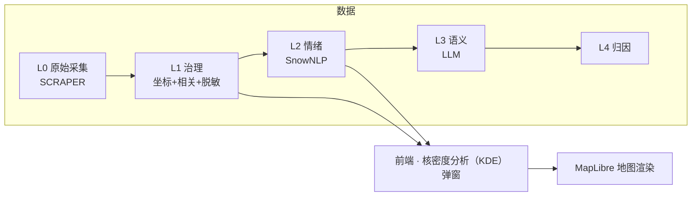
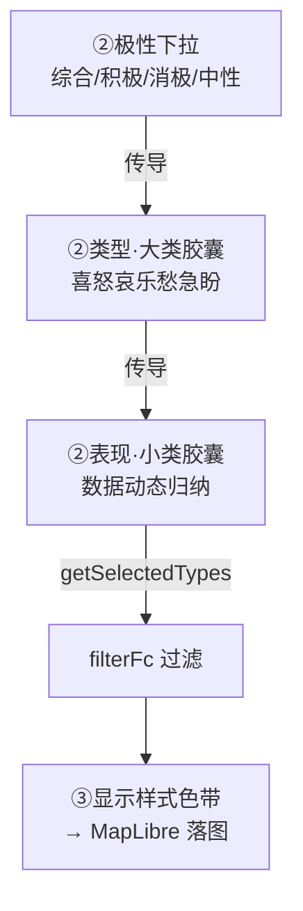

# 修订日志 (Revision Log)

> **定位**：用户需求 → 设计决策 → 落地。从"为什么这么改"的视角记录每一次修订。
> **视角**：用户意图（非程序员表述 → 专业精炼）为主，技术落地为辅。
> **维护**：每次合并需求后，AI 按板块自动追加一条；跨板块的设计主线变更同步更新第 4 节。
> **起算**：2026-06-18（前端迁移期）。更早的技术心得见 `dev-notes.md`，每日任务见 `todo.md`。

---

## ★ 任务路线图（模块化任务树）

> 开发时主看本文件即可（历史修订见第 5 节）。树按 **主干（系统架构）→ 分支（功能模块）→ 临时分支（搁置 / 待决策）** 组织，聚焦架构搭建与模块开发；不记 todo 执行细节（见 `todo.md`）、不带日期戳。
> 状态：✅ 完成 / 🔄 进行中 / ⬜ 待启动（下一步或未来） / ⏸ 搁置 / ❌ 否决。◆ = 架构转折点（解锁下游）。新分支产生即追加（AI 全程维护）。

**树状结构**：

```text
emotion_map（根）
│
├─ 主干 · 系统架构（奠基层）
│  ├─ 七层骨架 ✅  frontend · apps · core · SCRIPT · SCRAPER · DATA · design
│  ├─ Import/Export 管道 ✅  Import（geojson.io 1:1 + 多格式 + CRS 自动投影）｜Export ✅（geojson/csv/shp.zip + CRS + 脱敏，后端 geopandas `/export`）
│  ├─ 外壳/控件/视觉 ✅  MapLibre GL + 天地图 + Design Token 双主题
│  ├─ 数据采集 Scrapy ✅  框架就绪
│  ├─ 数据管道 L0→L4 🔄  L0→L1→L2 通（L1 待 API Key 验证）｜L3 语义 ⬜｜L4 归因 ⬜
│  └─ Harness · MCP/Agent ✅  v2.1：8 Agent 编排 + 7 MCP（智谱优先）
│
├─ 分支 · 功能模块
│  ├─ 核密度分析（KDE）弹窗 🔄
│  │  ├─ 批1 快赢 🔄  1a 预览图 ⏸｜1b 色带系统（随胶囊+HSL+色相细分）✅
│  │  ├─ 批2 全局时间轴 ⬜  ◆ 架构转折点（解锁批3/4）
│  │  ├─ 批3 3D 渲染 ⬜  地形凸凹 / 网格柱体（依赖批2）
│  │  ├─ 批4 时间对比 ⬜  A/B 双窗（依赖批2）
│  │  └─ 批5 图层分组 🔄  5A 自动归类 ✅｜5B 自由编组 ⬜
│  ├─ 图层/设置/Overview 🔄  联动 ✅｜Layers 分组重做 ✅
│  ├─ Toolbox 工具箱 🔄  多维归因分析 ⬜（自 KDE ① 剥离）｜缓冲分析 ✅（后端 geopandas EPSG:4546 + 3 段弹窗 + 独立组卡 + B 编辑 + 复用 Range popup）
│  ├─ Range 范围 🔄  上载模块 ✅（绘制工具迁入 + 两组卡 + 自动 popup）｜绘制模块 ✅（多边形/矩形 移植 geojson.io，绘制卡常驻；点/线/圆 ⬜）｜范围分析 ⬜（缓冲/叠加/聚合）
│  ├─ Analysis 情绪分析接入 ⬜  L2 管道接前端 / 空间分析 MVP
│  └─ Table 数据表格 ⬜  列表 / 筛选 / 导出（联动管线已预留）
│
└─ 临时分支（搁置 / 待决策）
   ├─ KDE 批1 1a 预览图 ⏸  等 terrain/factor kepler 截图补齐
   ├─ 高级参数 bug（C5）⏸  暂不修
   └─ 待决策  KDE 批2 粒度｜批3 地形 vs 柱体
```

---

## 1. 三份记录的分工

| 文档 | 视角 | 回答什么 | 读者 |
|------|------|----------|------|
| **revision-log.md（本文件）** | 用户意图 + 设计决策 | "我提过什么要求、为什么、怎么落地" | 你（回顾）+ AI（熟悉开发意图） |
| `dev-notes.md` | 开发者技术心得 | "怎么实现的、踩了什么坑、学到什么" | 开发者 |
| `todo.md` | 每日任务 + 执行日志 | "今天干了什么、明天干什么" | 当日推进 |

> 三者互补不重复：本文件记**意图与决策**，技术细节回链 dev-notes/todo 的对应日期。

---

## 2. 术语表（全站统一，杜绝混用）

| 术语 | 含义 | 易混点 |
|------|------|--------|
| **类型（大类）** | 情绪 7 大类：**喜怒哀乐愁急盼**，固定、高度抽象 | 不要和"小类"混用 |
| **表现（小类）** | 数据中 `emotion_type` 动态归纳（不满抱怨/焦虑担忧…），数量不固定 | 是大类的"具体表现" |
| **极性** | 综合 / 积极 / 消极 / 中性（L2 字段） | 积极=喜+乐，消极=怒+哀+愁，中性=急+盼 |
| **栏** | 占满整行的单条内容（如 Layers 图层行、③显示样式行） | 选中态=浅蓝填充 |
| **选项** | 一行多条、需单选/多选（如分析类型卡、类型/表现胶囊） | 选中态=粗蓝框+浅灰填充 |
| **L0–L4** | 数据分级：L0 原始 → L1 治理(置信度) → L2 情绪(SnowNLP) → L3 LLM → L4 归因 | L1 无情绪字段，仅 L2 有类型/表现 |
| **色带分段条** | kepler 风格离散色块拼接（非无极渐变） | 全站色带统一用此形式 |
| **核密度分析（KDE）** | Kernel Density Estimation，热力图底层算法（点→连续密度面） | **禁用"热核"简称**；英文标识符 `heatmap` 保留 |

---

## 3. 板块总览

| 板块 | 状态 | 主文件 | 最近活跃 |
|------|------|--------|----------|
| 前端 · 核密度分析（KDE）弹窗 | 🔄 活跃 | `frontend/js/heatmap-tool.js` `css/dialog.css` | 2026-06-20 |
| 前端 · Import 管道 | ✅ 稳定 | `frontend/js/import.js` | 2026-06-18 |
| 前端 · 图层/设置/Overview | 🔄 活跃 | `sidebar.js` `settings.js` `panel.js` | 2026-06-20 |
| 前端 · 外壳/控件/视觉 | ✅ 稳定 | `map-controls.js` `popup.css` `tokens` | 2026-06-17 |
| 数据管道 · L0→L4 | 🔄 待验证 | `SCRIPT/data_governance.py` `emotion_analysis_v1.py` | 2026-06-19 |
| 数据采集 · Scrapy | ✅ 框架就绪 | `SCRAPER/` | 2026-06-12 |
| Harness · MCP/Agent/闭环 | ✅ v2.1 | `.claude/` `docs/mcp-strategy.md` | 2026-06-17 |



---

## 4. 设计意图脉络（关键决策演进）

把散落在各次需求里的"为什么"提炼成几条主线。**任何接手的 AI 都应先读这一节**，理解项目的设计哲学。

### 4.1 配色统一 kepler 化
- 所有色带改为 **kepler 离散分段条**（色块拼接），不用无极 linear-gradient——视觉更专业、与 kepler 一致。
- 色板取值采样自 kepler 源码内置方案：网格暖色谱 ≈ Global Warming；7 色分类 ≈ UberPool 6 色 + 补 1 色；L1 默认单色改橙红（ColorBrewer Reds）。
- **全站色带位置一致**：核密度分析（KDE）弹窗 ③、Overview、要素设置弹窗都用 `.segmented` 分段条。

### 4.2 术语二分：类型 ↔ 表现
- 早期"情绪类型"一词既指大类又指小类，混乱。
- **统一**：类型 = 大类（喜怒哀乐愁急盼，固定 7）；表现 = 小类（动态归纳）。所有 UI 文案、Overview、代码命名按此二分。
- 极性 → 大类是固定传导：积极=喜+乐，消极=怒+哀+愁，中性=急+盼。

### 4.3 选中态二分：栏 ↔ 选项
- 全站选中态原本各处不一（有的浅蓝填充、有的蓝边）。
- **统一两种语义**：栏（占满整行）= 浅蓝填充无边框；选项（一行多个）= 粗蓝框 + 浅灰填充。
- 悬停态也统一：栏和选项 hover 都是浅灰、不加框（与 Layers 行一致）。

### 4.4 弹窗三阶引导
- 原弹窗三阶是"分析什么/怎么显示/调参数"，参数项喧宾夺主。
- **重排**：①选择分析类型 → ②选择数据源（数据/极性/类型/表现，自上而下联动传导）→ ③显示样式（随①②联动）。
- 参数（半径/透明度/权重…）降级进"高级"折叠区，不再占引导编号。

### 4.5 数据流联动：极性 → 大类 → 小类 → 落图
- 早期"选大类/小类对落图无影响"——因为"全选=不过滤"规则把效果吞了。
- **修正**：每次点击都必须在落图上见效；大类全空 = 全不要（非"全选"）；空数组明确拦截。
- L1 无情绪字段时，类型/表现胶囊不渲染（显示禁用提示），不再用兜底值"期待建议"误导。



### 4.6 "继续编辑"语义：H 按钮继承参数
- 点图层上的 H 要素按钮，应**以该图层当初生成时的参数**继续编辑，而非弹空白默认窗。
- 落地：`generateHeatmap` 把 UI 选择持久化进 `paint._ui`；`openHeatmapDialog(layerId)` 反推填回所有控件。**这是全站交互范式**——"再次打开 = 当初参数"。

### 4.7 取消按钮弱化
- 取消/次要按钮统一：白底 + 深灰字 + 细线框 + 悬停变灰，**不填充**，弱化重要性。主操作按钮保持蓝底白字。

### 4.8 主线收敛与反复（复盘）

定期回看哪些主线已稳定、哪些还在反复——暴露设计上的犹豫点。

| 主线 | 状态 | 反复点 / 张力 | 收敛方向 |
|------|------|--------------|----------|
| 配色 kepler 化 | ✅ 已收敛 | 初期按 YlOrRd / Tol Bright 推测取色，后改为采样用户提供的两张参考图 | 以采样图为准，色板不再频繁更换 |
| 术语二分（类型/表现） | ✅ 已收敛 | "情绪类型"一词早期既指大类又指小类；Overview 曾用小类却标"类型" | 全站统一，新 UI 按此二分 |
| 选中态二分（栏/选项） | ✅ 已收敛 | 各处原本不一（1px 蓝边 / 浅蓝填充 / 灰底混用） | 两语义类 `.is-bar-sel` / `.is-opt-sel` |
| 三阶引导 | ✅ 已收敛 | 参数项曾占引导编号，喧宾夺主 | 参数降级进"高级"折叠 |
| H 继承参数 | ✅ 已收敛（范式） | 初版 H 弹空白默认窗 | `paint._ui` 持久化 + 反推；作全站范式 |
| 取消按钮弱化 | ✅ 已收敛 | — | 全站次要按钮统一 |
| 数据流联动 | 🔄 反复中 | "全选=不过滤"曾吞掉效果；L1 兜底值误导；"大类全空"语义（全选 vs 全不要）反复 | 已修正为"每次点击见效"，但传导链路复杂 |
| 3D 渲染 | ⚠️ 占位 | 地形凸凹 / 网格柱体均为 dev 占位 | 待 deck.gl 接入后重审样式与数据源耦合 |

**需持续警惕的张力点**：
- **数据流联动**是当前最复杂链路（极性→大类→小类三层传导 + L1/L2 字段差异）。新增分析类型或数据层级时最易引入回归，须连带测试传导。
- **3D 占位**：③里多个 dev 样式，接入真实渲染后需重新审视"样式↔数据源↔维度"的耦合关系。

### 4.9 否决的方案（Why Not）

记录被明确否决的设计选择及原因，**避免后续重复提出**。

| 方案 | 否决原因 | 落地替代 |
|------|----------|----------|
| 保留"纯密度（density）"分析类型 | 与"情绪地图"定位冲突——纯密度不暗示情绪，弱化产品叙事 | 删除；舆情热度由 L1 综合彩虹承载 |
| 积极配消极红、消极配积极绿（反转配色） | 与全站"红=消极 / 绿=积极"约定相反，误导 | 纠正为正向：积极→绿，消极→红 |
| 积极/消极分析可选 L1 数据 | 积极/消极是 L2 专属字段，L1 无此字段 | 选积极/消极时数据下拉锁定 L2 |
| 独立 2D/3D 切换开关 | 2D/3D 已并入③每个样式命名（热力网格 / 网格柱体），独立开关冗余 | 删除 `#hm-dim`，③样式自带维度 |
| "全选小类 = 不过滤"规则 | 吞掉选中态视觉反馈，用户感觉"改了没用" | 打破：每次点击都过滤；全空 = 全不要 |
| L1 用 polarity 兜底派生"期待建议"小类 | L1 无情绪字段，兜底值制造假数据感 | L1 不渲染类型/表现胶囊，显禁用提示 |
| 7 大类用 Tol Bright 标准色板 | 用户提供了具体参考图（图2），标准色板与之不符 | 采样图2（UberPool 6 色）+ 补第 7 色 |
| 色带用无极 linear-gradient | 与 kepler 分段条设计语言不一致 | 全站改离散分段条 |

### 4.10 设计公约速查（后续必须遵守）

新增 UI / 改动时，逐条核对是否合规：

1. **色带**一律离散分段条（`.segmented`），禁无极渐变。
2. **文案**：类型 = 大类（喜怒哀乐愁急盼）/ 表现 = 小类（动态归纳），不混用。
3. **选中态**：栏 = `.is-bar-sel`（浅蓝填充无边框）/ 选项 = `.is-opt-sel`（粗蓝框 + 浅灰填充）。
4. **悬停**：栏与选项都浅灰、不加框（与 Layers 行一致）。
5. **再次打开图层配置** = 继承当初参数（`paint._ui` 反推），非空白默认。
6. **次要/取消按钮** = 白底 + 深灰字 + 细线框 + 悬停变灰，不填充；主操作按钮蓝底白字。
7. **新弹窗**按三阶引导（①分析类型 → ②数据源 → ③显示样式），参数进"高级"折叠。
8. **术语**：核密度分析（KDE），**禁用"热核"简称**；英文标识符 `heatmap` 保留。
9. **工具生成的图层** = 独立组卡片（`categoryOf` 加该工具 category）+ 要素按钮（H/B/…）开**本工具弹窗**（编辑态 `paint._ui` 回填 + 原地更新，layer id 稳定，不删旧新建）。新增工具同时落 6 点（3 组卡 + 3 弹窗，见 memory: tool-layer-convention）。

### 4.11 类型细分色带：固定极性 → 随选中大类动态生成
- 早期类型细分用固定 `positive/negative/neutral` ramp（覆盖极性全部大类），选不选大类色带都一样。
- **改为**：选具体大类（只「喜」/「怒+哀」/…）→ ③色带 / 地图 heatmap / 图例 / Overview 只含选中类色；全选 = 等同固定 ramp（无缝）。
- 落地：`buildMacroRamp` 按 density 弱→强生成 inline stops（rampKey 保持 polarity 维持 reverse 标识 + density 语义）；消费方优先 inline、fallback rampKey。色带与胶囊同向（rampDisplaySegs 据 polarity reverse）+ 地图热核=最强情绪（density 语义不变）。
- **每大类内置 3 段**（明度变体浅/中/深，`macroShades` = lerpHex 混白/原色/混黑）：段数 = 类数×3（积极 6/消极 9/中性 6/单类 3）。3 段是 density 视觉分段（density 低=浅/高=深），因 `heatmap-weight=intensity`，density 高=高 intensity 密集区 → 间接对应 intensity 低/中/高，**不需额外数据字段**（当前数据支持，未来细 intensity 自动生效）。
- **多类组合平滑过渡**：`gradientStops(colors, colors.length*3)` 插值 ×3（关键色间补过渡色，类间不割裂）；`macroShades` 明度收窄（混白 0.25 / 混黑 0.3）保色相（浅色跨类不趋白趋同）。段数 = 类数×9（积极 18/消极 27/中性 18/单类 9）。类内明度渐变 + 类间色相过渡，整体连续。
- **HSL 色相插值**（替 RGB）：RGB 插值绿↔黄中间土黄（经过 RGB 暗区 `rgb(152,148,65)`），HSL 色相旋转（hue 最短路径）中间黄绿明亮（`rgb(123,218,87)`）。`gradientStopsHsl` + `macroShades` HSL lightness。极性区间 积极 绿↔黄（乐改黄 `#F5C842`）/ 消极 红↔紫 / 中性 深蓝↔天蓝。
- **色相细分**（每类 3 段，最终方案）：取消 `macroShades` 明度变体（跨类明度跳变是割裂根源），类色直接 HSL 插值 —— `gradientStopsHsl(类色, 类数×3)`，每类占色带 3 段（色相细分），整体连续不割裂。段数 积极 6/消极 9/中性 6/单类 3（单类同色）。乐回橙 `#F5A623`。

---

## 5. 修订记录（按板块分组，组内倒序）

> 每条格式：`日期 · commit · 用户意图（精炼） → 落地 · 文件`

### 5.1 前端 · 核密度分析（KDE）弹窗（核心）

| 日期 | commit | 用户意图 → 落地 | 文件 |
|------|--------|----------------|------|
| 06-22 | 本次 | 色带回到每类 3 段（色相细分）：取消 `macroShades` 明度变体（跨类明度跳变是割裂根源），改类色直接 HSL 色相插值 —— `buildMacroRamp` `gradientStopsHsl(类色, 类数×3)`，每类占色带 3 段（色相细分），整体色相连续渐变、类间不割裂。段数 积极 6/消极 9/中性 6/单类 3（单类 = 同色 3 段，单 hue 无渐变）。乐色 黄→橙（`#F5C842`→`#F5A623`，5 处回改）。Playwright 实证：积极 6 段 HSL 橙→黄绿 `rgb(176,225,47)`→绿 连续；单喜 3 段同绿 ✓ | `state.js` |
| 06-22 | 本次 | 色带 RGB→HSL 色相插值：RGB lerpHex 中间土黄（绿↔黄 经过 RGB 暗区 `rgb(152,148,65)`）→ HSL 色相旋转中间黄绿明亮（`rgb(123,218,87)`，G 主导）。落地：`state.js` 加 HSL 工具（`_hex2hsl`/`_hsl2hex`/`lerpHsl`/`gradientStopsHsl`，hue 最短路径）；`macroShades` 改 HSL lightness（保色相不趋白）；`buildMacroRamp` `gradientStops`→`gradientStopsHsl`。**乐色 橙→黄**（`#F5A623`→`#F5C842`，5 处同步：EMOTION_MACRO/MACRO_COLORS/HEATMAP_RAMPS.positive/classify-7/怀旧认同）—— 极性区间 积极 绿↔黄 / 消极 红↔紫 / 中性 深蓝↔天蓝。Playwright 实证：积极中间 `rgb(123,218,87)` 黄绿明亮 ✓ | `state.js` |
| 06-22 | 本次 | 多类组合色带割裂（类间硬切，乐深橙→喜浅绿跳变）+ 浅色跨类趋同（混白 0.45 趋白丢失色相）。修复：① `buildMacroRamp` `gradientStops(colors, colors.length*3)` 插值 ×3 —— 关键色间自动补过渡色，类间平滑过渡（积极 绿→褐黄→橙 不割裂）；段数 积极 18/消极 27/中性 18/单类 9。② `macroShades` 明度收窄（混白 0.45→0.25、混黑 0.4→0.3）保色相，浅绿 `rgb(59,168,90)` vs 浅橙 `rgb(248,188,90)` 色相区分不趋同。CSS N 段等宽（N=18 每块~5px 视觉连续）+ 地图 MapLibre interpolate 连续渐变。Playwright 验证：积极 18 段类间过渡色 + 浅色色相区分 ✓ | `state.js` |
| 06-22 | 本次 | 类型细分每个大类内置 3 段色带（明度变体浅/中/深），段数 = 类数×3：积极 6 / 消极 9 / 中性 6 / 单类 3。「高/低值划分依据」：3 段是 density 视觉分段（density 低=浅/高=深），因 `heatmap-weight=intensity`，density 高=高 intensity 密集区 → 间接对应 intensity 低/中/高，**不需额外数据字段**（当前 intensity 通过 weight 进入 density；机制数据无关，未来细 intensity 自动生效）。落地：`state.js` 加 `macroShades`（lerpHex 混白 0.45 / 原色 / 混黑 0.4）+ `buildMacroRamp` 每类展开 3 段 → `gradientStops(colors, colors.length)` 离散 N×3 段。**附带 bug 修**：`#hm-macros` 大类胶囊 click+rAF 改 `change` 事件（label-click 时序下 is-on 滞后 input.checked，单选时 `renderStylePreview` 取旧选中态、色带不更新） | `state.js` `heatmap-tool.js` |
| 06-22 | 本次 | 类型细分色带随选中大类动态变化：只选「怒」→ ③色带/地图/图例/Overview 全红（单色渐变）；多选 → 选中类间渐变；全选 = 等同固定极性 ramp（无缝）。落地：`state.js` 加 `MACRO_DENSITY_ORDER` + `buildMacroRamp(selectedMacros, polarity)`（按 density 弱→强，热核=最强情绪）；`computeStyle` 加 macroFilter 参数 → inline `rampStops`；消费方（`addHeatmapPaint`/legend/panel/`renderStylePreview`）优先 inline rampStops、fallback rampKey；rampKey 保持 polarity（`rampDisplaySegs` 据 polarity reverse 显示，色带与胶囊同向）。大类胶囊 click 补 `renderStylePreview`（色带实时更新） | `state.js` `heatmap-tool.js` `map.js` `heatmap-legend.js` `panel.js` |
| 06-22 | 本次 | H 按钮重生成（原样再点生成）→ 热力图消失、眼睛救不回。**根因（Playwright + paint 查证）**：`openHeatmapDialog` 反推 opacity 时百分比/比例混用——`sp.opacity` 是 0~1（paint 存储）却直接赋给百分比控件（0~100），被 type=range clamp 到 1，`generateHeatmap` 读 `1/100=0.01` 几乎透明 = "消失"；眼睛 toggle 用同一 paint 仍 0.01 = 救不回。**修复**：反推时 `Math.round(sp.opacity*100)` 统一为百分比（首次用 DEFAULTS.opacity=70）。**附带**：`buildWeightExpression` 加 `to-number` 强转（修 MapLibre worker string 类型告警，健壮性）。**配套**：① 编辑分支原地更新（激活 `editLayerId`，4.6「继续编辑」语义，layer id 稳定）；② `serve.py` 拦截 .js 注入 `import ?v=<mtime>`，破 Chrome module graph 缓存（旧 serve 只 main.js 带 ?v，子 module 缓存旧版致 F5 失效） | `heatmap-tool.js` `map.js` `serve.py` |
| 06-22 | 本次 | **订正上轮**（上轮"放弃高密度=最强情绪"破坏 density 语义，错）：类型细分色带方向与胶囊反向 → stops **恢复** density 弱→强（高值=热核=喜/怒/急，不可变约束），显示层新 helper `rampDisplaySegs()` 对类型细分反转（高→低对齐胶囊序）。数据轴与显示轴分离——地图 paint 用 stops 原序（热核=强情绪），弹窗③/图例/Overview 显示反转；图例标注类型细分随之反转（左密集/右稀疏） | `state.js` `heatmap-tool.js` `heatmap-legend.js` `panel.js` |
| 06-22 | 本次 | 小类胶囊色与大类色板冲突（"不满抱怨"=橙却属大类"愁"=紫）→ 小类色**按大类派生**：单小类=大类色，愁类 2 小类用紫色系明度梯度（焦虑担忧中紫 `#A569BD` / 不满抱怨深紫 `#7D3C98`）。调用点不动（`EMOTION_TYPE_COLORS[t]` 值变即生效） | `state.js` |
| 06-21 | `e5bc20` | 剔除 KDE 弹窗归因卡片组（factor/attribution），改作 Toolbox 独立工具；①回归 2 排，窗口高度收紧（120→80）。加多维归因入口 + 工具栏 i 介绍（独立 .tool-tooltip 隔离 KDE） | `heatmap-tool.js` `dialog.css` `index.html` `sidebar.css` `sidebar.js` |
| 06-20 | `4454225` | Overview 的"情绪类型"显示的是小类却叫"类型"，术语冲突 → 拆"情绪类型（大类）"+"情绪表现（小类）"两行；持久化 `_ui.macroFilter`，旧图层用 `EMOTION_MACRO_MAP` 反推 | `panel.js` `heatmap-tool.js` |
| 06-20 | `cec784a` | ① 选 L1 却出现"期待建议"胶囊（L1 无情绪字段）→ L1/L3/L4 不渲染胶囊、显禁用提示；② H 按钮应继承图层参数继续编辑 → `openHeatmapDialog(layerId)` 反推；③ Overview 渐变色带改离散分段（设计语言统一） | `heatmap-tool.js` `settings.js` `dialog.css` |
| 06-20 | `7332a0d` | ① 色带改 kepler 离散分段条（不要无极渐变、去文字）；② 弹窗加长免滚动；③ L2+中性色板应为蓝系（与急/盼胶囊呼应）；④ 类型/表现默认展开、类型去线框、7 类按喜怒哀乐愁急盼配色（黄绿→深蓝）；⑤ 网格 2D/3D 合并一条；⑥ 选项选中=粗蓝框+浅灰、栏=浅蓝、悬停浅灰；⑦ 取消按钮弱化 | `dialog.css` `heatmap-tool.js` 6×SVG |
| 06-20 | `6ba8b2c` | 预览图换 kepler 官方层截图（更真实） | 4×PNG |
| 06-19 | `c9c4808` | 地形/网格 infopanel 预览换 kepler 风 SVG | 2×SVG |
| 06-19 | `0c94c54` | 情绪归类应默认综合极性、数据下拉默认 L1 | `heatmap-tool.js` |
| 06-19 | `e596bad` | 切分析类型/数据层级时极性→大类→小类要联动传导（所有类型） | `heatmap-tool.js` |
| 06-19 | `8af860f` | H 按钮带参数打开；Overview 色带离散化（初版） | `panel.js` `sidebar.js` |
| 06-19 | `1563612` | 弹窗三阶引导 ①②③ 重构落地（联动骨架） | `heatmap-tool.js` |
| 06-19 | `e9bd0d0` | 选大类/小类对落图无影响 → 打破"全选=不过滤"；大类全空=全不要；生成时打 filter 日志 | `heatmap-tool.js` |
| 06-19 | `6863515` | 取消按钮弱化 + 选中态二分（栏/选项）初版 | `dialog.css` `heatmap-tool.js` |
| 06-19 | `354296e` | 借鉴 kepler 重做色板/样式：三阶引导、6 张预览图、离散色板、7 大类喜怒哀乐愁急盼、栏/选项选中态（重构主体） | `heatmap-tool.js` `state.js` `dialog.css` `index.html` 6×SVG |
| 06-19 | `0390e3d` | 新增核密度分析（KDE）工具（首版 500 行）+ 情绪词典 7 类微观标签 + L2 极性着色 | `heatmap-tool.js` `emotion_lexicon.py` `state.js` |

### 5.2 前端 · Import 管道（06-18，提炼自 todo.md）

| 日期 | commit | 用户意图 → 落地 |
|------|--------|----------------|
| 06-18 | `0390e3d` 等 | geojson.io 1:1 导入体验：拖放/选择 → 确认弹窗 → 多格式(GeoJSON/CSV/KML/Shapefile) + CRS 自动重投影到 WGS84 + 几何分流 + 极性探测 + 图层管理器（眼睛/删除） |
| 06-18 | — | 点大小密度自适应（取代固定倍率）；L1 橙色置信度着色；图例按层显隐；polygon 海军轮廓默认不填充 |
| 06-18 | — | 要素按钮 + Kepler 设置弹窗（预设色板/透明度/线宽/填充）|

### 5.3 前端 · 图层/设置/Overview/外壳（06-17~06-20）

| 日期 | 用户意图 → 落地 | 来源 |
|------|----------------|------|
| 06-17 | 地图控件统一簇（复位/2D-3D/比例尺）；3 级字体浓度；popup 折叠胶囊；geojson.io 光标三态；点悬停轮廓环 | dev-notes 06-17 |
| 06-18 | Layers 图层行选中=浅蓝填充（确立"栏"选中态范式，后被 4.3 推广全站） | todo 06-18 |
| 06-21 | **Layers 分组重做（类 Photoshop）— 核心四件**：①组折叠/展开 ②组内拖拽（L2 极性子层可拖了）③组卡拖拽（组间排序）④自动分类 5 组（热力图 / L2情绪 / L1热度 / L0原始 / 范围边界）。方案=**渲染层聚合**：`categoryOf(layer)` 按 kind/colorMode/needsAnalysis 推导，`_groupOrder`/`_groupCollapse` 为新 UI 状态（不进 `_layers`）；不动 `_layers` 结构 / `addLayer`·`addGroup` 签名 / main.js 导入 / `reorderAllZ`。`applyGroupOrder()` 规整 `_layers` 到 `_groupOrder` 以保 list-top=map-top 不变式（热力图生成时独占显示，置顶不遮点）。承重点：`renderLayerList` 事件绑定迁移 + 双 flavor 拖拽（组卡=组间 / 图层行=同组内，跨组移动留后续） | 本次 |
| 06-21 | **Layers 体验优化**：组卡阴影+间距（对齐工具按钮设计语言）；折叠三角放大并移至栏最右 + **双击组卡折叠**（去掉组卡单击=开 Overview，单击/双击分离）+ 折叠态浅灰填充；**中文语义命名**（L1=`热度分布·文件名`、L2 子层=`积极/中性/消极·文件名`、组卡标题=`L1·城市情绪 DATA`/`L2·情绪地图 DATA`、热力图=`分析类型·下一层级·[半径]`，`·` 为分隔符）；Layers 标题栏加 eye 一键开关全部图层；**Overview 标题=加粗目的 + 另起一行弱化"文件名：xxx"**（全局规则：Overview 必带数据源文件名；新增 `layer.srcName`，L2 组/热力图 srcName 一并带出，热力图从 sourceKey 解析源层）；组/分类/头部 eye 改 **any-visible=on** 语义（任一开则开、全关才关）；toast 停留 3200→2000ms（淡出已存在） | 本次 |
| 06-24 | **左端布局 + L2 点/折叠/拖拽细化**：①绘制范围组卡从顶部 `.lp-draw` 常驻**并入 Range 模块**（上载+绘制两卡）；②撤销 Layers 单独滚动条（还原左端整体滑动）；③图层栏压缩至 ~2/3（`.layer-row` padding 2px / `.layer-group` 3px·gap 3·margin 4）；④**双击 L2 组只折叠该组**（新 `_groupFold` set + `isGroupFold`/`toggleGroupFold` 按 group id 非 category——修"双击一个 L2 全部折叠"；category 级 `_groupCollapse` 仍管虚拟组卡）；⑤L2 多 group 拖拽补 drop 到子层分支（找父 group 整组 `reorderLayers`，修"偶尔有效"）；⑥L2 情绪点默认 **3-6px zoom 自适应**（删 main.js 导入写死 `radius:8`，走 addPointPaint `_isL2` adaptive）；⑦类型细分·积极默认 半径 150/强度 1.5；⑧热点图（deck.gl）方向不对**撤回 UI**（`addHotpointLayer`+CDN 保留搁置）。 | 本次 |

### 5.4 数据管道 · L0→L4（06-09~，提炼自 dev-notes）

| 日期 | 用户意图 → 落地 |
|------|----------------|
| 06-09 | 情绪分析引擎模块化：`AnalyzerBase` 抽象基类 + `SnowNLPAnalyzer` + `LLMAnalyzer` 预留 + 工厂 `create_analyzer()` + `run_pipeline()` |
| 06-19 | 情绪词典 7 类微观标签（喜怒哀…→治理动作映射），供前端小类归纳 |
| 06-12 | 数据分级 L0~L4 概念确立；L1→L2 管道实现（L1 LLM 分类需 API Key，待验证） |

### 5.5 数据采集 · Scrapy（06-12）

- 技术选型 Scrapy；搭建标准项目；小红书 Spider；Pipeline（去重/清洗/导出 CSV）；礼貌爬取（延迟 2s/并发 1）。

### 5.6 Harness · MCP/Agent/闭环（06-17）

- **06-23**：交接卡翻新为**单节点快照**（每日覆写、不累积历史，旧节点删——已进 revision-log+git）；skill 精简 `.claude/skills/` 465→235，230 个无关 skill（19 家族 blueprint/configure/obsidian/typescript/container/k8s/gh-actions/finops/terraform/taskwarrior/networking/rust/macos/langchain/home-assistant/comfyui/bevy/codebase-attributes/component-patterns + 35 one-off）`git mv` 归档到 `.claude/skills_archive/`（零删除可逆）。**机制审计结论**：渐进式披露健康（skill body 惰性加载，token 有缓存兜冲），唯一问题是注册表臃肿致**注意力稀释**——精简为卫生，非纯省 token。

- MCP 实测 7 通，确立"智谱优先 + 回退阶梯"路由（`docs/mcp-strategy.md`）。
- Agent 协作 v2.1（8 agent + MCP 能力段）；闭环补强（trace 落盘/pre-commit/emoji hook/PII guard/Auto Memory 索引/CI）。

### 5.7 前端 · Range 模块 + popup 收起修复 + 三区架构（06-22）

| 日期 | 用户意图 → 落地 |
|------|----------------|
| 06-22 | **Range popup 收起 bug（DRY，与情绪点同源）**：用户报"点轮廓线以外区域 popup 不收起"。根因 = 范围层透明 hit 带（`lyr-{id}-hit`，宽、opacity 0）被 `queryRenderedFeatures` 当 line 层 → 点不可见 hit 带时 `hitRange=true` 不收起。修：popup.js 抽 `classifyMapClick()` 单一处理，hit 带**分态**（popup 关→开/易命中，开→收），可见轮廓（非 `-hit`）始终保持；map.js 删 `hitLid` click opener（并入中心处理消除开/收竞争）、`HIT_WIDTH` 12→20、hover 加宽轮廓 + tooltip 全保留。**测试追加修同质漏网**：原 `hitRange` 未过滤底图层 → positron `landcover`(fill) 误判点中范围，加 `lyr-` 前缀只认本项目层。删 range popup「顶点」「bbox」两行（用户不要）。Playwright 真实点击 4 态全过（空白→收 / hit 带关→开 / hit 带开→收 / 可见轮廓→开）。 |
| 06-22 | **Range 模块（范围上载）**：用户定"绘制工具服务于指定范围 → 迁入 Range"。6 绘制按钮（点/线/多边形/矩形/圆/更多）从工具栏迁入左栏 Range **上组卡**（`.range-card` 复用 `.tool-row` 圆角+阴影+"i"，3×2 网格）；**下组卡** = + Upload Range（accept 去 csv/gpkg；`runRangeImport` 滤 csv + 跳 points）；上传后自动弹展开 popup（用户要求）。`select` 留工具栏；绘制功能仍 Phase 2 占位。 |
| 06-22 | **三区设计逻辑**（用户提出：上端工具区 / 左端工作区 / 右端展示区）→ `docs/architecture.md` 第九节：三区职责 + `--left-w/--right-w` 折叠机制 + `layers:changed`/`layer:selected`/`layer:paint` 联动事件总线 + Table 联动管线预留。 |

---

### 5.8 前端 · 缓冲分析（Buffer）工具 + L0 精修 + F5 工作流（06-22）

| 日期 | 用户意图 → 落地 |
|------|----------------|
| 06-22 | **缓冲分析工具端到端**：后端 `core/buffer_analysis.py`（geopandas，EPSG:4546 米制 buffer + 可选 dissolve，F_005）+ `POST /api/v1/spatial/buffer`；前端 `buffer-tool.js`（3 段弹窗：①输入图层 ②缓冲参数 ③显示样式）+ Toolbox `#tool-buffer`（紧跟 HeatMap）+ `api.js runBuffer`（BASE 改绝对 8000）。生成 = polygon 层 + Overview 显总覆盖面积。测试数据 `DATA/processed/宜昌市医疗点.geojson`（30 点，五区）。 |
| 06-22 | **L0 点精修**：默认 4px + 80% 透明 + 深灰 #4a4a4a；颜色参数用全局预设色板 `PRESET_COLORS`（10 色，首色深灰=默认；不自由调色，全局点·面通用）。密度自适应半径封顶 ≤10px（稀疏 6-10/中 4-7/密 2-4）。 |
| 06-22 | **buffer 弹窗参数**：距离手动输入框 + 静态 m（默认 1000）；显示样式 4 参数——线型胶囊（实线/虚线，阴影+hover灰+选中蓝）/ 线宽(1-8) / 颜色(预设色板，默认天蓝 #4FC3F7) / 填充透明度(15%)；轮廓与填充同色（`addPolygonPaint` lineStyle→dasharray）。生成键 `btn-primary` 蓝（一致性）。 |
| 06-22 | **buffer 精修 7 项**：①要素按钮 B（hintChip）；②色板固定 26px（settings.css）；③B 按钮开缓冲弹窗（镜像 H：路由 + openBufferDialog(layerId) seed 回填 + edit-mode 原地更新，layer id 稳定）；④距离去重（input+m，无重复值）；⑤独立组卡"缓冲分析"（categoryOf+CATEGORY_LABEL+_groupOrder）；⑥popup 复用 Range（badge"缓冲"+右侧距离+文件名+只类型+收起显距离）；⑦**serve.py 自动起后端**（spawn uvicorn + health 等 + cleanup + --no-backend）→ 一条命令 + F5 迭代。 |
| 06-22 | **设计公约 + memory**：revision-log §4.10 加 #9（工具生成层=独立组卡+要素按钮开本工具弹窗，新增工具落 6 点）；memory `tool-layer-convention`。 |

---

### 5.9 前端 · 多边形/矩形绘制 + 图层导出（06-23）

| 日期 | 用户意图 → 落地 |
|------|----------------|
| 06-23 | **国内登不上 geojson.io → 多边形绘制（原任务三.1）提前**：移植 geojson.io 自实现 handler（不用 mapbox-gl-draw——与 MapLibre 5 不兼容；不用 terra-draw——ESM 需构建）。新 `frontend/js/draw-tool.js`：多边形（点顶点→双击/回车/点起点完成，移植 `polygon.ts` 三判定 + `close_polygon` + 橡皮筋临时点）+ 矩形（拖拽，Shift 锁正方形，移植 `rectangle.ts`）。`state.js` 加 mode 状态机（NONE/DRAW_*，中立枢纽避免环依赖）。提交走 buffer 同款链路（addLayer polygon → range popup）。**绘制卡提为 `#left-panel` 常驻**（脱离 import/sections 模式门控，空地图态即可画边界，无需先导入——解锁"先画边界再模拟"用例）。Playwright 验证：3click+dblclick→落层+popup+临时层清空。 |
| 06-23 | **图层导出（后端 geopandas）**：客户端 shp-write 无 UMD、2020 停更（死路）→ 新 `POST /api/v1/export`（`core/export.py export_layer` F_005）。GeoJSON（WGS84 固定，RFC 7946）/ CSV（WKT·lonlat·仅属性）/ Shapefile.zip（WGS84·CGCS2000 4546；混合几何按 geom_type 分组多个 shp 同包）+ 脱敏（剥 PII）。**CRS 选项仅 shp**（WGS84/CGCS2000）——规划交付常需 CGCS2000 米制；GeoJSON 固定 WGS84（给 CRS 即违规）。模态加 CRS(条件)/CSV几何/范围(选中·全部) + 格式切换显隐。验证：4 路径 200 + CRS 实转（.prj GEOGCS↔PROJCS）+ 脱敏剥 username。 |
| 06-23 | **借鉴固化**：建 `docs/geojson-io-reference.md`——绘制已移植点 + 后续可移植几何工具（simplify/circle/merge/centroids）+ Table/编辑器/右键思路，**以后开发查此文档、不翻 docs/geojson.io/ 文件夹**。 |
| 06-23 | **Range 面线型切换（实线/点划线）**：Range polygon 要素按钮"面"的 settings popover 加线型控件（实线/点划线，带 SVG 预览）。点划线 `[6,3,1,3]`+round cap（圆点），**刻意区别于缓冲面域短虚线 `[2,1.5]`（butt cap）**——两类面域虚线靠节奏区分（长-点-长 vs 均匀短虚线）。默认实线不变。`map.js` addPolygonPaint 加 dashdot 分支（line-cap 属 layout 非 paint）。Playwright 验证：默认无 dasharray → 点划线 [6,3,1,3]+round。 |
| 06-23 | **胶囊按钮设计语言（UI 公约）**：线型选择改胶囊样式——**无线框 + 阴影 + 选中蓝(蓝底白字) + 悬停灰 + 紧凑规整**（区别细线框次要按钮 §4.7 与圆形色板 swatch）。设为可复用胶囊语言（memory: capsule-button-design-language），后续选项类选择器（色板/分析类型等）套用。 |
| 06-23 | **修 bug：上传范围误弹极性图例**。根因：`addLayer` 默认 `colorMode='polarity'`（情绪 point 专属）漏给 polygon/line（range 上载/缓冲/绘制多边形都中招）→ refreshLegend 见 polarity 即显 L2 极性图例。修：① [state.js](../frontend/js/state.js) addLayer 默认值按 kind 区分（point→polarity/needsAnalysis，polygon/line→'range'）；② [sidebar.js](../frontend/js/sidebar.js) refreshLegend 极性图例判定加 `kind==='point'` 守卫（防复发——情绪色系 colorMode 一律 point-only）。layerLevel 本就 kind-first 无此 bug。Playwright 验证：画多边形→极性图例隐、范围图例显、hint chip 'R'。 |
| 06-23 | **Range popup 胶囊文字细化**：① 展开态 badge 依来源——绘制范围→「多边形」/「矩形」（`_ui.shape`）；上载范围→「上载」（无 `_ui`）；缓冲→「缓冲」不变。② 收起态 badge 一律显面积（2 位小数 + km²，如「4.61 km²」），替代原 "Range" 英文（缓冲仍显距离）。[popup.css](../frontend/css/popup.css) 收起胶囊统一紧凑测量样式（非大写、xs），合并掉冗余 is-buffer 规则。`_rng` 增存 `expandedText` + `area`。Playwright 验证：绘制多边形→展开「多边形」/收起「4.61 km²」。 |
| 06-23 | **export "Failed to fetch" 根因 = 浏览器拦跨域 :8000**：服务端/CORS/路由全正常（curl POST `/export` → 200 + ACAO 回显 + 有效 geojson；Playwright 干净 Chromium 同页跨域导出 200），用户 Chrome 正常+无痕均 `Failed to fetch` = **浏览器级拦截**（非 file://、非孤儿 uvicorn、非系统代理——`ProxyEnable=0` 且 `127.*` 在 ProxyOverride 绕过列表；嫌疑：开了「允许无痕」的代理/VPN 扩展、HTTPS-Only、或托管策略/杀毒截 Chrome 流量）。**改同源架构彻底消除跨域这一跳**：[serve.py](../frontend/serve.py) 加 `_proxy_api`——`/api/*` 反代透传到 uvicorn :8000（method/body/headers/响应全转，含 export 二进制 blob + 4xx/5xx 透传 + 502 后端不可达），`do_GET`/`do_POST` 均拦 `/api/`；[api.js](../frontend/js/api.js) `BACKEND='http://127.0.0.1:8000'` → `BASE='/api/v1'`（同源相对）。浏览器只跟 :8080 说话，:8000 这跳在服务端完成。Playwright 实证：同源 `/api/v1/export` POST → 200 + `application/geo+json` 242B。**踩坑**：后台命令用 `head -N` 截断 serve.py 输出，会因 `log_message` 日志凑满 N 行触发 SIGPIPE 杀掉 serve.py（验证假阳性 Failed to fetch），长跑服务**禁接 head**、输出转日志文件。 |
| 06-23 | **手画层导出 500 = CJK 文件名撑爆 Content-Disposition 头**：手画层名「绘制多边形 · N顶点」经 `_safe_name` 保留中文 → 路由 `Content-Disposition: attachment; filename="二马路.geojson"` 头含非 ASCII → Starlette 用 latin-1 编码头 `UnicodeEncodeError`（position 落在中文字符）→ **未捕获 500**（返回纯文本 "Internal Server Error"，前端 `r.json()` 失败回退显「500」而非带 detail 的 JSON）。**用户复现锁定**：全部图层（`fname=emotion_map_all` ASCII）✓ ／ 上载层选中（ASCII 名）✓ ／ **手画层选中（CJK 名）✗**——差别仅在文件名是否 ASCII。修 [api/routes.py](../api/routes.py) `export_route` 改 RFC 6266 双声明：`filename=` ASCII 兜底（ASCII 名直接保留、CJK 回退 `export.<ext>`）+ `filename*=UTF-8''<百分号编码>`（浏览器优先 filename*，保留中文文件名）。TestClient 实证：CJK ／ ASCII ／ shp+cgcs2000 全 200。**漏网之鱼教训**：之前所有 curl/Playwright 导出测试都用 ASCII 文件名（`proxy_test`/`pw_sameorigin`），从没触发 CJK 路径——CJK 用例须进回归。 |

### 5.10 任务一 · 情绪数据模拟器（06-24，家用机）

| 日期 | 用户意图 → 落地 |
|------|----------------|
| 06-24 | **任务一模拟器 v3.0 跑通但点位不可用 → v3.1 重做空间生成**。Phase A 资产（[emotion_text_pool.py](../SCRIPT/emotion_text_pool.py) 78 条 SnowNLP 预筛文本、**L2 锚定命中率 100%**；[snapshot_config.py](../SCRIPT/snapshot_config.py) 3 快照叙事 二马路 T1 消极 60%→T3 积极 65%；[poi_data/](../SCRIPT/poi_data/) 158 真实 POI 种子 WGS84 + 4×5 映射 75 条）+ v3.0 [generate_l1_mock.py](../SCRIPT/generate_l1_mock.py)（3 快照 × 2500 + 二马路 +150m buffer 加密 + 重点区域埋点 + L1→L2，score_mean 0.46→0.57→0.65 叙事弧）。**但 v3.0 空间生成 = 158 POI 种子高斯聚类 → 离散光斑 + 伍家空白**（数据证实：75% 网格空、伍家 0 点、最大光斑 388 点/格）→ **用户判"完全不可用"**。**v3.1（下轮办公机）**：高德真实 POI（全类目）→ numpy 核密度曲面（histogram2d + 高斯卷积，不引 scipy）→ 全域按密度拒绝采样（替聚类），复用 Phase A + v3.0 非空间部分，只改 generate_zone_points。边界：用户提供 `DATA/boundaries/` 西陵伍家核心主城(139.6km²) + 大南门二马路滨江片区(0.599km²) geojson（WGS84）。环境补 snownlp/jieba/tqdm（原缺）。**待办**：AMAP_KEY 填 .env（高德 Web 服务 Key）。 |
| 06-24 | **v3.1（158 种子 KDE）仍判不可用 → v3.2 换高德真实 POI + 陆域掩膜根治四大空间病灶**。识图诊断（百度真实热点图早8/晚12 + 长江核心主城范围关系图）+ 数据定位根因：158 POI 种子空间分布错（纬度全在北半部 [30.685,30.780]、经度东西横铺不沿江、~70% 西陵西部）+ 主城边界西界=长江中线（含水域）→ ① 点落江（T1 最西经度带 1077）② 东西延伸 ③ 无西陵/伍家格局（77% 堆西经度 1/4）④ 无多组团（sigma 400 糊一团）。**三招根治**：① [pull_amap_poi.py](../SCRIPT/poi_data/pull_amap_poi.py) `types=typecode` 13 类替中文名 keywords 全文搜（后者全宜昌餐饮才 25 粒；用户首给 JS API key 报 USERKEY_PLAT_NOMATCH → 换 Web 服务 key）→ **1270 POI**（含伍家万达 111.30/中南路/东站，纠正"伍家在 111.40+"经度误判——伍家主体在 111.30-37）；② [load_boundaries](../SCRIPT/generate_l1_mock.py) 扣用户提供的 `现状水系.geojson`（747 水域）→ 陆域 123.29 km²（原 139.56），`contains()` 天然避江；③ [poi_density.py](../SCRIPT/poi_data/poi_density.py) `bg_ratio` 0.3→0.02（纯 KDE）+ `sigma_m` 400→250。**指标**：落水系 1077→**0(0.00%)**、沿江 NW-SE 带（lon-lat 相关 **-0.65**）、填充(500m) 19%→**57%**、KDE 覆盖 10%→**35%**、叙事弧 0.46→0.57→**0.63** 不变；④ 多组团待视觉。新增 poi_density/pull_amap_poi/check_spatial + 现状水系.geojson + amap_poi_wgs84.json。 |

---

### 5.11 地点搜索 + 共享 place 层 + 情绪点重平衡（06-24，办公机，进行中）

| 日期 | 用户意图 → 落地 |
|------|----------------|
| 06-24 | **二马路"好几十倍"失衡 + 评论零地域性 → 共享 place 层 + 重平衡 + 本地化文本（Phase 0/1/1b）**。根因定位（[generate_l1_mock.py:60-61](../SCRIPT/generate_l1_mock.py) 硬编码 `TARGET_TOTAL=2500`/`ERMALU_TARGET=700` → 0.43% 面积塞 28% 点 = 密度比 47×；[emotion_text_pool.py:237](../SCRIPT/emotion_text_pool.py) `sample_text(polarity,element)` 零地域绑定）。**建共享 place 层脊柱**（[core/place_layer.py](../core/place_layer.py) 单例 + [DATA/place/zone_typology.json](../DATA/place/zone_typology.json) + [place_keywords.json](../DATA/place/place_keywords.json)：6 叙事区×4 时序型，`resolve_zone`/`classify_point`/`place_keywords`/`forward`/`reverse`，三块共用单一 zone 词表；ermalu 显式边界、其余区由种子 `radius_m` buffer 并集；修一 bug：amap POI `area="宜昌"` 误匹配 transit "宜昌站" subtag 致 83% 误归交通 → `_area_suffix` 无 `-` 返回 `''`）。**重平衡**：`ERMALU_TARGET` 硬编码 → `snapshot_config.zone_caps` 计算（T1=300/T2=200/T3=325）；默认换 1270 高德 POI（真实密度）；`inject_fields` 加 zone 列 + 传 zone/flavor。**本地化**：[emotion_corpus.json](../SCRIPT/poi_data/emotion_corpus.json) 起步 ~80 条（6 区×3 极性，手改 3 个薄负面桶过 SnowNLP）+ `sample_text(zone,flavor,locality_bias=0.65)` 地域优先抽；[generate_corpus.py](../SCRIPT/poi_data/generate_corpus.py) DeepSeek 按需扩充（PII 安全）。日期对齐用户叙事 T1 春节/T2 暑假/T3 五一 + main 极性微调保 arc。**指标**（[check_spatial.py](../SCRIPT/poi_data/check_spatial.py) `--rebalance` 硬断言全过）：二马路 28%→**9%/5%/9%**、密度比 47×→**22×/13×/24×**、落水 0%、score arc **0.447/0.557/0.630**（区间内）、本地性 全图 **60/60/69%** 重点 **79/74/79%**。**决策**：地理编码源=本地 1270 POI 即时 + 高德补全（混合，非纯高德——保搜索↔情绪点对应）；搜索栏展开宽=200px（=popup 展开宽）；60% 全局本地性经论证合理（重点 75-85%×份额 + 居住通用 35-50% 加权≈60%）。 |
| 06-24 | **Phase 2 地点搜索（进行中）**：前端胶囊搜索栏（工具栏下方居中，折叠圆→展开 200px 胶囊，Ctrl+K/历史/联想/动画，手写不用 maplibre-gl-geocoder）+ 后端 [core/geocode.py](../core/geocode.py)（MOD_GEOCODE，本地 rapidfuzz 主 + 高德 regeo/geo 兜底，统一 `_amap_request` 强制 GCJ-02↔WGS84 双向转）+ 反查 popup（空白点击→地名 chip）。待实现。 |
| 06-25 | **Phase 2A 后端落地（已验证）**：[core/geocode.py](../core/geocode.py) MOD_GEOCODE F_001-F_004/D_001-D_002 —— `search_place`/`geocode_address`/`reverse_geocode` 本地 place_layer 主 + 高德 place/text·geo·regeo 兜底；`_amap_request` 统一注入 key + 3 次指数退避重试 + lru_cache。**两条红线**：① AMAP_KEY 只在服务端 `_load_env()` 读 .env（[api/main.py](../api/main.py) 不加载 .env，故 geocode 自带兜底）；② 高德 GCJ-02 一律 `_gcj_loc_to_wgs`（正向结果）+ regeo 入参 `wgs84_to_gcj02`（反向）。[api/schemas.py](../api/schemas.py) 加 PlaceHit/PlaceSearchResponse/GeocodeResult/ReverseGeocodeResult；[api/routes.py](../api/routes.py) 加 3 GET（`/place/search`、`/geocode`、`/reverse-geocode`，Query 参数，router 前缀 `/api/v1`）；[requirements.txt](../requirements.txt) 加 `rapidfuzz>=3.0.0`（可选，place_layer 已有 difflib 回退）；[AGENTS.md](../AGENTS.md) 模块表加 MOD_GEOCODE。[tests/test_geocode.py](../tests/test_geocode.py) 16 测试全过（**1m 往返 CRS 红线** + 本地搜索/反查结构 + amap 缺失降级）。实测 curl 3 端点：`/place/search?q=万达`→5 本地命中（万达-国贸商圈）；`/reverse-geocode`→居住社区+最近 POI 32m；`/geocode?q=宜昌东站`→高德兜底 WGS84 命中。pytest 80/81（1 既有失败 `test_capabilities` 与本阶段无关，已 stash 隔离确认）。 |
| 06-25 | **Phase 2B 前端落地（已验证）**：[frontend/css/search-bar.css](../frontend/css/search-bar.css) + [frontend/js/search-bar.js](../frontend/js/search-bar.js) 手写 6 态状态机（collapsed→expanded→focused→suggesting/history→navigating；debounce 300ms；localStorage 历史 8 条；Ctrl+K 全局聚焦；**仅 pointerdown-outside+Esc 收，绝不用 blur** 防 150ms 形变期误触），镜像 `.linestyle-cap` 胶囊语言（无线框+阴影+白底+选中蓝），折叠 32px 圆→展开 200px。[frontend/js/api.js](../frontend/js/api.js) 加 `searchPlaces`/`geocodeAddress`/`reverseGeocode`（同源 GET）。[design/tokens.json](../design/tokens.json) 加 `layout.search.{width,collapsedSize,zIndex}` token → 跑 `design/generate_css.py` 再生 tokens.css（`--geojson-layout-search-*`）。[frontend/js/popup.js](../frontend/js/popup.js) `classifyMapClick` blank 分支 → `reverseGeocode` → `.place-chip`（独立 DOM，clear-before-show 替换不累积；非空点击清空）。[index.html](../frontend/index.html)+[main.js](../frontend/js/main.js) 挂 search-bar.css + `initSearchBar()`。**实测（Playwright）**：页面零 JS 错误；状态机 6 态 + 形变后焦点不丢；搜「万达」→10 联想→点选→flyTo `center==hit 坐标`（**CRS 自洽**，前端原样透传 WGS84 不二次转）+marker+popup+入历史；空白点击→chip zone+poi 与 API 一致 + 替换不累积；>500m 触发高德 regeo 实测回街道地址。**红线**：`grep AMAP_KEY frontend/` 零命中（Key 仅服务端）。 |
| 06-25 | **Search v2 — Phase A 搜索栏 UX 修复（已验证）**：① 去展开态线框，折叠/展开/聚焦三态阴影递增（凸显点击差别）[search-bar.css](../frontend/css/search-bar.css)；② **删空白点击反查 chip**（item 2；chip 里"xx m"= 最近 POI 球面距离，交互令人困惑故去；保留后端 `/reverse-geocode` + [api.js](../frontend/js/api.js) `reverseGeocode` 供未来情绪-地点关联）[popup.js](../frontend/js/popup.js)；③ **修 Enter 跳旧结果 bug**（根因：联想异步，新词 + 300ms 内 Enter 时 `_hits` 仍是旧词结果；加 `_hitsFor` 守卫，query 不符时 Enter 立即 fresh `searchPlaces` 取首条）[search-bar.js](../frontend/js/search-bar.js)。实测（Playwright）：展开/折叠 border=0px；空白点击 chip 数=0；输「万达」加载后改「东站」+立即 Enter → center 跳东区(111.39) 非 万达(111.31)，bug 修复。 |
| 06-25 | **Search v2 — Phase B 搜索标记重做（已验证）**：① 红色大头针标记（自定义 `maplibregl.Marker({element,anchor:'bottom'})`，#e53935 SVG，比默认水滴小；内层 `.search-pin` `transform:scale` 两态，避开 MapLibre 定位 transform；`transform-origin:bottom` 缩放不漂）[search-bar.css](../frontend/css/search-bar.css)+[search-bar.js](../frontend/js/search-bar.js)。② **一次一个标记**（`_navigate` 先 `_clearMarker`）。③ 标记交互状态机：导航后 flyTo 居中+标记放大+Point 卡展开；hover→tooltip（仅地名，镜像 `.range-tooltip`）；click 标记→toggle 缩放+卡折叠/展开；**点标记外（map canvas click）→ 缩标记+折叠卡**（标记+卡保留）；Point 卡 × → 标记+卡消失。标记与卡经 `point:collapse`/`point:hide` CustomEvent 解耦。④ **第三张 `#point-popup` 胶囊卡**（[index.html](../frontend/index.html) `#popup-stack` range 之后 = 视觉最下；折叠胶囊文本 `Point` 非大写，镜像 `.popup-range` 特例；badge 红色绑定标记）[popup.js](../frontend/js/popup.js)+[popup.css](../frontend/css/popup.css)；`classifyMapClick` 加 `#point-popup` 判定。**实测（Playwright）**：DOM 序 feature→range→point；导航→红大头针(#e53935)+is-active 放大+Point 卡展开+center==hit；hover tooltip 显地名；click 标记 toggle；点外→缩+折叠保留；× →消失。 |
| 06-25 | **Search v2 — Phase C POI 核查数据（已生成）**：[SCRIPT/poi_data/export_poi_geojson.py](../SCRIPT/poi_data/export_poi_geojson.py) 读 `place_layer.all_pois`（158 seed + 1270 amap = **1428 POI**，WGS84）+ `classify_point` 打 zone → [DATA/place/pois_wgs84.geojson](../DATA/place/pois_wgs84.geojson)（Point FeatureCollection，properties：name/zone_id/zone_name/baidu_level1/baidu_level2/area/source）。**回答用户"如何判断地点显示是否准确"**：Import 此 geojson 后按 zone_id 或 baidu_level1 配色，全部 POI 摊到底图肉眼对齐核查。分布：通用市区 1122 / 万达-国贸 150 / 二马路 53 / 滨江 50 / 交通枢纽 36 / 居住 17；Top 类别：商务住宅/金融保险/体育休闲/购物/住宿/休闲娱乐。 |
| 06-25 | **Search v2 — Phase D 拼音模糊搜索 + 结果高亮（已验证）**：① [core/place_layer.py](../core/place_layer.py) 加 `pypinyin`（[requirements.txt](../requirements.txt) 加 `pypinyin>=0.50.0`，纯 Python 无 C 扩展）—— `__init__` 预计算每条 POI `_py_full`（连写）+ `_py_init`（首字母）；`forward()` 加两路匹配（仅 `q.isascii()` 触发）：`partial_ratio(q, _py_full)` + `partial_ratio(q, _py_init)*1.05`（首字母精准略加权），rapidfuzz/difflib 双分支均守 `_HAVE_PYPINYIN`。效果：`wd`/`wanda` → 万达。② [search-bar.js](../frontend/js/search-bar.js) `_row` 加 `_hl(name,q)`：命中子串包 `<mark>`（小写不敏感），[search-bar.css](../frontend/css/search-bar.css) `.sb-item-name mark` 加粗透明底（hover 蓝下仍清晰）；拼音查询 q 不在汉字名内则不高亮（合理）。③ [tests/test_geocode.py](../tests/test_geocode.py) 加 `TestPinyinForward`（wd/wanda/万达 三例，`pytest.importorskip`）。**实测**：`forward('wd')`→万达(105)、`('wanda')`→(100)；Playwright：搜「万达」结果名 `<mark>万达</mark>` 高亮，搜「wd」命中万达无 mark。pytest 83/84（1 既有 L2 失败与本阶段无关）。 |
| 06-25 | **Search v2.1 — 排名分层重做（修"金缔华城→苏宁易购"类 bug，已验证）**：取证确认匹配 bug——`partial_ratio` 对精确名与子串都给 100，旧逻辑同分按数据顺序误排（苏宁易购恰在金缔华城前）。[core/place_layer.py](../core/place_layer.py) `forward()` 由"partial_ratio 取 max"改为**分层打分**（[place_layer._match_score](../core/place_layer.py)）：exact `q==name`(300) > prefix(250) > pinyin-exact(220) > substring(180+) > fuzzy(≤100)；同分稳定排序（不引入短名 tiebreak，免破坏 `wd→万达` 拼音）。实测：`金缔华城`→金缔华城(300) 首条（苏宁降到 200）、`水悦城`→水悦城、`wd`/`wanda`→万达、`苏宁`→苏宁易购。[tests/test_geocode.py](../tests/test_geocode.py) 加 `TestTieredRanking`（3 例）。 |
| 06-25 | **Search v2.1 — 落水 POI 过滤 + 导出标记（已验证）**：取证 28/1428 POI 落现状水系（23 seed 手标坐标粗糙 + 5 amap 贴水）。[core/place_layer.py](../core/place_layer.py) `__init__` 加载 [现状水系.geojson](../DATA/boundaries/现状水系.geojson)（复用 `_load_geojson_poly`+`unary_union`）逐点预算 `_in_water`（28/1428）；`forward()` 跳过 `_in_water`（不导航到江里）。[export_poi_geojson.py](../SCRIPT/poi_data/export_poi_geojson.py) properties 加 `in_water` + 统计行 → 再生 [pois_wgs84.geojson](../DATA/place/pois_wgs84.geojson)（用户可按 in_water 配色核查）。seed 仍留作 zone 边界构建（不动 zone 形态）。实测：`forward('二马路')` 滤掉落水的「二马路（主街）」seed、干地点（二马路非遗工坊等）正常返回；export 产物 28 落水已标。[tests/test_geocode.py](../tests/test_geocode.py) 加 `TestWaterFilter`（3 例）。 |
| 06-25 | **Search v2.1 — Point 卡审计字段（已验证）**：[core/place_layer.py](../core/place_layer.py) `forward()` hit 加 `data_source`(amap/seed) + `baidu_level1`/`baidu_level2`/`area`（核查地点用）；[core/geocode.py](../core/geocode.py) 高德 API 兜底 hit 加 `data_source='amap-api'`；[api/schemas.py](../api/schemas.py) `PlaceHit` 同步加字段。[frontend/js/popup.js](../frontend/js/popup.js) `showPointPopup` kv 行重排为审计序：数据源（高德POI库 / 种子(手标) / 高德API补全）→ 类别（baidu_level1·level2）→ 区域 → 片区 → 坐标（6 位精度）。实测（Playwright）：搜「金缔华城」→红大头针落 111.2875,30.7121（CRS 自洽）+ Point 卡 数据源=高德POI库 / 类别=商务住宅·住宅小区 / 区域=通用市区 / 片区=宜昌 / 坐标 30.712144, 111.287539；seed 命中（二马路非遗工坊）→ 数据源=种子(手标)。 |
| 06-25 | **P1 搜索拼音英文前缀降权**：CBD万达等含英文前缀的 POI，其 `_py_init="cbdwdgc"`→ 'wd'不是前缀→掉 fuzzy 105，被纯中文万达（"wdgc"→前缀 boost 120）压。修：`_pinyin_of` 返回第三个值 `_py_init_cjk`（去前导 ASCII/数字后重算首字母），pinyin-exact 和 fuzzy prefix boost 都加 `_py_init_cjk`。`caa640c`。 |
| 06-25 | **P0 搜索短输入同分噪声**：输入 2 字母（'wd'）时 fuzzy tier 大量同分 105，稳定排序按数据顺序→首条是春霖酒店不是万达。修：拼音前缀 boost +15——`_py_init.startswith(q)` 或 `_py_full.startswith(q)` → 120 vs 非前缀 105，清晰分离。'wd'→万达影城(120)首条。`a25d8e5`（网络待push）。 |
| 06-25 | **pois_wgs84 zone 分类修复**：儿童公园显示为"滨江公园广场"——根因=geojson 导出用 `resolve_zone`（文字匹配），riverside 泛词"公园"匹配全城 20+ 公园。修：① 非商圈 zone 删泛词（公园/停车场/步行街/小区/广场舞…），只留具体 landmark 名；② 商圈 radius 500→200m；③ export 改用 `classify_point`（空间边界），产出 `pois_wgs84_v2.geojson`。儿童公园→通用市区、国贸→夷陵CBD、水悦城→水悦城、兴发→中南路。`bc1aa9a`。 |
| 06-25 | **L0 popup badge 对齐 L1/L2 视觉节奏**：L0(#feature-popup `needsAnalysis`) badge 原为空灰胶囊（`textContent=''`，展开/收起都无文字），与 L1"热度值"+score / L2 极性标签+score 节奏断裂。改→badge 显示"L0"灰色标签（`_emo.label='L0'`），collapse/expand 周期通过 `expandPopup` 自然恢复。`5826cdc`。 |
| 06-25 | **#feature-popup 识别 POI 属性**：导入 POI 数据（pois_wgs84.geojson）后点数据点，popup 不显示 name/zone_name/baidu_level 等 POI 特有字段——showPopup 只认情绪属性（text/emotion_type/score）。改→header 用 `p.text \|\| p.name`（POI 名当标题）；kv 行加 zone_name/baidu_level1·2/area/source/in_water（情绪数据无这些字段、自然跳过）；async 反查"区域"与静态 zone_name 去重。`59d2341`。 |
| 06-25 | **Search v2.1 — POI/zone 审计 + L0 数据点 popup 增强**：① **梳理产出** [docs/poi-zone-audit.md](../docs/poi-zone-audit.md)（[audit_poi_zones.py](../SCRIPT/poi_data/audit_poi_zones.py) 只读分析，不改数据）：6 zone 成分表；万达簇↔国贸簇质心 **2731m**（两个独立商圈焊成一个 zone）；**seed 坐标大面积错误**——同名 amap 对照偏 1–9km 共 30 条（宜昌东站 9334m / 三峡大学附属仁和医院 8555m / 国贸大厦 1019m / 水悦城 671m / 滨江公园 628m…）；28 落水清单。**根因**：seed 手标坐标粗糙 → zone 误归 + 张冠李戴，amap 源准确。② [frontend/js/popup.js](../frontend/js/popup.js) `showPopup` L0 数据点卡增强：坐标改 6 位精度且不灰 + async 反查加「区域 / 最近 POI」行（`_popupRevToken` 防切换串台）——核查「这条数据落在哪、贴哪个 POI」。修法（清洗 seed 坐标 / 删 28 落水 / 修 zone 边界）待用户审报告后进行。 |
| 06-25 | **Search v2.2 Stage 1 — zone/POI 数据根基重建（amap + 12 真实商圈，已验证）**：基于用户本地知识校准——拆 wanda_cbd（万达≠国贸、CBD 专指夷陵广场、兴发∈中南路、太古里是伪造）。[zone_typology.json](../DATA/place/zone_typology.json) 重写 **12 zone**（夷陵广场CBD / 水悦城 / 中南路 / 五一广场 / 万达国际广场 / 吾悦广场 / 夷陵万达 + ermalu + riverside / transit_hub / residential + general）；商圈用**显式 center+radius 圆**（精确），全市型 zone（滨江/交通/居住）不建边界、按 name 归（resolve_zone）。[place_layer.py](../core/place_layer.py)：`all_pois=amap-only`（seed 退命名，不供坐标/边界）；`_ZONE_PRIORITY` 更新；POI zone 改 `resolve_zone`（name 优先 → 边界 → general）；`_build_zone_boundaries` 只给 center/polygon zone 建边界。删伪造 seed 太古里（西陵）。[export_poi_geojson.py](../SCRIPT/poi_data/export_poi_geojson.py) `resolve_zone`。再生 [pois_wgs84.geojson](../DATA/place/pois_wgs84.geojson)（1270 POI，分布：通用776/交通87/夷陵CBD66/万达65/中南路59/水悦城55/老街52/滨江42/五一27/居住26/吾悦10/夷陵万达5）。实测归类全对（v1 全错）：水悦城→水悦城、兴发→中南路、伍家岗万达→万达国际、国贸→夷陵CBD、吾悦→吾悦、夷陵万达→夷陵万达、福久源→五一、二马路→老街。pytest 33 全过（+ `TestZoneV2` 8 例）。**Stage 2**（情绪叙事级联：corpus/snapshot_config zone_caps/generate_l1_mock/check_spatial → 12 zone）下一轮。 |
| 06-25 | **P5 UX loading 态 + 无结果引导**（7dababf）：输入即显旋转 spinner "搜索中..."（不等 debounce）；空态改为标题"无匹配地点"+引导文案"试试其他关键词，或搜索商圈名、类别"；历史空态统一规格。| `frontend/js/search-bar.js`, `frontend/css/search-bar.css` |
| 06-25 | **修复：搜索下拉不可见**（acb7a55）：`.search-bar` 的 `overflow: hidden` 裁剪了绝对定位的 `.sb-results`（`top: calc(100% + 4px)` 超出 32px 高度）。修复：移除 `overflow: hidden`，折叠态改用 `opacity: 0` 隐藏 input/kbd；名称+匹配标签包入 `.sb-item-top` flex 行。| `frontend/css/search-bar.css`, `frontend/js/search-bar.js` |
| 06-25 | **P3 下拉结果丰富化**（e7c0cb7）：`forward()` 新增 `zone_color` 字段；`PlaceHit` schema 加 `zone_color`；`_row()` 重构为 zone 色点 + zone_name · address/category 双行 + 匹配类型标签（精确/前缀/拼音/子串）。清理旧 `.sb-item-sub`。pytest 35/37 全过。| `core/place_layer.py`, `api/schemas.py`, `frontend/js/search-bar.js`, `frontend/css/search-bar.css`, `tests/test_geocode.py` |
| 06-25 | **P2 geocode 离线退化**（1558ab6）：`PlaceLayer.forward()` 新增 `min_fuzzy_score` 参数（默认 None=55）；`search_place()` 离线时（AMAP 不可用）自动降至 35，返回更多近似模糊命中——"聊胜于无"优于空白。在线行为不变。pytest 35/37 全过（geocode）。| `core/place_layer.py`, `core/geocode.py`, `tests/test_geocode.py` |
| 06-25 | **Search v2.2 Stage 2 — 情绪叙事级联到 12 zone（已验证）**：① [place_keywords.json](../DATA/place/place_keywords.json) 拆 wanda_cbd → 7 商圈 + 保留 4 非商业 + general（本地性命中词源，删伪造「太古里」）。② [emotion_corpus.json](../SCRIPT/poi_data/emotion_corpus.json) 拆 wanda_cbd 文本 → 7 商圈（夷陵CBD/水悦城/中南路/五一/万达国际/吾悦/夷陵万达）× 3 极性。③ rebuild [emotion_text_pool.json](../SCRIPT/poi_data/emotion_text_pool.json)（SnowNLP 落带 187/259=72%；7 商圈 positive 池满，neutral/negative 薄则退通用池）。④ [generate_l1_mock.py](../SCRIPT/generate_l1_mock.py) zone 打标改 `resolve_zone`（emotion 点按 POI 名归区，免全市型 zone 丢成 general）。⑤ 重生 L1+L2 mock（T1/T2/T3 各 2500 点）。实测 [check_spatial.py](../SCRIPT/poi_data/check_spatial.py) `--rebalance` 全过：二马路 9%/5%/9%、密度 22x/13x/22x、落水 0.0%、本地性 63%/63%/70%（重点 72%/72%/79%）、score arc 0.453/0.558/0.633。pytest 97/98（1 既有 L2 失败无关）。 |

## 6. 持续追加规则（给 AI）

1. **每次 commit 后**，按本文件第 5 节对应板块追加一行：`日期 | commit | 用户意图(精炼) | 文件`。
2. **用户意图须专业化**：把非专业表述转译（例："那个颜色不对" → "L2 中性色板应与急/盼胶囊蓝色系呼应"）。不照抄原文。
3. **跨板块的设计主线变更**（如新的全局交互范式、术语调整），同步更新第 4 节"设计意图脉络"和第 2 节术语表。
4. **被否决的方案**（用户明确拒绝或经讨论放弃的设计选择）记入第 4.9 节"否决的方案"，写清否决原因与落地替代，避免后续重复提出。
5. **新增板块**时，在第 3 节总览表加行、第 5 节加分组。
6. 记录粒度：一个完整需求（可能跨多 commit）合并为一条；纯 bug 修复可并入相邻条目。
7. **任务树全程维护**：顶部"★ 任务路线图"是树状任务跟踪（主线+子分支+临时分支）。产生新分支（修 bug 发现新任务 / 某批分前置 / 新需求）→ 立即追加到对应节点 + 更新状态。不靠会话记忆。
