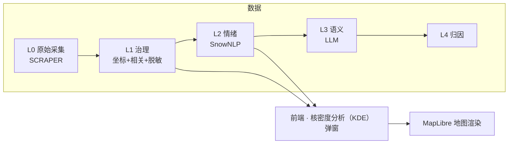
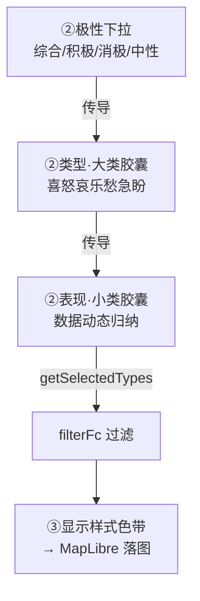

# 修订日志 (Revision Log)

> **定位**：用户需求 → 设计决策 → 落地。从"为什么这么改"的视角记录每一次修订。
> **视角**：用户意图（非程序员表述 → 专业精炼）为主，技术落地为辅。
> **维护**：每次合并需求后，AI 按板块自动追加一条；跨板块的设计主线变更同步更新第 4 节。
> **起算**：2026-06-18（前端迁移期）。更早的技术心得见 `dev-notes.md`，每日任务见 `todo.md`。

---

## ★ 任务路线图（模块化任务树）

> 开发时主看本文件即可（历史修订见第 5 节）。树按 **主干（系统架构）→ 分支（功能模块）→ 临时分支（搁置 / 待决策）** 组织，聚焦架构搭建与模块开发；不记 todo 执行细节（见 `todo.md`）、不带日期戳。
> 状态：✅ 完成 / 🔄 进行中 / ⬜ 待启动（下一步或未来） / ⏸ 搁置 / ❌ 否决。◆ = 架构转折点（解锁下游）。新分支产生即追加（AI 全程维护）。
> 🎯 **全局纲领（最高优先级）**：演示逻辑链 `张力图面 → 引导点击 → 交互分析 → 识别具体城建/更新问题`（数据为表现力、演示为有用性），已写入 CLAUDE.md。所有任务对此负责。

**树状结构**：

```text
emotion_map（根）
│
├─ 主干 · 系统架构（奠基层）
│  ├─ 七层骨架 ✅  frontend · apps · core · SCRIPT · SCRAPER · DATA · design
│  ├─ Import/Export 管道 ✅  Import（geojson.io 1:1 + 多格式 + CRS 自动投影）｜Export ✅（geojson/csv/shp.zip + CRS + 脱敏，后端 geopandas `/export`）
│  ├─ 外壳/控件/视觉 ✅  MapLibre GL + 天地图 + Design Token 双主题
│  ├─ 数据采集 Scrapy ✅  框架就绪
│  ├─ 数据管道 L0→L4 🔄  L0→L1→L2 通（L1 待 API Key 验证）｜L3 语义 ⬜｜L4 归因 ⬜
│  └─ Harness · MCP/Agent ✅  v2.1：8 Agent 编排 + 7 MCP（智谱优先）
│
├─ 分支 · 功能模块
│  ├─ 导航架构重塑（Martin）🔄  B0 色彩(#4285F4/#384555) ✅｜B1 单层顶栏 ✅｜B2 3 按钮集 ✅｜B3 左端栏三区 ✅（B6 随动复核通过）｜B4 左端弹出栏 ⬜｜B5 色板圆角 ⬜ ◆
│  ├─ 核密度分析（KDE）弹窗 🔄
│  │  ├─ 批1 快赢 🔄  1a 预览图 ⏸｜1b 色带系统（随胶囊+HSL+色相细分）✅
│  │  ├─ 批2 全局时间轴 ⬜  ◆ 架构转折点（解锁批3/4）
│  │  ├─ 批3 3D 渲染 ⬜  地形凸凹 / 网格柱体（依赖批2）
│  │  ├─ 批4 时间对比 ⬜  A/B 双窗（依赖批2）
│  │  └─ 批5 图层分组 🔄  5A 自动归类 ✅｜5B 自由编组 ⬜
│  ├─ 图层/设置/Overview 🔄  联动 ✅｜Layers 分组重做 ✅
│  ├─ Toolbox 工具箱 🔄  多维归因分析 ⬜（自 KDE ① 剥离）｜缓冲分析 ✅（后端 geopandas EPSG:4546 + 3 段弹窗 + 独立组卡 + B 编辑 + 复用 Range popup）｜网格聚合 ✅（P2：方格 2D/3D + 3 极性 + fill-extrusion + 横向色带图例 + G 编辑，接 /spatial/grid(square)）｜数据语义化 P3 ✅（POI-anchored 4×5/极性三层/置信度密度自相关 + _norm 对称拉伸张力 + 聚合层 4×5 归因 issue_label/attribution，L3/L4 接管后删表；grid/terrain 同步）
│  ├─ Range 范围 🔄  上载模块 ✅（绘制工具迁入 + 两组卡 + 自动 popup）｜绘制模块 ✅（多边形/矩形 移植 geojson.io，绘制卡常驻；点/线/圆 ⬜）｜范围分析 ⬜（缓冲/叠加/聚合）
│  ├─ Analysis 情绪分析接入 ⬜  L2 管道接前端 / 空间分析 MVP
│  └─ Table 数据表格 ⬜  列表 / 筛选 / 导出（联动管线已预留）
│
└─ 临时分支（搁置 / 待决策）
   ├─ KDE 批1 1a 预览图 ⏸  等 terrain/factor kepler 截图补齐
   ├─ 高级参数 bug（C5）⏸  暂不修
   └─ 待决策  KDE 批2 粒度｜批3 地形 vs 柱体
```

---

## 1. 三份记录的分工

| 文档 | 视角 | 回答什么 | 读者 |
|------|------|----------|------|
| **revision-log.md（本文件）** | 用户意图 + 设计决策 | "我提过什么要求、为什么、怎么落地" | 你（回顾）+ AI（熟悉开发意图） |
| `dev-notes.md` | 开发者技术心得 | "怎么实现的、踩了什么坑、学到什么" | 开发者 |
| `todo.md` | 每日任务 + 执行日志 | "今天干了什么、明天干什么" | 当日推进 |

> 三者互补不重复：本文件记**意图与决策**，技术细节回链 dev-notes/todo 的对应日期。

---

## 2. 术语表（全站统一，杜绝混用）

| 术语 | 含义 | 易混点 |
|------|------|--------|
| **类型（大类）** | 情绪 7 大类：**喜怒哀乐愁急盼**，固定、高度抽象 | 不要和"小类"混用 |
| **表现（小类）** | 数据中 `emotion_type` 动态归纳（不满抱怨/焦虑担忧…），数量不固定 | 是大类的"具体表现" |
| **极性** | 综合 / 积极 / 消极 / 中性（L2 字段） | 积极=喜+乐，消极=怒+哀+愁，中性=急+盼 |
| **栏** | 占满整行的单条内容（如 Layers 图层行、③显示样式行） | 选中态=浅蓝填充 |
| **选项** | 一行多条、需单选/多选（如分析类型卡、类型/表现胶囊） | 选中态=粗蓝框+浅灰填充 |
| **L0–L4** | 数据分级：L0 原始 → L1 治理(置信度) → L2 情绪(SnowNLP) → L3 LLM → L4 归因 | L1 无情绪字段，仅 L2 有类型/表现 |
| **色带分段条** | kepler 风格离散色块拼接（非无极渐变） | 全站色带统一用此形式 |
| **核密度分析（KDE）** | Kernel Density Estimation，热力图底层算法（点→连续密度面） | **禁用"热核"简称**；英文标识符 `heatmap` 保留 |

---

## 3. 板块总览

| 板块 | 状态 | 主文件 | 最近活跃 |
|------|------|--------|----------|
| 前端 · 核密度分析（KDE）弹窗 | 🔄 活跃 | `frontend/js/heatmap-tool.js` `css/dialog.css` | 2026-06-20 |
| 前端 · Import 管道 | ✅ 稳定 | `frontend/js/import.js` | 2026-06-18 |
| 前端 · 图层/设置/Overview | 🔄 活跃 | `sidebar.js` `settings.js` `panel.js` | 2026-06-20 |
| 前端 · 外壳/控件/视觉 | ✅ 稳定 | `map-controls.js` `popup.css` `tokens` | 2026-06-17 |
| 数据管道 · L0→L4 | 🔄 待验证 | `SCRIPT/data_governance.py` `emotion_analysis_v1.py` | 2026-06-19 |
| 数据采集 · Scrapy | ✅ 框架就绪 | `SCRAPER/` | 2026-06-12 |
| Harness · MCP/Agent/闭环 | ✅ v2.1 | `.claude/` `docs/mcp-strategy.md` | 2026-06-17 |
| 空间分析引擎 · 后端（Spatial Analysis） | 🔄 活跃 | `core/spatial_analysis.py` `api/routes.py` | 2026-06-28 |



---

## 4. 设计意图脉络（关键决策演进）

把散落在各次需求里的"为什么"提炼成几条主线。**任何接手的 AI 都应先读这一节**，理解项目的设计哲学。

### 4.1 配色统一 kepler 化
- 所有色带改为 **kepler 离散分段条**（色块拼接），不用无极 linear-gradient——视觉更专业、与 kepler 一致。
- 色板取值采样自 kepler 源码内置方案：网格暖色谱 ≈ Global Warming；7 色分类 ≈ UberPool 6 色 + 补 1 色；L1 默认单色改橙红（ColorBrewer Reds）。
- **全站色带位置一致**：核密度分析（KDE）弹窗 ③、Overview、要素设置弹窗都用 `.segmented` 分段条。

### 4.2 术语二分：类型 ↔ 表现
- 早期"情绪类型"一词既指大类又指小类，混乱。
- **统一**：类型 = 大类（喜怒哀乐愁急盼，固定 7）；表现 = 小类（动态归纳）。所有 UI 文案、Overview、代码命名按此二分。
- 极性 → 大类是固定传导：积极=喜+乐，消极=怒+哀+愁，中性=急+盼。

### 4.3 选中态二分：栏 ↔ 选项
- 全站选中态原本各处不一（有的浅蓝填充、有的蓝边）。
- **统一两种语义**：栏（占满整行）= 浅蓝填充无边框；选项（一行多个）= 粗蓝框 + 浅灰填充。
- 悬停态也统一：栏和选项 hover 都是浅灰、不加框（与 Layers 行一致）。

### 4.4 弹窗三阶引导
- 原弹窗三阶是"分析什么/怎么显示/调参数"，参数项喧宾夺主。
- **重排**：①选择分析类型 → ②选择数据源（数据/极性/类型/表现，自上而下联动传导）→ ③显示样式（随①②联动）。
- 参数（半径/透明度/权重…）降级进"高级"折叠区，不再占引导编号。

### 4.5 数据流联动：极性 → 大类 → 小类 → 落图
- 早期"选大类/小类对落图无影响"——因为"全选=不过滤"规则把效果吞了。
- **修正**：每次点击都必须在落图上见效；大类全空 = 全不要（非"全选"）；空数组明确拦截。
- L1 无情绪字段时，类型/表现胶囊不渲染（显示禁用提示），不再用兜底值"期待建议"误导。



### 4.6 "继续编辑"语义：H 按钮继承参数
- 点图层上的 H 要素按钮，应**以该图层当初生成时的参数**继续编辑，而非弹空白默认窗。
- 落地：`generateHeatmap` 把 UI 选择持久化进 `paint._ui`；`openHeatmapDialog(layerId)` 反推填回所有控件。**这是全站交互范式**——"再次打开 = 当初参数"。

### 4.7 取消按钮弱化
- 取消/次要按钮统一：白底 + 深灰字 + 细线框 + 悬停变灰，**不填充**，弱化重要性。主操作按钮保持蓝底白字。

### 4.8 主线收敛与反复（复盘）

定期回看哪些主线已稳定、哪些还在反复——暴露设计上的犹豫点。

| 主线 | 状态 | 反复点 / 张力 | 收敛方向 |
|------|------|--------------|----------|
| 配色 kepler 化 | ✅ 已收敛 | 初期按 YlOrRd / Tol Bright 推测取色，后改为采样用户提供的两张参考图 | 以采样图为准，色板不再频繁更换 |
| 术语二分（类型/表现） | ✅ 已收敛 | "情绪类型"一词早期既指大类又指小类；Overview 曾用小类却标"类型" | 全站统一，新 UI 按此二分 |
| 选中态二分（栏/选项） | ✅ 已收敛 | 各处原本不一（1px 蓝边 / 浅蓝填充 / 灰底混用） | 两语义类 `.is-bar-sel` / `.is-opt-sel` |
| 三阶引导 | ✅ 已收敛 | 参数项曾占引导编号，喧宾夺主 | 参数降级进"高级"折叠 |
| H 继承参数 | ✅ 已收敛（范式） | 初版 H 弹空白默认窗 | `paint._ui` 持久化 + 反推；作全站范式 |
| 取消按钮弱化 | ✅ 已收敛 | — | 全站次要按钮统一 |
| 数据流联动 | 🔄 反复中 | "全选=不过滤"曾吞掉效果；L1 兜底值误导；"大类全空"语义（全选 vs 全不要）反复 | 已修正为"每次点击见效"，但传导链路复杂 |
| 3D 渲染 | ⚠️ 占位 | 地形凸凹 / 网格柱体均为 dev 占位 | 待 deck.gl 接入后重审样式与数据源耦合 |

**需持续警惕的张力点**：
- **数据流联动**是当前最复杂链路（极性→大类→小类三层传导 + L1/L2 字段差异）。新增分析类型或数据层级时最易引入回归，须连带测试传导。
- **3D 占位**：③里多个 dev 样式，接入真实渲染后需重新审视"样式↔数据源↔维度"的耦合关系。

### 4.9 否决的方案（Why Not）

记录被明确否决的设计选择及原因，**避免后续重复提出**。

| 方案 | 否决原因 | 落地替代 |
|------|----------|----------|
| 保留"纯密度（density）"分析类型 | 与"情绪地图"定位冲突——纯密度不暗示情绪，弱化产品叙事 | 删除；舆情热度由 L1 综合彩虹承载 |
| 积极配消极红、消极配积极绿（反转配色） | 与全站"红=消极 / 绿=积极"约定相反，误导 | 纠正为正向：积极→绿，消极→红 |
| 积极/消极分析可选 L1 数据 | 积极/消极是 L2 专属字段，L1 无此字段 | 选积极/消极时数据下拉锁定 L2 |
| 独立 2D/3D 切换开关 | 2D/3D 已并入③每个样式命名（热力网格 / 网格柱体），独立开关冗余 | 删除 `#hm-dim`，③样式自带维度 |
| "全选小类 = 不过滤"规则 | 吞掉选中态视觉反馈，用户感觉"改了没用" | 打破：每次点击都过滤；全空 = 全不要 |
| L1 用 polarity 兜底派生"期待建议"小类 | L1 无情绪字段，兜底值制造假数据感 | L1 不渲染类型/表现胶囊，显禁用提示 |
| 7 大类用 Tol Bright 标准色板 | 用户提供了具体参考图（图2），标准色板与之不符 | 采样图2（UberPool 6 色）+ 补第 7 色 |
| 色带用无极 linear-gradient | 与 kepler 分段条设计语言不一致 | 全站改离散分段条 |

### 4.10 设计公约速查（后续必须遵守）

新增 UI / 改动时，逐条核对是否合规：

1. **色带**一律离散分段条（`.segmented`），禁无极渐变。
2. **文案**：类型 = 大类（喜怒哀乐愁急盼）/ 表现 = 小类（动态归纳），不混用。
3. **选中态**：栏 = `.is-bar-sel`（浅蓝填充无边框）/ 选项 = `.is-opt-sel`（粗蓝框 + 浅灰填充）。
4. **悬停**：栏与选项都浅灰、不加框（与 Layers 行一致）。
5. **再次打开图层配置** = 继承当初参数（`paint._ui` 反推），非空白默认。
6. **次要/取消按钮** = 白底 + 深灰字 + 细线框 + 悬停变灰，不填充；主操作按钮蓝底白字。
7. **新弹窗**按三阶引导（①分析类型 → ②数据源 → ③显示样式），参数进"高级"折叠。
8. **术语**：核密度分析（KDE），**禁用"热核"简称**；英文标识符 `heatmap` 保留。
9. **工具生成的图层** = 独立组卡片（`categoryOf` 加该工具 category）+ 要素按钮（H/B/…）开**本工具弹窗**（编辑态 `paint._ui` 回填 + 原地更新，layer id 稳定，不删旧新建）。新增工具同时落 6 点（3 组卡 + 3 弹窗，见 memory: tool-layer-convention）。

### 4.11 类型细分色带：固定极性 → 随选中大类动态生成
- 早期类型细分用固定 `positive/negative/neutral` ramp（覆盖极性全部大类），选不选大类色带都一样。
- **改为**：选具体大类（只「喜」/「怒+哀」/…）→ ③色带 / 地图 heatmap / 图例 / Overview 只含选中类色；全选 = 等同固定 ramp（无缝）。
- 落地：`buildMacroRamp` 按 density 弱→强生成 inline stops（rampKey 保持 polarity 维持 reverse 标识 + density 语义）；消费方优先 inline、fallback rampKey。色带与胶囊同向（rampDisplaySegs 据 polarity reverse）+ 地图热核=最强情绪（density 语义不变）。
- **每大类内置 3 段**（明度变体浅/中/深，`macroShades` = lerpHex 混白/原色/混黑）：段数 = 类数×3（积极 6/消极 9/中性 6/单类 3）。3 段是 density 视觉分段（density 低=浅/高=深），因 `heatmap-weight=intensity`，density 高=高 intensity 密集区 → 间接对应 intensity 低/中/高，**不需额外数据字段**（当前数据支持，未来细 intensity 自动生效）。
- **多类组合平滑过渡**：`gradientStops(colors, colors.length*3)` 插值 ×3（关键色间补过渡色，类间不割裂）；`macroShades` 明度收窄（混白 0.25 / 混黑 0.3）保色相（浅色跨类不趋白趋同）。段数 = 类数×9（积极 18/消极 27/中性 18/单类 9）。类内明度渐变 + 类间色相过渡，整体连续。
- **HSL 色相插值**（替 RGB）：RGB 插值绿↔黄中间土黄（经过 RGB 暗区 `rgb(152,148,65)`），HSL 色相旋转（hue 最短路径）中间黄绿明亮（`rgb(123,218,87)`）。`gradientStopsHsl` + `macroShades` HSL lightness。极性区间 积极 绿↔黄（乐改黄 `#F5C842`）/ 消极 红↔紫 / 中性 深蓝↔天蓝。
- **色相细分**（每类 3 段，最终方案）：取消 `macroShades` 明度变体（跨类明度跳变是割裂根源），类色直接 HSL 插值 —— `gradientStopsHsl(类色, 类数×3)`，每类占色带 3 段（色相细分），整体连续不割裂。段数 积极 6/消极 9/中性 6/单类 3（单类同色）。乐回橙 `#F5A623`。

---

### 4.12 三页架构 + Martin 导航重塑（2026-06-27）

**三页架构**（ADR-015）：产品从单页升级为三页——数据库（emotion-database，运维）→ 控制台（emotion-console，研究，**当前 α v0.1**）→ 实时地图（emotion-map，商用），自下而上。职责按角色分层，研究工具不被商用/运维功能污染。L0-L4 双视角：过程=分析管道，产物=数据库数据类型分层。

**Martin 导航重塑**：控制台 UI 提升"高级感"，参考 ref3 截图布局（左图层栏 + 紧贴右侧参数面板 + 单层顶栏）+ Martin 源码设计语言（细边框 / 8px 圆角 / Lucide 图标 / hover 过渡 / 留白）。先统一全局色彩（品牌蓝 `#4285F4` + 卡片深灰 `#384555`），再单层顶栏 + 左端栏三区（选择 / 工具 / 操作）+ 左端弹出栏（替代弹窗，挂载点迁移）。

## 5. 修订记录（按板块分组，组内倒序）

> 每条格式：`日期 · commit · 用户意图（精炼） → 落地 · 文件`

### 5.1 前端 · 核密度分析（KDE）弹窗（核心）

| 日期 | commit | 用户意图 → 落地 | 文件 |
|------|--------|----------------|------|
| 06-22 | 本次 | 色带回到每类 3 段（色相细分）：取消 `macroShades` 明度变体（跨类明度跳变是割裂根源），改类色直接 HSL 色相插值 —— `buildMacroRamp` `gradientStopsHsl(类色, 类数×3)`，每类占色带 3 段（色相细分），整体色相连续渐变、类间不割裂。段数 积极 6/消极 9/中性 6/单类 3（单类 = 同色 3 段，单 hue 无渐变）。乐色 黄→橙（`#F5C842`→`#F5A623`，5 处回改）。Playwright 实证：积极 6 段 HSL 橙→黄绿 `rgb(176,225,47)`→绿 连续；单喜 3 段同绿 ✓ | `state.js` |
| 06-22 | 本次 | 色带 RGB→HSL 色相插值：RGB lerpHex 中间土黄（绿↔黄 经过 RGB 暗区 `rgb(152,148,65)`）→ HSL 色相旋转中间黄绿明亮（`rgb(123,218,87)`，G 主导）。落地：`state.js` 加 HSL 工具（`_hex2hsl`/`_hsl2hex`/`lerpHsl`/`gradientStopsHsl`，hue 最短路径）；`macroShades` 改 HSL lightness（保色相不趋白）；`buildMacroRamp` `gradientStops`→`gradientStopsHsl`。**乐色 橙→黄**（`#F5A623`→`#F5C842`，5 处同步：EMOTION_MACRO/MACRO_COLORS/HEATMAP_RAMPS.positive/classify-7/怀旧认同）—— 极性区间 积极 绿↔黄 / 消极 红↔紫 / 中性 深蓝↔天蓝。Playwright 实证：积极中间 `rgb(123,218,87)` 黄绿明亮 ✓ | `state.js` |
| 06-22 | 本次 | 多类组合色带割裂（类间硬切，乐深橙→喜浅绿跳变）+ 浅色跨类趋同（混白 0.45 趋白丢失色相）。修复：① `buildMacroRamp` `gradientStops(colors, colors.length*3)` 插值 ×3 —— 关键色间自动补过渡色，类间平滑过渡（积极 绿→褐黄→橙 不割裂）；段数 积极 18/消极 27/中性 18/单类 9。② `macroShades` 明度收窄（混白 0.45→0.25、混黑 0.4→0.3）保色相，浅绿 `rgb(59,168,90)` vs 浅橙 `rgb(248,188,90)` 色相区分不趋同。CSS N 段等宽（N=18 每块~5px 视觉连续）+ 地图 MapLibre interpolate 连续渐变。Playwright 验证：积极 18 段类间过渡色 + 浅色色相区分 ✓ | `state.js` |
| 06-22 | 本次 | 类型细分每个大类内置 3 段色带（明度变体浅/中/深），段数 = 类数×3：积极 6 / 消极 9 / 中性 6 / 单类 3。「高/低值划分依据」：3 段是 density 视觉分段（density 低=浅/高=深），因 `heatmap-weight=intensity`，density 高=高 intensity 密集区 → 间接对应 intensity 低/中/高，**不需额外数据字段**（当前 intensity 通过 weight 进入 density；机制数据无关，未来细 intensity 自动生效）。落地：`state.js` 加 `macroShades`（lerpHex 混白 0.45 / 原色 / 混黑 0.4）+ `buildMacroRamp` 每类展开 3 段 → `gradientStops(colors, colors.length)` 离散 N×3 段。**附带 bug 修**：`#hm-macros` 大类胶囊 click+rAF 改 `change` 事件（label-click 时序下 is-on 滞后 input.checked，单选时 `renderStylePreview` 取旧选中态、色带不更新） | `state.js` `heatmap-tool.js` |
| 06-22 | 本次 | 类型细分色带随选中大类动态变化：只选「怒」→ ③色带/地图/图例/Overview 全红（单色渐变）；多选 → 选中类间渐变；全选 = 等同固定极性 ramp（无缝）。落地：`state.js` 加 `MACRO_DENSITY_ORDER` + `buildMacroRamp(selectedMacros, polarity)`（按 density 弱→强，热核=最强情绪）；`computeStyle` 加 macroFilter 参数 → inline `rampStops`；消费方（`addHeatmapPaint`/legend/panel/`renderStylePreview`）优先 inline rampStops、fallback rampKey；rampKey 保持 polarity（`rampDisplaySegs` 据 polarity reverse 显示，色带与胶囊同向）。大类胶囊 click 补 `renderStylePreview`（色带实时更新） | `state.js` `heatmap-tool.js` `map.js` `heatmap-legend.js` `panel.js` |
| 06-22 | 本次 | H 按钮重生成（原样再点生成）→ 热力图消失、眼睛救不回。**根因（Playwright + paint 查证）**：`openHeatmapDialog` 反推 opacity 时百分比/比例混用——`sp.opacity` 是 0~1（paint 存储）却直接赋给百分比控件（0~100），被 type=range clamp 到 1，`generateHeatmap` 读 `1/100=0.01` 几乎透明 = "消失"；眼睛 toggle 用同一 paint 仍 0.01 = 救不回。**修复**：反推时 `Math.round(sp.opacity*100)` 统一为百分比（首次用 DEFAULTS.opacity=70）。**附带**：`buildWeightExpression` 加 `to-number` 强转（修 MapLibre worker string 类型告警，健壮性）。**配套**：① 编辑分支原地更新（激活 `editLayerId`，4.6「继续编辑」语义，layer id 稳定）；② `serve.py` 拦截 .js 注入 `import ?v=<mtime>`，破 Chrome module graph 缓存（旧 serve 只 main.js 带 ?v，子 module 缓存旧版致 F5 失效） | `heatmap-tool.js` `map.js` `serve.py` |
| 06-22 | 本次 | **订正上轮**（上轮"放弃高密度=最强情绪"破坏 density 语义，错）：类型细分色带方向与胶囊反向 → stops **恢复** density 弱→强（高值=热核=喜/怒/急，不可变约束），显示层新 helper `rampDisplaySegs()` 对类型细分反转（高→低对齐胶囊序）。数据轴与显示轴分离——地图 paint 用 stops 原序（热核=强情绪），弹窗③/图例/Overview 显示反转；图例标注类型细分随之反转（左密集/右稀疏） | `state.js` `heatmap-tool.js` `heatmap-legend.js` `panel.js` |
| 06-22 | 本次 | 小类胶囊色与大类色板冲突（"不满抱怨"=橙却属大类"愁"=紫）→ 小类色**按大类派生**：单小类=大类色，愁类 2 小类用紫色系明度梯度（焦虑担忧中紫 `#A569BD` / 不满抱怨深紫 `#7D3C98`）。调用点不动（`EMOTION_TYPE_COLORS[t]` 值变即生效） | `state.js` |
| 06-21 | `e5bc20` | 剔除 KDE 弹窗归因卡片组（factor/attribution），改作 Toolbox 独立工具；①回归 2 排，窗口高度收紧（120→80）。加多维归因入口 + 工具栏 i 介绍（独立 .tool-tooltip 隔离 KDE） | `heatmap-tool.js` `dialog.css` `index.html` `sidebar.css` `sidebar.js` |
| 06-20 | `4454225` | Overview 的"情绪类型"显示的是小类却叫"类型"，术语冲突 → 拆"情绪类型（大类）"+"情绪表现（小类）"两行；持久化 `_ui.macroFilter`，旧图层用 `EMOTION_MACRO_MAP` 反推 | `panel.js` `heatmap-tool.js` |
| 06-20 | `cec784a` | ① 选 L1 却出现"期待建议"胶囊（L1 无情绪字段）→ L1/L3/L4 不渲染胶囊、显禁用提示；② H 按钮应继承图层参数继续编辑 → `openHeatmapDialog(layerId)` 反推；③ Overview 渐变色带改离散分段（设计语言统一） | `heatmap-tool.js` `settings.js` `dialog.css` |
| 06-20 | `7332a0d` | ① 色带改 kepler 离散分段条（不要无极渐变、去文字）；② 弹窗加长免滚动；③ L2+中性色板应为蓝系（与急/盼胶囊呼应）；④ 类型/表现默认展开、类型去线框、7 类按喜怒哀乐愁急盼配色（黄绿→深蓝）；⑤ 网格 2D/3D 合并一条；⑥ 选项选中=粗蓝框+浅灰、栏=浅蓝、悬停浅灰；⑦ 取消按钮弱化 | `dialog.css` `heatmap-tool.js` 6×SVG |
| 06-20 | `6ba8b2c` | 预览图换 kepler 官方层截图（更真实） | 4×PNG |
| 06-19 | `c9c4808` | 地形/网格 infopanel 预览换 kepler 风 SVG | 2×SVG |
| 06-19 | `0c94c54` | 情绪归类应默认综合极性、数据下拉默认 L1 | `heatmap-tool.js` |
| 06-19 | `e596bad` | 切分析类型/数据层级时极性→大类→小类要联动传导（所有类型） | `heatmap-tool.js` |
| 06-19 | `8af860f` | H 按钮带参数打开；Overview 色带离散化（初版） | `panel.js` `sidebar.js` |
| 06-19 | `1563612` | 弹窗三阶引导 ①②③ 重构落地（联动骨架） | `heatmap-tool.js` |
| 06-19 | `e9bd0d0` | 选大类/小类对落图无影响 → 打破"全选=不过滤"；大类全空=全不要；生成时打 filter 日志 | `heatmap-tool.js` |
| 06-19 | `6863515` | 取消按钮弱化 + 选中态二分（栏/选项）初版 | `dialog.css` `heatmap-tool.js` |
| 06-19 | `354296e` | 借鉴 kepler 重做色板/样式：三阶引导、6 张预览图、离散色板、7 大类喜怒哀乐愁急盼、栏/选项选中态（重构主体） | `heatmap-tool.js` `state.js` `dialog.css` `index.html` 6×SVG |
| 06-19 | `0390e3d` | 新增核密度分析（KDE）工具（首版 500 行）+ 情绪词典 7 类微观标签 + L2 极性着色 | `heatmap-tool.js` `emotion_lexicon.py` `state.js` |

### 5.2 前端 · Import 管道（06-18，提炼自 todo.md）

| 日期 | commit | 用户意图 → 落地 |
|------|--------|----------------|
| 06-18 | `0390e3d` 等 | geojson.io 1:1 导入体验：拖放/选择 → 确认弹窗 → 多格式(GeoJSON/CSV/KML/Shapefile) + CRS 自动重投影到 WGS84 + 几何分流 + 极性探测 + 图层管理器（眼睛/删除） |
| 06-18 | — | 点大小密度自适应（取代固定倍率）；L1 橙色置信度着色；图例按层显隐；polygon 海军轮廓默认不填充 |
| 06-18 | — | 要素按钮 + Kepler 设置弹窗（预设色板/透明度/线宽/填充）|

### 5.3 前端 · 图层/设置/Overview/外壳（06-17~06-20）

| 日期 | 用户意图 → 落地 | 来源 |
|------|----------------|------|
| 06-17 | 地图控件统一簇（复位/2D-3D/比例尺）；3 级字体浓度；popup 折叠胶囊；geojson.io 光标三态；点悬停轮廓环 | dev-notes 06-17 |
| 06-18 | Layers 图层行选中=浅蓝填充（确立"栏"选中态范式，后被 4.3 推广全站） | todo 06-18 |
| 06-21 | **Layers 分组重做（类 Photoshop）— 核心四件**：①组折叠/展开 ②组内拖拽（L2 极性子层可拖了）③组卡拖拽（组间排序）④自动分类 5 组（热力图 / L2情绪 / L1热度 / L0原始 / 范围边界）。方案=**渲染层聚合**：`categoryOf(layer)` 按 kind/colorMode/needsAnalysis 推导，`_groupOrder`/`_groupCollapse` 为新 UI 状态（不进 `_layers`）；不动 `_layers` 结构 / `addLayer`·`addGroup` 签名 / main.js 导入 / `reorderAllZ`。`applyGroupOrder()` 规整 `_layers` 到 `_groupOrder` 以保 list-top=map-top 不变式（热力图生成时独占显示，置顶不遮点）。承重点：`renderLayerList` 事件绑定迁移 + 双 flavor 拖拽（组卡=组间 / 图层行=同组内，跨组移动留后续） | 本次 |
| 06-21 | **Layers 体验优化**：组卡阴影+间距（对齐工具按钮设计语言）；折叠三角放大并移至栏最右 + **双击组卡折叠**（去掉组卡单击=开 Overview，单击/双击分离）+ 折叠态浅灰填充；**中文语义命名**（L1=`热度分布·文件名`、L2 子层=`积极/中性/消极·文件名`、组卡标题=`L1·城市情绪 DATA`/`L2·情绪地图 DATA`、热力图=`分析类型·下一层级·[半径]`，`·` 为分隔符）；Layers 标题栏加 eye 一键开关全部图层；**Overview 标题=加粗目的 + 另起一行弱化"文件名：xxx"**（全局规则：Overview 必带数据源文件名；新增 `layer.srcName`，L2 组/热力图 srcName 一并带出，热力图从 sourceKey 解析源层）；组/分类/头部 eye 改 **any-visible=on** 语义（任一开则开、全关才关）；toast 停留 3200→2000ms（淡出已存在） | 本次 |
| 06-24 | **左端布局 + L2 点/折叠/拖拽细化**：①绘制范围组卡从顶部 `.lp-draw` 常驻**并入 Range 模块**（上载+绘制两卡）；②撤销 Layers 单独滚动条（还原左端整体滑动）；③图层栏压缩至 ~2/3（`.layer-row` padding 2px / `.layer-group` 3px·gap 3·margin 4）；④**双击 L2 组只折叠该组**（新 `_groupFold` set + `isGroupFold`/`toggleGroupFold` 按 group id 非 category——修"双击一个 L2 全部折叠"；category 级 `_groupCollapse` 仍管虚拟组卡）；⑤L2 多 group 拖拽补 drop 到子层分支（找父 group 整组 `reorderLayers`，修"偶尔有效"）；⑥L2 情绪点默认 **3-6px zoom 自适应**（删 main.js 导入写死 `radius:8`，走 addPointPaint `_isL2` adaptive）；⑦类型细分·积极默认 半径 150/强度 1.5；⑧热点图（deck.gl）方向不对**撤回 UI**（`addHotpointLayer`+CDN 保留搁置）。 | 本次 |

### 5.4 数据管道 · L0→L4（06-09~，提炼自 dev-notes）

| 日期 | 用户意图 → 落地 |
|------|----------------|
| 06-09 | 情绪分析引擎模块化：`AnalyzerBase` 抽象基类 + `SnowNLPAnalyzer` + `LLMAnalyzer` 预留 + 工厂 `create_analyzer()` + `run_pipeline()` |
| 06-19 | 情绪词典 7 类微观标签（喜怒哀…→治理动作映射），供前端小类归纳 |
| 06-12 | 数据分级 L0~L4 概念确立；L1→L2 管道实现（L1 LLM 分类需 API Key，待验证） |

### 5.5 数据采集 · Scrapy（06-12）

- 技术选型 Scrapy；搭建标准项目；小红书 Spider；Pipeline（去重/清洗/导出 CSV）；礼貌爬取（延迟 2s/并发 1）。

### 5.6 Harness · MCP/Agent/闭环（06-17）

- **06-23**：交接卡翻新为**单节点快照**（每日覆写、不累积历史，旧节点删——已进 revision-log+git）；skill 精简 `.claude/skills/` 465→235，230 个无关 skill（19 家族 blueprint/configure/obsidian/typescript/container/k8s/gh-actions/finops/terraform/taskwarrior/networking/rust/macos/langchain/home-assistant/comfyui/bevy/codebase-attributes/component-patterns + 35 one-off）`git mv` 归档到 `.claude/skills_archive/`（零删除可逆）。**机制审计结论**：渐进式披露健康（skill body 惰性加载，token 有缓存兜冲），唯一问题是注册表臃肿致**注意力稀释**——精简为卫生，非纯省 token。

- MCP 实测 7 通，确立"智谱优先 + 回退阶梯"路由（`docs/mcp-strategy.md`）。
- Agent 协作 v2.1（8 agent + MCP 能力段）；闭环补强（trace 落盘/pre-commit/emoji hook/PII guard/Auto Memory 索引/CI）。

### 5.7 前端 · Range 模块 + popup 收起修复 + 三区架构（06-22）

| 日期 | 用户意图 → 落地 |
|------|----------------|
| 06-22 | **Range popup 收起 bug（DRY，与情绪点同源）**：用户报"点轮廓线以外区域 popup 不收起"。根因 = 范围层透明 hit 带（`lyr-{id}-hit`，宽、opacity 0）被 `queryRenderedFeatures` 当 line 层 → 点不可见 hit 带时 `hitRange=true` 不收起。修：popup.js 抽 `classifyMapClick()` 单一处理，hit 带**分态**（popup 关→开/易命中，开→收），可见轮廓（非 `-hit`）始终保持；map.js 删 `hitLid` click opener（并入中心处理消除开/收竞争）、`HIT_WIDTH` 12→20、hover 加宽轮廓 + tooltip 全保留。**测试追加修同质漏网**：原 `hitRange` 未过滤底图层 → positron `landcover`(fill) 误判点中范围，加 `lyr-` 前缀只认本项目层。删 range popup「顶点」「bbox」两行（用户不要）。Playwright 真实点击 4 态全过（空白→收 / hit 带关→开 / hit 带开→收 / 可见轮廓→开）。 |
| 06-22 | **Range 模块（范围上载）**：用户定"绘制工具服务于指定范围 → 迁入 Range"。6 绘制按钮（点/线/多边形/矩形/圆/更多）从工具栏迁入左栏 Range **上组卡**（`.range-card` 复用 `.tool-row` 圆角+阴影+"i"，3×2 网格）；**下组卡** = + Upload Range（accept 去 csv/gpkg；`runRangeImport` 滤 csv + 跳 points）；上传后自动弹展开 popup（用户要求）。`select` 留工具栏；绘制功能仍 Phase 2 占位。 |
| 06-22 | **三区设计逻辑**（用户提出：上端工具区 / 左端工作区 / 右端展示区）→ `docs/architecture.md` 第九节：三区职责 + `--left-w/--right-w` 折叠机制 + `layers:changed`/`layer:selected`/`layer:paint` 联动事件总线 + Table 联动管线预留。 |

---

### 5.8 前端 · 缓冲分析（Buffer）工具 + L0 精修 + F5 工作流（06-22）

| 日期 | 用户意图 → 落地 |
|------|----------------|
| 06-22 | **缓冲分析工具端到端**：后端 `core/buffer_analysis.py`（geopandas，EPSG:4546 米制 buffer + 可选 dissolve，F_005）+ `POST /api/v1/spatial/buffer`；前端 `buffer-tool.js`（3 段弹窗：①输入图层 ②缓冲参数 ③显示样式）+ Toolbox `#tool-buffer`（紧跟 HeatMap）+ `api.js runBuffer`（BASE 改绝对 8000）。生成 = polygon 层 + Overview 显总覆盖面积。测试数据 `DATA/processed/宜昌市医疗点.geojson`（30 点，五区）。 |
| 06-22 | **L0 点精修**：默认 4px + 80% 透明 + 深灰 #4a4a4a；颜色参数用全局预设色板 `PRESET_COLORS`（10 色，首色深灰=默认；不自由调色，全局点·面通用）。密度自适应半径封顶 ≤10px（稀疏 6-10/中 4-7/密 2-4）。 |
| 06-22 | **buffer 弹窗参数**：距离手动输入框 + 静态 m（默认 1000）；显示样式 4 参数——线型胶囊（实线/虚线，阴影+hover灰+选中蓝）/ 线宽(1-8) / 颜色(预设色板，默认天蓝 #4FC3F7) / 填充透明度(15%)；轮廓与填充同色（`addPolygonPaint` lineStyle→dasharray）。生成键 `btn-primary` 蓝（一致性）。 |
| 06-22 | **buffer 精修 7 项**：①要素按钮 B（hintChip）；②色板固定 26px（settings.css）；③B 按钮开缓冲弹窗（镜像 H：路由 + openBufferDialog(layerId) seed 回填 + edit-mode 原地更新，layer id 稳定）；④距离去重（input+m，无重复值）；⑤独立组卡"缓冲分析"（categoryOf+CATEGORY_LABEL+_groupOrder）；⑥popup 复用 Range（badge"缓冲"+右侧距离+文件名+只类型+收起显距离）；⑦**serve.py 自动起后端**（spawn uvicorn + health 等 + cleanup + --no-backend）→ 一条命令 + F5 迭代。 |
| 06-22 | **设计公约 + memory**：revision-log §4.10 加 #9（工具生成层=独立组卡+要素按钮开本工具弹窗，新增工具落 6 点）；memory `tool-layer-convention`。 |

---

### 5.9 前端 · 多边形/矩形绘制 + 图层导出（06-23）

| 日期 | 用户意图 → 落地 |
|------|----------------|
| 06-23 | **国内登不上 geojson.io → 多边形绘制（原任务三.1）提前**：移植 geojson.io 自实现 handler（不用 mapbox-gl-draw——与 MapLibre 5 不兼容；不用 terra-draw——ESM 需构建）。新 `frontend/js/draw-tool.js`：多边形（点顶点→双击/回车/点起点完成，移植 `polygon.ts` 三判定 + `close_polygon` + 橡皮筋临时点）+ 矩形（拖拽，Shift 锁正方形，移植 `rectangle.ts`）。`state.js` 加 mode 状态机（NONE/DRAW_*，中立枢纽避免环依赖）。提交走 buffer 同款链路（addLayer polygon → range popup）。**绘制卡提为 `#left-panel` 常驻**（脱离 import/sections 模式门控，空地图态即可画边界，无需先导入——解锁"先画边界再模拟"用例）。Playwright 验证：3click+dblclick→落层+popup+临时层清空。 |
| 06-23 | **图层导出（后端 geopandas）**：客户端 shp-write 无 UMD、2020 停更（死路）→ 新 `POST /api/v1/export`（`core/export.py export_layer` F_005）。GeoJSON（WGS84 固定，RFC 7946）/ CSV（WKT·lonlat·仅属性）/ Shapefile.zip（WGS84·CGCS2000 4546；混合几何按 geom_type 分组多个 shp 同包）+ 脱敏（剥 PII）。**CRS 选项仅 shp**（WGS84/CGCS2000）——规划交付常需 CGCS2000 米制；GeoJSON 固定 WGS84（给 CRS 即违规）。模态加 CRS(条件)/CSV几何/范围(选中·全部) + 格式切换显隐。验证：4 路径 200 + CRS 实转（.prj GEOGCS↔PROJCS）+ 脱敏剥 username。 |
| 06-23 | **借鉴固化**：建 `docs/geojson-io-reference.md`——绘制已移植点 + 后续可移植几何工具（simplify/circle/merge/centroids）+ Table/编辑器/右键思路，**以后开发查此文档、不翻 docs/geojson.io/ 文件夹**。 |
| 06-23 | **Range 面线型切换（实线/点划线）**：Range polygon 要素按钮"面"的 settings popover 加线型控件（实线/点划线，带 SVG 预览）。点划线 `[6,3,1,3]`+round cap（圆点），**刻意区别于缓冲面域短虚线 `[2,1.5]`（butt cap）**——两类面域虚线靠节奏区分（长-点-长 vs 均匀短虚线）。默认实线不变。`map.js` addPolygonPaint 加 dashdot 分支（line-cap 属 layout 非 paint）。Playwright 验证：默认无 dasharray → 点划线 [6,3,1,3]+round。 |
| 06-23 | **胶囊按钮设计语言（UI 公约）**：线型选择改胶囊样式——**无线框 + 阴影 + 选中蓝(蓝底白字) + 悬停灰 + 紧凑规整**（区别细线框次要按钮 §4.7 与圆形色板 swatch）。设为可复用胶囊语言（memory: capsule-button-design-language），后续选项类选择器（色板/分析类型等）套用。 |
| 06-23 | **修 bug：上传范围误弹极性图例**。根因：`addLayer` 默认 `colorMode='polarity'`（情绪 point 专属）漏给 polygon/line（range 上载/缓冲/绘制多边形都中招）→ refreshLegend 见 polarity 即显 L2 极性图例。修：① [state.js](../frontend/js/state.js) addLayer 默认值按 kind 区分（point→polarity/needsAnalysis，polygon/line→'range'）；② [sidebar.js](../frontend/js/sidebar.js) refreshLegend 极性图例判定加 `kind==='point'` 守卫（防复发——情绪色系 colorMode 一律 point-only）。layerLevel 本就 kind-first 无此 bug。Playwright 验证：画多边形→极性图例隐、范围图例显、hint chip 'R'。 |
| 06-23 | **Range popup 胶囊文字细化**：① 展开态 badge 依来源——绘制范围→「多边形」/「矩形」（`_ui.shape`）；上载范围→「上载」（无 `_ui`）；缓冲→「缓冲」不变。② 收起态 badge 一律显面积（2 位小数 + km²，如「4.61 km²」），替代原 "Range" 英文（缓冲仍显距离）。[popup.css](../frontend/css/popup.css) 收起胶囊统一紧凑测量样式（非大写、xs），合并掉冗余 is-buffer 规则。`_rng` 增存 `expandedText` + `area`。Playwright 验证：绘制多边形→展开「多边形」/收起「4.61 km²」。 |
| 06-23 | **export "Failed to fetch" 根因 = 浏览器拦跨域 :8000**：服务端/CORS/路由全正常（curl POST `/export` → 200 + ACAO 回显 + 有效 geojson；Playwright 干净 Chromium 同页跨域导出 200），用户 Chrome 正常+无痕均 `Failed to fetch` = **浏览器级拦截**（非 file://、非孤儿 uvicorn、非系统代理——`ProxyEnable=0` 且 `127.*` 在 ProxyOverride 绕过列表；嫌疑：开了「允许无痕」的代理/VPN 扩展、HTTPS-Only、或托管策略/杀毒截 Chrome 流量）。**改同源架构彻底消除跨域这一跳**：[serve.py](../frontend/serve.py) 加 `_proxy_api`——`/api/*` 反代透传到 uvicorn :8000（method/body/headers/响应全转，含 export 二进制 blob + 4xx/5xx 透传 + 502 后端不可达），`do_GET`/`do_POST` 均拦 `/api/`；[api.js](../frontend/js/api.js) `BACKEND='http://127.0.0.1:8000'` → `BASE='/api/v1'`（同源相对）。浏览器只跟 :8080 说话，:8000 这跳在服务端完成。Playwright 实证：同源 `/api/v1/export` POST → 200 + `application/geo+json` 242B。**踩坑**：后台命令用 `head -N` 截断 serve.py 输出，会因 `log_message` 日志凑满 N 行触发 SIGPIPE 杀掉 serve.py（验证假阳性 Failed to fetch），长跑服务**禁接 head**、输出转日志文件。 |
| 06-23 | **手画层导出 500 = CJK 文件名撑爆 Content-Disposition 头**：手画层名「绘制多边形 · N顶点」经 `_safe_name` 保留中文 → 路由 `Content-Disposition: attachment; filename="二马路.geojson"` 头含非 ASCII → Starlette 用 latin-1 编码头 `UnicodeEncodeError`（position 落在中文字符）→ **未捕获 500**（返回纯文本 "Internal Server Error"，前端 `r.json()` 失败回退显「500」而非带 detail 的 JSON）。**用户复现锁定**：全部图层（`fname=emotion_map_all` ASCII）✓ ／ 上载层选中（ASCII 名）✓ ／ **手画层选中（CJK 名）✗**——差别仅在文件名是否 ASCII。修 [api/routes.py](../api/routes.py) `export_route` 改 RFC 6266 双声明：`filename=` ASCII 兜底（ASCII 名直接保留、CJK 回退 `export.<ext>`）+ `filename*=UTF-8''<百分号编码>`（浏览器优先 filename*，保留中文文件名）。TestClient 实证：CJK ／ ASCII ／ shp+cgcs2000 全 200。**漏网之鱼教训**：之前所有 curl/Playwright 导出测试都用 ASCII 文件名（`proxy_test`/`pw_sameorigin`），从没触发 CJK 路径——CJK 用例须进回归。 |

### 5.10 任务一 · 情绪数据模拟器（06-24，家用机）

| 日期 | 用户意图 → 落地 |
|------|----------------|
| 06-24 | **任务一模拟器 v3.0 跑通但点位不可用 → v3.1 重做空间生成**。Phase A 资产（[emotion_text_pool.py](../SCRIPT/emotion_text_pool.py) 78 条 SnowNLP 预筛文本、**L2 锚定命中率 100%**；[snapshot_config.py](../SCRIPT/snapshot_config.py) 3 快照叙事 二马路 T1 消极 60%→T3 积极 65%；[poi_data/](../SCRIPT/poi_data/) 158 真实 POI 种子 WGS84 + 4×5 映射 75 条）+ v3.0 [generate_l1_mock.py](../SCRIPT/generate_l1_mock.py)（3 快照 × 2500 + 二马路 +150m buffer 加密 + 重点区域埋点 + L1→L2，score_mean 0.46→0.57→0.65 叙事弧）。**但 v3.0 空间生成 = 158 POI 种子高斯聚类 → 离散光斑 + 伍家空白**（数据证实：75% 网格空、伍家 0 点、最大光斑 388 点/格）→ **用户判"完全不可用"**。**v3.1（下轮办公机）**：高德真实 POI（全类目）→ numpy 核密度曲面（histogram2d + 高斯卷积，不引 scipy）→ 全域按密度拒绝采样（替聚类），复用 Phase A + v3.0 非空间部分，只改 generate_zone_points。边界：用户提供 `DATA/boundaries/` 西陵伍家核心主城(139.6km²) + 大南门二马路滨江片区(0.599km²) geojson（WGS84）。环境补 snownlp/jieba/tqdm（原缺）。**待办**：AMAP_KEY 填 .env（高德 Web 服务 Key）。 |
| 06-24 | **v3.1（158 种子 KDE）仍判不可用 → v3.2 换高德真实 POI + 陆域掩膜根治四大空间病灶**。识图诊断（百度真实热点图早8/晚12 + 长江核心主城范围关系图）+ 数据定位根因：158 POI 种子空间分布错（纬度全在北半部 [30.685,30.780]、经度东西横铺不沿江、~70% 西陵西部）+ 主城边界西界=长江中线（含水域）→ ① 点落江（T1 最西经度带 1077）② 东西延伸 ③ 无西陵/伍家格局（77% 堆西经度 1/4）④ 无多组团（sigma 400 糊一团）。**三招根治**：① [pull_amap_poi.py](../SCRIPT/poi_data/pull_amap_poi.py) `types=typecode` 13 类替中文名 keywords 全文搜（后者全宜昌餐饮才 25 粒；用户首给 JS API key 报 USERKEY_PLAT_NOMATCH → 换 Web 服务 key）→ **1270 POI**（含伍家万达 111.30/中南路/东站，纠正"伍家在 111.40+"经度误判——伍家主体在 111.30-37）；② [load_boundaries](../SCRIPT/generate_l1_mock.py) 扣用户提供的 `现状水系.geojson`（747 水域）→ 陆域 123.29 km²（原 139.56），`contains()` 天然避江；③ [poi_density.py](../SCRIPT/poi_data/poi_density.py) `bg_ratio` 0.3→0.02（纯 KDE）+ `sigma_m` 400→250。**指标**：落水系 1077→**0(0.00%)**、沿江 NW-SE 带（lon-lat 相关 **-0.65**）、填充(500m) 19%→**57%**、KDE 覆盖 10%→**35%**、叙事弧 0.46→0.57→**0.63** 不变；④ 多组团待视觉。新增 poi_density/pull_amap_poi/check_spatial + 现状水系.geojson + amap_poi_wgs84.json。 |

---

### 5.11 地点搜索 + 共享 place 层 + 情绪点重平衡（06-24，办公机，进行中）

| 日期 | 用户意图 → 落地 |
|------|----------------|
| 06-24 | **二马路"好几十倍"失衡 + 评论零地域性 → 共享 place 层 + 重平衡 + 本地化文本（Phase 0/1/1b）**。根因定位（[generate_l1_mock.py:60-61](../SCRIPT/generate_l1_mock.py) 硬编码 `TARGET_TOTAL=2500`/`ERMALU_TARGET=700` → 0.43% 面积塞 28% 点 = 密度比 47×；[emotion_text_pool.py:237](../SCRIPT/emotion_text_pool.py) `sample_text(polarity,element)` 零地域绑定）。**建共享 place 层脊柱**（[core/place_layer.py](../core/place_layer.py) 单例 + [DATA/place/zone_typology.json](../DATA/place/zone_typology.json) + [place_keywords.json](../DATA/place/place_keywords.json)：6 叙事区×4 时序型，`resolve_zone`/`classify_point`/`place_keywords`/`forward`/`reverse`，三块共用单一 zone 词表；ermalu 显式边界、其余区由种子 `radius_m` buffer 并集；修一 bug：amap POI `area="宜昌"` 误匹配 transit "宜昌站" subtag 致 83% 误归交通 → `_area_suffix` 无 `-` 返回 `''`）。**重平衡**：`ERMALU_TARGET` 硬编码 → `snapshot_config.zone_caps` 计算（T1=300/T2=200/T3=325）；默认换 1270 高德 POI（真实密度）；`inject_fields` 加 zone 列 + 传 zone/flavor。**本地化**：[emotion_corpus.json](../SCRIPT/poi_data/emotion_corpus.json) 起步 ~80 条（6 区×3 极性，手改 3 个薄负面桶过 SnowNLP）+ `sample_text(zone,flavor,locality_bias=0.65)` 地域优先抽；[generate_corpus.py](../SCRIPT/poi_data/generate_corpus.py) DeepSeek 按需扩充（PII 安全）。日期对齐用户叙事 T1 春节/T2 暑假/T3 五一 + main 极性微调保 arc。**指标**（[check_spatial.py](../SCRIPT/poi_data/check_spatial.py) `--rebalance` 硬断言全过）：二马路 28%→**9%/5%/9%**、密度比 47×→**22×/13×/24×**、落水 0%、score arc **0.447/0.557/0.630**（区间内）、本地性 全图 **60/60/69%** 重点 **79/74/79%**。**决策**：地理编码源=本地 1270 POI 即时 + 高德补全（混合，非纯高德——保搜索↔情绪点对应）；搜索栏展开宽=200px（=popup 展开宽）；60% 全局本地性经论证合理（重点 75-85%×份额 + 居住通用 35-50% 加权≈60%）。 |
| 06-24 | **Phase 2 地点搜索（进行中）**：前端胶囊搜索栏（工具栏下方居中，折叠圆→展开 200px 胶囊，Ctrl+K/历史/联想/动画，手写不用 maplibre-gl-geocoder）+ 后端 [core/geocode.py](../core/geocode.py)（MOD_GEOCODE，本地 rapidfuzz 主 + 高德 regeo/geo 兜底，统一 `_amap_request` 强制 GCJ-02↔WGS84 双向转）+ 反查 popup（空白点击→地名 chip）。待实现。 |
| 06-25 | **Phase 2A 后端落地（已验证）**：[core/geocode.py](../core/geocode.py) MOD_GEOCODE F_001-F_004/D_001-D_002 —— `search_place`/`geocode_address`/`reverse_geocode` 本地 place_layer 主 + 高德 place/text·geo·regeo 兜底；`_amap_request` 统一注入 key + 3 次指数退避重试 + lru_cache。**两条红线**：① AMAP_KEY 只在服务端 `_load_env()` 读 .env（[api/main.py](../api/main.py) 不加载 .env，故 geocode 自带兜底）；② 高德 GCJ-02 一律 `_gcj_loc_to_wgs`（正向结果）+ regeo 入参 `wgs84_to_gcj02`（反向）。[api/schemas.py](../api/schemas.py) 加 PlaceHit/PlaceSearchResponse/GeocodeResult/ReverseGeocodeResult；[api/routes.py](../api/routes.py) 加 3 GET（`/place/search`、`/geocode`、`/reverse-geocode`，Query 参数，router 前缀 `/api/v1`）；[requirements.txt](../requirements.txt) 加 `rapidfuzz>=3.0.0`（可选，place_layer 已有 difflib 回退）；[AGENTS.md](../AGENTS.md) 模块表加 MOD_GEOCODE。[tests/test_geocode.py](../tests/test_geocode.py) 16 测试全过（**1m 往返 CRS 红线** + 本地搜索/反查结构 + amap 缺失降级）。实测 curl 3 端点：`/place/search?q=万达`→5 本地命中（万达-国贸商圈）；`/reverse-geocode`→居住社区+最近 POI 32m；`/geocode?q=宜昌东站`→高德兜底 WGS84 命中。pytest 80/81（1 既有失败 `test_capabilities` 与本阶段无关，已 stash 隔离确认）。 |
| 06-25 | **Phase 2B 前端落地（已验证）**：[frontend/css/search-bar.css](../frontend/css/search-bar.css) + [frontend/js/search-bar.js](../frontend/js/search-bar.js) 手写 6 态状态机（collapsed→expanded→focused→suggesting/history→navigating；debounce 300ms；localStorage 历史 8 条；Ctrl+K 全局聚焦；**仅 pointerdown-outside+Esc 收，绝不用 blur** 防 150ms 形变期误触），镜像 `.linestyle-cap` 胶囊语言（无线框+阴影+白底+选中蓝），折叠 32px 圆→展开 200px。[frontend/js/api.js](../frontend/js/api.js) 加 `searchPlaces`/`geocodeAddress`/`reverseGeocode`（同源 GET）。[design/tokens.json](../design/tokens.json) 加 `layout.search.{width,collapsedSize,zIndex}` token → 跑 `design/generate_css.py` 再生 tokens.css（`--geojson-layout-search-*`）。[frontend/js/popup.js](../frontend/js/popup.js) `classifyMapClick` blank 分支 → `reverseGeocode` → `.place-chip`（独立 DOM，clear-before-show 替换不累积；非空点击清空）。[index.html](../frontend/index.html)+[main.js](../frontend/js/main.js) 挂 search-bar.css + `initSearchBar()`。**实测（Playwright）**：页面零 JS 错误；状态机 6 态 + 形变后焦点不丢；搜「万达」→10 联想→点选→flyTo `center==hit 坐标`（**CRS 自洽**，前端原样透传 WGS84 不二次转）+marker+popup+入历史；空白点击→chip zone+poi 与 API 一致 + 替换不累积；>500m 触发高德 regeo 实测回街道地址。**红线**：`grep AMAP_KEY frontend/` 零命中（Key 仅服务端）。 |
| 06-25 | **Search v2 — Phase A 搜索栏 UX 修复（已验证）**：① 去展开态线框，折叠/展开/聚焦三态阴影递增（凸显点击差别）[search-bar.css](../frontend/css/search-bar.css)；② **删空白点击反查 chip**（item 2；chip 里"xx m"= 最近 POI 球面距离，交互令人困惑故去；保留后端 `/reverse-geocode` + [api.js](../frontend/js/api.js) `reverseGeocode` 供未来情绪-地点关联）[popup.js](../frontend/js/popup.js)；③ **修 Enter 跳旧结果 bug**（根因：联想异步，新词 + 300ms 内 Enter 时 `_hits` 仍是旧词结果；加 `_hitsFor` 守卫，query 不符时 Enter 立即 fresh `searchPlaces` 取首条）[search-bar.js](../frontend/js/search-bar.js)。实测（Playwright）：展开/折叠 border=0px；空白点击 chip 数=0；输「万达」加载后改「东站」+立即 Enter → center 跳东区(111.39) 非 万达(111.31)，bug 修复。 |
| 06-25 | **Search v2 — Phase B 搜索标记重做（已验证）**：① 红色大头针标记（自定义 `maplibregl.Marker({element,anchor:'bottom'})`，#e53935 SVG，比默认水滴小；内层 `.search-pin` `transform:scale` 两态，避开 MapLibre 定位 transform；`transform-origin:bottom` 缩放不漂）[search-bar.css](../frontend/css/search-bar.css)+[search-bar.js](../frontend/js/search-bar.js)。② **一次一个标记**（`_navigate` 先 `_clearMarker`）。③ 标记交互状态机：导航后 flyTo 居中+标记放大+Point 卡展开；hover→tooltip（仅地名，镜像 `.range-tooltip`）；click 标记→toggle 缩放+卡折叠/展开；**点标记外（map canvas click）→ 缩标记+折叠卡**（标记+卡保留）；Point 卡 × → 标记+卡消失。标记与卡经 `point:collapse`/`point:hide` CustomEvent 解耦。④ **第三张 `#point-popup` 胶囊卡**（[index.html](../frontend/index.html) `#popup-stack` range 之后 = 视觉最下；折叠胶囊文本 `Point` 非大写，镜像 `.popup-range` 特例；badge 红色绑定标记）[popup.js](../frontend/js/popup.js)+[popup.css](../frontend/css/popup.css)；`classifyMapClick` 加 `#point-popup` 判定。**实测（Playwright）**：DOM 序 feature→range→point；导航→红大头针(#e53935)+is-active 放大+Point 卡展开+center==hit；hover tooltip 显地名；click 标记 toggle；点外→缩+折叠保留；× →消失。 |
| 06-25 | **Search v2 — Phase C POI 核查数据（已生成）**：[SCRIPT/poi_data/export_poi_geojson.py](../SCRIPT/poi_data/export_poi_geojson.py) 读 `place_layer.all_pois`（158 seed + 1270 amap = **1428 POI**，WGS84）+ `classify_point` 打 zone → [DATA/place/pois_wgs84.geojson](../DATA/place/pois_wgs84.geojson)（Point FeatureCollection，properties：name/zone_id/zone_name/baidu_level1/baidu_level2/area/source）。**回答用户"如何判断地点显示是否准确"**：Import 此 geojson 后按 zone_id 或 baidu_level1 配色，全部 POI 摊到底图肉眼对齐核查。分布：通用市区 1122 / 万达-国贸 150 / 二马路 53 / 滨江 50 / 交通枢纽 36 / 居住 17；Top 类别：商务住宅/金融保险/体育休闲/购物/住宿/休闲娱乐。 |
| 06-25 | **Search v2 — Phase D 拼音模糊搜索 + 结果高亮（已验证）**：① [core/place_layer.py](../core/place_layer.py) 加 `pypinyin`（[requirements.txt](../requirements.txt) 加 `pypinyin>=0.50.0`，纯 Python 无 C 扩展）—— `__init__` 预计算每条 POI `_py_full`（连写）+ `_py_init`（首字母）；`forward()` 加两路匹配（仅 `q.isascii()` 触发）：`partial_ratio(q, _py_full)` + `partial_ratio(q, _py_init)*1.05`（首字母精准略加权），rapidfuzz/difflib 双分支均守 `_HAVE_PYPINYIN`。效果：`wd`/`wanda` → 万达。② [search-bar.js](../frontend/js/search-bar.js) `_row` 加 `_hl(name,q)`：命中子串包 `<mark>`（小写不敏感），[search-bar.css](../frontend/css/search-bar.css) `.sb-item-name mark` 加粗透明底（hover 蓝下仍清晰）；拼音查询 q 不在汉字名内则不高亮（合理）。③ [tests/test_geocode.py](../tests/test_geocode.py) 加 `TestPinyinForward`（wd/wanda/万达 三例，`pytest.importorskip`）。**实测**：`forward('wd')`→万达(105)、`('wanda')`→(100)；Playwright：搜「万达」结果名 `<mark>万达</mark>` 高亮，搜「wd」命中万达无 mark。pytest 83/84（1 既有 L2 失败与本阶段无关）。 |
| 06-25 | **Search v2.1 — 排名分层重做（修"金缔华城→苏宁易购"类 bug，已验证）**：取证确认匹配 bug——`partial_ratio` 对精确名与子串都给 100，旧逻辑同分按数据顺序误排（苏宁易购恰在金缔华城前）。[core/place_layer.py](../core/place_layer.py) `forward()` 由"partial_ratio 取 max"改为**分层打分**（[place_layer._match_score](../core/place_layer.py)）：exact `q==name`(300) > prefix(250) > pinyin-exact(220) > substring(180+) > fuzzy(≤100)；同分稳定排序（不引入短名 tiebreak，免破坏 `wd→万达` 拼音）。实测：`金缔华城`→金缔华城(300) 首条（苏宁降到 200）、`水悦城`→水悦城、`wd`/`wanda`→万达、`苏宁`→苏宁易购。[tests/test_geocode.py](../tests/test_geocode.py) 加 `TestTieredRanking`（3 例）。 |
| 06-25 | **Search v2.1 — 落水 POI 过滤 + 导出标记（已验证）**：取证 28/1428 POI 落现状水系（23 seed 手标坐标粗糙 + 5 amap 贴水）。[core/place_layer.py](../core/place_layer.py) `__init__` 加载 [现状水系.geojson](../DATA/boundaries/现状水系.geojson)（复用 `_load_geojson_poly`+`unary_union`）逐点预算 `_in_water`（28/1428）；`forward()` 跳过 `_in_water`（不导航到江里）。[export_poi_geojson.py](../SCRIPT/poi_data/export_poi_geojson.py) properties 加 `in_water` + 统计行 → 再生 [pois_wgs84.geojson](../DATA/place/pois_wgs84.geojson)（用户可按 in_water 配色核查）。seed 仍留作 zone 边界构建（不动 zone 形态）。实测：`forward('二马路')` 滤掉落水的「二马路（主街）」seed、干地点（二马路非遗工坊等）正常返回；export 产物 28 落水已标。[tests/test_geocode.py](../tests/test_geocode.py) 加 `TestWaterFilter`（3 例）。 |
| 06-25 | **Search v2.1 — Point 卡审计字段（已验证）**：[core/place_layer.py](../core/place_layer.py) `forward()` hit 加 `data_source`(amap/seed) + `baidu_level1`/`baidu_level2`/`area`（核查地点用）；[core/geocode.py](../core/geocode.py) 高德 API 兜底 hit 加 `data_source='amap-api'`；[api/schemas.py](../api/schemas.py) `PlaceHit` 同步加字段。[frontend/js/popup.js](../frontend/js/popup.js) `showPointPopup` kv 行重排为审计序：数据源（高德POI库 / 种子(手标) / 高德API补全）→ 类别（baidu_level1·level2）→ 区域 → 片区 → 坐标（6 位精度）。实测（Playwright）：搜「金缔华城」→红大头针落 111.2875,30.7121（CRS 自洽）+ Point 卡 数据源=高德POI库 / 类别=商务住宅·住宅小区 / 区域=通用市区 / 片区=宜昌 / 坐标 30.712144, 111.287539；seed 命中（二马路非遗工坊）→ 数据源=种子(手标)。 |
| 06-25 | **P1 搜索拼音英文前缀降权**：CBD万达等含英文前缀的 POI，其 `_py_init="cbdwdgc"`→ 'wd'不是前缀→掉 fuzzy 105，被纯中文万达（"wdgc"→前缀 boost 120）压。修：`_pinyin_of` 返回第三个值 `_py_init_cjk`（去前导 ASCII/数字后重算首字母），pinyin-exact 和 fuzzy prefix boost 都加 `_py_init_cjk`。`caa640c`。 |
| 06-25 | **P0 搜索短输入同分噪声**：输入 2 字母（'wd'）时 fuzzy tier 大量同分 105，稳定排序按数据顺序→首条是春霖酒店不是万达。修：拼音前缀 boost +15——`_py_init.startswith(q)` 或 `_py_full.startswith(q)` → 120 vs 非前缀 105，清晰分离。'wd'→万达影城(120)首条。`a25d8e5`（网络待push）。 |
| 06-25 | **pois_wgs84 zone 分类修复**：儿童公园显示为"滨江公园广场"——根因=geojson 导出用 `resolve_zone`（文字匹配），riverside 泛词"公园"匹配全城 20+ 公园。修：① 非商圈 zone 删泛词（公园/停车场/步行街/小区/广场舞…），只留具体 landmark 名；② 商圈 radius 500→200m；③ export 改用 `classify_point`（空间边界），产出 `pois_wgs84_v2.geojson`。儿童公园→通用市区、国贸→夷陵CBD、水悦城→水悦城、兴发→中南路。`bc1aa9a`。 |
| 06-25 | **L0 popup badge 对齐 L1/L2 视觉节奏**：L0(#feature-popup `needsAnalysis`) badge 原为空灰胶囊（`textContent=''`，展开/收起都无文字），与 L1"热度值"+score / L2 极性标签+score 节奏断裂。改→badge 显示"L0"灰色标签（`_emo.label='L0'`），collapse/expand 周期通过 `expandPopup` 自然恢复。`5826cdc`。 |
| 06-25 | **#feature-popup 识别 POI 属性**：导入 POI 数据（pois_wgs84.geojson）后点数据点，popup 不显示 name/zone_name/baidu_level 等 POI 特有字段——showPopup 只认情绪属性（text/emotion_type/score）。改→header 用 `p.text \|\| p.name`（POI 名当标题）；kv 行加 zone_name/baidu_level1·2/area/source/in_water（情绪数据无这些字段、自然跳过）；async 反查"区域"与静态 zone_name 去重。`59d2341`。 |
| 06-25 | **Search v2.1 — POI/zone 审计 + L0 数据点 popup 增强**：① **梳理产出** [docs/poi-zone-audit.md](../docs/poi-zone-audit.md)（[audit_poi_zones.py](../SCRIPT/poi_data/audit_poi_zones.py) 只读分析，不改数据）：6 zone 成分表；万达簇↔国贸簇质心 **2731m**（两个独立商圈焊成一个 zone）；**seed 坐标大面积错误**——同名 amap 对照偏 1–9km 共 30 条（宜昌东站 9334m / 三峡大学附属仁和医院 8555m / 国贸大厦 1019m / 水悦城 671m / 滨江公园 628m…）；28 落水清单。**根因**：seed 手标坐标粗糙 → zone 误归 + 张冠李戴，amap 源准确。② [frontend/js/popup.js](../frontend/js/popup.js) `showPopup` L0 数据点卡增强：坐标改 6 位精度且不灰 + async 反查加「区域 / 最近 POI」行（`_popupRevToken` 防切换串台）——核查「这条数据落在哪、贴哪个 POI」。修法（清洗 seed 坐标 / 删 28 落水 / 修 zone 边界）待用户审报告后进行。 |
| 06-25 | **Search v2.2 Stage 1 — zone/POI 数据根基重建（amap + 12 真实商圈，已验证）**：基于用户本地知识校准——拆 wanda_cbd（万达≠国贸、CBD 专指夷陵广场、兴发∈中南路、太古里是伪造）。[zone_typology.json](../DATA/place/zone_typology.json) 重写 **12 zone**（夷陵广场CBD / 水悦城 / 中南路 / 五一广场 / 万达国际广场 / 吾悦广场 / 夷陵万达 + ermalu + riverside / transit_hub / residential + general）；商圈用**显式 center+radius 圆**（精确），全市型 zone（滨江/交通/居住）不建边界、按 name 归（resolve_zone）。[place_layer.py](../core/place_layer.py)：`all_pois=amap-only`（seed 退命名，不供坐标/边界）；`_ZONE_PRIORITY` 更新；POI zone 改 `resolve_zone`（name 优先 → 边界 → general）；`_build_zone_boundaries` 只给 center/polygon zone 建边界。删伪造 seed 太古里（西陵）。[export_poi_geojson.py](../SCRIPT/poi_data/export_poi_geojson.py) `resolve_zone`。再生 [pois_wgs84.geojson](../DATA/place/pois_wgs84.geojson)（1270 POI，分布：通用776/交通87/夷陵CBD66/万达65/中南路59/水悦城55/老街52/滨江42/五一27/居住26/吾悦10/夷陵万达5）。实测归类全对（v1 全错）：水悦城→水悦城、兴发→中南路、伍家岗万达→万达国际、国贸→夷陵CBD、吾悦→吾悦、夷陵万达→夷陵万达、福久源→五一、二马路→老街。pytest 33 全过（+ `TestZoneV2` 8 例）。**Stage 2**（情绪叙事级联：corpus/snapshot_config zone_caps/generate_l1_mock/check_spatial → 12 zone）下一轮。 |
| 06-25 | **P5 UX loading 态 + 无结果引导**（7dababf）：输入即显旋转 spinner "搜索中..."（不等 debounce）；空态改为标题"无匹配地点"+引导文案"试试其他关键词，或搜索商圈名、类别"；历史空态统一规格。| `frontend/js/search-bar.js`, `frontend/css/search-bar.css` |
| 06-25 | **修复：搜索下拉不可见**（acb7a55）：`.search-bar` 的 `overflow: hidden` 裁剪了绝对定位的 `.sb-results`（`top: calc(100% + 4px)` 超出 32px 高度）。修复：移除 `overflow: hidden`，折叠态改用 `opacity: 0` 隐藏 input/kbd；名称+匹配标签包入 `.sb-item-top` flex 行。| `frontend/css/search-bar.css`, `frontend/js/search-bar.js` |
| 06-25 | **P3 下拉结果丰富化**（e7c0cb7）：`forward()` 新增 `zone_color` 字段；`PlaceHit` schema 加 `zone_color`；`_row()` 重构为 zone 色点 + zone_name · address/category 双行 + 匹配类型标签（精确/前缀/拼音/子串）。清理旧 `.sb-item-sub`。pytest 35/37 全过。| `core/place_layer.py`, `api/schemas.py`, `frontend/js/search-bar.js`, `frontend/css/search-bar.css`, `tests/test_geocode.py` |
| 06-25 | **P2 geocode 离线退化**（1558ab6）：`PlaceLayer.forward()` 新增 `min_fuzzy_score` 参数（默认 None=55）；`search_place()` 离线时（AMAP 不可用）自动降至 35，返回更多近似模糊命中——"聊胜于无"优于空白。在线行为不变。pytest 35/37 全过（geocode）。| `core/place_layer.py`, `core/geocode.py`, `tests/test_geocode.py` |
| 06-25 | **Search v2.2 Stage 2 — 情绪叙事级联到 12 zone（已验证）**：① [place_keywords.json](../DATA/place/place_keywords.json) 拆 wanda_cbd → 7 商圈 + 保留 4 非商业 + general（本地性命中词源，删伪造「太古里」）。② [emotion_corpus.json](../SCRIPT/poi_data/emotion_corpus.json) 拆 wanda_cbd 文本 → 7 商圈（夷陵CBD/水悦城/中南路/五一/万达国际/吾悦/夷陵万达）× 3 极性。③ rebuild [emotion_text_pool.json](../SCRIPT/poi_data/emotion_text_pool.json)（SnowNLP 落带 187/259=72%；7 商圈 positive 池满，neutral/negative 薄则退通用池）。④ [generate_l1_mock.py](../SCRIPT/generate_l1_mock.py) zone 打标改 `resolve_zone`（emotion 点按 POI 名归区，免全市型 zone 丢成 general）。⑤ 重生 L1+L2 mock（T1/T2/T3 各 2500 点）。实测 [check_spatial.py](../SCRIPT/poi_data/check_spatial.py) `--rebalance` 全过：二马路 9%/5%/9%、密度 22x/13x/22x、落水 0.0%、本地性 63%/63%/70%（重点 72%/72%/79%）、score arc 0.453/0.558/0.633。pytest 97/98（1 既有 L2 失败无关）。 |

### 5.12 前端 · 导航架构重塑（Martin）+ 三页架构（06-27）

| 日期 | commit | 用户意图 → 落地 | 文件 |
|------|--------|----------------|------|
| 06-27 | 本次 | 产品升级三页架构（数据库→控制台→实时地图，当前=控制台 α v0.1）→ ADR-015 + architecture(§2 三页图 / §4 L0-L4 双视角 / §8 演进) + prd(§1.5 / §3.1 三页树) + dev-notes(06-27) + memory | `architecture.md` `decisions.md` `prd.md` `dev-notes.md` |
| 06-27 | 本次 | 全局色彩：天蓝/蓝一律 `#4285F4`（8 处品牌 token + pill.bg RGB）+ Overview/Table 填充 `#384555`（新增 `--geojson-color-card-fill`，卡片深灰 + 浅色字；数据表格保持白底） | `design/tokens.json` `css/tokens.css` `css/panel.css` |
| 06-27 | 本次 | 顶栏双层→单层深蓝（48px）：面包屑「宜昌市情绪地图 › 控制台（Console） prototype alpha v0.1」+ Import/Export/i 靠右白字；select/basemap 移出（迁 3 按钮集） | `index.html` `css/layout.css` `css/toolbar.css` |
| 06-27 | 本次 | 左下 3 按钮集（指针/测量/图层）置于 5 按钮簇上方：select/basemap 带 data-tool/data-action 由 initToolbar 自动绑（不改调用链）；measure 占位 toast；`#map .emotion-tools-ctrl` 覆盖 .draw-tool 深蓝底白字 | `js/map-controls.js` `css/map-controls.css` |
| 06-27 | 19e6c4e | 左端栏三区重构（B3）：加法手风琴→**tab 互斥**（Range/Layers/Toolbox，setActiveTab 同步 pane 显隐 + 文件夹 title）；删 Analysis 段（整合数据库，移除 placeholder 绑定）+ 删 `+Upload Range` 卡（上载统一到区2 文件夹，按当前页触发 range/import-input）；区2 **深灰 `#384555` 工具栏**（文件夹/漏斗=可见/总数/眼睛/垃圾桶——后两者从 Layers 段头迁入，id 不变）；区3 操作栏仅此滚动；默认宽 ×0.8 = 240px（`--left-w` + `--geojson-layout-left-panel-width` 同步）。**B6 复核**：左簇锚 `#map`（absolute left:10px）+ `#map` flex 天然跟随左端栏，Playwright 实测 Δcluster=Δlp（gap 恒 18=gutter8+offset10），结构未动 flex → **零改动** | `index.html` `js/sidebar.js` `css/sidebar.css` `css/layout.css` `css/tokens.css` |
| 06-27 | 本次 | 区2 工具栏修订（按用户参考截图）：**配色翻转**——深灰底→**白底 + `#384555` 深灰图标 + hover 浅灰**（`#384555` 统一为深灰文字/图标色，非底色）；**顺序按截图** `[+][文件夹][方片叠加][眼睛][垃圾桶]…[漏斗 计数]`（+ 居首）；**新增 2 占位** `#lp-add`（新建图层）/`#lp-group`（图层分组/视图），click→toast 待开发；**补漏斗 SVG**（原只有计数文字），漏斗+计数最右；**关键控制流修订**：漏斗计数 `textContent`→`querySelector('.lp-funnel-count')`，避免更新计数时冲掉漏斗 svg。Playwright 实测全通过：顺序精确、白底 `rgb(255,255,255)`、图标 `rgb(56,69,85)`、漏斗 svg+计数共存、占位 toast 触发 | `index.html` `js/sidebar.js` `css/sidebar.css` |

| 06-27 | 本次 | **B4 左端参数弹出栏**：三组参数控件（点/线/面样式 `#settings-popover` / 核密度 `#heatmap-dialog` / Buffer `#buffer-dialog`）原各自独立浮窗/模态 → 统一迁入紧贴 `#left-panel` 右缘的 `#param-panel`（absolute `left:var(--left-w)` 复用 B6 随动、不可拖宽、默认隐藏）。**1:2 分栏**：左=样式（settings.js build 填充）、右=分析（核密度/Buffer 子页签），中灰 2px 竖线 + 右上 X。**apply 链零改**：三模块 `<dialog>`→`<div>`、id 全保留，仅 open/close 由 `showModal()`→`openParamPanel()/closeParamPanel()`（新 `param-panel.js` 编排显隐+页签+outside-click/Escape/`[data-close]`；关闭经 `param-panel:closed` 让 settings 清 `_layerId` 并转发 `layer-settings:closed`，保 sidebar `.is-active` 同步）；`applyPaint`/`generateHeatmap`/`generateBuffer` 与读值选择器一字未动。**决策已锁**：①核密度 3 段拍平单滚动（现状本无步骤导航，不引入 Next/Back）②`#basemap-popover` 保留 top-right（底图正交于图层/分析参数）。Playwright 全链路验证：三入口开面板、paint 实时生效、核密度真生成（消极 segment → 图层 4→5 + 热力图例显示 + 面板自动关）、buffer 填充、tab 双向切换、X/Escape 关闭；全程零 JS 错误 | `index.html` `js/param-panel.js` `js/settings.js` `js/heatmap-tool.js` `js/buffer-tool.js` `js/main.js` `css/param-panel.css` |

| 06-27 | 本次 | **B5 色板圆角 + 品牌蓝消费方查漏**：①`.swatch` 圆形(`border-radius:50%`)→**圆角矩形**(`--geojson-radius-md` 6px，与同弹窗 `.linestyle-cap` 一致；`.is-sel` 环形 `box-shadow` 自动跟随圆角，无副作用) ②**全局 `#4285F4` 品牌蓝查漏**——残留旧蓝 `#007afc`/`rgba(0,122,252)`(≠token 值 `#4285F4`)清零：**(a)半透明填充**改 `color-mix(in srgb, var(--geojson-color-brand-primary) N%, transparent)` 派生(单源真值，brand 变更自动跟随)——`.layer-row.is-selected` 12%/18%、`.is-bar-sel`/`.hm-style-btn.is-bar-sel` 12%/18%、`.sc-hit`/`.arch-desc code` 6%、linestyle-cap 选中阴影 30%；**(b)`var(--token,#007afc)` 回退值**统一改 `#4285F4`(panel/sidebar/toolbar/settings/param-panel/search-bar)；**(c)toast 幽灵 token 修复**——`.toast-info .toast-icon` 引用的 `--geojson-brand` 全仓无定义(回退永驻旧蓝)→改真 token `--geojson-color-brand-primary`；**(d)**`map.js` hover-ring 回退 `#007afc`→`#4285F4`。**保留不动**(内容色，非 chrome token 消费方)：`PRESET_COLORS` 调色板蓝、arch-diagram 七色彩虹 `--lc`(应用层 `#007afc` 为装饰分层色，单改破坏彩虹平衡) | `css/settings.css` `css/sidebar.css` `css/panel.css` `css/toolbar.css` `css/dialog.css` `css/toast.css` `css/param-panel.css` `css/search-bar.css` `js/map.js` |

| 06-27 | 本次 | **A2 UI 层文档**（Martin 导航重塑收尾，ADR-016）：①`decisions.md` 新增 **ADR-016**「前端导航架构定型：Martin 编辑器范式（三区左栏+悬浮参数栏）」——背景/三选项表/决策(B0-B5)/后果 + 索引行 ②`spec.md` 新增 **§3.4 前端主界面导航架构规格**（布局区域表 + 左栏三区表 + 色彩控件单源），§3 定位注改指 §3.4（原指 apps/CLAUDE.md）③`ui-redesign-plan.md` 新增 **Phase 4**（B0-B5 落地表，标注 Phase 1-3 已被 ADR-012 超越）④memory **`martin-ui-redesign`**（承重约定：三区 tab 互斥/参数栏随动 B6/apply 链零改/品牌蓝单源 `#4285F4`/胶囊设计语言）+ MEMORY.md 索引 | `docs/decisions.md` `docs/spec.md` `docs/ui-redesign-plan.md` `~/.claude/.../memory/martin-ui-redesign.md` |

### 5.13 空间分析引擎 · 后端（Spatial Analysis，2026-06-28）

> 核密度（连续密度场）与空间聚合（离散面域统计）拆为两个 Toolbox 功能的后端地基。
> 5 期规划：**P0 后端地基**（本表）→ P1 核密度重组(H3) → P2 空间聚合骨架+标准网格 → P3 指定单元 → P4 Gi\*+Moran's I。
> plan：`~/.claude/plans/majestic-marinating-cerf.md`。

| 日期 | commit | 用户意图 → 落地 | 文件 |
|------|--------|----------------|------|
| 06-28 | 本次 | **P0 后端地基**：新建 `create_square_grid`(F_006, snap-to-grid 只建有点的格, EPSG:4546 量米制→4326, 聚合 point_count/score_mean/五级极性/polarity_index)；接 2 端点 `/spatial/aggregate`(指定单元=aggregate_by_polygons) + `/spatial/grid`(hex\|square 统一入口)；schemas `SpatialAggregateRequest`/`SpatialGridRequest`；补装 `h3`(P1 用) + `httpx`(端点测试)；补登 track F_005(buffer, 原 @track 未注册)；新建 `tests/test_spatial_analysis.py`(10 测试: 方格/六边形/聚合单测 + 4 TestClient 端点)全过。**延后 P4**：hotspot/moran 端点 + libpysal/esda(PySAL 重栈)。**复用**：聚合统计复制 aggregate_by_polygons(零回归)、CRS 范式照搬 create_buffer、端点结构照搬 /spatial/buffer | `core/spatial_analysis.py` `core/buffer_analysis.py` `api/routes.py` `api/schemas.py` `tests/test_spatial_analysis.py` `requirements.txt` |

### 5.14 前端 · 空间聚合网格工具（P2，2026-06-28）

> P0 后端(5.13)的前端落地：新建 Grid 工具接通 `/spatial/grid(square)`。
> 5 期：P0 ✅ → P1 核密度重组(H3) → **P2 空间聚合骨架+标准网格 ✅**（本表）→ P3 指定单元 → P4 Gi\*+Moran's I。
> plan：`~/.claude/plans/feature-kde-l2-3d-p0-create-square-grid-fuzzy-rossum.md`。

| 日期 | commit | 用户意图 → 落地 | 文件 |
|------|--------|----------------|------|
| 06-28 | 本次 | **P2 方格网格工具**：新建 `grid-tool.js`(镜像 buffer 全套：①输入图层 ②网格参数 ③显示样式)；Toolbox 第 4 项 + #param-panel 第 3 个 pp-tab「网格」+ #grid-dialog（pp-tab 纯 HTML 注册，param-panel.js 仅改 outside-click 白名单 1 处）。**3 极性语义色**(参考用户提供的 Kepler+Martin 截图定调，与 KDE 统一)：综合=terrain-9 发散(polarity_index 归一化 -2~2→0~1) / 积极=green-3 / 消极=red-3（深色=高值）。**2D/3D 双模式**：fill ↔ fill-extrusion(高度=point_count×拉伸系数，颜色+高度双编码，参考 Kepler)；新增 `lyrExtruLid` 子层 + `restackZ`/`removeLayerFromMap` 扩 extrusion id。**横向色带图例** `#legend-grid` + range 图例排除 grid 防误弹。编辑态原地更新(layer id 稳定)；L1/L0 兜底(缺 polarity 退 score_mean)。**承重发现**：polarity_index 真实值域 -2~2(docstring 写 -1~1 有误)→归一化 (x+2)/4。**验证**：Playwright 0 error + 入口链全通（功能验证留给用户接后端+数据） | `frontend/js/grid-tool.js`(新) `frontend/js/{api,state,map,sidebar,param-panel,main}.js` `frontend/index.html` |
| 06-28 | 本次 | **P2 完整版重设计（Grid 分析类型导航）**：grid-tool.js 重写——①分析类型组卡片(聚合域=标准网格 square+指定单元 zonal；热点 Gi\*/Moran's I 占位 dev) ②数据选择(L1/L2/L3/L4 层级+点层) + 网格参数(square=方格边长 / zonal=面域层+name_col 自动探测；L2+极性 4 胶囊 综合/积极/消极/中性) ③显示样式(只读色板预览+模式+拉伸)。**数据联动**：L1 舆论热度 grid-warm(高金黄低暗红) / L2 综合 terrain-9 / 积极 green-3 / 消极 red-3 / 中性 blue-3(高值深色)；极性在②网格参数(不在③)。新增 `_grid_neu`(中性占比)。**KDE 去「情绪网格」**：总体情况组只剩 terrain(3H 占位)，heatmap-legend OVERALL_RAMPS 去 grid-warm；HEATMAP_RAMPS.grid-warm 保留给 grid L1。**pp-tab 顺序** 核密度/网格/Buffer(对齐 Toolbox)。**一键启动** `start.bat`(双击=serve.py 自起前后端)。承重发现：serve.py `_spawn_backend` 已用 `py -m uvicorn`(本就一键，用户手动 uvicorn 才 PATH 失败)。验证：Playwright 控制流全过；pytest 8 passed(square+aggregate)，2 hex failed(h3 缺失，P1 用) | `frontend/js/grid-tool.js`(重写) `frontend/index.html` `frontend/js/{heatmap-tool,heatmap-legend,api}.js` `start.bat`(新) `CLAUDE.md` `frontend/README.md` |
| 06-28 | 本次 | **P2 完整版修正（联动+离散分段+后端自检）**：①**数据联动递进**（全站基本逻辑）——`populateSources(srcs, level)` 按 level 过滤点层 + `#grid-level` change 重填（选 L1 只显 L1 点层，不混 L2 极性层）；②**色板离散分段**（设计语言一致）——`renderRampPreview` 改 `rampDisplaySegs` + `.hm-style-seg/.hm-style-bar`（去 linear-gradient，对齐 heatmap renderStylePreview）；③**后端排查**——实测 serve.py `_spawn_backend` + 后端 :8000 + 反代 :8080 health **全通**（api.main import OK + /api/v1/health 路由存在），根因=用户没用 serve.py/start.bat（http.server/file:// 无后端）；main.js 加启动自检（fetch health，失败明确提示用 start.bat，勿用 http.server/file://）。记 2 条 memory（select-cascade-progressive / ramp-discrete-segments）。验证：Playwright segCount=6 离散段 + L1 过滤空态 + console 0 实质 error | `frontend/js/grid-tool.js` `frontend/js/main.js` |
| 06-28 | 本次 | **P2 修正2（色板空+极性可点+后端死进程）**：①**色板空**——`renderRampPreview` 原缺外层容器（`.hm-style-bar` 直接放 `.hm-style-list` column，flex:1 纵向坍缩 → `.hm-style-seg` height:100% 无参照=0 → 空横线）；改用 `.hm-style-preview` 容器（CSS dialog.css:702 专为只读色板，flex row + .hm-style-bar flex:1/height:18px）。②**极性可点**——`.hm-section{display:flex}`（dialog.css:166）覆盖 [hidden] 属性 → 极性/方格/面域 section hidden 不生效；加 `.hm-section[hidden]{display:none}`（specificity 0,0,2,0 胜）。③**后端 Failed to fetch**——serve.py `_spawn_backend` :8000 占用时直接"复用"不验证 health，死进程被误判复用 → /api 永不通；改：占用时 curl health，不响应则 `_free_port` kill 重起 + 超时 8s→30s + stdout/stderr 继承（uvicorn 错误可见）。验证：Playwright segCount=6/barH=18（非空）、polVisible_L1=false（L1 极性不可见）、切 L2 polVisible=true + segCount=9；curl 后端+反代 health 通 | `frontend/js/grid-tool.js` `frontend/css/dialog.css` `frontend/serve.py` |
| 06-28 | 本次 | **P2 修正3（后端复用旧进程 = Failed to fetch 真根因 + 色板去文字）**：①**Failed to fetch 真根因**——前两次只 curl `/health`（通）就判后端 OK，**漏测实际端点**。实测 POST `/api/v1/spatial/grid` 返回 404 + openapi 只有 `/spatial/buffer`：:8000 跑着**旧后端进程**（P0 路由加入前起的残留），旧 serve.py `_spawn_backend` 见 :8000 占 + health 通就"复用"——但旧进程没有 `/spatial/grid`/`/spatial/aggregate` → 404 → 前端 runGrid 解析失败 → "Failed to fetch"。**改**：`_spawn_backend` 每次强制 `_free_port(8000)` 清所有残留重起（不复用），保证最新代码；要保留手动后端用 `--no-backend`。②**色板去文字**——`renderRampPreview` 用 `.hm-style-preview` 容器带了 `.hm-style-name`（CSS 该容器 name display:inline 显示文字），违反"色带无文字"设计语言；去掉 `.hm-style-name`（纯色带，对齐 heatmap `.hm-style-name` display:none）。验证：openapi 三路由齐 + POST `/spatial/grid` 200 + 色板 `hasName=false`/`text=''`/`barH=18` | `frontend/serve.py` `frontend/js/grid-tool.js` |
| 06-28 | 本次 | **P2 修正4（deck.gl kepler 级 3D）**：3D 改用 deck.gl ColumnLayer（业界成熟，kepler 同款光影）。**踩坑**：GridLayer extruded（方柱 GridCellLayer）在 MapLibre+MapboxOverlay 不渲染（canvas 在/层构造/数据进层，但完全空）——用 ScatterplotLayer→GridLayer 2D→ColumnLayer 3D 逐步对照才定位。**3D**：后端 `runGrid` 预聚合 → `preprocessGrid` 算 `_center`(格中心)/`_grid_h`(高度分位)/`_grid_*`(极色) → ColumnLayer(getPosition=_center, getElevation=_grid_h×1500×extrusionScale, getFillColor=极性 ramp→[r,g,b], material 光影, radius=cellSize×0.42)。**2D**：GridLayer extruded:false 吃原始点自动聚合色块。配套：删编辑态原地更新+每次新建+关闭其他可见层（独占显示，仿 heatmap）+preprocessGrid 前深拷贝（防数据污染）。验证：Playwright 3D 柱高度差 3-5×+多色 terrain-9+光影+实心+无线框=kepler 演示级。记 memory：deck-gl-gridlayer-extruded-broken / stand-on-giants-shoulders | `frontend/js/map.js` `frontend/js/grid-tool.js` |
| 06-28 | 本次 | **P2 弃 deck.gl，还原自创 fill-extrusion**：用户对比 kepler 理想效果后决定放弃 deck.gl（"差太远"）。**还原**：renderLayer 删 square→addDeckGridLayer（回 addPolygonPaint）；addPolygonPaint 3D 分支 `fill-extrusion-opacity` 0.78→**1**（实心，去半透明）+ 3D 时去底部线框（`if (!isGrid3d)` 跳过 line 层，只 2D 加浅灰线）；generateGrid square 总调后端 `runGrid` 聚合方格 + `preprocessGrid`（`_grid_h` 高度分位 + `_grid_*` 极色）+ paint `gridField/gridStops`。**移除** deck.gl grid 代码（addDeckGridLayer + `_hexToRgb`/`_gridRampStops`/`_gridRampColor`/`_setDeckOverlay` 4 辅助，弃用注释）。addHotpointLayer（热点图 deck.gl）保留（独立功能）。**修 3D bug**：renderLayer 第 99 删 [hitLid,lineLid,lid] **漏 extruLid** → source 冲突（`cannot be removed while layer lyr-X-extru using it` / `Source already exists`）→ 加 extruLid 删除。验证：Playwright fill-extrusion 3D 渲染（实心+高度差+多色 terrain-9+无线框），extruLayer 创建无 source error。教训：deck.gl GridLayer extruded 在 MapLibre 不渲染 + ColumnLayer 效果不及 kepler 理想 → 优先自创可控渲染。 | `frontend/js/map.js` `frontend/js/grid-tool.js` |
| 06-28 | 本次 | **P2 修正6（L1 颜色用 point_count 热度分位 + 3D 透明度调节）**：①**L1 看不出颜色差别**——原 gridStyle(L1) field=`_grid_norm`=score_mean，模拟数据 score 集中 0.6~0.8 → 映射 grid-warm 中高段（橙），整片橙无层次。改 field=**`_grid_h`**（point_count 按 25/50/75/max 分位归一化，preprocessGrid 已算）→ 均匀分布映射 grid-warm 全色带（暗红低热→金黄高热），渐变明显。"舆论热度"语义=点数（多=热），非情绪分。②**3D 透明度可调**（用户要）——③显示样式加 `#grid-extrusion-opacity` 滑块（0.3~1.0，默认 1.0 不透明）；map.js `fill-extrusion-opacity` 读 `p._ui.extrusionOpacity ?? 1`（原硬编码 1）。 | `frontend/js/grid-tool.js` `frontend/index.html` `frontend/js/map.js` |
| 06-28 | 本次 | **P2 修正6b（grid-warm 纯红橙黄 + 2D 默认不透明）**：①**L1 颜色失真**——grid-warm 低值 `#4F0F2A`（紫红，浅底图太暗看不见）+ `#8E1D3C`（玫红，偏多），非纯红系。改 grid-warm 为纯红橙黄 sequential：`#8B0000`(暗红,可见)→`#C0392B`(红)→`#E74C3C`(浅红)→`#ED5C28`(橙红)→`#F08828`(橙)→`#F4C518`(金黄)，去紫红/玫红。②**2D 默认不透明**——addPolygonPaint `fill-opacity` isGrid 默认 0.55（半透明）→ 改 1（不透明）。 | `frontend/js/state.js` `frontend/js/map.js` |
| 06-28 | 本次 | **P2 修正7（L1 舆论热度=密度×置信度，颜色高度正相关）**：用户要"黄=高柱高热度、暗红=低柱低热度、颜色与高度正相关"，热度="点密集×置信度高"。**根因**：L1 CSV 无 score 字段（score 在 L2），原后端只聚合 `point_count`（纯密度），前端 `_grid_h`=point_count 分位——缺置信度维度。**改**：①后端 `create_square_grid` 加 `l1_confidence_mean` + `emotion_intensity_mean` 聚合（`if 'l1_confidence' in joined.columns`）；②前端 `preprocessGrid` `_grid_h` = `point_count × l1_confidence_mean`（密度×置信度=热度，无置信度退密度）分位归一化；③`gridStyle(L1)` field 已是 `_grid_h` → 颜色（grid-warm 暗红→金黄）+ 高度（fill-extrusion）都用 `_grid_h` = **正相关**（金黄高热高柱 / 暗红低热低柱）。2D fill-opacity 1 不透明（修正6b 已改）。 | `core/spatial_analysis.py` `frontend/js/grid-tool.js` |
| 06-28 | 本次 | **bug 修复（网格聚合 str 列 500）**：用户加载外部/编辑层数据时 `POST /api/v1/spatial/grid` 返回 500 `网格聚合失败: dtype 'str' does not support operation 'mean'`。**根因**：`create_square_grid`(F_006)/`create_hex_grid`(F_004)/`aggregate_by_polygons`(F_003) 对 `score`/`l1_confidence`/`emotion_intensity`（aggregate 为 `agg_cols`）直接 `grouped[col].mean()`，无数值转换；GeoJSON 经文本中转会把数值列序列化成 str（外部 CSV/编辑层导入常见——`DATA/processed` 内置数据是纯 float，故 pytest 合成数据测不出），pandas 对 str 列 mean 抛 TypeError → `routes.py` 兜底 500。**修**：三函数 groupby 前 `pd.to_numeric(errors='coerce')` 强转（非数值→NaN，mean 自动跳过，优雅降级）。**验证**：str 数据 square=60 格（score_mean/l1_confidence_mean/emotion_intensity_mean 正常）+ hex=30 格（score_mean=0.625）；pytest 10 passed 无回归。**注**：运行中后端进程需重启 `serve.py` 才加载新代码（`uvicorn api.main:app` 无 `--reload`） | `core/spatial_analysis.py` |
| 06-29 | 本次 | **Grid 视角/图例/透明度/2D-3D 视图按钮（4 项）**：①**3D 生成不跳视角**——根因 `setView3D`(pitch 55) 后紧接 `fitBoundsTo` + `setBasemap` 的 `setStyle` 异步吞 pitch + 两套 pitch 值（55 vs map-controls 60）冲突；改：fitBounds 后再 `setView3D`、pitch 统一 **60**、新增 `_easePitch` 在 `map.isStyleLoaded()` 假时 `once('style.load')` 防 setStyle 吞。②**L2 综合图例 labels**——`refreshLegend` grid 分支按 polarity 动态：综合（terrain-9 发散）= 消极/中性/积极（三 span）；单色占比 / L1 热度 = 低/高（原 index.html 静态）。③**2D 首次透明根治**——根因 `addLayer` polygon 默认 `fillOpacity:0.3` 污染 grid paint、map.js `??` 兜底失效（0.3 非 null）；square+zonal paint 显式 `fillOpacity: p.extrusionOpacity` 覆盖默认，新建/编辑一致。④**2D/3D 视图按钮一键切换（独立层配对）**——扩展已有 `btnView`（map-controls，原仅 easeTo pitch）→ 经事件 `grid:viewmode` 解耦触发 map.js 新增 `setViewMode(target)`（免 map↔map-controls 循环依赖）：遍历可见 grid 层按 `gridSig`（analysis/level/source/cellSize/polarity/polygonLayer）签名配对——`mode!==target` 则隐藏+找配对 target 层（无则用同 fc 生成**独立层**，渲染管线独立：3D→fill-extrusion 柱 / 2D→fill 色块，fc 共享不重跑后端），末尾 `setView3D` 同步 pitch + Light/Dark 底图；多 2D / 多 3D / 混合场景全覆盖；配套 `generateGrid` 新建态不再关闭其他 grid 层（支持多 grid 层共存）。**用户决策**：2D/3D 为两个独立图层（非同层双模式），渲染效果不同。验证：纯前端 F5 肉眼验 | `frontend/js/{map,map-controls,grid-tool,sidebar}.js` |
| 06-29 | 本次 | **Grid 视图切换两下 + 独占修复（2 项）**：①**2D/3D 切换要点两下**——根因 `setView3D` 的 `_easePitch` 用 `once('style.load')` 等 pitch（误以为 setStyle 吞 pitch），但 `setBasemap` 的 setStyle 触发 style.load 时机早于 once 注册（race）→ 第一下 pitch 回调没挂上（只切了图层+底图），第二下因底图已 dark 跳过 setBasemap、`isStyleLoaded()` 为 true 直接 easeTo 才转；**改**：移除 `_easePitch`/`style.load` 等待，maplibre `setStyle` 本就不重置 camera → 直接 `easeTo({pitch, duration:650})`，一次到位 + 顺滑动画。②**生成新网格没关其他图层**——根因上一轮误把 `generateGrid` 新建态改成"跳过其他 grid 层"（为视图按钮多图层共存），破坏了独占语义；**改回**独占关闭所有其他可见层。**关键**：`generateGrid` 独占（生成清场）与 `setViewMode` 配对（视图按钮切换）是两个独立场景，勿耦合——已记 memory `generate-grid-exclusive-vs-viewmode`。验证：纯前端 F5 肉眼验 | `frontend/js/{map,grid-tool}.js` |
| 06-29 | 本次 | **情绪地形 L2 3D（本周优先）+ 5 项交互修复**：①**情绪地形（KDE 等值面 mesh）**——后端新增 `create_terrain_mesh`(F_007, `core/spatial_analysis.py`)：点→EPSG:4546→加权 histogram2d(权重=emotion_intensity)→纯 numpy 可分离高斯卷积→分位 levels→`contourpy` `lines(L)` 取环→Polygon，`_level=(L-Lmin)/(Lmax-Lmin)` 归一化（非 L/zmax，否则 quantile 压扁高度）+ 按 _level 升序输出（fill-extrusion 低先画高压顶）；新路由 `POST /api/v1/spatial/terrain` + schema `SpatialTerrainRequest` + `matplotlib` 依赖。前端 heatmap-tool `generateTerrain`（解锁 terrain 3D 按钮 + 综合/极性下拉）→map.js `addPolygonPaint` 把 `tool==='grid'\|\|'terrain'` 共用 fill-extrusion（高度恒 `_level`/maxHeight，颜色综合 `_norm`+terrain-9 / 极性 `_level`+green-3/red-3/blue-3）+ `bindTerrainInteractions` 段落式 hover tooltip + 自动暗底图/pitch 60°。②**拉伸 bug**：map.js 读错位 `p.extrusionScale`(应在 `_ui`)→恒 1× 失效；改 `maxHeight` 绝对米（200–3000 默认 1000，`_ui.maxHeight`+`heightField`）。③**terrain-9 色板 3+2+4→3+3+3**：TERRAIN_RED/BLUE/GREEN 端点常量共享，terrain-9 离散拼接 + diverging-rg 平滑变体同源同步（legend/预览单源全跟）。④**工具生成不弹 Overview**：grid/heatmap/buffer/terrain 生成只 `selectLayer`+`layers:changed`，不 dispatch `layer:selected`。⑤**命名新规**：点层 `T·极性·文件名`、网格 `T·极性·分析类型·方格·文件名`、地形 `T·极性·情绪地形·文件名`（去 modeLabel）+ 新增 2D/3D 深灰图层标签 + 组卡子层去缩进（左侧色条标组归属）+ L2 group 名带 T（T1/T2/T3 可区分）+ 下拉自动显 T。验证：TestClient POST /spatial/terrain 4 极性全 200（_level/_norm 齐）；7 前端 JS node --check 全过；pytest 107 passed 0 新回归。**注**：运行中 :8000 后端需 start.bat 重启加载新路由。记 memory：terrain-mesh-rendering / extrusion-height-maxheight / tool-no-auto-overview | `core/spatial_analysis.py` `api/{routes,schemas}.py` `requirements.txt` `frontend/js/{api,state,map,grid-tool,heatmap-tool,main,sidebar}.js` `frontend/css/{sidebar,popup}.css` `frontend/index.html` |
| 06-29 | 本次 | **hotfix（state.js 注释吞 key 致白屏）+ 3 项收尾**：①**白屏回归**——前一轮编辑把 `// 注释` 与 `'classify-7': {` 并到一行，`//` 吞掉 key → HEATMAP_RAMPS 对象语法错误 → state.js 模块加载失败 → 全站白屏（地图+数据都不显示）。拆回两行修复。**教训**：自检脚本 `node --check f \|\| head` 里 `head` 恒退出 0 掩盖真实失败 → 改 `if node --check; then..else..fi` 正确捕获退出码。②**L1 命名**（用户要 `T·热度分布·文件名`）：main.js L1/L0 分支加 `deriveTimeTag(pfc)` 前缀，`热度分布 · ${base}`→`${tp}热度分布·${base}`（L0 同带 T）。③**缩进统一**（举一反三）：原只 L2 子行 `.is-child` flush，其他类别子行仍缩进；renderLayerList 三处 `layerRowHtml` 全传 `isChild=true` → 所有类别卡片子行统一 flush + 左色条。验证：Playwright 真实导入测量 `rowLeft:8/groupLeft:8/indentPx:0`；L1 名 `热度分布·filename`、L2 名 `极性·filename`（无 time_label 数据无 T 前缀，符合）；零 JS 错误。**遗留**：T 前缀依赖数据 `time_label` 字段，旧数据无则不显示（待 import.js 核 time_label 透传，后续）。 | `frontend/js/{state,main,sidebar}.js` |
| 06-29 | 本次 | **terrain-9 发散色板消极段顺序修正**：网格·综合图例 + 综合·样式色板的消极红段顺序错——重写 3+3+3 时把红做成了浅→深（深色落在近中性侧），违反发散"两端深色"规约（积极绿本就浅→深=对）。**改**：消极段反转（深红 `#5C1208` 在低值/最消极端 → 浅红近中性）+ 中性蓝改「浅-中-浅」（两端同 `#CFE0EE`，消除内部深色斑）+ 积极段不变（浅绿→深绿 `#063006`）；`diverging-rg` 平滑变体同形同改。单源 `HEATMAP_RAMPS.terrain-9`，图例(normStops)/参数面板色板(renderRampPreview/renderStylePreview)一处改全跟。验证：node 复现 IIFE stops 首=`#5C1208`/末=`#063006`/蓝两端同浅；Playwright 加载零错误。 | `frontend/js/state.js` |
| 06-29 | 本次 | **P3 数据语义化重模拟 + _norm 对称拉伸 + 4×5 聚合归因（演示逻辑链纲领首落地）**：用户要"图面有张力→引导点击→识别具体城建问题"，并把**演示逻辑链提为项目全局纲领**（已写 CLAUDE.md「## 演示逻辑链」最高优先级：数据为表现力、演示为有用性）。①**张力根因=_norm 对称拉伸**——原 `_grid_norm=(pi+2)/4` 线性，pi 聚集 0 附近→只到 terrain-9 中段无张力；改 `0.5+sign(pi)·min(1,\|pi\|/p95)·0.5`（p95=\|pi\|95分位），grid 前端(grid-tool preprocessGrid 两遍)+terrain 后端(create_terrain_mesh 循环后两遍)**同步**保配色一致。②**数据语义化** `generate_l1_mock.inject_fields`：(a) `l1_confidence` 空间自相关用**局部点密度分位 dens_norm**（amap POI weight 恒1.0 无梯度，首版用 weight 失败 conf 全 0.74+；改 dens_norm 后 0.42–0.97、heat 对比~50×）；(b) **三层极性**保叙事弧——arc 采样 + POI `POI_POLARITY_LEAN`(13 类高德类别→倾向，与预映射 4×5 语义自洽) 18% 翻转叠纹理 + 对称拉伸放大；(c) **POI-anchored domain/element** 直接读 seed 预映射字段（4×5 空间聚类）。③**聚合层 4×5 归因（DEMO，L3/L4 接管后删表）**——`create_square_grid`/`create_terrain_mesh` 每格/环加 `domain_top`/`element_top`(众数)+`n_dom_*/n_elem_*`，`_ATTRIBUTION_RULES`+`lookup_attribution(dom,elm,sign(pi))` 查表生成 `issue_label`/`attribution`/`suggestion`（如 governance×facility×neg→"交通拥堵/设施陈旧"），供 Task 2.7 popup。④**旧数据备份** processed→old-data/。验证：重生 3 快照 T1 pi mean=-0.13 / T3=0.47（叙事弧✓）、\|pi\|>1.2 约半数格（张力✓）、terrain _norm overall[0..1]铺满、归因连贯（renewal×service neg→"老旧小区/物业"）；直接调 create_square_grid/terrain 业务函数喂真数据（远超 health）；pytest 8 passed（2 h3 缺包 pre-existing 无关）。真 HTTP POST 待 start.bat 重启。记 memory：emotion-map-logic-chain/symmetric-norm-stretch/confidence-local-density/grid-4x5-attribution | `SCRIPT/generate_l1_mock.py` `core/spatial_analysis.py` `frontend/js/grid-tool.js` `CLAUDE.md` |
| 06-30 | 本次 | **Task 2.7 网格/地形 popup + tip-popup + Overview 接 4×5 归因（演示链"交互→识别"桥）**：聚合层归因字段（domain_top/element_top/issue_label/attribution/suggestion）已就位，前端断链——2D 网格格被 `classifyMapClick` 当范围多边形→显示面积/周长（语义错）；3D 柱体/地形环无 click；无统一悬停设计语言。用户定**两套 popup**（口径分层）：①**#cell-popup 点击持久堆叠卡**（复用范围卡模式）——胶囊底色=该单元色板色（`rampColor(gridStops 拍平, prop[gridField])`）+ 类型词「网格/柱体/地形环」；胶囊右侧显边长 `200×200m`（terrain 显 `等值环 L{x}`）；灰填充两行=地点(reverseGeocode 质心，`区域·poi`)+元数据(`L2·T1·综合·标准网格`，T 从源层 `_ui.source` 反查 deriveTimeTag)；kv 聚类口径（情绪点数/聚类程度 _grid_h 高中低/[L2] 极性指数偏积极/..，**禁面积周长**）；折叠=类型词胶囊；归因不进本卡。②**#tip-popup 悬停浮动卡（新统一悬停设计语言）**——150×150 白底 4px 圆角高阴影、`position:fixed pointer-events:none`；自适应方位（指针在视口左/右/上/下 40% 阈值选象限，不遮挡主体）+ 灵动跳动（hysteresis 位移>14px 才换位 + CSS `transition:left/top 120ms` 顺滑滑动，非每像素死绑）；3 行精简（地点/口径·L2 积极·中性·消极计数着色/边长）；反查质心 key 缓存+token 防串台；tool 层(grid/terrain)悬停改绑 tip-popup，**删 bindTerrainInteractions + dark terrain-tooltip CSS**（去重）。③**Overview 单元模式**：点击 dispatch `cell:selected`→main.js 开右栏+`setCellOverview`(T1 issue标题+domain×element / T2 极性 badge+点数分数置信度 / T3 归因+建议=识别问题深读)；`cell:cleared`(点空白/层隐删)→回 layer Overview。④**click 路由**：`classifyMapClick` 在 range-visible 前加 `isCellFeature`(fill+fill-extrusion 同 source 解析)→'cell'；3D 柱/环 click 走 `queryRenderedFeatures` 免单独绑定。**顺带修 bug**：popup.js 点 popup 的 `reverseGeocode` 一直未 import、被 `.catch(()=>{})` 静默吞（区域/最近 POI 行从未显示）→补 `import { reverseGeocode } from './api.js'`。验证：node --check 5 文件全过；Playwright 加载 0 错误（[OK] frontend loaded + backend ready via proxy）、#cell-popup/#tip-popup DOM 就绪、map 初始化；视觉/交互细节交用户 F5 肉眼（后端须 start.bat 重启加载新归因字段，否则归因空）。 | `frontend/js/{tip-popup,popup,panel,main,map}.js` `frontend/index.html` `frontend/css/{popup,panel}.css` |
| 06-30 | 本次 | **Task 2.7 首轮实测 5 连 bug 修复（Playwright 端到端抓真实数据复现）**：用户贴图反馈 tip-popup「乱码+位置错+不跟鼠标」、cell-popup「信息空+点外部消失」。**实测发现字段全对（后端 ce13da2 已生效，issue_label/domain_top/attribution 齐），全是前端渲染/逻辑 bug**：①**tip-popup size 行显示字面 HTML** `<span class="tp-k">…` ——根因 `textContent = sizeText()` 但 sizeText 返 HTML 字符串→标签被当纯文本字面化（"乱码"真相）→改 `innerHTML`。②**tip-popup 卡左上角不跟鼠标** ——根因 `onMove` 只调 `schedulePos`、`showEl` 仅在 `onEnter`(mouseenter)，但 Playwright/真实鼠标若 mouseenter 未触发（鼠标已在层内）则 tip 永 hidden；改 `onMove` 也 `showEl()`；坐标取值加 fallback（`e.originalEvent.clientX` 失败时 `e.point`+canvas rect）。③**地点行永卡"定位中"** ——根因 mousemove 高频 `++_geoToken` 作废所有在途 reverseGeocode；改按质心 key 去重（`_lastCellKey` + `_inflight` Set + `_geoCache`，同格只发一次）。④**同上根因 2**：MapLibre `queryRenderedFeatures` 把 properties 里的**数组值序列化成字符串**（GL 规范只支持标量 properties），`_center` 在 source 是数组、到 query 成字符串 `"[lng,lat]"`→reverseGeocode("[","1") 必败；`centroidOf` 加 `Array.isArray` 防御（字符串→回退 bbox 质心）。⑤**cell-popup loc/meta/kv 全空 + Overview 不切** ——根因 `let口径;`（let 后无空格+中文）被 JS 词法器当成**单标识符 `let口径`**，`node --check` 查不出（语法合法），运行时 `口径` 未声明 ReferenceError → showCellPopup 中断 → cell:selected 不 dispatch → Overview 不切；改英文变量名 `mood`。⑥**点外部 cell 消失应折叠** ——click handler 对非 cell 点击误调 `hideCellPopup`（彻底隐）；改 `collapseCellPopup`（折叠胶囊，仅 close 按钮/层隐删才 hide+cell:cleared）。**教训**：①JS 中文变量名陷阱——`let中文` 无空格会被吞成单标识符，**禁用中文变量名**或必加空格；②`textContent` 赋 HTML 字符串=字面化，HTML 内容必走 `innerHTML`，纯文本才 `textContent`；③MapLibre queryRenderedFeatures properties 只支持标量，数组/对象字段会被序列化成字符串，读数组类 property 必类型校验；④mousemove 高频回调里发异步请求须按 key 去重，token 不能在每次回调自增（会作废全部在途）；⑤node --check 只查语法不查运行时，中文变量名这类"语法合法运行时崩"查不出→必上真数据 Playwright 实测。验证：Playwright 真实导入 L2 T1+生成网格，hover→tip-popup 位置 left468/top307（鼠标452,291 右下+16px 跟鼠标✓）+loc「通用市区·凝聚新天地」+size「200×200m」+metric「2/1/1」；click→cell-popup loc/meta/kv 全显+Overview issue「情绪聚集区」+attribution；点空白→collapsed=true hidden=false（折叠不消失✓）。记 memory：js-chinese-identifier-trap / maplibre-query-array-stringify。**遗留**：L2 地形渲染效果不可用（算法+渲染重做），用户另议。 | `frontend/js/{tip-popup,popup}.js` |
| 06-30 | 本次 | **poi_4x5_map 重写为高德→4×5 单一权威源（修 `_L1_FALLBACK` 缺口）**：承重 note 10 候选「补高德 13 类 key」——查证 `BAIDU_L2_TO_4X5`/`_L1_FALLBACK`/`map_baidu_to_4x5` 为**百度类名、零调用死码**（真实高德→4×5 映射只内联在 [pull_amap_poi:AMAP_TYPES]，4×5 专属模块 `poi_4x5_map.py` 反无高德表=真缺口；字面"补 key 进 `_L1_FALLBACK`"= 给死函数打补丁无意义）。**改**：`poi_4x5_map.py` 删百度死码 → 新增 `AMAP_L1_TO_4X5`(高德 13 大类→domain/element，值逐条搬自 AMAP_TYPES 不重新发明) + `map_amap_to_4x5`(精确→默认两段)；`pull_amap_poi.AMAP_TYPES` 改 `(tc,cn)+AMAP_L1_TO_4X5.get(cn,...)` 派生 domain/element（4-tuple 形状不变，pull 循环零改）→ 4×5 专属模块成唯一权威源。**显式不动** generate_l1_mock 数据流（seed 值不变→Task 2.7 已测 L2 数据零变化）+ snapshot_config（只用保留的 WEIGHTS/enums）。验证：模块自检 `[OK] DOMAIN/ELEMENT_WEIGHTS sum=1.0` + `AMAP_L1_TO_4X5 entries=13` + 高德类目抽样；import 接线 AMAP_TYPES n=13/4-tuple 值对（餐饮→operation/service、商务住宅→renewal/service）；下游 snapshot_config/poi_4x5_map import 无破裂 + map_amap_to_4x5 命中/miss 双测过；pytest 115 passed 2 skipped（1 预存在失败 `test_emotion_analysis::test_capabilities` stash 证实非本次引入）。记/新建 memory `grid-4x5-attribution`。 | `SCRIPT/poi_data/poi_4x5_map.py` `SCRIPT/poi_data/pull_amap_poi.py` |
| 06-30 | 本次 | **tip-popup 扩展到 point 悬停（统一悬停设计语言落地）**：point 层原只有 cursor+click 高亮、零 hover 文本。`tip-popup.js` `bindTipPopup(layer,lid,uiOverride)` 接显式 ui（point 层无 paint._ui）+ `fillContent`/`metricText`/`sizeText` 加 `ui.kind==='point'` 守卫分支——point 用**同步属性**（zone_name/area，不逐点 reverseGeocode 避免高频反查）+ L2 极性标签+分数(pos/neg/neu 着色)/L1 热度/L0 原始 + domain×element(4×5 与聚合层一致，缺退 primary_emotion)；`map.js` `bindPointInteractions` 调 `bindTipPopup(layer,lid,{kind:'point',colorMode})`。range 暂留 dark tooltip（能用，不无故改工作代码）。验证：node --check✓ + 无循环导入（popup.js 仅 import state/api）✓；Playwright 环境阻断（`:8080` 当前=项目根 directory listing 非 serve.py + 缓存 chrome 1223 与 playwright 1.61.1 CDP 协议错配致 headless 导航超时；curl 0.2s 拿 HTML 而 domcontentloaded 30s 超时=协议挂起非代码问题）→ 待用户 start.bat 起 serve.py 后 F5 肉眼验。 | `frontend/js/{tip-popup,map}.js` |
| 07-01 | 本次 | **Task 2.7 交互桥修复+增强（三批迭代：popup/tip/高亮/颜色校准）**：①**点击错格 bug**—`popup.js:pickCellFeature`（fill-extrusion>fill>line-hit 优先级）替 `find(isCellFeature)`（根因 3D queryRenderedFeatures 返被遮邻格 base fill + 2D 边缘 20px hit-line 串邻居）；点击路由+tip 悬停共用。②**cell-popup**：地点「区·街道·最近POI·距离」（后端 `reverse_geocode` 改 always regeo `extensions=all` 返 district/township/street，drop「通用市区」）；移除「平均分数」（与极性指数重复+与置信度数值区间重叠）；kv 缩字细体（对齐 Range）；ⓘ 解释后按用户要求移除（留 title hover）。③**tip-popup**：150→120px、地点同、极性判断行（valenceOf 5 级）、高度自适应（地点换行不截）。④**颜色校准（重点）**：**piToNorm 固定分段映射**（grid-tool `piToNorm`+后端 `_pi_to_norm` 同公式，对齐 valenceOf ±0.15/±1 阈值）**替旧 p95 对称拉伸**（后者数据相关致色带边界无法对齐判断=颜色不准根因）；terrain-9 中性段对齐 pi±0.15；`valenceColorOf` 改用 TERRAIN_*[2]/[1]（与色带同源，修「字翠绿/卡深绿」不一致）。⑤**3D 悬停整柱升起动画**：`showCellHover` overlay cellH→1.5× native transition 350ms；**用与格层同款 color 表达式**（`interpolate(linear,get(gridField),...stops)`+保 properties，修 `rampColor` 均匀间距≠MapLibre 实际 stop 位→升起变色）；**点击保持升起**（clearCellHover 拆出 hideTipPopup，仅 mouseleave 触发，cell:selected 不缩回）；2D 品牌蓝亮粗描边。验证：node --check/py compile/piToNorm 数学/pytest 10 passed（spatial）零新回归；**未 F5 实测**（Playwright 环境阻断：`:8080` 非 serve.py + chrome 1223 与 playwright 1.61.1 CDP 协议错配）→ 待用户 start.bat→F5→**重生成网格/地形**（_grid_norm/_norm 在生成时算）验颜色/升起/点击/字色。承重：piToNorm 替 p95（note 5）、overlay 用同款 color 表达式（note 6）、valenceColorOf 用 TERRAIN（note 7）。 | `frontend/js/{popup,tip-popup,state,grid-tool}.js` `frontend/css/popup.css` `frontend/index.html` `core/{geocode,spatial_analysis}.py` `api/{routes,schemas}.py` |
| 07-01 | 本次 | **Task 2.8 popup/3D 七项实测反馈修复**：①**胶囊颜色对齐柱体**——`popup.js` 胶囊原 `rampColor(gridStops拍平,val)` 用**等距** [0,.25,.5,.75,1] 插值（丢 stop 位置），而柱体 `_gridColorExpr` 按真实 stop 位 interpolate-linear → 同 `_grid_norm` 不同色（Task 2.7 漏网的第三处旧公式）；`state.js` 新增 `rampColorAt(stops,val)`（按 `[pos,hex]` 真实位置 lerpHex，1:1 镜像 MapLibre）+ `export lerpHex`，胶囊改用→与柱体同色。②**近邻 POI 列表·去距离**——「·41m」=最近POI 到格中心距离（易混淆「距什么」），后端只返 1 个；改 `place_layer.reverse` 增返 `nearest_pois`(top-5，haversine 排序)+`poi_count`(NEAR_RADIUS_M=500m 半径计数)，`geocode.reverse_geocode` 经 `dict(base)` 透传；前端 `_locLine`(tip 精简) 去距离加「等N处」+ 新 `_locBlock`(cell 详列近邻 top-3，纯文本 `\n`+CSS `pre-line` 换行，无注入风险)，`cp-loc` 改用它。③**默认格 200→400m**（DEFAULTS+`#grid-cell[-num]` HTML 3 处同步，预设按钮不动）。④**tip 地点自动换行**：`#tip-popup .tp-loc` 去 `nowrap/overflow/ellipsis` 加 `word-break:break-all`（卡 `height:auto` 跟随撑高，`offsetHeight` 重定位已支持）；`cp-loc` 同步。⑤**地点加载进度环（仅地点反查·模拟进度）**：新 `geocode-loader.js`（inflight 计数 + NProgress 式模拟：start 10%→渐近 90%（不触底）→全 done 跳 100%→绿停 1s→淡出 300ms→reset；done/fade 期间新请求回 loading）；`search-bar.js` 收起态放大镜外圈加 2px SVG 环（`stroke-dashoffset=C·(1-p/100)` 驱动，灰→绿），仅 `.search-bar.is-collapsed.is-geo-loading/-done` 显；popup/tip 的 `reverseGeocode` 用 `trackGeocode()` 包裹（搜索自身 searchPlaces 不接，有自己的 spinner）。⑥**悬停升高基准过时**——`showCellHover` 读闭包 `ui.maxHeight`（`bindTipPopup` 仅绑一次捕获），要素按钮调拉伸后 `grid-tool` 整体替换 `editLyr.paint._ui`（新对象）→闭包 ui 过时→升高比例用旧高度；改读 live `layer.paint._ui`（color 已 live，高度跟上）。⑦**3D 透视修正**——默认 FOV 36.87°（长焦压缩→远近高差不明显、疑似轴测）+ 无方向光（柱面无明暗、扁平）；`map.setVerticalFieldOfView(55)` 加宽透视（近高远矮接近肉眼）+ `map.on('style.load',()=>setLight({anchor:viewport,position:[1.5,210,45],intensity:.6}))`（FOV 属 camera 抗 setStyle 设一次、light 属 style 故每次切底图 style.load 重敷）；v5 确认有公开 FOV API（度）。验证：7 JS node --check + 2 py compile 全过；视觉/异步细节交用户 start.bat（后端改 place_layer 须重启）+F5 肉眼验。 | `frontend/js/{state,popup,tip-popup,grid-tool,map,search-bar,geocode-loader}.js` `frontend/css/{popup,search-bar}.css` `frontend/index.html` `core/{place_layer,geocode}.py` |
| 07-01 | 本次 | **Task 2.9 popup/3D 第二轮实测反馈（6 项）**：①**3D 上沿白条**——根因 `setVerticalFieldOfView(55)`+pitch60 后视口上沿（地平线以上）露出 `#map` 容器白底（map-bg token），3D 暗底图 dark-matter 下刺眼；`setBasemap` 按 basemap 设容器背景（dark-matter→`#0e0e0e`/positron→白/voyager→米/天地图→浅蓝），露空区融入如天空。②**进度环 2→4px**：circle r=14→13（stroke=4 外缘 15<16 避 viewBox 裁剪）+ `RING_C=2π·13` 同步。③**方向光改东北+降曝**——`light.position=[r,方位°,极角°]`（anchor=viewport：方位 0°=上/北、顺时针；极角 0°=正上、90°=水平）；原 `[1.5,210,45]`=光从**左下**(210°)来、亮面朝西南（默认北朝上视角下别扭+过曝）；改 `[1.5,45,60]`=**东北**(45°)来光（亮面朝 NE/暗面朝 SW，默认视角四梯度清晰）+ 极角 60（偏低侧光，强化暗/次暗/亮面划分）+ intensity 0.6→0.5 降曝。④**cell-popup 排版对齐 tip-popup**（设计语言统一，字号不改）：`_cellKvRows` 改返 tip 同款 HTML（label 上 value 下：`cp-row/cp-k/cp-v` + 彩色 `cp-vv` 极性词 + `cp-i pos/neu/neg` 计数着色）；4 行=**极性判断**(valenceOf 词+valenceColorOf 色，替原「极性指数」分数)/**积极·中性·消极**(计数替原「情绪点数」)/**聚类程度**(高/中/低（点数），去 `_grid_h` 分数)/置信度/[terrain]强度均值；popup.css 加 `cp-` 系列（镜像 `tp-`，字号用 cell sm/xs/2xs）。⑤**悬停升高 1.5→2×**。⑥**悬停高亮**——用户要 4px 白外轮廓，但 **fill-extrusion 无 outline paint**（恒定 4px 屏幕空间外轮廓不可行：地理 sleeve 厚度随缩放失效），且提亮变色违反承重 note 6；白色顶冠方案（白色 fill-extrusion 高出彩色 overlay 一截=顶部白边）评估后**用户弃用** → 最终仅保留 **2× 升起 + 同款 color 表达式**（不变色）作高亮。验证：4 JS node --check 全过；光照方位/降曝观感激用户 start.bat+F5 肉眼验（均可一行调参）。 | `frontend/js/{map,search-bar,tip-popup,popup}.js` `frontend/css/popup.css` |
| 07-01 | 本次 | **Task 2.10 3D 柱体高度算法 + 默认透明度（实测反馈）**：①**柱体高度扁平根因 = `_grid_h` 分位归一化**——`preprocessGrid`([grid-tool.js:146-159](frontend/js/grid-tool.js#L146)) 按 q25/q50/q75/qMax **排名均布** 0~1，抹平真实点数差（5 点 vs 50 点若排名相邻则高度相近）→ 柱体无差距。用户要"高度∝点数 + 拉开巨大差距≈kepler（少数高柱鹤立/矮柱暗红）"。**改**：分位 → **点数幂次（保持量级）** `_grid_h = clamp((pc / p95)^γ, 0, 1)`：p95=鲁棒最大抗离群格、γ=**1.3** 放大高值（5→3% / 15→11% / 50→54% / p95→100%）；`counts` 也由 `pc×conf` 改**纯 `pc`**（高度直观反映聚集量、差距更夸张）。L1 颜色同读 `_grid_h`（`gridStyle(L1).field='_grid_h'`）→ 颜色+高度正相关、矮柱暗红高柱金黄（kepler 同款双编码）。γ/ref 可一行调（增 γ 更戏剧）。②**默认透明度 100%→90%**：`DEFAULTS.extrusionOpacity` 1→0.9 + `#grid-extrusion-opacity` HTML 滑块 value/label 100%→90% 同步 + terrain 0.92→0.9（一致）+ hover overlay 写死 1 → `liveUi.extrusionOpacity ?? 0.9`（与格层同透明度，避免悬停柱突兀）。**数据侧不动**——`generate_l1_mock` v3.1 KDE 密度引导采样本就 POI 聚类长尾，分位归一化是扁平唯一根因（F5 验分布，若仍不足再调数据）。验证：4 JS node --check 全过；柱体高度/透明度交用户 F5 **重生成网格**（`_grid_h` 生成时算）肉眼验。 | `frontend/js/{grid-tool,map,heatmap-tool,tip-popup}.js` `frontend/index.html` |
| 07-01 | 本次 | **Task 2.11 L1 柱高 clamp 修复 + grid-warm 色板重调（实测反馈）**：①**34/44 等高根因 = clamp**——跑 L1 真实数据诊断(400m 格)：point_count 分布 min=1/q50=3/q75=6-7/q90=12/**p95=17-19**/q99=29-39/**max=42-80**；Task 2.10 `_grid_h=min(1,(pc/p95)^1.3)` 中 **p95 ref=19 太小**，凡 ≥19 点的格 `(pc/19)^1.3>1` 全被 `Math.min(1,…)` 压成 **1.0=maxHeight 满高** → 34/44/50/80 全等高（**非"区间值"，是 ref 太小致 top 截断**）。**改**：ref `p95→max`（`counts[counts.length-1]`，零 clamp，仅最高格满高），γ 保 **1.3**（用户选、戏剧）；L1 T1(max=73, maxHeight=1000m)：1→4m/3→18m/12→115m/34→372m/44→522m/73→1000m（**34≠44✓，差 150m**）。②**grid-warm 色板重调**（用户：红偏多+过渡硬+割裂 → 红黄各半+自然过渡）——原 6 段 `[8B0000/C0392B/E74C3C/ED5C28/F08828/F4C518]` 红系偏重、红→橙跳；改 `[0.10/0.28/0.46/0.55/0.78/1.00] = [#8B0000/#C92A20/#EE5A28/#FF9900/#FFC63C/#FFDF00]`（低端暗红不变、中间 `#FF9900` 用户指定、高端 `#FFDF00` 用户指定替原 F4C518、`#EE5A28`/`#FFC63C` 红橙/橙金过渡替原 E74C3C/F08828 生硬跳）；normStops 归一化后 **FF9900 落 0.500=红黄正中分界**（node 验证）、色相 0→12→36→45→51° 单调（红→橙→黄）。**单源** `HEATMAP_RAMPS['grid-warm']`，legend/预览/格层全跟。验证：2 JS node --check + 色板归一化数学（FF9900@0.500）；激 F5 **重生成 L1 网格**肉眼验 34≠44 + 色板红黄各半。 | `frontend/js/{grid-tool,state}.js` |
| 07-01 | 本次 | **Task 2.12 柱高 γ→sqrt + 默认柱高 2000m + L1 色板红段收窄（实测反馈）**：①**大面积趴地根因 = γ>1 不适合长尾**——Task 2.11 `γ=1.3`+长尾数据(max=73/q50=3)→1→4m/3→16m，多数格贴地无梯度；kepler 处理长尾数据用 **sqrt/log 压缩动态范围**。**改 γ 1.3→0.5（sqrt）**（ref=max 不变零 clamp）：L1 T1(max=73,2000m) 1→234/3→405/6→573/12→811/34→1365/44→1553/73→2000（低位抬起 + 全程梯度 + 高位仍鹤立）。②**默认柱高 1000→2000m、滑块上限 3000→4000m**（`DEFAULTS.maxHeight` + HTML 滑块 max/value/label 同步；terrain maxHeight=1000 不动——用户说"柱体"，terrain 是等值环）。③**L1 大面积红根因 = 红段占 renorm 0-0.40 而数据主体 `_grid_h` 落 0.12-0.40**（γ=0.5 下 q25-q90 = 0.117-0.405 全压在红段）；**改 grid-warm stops 位置**：红段收窄到 renorm 0-0.15（仅 q25 最少点格纯红），过渡段 0.15-0.50 对齐数据主体 → renorm `[0/0.15/0.30/0.50/0.78/1.0]=[#8B0000/#C92A20/#F06428/#FF9900/#FFC63C/#FFDF00]`（`#F06428` 替 `#EE5A28` 更亮暖），数据 q50-q90 落红橙→橙黄过渡段（红-黄中间几个色段）、自然不"大面积红"（node 验证 renorm 位置 + 数据→色段对应）。验证：2 JS node --check + 色板数学 + γ 数据柱高；激 F5 **重生成 L1 网格**肉眼验（不趴地+梯度+柱高 2000m+不大面积红）。 | `frontend/js/{grid-tool,state}.js` `frontend/index.html` |
| 07-01 | 本次 | **Task 2.13 高度 offset 阈值 + L2 极性网格语义重做**：①**高度再加阈值**——用户要"1-2 点趴地(<50m 最深暗红)、3 点起跳(~234m 红)、3-5 点 200-500m"；幂次单曲线做不到（pc=1-2 与 pc=3 目标高度比 4.7×，连续曲线无此阈值跳）。**改 offset 公式** `_grid_h=clamp(((pc-2)/(max-2))^0.5,0,1)`：pc≤2→0(趴地最深暗红)、pc=3→sqrt(1/71)=0.1187→237m(红)、pc=max→满高（L1 T1 max=73,2000m：1→0/2→0/3→237/6→475/12→751/34→1343/44→1538/73→2000，node 验证）。全局（L1+L2 共用 preprocessGrid）。②**L2 极性网格语义重做**（用户指"错误"：原积极网格用占比 `_grid_pos` 驱色/高，语义错；应="该极性聚合程度=数量+程度"，如 11/4/6 格的积极网格显 11 积极点+非常/偏积极）。**(a)**preprocessGrid 新增分极性字段 `_grid_n_pos/neg/neu`(点数)+`_grid_h_pos/neg/neu`(各自 max 的 offset+sqrt 高度)；**(b)**`gridStyle` L2 极性 field 占比→分极性高度 `_grid_h_pos/neg/neu`（颜色+高度同源=该极性点数，镜像 L1）；**(c)**`generateGrid` `heightField` 按 polarity 选（L2 极性→分极性字段，L1/综合→`_grid_h`）；**(d)**`green-3/red-3/blue-3` ramp 3段→**6段**（中间过渡多、增张力）；**(e)**`popup._cellKvRows` 加 L2 极性分支：显该极性程度判断(`_polJudgment`：该极性点中 very 占比≥0.5→非常积极/消极 else 偏)+该极性点数+聚类程度(基于 `_grid_h_pos`)+置信度（替原综合三分计数）；**(f)**`tip.metricText` L2 极性分支：显该极性点数（替综合三分）。hover overlay 自动用 `liveUi.heightField`（极性→`_grid_h_pos`）+ gridField green-3，颜色/高度同源不串（承重 note 6）。验证：4 JS node --check + offset 数学；激 F5 重生成 L1/L2 网格肉眼验（1-2 趴地+梯度+L2 极性网格显该极性聚合量+程度）。 | `frontend/js/{grid-tool,state,popup,tip-popup}.js` |
| 07-01 | 本次 | **Task 2.14 极性网格去数量为 0 的格（hotfix）**：Task 2.13 后极性网格仍渲染该极性点数=0 的格（浅色贴地空格，无意义且干扰）。新增 `filterPolarityZero(fc,level,polarity)` 于 `preprocessGrid` 后调用——L2 极性(积极/消极/中性)剔除 `_grid_n_pos/neg/neu==0` 的 feature，综合/L1 不动（`_grid_h_pos` 等已基于全量 max 算好，0 点格不影响 max，过滤仅剔除渲染）。square+zonal 两处 `generateGrid` 调用。验证：node --check；F5 重生成 L2 极性网格验无空格。 | `frontend/js/grid-tool.js` |
| 07-01 | 本次 | **Task 2.15 区分 pc=1/2 高度（hotfix）**：Task 2.13 `offset=2` 让 pc=1,2 都=0（趴地无区分）；用户要 pc=1→50m、pc=2→100m（接近趴地但有区分）。改 `heightOf`：pc≤2 线性 `val×0.025`（1→0.025/50m, 2→0.05/100m），pc≥3 保持 offset+sqrt 起跳（用户已满意的高位不变）。全局（含分极性 `_grid_h_pos/neg/neu` 共用 heightOf）。L1 T1(max=73,2000m)：1→50/2→100/3→237/5→411/12→751/34→1343/73→2000（node 验证）。 | `frontend/js/grid-tool.js` |
| 07-01 | 本次 | **Task 2.16 极性 popup 4×5 + 视角按钮 + 图层栏紧凑**：①**极性 popup 聚焦该极性+4×5**——用户指"消极网格不该显极性判断（图层已明示）"；cell-popup `_cellKvRows` 极性分支去"极性程度判断"行，加"治理要素 domain_top×element_top"+"问题识别 issue_label"（4×5 归因）；tip `tp-valence` 极性网格改显"治理要素"（替综合极性判断），综合/L1 仍显极性判断。②**视角按钮（替 2D/3D 静态标签）**——`modeChip` span→`button.layer-view`（字面=当前视角，参考要素按钮 .layer-kind 设计）；点击切 2D/3D（替左下角按钮）；`renderLayerList` 配对去重（合并一条）。③**图层栏紧凑**——`layerRowHtml` GRIP 移至 del 左侧；`.layer-row gap` spacing-2→**1px**。左下角 2D/3D 按钮暂保留。验证：3 JS node --check；F5 验。 | `frontend/js/{popup,tip-popup,sidebar}.js` `frontend/css/sidebar.css` |
| 07-01 | 本次 | **Task 2.17 眼睛关闭后分裂+视角按钮失效（bug hotfix）**：根因 ①去重只跳"有可见配对的隐藏层"→ 都隐藏时都不跳→分裂两条；②分裂后都隐藏→setViewMode filter(visible) 空→视角按钮无层可切失效。修：①去重改按 sig 配对组（不论可见，每组选代表：可见优先‖最近切 mode‖兜底最后）→ 始终一条；②新增 `toggleGridViewMode(layerId)` 针对该 sig 切（不依赖 visible）→ 修失效；③`_lastGridMode` 记 sig→最近切 mode，选代表避切回选错。验证：2 JS node --check；F5 验眼睛关闭后仍一条+视角按钮有效。 | `frontend/js/{map,sidebar}.js` |
| 07-01 | 本次 | **Task 2.18 视角切 3D 后 2D/3D 同显混乱（bug hotfix）**：用户报"点视角按钮后 2D 3D 同时显示在地图"。**根因 ≠ toggleGridViewMode**（该函数正确：隐藏 sig 所有层+显示 pair，map 上只一个 3D 层 visible，原 2D 已 renderLayer 移除）；真因 = `addPolygonPaint` 3D 层 `if(p.fillOn)` 仍加 **fill 色块**(z=0 地面) + `if(isTool3d)` 加 **fill-extrusion 柱体** → 同一 3D 层渲染"地面色块(2D-like)+柱体(3D)"，用户视觉判为"2D 图层+3D 图层同显"。**修**：3D 跳过 fill（`if(p.fillOn && !isTool3d)`）——柱体/环 fill-extrusion 自含顶/侧/底面，不需地面色块；2D 仍 fill 色块。grid+terrain 3D 均去 fill。验证：node --check；F5 验切 3D 后只柱体（无地面色块重叠）。 | `frontend/js/map.js` |
| 07-01 | 本次 | **Task 2.19 极性 cell-popup 地点换行下排被遮挡（bug hotfix）**：`.popup-text` 通用 CSS 设 `-webkit-line-clamp:2 + overflow:hidden`（评论最多 2 行截断）；cp-loc 继承（`.popup-text.cp-loc`），但地点 `_locBlock`（区·街道\n近邻 店A/店B/店C）含 `\n`+长近邻列表，wrap 后超 2 行被 line-clamp 切 → "下排遮挡"。**修**：`.popup-cell .cp-loc` 重置 `display:block + -webkit-line-clamp:unset + -webkit-box-orient:unset + overflow:visible`（脱离 .popup-text 的 box/clamp，地点可任意行数不截断）；pre-line 仍渲染 `\n` 换行。 | `frontend/css/popup.css` |
| 07-01 | 本次 | **Task 2.20 popup 间距压缩 2px + 展开态自适应无滚动条**：①**全局 popup 属性信息间距→2px**——`.popup-text margin-bottom` spacing-2→2px、`.popup-kv` 加 `gap:2px`（替 justify space-between，紧凑）、`.popup-kv .kv-row gap` spacing-2→2px、`.popup-cell .popup-kv gap` 3px→2px；`.popup-kv flex:0 0 auto`（替 1 1 auto，内容高度不拉伸）。②**`.popup` 去固定高+滚动条**：去 `min-height:120 + max-height:320 + overflow-y:auto` → 展开态纯自适应高度、无滚动条；`padding` spacing-2→`spacing-1/2` 收紧（缩减 cell-popup 高度）。极端超视口由 `#popup-stack max-height` 兜底。验证：CSS 改；F5 验 popup 紧凑无滚动条、高度自适应。 | `frontend/css/popup.css` |
| 07-01 | 本次 | **Task 2.21 cell-popup 改"属性：值"横排缩高 + 拖拽后切视角跳序修复**：①**cell-popup kv 横排缩高**（用户：原 cp-row label 上 value 下占双行高，popup 高度未减）——`_cellKvRows` 改返 `[label, valueHTML, color?]` 元组（替 HTML 字符串），渲染 `.kv-row`（grid `auto minmax(0,1fr)`，"属性：值"横排单行）；`.popup-cell .kv-v` 字号 sm→**2xs**（=属性 kv-k）+ **bold**（用户要：值字号缩至与属性一致但保留粗体）；删 cp-row/cp-k/cp-v/cp-vv/cp-vk dead CSS（保留 cp-i 极性计数色）。每行单行 → 高度大幅缩减。②**拖拽后切视角图层跳序 bug**：根因 `addLayer` 新建 pair 时 `_layers.set` push **末尾** → pair 跳末尾，破坏用户拖拽顺序（reorderLayers 排的）。**修**：`toggleGridViewMode`/`setViewMode` **每次切** `reorderLayers(pair.id, l.id)` 把 target pair 移到原层 l 顺序位置（接替槽位，不论新建/已有）——槽位稳定，切 2D↔3D 图层条目位置不变。map.js import reorderLayers。验证：2 JS node --check；F5 验 cell-popup 紧凑横排 + 拖拽后切视角不跳序。 | `frontend/js/{popup,map}.js` `frontend/css/popup.css` |
| 07-01 | 本次 | **Task 2.16 极性 popup 4×5 + 视角按钮 + 图层栏紧凑**：①**极性 popup 聚焦该极性+4×5**——用户指"消极网格不该显极性判断（图层已明示）"；cell-popup `_cellKvRows` 极性分支去"极性程度判断"行，加"治理要素 domain_top×element_top"+"问题识别 issue_label"（4×5 归因）；tip `tp-valence` 极性网格改显"治理要素"（替综合极性判断），综合/L1 仍显极性判断。②**视角按钮（替 2D/3D 静态标签）**——`modeChip` span→`button.layer-view`（字面=当前视角 2D/3D，参考要素按钮 .layer-kind 设计）；点击 → `setViewMode(另一 mode)`（替左下角工具条 2D/3D 按钮）；`renderLayerList` 配对去重（`skipIds`：隐藏且有可见配对(同 gridSig 另 mode)的 grid 层跳过 → 2D/3D 合并显示一条，可见层带视角按钮）；setViewMode→layers:changed→main 监听→renderLayerList 重绘自动更新。③**图层栏紧凑**——`layerRowHtml` GRIP 拖拽符移至 del 左侧（原在 eye 左）；`.layer-row gap` spacing-2→**1px**（压缩 eye/要素/属性/视角按钮间距）。**左下角 2D/3D 按钮暂保留**（与视角按钮并存，要删再删）。验证：3 JS node --check；F5 验视角按钮切换+合并显示+紧凑+极性 popup 4×5。 | `frontend/js/{popup,tip-popup,sidebar}.js` `frontend/css/sidebar.css` |
| 07-01 | 本次 | **Task 2.17 眼睛关闭后 2D/3D 分裂+视角按钮失效（bug hotfix）**：用户报"眼睛关闭后 2D/3D 分裂成两条 + 视角按钮失效"。**根因**：①Task 2.16 去重逻辑只对"有可见配对的隐藏层"跳过——眼睛关闭后 2D+3D 都隐藏，两者都无可见配对 → 都不跳过 → **分裂两条**；②分裂后都隐藏，`setViewMode` 的 `grids.filter(visible)` 为空 → **视角按钮无层可切、失效**。**修**：①去重改按 **sig 配对组**（`_sigGroups`，不论可见性）——每组选一个代表（可见优先 → 最近切 mode → 兜底最后），其余 skipIds 跳过 → 2D/3D 始终合并一条；②新增 [`toggleGridViewMode(layerId)`](frontend/js/map.js)（替视角按钮调 setViewMode）——针对该层 **sig** 切（隐藏该 sig 所有层 + 显示/创建 target 配对），**不依赖该层 visible**（修失效）；配对可见性=原层可见性（原隐藏则切 mode 后仍隐藏）；③新增 `_lastGridMode`（sig→最近切 mode）+ `getGridViewMode` export——setViewMode/toggleGridViewMode 切后记，sidebar 选代表时"可见优先‖最近切 mode‖最后"，避免隐藏/切回时代表选错、视角按钮显错 mode。验证：2 JS node --check；F5 验眼睛关闭后仍一条 + 视角按钮切换有效。 | `frontend/js/{map,sidebar}.js` |
| 07-01 | 本次 | **Task 2.18 视角切换 2D/3D 同显混乱（bug hotfix）**：Task 2.17 `toggleGridViewMode` 隐藏循环只 `setLayerVisible(g.id,false)` 未 `renderLayer(g)`——`setLayerVisible` 仅改 visible 标志不更新地图层 → 被隐藏的旧层（如 2D fill）地图上仍在 + 新显示的 3D fill-extrusion **同时显示** → 混乱。**修**：隐藏循环加 `renderLayer(g)`（`{ setLayerVisible(g.id,false); renderLayer(g); }`），对齐 `setViewMode` 每步 setLayerVisible+renderLayer——先移除该 sig 所有地图层，再 renderLayer(pair) 显示配对，保证 2D/3D 互斥不同显。验证：node --check；F5 验切视角后旧层移除、不同显。 | `frontend/js/map.js` |

| 07-02 | 本次 | **Task 演示链三件套（范围归因 / Overview·Table 升级 / AI 问答）**——数据流串行（范围分析产出富面域→Overview/Table 展示→AI 问答推理），每件做透：①**指定范围·极性+归因分析**——后端 [`aggregate_by_polygons`](core/spatial_analysis.py) 抽 `_attach_4x5_attrs` helper 补 **4×5 归因**(domain_top/element_top/issue_label/attribution/suggestion，原仅 square_grid/terrain 有)+`polygon_name_col` dead param 落地为输出 `name` 字段；新增预设范围库 `DATA/boundaries/presets/manifest.json`(占位：行政区/街道/社区/更新单元/用地筛选)+端点 `GET /range/presets`、`/range/preset`、`POST /range/preset/upload`(前端解析 shp/kml/geojson→WGS84→按 manifest 文件名落盘激活)；前端 [`range-presets.js`](frontend/js/range-presets.js) 渲 Range tab 分组胶囊(可用→载入面域+预填 grid-tool「指定单元」zonal 聚合；待上传→点选文件→解析上传→激活→自动载入)；[`grid-tool.openGridDialog(layerId,preset)`](frontend/js/grid-tool.js#L306) 扩 preset 参预填 zonal。**承重继承**(heightOf/_grid_h_pos/配对去重/3D跳fill/reorderLayers 全不动，仅"入口加预设、出口加归因")。②**Overview/Table 内容大升级**(保留右栏双 tab)——分析层(grid/zonal/terrain) tier3 改**故事化**：极性分布柱(按 n_* 聚合计数，非逐条 polarity)+**4×5 归因矩阵热力**(CSS grid 红绿色，绿=积极/红=消极)+**Top5 问题聚集**(点击飞到+cell:selected 深读)+治理要素分布柱；tier2 加分析参数(层级/极性/单元/模式/柱高/平均极性)；Table 改**按层自适应**——点层=原 geojson.io 表、分析层=**可排序问题清单表**(极性按|值|排序+点行飞到单元+cell:selected)。`isAnalysisLayer` 仿 heatmap 分支先识别(layerLevel 对 polygon 统一返回 'range'，须 _ui.tool 区分)。③**AI 自然语言问答**——新增 [`core/llm_client.py`](core/llm_client.py)(provider-agnostic DeepSeek client，httpx SSE 流式，**未来换溯佰科改 base_url/model/key 一处**，不引 openai SDK)+[`core/chat_context.py`](core/chat_context.py)(系统 prompt 模板 grounding)+`POST /chat` SSE 端点；前端 [`chat-panel.js`](frontend/js/chat-panel.js) **底部滑出面板**(右下触发+收起/清空/引导提问胶囊随选中层动态+多轮+marked markdown 渲染+`[ref:区域名]`→可点 chip 定位+cell:selected)；grounding=每次发送前从选中分析层算紧凑摘要(Top10 区域/极性计数/治理要素)随请求回传(非向量 RAG，本规模结构化上下文足够)。**关键：dotenv 非依赖，沿用 shell env 约定(DEEPSEEK_API_KEY)；无 key 时 chat 优雅报 SSE error**。验证：spatial 6 测试全过(**zonal 归因 POST 端点实测** A→交通拥堵/设施陈旧、B→环境品质优良)+preset 链路(list/upload/load)+chat SSE 错误路径+11 JS node --check+跨模块导出/无环；pytest 113 过/5 预先存在(h3/SnowNLP/geocode)**零回归**；待 F5 + 上传矢量后端到端验。 | `core/{spatial_analysis,range_selector,llm_client,chat_context}.py` `api/{routes,schemas}.py` `DATA/boundaries/presets/manifest.json` `frontend/js/{range-presets,chat-panel,grid-tool,panel,main,api}.js` `frontend/css/{sidebar,panel,chat-panel}.css` `frontend/index.html` |

| 07-02 | 本次 | **Bug: tip-popup 网格边长不随要素按钮调整更新 + 交互: 取消右端栏自动弹开**：①**tip-popup cellSize 过时**——[`bindTipPopup`](frontend/js/tip-popup.js#L46) 在绑定时 `const ui = layer.paint._ui` **闭包捕获一次**，之后 `fillContent(f, ui)` → `sizeText` 读 `ui.cellSize` 是旧值（要素按钮 400m→200m 调整后 grid-tool `editLyr.paint._ui` 整体替换，闭包 ui 不变）。`showCellHover` 早已用 `liveUi = layer.paint._ui` 修过同款坑（3D 高度），但 `fillContent` 漏修。**修**：加 `const liveUi = () => (layer.paint && layer.paint._ui) || ui`（point 层退 uiOverride），onEnter/onMove 两处 `fillContent(f, ui)`→`fillContent(f, liveUi())`——cellSize/maxHeight/mode 全随调整实时更新。②**右端栏不再自动弹开**——用户指"点击属性按钮总弹 Overview/Table 窗"扰人。根因：层行 `[data-feat]` 要素按钮（非工具层）+ 层行点击 → `selectLayer` + dispatch `layer:selected` → main.js `openRightPanel()` 强制展开。**修**：main.js 移除 `layer:selected`/`cell:selected` 两处 `openRightPanel()`（保留 `activateTab+refreshOverview/setCellOverview`，右栏手动展开时内容已就绪）；移除未用 import。右栏仅由 `.collapse-right` 按钮手动开合。验证：2 JS node --check；F5 验要素按钮调边长后 tip 边长同步 + 点层行/要素按钮不再弹右栏。 | `frontend/js/{tip-popup,main}.js` |

| 07-02 | 本次 | **Feature: 预设范围按钮加常驻"+"重传入口（split pill）**——用户报"已上传范围无法修改"：原按钮第一次点击上传、第二次跳分析，已上传后再无重传入口。**改**：每个预设按钮改**分裂胶囊** `.rp-item-split`：主按钮(可用→载入分析 / 待上传→上传) + 常驻"+"按钮(始终上传/替换，title "重新上传范围（替换）")，SVG plus 图标，hover 蓝色高亮（rgba brand 12%）与主按钮灰色 hover 区分；容器持圆角/阴影/边框，main 与 plus 共享 pill（border-left 分隔，待上传态虚线 ghost）。**替换语义**：[`loadPresetRange`](frontend/js/range-presets.js) 新建前移除同名旧"范围·{label}"层（点"+"重传不堆叠，分析层独立不受影响）。CSS 单按钮 `.rp-item` 规则全替换为 split 结构。验证：node --check；F5 验已上传范围点"+"弹选文件→替换→重载分析，不再堆叠同名层。 | `frontend/js/range-presets.js` `frontend/css/sidebar.css` |

| 07-02 | 本次 | **Feature: 范围层自动配色 + 默认填充 15% + 工具层要素按钮 toggle-close**：①**范围层自动配色**——多范围层原本都用 navy 难区分。[`addLayer`](frontend/js/state.js#L594) 对 polygon/line 非分析层（无 `paint._ui.tool`）按现有同类层数循环 `PRESET_COLORS`（10 色板，从 settings.js 迁到 state.js 单源；buffer-tool 经 re-export 不受影响）。分析层（grid/terrain）保持 NAVY（渲染走 gridField 不用 color，不占色板槽）。`loadPresetRange` 去显式 navy 让其自动配色；buffer 已显式传色不受影响。②**默认面域透明度 30%→15%**——`addLayer` polygon `fillOpacity` 默认 0.3→**0.15** + settings popover 兜底 `?? 0.3`→`?? 0.15`（手动开填充也 15%，因 fillOn toggle 不动 fillOpacity、由默认兜底）。buffer DEFAULTS 本就 0.15，现范围层与之对齐。③**工具层要素按钮 toggle-close（设计语言统一）**——用户报"网络聚合（heatmap）要素按钮再点不关，与 L 数据/范围组不一致"。[`sidebar`](frontend/js/sidebar.js) [data-feat] handler：heatmap/grid/buffer/terrain 四分支加 `isToolPanelEditing(tool,id)` 判定（param-panel 开 + 激活 tab 对应 + `{tab}-dialog.editLayerId===id`）→ 再点同层 `closeParamPanel()`，与 point/line/range 的 settings popover toggle（`isOpen && openSettingsLayerId===id`）**同设计语言**。验证：5 JS node --check；F5 验多范围层色不同 + 填充 15% + heatmap/grid/buffer 要素按钮再点关闭。 | `frontend/js/{state,settings,sidebar,range-presets,buffer-tool}.js` |

| 07-02 | 本次 | **Feature: 本周重点四件套（影像无注记底图 / 图层单击·双击 / 要素色段取色器 / Range 线宽调优）**——用户初始实现 + 补 buffer 一致性 + fitToLayer bbox 修正 + 两轮用户校正：①**天地图·影像无注记底图**——新增 `tianditu-img-nolabel`（影像无注记，`apps/static/tianditu_img_nolabel.json`，仅 img 无 cia 注记层）+ 底图 popover 与 `tianditu-img` 影像组并列 + [`setBasemap`](frontend/js/map.js) 容器背景 `#a6c8e0`；与 CARTO 三素图同属"干净底图"（数据叠加首选）。（校正：初版误加矢量无注记 `tianditu-vec-base`，按用户指正改影像无注记。）②**图层行单击 / 双击交互**——[`selectLayerRow`](frontend/js/sidebar.js) 单击加 `openRightPanel()`（弹右栏 Overview/Table；行点击=显式入口，区别于地图要素点击的 `layer:selected` 仍不自动弹栏，承重④不变）；`.layer-row` dblclick → [`fitToLayer`](frontend/js/map.js)（**递归 walk 全坐标**算 bbox，Point/Line/Polygon 通用非仅首点）→ fitBounds 飞至。③**要素色板重做色段（离散）取色器**——新增 [`RANGE_GRADIENTS`](frontend/js/state.js)（11 条色板，每条=端点色数组：综合彩虹[饱和度优化降彩] / 综合极性[红→灰→绿发散] / 积极·消极·中性单色系 + Viridis/Magma/Cividis/Turbo/Spectral 感知均匀 + 日落暖金）；抽导出 [`renderColorPicker`](frontend/js/settings.js)——**每条色板渲染为一行离散色段**（复用参数面板 ③ 的 `hm-style-bar`/`hm-style-seg`，等宽实色块非渐变），**点某个色段 → 取该段预设色**（离散不让用户自由调色）；**去圆角方形色块（swatch）+ 去色段前文字标签**，仅留色段（简洁）；命中当前色的色段加 `is-sel` 白内环+暗环回显；**buffer 弹窗复用同源取色器**（renderColorSwatches→renderBufferColor，闭包 `_bufColor` 替 DOM `.swatch.is-sel` 查询；`#buf-color-list` 去 `swatch-list` 类避免嵌套 grid；tooltip 文案同步）——点/线/面/缓冲要素按钮色板呈现统一（设计语言一致）。（校正：初版用 `linear-gradient` 渐变条 + sRGB 插值连续取色，用户多次强调要"色段"非"色带"、不让自由调色，改离散色段。）④**Range 线宽调优**——默认 2→**1px**（addLayer polygon/line + addPolygonPaint/addLinePaint 兜底 + settings 滑块默认）；hover 加粗 `baseW+3`→**`baseW+1`**（默认 1→2px）；`baseW` 改 live 读 `layer.paint.lineWidth`（settings 调线宽后 hover 同步，不依赖闭包旧值）。验证：JS node --check 全过；待 F5 验 影像无注记底图 / 行单击弹栏·双击飞至 / 色段点选取色 / 范围线宽 1px+hover 2px。 | `frontend/js/{map,settings,sidebar,state,buffer-tool}.js` `frontend/css/settings.css` `frontend/index.html` |

| 07-02 | 本次 | **Feature: 演示数据最终版（百度热力点锚定 L1/L2）+ 地点层扩中心城区 + 模拟 agent**——替西陵伍家占位模拟，以真实百度热力点为底座重模拟全域 L1 + 中心城区 L2（演示 3 层级用）：①**Task2 地点层扩中心城区（AMAP_KEY 缺→fallback）**——核验 POI 仅覆西陵伍家（bbox lng[111.27,111.45]）、AMAP_KEY 未配置（.env 不存在）。按 plan 预批 fallback：新增 [`sim_centralcity_poi.py`](SCRIPT/poi_data/sim_centralcity_poi.py)——百度热力点真实位置（central_outer，value 加权采样）+ 类别学自现有 1270 真实高德分布 + central_outer 调制（人居/公服加权）+ **水域屏蔽**（现状水系 contains 过滤，免落水）→ 2499 sim POI（schema 与真实高德一致）；[`place_layer`](core/place_layer.py) 双 POI 源合并（1270 核心 + 2499 sim = 3769），单 owner 全链路同步。②**Task1 引擎** [`sim_performance_data.py`](SCRIPT/sim_performance_data.py) + [`performance_config.py`](SCRIPT/performance_config.py)——**百度去聚合**：每热力点 N=`Poisson(value×scale×snap_factor)` + ~80m jitter，**scale=0.639 固化**（标定全域~34k/中心城区~17k/西陵伍家~10.8k 每快照，与用户确认 S2）；**area_type 2 级**（core=西陵伍家 operation/governance 偏多 / central_outer=外围 planning+renewal+governance 均匀；简化自 3 级——更新单元 150 面覆盖全域无法作子集边界，"指定单元 renewal" 由 Task3 聚合时 POI 组成自然给出）；**4×5 双层倾斜**：层1 最近 POI(<150m,80%) 继承 domain/element（`AMAP_L1_TO_4X5` 单源）+ 层2 背景点区域 bias×时间调制（底权≥0.05 不空格）；**极性弧** core T1 neg55%→T3 pos62% + 7 锚点迁移（二马路/夷陵广场/儿童公园/市委/大南门/解放路/滨江 T1 消极→T3 积极）；外中心城区点=纯热度点（text/polarity 空，不入 L2）；L2=L1∩中心城区 → SnowNLP（校验池锚定）；产出 `DATA/performance/yichang_L1/L2_T1-T3`（schema 34/41 列与旧一致，前端零改）。③**Task1c 数据加载** [`api/routes.py`](api/routes.py) + [`core/config`](core/config.py) `PERFORMANCE_DIR` 合并扫入 `/data` 下拉。④**Task1d 模拟 agent** [`.claude/agents/sim-emotion-data.agent.md`](.claude/agents/sim-emotion-data.agent.md) 方法论+调参食谱+AMAP_KEY 切真实高德路径。验证：引擎 3 轮迭代（修 area_type 分化 + 水域屏蔽）；产出 L1 34k/L2 17k 每快照、4×5 0 空格、score 弧 T1 0.44→T2 0.54→T3 0.62（"变好"清晰）、L2 T1 VN7551/VP5706→T3 VP9654；pytest 115 passed/1 预先存在（test_capabilities）**零回归**；AMAP_KEY 到位后 `py pull_amap_poi.py` 一键切真实高德（引擎无感）。 | `SCRIPT/{sim_performance_data,performance_config}.py` `SCRIPT/poi_data/sim_centralcity_poi.py` `core/{place_layer,config}.py` `api/routes.py` `.claude/agents/sim-emotion-data.agent.md` `DATA/performance/*` |

| 07-02 | 本次 | **Feature: Range popup 收起交互反转——非轮廓线即收起（含面域）**——用户指原行为反了（点面域 fill 不收起、点轮廓 hit 带 toggle）。[`classifyMapClick`](frontend/js/popup.js) 原 `range-visible`(fill+line 混) / `range-hitband` 两标签 → 重分 `range-outline`（visible line 或 hit 带=点击轮廓）/ `range-fill`（仅面域 fill，点在多边形内部）；click handler 改 `range-outline → showRangePopup`（开/保持，轮廓是唯一不收起的命中），`range-fill` + blank → `collapseRangePopup`（点面域收起）。删随之失效的 `isRangePopupExpanded` 死码（原 hit 带 toggle 用）。hit 带(HIT_WIDTH=20)边界±10px 仍算轮廓（易命中开 popup），多边形深内部才算面域（收起）。验证：node --check；F5 验点面域收起、点轮廓开/保持。 | `frontend/js/popup.js` |

| 07-02 | 本次 | **Feature: 放大镜外环统一加载指示器——生成地图接入 + 完成色绿→橙 + 多 kind 分色**——用户要"生成地图等待也用放大镜外环、成功绿改橙、以后所有读取按颜色区分"。[`geocode-loader.js`](frontend/js/geocode-loader.js) 泛化（原地保导出兼容）：新增 `track(kind,p)` + `trackGeneration`，按 `KIND_COLORS={geocode:蓝#4285F4, generation:青#1abc9c}` 分色 + `DONE_COLOR=橙#F5A623`（替原绿 #3DBA3D，stroke-width=4 不变）+ 多 kind 并存按 `KIND_PRIORITY`(生成>反查) 取环色；snapshot 增 `color` 字段。[`search-bar.js`](frontend/js/search-bar.js) 订阅按 `color` inline 设环色；类名 `is-geo-*`→`is-ring-*`。[`search-bar.css`](frontend/css/search-bar.css) 去 `is-collapsed` 限制（生成时搜索栏可能展开，环仍显）+ 删绿色完成规则。生成接入：[grid-tool](frontend/js/grid-tool.js)(runGrid/runAggregate)、[buffer-tool](frontend/js/buffer-tool.js)(runBuffer)、[heatmap-tool](frontend/js/heatmap-tool.js)(runTerrain) 4 处 `await runX(...)` 包裹 `trackGeneration(...)`（按钮"生成中…"文案保留，环为附加指示）。以后新读取：`KIND_COLORS` 加一行 + `track('<kind>',p)` 即可。验证：5 JS node --check；F5 验生成时放大镜外环显青→完成橙、反查蓝→橙。 | `frontend/js/{geocode-loader,search-bar,grid-tool,buffer-tool,heatmap-tool}.js` `frontend/css/search-bar.css` |

| 07-03 | 本次 | **Feature: Overview 双层 sub-Tab（图层总览 \| 单元深读）+ 单元深读增强 + 联动 zoom**——用户要"图层 Overview 与网格/柱体 Overview 间可来回切、内容分层级不重复、切入单元 zoom in 不占满/切回 zoom out"。[`panel.js`](frontend/js/panel.js) setOverview/setCellOverview 改写进独立 `#ov-layer-pane`/`#ov-cell-pane`（不再互相覆盖）；新增 `activateOvTab`（sub-Tab 切换，silent 避抖）；[`index.html`](frontend/index.html) `#overview-pane` 内嵌 `.ov-subtabs`（仅分析层显，28px/xs/品牌蓝下划线，轻于顶层 `.ptab` 深灰填充）；[`map.js`](frontend/js/map.js) `easeToCell`（质心 + zoom clamp[13,15.5]，替 fitBounds 避占满）+ `easeBackFromCell`（恢复进入单元前视野）；[`main.js`](frontend/js/main.js) cell:selected→切单元深读 + zoom in；cell:cleared/换层→回图层总览 + zoom out。内容分层级不重复：**图层总览**（总结向）= 极性占比 donut（conic-gradient，替极性柱）+ 4×5 宏矩阵 + Top5 问题排行（点击深读）+ 治理要素柱；**单元深读**（微观，指向 4×5）= 该单元在 domain×element 桶的定位 + 桶均值 + 极性分位条（超过图层 NN%）+ 归因链 + 建议。issue/Table 行点击改 dispatch cell:selected（统一由 handler zoom，去 fitBounds 过放大）。 | `frontend/js/{panel,map,main}.js` `frontend/css/panel.css` `frontend/index.html` |

| 07-03 | 本次 | **Feature: 指定区域演示（更新单元编号 + 用地筛选服务端 ingest）+ 上传限制上调 + 搜索历史管理**——①**更新单元**：核验 preset 文件 **150 面/119 碎面**（bbox 42×61km，与用户"20~40 个"矛盾），用户重导干净矢量；[`range_selector.load_preset`](core/range_selector.py) nameField='编号' 时按文件 feature 序注入「更新单元-NN」（加载期生成，不改原文件）；manifest 更新单元 nameField `name→编号`、行政区 `name→MC`（顺带修字段不符）。②**用地筛选（三调 400MB）服务端拆分**：浏览器上传 400MB 必 OOM/超时（shpjs 全量入堆 + serve.py 代理缓冲 + 120s 超时），新增 [`ingest_landuse_preset.py`](SCRIPT/ingest_landuse_preset.py)——`--inspect` 流式列 unique DLMC + 计数 + 映射建议（ijson，未装回退 json.load）；`--split --map` 按 DLMC 拆类 → `unary_union` dissolve → Douglas-Peucker 简化(~10m, EPSG:4546) → WGS84 落盘 preset + 更新 manifest（用户数据=单 GeoJSON 含全部用地，按 DLMC 拆商业/公园广场/居住）。manifest 用地组改 商业/公园广场/居住（nameField DLMC）。③**上传限制** [`dialog.js`](frontend/js/dialog.js) `SIZE_BLOCK` 80→**200MB**（导出供 preset 复用）+ [`range-presets.js`](frontend/js/range-presets.js) '+' 加 >200MB 守卫（toast 提示走服务端 ingest）。④**搜索历史** [search-bar.js](frontend/js/search-bar.js) 单条「×」+「清除全部」（localStorage，非嵌套 button 合规）+ css。验证：3 新单测过（编号注入 + ingest inspect/split）；pytest 116 passed，5 fail 均预存在/环境（h3 未装→hex、geocode 离线数据相关、test_capabilities），**零回归**。 | `core/range_selector.py` `DATA/boundaries/presets/manifest.json` `SCRIPT/ingest_landuse_preset.py` `frontend/js/{dialog,range-presets,search-bar}.js` `frontend/css/search-bar.css` `tests/test_range_selector_presets.py` |

| 07-03 | 本次 | **Chore: DATA/performance/ 取消 gitignore（家/办同步）**——用户办公机补 performance 文件夹，要求家/办 DATA 互通。`.gitignore` 删 `DATA/performance/` 行（保留 `DATA/baidu-heatpoints/` + `amap_poi_centralcity_wgs84.json` 不入库——输入/许可文件）；197MB / 12 文件入库（L1/L2 × T1-T3 × csv/geojson，演示数据最终版）。换机 `git pull` 即得，无需重跑引擎。AMAP_KEY 核验 `.env` 已与给定值一致，不动；POI/地名纠错列后期独立任务。 | `.gitignore` `DATA/performance/*` |

| 07-03 | 本次 | **Feature: Overview 大改（视野-数据-结论同步）+ zoom 修 + toolbox 保 Range + 用地 ingest**——①**zoom stacking 修**：[`map.js`](frontend/js/map.js) `easeToCell` 进入单元层固定 `_cellModeZoom` 一次，同层切格只 pan 不抬（修"越点越低"）。②**toolbox 保 Range**：[`state.js`](frontend/js/state.js) 抽 `isRangeLayer`（polygon/line 无 `_ui.tool`），grid/heatmap 独占关他处加 `!isRangeLayer` 跳过（用户范围层不随工具关闭）。③**Overview 4 板块重构**（[`panel.js`](frontend/js/panel.js)/[`panel.css`](frontend/css/panel.css)）：层级切换（sub-tab 品牌蓝→深灰 #384555 同 `.ptab`）/标题（单行 `L2·综合·T3·标准网格·400m`，不显文件名）/数据属性（3 行：文件名省略号·样式·计数·尺寸·坐标系·格式；坐标系走 `layer.crsInfo`←import `fc.__crs` 传 addLayer）/数据分析。间隔 4px。④**数据分析·数据总览** = SVG 5 极性饼图（slice 悬停 pop-out + click sticky）+ 4 领域柱（数字入条）。⑤**归因矩阵美化**（圆角/高光/空格虚线/hover scale）+ 悬停/点击→地图同步。⑥**关键词**（替 Top5 issue）：[`state.js`](frontend/js/state.js) 新增 `KEYWORD_TABLE`（4×5×2 网感短词，40 条），Top5 正/负两列 + 次数条，点击→top-N 最强聚集 `fitBounds`。去相关分数 + 治理要素分布（与领域柱重复）。⑦**Overview→地图同步高亮基础设施**（[`tip-popup.js`](frontend/js/tip-popup.js) `highlightCellSet`/`clearHighlightCellSet`/`toggleStickyHighlight`：多 feature 橙 #ff9000/opacity 1.0 叠加，hover 试探/click sticky）；饼图/矩阵/关键词统一设计语言。⑧**用地 ingest**（[`ingest_landuse_preset.py`](SCRIPT/ingest_landuse_preset.py) 修 `_detect_geographic` Polygon 嵌套 bug）跑 390MB 三调→拆 商业服务业设施用地/公园与绿地+广场用地/城镇住宅用地 → 3 preset（dissolve+simplify 0.1-0.6MB）。⑨**视野-数据-结论同步性**写入 CLAUDE.md 演示逻辑链（铁律）。验证：7 JS node --check 全过；pytest 116 passed/5 预存在（h3/geocode/capabilities）零回归；待 F5 验饼图/矩阵/关键词交互 + zoom + 4 板块视觉。 | `frontend/js/{map,state,panel,tip-popup,grid-tool,heatmap-tool,main}.js` `frontend/css/panel.css` `SCRIPT/ingest_landuse_preset.py` `DATA/boundaries/presets/{manifest.json,用地_*.geojson}` `CLAUDE.md` `memory/view-data-conclusion-sync.md` |

| 07-03 | 本次 | **Feature: Overview 视觉/交互精修 + Range 图例矩形 + 全局"i" + 关键词网感重做 + 3D 高亮拔高**——①**Range 图例**（[`sidebar.js`](frontend/js/sidebar.js)`refreshLegend`+[`legend.css`](frontend/css/legend.css)）：横线 swatch → **矩形线框+面域填充**，实时同步 focus range 层线色/填充态（`fillOn`→color@fillOpacity，无填充仅线框）；名称=层实际名（西陵伍家核心主城…）。②**全局"i"图标**（[`panel.css`](frontend/css/panel.css) `.info-i`：灰填圆+纯 CSS hover tooltip，data-tip 文案优化不照搬原文）；Overview 三题头（数据总览/归因矩阵/关键词Top5）的行内提示 → "i"。③**板块样式** `.ov-tier`：去线框、阴影加深、灰填充；数据属性行1 文件名缩小浅灰、行2/3 粗体；数据分析三部分灰色横线分隔、题头深灰 #384555。④**数据总览**：饼图 +20%、图例纵向一列小字去粗（色复用 L2_* 与地图极性图例同源）；去"均分"→ **count 行** `共 N 条城市情绪·积极 X·消极 Y·中性 Z`（单行自适应）。⑤**归因矩阵色板重做**（[`panel.js`](frontend/js/panel.js) `_piColor`：积极绿/消极红/**中性蓝**（非灰），Material 600，活泼高级）；行标列收窄 64→42 + 去"城市"前缀（矩阵+5要素整体左移首行对齐）。⑥**关键词重做**（[`state.js`](frontend/js/state.js) `KEYWORD_TABLE` 3 sign 网感词：地铁通了/盼BRT/红灯长/网红打卡点/夜经济/噪音大/老旧小区/断头路…；[`panel.js`](frontend/js/panel.js) 3 列 正面/积极·中性/期盼·负面/消极，色与矩阵同源；点击高亮 **top-10** 格 + fitBounds）。⑦**饼图选中逻辑** `_cellsByPolarity`：格被选中当且仅当「该极性点数>阈值(积极/消极>10、中性>1)**且**占比>40%」（避免选中过多）。⑧**3D 高亮拔高**（[`tip-popup.js`](frontend/js/tip-popup.js) `_applyHL` 高度表达式 `mh→mh*2`）：选中柱体升高 2× + 橙 #ff9000 + 100%（修"与 2D 同效"）。⑨**sticky 白色外轮廓**（pie slice/矩阵格/关键词条 `.is-sticky` 白 stroke/box-shadow）。DATA 同步保持现状（landuse 源 390MB 仍忽略）。验证：4 JS node --check 全过；pytest 116 passed/5 预存在零回归；待 F5 验视觉+交互。 | `frontend/js/{sidebar,panel,tip-popup,state}.js` `frontend/css/{panel,legend}.css` `frontend/index.html` |

| 07-03 | 本次 | **Feature: Overview batch-2 精修（图层互斥同步 + 橙框选中 + i 浮窗 + 关键词Top10 + 3D重叠修复）+ skill 体系扩充**——①**图层互斥/Overview 追随**（任务6/7）：[`state.js`](frontend/js/state.js) 新增 `enforceMutualExclusion`/`isToolAnalysisLayer`/`isEmotionPointLayer`（B 组分析层 heatmap/grid/terrain/buffer 互斥、A↔B 点/分析不共存、A 同 L2 group 极性子层同源保留、Range 永不被动关）；接入 [sidebar.js](frontend/js/sidebar.js) 眼睛/分组/类别/全量切换 + grid/heatmap/buffer 生成 + 视角切换（替原 ad-hoc 关他循环）；[main.js](frontend/js/main.js) `refreshOverview` 改追随当前可见层（选中不可见→回退最顶可见分析/点层并选它）——**修"换层后 Overview 仍显旧层 / 2D·3D 提示串台"**。②**橙柱易选+深读高亮**（任务9）：[tip-popup.js](frontend/js/tip-popup.js) 新增 `pickHLCell`（橙柱层命中优先，修 `pickCellFeature` 忽略非注册层致点橙柱选中背后格）+ `focusCell`（深读：单格橙色原高 mh、其余 sticky 取消）；[popup.js](frontend/js/popup.js) click/hover 优先橙柱；cell:selected 同步清饼图/矩阵/关键词 sticky。③**选中橙框**（任务8）：饼图(SVG stroke)/矩阵(inset)/关键词 sticky → 橙黄 #ff9000 4px；修**关键词框被 `.ov-kw-track{overflow:hidden}` 裁切看不见**→改挂 track。④**"i" 浮窗**（任务1）：原 `position:absolute` 被 `.panel-body{overflow-y:auto}` 裁切（困在右栏内）→ 改 `position:fixed` 单例 `#info-i-tip`（append body, z9999, JS 按 getBoundingClientRect 定位）；浅灰底 #f0f1f4 深灰字 #3a3f4a 10px 不加粗。⑤**3D 重叠/穿模**（任务4 反馈）：悬停升起柱 `cell-hover-layer` 0.9 半透明+下方原柱(grid 0.9)仍在→两色重叠；升起起始高度=原柱→顶面共面穿模闪烁；改 overlay 不透明 **1.0**（同色完全遮原柱，共面也无可见闪烁）。⑥**视觉小改**：去"数据分析"标题；count 行去"城市情绪"+11px+去省略号；横条数字 #fff→#3a3a3a（修白字溢出不可读）；矩阵 `DOMAIN_ORDER` 改 规划/更新/运营/治理（客户画像序）+ 行标显全称"城市规划" + 列宽 42→60 + 左齐（与"归因矩阵"题头纵对齐）；饼图+图例包 `.ov-pie-block` 整体居中（修"一下一上"错位）。⑦**关键词 Top10**（任务11）：标题 Top5→Top10 + `_keywordRank` slice 5→10 + 点击高亮格 5→10；`KEYWORD_TABLE` 用用户勾选 30 词按 4×5 桶语义重填（断头路打通/盼BRT/断头路、网红打卡地/夜市摆摊/噪音扰民…全 60 槽）；表头细体(font-weight 400)。⑧**skill 体系扩充**：装 web-design-guidelines + code-review-and-quality（npx，入 .agents/ + 符号链接 .claude/skills/，已 gitignore per-machine）；写 `~/.claude/CLAUDE.md` 全局规则（①修改优先用 skill 不造轮子 ②识别重复操作提示建 skill）；**4 个 claude-plugin（superpowers/ui-ux-pro-max/planning-with-files/claude-mem）待回家开 VPN 手跑**（本 shell git 连不上 GitHub）。承重不破（isRangeLayer 独占保 Range / generateGrid 清场与 setViewMode 解耦 / heightOf/maxHeight / tip liveUi / 右栏不自动弹）。验证：24 JS node --check 全过；**待 F5 验**（互斥切换、橙柱选中、橙框、i 浮窗跨栏、3D 不重叠、关键词 Top10）。 | `frontend/js/{state,sidebar,main,map,grid-tool,heatmap-tool,buffer-tool,tip-popup,popup,panel}.js` `frontend/css/panel.css` `~/.claude/CLAUDE.md`(全局,不入库) `.gitignore` |

| 07-03 | 本次 | **Feature: 演示数据 narrative_zone 叙事片区 + 单极性 Overview + 排版/3D/排序/z-order 七项（plan `main-head-docs-elegant-sparkle.md`）**——①**数据叙事片区**（item1）：[`performance_config.py`](SCRIPT/performance_config.py) 新增 `NARRATIVE_ZONES`/`NARRATIVE_POLARITY`(3快照×5片区弧)/`NARRATIVE_DOMAIN/ELEMENT_BIAS`/`POI_NARRATIVE_ZONE`，`pick_polarity`/`pick_domain_element` 加 `narrative_zone` 参（general 回退，向后兼容）；[`sim_performance_data.py`](SCRIPT/sim_performance_data.py) `classify_narrative_zone`（ermawu>riverside 几何优先→residential/traffic/commercial POI 类别→general）+ `load_boundaries` 算 riverside_poly(长江水体∩cc buffer 400m)/ermawu_poly + `inject_fields` 传 nz + `validate_45` 打印片区 breakdown + `narrative_zone` 入 L1_COLUMNS；**停用 `apply_anchors`**（与 narrative 弧冲突）。宜昌新闻调研锚定（滨江25km绿廊/夜经济/加装电梯一拖二/东山大道拥堵/二马路修旧如旧）。②**综合总览排版**（item2）：[`panel.js`](frontend/js/panel.js) `_domainBarsCompact`→通用 `_barsHtml`（全称+加粗+#4876FF/要素#836FFF），tier3 数据总览拆**双行**（饼图+图例横排一行 / 4领域一行）；[`panel.css`](frontend/css/panel.css) `.ov-pie-block` 改 row、`.ov-dbar-*` 全称加粗加高(15→18)白字。③**单极性 Overview**（item5）：`_isSinglePol(ui.polarity!=='overall')` 分流→`_singlePolBody` = 极性点数 + 4领域(#4876FF)+4要素(#836FFF)横条 + 归因矩阵(`_singlePolMatrixHtml` count 三级紫 #6A5ACD/#7B68EE/#8470FF) + 关键词 Top10(`_singlePolKeywordsHtml` 词条 1/3 + 地点 Top5 2/3)；新色源常量 `DOMAIN_BAR_COLOR/ELEMENT_BAR_COLOR/POL_MATRIX_TIERS`([`state.js`](frontend/js/state.js))。④**选中 3D 穿模彻底修**（item3）：[`tip-popup.js`](frontend/js/tip-popup.js) `focusCell`/`_applyHL` 高度 → **定高 `mh+EPS_HL`**（不随 hf 缩放，恒全图最高 → 不被邻柱遮挡、易点中、不穿透背后；严格高于原柱≤mh → 无共面 z-fight/闪烁）；`_hlKeys` 跟踪 + `maybeCellHover` 跳过已 sticky/focus 格防两 overlay 同格竞争。⑤**隐藏 cell-popup**（item4）：[`popup.js`](frontend/js/popup.js) `CELL_POPUP_ENABLED=false` 开关（保留 dispatch cell:selected + 函数/DOM 以便重开）。⑥**图层排序规则**（item6）：[`state.js`](frontend/js/state.js) `_groupOrder` 改 L数据→KDE→空间聚合→Buffer→Range；`applyGroupOrder` 多键稳定排序（groupRank + timeRank T1<T2<T3 + typeRank 热度<综合<极性 / 彩虹<极性）+ `_layerTimeRank/_layerTypeRank`。⑦**z-order 漂移修**（item7）：[`sidebar.js`](frontend/js/sidebar.js) `renderLayerList` 无条件 `restackZ`（安全网，替 applyGroupOrder 返 false 漏同步）+ [`map.js`](frontend/js/map.js) `setViewMode` 末尾补 `restackZ`（修 pair renderLayer 先于 reorder 致 stale）。⑧**聚合格地名烘焙**（item1.4）：[`spatial_analysis.py`](core/spatial_analysis.py) `_attach_4x5_attrs` 加 `place_name`（spatial_hotspot 多数，area_seed 兜底）供单极性关键词地点 Top5。⑨**文本池**（item1.3）：[`emotion_corpus.json`](SCRIPT/poi_data/emotion_corpus.json) 加 narrative_zone 键（riverside/residential/traffic/commercial/ermawu × pos/neu/neg，~50 条新闻锚定）+ 重建池（202/286，71%）；⑩**sim agent 文档**（item1.5）更新 narrative_zone 方法论 + 本机约束（全量 sim 须办公机：baidu-heatpoints 家机缺）。验证：9 文件 node --check + py_compile 全过；**全量数据重生顺延办公机**（家机缺 baidu-heatpoints）；待 F5 验单极性 Overview/双行排版/3D 不穿模/cell-popup 隐/排序序/z-order。承重不破（enforceMutualExclusion/isRangeLayer/generateGrid↔setViewMode 解耦/heightOf·maxHeight/tip liveUi/右栏不自动弹/双 sub-Tab/easeToCell _cellModeFixed/restackZ list-top=map-top）。 | `SCRIPT/{performance_config,sim_performance_data}.py` `SCRIPT/poi_data/{emotion_corpus,emotion_text_pool}.json` `core/spatial_analysis.py` `frontend/js/{panel,state,tip-popup,popup,sidebar,map}.js` `frontend/css/panel.css` `.claude/agents/sim-emotion-data.agent.md` |

| 07-04 | 本次 | **Fix: 单极性 Overview + 3D 橙柱选中 F5 反馈精修（6 项）**——①**橙柱强制不可穿透 + 选中拉长提示**：[`tip-popup.js`](frontend/js/tip-popup.js) 加 `_hlFeatures` + `pickHLByLngLat`（地理 contains 射线法兜底）+ `_applyHL(features,layer,factor)` 高度改**原柱高 × factor**（hover 1.2 轻提示 / click 1.5 明确选中，替定高 mh+EPS）；[`popup.js`](frontend/js/popup.js) cell 点击 `pickHLCell(ev.point) || pickHLByLngLat(ev.lngLat)`——鼠标在橙柱格子内即强制选橙柱（不穿透背后柱，补 3D 遮挡盲区）。②**橙柱 footprint 外扩嵌套消闪烁**：`_bufferFeature(feat,1.02)` 绕质心扩外环 2%→橙柱底面略大于原柱→侧面不共面→消 z-fight/闪烁。③**数据条加宽白字**（[`panel.css`](frontend/css/panel.css)）：`.ov-dbar-fill` min-width 18→34 + 右齐白字（短条色块托底不溢出浅 track）+ `.ov-ov-bars-row` 顶对齐（4领域/5要素等高）；全局规则：数据条 fill=白字 / track 浅底=深灰字。④**矩阵三色拉开**（[`state.js`](frontend/js/state.js)）：`POL_MATRIX_TIERS` → #A020F0 深 / #9370DB 中 / #D8BFD8 浅（替旧三紫太接近）。⑤**单极性 countLine 计数修正**（[`panel.js`](frontend/js/panel.js) `_singlePolBody`）：total 含主级+非常级（修"消极 899/非常级 7551"vn>total bug，旧只算主级桶漏 Very Negative）+ `_cityTotalOf` 反查 `_ui.source` group 全极性子层点数算占比 → 文案"偏X情绪点 X 个，占城市 Y%"。⑥**关键词地点横杠**：记下待办公机重生数据（旧 L2 无 spatial_hotspot，place_name 多数投票落空；后端 item1.4 逻辑已就绪）。验证：4 JS node --check 全过；承重不破（pickHLCell 优先级/_hlKeys/enforceMutualExclusion/heightOf/maxHeight 不动）。 | `frontend/js/{tip-popup,popup,panel,state}.js` `frontend/css/panel.css` |

| 07-04 | 本次 | **Fix: baidu-heatpoints 跨机不同步根因诊断与防范（plan `sim-data-baidu-heatpoints-gitignore-wise-wolf.md`）**——诊断 07-03 narrative_zone commit `8eb5185` 改引擎却未重生产出入库 → git 上"新脚本+旧数据"脱节（违反 `.gitignore:11` "换机 git pull 即得、无需重跑"承诺）+ sim agent 文档第 52 行过时误判"家机缺→须办公机"（实为家机/办公机均持有 6.5MB 购买数据）→ 两缺口叠加致全量 sim 被误判"必须办公机"。①**文档更正**：[`.claude/agents/sim-emotion-data.agent.md`](.claude/agents/sim-emotion-data.agent.md) "本机约束"重写为"跨机约束 + baidu 持有清单（家机✓/办公机✓，任意持有可跑，新机手动拷贝勿入库）" + 新增「改动 SOP 铁律」节：改 sim/config/文本池后必须本机重跑全量并把 12 文件随 commit 入库（防代码-数据脱节，附 8eb5185 前车之鉴）。②**防回归断言**：[`sim_performance_data.py`](SCRIPT/sim_performance_data.py) `validate_45` 开头加硬校验——df 缺 `narrative_zone` 列即 `[ERR]` 返 False（旧版软检查 `if in columns` 静默跳过，正是脱节能潜伏无人察觉的根源）。③**家机重跑落地**（不必办公机，本地即有 baidu 输入）：全量 sim 133s → 12 文件重生入库，narrative_zone 字段落地，叙事弧方向核验通过——riverside positive 0.65→0.72→0.78（积极主导渐强）/ residential T1 neg0.58→T3 pos0.41（消极→期盼弧）/ traffic 全程 neg 主导(0.65/0.55/0.58) / ermawu T1 neu0.39→T3 pos0.61（盼开街→网红打卡）/ L2 score T1<T2<T3 单调。 | `SCRIPT/sim_performance_data.py` `.claude/agents/sim-emotion-data.agent.md` `DATA/performance/*`(12 重生) |

| 07-04 | 本次 | **Rule: 开发阶段 Git 工作流改为直接提交 main、不开分支**（用户指令；待用户明确要求时再启用分支工作流）——[`CLAUDE.md`](CLAUDE.md) Git 规范从「不要直接 commit 到 main（紧急修复除外）」改为「当前开发阶段直接提交 main、不开分支」；同次 fast-forward 合并上一条目分支 `fix/sim-narrative-zone-cross-machine-sync`(b750577) 入 main 并删除分支保持干净。 | `CLAUDE.md` |

| 07-04 | 本次 | **Data: 社区级行政界限入库去重（跨机同步）**——[`DATA/boundaries/presets/社区.geojson`](DATA/boundaries/presets/社区.geojson)（83MB，1682 社区多边形 / 801 唯一社区名，OBJECTID/NAME/SSXZQH/SSXS 标准字段）原样入库，备未来社区级聚合/叙事片区细分；同验两份 87MB 副本内容 100% 重复（NAME 集合完全重合），删除根目录 `boundaries/村社区行政界限.geojson` 副本，仅留 presets/ 一份。GitHub >50MB 警告（83MB），用户选原样入库、不引入 Git LFS。当前代码未引用（原始数据备查）。 | `DATA/boundaries/presets/社区.geojson` |

| 07-04 | 本次 | **Feature+Fix: Overview 故事化 + L2 数据逆推重模拟（演示对象=业内同行 → 4×5 略偏规划/更新，T1 硬件消极>积极，T3 软件积极>消极，逆推+动态真实感）**——①**Overview 标题 bug**（[`state.js`](frontend/js/state.js) `layerLevel`）：polygon 分析层（grid/terrain）读 `_ui.level` 不再误判 'range'（'Range·极性·…' → 'L1/L2·极性·…'）。②**单极性矩阵梯度**（[`panel.js`](frontend/js/panel.js) `_singlePolMatrixHtml`）：三分位法替 n/max>0.66 阈值（修"长尾数据 mid 永空、全矩阵仅深浅两色"bug，三色各约 1/3）。③**极性总览排版**（[`panel.css`](frontend/css/panel.css)）：4领域+5要素两栏 `space-between` 等高对齐（规划↔设施顶/治理↔事件底），字号 11→13、数据条 18→22px。④**关键词卡片化**（panel.css）：圆角白底强阴影 + 间隔 2px；数据条统一紫 #8B658B（替绿/蓝/红）+ 变胖 16→24px + 数字白字贴右端；地点 `indexOf` 去重（panel.js）。⑤**KEYWORD_TABLE 重写**（state.js）：用户高频词锁定（网红/夜经济/滨江步道/15分钟生活区/文化活动/停车难/噪音/堵车/底商空置冷清/红绿灯/口袋公园/业态/社区服务配套/物业）+ 补足规划/更新专业词（断头路打通/加装电梯/老旧焕新/绿道成网/微更新活化）。⑥**performance_config 重写**（[`performance_config.py`](SCRIPT/performance_config.py)）：+venue（奥体/体育场路场馆）/+park_plaza（公园广场）两叙事片区（6→8）+ NARRATIVE_POLARITY/BIAS 配齐；`SNAPSHOT_TIME_DOMAIN/ELEMENT_MOD` **反转**（T1 规划/更新 facility/environment↑硬件，T3 运营/治理 event/service/culture↑软件）；`AREA_TYPE_DOMAIN_BIAS['core']['urban_operation']` 1.6→1.25 防 4×5 单桶一家独大。⑦**riverside buffer 缩小**（[`sim_performance_data.py`](SCRIPT/sim_performance_data.py) `RIVER_BUFFER_DEG` 0.0040→0.0018，400m→200m）：原滨江带占 cc ~48% 点不真实且全程积极主导压过 T1 消极弧 → 降至 ~24%，**T1 消极 42.6%>积极 34.5% 成功反超**；score_mean T1 0.480<T2 0.570<T3 0.640 单调；8 片区均有落点。⑧**全局规则+agent**（[`CLAUDE.md`](CLAUDE.md)）：+= 目标客户画像（业内同行/事企业/城市运营）+ 4×5 治理要素详定义（设施/环境/服务/文化/事件）+ 数据模拟方法论（逆推+动态真实感）；[`sim-emotion-data.agent.md`](.claude/agents/sim-emotion-data.agent.md) v1.1 同步。⑨**废弃旧路径**：[`snapshot_config.py`](SCRIPT/snapshot_config.py)/[`generate_l1_mock.py`](SCRIPT/generate_l1_mock.py) 头部废弃标记（L1/L2 统一到 sim_performance_data + performance_config）。承重不破（layerLevel heatmap 分支保留 / pick_polarity general 回退兼容 / classify_narrative_zone 几何优先级不动 / KEYWORD_TABLE fallback 兜底）。验证：config _check 极性和=1；全量 sim 2× 重跑（riverside 占比/T1 反超验证）；**前端待 F5 肉眼验**（标题/矩阵三色梯度/极性总览对齐/关键词卡片紫色）。 | `frontend/js/{state,panel}.js` `frontend/css/panel.css` `SCRIPT/{performance_config,sim_performance_data,snapshot_config,generate_l1_mock}.py` `CLAUDE.md` `.claude/agents/sim-emotion-data.agent.md` `DATA/performance/*`(12 重生) |

| 07-04 | 本次 | **Feature: 关键词重构为 topic 字段提炼 + 桶极性覆盖层驱矩阵趋势 + UI 精修 + 时间下拉**——①**关键词逻辑重构**（用户指旧"4×5桶→KEYWORD_TABLE映射"非真提炼）：[`performance_config.py`](SCRIPT/performance_config.py) 新增 `TOPIC_TABLE`（每极性10词×narrative_zone/element候选×权重，与用户词序同源）+ `pick_topic`（点按 polarity+zone+element 命中候选→加权采样赋 topic，`TOPIC_COVERAGE_P=0.45` 门控→Top10占比~18%≈用户定20%，长尾~78%留空）+ `BUCKET_POLARITY_MOD`（桶极性覆盖层：T1 规划/更新×设施/环境/服务 neg↑ 红集中硬件不足；T3 运营/治理×服务/文化/事件 neg↑ 红集中软件缺失但保积极总盘，T3不再无红）；`pick_polarity` 加 domain/element 参叠加覆盖；[`sim_performance_data.py`](SCRIPT/sim_performance_data.py) `inject_fields` 赋 `topic`（L1_COLUMNS加）+ 调换 polarity/domain 顺序（先 domain/element 再 polarity 便桶覆盖）；[`spatial_analysis.py`](core/spatial_analysis.py) `_attach_4x5_attrs` 聚合 `topic_top`（格内众数）；[`panel.js`](frontend/js/panel.js) 关键词全重写：`_keywordRank` 按 topic_top 聚合 point_count（替 domain×element 桶）、`_keywordsHtml`/`_singlePolKeywordsHtml` 用 topic（KEYWORD_TABLE 退役）、`_topKeywordCells` 按 topic 筛最聚集格、点击/悬停→地图高亮该 topic 聚集 5-10 处（data-topic 替 data-dom/elm）；②**综合关键词UI**（[`panel.css`](frontend/css/panel.css)）：三列 2px、标题居中、整卡数据条填充（紫 #8B658B 词白字 + 数字深灰右端修溢出）；③**极性关键词UI**：卡片高度减半(26→18px)、left33%数据条 + 地点67%顿号横排字体缩小；④**极性总览排版**：词条间 2px、5要素整体高度固定、4维度等高对齐；⑤**时间下拉**（[`grid-tool.js`](frontend/js/grid-tool.js) `populateSources`）：去庞杂 layer 名→T1/T2/T3（友好 label），极性仍由 #grid-polarity 选（综合 group 的 _grid_n_* 渲染）。验证：config _check 过（topic 权重和=1）；全量 sim 2× 重跑（topic 覆盖率 21%/Top10 占比 18%/30 词全现/极性弧 T1 消极 44.7%>积极 32.6%、T3 积极 48.6%>消极 33.5%/T3 保红 commercial neg 0.49 venue neg 0.33）；前端 node --check 过；**待 F5 肉眼验**（关键词卡片/极性总览对齐/时间下拉/矩阵趋势）。承重不破（pick_polarity general 回退/BUCKET 叠加非翻转/narrative_arc 主导保留/矩阵 data-dom 不动/topic_top 众数容错）。 | `SCRIPT/{performance_config,sim_performance_data}.py` `core/spatial_analysis.py` `frontend/js/{panel,grid-tool}.js` `frontend/css/panel.css` `DATA/performance/*`(12 重生) |

| 07-04 | 本次 | **Fix+Feature: 关键词深灰字 + 频次排序 + 图层极性序 + 矩阵桶改"含" + 点军3地标**——①**关键词文字深灰**（[`panel.css`](frontend/css/panel.css) .ov-kw-fill）：紫底白字→浅紫底 #D8BFD8 + 深灰字 #3a3a3a（词与数字同深灰，底改浅保可读，需求1）。②**关键词频次排序**（[`panel.js`](frontend/js/panel.js) `_keywordRank`）：去用户词序优先，改纯频次降序（需求4：数据与指定排序冲突按数据，从高到低）。③**图层极性序**（[`state.js`](frontend/js/state.js) `_layerTypeRank`）：grid L2 综合<积极<中性<消极（需求3：T1→T2→T3 前提下 积极→中性→消极 自动排列）。④**矩阵桶改"含"**（panel.js `_cellsByBucket`）：domain_top 主导→含 domain 点的强聚集 Top30（用 `n_dom_*/n_elem_*`），让规划/更新桶覆盖含 planning/renewal 点的关键 POI cell（247/374）——矩阵点击规划/更新桶可指向夷陵广场/万达/滨江公园等。⑤**点军3地标**（[`sim_performance_data.py`](SCRIPT/sim_performance_data.py)）：注入 POI（奥体/卷桥河/江南URD，GCJ-02→WGS-84，坐标 web 查高德 place 页）+ 500m 几何地标判定（`_LANDMARKS`/`_nearest_landmark`，替 POI 150m 吸附——点军热力点稀疏吸附不足）；强制 zone=venue/park_plaza/residential + place_name=地标名 + domain/element（奥体 operation×event 演唱会/楚超、卷桥河 renewal×environment 露营、江南URD renewal×facility 生态新城住宅）。验证：奥体(venue)6/卷桥河(park_plaza)9/江南URD(residential)10 点 zone+place_name 对齐；极性弧稳定（T1 消极>积极、T3 积极>消极、T3 保红 commercial neg 0.49 venue neg 0.32）。承重不破（_LANDMARKS 500m 矩形容错 / zone 优先级 ermawu>riverside>地标>POI / pick_polarity general 回退 / _keywordRank 频次兜底）。 | `frontend/css/panel.css` `frontend/js/{panel,state}.js` `SCRIPT/sim_performance_data.py` `DATA/performance/*`(12重生) |

| 07-04 | 本次 | **Fix+Feature: 时间下拉 L1 修复 + 关键词卡片重设计(修文字溢出) + 一路绿波 + 核心商圈停车难 + T3 保红**——①**时间下拉 L1**（[`grid-tool.js`](frontend/js/grid-tool.js) `populateSources`）：L2 优先 group、L1/无 group 回退全部（修 L1 下拉空 bug；全局检查其他下拉 grid-level/polarity 无同类问题）；[`index.html`](frontend/index.html) 标签"情绪点图层"→"时间点 / 周期"。②**关键词卡片重设计**（[`panel.css`](frontend/css/panel.css)+[`panel.js`](frontend/js/panel.js)）：fill 改背景占比条（`position:absolute; z-index:0`，无文字），词/数字改前景层（`z-index:1` 始终可见）——修"fill 窄时词被 overflow:hidden 裁切"文字溢出 bug（需求2）。③**一路绿波**（[`performance_config.py`](SCRIPT/performance_config.py) TOPIC_TABLE）：替"断头路打通"，zone=riverside/traffic（沿江大道+绿波路段，需求6）。④**核心商圈停车难**（[`sim_performance_data.py`](SCRIPT/sim_performance_data.py)）：夷陵广场 CBD 600m 几何（`_CORE_CENTER`/`_in_core_commercial`），negative 点强制 topic=停车难——对准夷陵广场/CBD/万达/国贸/儿童公园核心商圈（需求4）。⑤**T3 矩阵保红**（performance_config `BUCKET_POLARITY_MOD`）：T3 operation/governance×service/culture/event neg 1.5→1.9 + 加 renewal×facility/planning×environment 桶，保 T3 浅红 1-3 格（需求5）。验证：一路绿波 248 点、核心商圈 negative 100% 停车难（336 点落 CBD/儿童公园/国贸/万象城）、T3 消极 38.2%（矩阵保红）、极性弧 T1 0.450<T2 0.580>T3 0.540（T3 略降换保红）。承重不破（populateSources L1/L2 分支 / fill 绝对定位不破坏 flex / _in_core 仅核心商圈 / topic 强制仅 negative）。 | `frontend/{index.html,js/{grid-tool,panel}.js,css/panel.css}` `SCRIPT/{performance_config,sim_performance_data}.py` `DATA/performance/*`(12 重生) |

### 5.15 搜索地标单一真源 + push 政策（2026-07-04）

> 承 5.14 末「点军 3 地标」注入——上会话注入的奥体/卷桥河/江南URD 搜索栏搜不到。根因：它们只是 `sim_performance_data` 的硬编码运行时地标（`_inject_extra_pois` 仅在 sim 进程 append 到 `pl.all_pois`），web 后端 `place_layer` 单例与 sim 进程隔离、`all_pois`=amap-only（两 amap json 对三地标命中=0）→ 搜索永远看不到。修法 = search+sim 单一真源。

| 日期 | commit | 用户意图 → 落地 | 文件 |
|------|--------|----------------|------|
| 07-04 | 本次 | **地标搜索 Bug 修复（search+sim 单一真源）**：①新建 [`landmarks_wgs84.json`](SCRIPT/poi_data/landmarks_wgs84.json)（WGS84，3 地标 + `narrative_zone`/`domain`/`element`/`baidu`/`area`；坐标由原 GCJ-02 经 `gcj02_to_wgs84` 转，数值与改前 sim 一致）。②[`place_layer.py`](core/place_layer.py) `_load()` 装载 `landmark_pois` 并入 `all_pois`（搜索宇宙 = amap + 手标地标），`_read_pois` source 默认增 'landmark' 分支，`[LOAD]` 日志补 `landmark_pois=N`。③[`sim_performance_data.py`](SCRIPT/sim_performance_data.py) 删 `_EXTRA_POIS_GCJ`/`_inject_extra_pois`/硬编码 `_LANDMARKS` 元组（去重），改读同一 json 构 `_LANDMARKS`（WGS84，无需 GCJ→WGS），`load_assets` 去 `_inject_extra_pois` 调用（place_layer 自带）；保留 `_gcj2wgs` 导入给 `_CORE_CENTER` 用。**验证**：forward("奥体"/"卷桥"/"江南URD") 全命中；landmark_pois=3 source='landmark'；sim `_LANDMARKS` 3 条 zone 正确（venue/park_plaza/residential）；pytest 118 passed（1 既有失败 test_capabilities 与本次无关）。**push 政策**：CLAUDE.md 红线删 `git push`、Git 段补"commit+push 组合操作"；存 memory `push-not-redline` | `SCRIPT/poi_data/landmarks_wgs84.json`(新) `core/place_layer.py` `SCRIPT/sim_performance_data.py` `CLAUDE.md` |

| 07-04 | 本次 | **Top10 关键词 5 条替换 + 逆推重生 L2**（承计划 Part C；用户勾 6 推荐·回退 1 保留「业态调整」）：[`performance_config.py`](SCRIPT/performance_config.py) TOPIC_TABLE 替 5 词（权重不变，三极性各和=1）——positive：15分钟生活区→**大南门**(ermawu/commercial×culture+service，0.11)、一路绿波→**长江夜游**(riverside/commercial×event，0.05)、微更新活化→**西坝不夜岛**(riverside/commercial×event，0.05)；negative：内涝积水→**占道停车**(commercial/venue/residential×facility，0.05)、垃圾乱扔→**收费不合理**(commercial/general×service，0.05)。**逆推校验**（词表→归因矩阵→L2 三层联动）：新词极性均由既有 NARRATIVE_POLARITY+BUCKET_POLARITY_MOD 承载、无需改矩阵——大南门走 ermawu pos 0.60；长江夜游/西坝不夜岛走 riverside pos 0.78（经 operation×event 调制仍 pos 主导）；占道停车走 commercial neg-leaning；收费不合理走 T3 governance×service neg1.9。**迭代修**：大南门初版 element 仅 culture 被网红挤压(T3=0) → 加 service（语义成立：大南门=文化街区+40%生活方式+40%餐饮）后 91/118/86 可见。**校验闭环**：全盘 T1 0.454(neg>pos)→T2 0.575→T3 0.541(pos>neg)；**二马路/大南门(ermawu)深读弧 T1 neutral42%→T3 pos52%**（演示灵魂主线确认）；夜经济家族(夜经济+长江夜游+西坝不夜岛)T1→T3 递增 217/291/319。DATA/performance 12 文件重生 | `SCRIPT/performance_config.py` `DATA/performance/*`(12 重生) |

### 5.16 占道停车替办事难 + 60/20/20 落位 + 关键词 zoom + 图层时间序全局修复（2026-07-04）

| 日期 | commit | 用户意图 → 落地 | 文件 |
|------|--------|----------------|------|
| 07-04 | 本次 | **①占道停车替办事难 + 60/20/20 落位**：[`performance_config.py`](SCRIPT/performance_config.py) TOPIC_TABLE 删「办事难」(general×service 0.06)，占道停车吸收权重→0.11、element 加 environment、zone 加 general（commercial/venue/residential/general × facility/environment）。[`sim_performance_data.py`](SCRIPT/sim_performance_data.py) 新增 `_ZHANDAO_TEXT`（治理/设施/环境 三主题专属评论各 4-6 条）+ `_zhandao_assign(rng)`：60%→urban_governance(facility/environment 均分) / 20%→urban_planning×facility / 20%→urban_renewal×environment；行循环 `topic=='占道停车'` 时重映射 (domain,element) + 专属评论替 sample_text。**落位解读**：占道停车本质治理问题（执法/管理 60%），兼设施配套不足（规划 20%）+ 人行/市容（更新×环境 20%）——4×5 矩阵主要归治理行。**校验**：占道停车 domain=governance 60-64%/planning ~18%/renewal ~20% ✓；办事难=0；极性弧 T1 0.460(neg>pos)→T2 0.576→T3 0.549(pos>neg) 稳定。**②停车难点击 zoom 过低修复**：[`map.js`](frontend/js/map.js) `fitBoundsTo` 加 `maxZoom` 参数；[`panel.js`](frontend/js/panel.js) 关键词点击 `fitBoundsTo(r.bb,120,15)`——CBD 密集格 bbox 太紧致 over-zoom，封顶 15 与其他词视野齐平。**③图层时间序全局修复（根因）**：grid/heatmap 层 cell feature 无 `time_label` → `deriveTimeTag(layer.fc)` 返空 → `_layerTimeRank` 全=3 → 时间序失效（typeRank/极性序仍工作）。[`state.js`](frontend/js/state.js) `_layerTimeRank` 增 `l.timeTag` + `_layerTimeFromName`（层名 T 前缀兜底）双 fallback；[`grid-tool.js`](frontend/js/grid-tool.js) `generateGrid` 后设 `L.timeTag=deriveTimeTag(src.fc)`。全局规则：时间(T1<T2<T3) > L类型(L1<L2) > 极性(pos<neu<neg)，applyGroupOrder 在 renderLayerList 无条件调用 | `SCRIPT/{performance_config,sim_performance_data}.py` `frontend/js/{map,panel,state,grid-tool}.js` `DATA/performance/*`(12 重生) |

#### 单元深读靶心表（关键词 × 3-5 目标聚合域；2026-07-04，下会话 plan 推进）

> 9 代表词（每极性 3），每词列 3-5 个**候选**聚合域（锚点·narrative_zone·domain×element）。**下会话从中筛 1-3 个典型单元网格做最高优先级深读**（用户主导讨论筛选，本表为候选池非定案）。

| 关键词 | 极性 | 主 domain×element | 目标聚合域（3-5） |
|---|---|---|---|
| 网红 | pos | 运营×服务/文化 | 大南门(ermawu) · 二马路历史街区(ermawu) · 夷陵广场CBD(commercial) · CBD万达(commercial) |
| 夜经济 | pos | 运营×事件 | 滨江公园/沿江大道(riverside) · 西坝不夜岛(riverside) · 奥体(venue) · 二马路(ermawu) |
| 大南门 | pos | 更新×文化/服务 | 大南门(ermawu) · 二马路历史街区(ermawu) · 解放路步行街(ermawu) |
| 楚超 | pos | 运营×事件 | 奥体中心(venue) · 奥体周边餐饮(commercial) · 五一广场(commercial) · 滨江公园(riverside) |
| 卷桥河露营 | pos | 更新×环境 | 卷桥河湿地公园(park_plaza) · 江南URD绿地(residential) · 点军滨江(riverside) · 鄢家河郊野(park_plaza) |
| 江南绿肺 | pos | 规划×环境 | 江南URD(residential) · 卷桥河湿地(park_plaza) · 江南丘陵(park_plaza) · 点军滨江(riverside) |
| 停车难 | neg | 治理×设施 | 夷陵广场CBD(commercial) · CBD万达(commercial) · 国贸/铁路坝(commercial) · 奥体(venue) · 吾悦广场(commercial) |
| 占道停车 | neg | 治理×设施/环境 | 夷陵广场CBD(governance×facility) · 万达/国贸(governance×facility) · 二马路/大南门(renewal×environment) · 桃花岭老旧小区(planning×facility) · 滨江人行道(governance×environment) |
| 堵车 | neg | 治理×事件 | 东山大道(traffic) · 胜利三路(traffic) · 云集路(traffic) · 中南路(transit_hub) |
| 口袋公园 | neu | 规划×环境 | 街角口袋公园(park_plaza) · 儿童公园(park_plaza) · 滨江公园(riverside) · 夷陵广场(park_plaza) |
| 业态 | neu | 运营×服务/文化 | 夷陵广场CBD(commercial) · 铁路坝商圈(commercial) · 二马路(ermawu) · 大南门(ermawu) |
| 社区服务配套 | neu | 更新×设施/服务 | 桃花岭社区(residential) · 翁家堰社区(residential) · 行署小区(residential) · 江南URD(residential) |

> 二马路/大南门(ermawu) 跨多词共现（pos 三词 + 占道停车），是天然高频深读区，但具体「1-3 典型格」由下会话讨论确定——本表为候选池。

### 5.17 关键词白名单同步 + T3 极性峰值修复 + 中南路锚点 + 方法论成文（2026-07-04）

| 日期 | commit | 用户意图 → 落地 | 文件 |
|------|--------|----------------|------|
| 07-04 | 本次 | **①占道停车/新词在关键词面板不显示（根因 = 前端白名单 stale）**：[`panel.js`](frontend/js/panel.js) `TOPIC_POLARITY`/`TOPIC_ORDER` 是硬编码白名单，`_keywordRank` 对未登记 topic 直接丢弃——前两轮改后端 TOPIC_TABLE 未同步前端，致占道停车/大南门/长江夜游/西坝不夜岛/收费不合理 3 时点全不显示。同步白名单至现 TOPIC_TABLE（pos 10 / neg 9 / neu 10），加注释「改 TOPIC_TABLE 必须同步此处」。**②T3 极性应峰值却 < T2**：T3 BUCKET_POLARITY_MOD 保红乘子（neg 1.7-1.9）把总盘拖至 0.549 < T2 0.576。**不换文件名**（破坏时序语义），改调：[`performance_config.py`](SCRIPT/performance_config.py) T3 `BUCKET_POLARITY_MOD` neg 1.7-1.9→1.3-1.5 + pos↑（保红矩阵不动，neg 仍>1）；T3 `NARRATIVE_POLARITY` hero 片区（riverside/commercial/ermawu/venue/park_plaza）积极↑。结果 **T1 0.460 < T2 0.576 < T3 0.591**（T3 峰值 ✓），T3 治理/运营消极点仍 4044（保红 ✓）。**③停车难 zoom 过低（空间修）**：[`sim_performance_data.py`](SCRIPT/sim_performance_data.py) 加中南路（伍家岗，WGS84 111.325/30.682）停车难第二锚点 `_in_zhongnan`，与核心商圈双锚点强制 negative→停车难 → bbox 拉大（CBD+中南路 ~13km 跨度）自然降 zoom；配 [`map.js`](frontend/js/map.js) `fitBoundsTo` maxZoom 封顶（5.16 已改）。**④方法论成文**：[`CLAUDE.md`](CLAUDE.md)「数据模拟方法论」+ [`.claude/agents/sim-emotion-data.agent.md`](.claude/agents/sim-emotion-data.agent.md) 增「关键词↔矩阵块↔目标聚合域 逻辑闭合」段——递进关系、模拟逆推三步、改 TOPIC_TABLE 必须同步前端白名单的铁律、T3 须为极性峰值的自检。**⑤深读表改 1-3 候选池**：todo/revision-log 5.16 表去「二马路最高优先级」误称，改为「下会话每词从候选池筛 1-3 典型格」。**收费不合理**已按规则纳入白名单。验证：pytest 118 passed（1 既有失败无关） | `frontend/js/panel.js` `SCRIPT/{performance_config,sim_performance_data}.py` `CLAUDE.md` `.claude/agents/sim-emotion-data.agent.md` `docs/{revision-log,todo}.md` `DATA/performance/*`(12 重生) |

### 5.18 收费降权缩zone + T2 施工连锁 + 点军 3 关键词（2026-07-05）

| 日期 | commit | 用户意图 → 落地 | 文件 |
|------|--------|----------------|------|
| 07-05 | 本次 | **①收费不合理 过 prominence**：[`performance_config.py`](SCRIPT/performance_config.py) zone 去 general（仅 commercial）+ 权重 0.05→0.04，占道停车 0.11→0.12。频次 939/609/877 → **95/70/95**（从 neg #1 降为边缘词）。**②T2 施工中期连锁反应**：T2 `BUCKET_POLARITY_MOD`（原 `{}`）加 4 施工桶——规划×设施(道路开挖/修路修桥)·更新×环境(施工噪音/扬尘)·治理×事件(交通不便)·更新×设施(老旧改造)，浅红 1.3-1.4（非深红）；[`sim_performance_data.py`](SCRIPT/sim_performance_data.py) `_T2_CONSTRUCTION_TEXT` 4 桶专属评论 + 行循环 override（T2 negative + 施工桶 → 施工评论）。T2 neg=30.6%（施工味），T3 0.591 仍 > T2 0.573。**③点军 3 关键词**：positive 扩 13 词（重归一）+楚超(venue×event,0.08,奥体赛事/T3峰值)·卷桥河露营(park_plaza×env,0.05,湿地露营)·江南绿肺(park_plaza/residential×env,0.04,点军生态)；sim `_DIANJUN_TOPIC`/`_DIANJUN_TEXT` 点军地标正向强制（奥体→楚超·卷桥河→卷桥河露营·江南URD→江南绿肺）+ 专属评论 5 条/词；频次 楚超 41/53/74·卷桥河露营 12/24/28·江南绿肺 16/17/20。**前端同步**：[`panel.js`](frontend/js/panel.js) `TOPIC_POLARITY`/`TOPIC_ORDER` 加 3 点军词（13 pos / 9 neg）。**深读候选池**：5.16 表 + todo 加 3 点军词 × 4 聚合域（楚超=奥体/奥体周边/五一广场/滨江公园；卷桥河露营=卷桥河湿地/江南URD绿地/点军滨江/鄢家河；江南绿肺=江南URD/卷桥河湿地/江南丘陵/点军滨江）。验证：pytest 118 passed（1 既有失败无关） | `SCRIPT/{performance_config,sim_performance_data}.py` `frontend/js/panel.js` `docs/{revision-log,todo}.md` `DATA/performance/*`(12 重生) |

### 5.19 T2 施工浅红 override + T3 收窄保红 + 故事弧修复（2026-07-05）

| 日期 | commit | 用户意图 → 落地 | 文件 |
|------|--------|----------------|------|
| 07-05 | 本次 | **用户矛盾点 1（T2 neg 25%/无红块）+ 矛盾点 2（T3 neg 32% > T2 31%，违背"越来越好"）**。根因诊断：①T2 `BUCKET_POLARITY_MOD` 是乘子，乘在 zone base 上，压不过 riverside/park_plaza 强正 base（pos 0.56-0.66）→ 施工桶不红；②T2 施工文案含"修路修桥/开挖"被 SnowNLP 读成**正向**（修/建/桥=改善语义，实测 0.79/0.97 pos）→ L2 把 L1 的 neg 翻成 pos；③T3 保红摊到 8 桶致总 neg 32% > T2。**修法**：[`performance_config.py`](SCRIPT/performance_config.py) 引入 **固定 override**（bypass zone base + 乘子）：`_T2_CONSTRUCTION_POLARITY`（4 施工桶固定 ~45-55% neg 浅红）+ `_T3_PERSISTENT_POLARITY`（3 持续问题桶：治理×服务/治理×事件=交通/规划×环境；operation 文旅+renewal 改造 T3 转积极）；`is_override_bucket()` + `_pick_polarity_clustered` general 区跳过 POI lean 翻转（否则把红翻绿）；T2/T3 `BUCKET_POLARITY_MOD` 回空。[`sim_performance_data.py`](SCRIPT/sim_performance_data.py) `_T2_CONSTRUCTION_TEXT` 全量重写为 **SnowNLP 验证负向**文案（避修/建/桥/开挖；用 烦/堵/苦/乱/累死/折磨；逐条 SnowNLP 测过 <0.3）。**结果**：极性弧 **T1 43.9% > T2 31.3% > T3 25.6%**（neg 单调降✓）+ score **T1 0.464 < T2 0.566 < T3 0.635**（T3 峰值✓）；T2 红块 4 格（pla×fac 68%/ren×env 61%/gov×eve 48% 施工 + gov×fac 奖励）；T3 红块 3 格（gov×ser/eve 持续 + pla×env）。**已知小缺口**：renewal×facility（老旧改造）第 4 施工桶 29% neg 偏粉未全红（隐藏交互，不影响主线）。验证：pytest 118 passed | `SCRIPT/{performance_config,sim_performance_data}.py` `DATA/performance/*`(12 重生) |

### 5.20 Overview 大修 + Feature 4 矩阵↔关键词联动 + L1 数据总览（2026-07-05，plan `revision-log-5-19-misty-map.md`）

> 承 5.19 / 候选池 12 词，本轮做 Overview 大修 4 块 + Feature 4 + L1 数据总览迁移。承重不破（applyGroupOrder category 间顺序 / pickHLCell 优先级 / _keywordRank 频次兜底 / narrative_arc 主导保留）。

| 日期 | commit | 用户意图 → 落地 | 文件 |
|------|--------|----------------|------|
| 07-05 | 本次 | **① 图层 L 优先排序 + L 徽章 + 手动拖拽保留**：[`state.js`](frontend/js/state.js) `_layerTypeRank` 拆 `_layerLevelRank`(L1=0<L2=1 主键)+`_layerPolarityRank`(overall<积极<中性<消极 末键)；`applyGroupOrder` 组内排序改 `(level,time,polarity)` 三键 → **L 数据优先于 T**（原 timeRank 压 L 的 bug 修）。`_frozenCats` Set + `freezeCategoryOrder`：within-cat 手动拖拽（[`sidebar.js`](frontend/js/sidebar.js) layer-row + 同 cat 多 group 两路径）标 frozen → `applyGroupOrder` 跳过该 cat 组内排序（保手动序）；`addLayer` 解冻让新层归位；`renderLayerList` 仍无条件 `restackZ`。`hintChip` grid/terrain 升 `"L1·G"/"L2·G"/"L1·E"/"L2·E"`；L 前缀色 = 新增 `levelPointColor`（L1 `#FF9800` 橙 / L2 `#3DBA9D` teal = 情绪点层标签色）。 | `frontend/js/{state,sidebar}.js` |
| 07-05 | 本次 | **② L2 综合/极性 Overview 重构 + 矩阵圆角/维度数 + hover 橙黄**：综合（[`panel.js`](frontend/js/panel.js) tier3）题头加 `（单位：个点/个单元）`、量词「条」→「个」、删 4 维柱（并入矩阵行标）、饼图 1.8×(104→187px)+图例 11→13px、矩阵块圆角 8px + 行标/列头 `(N)` 总计（新 `_domainTotals`/`_elementTotals`，`_matrixHtml` 加 withTotals 控制行+列总计）。极性 `_singlePolBody` 极性总览只留 countLine 一句（删 4+5 横条，并入矩阵行+列标）。[`panel.css`](frontend/css/panel.css) `.mx-cell:hover`/`.ov-dbar:hover`/关键词卡片 hover 变 `#ff9000` + 浮起；sticky 橙轮廓不变。 | `frontend/js/panel.js` `frontend/css/panel.css` |
| 07-05 | 本次 | **③ Feature 4 矩阵↔关键词双向联动**：[`panel.js`](frontend/js/panel.js) `_buildTopicMatrixIndex`（topic×(domain,element) 反向索引，按 layer.id 缓存 `_topicIdx`）；mouseover/mouseout 新增矩阵↔关键词互高亮。**F5 反馈打磨**：`_applySync` >5 **删最浅档**（drop 底部 1/3 长尾，仅中+高 alpha 0.5~1.0 梯度 `.is-synced-w`）；≤5 全高亮 `.is-synced`；字色**统一深字 #333**（矩阵+关键词 hover/sync 全局一致，保梯度+统一+可读，删白字混色）；地图聚合域高亮 `highlightCellSet` 不变。映射逻辑（城市运营×环境→口袋公园 等怪关联）留下会话讨论。 | `frontend/js/panel.js` `frontend/css/panel.css` |
| 07-05 | 本次 | **④ L1 网格/点层 Overview 分家 + 卡顿修复 + 8 组团**：根因 `_fillL1Pies` 射线法 PIP 每次 setOverview 重跑（数万点×9多边形阻塞主线程，2D/3D 切换/选中卡）→ ① **L1 网格层删数据总览**（仅矩阵 + 引言 + 4 维柱带占比% + 灰线分隔 + 矩阴影），**零 PIP**；② **L1 点层（热度分布）接管数据总览**：双段总结 + 紫饼图(`#A020F0`/`#D8BFD8` 187px 同 L2) + 8 组团横条（3 档紫 `#A020F0`/`#9370DB`/`#D8BFD8` 按量分档）；③ **中心城区计数改用 L1 数据 `area_tag` 字段**（core+central_outer=15997 ✓ 验证、outside_cc=外）→ 零 PIP、瞬时、随数据公式化（产出率按 T ∈ 10/11/12% 浮动，L0=round(L1/rate) 倒推）；④ per-组团 PIP（新 [`district-stats.js`](frontend/js/district-stats.js) `_TUAN_MAP` 8 组团、`生物产业园+龙泉绿心`→`高新区·生物产业园` 合并、bbox 预筛）缓存到 `layer._tuanCls` 仅算一次。归因矩阵三处（L1/L2综合/L2极性）标题下加**一句话引言**解释数据目的（新 `_matrixIntro`）；L1 网格 4 维柱数字后加占比 `.ov-dbar-pct`。**8 组团**：西陵/伍家岗/点军/小溪塔/高新区·生物产业园/龙泉/猇亭/白洋·顾家店。**L1 网格无单元深读** → `toggleOvSubtabs` 隐藏 sub-Tab + cell:selected 守卫（[`main.js`](frontend/js/main.js) `isL1Grid` 早返）。验证：JS `node --check` 全过；待 F5 验。 | `frontend/js/{panel,main}.js` `frontend/js/district-stats.js`(新) `frontend/css/panel.css` |

### 5.21 矩阵引言加粗 + sticky DOM 持久联动 + 2D/3D 地图高亮保持（未决）（2026-07-05）

| 日期 | commit | 用户意图 → 落地 | 文件 |
|------|--------|----------------|------|
| 07-05 | 本次 | **① 矩阵引言加粗**（[`panel.js`](frontend/js/panel.js)）：三处矩阵一句话引言的 `"4维度×5要素"`（含引号）包 `<b>`（跟随引言数字同款 brand 蓝粗体）。**② sticky 选中态跨重渲保持 DOM + 选中矩阵→关键词持久高亮**：新模块变量 `_sticky={type,dom/elm/topic/pol}` 记语义选中态；`setOverview` 重渲后 `_reapplyStickyDOM` 重套 `.is-sticky` + `.is-synced-sticky`（关键词卡片持久高亮，mouseout 不清，直到取消选中）。新 `_applySync(entries,selectorOf,sticky)` + `_clearStickySync`；CSS `.is-synced-sticky[-w]` 镜像瞬时类（`[class*="is-synced"]` 统一覆盖 4 变体）。**③ L1 网格无单元深读**（[`main.js`](frontend/js/main.js)）：`isL1Grid` 导出 + cell:selected 早返守卫 + `toggleOvSubtabs` 隐藏 sub-Tab。 | `frontend/js/{panel,main}.js` `frontend/css/panel.css` |
| 07-05 | 本次 | **④ 2D/3D 切换地图聚合域高亮保持（未决 ⏸）**：根因 [`map.js`](frontend/js/map.js) `setView3D`→`setBasemap`→`map.setStyle()`，其 `transformStyle` 只 carry `lyr-`/`emotion-` 前缀层，**`cell-hl-set-*`（HL 叠加层）被吞**；且 `layers:changed` 重套时 style 在 transition 中 `addLayer` 失败。架构：[`tip-popup.js`](frontend/js/tip-popup.js) 注册 sticky provider（`setStickyProvider`，panel.js 按当前可见分析层重派生 features+key+layer）；`layers:changed` + `style.load` 双兜底重套。**实测仍未生效**——留下会话排查（疑似：① style.load 后 base 层被某处再次 renderLayer 压在 HL 上方；② provider `_currentVisibleAnalysisLayer()` 在 style.load 时返回错层/空；③ `_applyHL` 在 style.load 时机仍异常）。`getLayers` 已 import panel.js。 | `frontend/js/{tip-popup,panel}.js` |

## 6. 持续追加规则（给 AI）

1. **每次 commit 后**，按本文件第 5 节对应板块追加一行：`日期 | commit | 用户意图(精炼) | 文件`。
2. **用户意图须专业化**：把非专业表述转译（例："那个颜色不对" → "L2 中性色板应与急/盼胶囊蓝色系呼应"）。不照抄原文。
3. **跨板块的设计主线变更**（如新的全局交互范式、术语调整），同步更新第 4 节"设计意图脉络"和第 2 节术语表。
4. **被否决的方案**（用户明确拒绝或经讨论放弃的设计选择）记入第 4.9 节"否决的方案"，写清否决原因与落地替代，避免后续重复提出。
5. **新增板块**时，在第 3 节总览表加行、第 5 节加分组。
6. 记录粒度：一个完整需求（可能跨多 commit）合并为一条；纯 bug 修复可并入相邻条目。
7. **任务树全程维护**：顶部"★ 任务路线图"是树状任务跟踪（主线+子分支+临时分支）。产生新分支（修 bug 发现新任务 / 某批分前置 / 新需求）→ 立即追加到对应节点 + 更新状态。不靠会话记忆。
